# SRX Secure Fabric Entry Point

**Karel Hendrych - 03/04/2026**

This Tech Post aims to address multi-tenant secure Remote Access of the HPE Juniper Networking SRX firewall. A demo setup that allows for direct breakout into an EVPN/VXLAN fabric VRF, where the SRX serves as a secure, user identity-aware fabric entry point is shown. This functionality is achieved through the integration of the Juniper Identity Management Service (JIMS) with the Juniper Secure Connect (JSC) Remote Access VPN starting Junos 24.4. The article also provides examples of the long-awaited VRF-to-zone mapping feature that emerged in Junos 25.4, changing the approach to SRX zone firewalls with EVPN and MPLS VRFs.

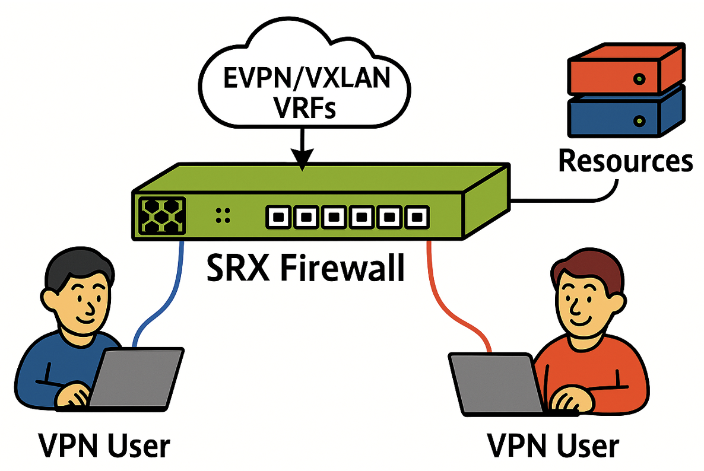

## Introduction

The [Juniper Secure Connect (JSC)](https://www.juniper.net/documentation/us/en/software/junos/vpn-ipsec/topics/concept/juniper-secure-connect-overview.html) remote access VPN is a traditional Layer 3 (L3) VPN tunnel, ensuring transport security through multi-platform agent add-on software. With the SRX VPN head-end's multi-tenant capabilities, this solution offers effective options for separating VPN tenants without requiring various virtualization technologies, such as logical firewall instances that could complicate the overall setup when direct administrative access delegation is unnecessary.

A challenging aspect of firewall/VPN multi-tenancy is separation, where simple VLANs are typically employed to manage access to resources. In contrast, the SRX direct breakout to VRFs introduces an additional dimension through VXLAN VNI and/or MPLS labels. This approach not only mitigates potential scaling challenges in larger environments and simplifies configuration files but may also reduce the necessity for extra networking equipment.

The VRF dimension was considered in SRX policies since Junos 22.4 as part of the firewall rule match criteria. With Junos 25.4, the introduction of [VRF to zone binding](https://www.juniper.net/documentation/us/en/software/junos/security-policies/topics/topic-map/security-policies-vrf-aware-zone-based-routing-instances.html) means that the zone VRF assignment sets the context for matching firewall rules. In modern switching fabrics based on EVPN/VXLAN, the SRX's ability to integrate directly adds value regarding resource consolidation, easier administration, and without compromising [networking security for enterprises or large data centers](https://www.juniper.net/content/dam/www/assets/white-papers/us/en/2025/delivering-a-secure-end-to-end-ai-data-center-solution.pdf).

Finally, there can be challenges in steering firewall controls and providing visibility without user awareness throughout the entire SRX deployment, including for remote access users. With Junos 24.4, the older SYSLOG parsing based propagation of user to IP address mapping via JIMS has been replaced by a direct push of the username and VPN tunnel IP address to JIMS. This can be a fully sovereign on-premises solution, potentially complementing the ZTNA aspect of the [HPE Aruba Networking SSE solution](https://www.hpe.com/cz/en/solutions/axis-security.html).

Prerequisites for building the demo environment discussed below include skills in Junos/SRX, possibly a virtualization environment; and, when expanded by user awareness, also the basics of Windows Server for setting up Active Directory (AD) and MS NAP RADIUS services.

## High-level Demo Setup Breakdown

Before diving into configuration details, let's break down the individual components and feature functions of the demo environment depicted below. The goal is to provide authentication, authorization, and tenant separation for the green (T1) and blue (T2) tenants for connections coming in from remote access VPN clients terminated on the SRX Firewall, breaking out into the EVPN/VXLAN VRF and eventually reaching the corresponding resources on the right side. The SRX Router, which breaks out traffic from VRF to regular VLAN, is also made user-aware. Both SRX devices in this demo setup are vSRX 3.0 instances.

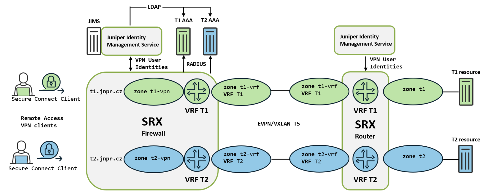

## Client-side

The client side consists of two endpoints with deployed JSC software, represented in the demo setup by Windows 11 VMs for the green and blue tenants. The green tenant connects to the *t1.jnpr.cz* URL as its VRF entry point, while the blue tenant connects to the *t2.jnpr.cz* URL. Upon providing credentials, the JSC client downloads settings from the SRX via a TLS-encrypted channel and establishes an IPSEC-based VPN to the SRX head-end. In cases where traditional UDP-based NAT-Traversal (NAT-T) is blocked, optional fallback to TCP or TCP+TLS wrapping of IPSEC aids in traversing such networks; the latter also allows NGFW filtering of non-TLS traffic on TCP port 443.

From the perspective of firewall rules, *user01* overlapping with the same username in *t1.local* and *t2.local domains* has all services toward the VRF (still VPN traffic selectors set the scope) permitted on the SRX Firewall (based on t1g1 and t2g1 group membership), while the L7 application is only logged.

*User02* from both domains is permitted to only SSH at the application level and ICMP echo requests (based on *t1g2* or *t2g2* groups).

The tenants could include [third-party VPN clients](https://juniper.github.io/techposts/com-android-ipsec-ikev2-vs-srx/article); however, JSC--JIMS integration would need to be changed to the older SYSLOG parsing-based method, as only JSC clients are considered.

## SRX Firewall

The SRX Firewall exposes the two mentioned portals for clients to connect. Each portal has its own TLS certificate issued for demo purposes by the Let's Encrypt authority using the [ACME](https://www.juniper.net/documentation/us/en/software/junos/pki/topics/topic-map/enroll-certificates.html#id_ikf_m2t_lfc) protocol. The certificate aspect, in its most simplistic form, could also be addressed by utilizing a common certificate with Subject Alternative Names (SAN) and/or by using the path attribute of the URL to distinguish tenants. For demo purposes, two distinct certificates have been selected; however, a combination of path names, SANs, and multiple certificates would also work. The certificates are also used as part of the IKE handshake with EAP-based user authentication.

The certificates issued by Let's Encrypt require the SRX to be temporarily internet reachable on TCP port 80 for validating certificate requests, as well as having DNS infrastructure with records for the tenant portals. In environments where Enterprise CAs are deployed, the approaches from the PKI section of [Android/SRX dial-up VPN](https://juniper.github.io/techposts/com-android-ipsec-ikev2-vs-srx/article) article can be applied.

The SRX can optionally impose restrictions on the connecting JSC client based on configured endpoint attributes, as described in the [JSC user guide](https://www.juniper.net/documentation/us/en/software/secure-connect/secure-connect-user-guide/secure-connect-user-guide.pdf).

Authentication and authorization are traditionally handled via username and password with tenant-specific RADIUS backends (T1 AAA and T2 AAA, respectively). In this setup, each tenant uses its own MS NPS (Network Policy Server) RADIUS service on an AD-enabled Windows server. Users are validated for specific Active Directory (AD) group membership, which determines eligibility for remote access. The setup could consist of a single RADIUS, where the SRX would appear as two distinct RADIUS clients for both t1.jnpr.cz and t2.jnpr.cz VRF entry points respectively, ensuring safe authorization of user groups to their entry points.

IP address allocation is done from the SRX local IP pool. The option to allocate static IP addresses can utilize the Framed-IP-address attribute returned in the RADIUS response when it is defined in the AD user profile. The SRX also features RADIUS accounting for external IP pool management and potentially username-to-IP address mappings in advanced AAA services like [HPE Networking ClearPass](https://www.hpe.com/asia_pac/en/aruba-clearpass-policy-manager.html).

Finally, upon successful user authentication and IP address allocation, the SRX pushes the username and IP address mapping, along with the domain name configured as part of the remote access profile, to JIMS. After user disconnection, either due to DPD or a user-triggered event, the reverse process removes the user from the authentication tables.

> Note: The username/password style is strengthened by a second factor for production environments. The easiest being a push notification to a mobile device, where the user acknowledges the Remote Access attempt. In more advanced setups, the [Junos 24.4 JSC SAML](https://www.juniper.net/documentation/us/en/software/secure-connect/secure-connect-user-guide/topics/concept/saml-authentication-in-secure-connect.html) implementation could also be utilized.

## JIMS and AAA

The JIMS service resides on a Windows 2019 server instance. Both SRX devices establish an identity-management connection to JIMS. Upon receiving the username and IP address when the JSC client connection is initiated, the JIMS service retrieves group membership, selecting the tenant-specific LDAP based on the domain name configured as part of the VPN profile. Finally, the SRX queries the JIMS instance for user-IP mapping and group membership (roles in SRX terminology) where the security policies contain a source-identity match.

There is no Windows domain integration between the Windows server systems. The machine with JIMS is standalone, while the tenant-specific Windows 2019 servers function as separate domain controllers with AD and NPS RADIUS services, which are queried by JIMS using LDAP. These could also operate in a VRF network to achieve separation, as the SRX has the ability to configure a source routing instance for reaching RADIUS servers. The JIMS service is typically reachable via the management network, as demonstrated in the demo setup.

The SRX Router with permissive policies in the VRFs, has user visibility by enabling source-identity logging on the zone. Effectively, the identities of VPN users are propagated from the SRX Firewall to the entire SRX infrastructure.

Sidenote: The JIMS instance can merge user authentication and authorization into a single system; however, users would appear in a flat authentication table under a common domain.

## EVPN/VXLAN T5

The SRX EVPN/VXLAN fabric integration, covered in this article in its most basic form between two SRX instances, is based on SRX Junos 22.4 Type 5 support, with detailed coverage available in an older [SRX EVPN/VXLAN T5 oIPSEC](https://juniper.github.io/techposts/srx-evpnvxlan-t5-oipsec/article) Tech Post. If IPSEC is disabled in the configuration described in the referenced article, the right SRX functions as a Type 5 integrated firewall, the left SRX acts as a leaf switch, and the middle SRX serves as the spine switch, collectively forming the simplest form of a fabric.

Similarly, this article discusses dynamic routing involved in propagating loopback addresses for VXLAN termination. However, unlike the older tech post, OSPF is used between SRX instances in the underlay for the sake of simplicity. Multi-hop BGP with EVPN signaling is configured for the EVPN overlay. Individual VRFs are distinguished by VNI, route distinguishers, and VRF targets.

VRF to zone mapping (Junos 25.4) eliminates the need for VRF groups to match VRFs in individual policies. Previous solutions (described in the linked tech post), poses scalability and manageability challenges related to the ingress underlay interface zone or global zone functioning as the ingress zone context. With 25.4 policies for individual tenants can match in their own zone context (e.g., ingress from IPSEC VPN, egress to zone binding for either the blue or green VRF), making the firewall policies more decomposable and transparent to GUI tools like the [Security Director](https://www.juniper.net/gb/en/products/security/security-director-network-security-management.html).

The flows between the VPN client and resources are controlled after successful user authentication and authorization, facilitated by a user-role firewall that includes L3 through L7 policy. This process is preceded by transport encryption and followed by VXLAN wrapping and unwrapping, VLAN tagging, and finally reaching the destination resources.

## Accessed Resources

Accessed Resources are SSH-enabled Linux instances that respond to ICMP echo requests. In this demo setup, they are represented by Linux namespaces, as described in the SRX EVPN/VXLAN T5 oIPSEC, Appendix 2. However, these could also be any other systems in the form of virtual machines or containers.

## Detailed Configuration Breakdown

After the high-level overview, let's dive into the details of the demo setup:

## SRX Firewall

The first component to look at is the SRX Firewall, the VPN head-end, where the configuration structure is organized in Junos groups with common part for both JSC configuration, EVPN VXLAN T5 and the specific tenant configurations; PKI part is for technical reasons kept in the flat hierarchy as explained below. The entire configurations for both SRX devices are in Appendix 1, but for complete functionality on SRX Firewall, the PKI related steps producing extra configuration and crypto material aside of the configuration file, need to be followed.

### Global configuration

As a first prerequisite, the new SRX IKE control plane package with IKED must be deployed. This provides JSC JIMS integration and ARI-TS type route export. Of note, the older KMD is no longer recommended, although installed by default on the vSRX 3.0 platform with Junos 25.4R1.

To check if IKED is installed:

```
show version | match ike 
JUNOS ike [20251216.154259_builder_junos_254_r1]
```

The corresponding command for installing IKED on vSRX and the SRX4100/4200/4600 series is:

```
request system software add optional://junos-ike.tgz 
```

> Note: Platforms such as the SRX1600, SRX2300, SRX4120, SRX4300, SRX4700 and SPC3/RE3 already have IKED installed. Branch SRX3xx models do not support IKED.

The following lines configure, most importantly, a dedicated routing instance for the management interface. This is regarded as industry best practice. The technical reason for this is that the ACME HTTP listener, which serves the challenge response during certificate enrollment, is bound to the master routing instance inet.0. In this specific setup, fxp0 overlaps in the same IP prefix with the interface that serves as the default gateway for other systems and hosts also fxp0 (the SRX has a default gateway to itself). Therefore, it's easier to keep infrastructure interfaces in inet.0 and fxp0 in the mgmt_junos management instance. Naturally, some services like SYSLOG, DNS, and NTP need to originate from mgmt_junos. Additionally, logging is configured to separate remote access logs into a log file vpn:

```
set version 25.4R1.12
set system host-name vsrx1
set system services ssh 
set system time-zone Europe/Prague
set system management-instance
set system name-server 10.0.0.1 routing-instance mgmt_junos
set system ntp server 10.0.0.1 routing-instance mgmt_junos


set system syslog host 10.0.10.10 any any
set system syslog host 10.0.10.10 routing-instance mgmt_junos
set system syslog file messages any any
set system syslog file messages match "!(iked|REMOTE_ACCESS_VPN_)"
set system syslog file messages archive size 5m
set system syslog file messages archive files 4
set system syslog file vpn any any
set system syslog file vpn match "(iked|REMOTE_ACCESS_VPN_)"
set system syslog file vpn archive size 5m
set system syslog file vpn archive files 4
```

Sidenote: naturally, root authentication and other administrative settings must be added.

Logging is configured for stream mode to avoid overhead on the routing engine. The report keyword enables the local logging infrastructure (e.g., > show security log report in-detail all), while stream refers to traditional remote SYSLOG logging:

```
set security log mode stream
set security log format sd-syslog
set security log report
set security log source-interface ge-0/0/0.0
set security log stream host format sd-syslog
set security log stream host category all
set security log stream host host 10.0.10.10
```

The next block enables application identification, which is automatically configured as part of AppID provisioning. Detailed steps to enable AppID, including licensing, are provided in Appendix 4: SRX Application Identification, in the [SRX MPLS in Flow TechPost](https://juniper.github.io/techposts/srx-mpls-in-flow/article).

```
set services application-identification
```

Enhanced services mode allocates more memory to L7 processing during boot time on platforms like the branch SRX and vSRX, while reducing overall session capacity. For example, on the vSRX with 4GB of RAM, the session capacity is reduced from 524.288 to 262.144 sessions:

```
set security forwarding-process enhanced-services-mode
```

The interface and routing configuration, while possibly non-traditionally, involves using the same prefix on fxp0.0 and ge-0/0/0.0:

```
set interfaces ge-0/0/0 description mgmt
set interfaces ge-0/0/0 unit 0 family inet address 10.0.10.1/24
set interfaces ge-0/0/2 description untrust
set interfaces ge-0/0/2 unit 0 family inet address 89.187.136.169/27
set interfaces fxp0 unit 0 family inet address 10.0.10.2/24

set routing-instances mgmt_junos routing-options static route 0.0.0.0/0 next-hop 10.0.10.1
set routing-instances mgmt_junos routing-options static route 10.0.0.0/24 next-hop 10.0.10.10

set routing-options static route 0.0.0.0/0 next-hop 89.187.136.161
set routing-options static route 10.0.0.0/24 next-hop 10.0.10.10
```

The base zone and policy configuration includes a noteworthy aspect: permitting HTTP service on the untrust side for the purposes of Let's Encrypt certificate enrolment. The HTTP listener is available only during the enrolment itself, returning TCP RST otherwise from a non-listening socket (can be prevented by output firewall filter). The pre-id-default-policy settings ensure logging of traffic stalled during AppID process, which should typically not occur. Finally, NAT is configured for traffic in the management segment, including the fxp0 interface:

```
set security zones security-zone mgmt tcp-rst
set security zones security-zone mgmt interfaces ge-0/0/0.0 host-inbound-traffic system-services ping

set security zones security-zone untrust interfaces ge-0/0/2.0 host-inbound-traffic system-services ping
set security zones security-zone untrust interfaces ge-0/0/2.0 host-inbound-traffic system-services http

set security policies from-zone mgmt to-zone untrust policy permit-mgmt match source-address any
set security policies from-zone mgmt to-zone untrust policy permit-mgmt match destination-address any
set security policies from-zone mgmt to-zone untrust policy permit-mgmt match application any
set security policies from-zone mgmt to-zone untrust policy permit-mgmt then permit
set security policies from-zone mgmt to-zone untrust policy permit-mgmt then log session-close

set security policies pre-id-default-policy then log session-close
set security policies pre-id-default-policy then log session-update 10

set security nat source rule-set untrust from zone mgmt
set security nat source rule-set untrust to zone untrust
set security nat source rule-set untrust rule untrust match source-address 0.0.0.0/0
set security nat source rule-set untrust rule untrust match destination-address 0.0.0.0/0
set security nat source rule-set untrust rule untrust then source-nat interface
```

Flow tuning involves disabling all ALGs (Application Layer Gateways) except for FTP and DNS, enabling strict TCP handshake checks, and out-of-state logging:

```
set security alg h323 disable
set security alg mgcp disable
set security alg msrpc disable
set security alg sunrpc disable
set security alg rtsp disable
set security alg sccp disable
set security alg sip disable
set security alg talk disable
set security alg tftp disable
set security alg pptp disable

set security flow tcp-session strict-syn-check
set security flow packet-log enable
set security flow packet-log throttle-interval 1024
set security flow packet-log packet-filter tcp protocol tcp
```

### PKI

Once the base configuration is complete and the device can reach the internet, PKI can be configured. As mentioned earlier, a prerequisite is the configured DNS infrastructure so that the host names used (in this example, p1.jnpr.cz, t1.jnpr.cz, t2.jnpr.cz) resolve to the public address of the SRX interface (which can be a single IP). The certificate for p1.jnpr.cz domain serves for common purposes like TCP-encapsulation of IPSEC.

The first step is to create CA profiles for the Let's Encrypt chain and enrolment. Revocation checks are performed by the JSC client; however, Let's Encrypt advises against the use of CRLs. Instead, the short certificate lifespan is applied.

```
set security pki ca-profile ISRG_Root_X1 ca-identity ISRG_Root_X1
set security pki ca-profile ISRG_Root_X1 revocation-check disable
set security pki ca-profile Lets_Encrypt_R12 ca-identity Lets_Encrypt_R12
set security pki ca-profile Lets_Encrypt_R12 revocation-check disable
set security pki ca-profile Lets_Encrypt_R13 ca-identity Lets_Encrypt_R13
set security pki ca-profile Lets_Encrypt_R13 revocation-check disable

set security pki ca-profile Lets_Encrypt_ACME ca-identity Lets_Encrypt_ACME
set security pki ca-profile Lets_Encrypt_ACME enrollment url https://acme-v02.api.letsencrypt.org/directory
set security pki ca-profile Lets_Encrypt_ACME revocation-check disable
```

In the next step, the root certificate and current issuing CAs need to be fetched (the default SRX Junos configuration contains the Let's Encrypt X1 CA, but it is typically wiped out when all configuration is removed). Start the shell and then:

```
fetch-secure https://letsencrypt.org/certs/isrgrootx1.pem
fetch-secure https://letsencrypt.org/certs/2024/r12.pem
fetch-secure https://letsencrypt.org/certs/2024/r13.pem
```

Although it indicates "secure," the fetch-secure utility doesn't validate the CA chain. Therefore, a manual check of the downloaded content is recommended; for example, by decomposing the fetched certificate in the Junos shell and visually comparing it to off-band securely downloaded certificates ([X1](https://letsencrypt.org/certs/isrg-root-x1-cross-signed.txt), [R12](https://letsencrypt.org/certs/2024/r12.txt), [R13](https://letsencrypt.org/certs/2024/r13.txt), etc.):

```
openssl x509 -in r12.pem -text -noout
```

Next, the CA certificates need to be loaded into the corresponding CA profiles, one after another. In Junos CLI:

```
request security pki ca-certificate load ca-profile ISRG_Root_X1 filename isrgrootx1.pem 
request security pki ca-certificate load ca-profile Lets_Encrypt_R12 filename r12.pem
request security pki ca-certificate load ca-profile Lets_Encrypt_R13 filename r13.pem  
```

In the next step, an ACME API key pair and the actual certificate request key pair need to be created, starting with the common certificate (e.g., used by TCP/SSL VPN transport). This is followed by ACME enrollment:

```
request security pki generate-key-pair size 2048 type rsa acme-key-id p1-acme-key
request security pki generate-key-pair size 2048 type rsa certificate-id p1-acme-cert

request security pki local-certificate enroll acme acme-key-id p1-acme-key ca-profile Lets_Encrypt_ACME certificate-id p1-acme-cert domain-names p1.jnpr.cz email admin@p1.jnpr.cz letsencrypt-enrollment yes terms-of-service agree
```

Sidenote: enrollment requires the interface to be reachable on TCP port 80 as part of the master routing instance inet.0. Otherwise, workarounds such as destination NAT of port 80 to any interface (including fxp0) bound to master routing instance are needed.

The same procedure applies for the Tenant 1 Let's Encrypt certificate:

```
request security pki generate-key-pair size 2048 type rsa acme-key-id t1-acme-key
request security pki generate-key-pair size 2048 type rsa certificate-id t1-acme-cert

request security pki local-certificate enroll acme acme-key-id t1-acme-key ca-profile Lets_Encrypt_ACME certificate-id t1-acme-cert domain-names t1.jnpr.cz email admin@t1.jnpr.cz letsencrypt-enrollment yes terms-of-service agree
```

And for Tenant 2:

```
request security pki generate-key-pair size 2048 type rsa acme-key-id t2-acme-key
request security pki generate-key-pair size 2048 type rsa certificate-id t2-acme-cert

request security pki local-certificate enroll acme acme-key-id t2-acme-key ca-profile Lets_Encrypt_ACME certificate-id t2-acme-cert domain-names t2.jnpr.cz email admin@t2.jnpr.cz letsencrypt-enrollment yes terms-of-service agree
```

The following logs indicate successful certificate enrollment:

```
show log messages | match PKID_ACME_EE_CERT_ENROLL

pkid[18143]: PKID_ACME_EE_CERT_ENROLL: End-entity certificate p1-acme-cert enrolled successfully
pkid[18143]: PKID_ACME_EE_CERT_ENROLL: End-entity certificate t1-acme-cert enrolled successfully
pkid[18143]: PKID_ACME_EE_CERT_ENROLL: End-entity certificate t2-acme-cert enrolled successfully
```

As part of the enrollment process, the following configuration is automatically added to the configuration file:

```
set security pki auto-re-enrollment acme certificate-id p1-acme-cert re-enroll-time days 25
set security pki auto-re-enrollment acme certificate-id p1-acme-cert acme-key-id p1-acme-key
set security pki auto-re-enrollment acme certificate-id p1-acme-cert ca-profile-name Lets_Encrypt_ACME
set security pki auto-re-enrollment acme certificate-id p1-acme-cert re-enroll-trigger-time-percentage 72
set security pki auto-re-enrollment acme certificate-id p1-acme-cert re-generate-keypair

set security pki auto-re-enrollment acme certificate-id t1-acme-cert re-enroll-time days 25
set security pki auto-re-enrollment acme certificate-id t1-acme-cert acme-key-id t1-acme-key
set security pki auto-re-enrollment acme certificate-id t1-acme-cert ca-profile-name Lets_Encrypt_ACME
set security pki auto-re-enrollment acme certificate-id t1-acme-cert re-enroll-trigger-time-percentage 72
set security pki auto-re-enrollment acme certificate-id t1-acme-cert re-generate-keypair

set security pki auto-re-enrollment acme certificate-id t2-acme-cert re-enroll-time days 25
set security pki auto-re-enrollment acme certificate-id t2-acme-cert acme-key-id t2-acme-key
set security pki auto-re-enrollment acme certificate-id t2-acme-cert ca-profile-name Lets_Encrypt_ACME
set security pki auto-re-enrollment acme certificate-id t2-acme-cert re-enroll-trigger-time-percentage 72
set security pki auto-re-enrollment acme certificate-id t2-acme-cert re-generate-keypair

set security pki acme-account-key acme-key-id p1-acme-key
set security pki acme-account-key acme-key-id t1-acme-key
set security pki acme-account-key acme-key-id t2-acme-key
```

The certificates can be viewed using the following command:

```
show security pki local-certificate certificate-id p1-acme-cert 

LSYS: root-logical-system
Certificate identifier: p1-acme-cert
  Issued to: p1.jnpr.cz, Issued by: C = US, O = Let's Encrypt, CN = R13
  Validity:
    Not before: 01- 2-2026 09:55 UTC
    Not after: 04- 2-2026 09:55 UTC
  Public key algorithm: rsaEncryption(2048 bits)
  Keypair Location: Keypair generated locally
```

Finally, validation to confirm, the certificate chain is correctly loaded:

```
request security pki local-certificate verify certificate-id p1-acme-cert 
local certificate p1-acme-cert verification success

request security pki local-certificate verify certificate-id t1-acme-cert    
local certificate t1-acme-cert verification success

request security pki local-certificate verify certificate-id t2-acme-cert    
local certificate t2-acme-cert verification success
```

### JSC Common

The JSC common part configures shared settings for all JSC tenants, primarily focusing on infrastructure, encryption, and identity management (JIMS) settings. By default, each SRX permits two concurrent JSC clients as part of the base license; additional clients require a license.

The first setting establishes the group context for subsequent configuration stanzas and adds an optional hidden flag omit, which disables group content listing during running show config commands, making only the global configuration visible by default:

```
top edit groups jsc-common
set apply-flags omit
```

Sidenote: with the omit flag, the related configuration group contents are not saved when saving the configuration to a file in traditional {} format! The set format ( ... | display set | save ... ) includes the contents of omitted groups.

JSC must have host-inbound services enabled: https for the JSC control plane, tcp-encap for JSC TCP/SSL fallback (if IPSEC NAT-T traffic is blocked), and ike, thereby expanding the global configuration:

```
set security zones security-zone untrust interfaces ge-0/0/2.0 host-inbound-traffic system-services https
set security zones security-zone untrust interfaces ge-0/0/2.0 host-inbound-traffic system-services tcp-encap
set security zones security-zone untrust interfaces ge-0/0/2.0 host-inbound-traffic system-services ike
```

The web-management part is mandatory for the JSC client to enable the portal for configuration downloads and to support virtual domains for individual tenant filters merged from the tenant-specific configuration groups below. By binding web-management to fxp0.0, Jweb management (if installed) is not attached to external interface. SSL termination works in conjunction with the mentioned tcp-encap feature:

```
set system services web-management https pki-local-certificate p1-acme-cert
set system services web-management https interface fxp0.0

set services ssl termination profile ssl-term-p1 preferred-ciphers custom
set services ssl termination profile ssl-term-p1 custom-ciphers tls13-with-aes-256-gcm-sha384
set services ssl termination profile ssl-term-p1 custom-ciphers tls12-ecdhe-rsa-aes-128-gcm-sha256
set services ssl termination profile ssl-term-p1 server-certificate p1-acme-cert

set security tcp-encap profile tcp-encap-p1 ssl-profile ssl-term-p1
set security tcp-encap profile tcp-encap-p1 log
```

Sidenote: to trigger JSC fallback to TCP or TCP/SSL transport, it is suggested to externally block UDP ports 500 and 4500. Various methods, such as on-box stateless firewall filters, can be tricky due to the traffic being unwrapped internally to its original form before being processed by the stateless filter.

Generic settings include conservative TCP MSS clamping to avoid fragmentation, along with the common mandatory JSC authentication settings:

```
set security flow tcp-mss ipsec-vpn mss 1350
set access profile ra-access-profile-common authentication-order radius
set access firewall-authentication web-authentication default-profile ra-access-profile-common
```

Common IKE and IPSEC proposal settings allow for compromises on DH groups for large-scale deployments, especially in platforms without hardware acceleration for DH operations, such as the vSRX:

```
set security ike proposal rsa-g20-aes256-gcm authentication-method rsa-signatures
set security ike proposal rsa-g20-aes256-gcm dh-group group20
set security ike proposal rsa-g20-aes256-gcm encryption-algorithm aes-256-gcm
set security ike proposal rsa-g20-aes256-gcm lifetime-seconds 28800

set security ipsec proposal esp-aes256-gcm encryption-algorithm aes-256-gcm
set security ipsec proposal esp-aes256-gcm lifetime-seconds 3600
set security ipsec policy esp-aes256-gcm-g20 perfect-forward-secrecy keys group20
set security ipsec policy esp-aes256-gcm-g20 proposals esp-aes256-gcm
```

The JIMS Windows service configuration is covered in its own section below. On the SRX, the JIMS control plane connection originates from fxp0, where a common shared secret needs to be configured. The invalid-authentication-entry-timeout, relevant to user entries with no identity information - is set to the minimal time:

```
set services user-identification identity-management invalid-authentication-entry-timeout 10
set services user-identification identity-management connection connect-method https
set services user-identification identity-management connection port 8443
set services user-identification identity-management connection primary address 10.0.0.100
set services user-identification identity-management connection primary client-id p1-vsrx1
set services user-identification identity-management connection primary client-secret "<SNIP>"
set services user-identification identity-management connection primary routing-instance mgmt_junos
```

Sidenotes related to JIMS: to make the authentication table user records appear faster, especially for demos and testing, the batch query time (effectively how frequently the SRX polls JIMS) can be reduced from the default of 5 seconds to 1 second as follows:

```
set services user-identification identity-management batch-query query-interval 1
```

Next, the SRX does not, by default, validate the JIMS service certificate. Using a custom certificate on the JIMS side and enabling SRX validation is described in Appendix 2.

### EVPN/VXLAN T5

The next section contains MTU related tuning and common settings for EVPN/VXLAN Type 5 connectivity shared by tenants, while specific configurations are contained within each tenant Junos configuration group.

The EVPN/VXLAN underlay interface requires attention regarding MTU due to encapsulation overhead. When using a virtual environment, extra tuning may be needed, such as setting up a Linux bridge for the underlay with an expanded MTU, Debian Linux style:

```
auto br-underlay
        iface br-underlay inet manual
        bridge_ports none
        bridge_stp off
        bridge_fd 0
        bridge_maxwait 0
        post-up echo 1 > /sys/class/net/br-underlay/bridge/vlan_filtering
        post-up bridge vlan del dev br-underlay vid 1 self
        post-up ip link set br-underlay mtu 9000
```

Correspondingly, on Linux, the Libvirt XML snippet containing the interface tunable matching bridge MTU:

```
 <interface type='bridge'>
  <mac address='52:54:00:46:b8:80'/>
  <source bridge='br-underlay'/>
  <model type='virtio'/>
  <mtu size='9000'/>
  <address type='pci' domain='0x0000' bus='0x00' slot='0x0c' function='0x0'/>
</interface>     
```

Obligatory group context and the optional omit flag:

```
top edit groups jsc-evvx-t5
set apply-flags omit
```

Now, the SRX Junos side with the reflecting underlay MTU:

```
set interfaces ge-0/0/3 description underlay
set interfaces ge-0/0/3 mtu 9000
set interfaces ge-0/0/3 unit 0 family inet address 100.64.0.1/24
set interfaces lo0 unit 0 family inet address 100.65.0.1/32
```

As noted in the high-level breakdown, this simplistic demo setup uses OSPF to propagate loopback addresses, while the overlay features a multihop-enabled EVPN signaling eBGP session between the loopbacks:

```
set protocols ospf area 0.0.0.0 interface lo0.0 passive
set protocols ospf area 0.0.0.0 interface ge-0/0/3.0 interface-type p2p

set protocols bgp group overlay multihop
set protocols bgp group overlay local-address 100.65.0.1
set protocols bgp group overlay family evpn signaling
set protocols bgp group overlay neighbor 100.65.0.2 peer-as 65002
set protocols bgp group overlay neighbor 100.65.0.2 local-as 65001
```

Underlay and overlay loopback interface binding, along with appropriate host-inbound services, typically include BFD for real-life configurations, which would also be reflected here. The intrazone policy allows BGP sessions only between the two loopbacks:

```
set security zones security-zone underlay interfaces ge-0/0/3.0 host-inbound-traffic system-services ping
set security zones security-zone underlay interfaces ge-0/0/3.0 host-inbound-traffic protocols ospf
set security zones security-zone underlay interfaces lo0.0 host-inbound-traffic system-services ping
set security zones security-zone underlay interfaces lo0.0 host-inbound-traffic protocols bgp

set security address-book global address vsrx2-lo0.0 100.65.0.2/32
set security address-book global address vsrx1-lo0.0 100.65.0.1/32

set security policies from-zone underlay to-zone underlay policy control match source-address vsrx2-lo0.0
set security policies from-zone underlay to-zone underlay policy control match destination-address vsrx1-lo0.0
set security policies from-zone underlay to-zone underlay policy control match application junos-bgp
set security policies from-zone underlay to-zone underlay policy control match application junos-icmp-ping
set security policies from-zone underlay to-zone underlay policy control then permit
```

### JSC Tenant 1

Each tenant has a specific Junos group for easy activation, deactivation, and configuration context, expanding the common JSC and EVPN/VXLAN groups.

To begin with, Tenant 1 group:

```
top edit groups jsc-t1
set apply-flags omit
```

The first tenant-specific setting is the tunnel interface and VRF assignment. A numbered interface is not mandatory; for example, matching traffic selectors and enabled host-inbound services can serve diagnostic purposes (not covered):

```
set interfaces st0 unit 101 description t1
set interfaces st0 unit 101 family inet address 10.0.101.1/24

set security zones security-zone t1-vpn interfaces st0.101
set security zones security-zone t1-vrf vrf t1
```

The access profile configures tenant-specific RADIUS settings, where a shared secret needs to be configured below, and it refers to the address assignment pool that will be configured later. Accounting is a sample that is not practically used with MS NAP RADIUS, but it could be useful for external IP pool management and possibly for mapping usernames to IP addresses by some solutions. A large RADIUS timeout is typically needed with a second-factor solution, such as user acknowledgment via a mobile phone application:

```
set access profile ra-access-profile-t1 authentication-order radius
set access profile ra-access-profile-t1 address-assignment pool ra-address-pool-t1
set access profile ra-access-profile-t1 radius accounting-server 10.0.0.101
set access profile ra-access-profile-t1 radius-server 10.0.0.101 secret "<SNIP>"
set access profile ra-access-profile-t1 radius-server 10.0.0.101 timeout 60
set access profile ra-access-profile-t1 accounting order radius
```

IKE settings refer to the common proposal and link to tenant-specific certificates for the IKEv2 EAP scheme, where the server-side certificate is mandatory. The rest of the configuration sets the proper IKEv2 VPN type for JSC in a self-explanatory manner, binds the AAA profile, and enables per-routing-instance IP assignment pools. While IP pools can overlap, this is not supported by SRX user-role firewall and JIMS as of Junos 25.4R1, although the domain dimension exists. IP addresses must be unique across tenants. Inner IKEv2 fragmentation prevents IP-level fragments typically observed with RSA keys. The TCP encapsulation profile must be the same for all tenants:

```
set security ike policy ra-ike-policy-t1 proposals rsa-g20-aes256-gcm
set security ike policy ra-ike-policy-t1 certificate local-certificate t1-acme-cert

set security ike gateway ra-gateway-t1 ike-policy ra-ike-policy-t1
set security ike gateway ra-gateway-t1 dynamic user-at-hostname "@t1.auth"
set security ike gateway ra-gateway-t1 dynamic ike-user-type shared-ike-id
set security ike gateway ra-gateway-t1 dead-peer-detection probe-idle-tunnel
set security ike gateway ra-gateway-t1 local-identity hostname t1.jnpr.cz
set security ike gateway ra-gateway-t1 external-interface ge-0/0/2.0
set security ike gateway ra-gateway-t1 aaa access-profile ra-access-profile-t1
set security ike gateway ra-gateway-t1 aaa use-routing-instance-address
set security ike gateway ra-gateway-t1 version v2-only
set security ike gateway ra-gateway-t1 fragmentation size 1200
set security ike gateway ra-gateway-t1 tcp-encap-profile tcp-encap-p1
```

IPSEC configuration stanza includes the tunnel interface, links common proposal settings, IKE gateway, and the configuration of traffic selectors that match local networks:

```
set security ipsec vpn ra-vpn-t1 bind-interface st0.101
set security ipsec vpn ra-vpn-t1 ike gateway ra-gateway-t1
set security ipsec vpn ra-vpn-t1 ike ipsec-policy esp-aes256-gcm-g20
set security ipsec vpn ra-vpn-t1 traffic-selector t1-ts1 local-ip 10.1.1.0/24
set security ipsec vpn ra-vpn-t1 traffic-selector t1-ts1 remote-ip 0.0.0.0/0
set security ipsec vpn ra-vpn-t1 traffic-selector t1-ts2 local-ip 10.0.0.0/24
set security ipsec vpn ra-vpn-t1 traffic-selector t1-ts2 remote-ip 0.0.0.0/0
```

The web management section links the specific tenant virtual domain with a certificate, while the remote-access profile settings point to the VPN, the AAA profile, the client configuration, and the tenant-specific domain name for Junos 24.4 JSC JIMS integration. The client configuration section ensures the established VPN reconnects automatically, enables DPD, disables EAP-TLS, sets the domain suffix for DNS lookups, and enables the option to save the password:

```
set system services web-management https virtual-domain t1.jnpr.cz pki-local-certificate t1-acme-cert

set security remote-access profile t1.jnpr.cz ipsec-vpn ra-vpn-t1
set security remote-access profile t1.jnpr.cz access-profile ra-access-profile-t1
set security remote-access profile t1.jnpr.cz client-config client-config-t1
set security remote-access profile t1.jnpr.cz options user-domain t1.local

set security remote-access client-config client-config-t1 connection-mode always
set security remote-access client-config client-config-t1 dead-peer-detection interval 10
set security remote-access client-config client-config-t1 dead-peer-detection threshold 5
set security remote-access client-config client-config-t1 no-eap-tls
set security remote-access client-config client-config-t1 domain-name t1.local
set security remote-access client-config client-config-t1 credentials password
```

Routing-instance specific IP addressing configures the IP range for allocation and attributes, such as the sample DNS setting below. This style of configuration is permitted by the use-routing-instance-address setting in the IKE gateway AAA configuration:

```
set routing-instances t1 access address-assignment pool ra-address-pool-t1 family inet network 10.0.101.0/24
set routing-instances t1 access address-assignment pool ra-address-pool-t1 family inet range ra-ip-range-1 low 10.0.101.10
set routing-instances t1 access address-assignment pool ra-address-pool-t1 family inet range ra-ip-range-1 high 10.0.101.110
set routing-instances t1 access address-assignment pool ra-address-pool-t1 family inet xauth-attributes primary-dns 10.0.0.100/32
```

The export policy using the ARI-TS protocol (Automatic Route Insertion: Traffic Selector) exports /32 prefixes allocated to individual clients. While a static export of a prefix matching the assignment pool could be feasible, similar configurations can apply to scenarios where a static IP address is provided by a RADIUS backend, and the client has the option of multiple entry points. In such cases, dynamic routing ensures proper reverse routing to the statically assigned IP address, regardless of the user's connection location. The tenant-specific VRF settings configure unique parameters such as the VPN, route distinguisher, and VRF target, with a detailed description provided in the previously linked [SRX EVPN/VXLAN T5 oIPSEC tech post](https://juniper.github.io/techposts/srx-evpnvxlan-t5-oipsec/article).

```
set policy-options policy-statement export-t1 term 1 from protocol ari-ts
set policy-options policy-statement export-t1 term 1 from interface st0.101
set policy-options policy-statement export-t1 term 1 then accept
set policy-options policy-statement export-t1 term 100 then reject

set routing-instances t1 instance-type vrf
set routing-instances t1 protocols evpn ip-prefix-routes advertise direct-nexthop
set routing-instances t1 protocols evpn ip-prefix-routes encapsulation vxlan
set routing-instances t1 protocols evpn ip-prefix-routes vni 101
set routing-instances t1 protocols evpn ip-prefix-routes export export-t1
set routing-instances t1 interface st0.101
set routing-instances t1 route-distinguisher 100.65.0.1:101
set routing-instances t1 vrf-target target:65001:101
```

Finally, security policies permit any L4 service (while tracking applications) for AD group t1g1 members, and allow SSH and ICMP-Echo for t1g2 members. Both policies include session-close logging. The final global policy is for tracking denied traffic from the zone to which the tunnel interface is bound by using from-zone match:

```
set security policies from-zone t1-vpn to-zone t1-vrf policy permit-g1 match source-address any
set security policies from-zone t1-vpn to-zone t1-vrf policy permit-g1 match destination-address any
set security policies from-zone t1-vpn to-zone t1-vrf policy permit-g1 match application any
set security policies from-zone t1-vpn to-zone t1-vrf policy permit-g1 match source-identity "t1.local\t1g1"
set security policies from-zone t1-vpn to-zone t1-vrf policy permit-g1 match dynamic-application any
set security policies from-zone t1-vpn to-zone t1-vrf policy permit-g1 then permit
set security policies from-zone t1-vpn to-zone t1-vrf policy permit-g1 then log session-close

set security policies from-zone t1-vpn to-zone t1-vrf policy permit-g2 match source-address any
set security policies from-zone t1-vpn to-zone t1-vrf policy permit-g2 match destination-address any
set security policies from-zone t1-vpn to-zone t1-vrf policy permit-g2 match application junos-icmp-ping
set security policies from-zone t1-vpn to-zone t1-vrf policy permit-g2 match application junos-ssh
set security policies from-zone t1-vpn to-zone t1-vrf policy permit-g2 match source-identity "t1.local\t1g2"
set security policies from-zone t1-vpn to-zone t1-vrf policy permit-g2 match dynamic-application junos:SSH
set security policies from-zone t1-vpn to-zone t1-vrf policy permit-g2 match dynamic-application junos:ICMP-ECHO
set security policies from-zone t1-vpn to-zone t1-vrf policy permit-g2 then permit
set security policies from-zone t1-vpn to-zone t1-vrf policy permit-g2 then log session-close

set security policies global policy deny-t1 match source-address any
set security policies global policy deny-t1 match destination-address any
set security policies global policy deny-t1 match application any
set security policies global policy deny-t1 match dynamic-application any
set security policies global policy deny-t1 match from-zone t1-vpn
set security policies global policy deny-t1 then deny
set security policies global policy deny-t1 then log session-init
```

### JSC Tenant 2

The Tenant 2 settings mirror those of Tenant 1, except for the highlighted parts below (typically subject to automated provisioning). Unlike the previous configuration breakdown, the order follows the Junos show configuration command:

```
top edit groups jsc-t2
set apply-flags omit
set system services web-management https virtual-domain t2.jnpr.cz pki-local-certificate t2-acme-cert
set security ike policy ra-ike-policy-t2 proposals rsa-g20-aes256-gcm
set security ike policy ra-ike-policy-t2 certificate local-certificate t2-acme-cert
set security ike gateway ra-gateway-t2 ike-policy ra-ike-policy-t2
set security ike gateway ra-gateway-t2 dynamic user-at-hostname "@t2.auth"
set security ike gateway ra-gateway-t2 dynamic ike-user-type shared-ike-id
set security ike gateway ra-gateway-t2 dead-peer-detection probe-idle-tunnel
set security ike gateway ra-gateway-t2 local-identity hostname t2.jnpr.cz
set security ike gateway ra-gateway-t2 external-interface ge-0/0/2.0
set security ike gateway ra-gateway-t2 aaa access-profile ra-access-profile-t2
set security ike gateway ra-gateway-t2 aaa use-routing-instance-address
set security ike gateway ra-gateway-t2 version v2-only
set security ike gateway ra-gateway-t2 fragmentation size 1200
set security ike gateway ra-gateway-t2 tcp-encap-profile tcp-encap-p1
set security ipsec vpn ra-vpn-t2 bind-interface st0.102
set security ipsec vpn ra-vpn-t2 ike gateway ra-gateway-t2
set security ipsec vpn ra-vpn-t2 ike ipsec-policy esp-aes256-gcm-g20
set security ipsec vpn ra-vpn-t2 traffic-selector t2-ts1 local-ip 10.1.1.0/24
set security ipsec vpn ra-vpn-t2 traffic-selector t2-ts1 remote-ip 0.0.0.0/0
set security ipsec vpn ra-vpn-t2 traffic-selector t2-ts2 local-ip 10.0.0.0/24
set security ipsec vpn ra-vpn-t2 traffic-selector t2-ts2 remote-ip 0.0.0.0/0
set security remote-access profile t2.jnpr.cz ipsec-vpn ra-vpn-t2
set security remote-access profile t2.jnpr.cz access-profile ra-access-profile-t2
set security remote-access profile t2.jnpr.cz client-config client-config-t2
set security remote-access profile t2.jnpr.cz options user-domain t2.local
set security remote-access client-config client-config-t2 connection-mode always
set security remote-access client-config client-config-t2 dead-peer-detection interval 10
set security remote-access client-config client-config-t2 dead-peer-detection threshold 5
set security remote-access client-config client-config-t2 no-eap-tls
set security remote-access client-config client-config-t2 domain-name t2.local
set security remote-access client-config client-config-t2 credentials password
set security zones security-zone t2-vpn interfaces st0.102
set security zones security-zone t2-vrf vrf t2
set security policies from-zone t2-vpn to-zone t2-vrf policy permit-g1 match source-address any
set security policies from-zone t2-vpn to-zone t2-vrf policy permit-g1 match destination-address any
set security policies from-zone t2-vpn to-zone t2-vrf policy permit-g1 match application any
set security policies from-zone t2-vpn to-zone t2-vrf policy permit-g1 match source-identity "t2.local\t2g1"
set security policies from-zone t2-vpn to-zone t2-vrf policy permit-g1 match dynamic-application any
set security policies from-zone t2-vpn to-zone t2-vrf policy permit-g1 then permit
set security policies from-zone t2-vpn to-zone t2-vrf policy permit-g1 then log session-close
set security policies from-zone t2-vpn to-zone t2-vrf policy permit-g2 match source-address any
set security policies from-zone t2-vpn to-zone t2-vrf policy permit-g2 match destination-address any
set security policies from-zone t2-vpn to-zone t2-vrf policy permit-g2 match application junos-icmp-ping
set security policies from-zone t2-vpn to-zone t2-vrf policy permit-g2 match application junos-ssh
set security policies from-zone t2-vpn to-zone t2-vrf policy permit-g2 match source-identity "t2.local\t2g2"
set security policies from-zone t2-vpn to-zone t2-vrf policy permit-g2 match dynamic-application junos:SSH
set security policies from-zone t2-vpn to-zone t2-vrf policy permit-g2 match dynamic-application junos:ICMP-ECHO
set security policies from-zone t2-vpn to-zone t2-vrf policy permit-g2 then permit
set security policies from-zone t2-vpn to-zone t2-vrf policy permit-g2 then log session-close
set security policies global policy deny-t2 match source-address any
set security policies global policy deny-t2 match destination-address any
set security policies global policy deny-t2 match application any
set security policies global policy deny-t2 match dynamic-application any
set security policies global policy deny-t2 match from-zone t2-vpn
set security policies global policy deny-t2 then deny
set security policies global policy deny-t2 then log session-init
set interfaces st0 unit 102 description t2
set interfaces st0 unit 102 family inet address 10.0.102.1/24
set policy-options policy-statement export-t2 term 1 from protocol ari-ts
set policy-options policy-statement export-t2 term 1 from interface st0.102
set policy-options policy-statement export-t2 term 1 then accept
set policy-options policy-statement export-t2 term 100 then reject
set access profile ra-access-profile-t2 authentication-order radius
set access profile ra-access-profile-t2 address-assignment pool ra-address-pool-t2
set access profile ra-access-profile-t2 radius accounting-server 10.0.0.102
set access profile ra-access-profile-t2 radius-server 10.0.0.102 secret "<SNIP>"
set access profile ra-access-profile-t2 radius-server 10.0.0.102 timeout 60
set access profile ra-access-profile-t2 accounting order radius
set routing-instances t2 instance-type vrf
set routing-instances t2 protocols evpn ip-prefix-routes advertise direct-nexthop
set routing-instances t2 protocols evpn ip-prefix-routes encapsulation vxlan
set routing-instances t2 protocols evpn ip-prefix-routes vni 102
set routing-instances t2 protocols evpn ip-prefix-routes export export-t2
set routing-instances t2 interface st0.102
set routing-instances t2 access address-assignment pool ra-address-pool-t2 family inet network 10.0.102.0/24
set routing-instances t2 access address-assignment pool ra-address-pool-t2 family inet range ra-ip-range-1 low 10.0.102.10
set routing-instances t2 access address-assignment pool ra-address-pool-t2 family inet range ra-ip-range-1 high 10.0.102.110
set routing-instances t2 access address-assignment pool ra-address-pool-t2 family inet xauth-attributes primary-dns 10.0.0.100/32
set routing-instances t2 route-distinguisher 100.65.0.1:102
set routing-instances t2 vrf-target target:65001:102
```

### Applying Groups

Finally, to make the Junos groups effective:

```
top
set apply-groups jsc-common
set apply-groups jsc-evvx-t5
set apply-groups jsc-t1
set apply-groups jsc-t2
```

## SRX Router

The SRX Router serves as a substitute for leaf equipment in this simplistic setup, where VXLAN traffic is unwrapped and targets the destination system. It also showcases the VPN user identity propagation from JIMS, using the SRX Firewall as an identity provider that cascades the identity via JIMS to the SRX Router. This configuration involves Junos 25.4 VRF to zone mapping, where traffic traverses from the VRF to a VLAN-tagged interface toward the destination resource. Some components are described in more detail in the SRX Firewall section.

### Global Configuration

Similar to the previously described global configuration of the SRX Firewall, the following configuration adds the basics of management instance settings, DNS, NTP, SYSLOG infrastructure, basic logging, ALG, and flow tunables, along with management interface addressing:

```
set version 25.4R1.12
set system host-name vsrx2
set system services ssh
set system time-zone Europe/Prague
set system management-instance
set system name-server 10.0.0.1 routing-instance mgmt_junos
set system ntp server 10.0.0.1 routing-instance mgmt_junos

set system syslog host 10.0.10.10 any any
set system syslog host 10.0.10.10 routing-instance mgmt_junos
set system syslog file messages any any
set system syslog file messages archive size 5m
set system syslog file messages archive files 4

set security log mode stream
set security log report

set security alg h323 disable
set security alg mgcp disable
set security alg msrpc disable
set security alg sunrpc disable
set security alg rtsp disable
set security alg sccp disable
set security alg sip disable
set security alg talk disable
set security alg tftp disable
set security alg pptp disable

set security flow tcp-session strict-syn-check
set security flow packet-log enable
set security flow packet-log throttle-interval 1024
set security flow packet-log packet-filter tcp protocol tcp

set interfaces fxp0 unit 0 family inet address 10.0.10.3/24
set routing-instances mgmt_junos routing-options static route 0.0.0.0/0 next-hop 10.0.10.1
set routing-instances mgmt_junos routing-options static route 10.0.0.0/24 next-hop 10.0.10.10
```

### JSC Common

The JSC common group contains only the JIMS connectivity configuration for retrieving user identities, where a shared secret must be defined, along with common attributes for the underlay interface:

```
top edit groups jsc-common
set apply-flags omit

set services user-identification identity-management invalid-authentication-entry-timeout 10
set services user-identification identity-management connection connect-method https
set services user-identification identity-management connection port 8443
set services user-identification identity-management connection primary address 10.0.0.100
set services user-identification identity-management connection primary client-id p1-vsrx2
set services user-identification identity-management connection primary client-secret "<SNIP>"
set services user-identification identity-management connection primary routing-instance mgmt_junos

set interfaces ge-0/0/2 description tenants
set interfaces ge-0/0/2 vlan-tagging
```

### EVPN/VXLAN T5

The common group carrying EVPN/VXLAN Type 5 settings closely mirrors the one on the SRX firewall, including underlay, overlay, zones, and overlay firewall policy control. Naturally, the underlay must have the same MTU settings as described in the SRX Firewall section:

```
top edit groups jsc-evvx-t5
set apply-flags omit

set interfaces ge-0/0/1 description underlay
set interfaces ge-0/0/1 mtu 9000
set interfaces ge-0/0/1 unit 0 family inet address 100.64.0.2/24
set interfaces lo0 unit 0 family inet address 100.65.0.2/32

set protocols ospf area 0.0.0.0 interface lo0.0 passive
set protocols ospf area 0.0.0.0 interface ge-0/0/1.0 interface-type p2p

set protocols bgp group overlay multihop
set protocols bgp group overlay local-address 100.65.0.2
set protocols bgp group overlay family evpn signaling
set protocols bgp group overlay neighbor 100.65.0.1 peer-as 65001
set protocols bgp group overlay neighbor 100.65.0.1 local-as 65002

set security zones security-zone underlay interfaces ge-0/0/1.0 host-inbound-traffic system-services ping
set security zones security-zone underlay interfaces ge-0/0/1.0 host-inbound-traffic protocols ospf
set security zones security-zone underlay interfaces lo0.0 host-inbound-traffic system-services ping
set security zones security-zone underlay interfaces lo0.0 host-inbound-traffic protocols bgp

set security address-book global address vsrx1-lo0.0 100.65.0.1/32
set security address-book global address vsrx2-lo0.0 100.65.0.2/32

set security policies from-zone underlay to-zone underlay policy control match source-address vsrx1-lo0.0
set security policies from-zone underlay to-zone underlay policy control match destination-address vsrx2-lo0.0
set security policies from-zone underlay to-zone underlay policy control match application junos-bgp
set security policies from-zone underlay to-zone underlay policy control match application junos-icmp-ping
set security policies from-zone underlay to-zone underlay policy control then permit
```

### Tenant 1

The Tenant 1 group, which expands both the JSC and EVPN/VXLAN groups, is similar to the one in the SRX Firewall section, except that the JSC VPN component is naturally absent. Instead of traffic coming in from VPN users toward VRFs, the traffic flows from VRFs and breaks out to a VLAN-tagged interface. The source-identity-log zone knob is intended to enrich logging in the direction from VRF to VLAN break-out, not the other way around. Finally, the SRX Router exports the default gateway into the VRF by using a discard route.

```
top edit groups jsc-t1
set apply-flags omit

set interfaces ge-0/0/2 unit 81 vlan-id 81
set interfaces ge-0/0/2 unit 81 family inet address 10.1.1.1/24

set security zones security-zone t1-vrf vrf t1
set security zones security-zone t1-vrf source-identity-log
set security zones security-zone t1 interfaces ge-0/0/2.81 host-inbound-traffic system-services ping

set security policies from-zone t1-vrf to-zone t1 policy permit match source-address any
set security policies from-zone t1-vrf to-zone t1 policy permit match destination-address any
set security policies from-zone t1-vrf to-zone t1 policy permit match application any
set security policies from-zone t1-vrf to-zone t1 policy permit then permit
set security policies from-zone t1-vrf to-zone t1 policy permit then log session-close
set security policies from-zone t1 to-zone t1-vrf policy permit match source-address any
set security policies from-zone t1 to-zone t1-vrf policy permit match destination-address any
set security policies from-zone t1 to-zone t1-vrf policy permit match application any
set security policies from-zone t1 to-zone t1-vrf policy permit then permit

set policy-options policy-statement export-t1 term 1 from instance t1
set policy-options policy-statement export-t1 term 1 from route-filter 0.0.0.0/0 exact
set policy-options policy-statement export-t1 term 1 then accept
set policy-options policy-statement export-t1 term 100 then reject

set routing-instances t1 instance-type vrf
set routing-instances t1 routing-options static route 0.0.0.0/0 discard
set routing-instances t1 protocols evpn ip-prefix-routes advertise direct-nexthop
set routing-instances t1 protocols evpn ip-prefix-routes encapsulation vxlan
set routing-instances t1 protocols evpn ip-prefix-routes vni 101
set routing-instances t1 protocols evpn ip-prefix-routes export export-t1
set routing-instances t1 interface ge-0/0/2.81
set routing-instances t1 route-distinguisher 100.65.0.1:101
set routing-instances t1 vrf-target target:65001:101
```

### Tenant 2

The Tenant 2 group, presented in the order of the Junos show configuration listing, includes highlighted differences between tenant settings:

```
top edit groups jsc-t2

set security zones security-zone t2-vrf vrf t2
set security zones security-zone t2-vrf source-identity-log
set security zones security-zone t2 interfaces ge-0/0/2.82 host-inbound-traffic system-services ping
set security policies from-zone t2-vrf to-zone t2 policy permit match source-address any
set security policies from-zone t2-vrf to-zone t2 policy permit match destination-address any
set security policies from-zone t2-vrf to-zone t2 policy permit match application any
set security policies from-zone t2-vrf to-zone t2 policy permit then permit
set security policies from-zone t2-vrf to-zone t2 policy permit then log session-close
set security policies from-zone t2 to-zone t2-vrf policy permit match source-address any
set security policies from-zone t2 to-zone t2-vrf policy permit match destination-address any
set security policies from-zone t2 to-zone t2-vrf policy permit match application any
set security policies from-zone t2 to-zone t2-vrf policy permit then permit
set interfaces ge-0/0/2 unit 82 vlan-id 82
set interfaces ge-0/0/2 unit 82 family inet address 10.1.1.1/24
set policy-options policy-statement export-t2 term 1 from instance t2
set policy-options policy-statement export-t2 term 1 from route-filter 0.0.0.0/0 exact
set policy-options policy-statement export-t2 term 1 then accept
set policy-options policy-statement export-t2 term 100 then reject
set routing-instances t2 instance-type vrf
set routing-instances t2 routing-options static route 0.0.0.0/0 discard
set routing-instances t2 protocols evpn ip-prefix-routes advertise direct-nexthop
set routing-instances t2 protocols evpn ip-prefix-routes encapsulation vxlan
set routing-instances t2 protocols evpn ip-prefix-routes vni 102
set routing-instances t2 protocols evpn ip-prefix-routes export export-t2
set routing-instances t2 interface ge-0/0/2.82
set routing-instances t2 route-distinguisher 100.65.0.1:102
set routing-instances t2 vrf-target target:65001:102
```

### Applying Groups

Finally, to apply the settings in the groups:

```
top
set apply-groups jsc-common
set apply-groups jsc-evvx-t5
set apply-groups jsc-t1
set apply-groups jsc-t2
```

## AAA T1

Let's examine the Windows AD server T1 AAA with the IP address 10.0.0.101, serving the domain t1.local. This server provides NPS RADIUS service for SRX Firewall Tenant 1 VPN user authentication and authorization, as well as LDAP service for JIMS to determine group membership.

### AD Groups

In this example, two users and three groups are enrolled in AD. The jsc group includes both user01 and user02, with user01 belonging to t1g1 and user02 belonging to t1g2:

### NPS Settings

The NPS service needs to be registered in AD (greyed out means already registered):

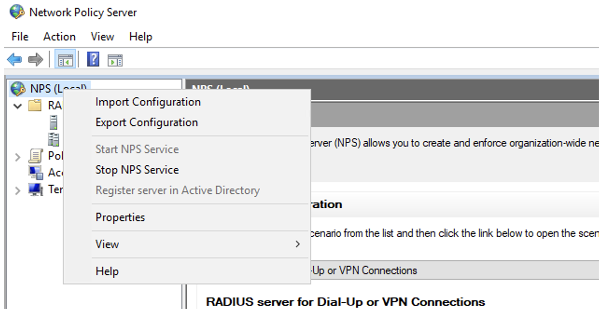

### NPS RADIUS Clients

RADIUS client settings - the SRX Firewall reaches out from ge-0/0/1.0 interface, which is bound to the mgmt zone. Below are two screenshots:

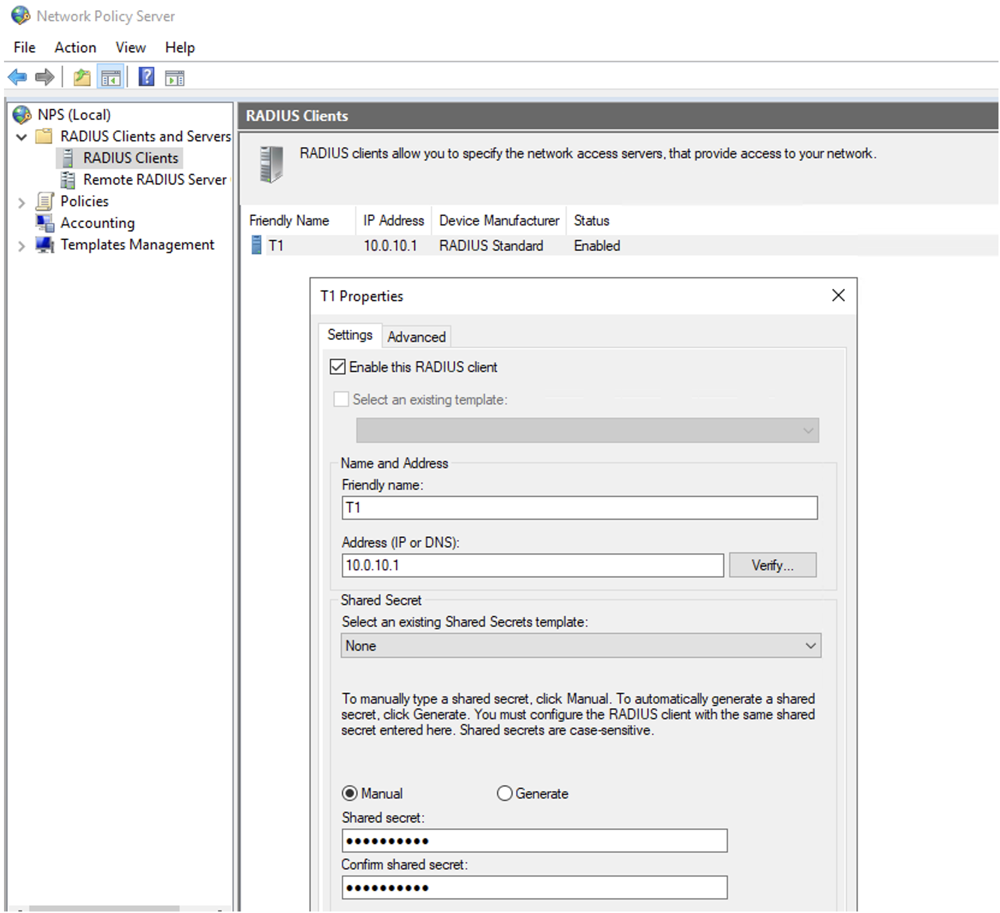

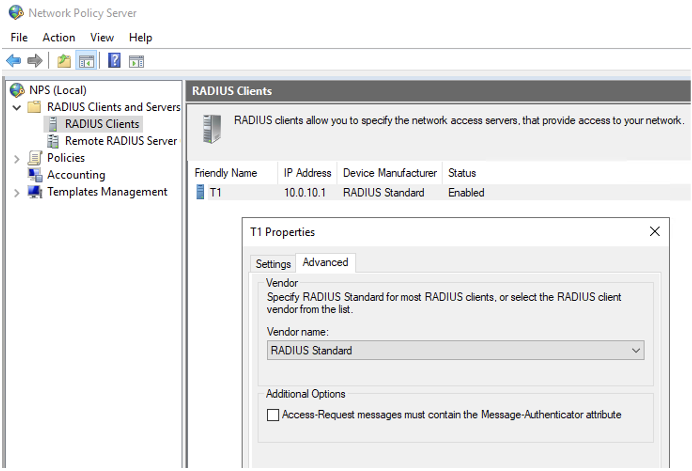

### NPS Connection Request Policy

In the Connection Request Policy, the conditions are configured so that the RADIUS client, the SRX Firewall at 10.0.10.1, is authenticated locally, including the allowed PAP type for the initial control plane authentication (assuming a secure out-of-band network). Below are three screenshots:

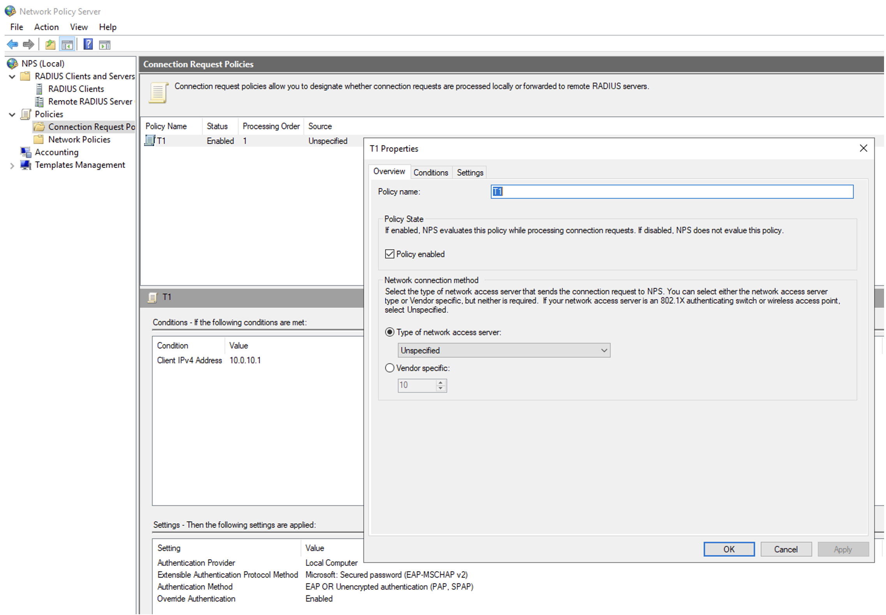

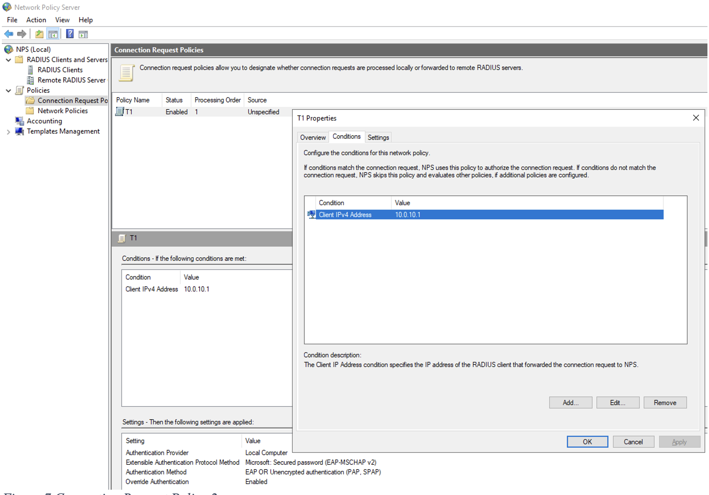

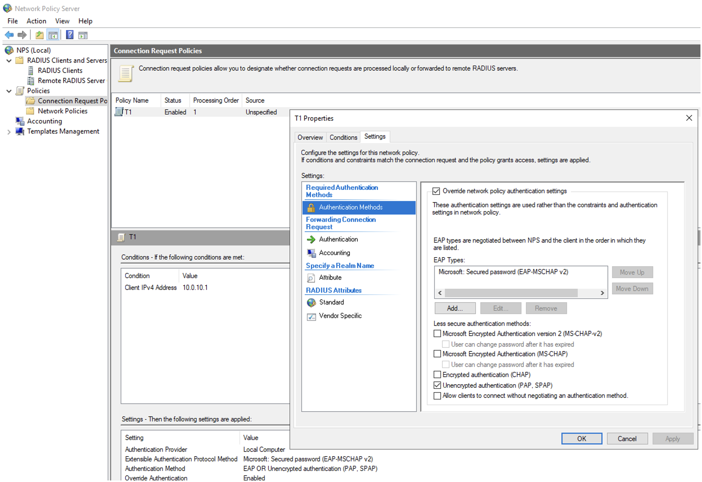

### NPS Network Policies

NPS Network Policies have settings that permit only `T1\jsc` group members, with an option to override permitted access for individual users in the dial-in tab of the AD user's account preferences. Below are three screenshots:

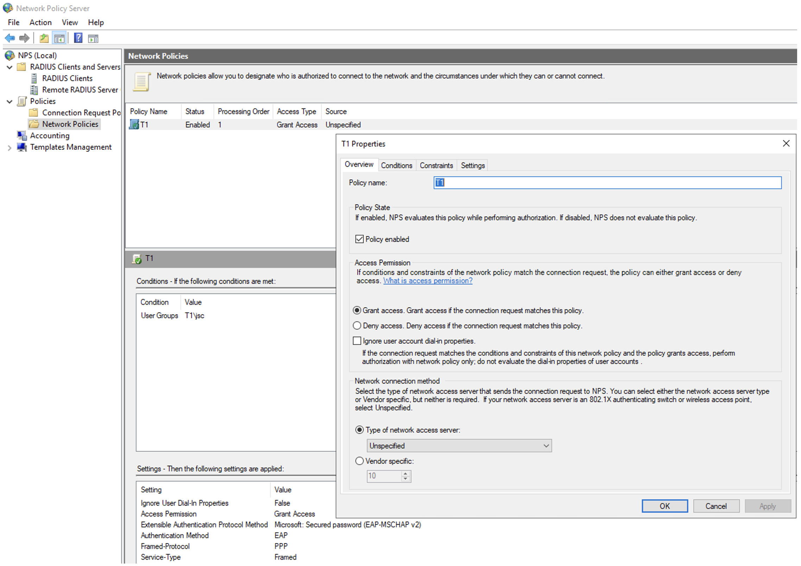

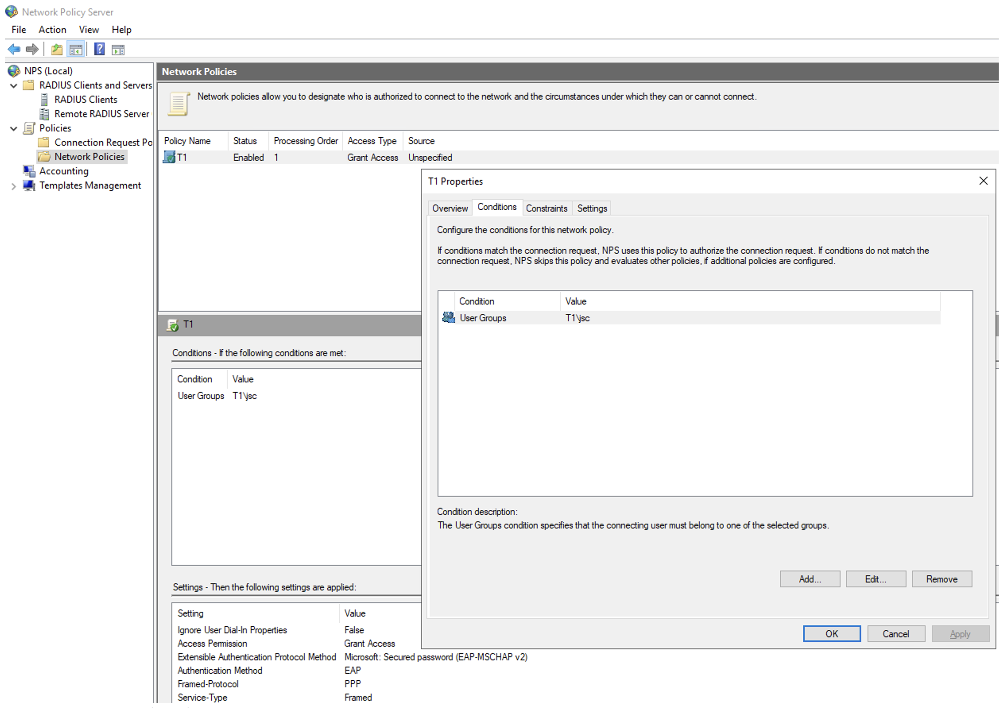

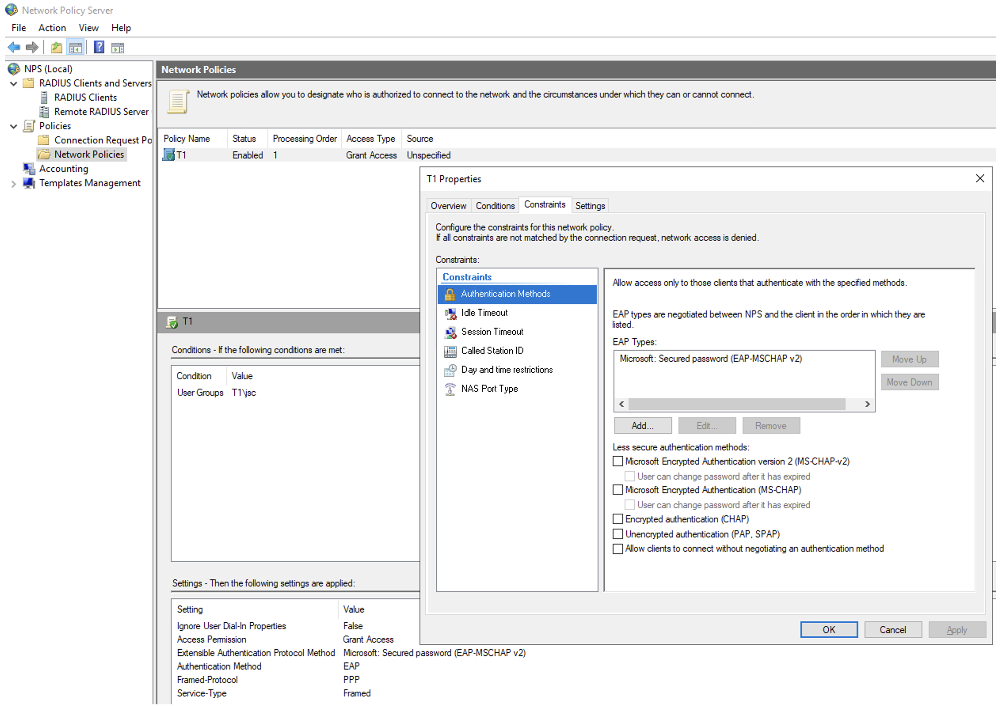

### AAA T2

The settings for T2 AAA mirror those of T1 AAA, with some exceptions and nuances specific to the demo setup:

- Naturally, the IP address is different, 10.0.0.102
- The domain name is t2.local
- The groups for user01, user02 are t2g1, t2g2 respectively
- RADIUS shared secret would typically differ

## JIMS

The Juniper Identity Management Service ([documentation](https://www.juniper.net/documentation/us/en/software/jims/JIMS/index.html)), available from HPE Juniper [downloads](https://support.juniper.net/support/downloads/?p=juniper-identity-management-service), is running on a separate Windows server with the IP address 10.0.0.100. JIMS enables the SRX Firewall to publish VPN username-IP mappings and allows both the SRX Firewall and SRX Router to fetch user identities for identity-enabled rules. More specifically, the SRX Firewall also retrieves from JIMS AD group memberships. For this specific installation, TCP port 8443 is designated for the SRX query interface as part of the installer settings.

### JIMS SRX Enforcement Points

JIMS enforcement points are both SRX devices defined by their IP addresses, Client ID, and shared secret. Below is a screenshot from the demo setup:

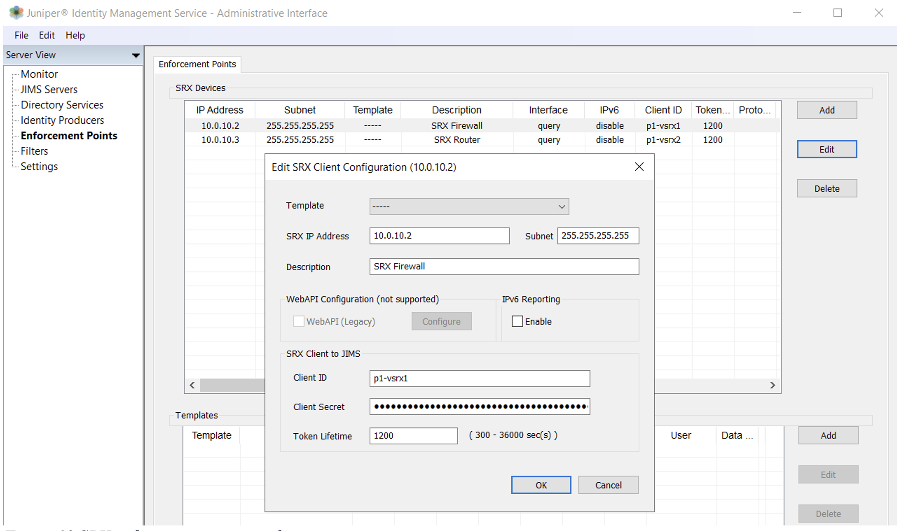

### SRX JIMS Connectivity Validation

Once both SRX side and JIMS side are configured, to validate the SRX connection to JIMS:

```
show services user-identification identity-management status 

            Primary server :                         
            Address                      : 10.0.0.100*
            Port                         : 8443
            Source                       : Automatic
            Interface                    : Automatic
            Routing-instance             : mgmt_junos
            Connection method            : HTTPS
            Connection status            : Online
            Last received status message : OK (200)
            Access token                 : e84bf112-4056-4808-90b5-bea92f128217
            Token expire time            : 2026-01-17 23:29:37

            Secondary server :                         
            Address                      : Not configured
```

> Note: the connection from the SRX to the JIMS server is via the mgmt_junos routing instance.

### JIMS Directory Services

In this lab, JIMS is not using local directory services (nor local login/logoff log polling). To fully decorate the user information with AD group membership, an LDAP lookup is used to gain group membership details from AD servers for t1.local and t2.local domains. This lookup does not require administrative privileges on the AD servers and is configured as such.

> Note: normally, TLS-enabled LDAP would be used in production.

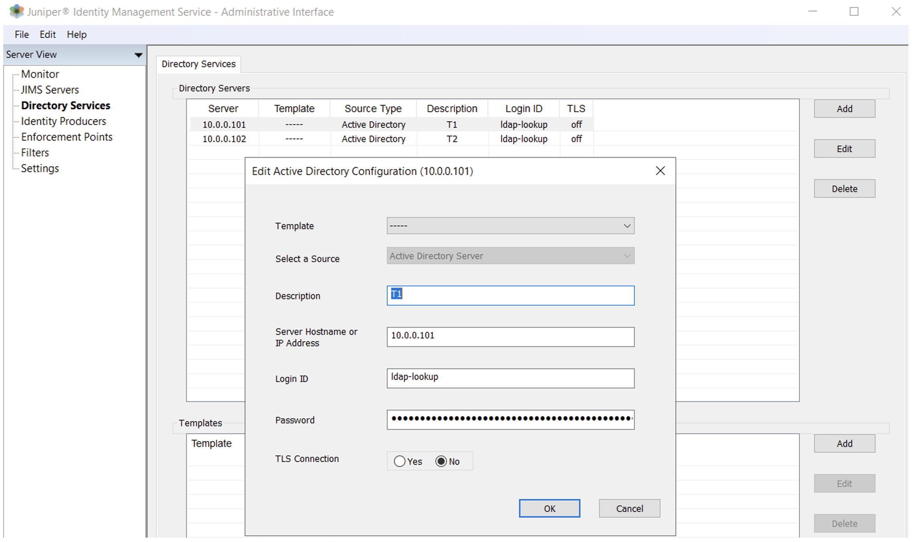

## JSC

The HPE Juniper Networking Juniper Secure Connect ([documentation](https://www.juniper.net/documentation/us/en/software/secure-connect/secure-connect-user-guide/topics/concept/juniper-secure-connect-overview.html), [Windows download](https://support.juniper.net/support/downloads/?p=jsc-win), [macOS download](https://support.juniper.net/support/downloads/?p=jsc-mac)) client side requires setting up trusted CA certificates. After that, users must enter the URL and their credentials. Typically, a custom installer containing the CA certificates, as well as the company logo and HTML instructions, would be created, as described in the documentation.

### Certificates

As of Junos 25.4, the SRX JSC control plane doesn't deliver the complete CA chain as part of the TLS handshake. Therefore, the certificates that mirror the Let's Encrypt CA chain installed on the SRX Firewall, [X1](https://letsencrypt.org/certs/isrgrootx1.pem), [R12](https://letsencrypt.org/certs/2024/r12.pem), [R13](https://letsencrypt.org/certs/2024/r13.pem) (the ones issuing certificates at the time of writing), need to be placed in this demo setup in the folder:

```
C:\ProgramData\Juniper\SecureConnect\cacerts
```

Sidenote: during repeated rollout of Let's Encrypt certificates on the SRX Firewall, the following error has been observed:

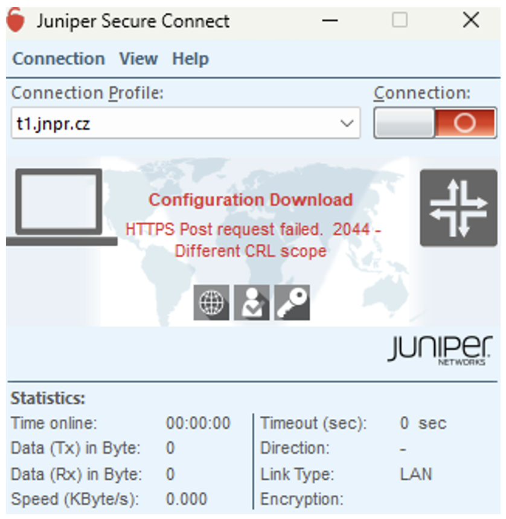

The solution was to remove the CRL files from user specific location:

```
C:\Users\%USERNAME%\AppData\Local\Temp\Juniper\SecureConnect\crls\
```

For stable production environments it is not expected you will see this issue.

### JSC Connection

Essentially, users enter their tenant-specific portal as the gateway address, t1.jnpr.cz or t2.jnpr.cz, and in the simplest form provide their usernames and passwords (practically, a second factor would be used). Here is a sample for t1.jnpr.cz, where, during the second connection, the user would be allowed to save their credentials (a setting downloaded during the first connection from the SRX side):

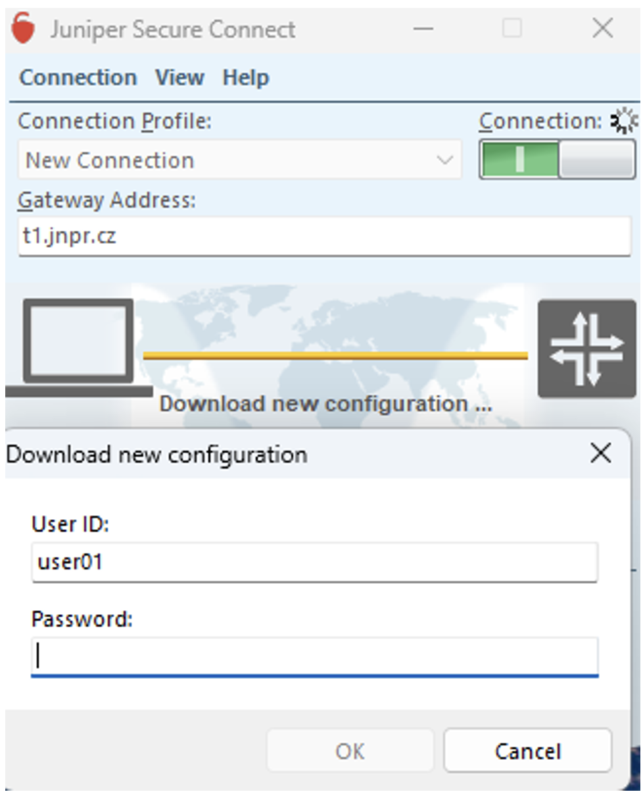

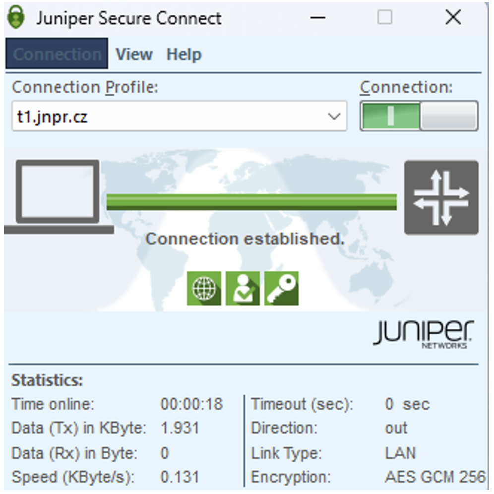

## Setup Verification

The test consists of passing traffic from two distinct users: user01 connecting to t1.jnpr.cz and user01 connecting to t2.jnpr.cz. If JIMS is configured, corresponding SRX authentication table records will also exist. The test also involves reviewing the client's virtual IP export to EVPN/VXLAN Type 5, along with logs from both the SRX Firewall and the SRX Router.

## SRX VPN Connections

The SRX active peer view displays a coalesced view that includes the endpoint IP address, IKE-ID, username, and the inner tunnel assigned IP address:

```
show security ike active-peer    

Remote Address       Port     Peer IKE-ID         AAA username         Assigned IP
192.0.2.1            22383    @t1.auth            user01               10.0.101.25
192.0.2.2            15756    @t2.auth            user01               10.0.102.15
```

## SRX Authentication Table

The SRX Firewall authentication table reveals the groups of which the particular user is a member when used in policies:

```
show services user-identification authentication-table authentication-source all    

Logical System: root-logical-system

Domain: t1.local
Total entries: 1
Key                                      Username       groups(Ref by policy)          state
10.0.101.25                              user01         t1g1                           Valid         

Domain: t2.local
Total entries: 3
Key                                      Username       groups(Ref by policy)          state
10.0.102.15                              user01         t2g1                           Valid     
```

## EVPN IP prefix DB

The SRX Firewall exports host routes allocated to the VPN clients and imports the default gateway:

```
show evpn ip-prefix-database  
             
L3 context: t1

IPv4->EVPN Exported Prefixes
Prefix                                       EVPN route status
10.0.101.25/32                               Created

EVPN->IPv4 Imported Prefixes
Prefix                                       Etag
0.0.0.0/0                                    0       
  Route distinguisher    VNI/Label/SID           Router MAC         Nexthop/Overlay GW/ESI   Route-Status  
  100.65.0.1:101         101                     4c:96:14:b6:37:b0  100.65.0.2                Accepted      

L3 context: t2

IPv4->EVPN Exported Prefixes
Prefix                                       EVPN route status
10.0.102.15/32                               Created

EVPN->IPv4 Imported Prefixes
Prefix                                       Etag
0.0.0.0/0                                    0       
  Route distinguisher    VNI/Label/SID           Router MAC         Nexthop/Overlay GW/ESI   Route-Status  
  100.65.0.1:102         102                     4c:96:14:b6:37:b0  100.65.0.2                Accepted
```

The SRX Router imports VPN client host routes and exports the default gateway:

```
show evpn ip-prefix-database 

L3 context: t1

IPv4->EVPN Exported Prefixes
Prefix                                       EVPN route status
0.0.0.0/0                                    Created

EVPN->IPv4 Imported Prefixes
Prefix                                       Etag
10.0.101.25/32                               0       
  Route distinguisher    VNI/Label/SID           Router MAC         Nexthop/Overlay GW/ESI   Route-Status  
  100.65.0.1:101         101                     4c:96:14:2a:34:b0  100.65.0.1                Accepted      

L3 context: t2

IPv4->EVPN Exported Prefixes
Prefix                                       EVPN route status
0.0.0.0/0                                    Created

EVPN->IPv4 Imported Prefixes
Prefix                                       Etag
10.0.102.15/32                               0       
  Route distinguisher    VNI/Label/SID           Router MAC         Nexthop/Overlay GW/ESI   Route-Status  
  100.65.0.1:102         102                     4c:96:14:2a:34:b0  100.65.0.1                Accepted
```

## tcpdump of ICMP traffic

tcpdump attached to the Linux bridge, which hosts the SRX Firewall and Router underlay interfaces, reveals the inner payloads of VXLAN-encapsulated traffic for tenant 1 and tenant 2 VNIs:

```
tcpdump -n -i br-underlay udp 

01:35:54.815624 IP 100.65.0.1.49849 > 100.65.0.2.4789: VXLAN, flags [I] (0x08), vni 101
IP 10.0.101.25 > 10.1.1.10: ICMP echo request, id 1, seq 3, length 40
01:35:54.816641 IP 100.65.0.2.60530 > 100.65.0.1.4789: VXLAN, flags [I] (0x08), vni 101
IP 10.1.1.10 > 10.0.101.25: ICMP echo reply, id 1, seq 3, length 40

01:36:02.086962 IP 100.65.0.1.50464 > 100.65.0.2.4789: VXLAN, flags [I] (0x08), vni 102
IP 10.0.102.15 > 10.1.1.10: ICMP echo request, id 1, seq 3, length 40
01:36:02.088322 IP 100.65.0.2.53936 > 100.65.0.1.4789: VXLAN, flags [I] (0x08), vni 102
IP 10.1.1.10 > 10.0.102.15: ICMP echo reply, id 1, seq 3, length 40
```

## SSH Connection

The next sample test involves a simple SSH session from a remote user to a backend resource. The extensive session listing shows details of two SSH sessions, including VRFs, corresponding zones, L7 applications, and tunnel interfaces:

```
show security flow session dynamic-application junos:SSH extensive   
   
Session ID: 58912, Status: Normal
Flags: 0x40/0x0/0x3/0x9103/0x8
Policy name: permit-g1/8
Source NAT pool: Null, Application: junos-ssh/22
Dynamic application: junos:SSH, Dynamic nested application: junos:UNKNOWN
Encryption:  No
Url-category:  Unknown
Application traffic control rule-set: INVALID, Rule: INVALID
Maximum timeout: 1800, Current timeout: 1750
Session State: Valid
Start time: 1767575093, Duration: 50
   In: 10.0.102.15/51157 --> 10.1.1.10/22;tcp, 
  Conn Tag: 0x0, Attachment Id: 0, GW Endpoint Id: 0, Flow Cookie: 0, Interface: st0.102, 
    Session token: 0x500c, Flag: 0x1621, 
    Power-Mode Active: False 
    Route: 0x110010, Gateway: 10.0.102.15, Tunnel ID: 500041, Tunnel type: IPsec, Tunnel info: 537370953 
    Port sequence: 0, FIN sequence: 0, 
    FIN state: 0, 
    Pkts: 10, Bytes: 2045
   Out: 10.1.1.10/22 --> 10.0.102.15/51157;tcp, 
  Conn Tag: 0x0, VRF: t2, VRF Zone: t2-vrf, Interface: ge-0/0/3.0, 
    Session token: 0x9, Flag: 0x1620, 
    Power-Mode Active: False 
    Route: 0x4008f, Gateway: 10.1.1.10, Tunnel ID: 1048577, Tunnel type: VXLAN, Tunnel info: 3759144961 
    Port sequence: 0, FIN sequence: 0, 
    FIN state: 0, 
    Pkts: 11, Bytes: 2248

Session ID: 58913, Status: Normal
Flags: 0x40/0x0/0x3/0x9103/0x8
Policy name: permit-g1/6
Source NAT pool: Null, Application: junos-ssh/22
Dynamic application: junos:SSH, Dynamic nested application: junos:UNKNOWN
Encryption:  No
Url-category:  Unknown
Application traffic control rule-set: INVALID, Rule: INVALID
Maximum timeout: 1800, Current timeout: 1756
Session State: Valid
Start time: 1767575099, Duration: 44
   In: 10.0.101.25/53158 --> 10.1.1.10/22;tcp, 
  Conn Tag: 0x0, Attachment Id: 0, GW Endpoint Id: 0, Flow Cookie: 0, Interface: st0.101, 
    Session token: 0x400a, Flag: 0x1621, 
    Power-Mode Active: False 
    Route: 0x130010, Gateway: 10.0.101.25, Tunnel ID: 500040, Tunnel type: IPsec, Tunnel info: 537370952 
    Port sequence: 0, FIN sequence: 0, 
    FIN state: 0, 
    Pkts: 11, Bytes: 2085
   Out: 10.1.1.10/22 --> 10.0.101.25/53158;tcp, 
  Conn Tag: 0x0, VRF: t1, VRF Zone: t1-vrf, Interface: ge-0/0/3.0, 
    Session token: 0x9, Flag: 0x1620, 
    Power-Mode Active: False 
    Route: 0x1008f, Gateway: 10.1.1.10, Tunnel ID: 1048576, Tunnel type: VXLAN, Tunnel info: 3759144960 
    Port sequence: 0, FIN sequence: 0, 
    FIN state: 0, 
    Pkts: 10, Bytes: 2208
```

## SRX Logging

Finally, the SRX Firewall session close logs in structured data format for both tenants' SSH connections sent to SYSLOG contain, in addition to traditional L3-L4 columns, information about the destination VRF, username, roles (AD groups effectively), and identified L7 application:

```
RT_FLOW_SESSION_CLOSE [junos@2636.1.1.1.2.129 reason="TCP CLIENT RST" source-address="10.0.101.25" source-port="53158" destination-address="10.1.1.10" destination-port="22" connection-tag="0" service-name="junos-ssh" nat-source-address="10.0.101.25" nat-source-port="53158" nat-destination-address="10.1.1.10" nat-destination-port="22" nat-connection-tag="0" src-nat-rule-type="N/A" src-nat-rule-name="N/A" dst-nat-rule-type="N/A" dst-nat-rule-name="N/A" protocol-id="6" policy-name="permit-g1" source-zone-name="t1-vpn" destination-zone-name="t1-vrf" session-id="58913" packets-from-client="13" bytes-from-client="2165" packets-from-server="11" bytes-from-server="2248" elapsed-time="168" application="SSH" nested-application="UNKNOWN" username="t1.local\user01" roles="t1g1" packet-incoming-interface="st0.101" encrypted="No" application-category="Remote-Access" application-sub-category="Command" application-risk="4" application-characteristics="Supports File Transfer;Known Vulnerabilities;Capable of Tunneling;" secure-web-proxy-session-type="NA" peer-session-id="0" peer-source-address="0.0.0.0" peer-source-port="0" peer-destination-address="0.0.0.0" peer-destination-port="0" hostname="NA NA" src-vrf-grp="N/A" dst-vrf-grp="N/A" tunnel-inspection="Off" tunnel-inspection-policy-set="root" session-flag="0" source-tenant="N/A" destination-service="N/A" user-type="on-prem-user" dst-identity-context-name="N/A" dst-identity-context-roles="N/A" gbp-src-tag="0" gbp-dst-tag="0" forwarded-for="N/A" url-host="N/A" url-cat="N/A" url-risk="0" src-vrf="N/A" dst-vrf="t1"]

RT_FLOW - RT_FLOW_SESSION_CLOSE [junos@2636.1.1.1.2.129 reason="TCP CLIENT RST" source-address="10.0.102.15" source-port="51157" destination-address="10.1.1.10" destination-port="22" connection-tag="0" service-name="junos-ssh" nat-source-address="10.0.102.15" nat-source-port="51157" nat-destination-address="10.1.1.10" nat-destination-port="22" nat-connection-tag="0" src-nat-rule-type="N/A" src-nat-rule-name="N/A" dst-nat-rule-type="N/A" dst-nat-rule-name="N/A" protocol-id="6" policy-name="permit-g1" source-zone-name="t2-vpn" destination-zone-name="t2-vrf" session-id="58912" packets-from-client="12" bytes-from-client="2125" packets-from-server="12" bytes-from-server="2288" elapsed-time="178" application="SSH" nested-application="UNKNOWN" username="t2.local\user01" roles="t2g1" packet-incoming-interface="st0.102" encrypted="No" application-category="Remote-Access" application-sub-category="Command" application-risk="4" application-characteristics="Supports File Transfer;Known Vulnerabilities;Capable of Tunneling;" secure-web-proxy-session-type="NA" peer-session-id="0" peer-source-address="0.0.0.0" peer-source-port="0" peer-destination-address="0.0.0.0" peer-destination-port="0" hostname="NA NA" src-vrf-grp="N/A" dst-vrf-grp="N/A" tunnel-inspection="Off" tunnel-inspection-policy-set="root" session-flag="0" source-tenant="N/A" destination-service="N/A" user-type="on-prem-user" dst-identity-context-name="N/A" dst-identity-context-roles="N/A" gbp-src-tag="0" gbp-dst-tag="0" forwarded-for="N/A" url-host="N/A" url-cat="N/A" url-risk="0" src-vrf="N/A" dst-vrf="t2"] 
```

> Note: streaming log profiles can be used to net down the information sent in remote syslog entries.

For demo purposes, the SRX Router uses on-box logging instead of SYSLOG; however, not all columns, such as the VRF information, are recorded in this on-box logging style. Role information is not recorded, regardless of the logging style, as the source-identity-log knob enables username-only logging:

```
show security log report in-detail all protocol-name tcp

RT_FLOW - RT_FLOW_SESSION_CLOSE [nat-source-address="10.0.101.25" nat-source-port="53158" nat-destination-address="10.1.1.10" nat-destination-port="22" packets-from-client="13" application="UNKNOWN" session-flag="0" source-address="10.0.101.25" destination-address="10.1.1.10" nested-application="UNKNOWN" username="t1.local\user01" policy-name="permit" bytes-from-server="2248" packets-from-server="11" bytes-from-client="2165" packet-incoming-interface="ge-0/0/1.0" source-zone-name="t1-vrf" destination-zone-name="t1" session-id="54732" source-port="53158" destination-port="22" protocol-id="TCP" elapsed-time="168" reason="TCP CLIENT RST"]

RT_FLOW - RT_FLOW_SESSION_CLOSE [nat-source-address="10.0.102.15" nat-source-port="51157" nat-destination-address="10.1.1.10" nat-destination-port="22" packets-from-client="12" application="UNKNOWN" session-flag="0" source-address="10.0.102.15" destination-address="10.1.1.10" nested-application="UNKNOWN" username="t2.local\user01" policy-name="permit" bytes-from-server="2288" packets-from-server="12" bytes-from-client="2125" packet-incoming-interface="ge-0/0/1.0" source-zone-name="t2-vrf" destination-zone-name="t2" session-id="54731" source-port="51157" destination-port="22" protocol-id="TCP" elapsed-time="178" reason="TCP CLIENT RST"]
```

## Appendix 1: complete SRX configurations

## SRX Firewall

```
set version 25.4R1.12
set groups jsc-common apply-flags omit
set groups jsc-common system services web-management https pki-local-certificate p1-acme-cert
set groups jsc-common system services web-management https interface fxp0.0
set groups jsc-common services user-identification identity-management invalid-authentication-entry-timeout 10
set groups jsc-common services user-identification identity-management connection connect-method https
set groups jsc-common services user-identification identity-management connection port 8443
set groups jsc-common services user-identification identity-management connection primary address 10.0.0.100
set groups jsc-common services user-identification identity-management connection primary client-id p1-vsrx1
set groups jsc-common services user-identification identity-management connection primary client-secret "<SNIP>"
set groups jsc-common services user-identification identity-management connection primary routing-instance mgmt_junos
set groups jsc-common services ssl termination profile ssl-term-p1 preferred-ciphers custom
set groups jsc-common services ssl termination profile ssl-term-p1 custom-ciphers tls13-with-aes-256-gcm-sha384
set groups jsc-common services ssl termination profile ssl-term-p1 custom-ciphers tls12-ecdhe-rsa-aes-128-gcm-sha256
set groups jsc-common services ssl termination profile ssl-term-p1 server-certificate p1-acme-cert
set groups jsc-common security ike proposal rsa-g20-aes256-gcm authentication-method rsa-signatures
set groups jsc-common security ike proposal rsa-g20-aes256-gcm dh-group group20
set groups jsc-common security ike proposal rsa-g20-aes256-gcm encryption-algorithm aes-256-gcm
set groups jsc-common security ike proposal rsa-g20-aes256-gcm lifetime-seconds 28800
set groups jsc-common security ipsec proposal esp-aes256-gcm encryption-algorithm aes-256-gcm
set groups jsc-common security ipsec proposal esp-aes256-gcm lifetime-seconds 3600
set groups jsc-common security ipsec policy esp-aes256-gcm-g20 perfect-forward-secrecy keys group20
set groups jsc-common security ipsec policy esp-aes256-gcm-g20 proposals esp-aes256-gcm
set groups jsc-common security tcp-encap profile tcp-encap-p1 ssl-profile ssl-term-p1
set groups jsc-common security tcp-encap profile tcp-encap-p1 log
set groups jsc-common security zones security-zone untrust interfaces ge-0/0/2.0 host-inbound-traffic system-services https
set groups jsc-common security zones security-zone untrust interfaces ge-0/0/2.0 host-inbound-traffic system-services tcp-encap
set groups jsc-common security zones security-zone untrust interfaces ge-0/0/2.0 host-inbound-traffic system-services ike
set groups jsc-common security flow tcp-mss ipsec-vpn mss 1350
set groups jsc-common access profile ra-access-profile-common authentication-order radius
set groups jsc-common access firewall-authentication web-authentication default-profile ra-access-profile-common

set groups jsc-t1 apply-flags omit
set groups jsc-t1 system services web-management https virtual-domain t1.jnpr.cz pki-local-certificate t1-acme-cert
set groups jsc-t1 security ike policy ra-ike-policy-t1 proposals rsa-g20-aes256-gcm
set groups jsc-t1 security ike policy ra-ike-policy-t1 certificate local-certificate t1-acme-cert
set groups jsc-t1 security ike gateway ra-gateway-t1 ike-policy ra-ike-policy-t1
set groups jsc-t1 security ike gateway ra-gateway-t1 dynamic user-at-hostname "@t1.auth"
set groups jsc-t1 security ike gateway ra-gateway-t1 dynamic ike-user-type shared-ike-id
set groups jsc-t1 security ike gateway ra-gateway-t1 dead-peer-detection probe-idle-tunnel
set groups jsc-t1 security ike gateway ra-gateway-t1 local-identity hostname t1.jnpr.cz
set groups jsc-t1 security ike gateway ra-gateway-t1 external-interface ge-0/0/2.0
set groups jsc-t1 security ike gateway ra-gateway-t1 aaa access-profile ra-access-profile-t1
set groups jsc-t1 security ike gateway ra-gateway-t1 aaa use-routing-instance-address
set groups jsc-t1 security ike gateway ra-gateway-t1 version v2-only
set groups jsc-t1 security ike gateway ra-gateway-t1 fragmentation size 1200
set groups jsc-t1 security ike gateway ra-gateway-t1 tcp-encap-profile tcp-encap-p1
set groups jsc-t1 security ipsec vpn ra-vpn-t1 bind-interface st0.101
set groups jsc-t1 security ipsec vpn ra-vpn-t1 ike gateway ra-gateway-t1
set groups jsc-t1 security ipsec vpn ra-vpn-t1 ike ipsec-policy esp-aes256-gcm-g20
set groups jsc-t1 security ipsec vpn ra-vpn-t1 traffic-selector t1-ts1 local-ip 10.1.1.0/24
set groups jsc-t1 security ipsec vpn ra-vpn-t1 traffic-selector t1-ts1 remote-ip 0.0.0.0/0
set groups jsc-t1 security ipsec vpn ra-vpn-t1 traffic-selector t1-ts2 local-ip 10.0.0.0/24
set groups jsc-t1 security ipsec vpn ra-vpn-t1 traffic-selector t1-ts2 remote-ip 0.0.0.0/0
set groups jsc-t1 security remote-access profile t1.jnpr.cz ipsec-vpn ra-vpn-t1
set groups jsc-t1 security remote-access profile t1.jnpr.cz access-profile ra-access-profile-t1
set groups jsc-t1 security remote-access profile t1.jnpr.cz client-config client-config-t1
set groups jsc-t1 security remote-access profile t1.jnpr.cz options user-domain t1.local
set groups jsc-t1 security remote-access client-config client-config-t1 connection-mode always
set groups jsc-t1 security remote-access client-config client-config-t1 dead-peer-detection interval 10
set groups jsc-t1 security remote-access client-config client-config-t1 dead-peer-detection threshold 5
set groups jsc-t1 security remote-access client-config client-config-t1 no-eap-tls
set groups jsc-t1 security remote-access client-config client-config-t1 domain-name t1.local
set groups jsc-t1 security remote-access client-config client-config-t1 credentials password
set groups jsc-t1 security zones security-zone t1-vpn interfaces st0.101
set groups jsc-t1 security zones security-zone t1-vrf vrf t1
set groups jsc-t1 security policies from-zone t1-vpn to-zone t1-vrf policy permit-g1 match source-address any
set groups jsc-t1 security policies from-zone t1-vpn to-zone t1-vrf policy permit-g1 match destination-address any
set groups jsc-t1 security policies from-zone t1-vpn to-zone t1-vrf policy permit-g1 match application any
set groups jsc-t1 security policies from-zone t1-vpn to-zone t1-vrf policy permit-g1 match source-identity "t1.local\t1g1"
set groups jsc-t1 security policies from-zone t1-vpn to-zone t1-vrf policy permit-g1 match dynamic-application any
set groups jsc-t1 security policies from-zone t1-vpn to-zone t1-vrf policy permit-g1 then permit
set groups jsc-t1 security policies from-zone t1-vpn to-zone t1-vrf policy permit-g1 then log session-close
set groups jsc-t1 security policies from-zone t1-vpn to-zone t1-vrf policy permit-g2 match source-address any
set groups jsc-t1 security policies from-zone t1-vpn to-zone t1-vrf policy permit-g2 match destination-address any
set groups jsc-t1 security policies from-zone t1-vpn to-zone t1-vrf policy permit-g2 match application junos-icmp-ping
set groups jsc-t1 security policies from-zone t1-vpn to-zone t1-vrf policy permit-g2 match application junos-ssh
set groups jsc-t1 security policies from-zone t1-vpn to-zone t1-vrf policy permit-g2 match source-identity "t1.local\t1g2"
set groups jsc-t1 security policies from-zone t1-vpn to-zone t1-vrf policy permit-g2 match dynamic-application junos:SSH
set groups jsc-t1 security policies from-zone t1-vpn to-zone t1-vrf policy permit-g2 match dynamic-application junos:ICMP-ECHO
set groups jsc-t1 security policies from-zone t1-vpn to-zone t1-vrf policy permit-g2 then permit
set groups jsc-t1 security policies from-zone t1-vpn to-zone t1-vrf policy permit-g2 then log session-close
set groups jsc-t1 security policies global policy deny-t1 match source-address any
set groups jsc-t1 security policies global policy deny-t1 match destination-address any
set groups jsc-t1 security policies global policy deny-t1 match application any
set groups jsc-t1 security policies global policy deny-t1 match dynamic-application any
set groups jsc-t1 security policies global policy deny-t1 match from-zone t1-vpn
set groups jsc-t1 security policies global policy deny-t1 then deny
set groups jsc-t1 security policies global policy deny-t1 then log session-init
set groups jsc-t1 interfaces st0 unit 101 description t1
set groups jsc-t1 interfaces st0 unit 101 family inet address 10.0.101.1/24
set groups jsc-t1 policy-options policy-statement export-t1 term 1 from protocol ari-ts
set groups jsc-t1 policy-options policy-statement export-t1 term 1 from interface st0.101
set groups jsc-t1 policy-options policy-statement export-t1 term 1 then accept
set groups jsc-t1 policy-options policy-statement export-t1 term 100 then reject
set groups jsc-t1 access profile ra-access-profile-t1 authentication-order radius
set groups jsc-t1 access profile ra-access-profile-t1 address-assignment pool ra-address-pool-t1
set groups jsc-t1 access profile ra-access-profile-t1 radius accounting-server 10.0.0.101
set groups jsc-t1 access profile ra-access-profile-t1 radius-server 10.0.0.101 secret "<SNIP>"
set groups jsc-t1 access profile ra-access-profile-t1 radius-server 10.0.0.101 timeout 60
set groups jsc-t1 access profile ra-access-profile-t1 accounting order radius
set groups jsc-t1 routing-instances t1 instance-type vrf
set groups jsc-t1 routing-instances t1 protocols evpn ip-prefix-routes advertise direct-nexthop
set groups jsc-t1 routing-instances t1 protocols evpn ip-prefix-routes encapsulation vxlan
set groups jsc-t1 routing-instances t1 protocols evpn ip-prefix-routes vni 101
set groups jsc-t1 routing-instances t1 protocols evpn ip-prefix-routes export export-t1
set groups jsc-t1 routing-instances t1 interface st0.101
set groups jsc-t1 routing-instances t1 access address-assignment pool ra-address-pool-t1 family inet network 10.0.101.0/24
set groups jsc-t1 routing-instances t1 access address-assignment pool ra-address-pool-t1 family inet range ra-ip-range-1 low 10.0.101.10
set groups jsc-t1 routing-instances t1 access address-assignment pool ra-address-pool-t1 family inet range ra-ip-range-1 high 10.0.101.110
set groups jsc-t1 routing-instances t1 access address-assignment pool ra-address-pool-t1 family inet xauth-attributes primary-dns 10.0.0.100/32
set groups jsc-t1 routing-instances t1 route-distinguisher 100.65.0.1:101
set groups jsc-t1 routing-instances t1 vrf-target target:65001:101

set groups jsc-t2 apply-flags omit
set groups jsc-t2 system services web-management https virtual-domain t2.jnpr.cz pki-local-certificate t2-acme-cert
set groups jsc-t2 security ike policy ra-ike-policy-t2 proposals rsa-g20-aes256-gcm
set groups jsc-t2 security ike policy ra-ike-policy-t2 certificate local-certificate t2-acme-cert
set groups jsc-t2 security ike gateway ra-gateway-t2 ike-policy ra-ike-policy-t2
set groups jsc-t2 security ike gateway ra-gateway-t2 dynamic user-at-hostname "@t2.auth"
set groups jsc-t2 security ike gateway ra-gateway-t2 dynamic ike-user-type shared-ike-id
set groups jsc-t2 security ike gateway ra-gateway-t2 dead-peer-detection probe-idle-tunnel
set groups jsc-t2 security ike gateway ra-gateway-t2 local-identity hostname t2.jnpr.cz
set groups jsc-t2 security ike gateway ra-gateway-t2 external-interface ge-0/0/2.0
set groups jsc-t2 security ike gateway ra-gateway-t2 aaa access-profile ra-access-profile-t2
set groups jsc-t2 security ike gateway ra-gateway-t2 aaa use-routing-instance-address
set groups jsc-t2 security ike gateway ra-gateway-t2 version v2-only
set groups jsc-t2 security ike gateway ra-gateway-t2 fragmentation size 1200
set groups jsc-t2 security ike gateway ra-gateway-t2 tcp-encap-profile tcp-encap-p1
set groups jsc-t2 security ipsec vpn ra-vpn-t2 bind-interface st0.102
set groups jsc-t2 security ipsec vpn ra-vpn-t2 ike gateway ra-gateway-t2
set groups jsc-t2 security ipsec vpn ra-vpn-t2 ike ipsec-policy esp-aes256-gcm-g20
set groups jsc-t2 security ipsec vpn ra-vpn-t2 traffic-selector t2-ts1 local-ip 10.1.1.0/24
set groups jsc-t2 security ipsec vpn ra-vpn-t2 traffic-selector t2-ts1 remote-ip 0.0.0.0/0
set groups jsc-t2 security ipsec vpn ra-vpn-t2 traffic-selector t2-ts2 local-ip 10.0.0.0/24
set groups jsc-t2 security ipsec vpn ra-vpn-t2 traffic-selector t2-ts2 remote-ip 0.0.0.0/0
set groups jsc-t2 security remote-access profile t2.jnpr.cz ipsec-vpn ra-vpn-t2
set groups jsc-t2 security remote-access profile t2.jnpr.cz access-profile ra-access-profile-t2
set groups jsc-t2 security remote-access profile t2.jnpr.cz client-config client-config-t2
set groups jsc-t2 security remote-access profile t2.jnpr.cz options user-domain t2.local
set groups jsc-t2 security remote-access client-config client-config-t2 connection-mode always
set groups jsc-t2 security remote-access client-config client-config-t2 dead-peer-detection interval 10
set groups jsc-t2 security remote-access client-config client-config-t2 dead-peer-detection threshold 5
set groups jsc-t2 security remote-access client-config client-config-t2 no-eap-tls
set groups jsc-t2 security remote-access client-config client-config-t2 domain-name t2.local
set groups jsc-t2 security remote-access client-config client-config-t2 credentials password
set groups jsc-t2 security zones security-zone t2-vpn interfaces st0.102
set groups jsc-t2 security zones security-zone t2-vrf vrf t2
set groups jsc-t2 security policies from-zone t2-vpn to-zone t2-vrf policy permit-g1 match source-address any
set groups jsc-t2 security policies from-zone t2-vpn to-zone t2-vrf policy permit-g1 match destination-address any
set groups jsc-t2 security policies from-zone t2-vpn to-zone t2-vrf policy permit-g1 match application any
set groups jsc-t2 security policies from-zone t2-vpn to-zone t2-vrf policy permit-g1 match source-identity "t2.local\t2g1"
set groups jsc-t2 security policies from-zone t2-vpn to-zone t2-vrf policy permit-g1 match dynamic-application any
set groups jsc-t2 security policies from-zone t2-vpn to-zone t2-vrf policy permit-g1 then permit
set groups jsc-t2 security policies from-zone t2-vpn to-zone t2-vrf policy permit-g1 then log session-close
set groups jsc-t2 security policies from-zone t2-vpn to-zone t2-vrf policy permit-g2 match source-address any
set groups jsc-t2 security policies from-zone t2-vpn to-zone t2-vrf policy permit-g2 match destination-address any
set groups jsc-t2 security policies from-zone t2-vpn to-zone t2-vrf policy permit-g2 match application junos-icmp-ping
set groups jsc-t2 security policies from-zone t2-vpn to-zone t2-vrf policy permit-g2 match application junos-ssh
set groups jsc-t2 security policies from-zone t2-vpn to-zone t2-vrf policy permit-g2 match source-identity "t2.local\t2g2"
set groups jsc-t2 security policies from-zone t2-vpn to-zone t2-vrf policy permit-g2 match dynamic-application junos:SSH
set groups jsc-t2 security policies from-zone t2-vpn to-zone t2-vrf policy permit-g2 match dynamic-application junos:ICMP-ECHO
set groups jsc-t2 security policies from-zone t2-vpn to-zone t2-vrf policy permit-g2 then permit
set groups jsc-t2 security policies from-zone t2-vpn to-zone t2-vrf policy permit-g2 then log session-close
set groups jsc-t2 security policies global policy deny-t2 match source-address any
set groups jsc-t2 security policies global policy deny-t2 match destination-address any
set groups jsc-t2 security policies global policy deny-t2 match application any
set groups jsc-t2 security policies global policy deny-t2 match dynamic-application any
set groups jsc-t2 security policies global policy deny-t2 match from-zone t2-vpn
set groups jsc-t2 security policies global policy deny-t2 then deny
set groups jsc-t2 security policies global policy deny-t2 then log session-init
set groups jsc-t2 interfaces st0 unit 102 description t2
set groups jsc-t2 interfaces st0 unit 102 family inet address 10.0.102.1/24
set groups jsc-t2 policy-options policy-statement export-t2 term 1 from protocol ari-ts
set groups jsc-t2 policy-options policy-statement export-t2 term 1 from interface st0.102
set groups jsc-t2 policy-options policy-statement export-t2 term 1 then accept
set groups jsc-t2 policy-options policy-statement export-t2 term 100 then reject
set groups jsc-t2 access profile ra-access-profile-t2 authentication-order radius
set groups jsc-t2 access profile ra-access-profile-t2 address-assignment pool ra-address-pool-t2
set groups jsc-t2 access profile ra-access-profile-t2 radius accounting-server 10.0.0.102
set groups jsc-t2 access profile ra-access-profile-t2 radius-server 10.0.0.102 secret "<SNIP>"
set groups jsc-t2 access profile ra-access-profile-t2 radius-server 10.0.0.102 timeout 60
set groups jsc-t2 access profile ra-access-profile-t2 accounting order radius
set groups jsc-t2 routing-instances t2 instance-type vrf
set groups jsc-t2 routing-instances t2 protocols evpn ip-prefix-routes advertise direct-nexthop
set groups jsc-t2 routing-instances t2 protocols evpn ip-prefix-routes encapsulation vxlan
set groups jsc-t2 routing-instances t2 protocols evpn ip-prefix-routes vni 102
set groups jsc-t2 routing-instances t2 protocols evpn ip-prefix-routes export export-t2
set groups jsc-t2 routing-instances t2 interface st0.102
set groups jsc-t2 routing-instances t2 access address-assignment pool ra-address-pool-t2 family inet network 10.0.102.0/24
set groups jsc-t2 routing-instances t2 access address-assignment pool ra-address-pool-t2 family inet range ra-ip-range-1 low 10.0.102.10
set groups jsc-t2 routing-instances t2 access address-assignment pool ra-address-pool-t2 family inet range ra-ip-range-1 high 10.0.102.110
set groups jsc-t2 routing-instances t2 access address-assignment pool ra-address-pool-t2 family inet xauth-attributes primary-dns 10.0.0.100/32
set groups jsc-t2 routing-instances t2 route-distinguisher 100.65.0.1:102
set groups jsc-t2 routing-instances t2 vrf-target target:65001:102

set groups jsc-evvx-t5 apply-flags omit
set groups jsc-evvx-t5 security zones security-zone underlay interfaces ge-0/0/3.0 host-inbound-traffic system-services ping
set groups jsc-evvx-t5 security zones security-zone underlay interfaces ge-0/0/3.0 host-inbound-traffic protocols ospf
set groups jsc-evvx-t5 security zones security-zone underlay interfaces lo0.0 host-inbound-traffic system-services ping
set groups jsc-evvx-t5 security zones security-zone underlay interfaces lo0.0 host-inbound-traffic protocols bgp
set groups jsc-evvx-t5 security policies from-zone underlay to-zone underlay policy control match source-address vsrx2-lo0.0
set groups jsc-evvx-t5 security policies from-zone underlay to-zone underlay policy control match destination-address vsrx1-lo0.0
set groups jsc-evvx-t5 security policies from-zone underlay to-zone underlay policy control match application junos-bgp
set groups jsc-evvx-t5 security policies from-zone underlay to-zone underlay policy control match application junos-icmp-ping
set groups jsc-evvx-t5 security policies from-zone underlay to-zone underlay policy control then permit
set groups jsc-evvx-t5 security address-book global address vsrx2-lo0.0 100.65.0.2/32
set groups jsc-evvx-t5 security address-book global address vsrx1-lo0.0 100.65.0.1/32
set groups jsc-evvx-t5 interfaces ge-0/0/3 description underlay
set groups jsc-evvx-t5 interfaces ge-0/0/3 mtu 9000
set groups jsc-evvx-t5 interfaces ge-0/0/3 unit 0 family inet address 100.64.0.1/24
set groups jsc-evvx-t5 interfaces lo0 unit 0 family inet address 100.65.0.1/32
set groups jsc-evvx-t5 protocols ospf area 0.0.0.0 interface lo0.0 passive
set groups jsc-evvx-t5 protocols ospf area 0.0.0.0 interface ge-0/0/3.0 interface-type p2p
set groups jsc-evvx-t5 protocols bgp group overlay multihop
set groups jsc-evvx-t5 protocols bgp group overlay local-address 100.65.0.1
set groups jsc-evvx-t5 protocols bgp group overlay family evpn signaling
set groups jsc-evvx-t5 protocols bgp group overlay neighbor 100.65.0.2 peer-as 65002
set groups jsc-evvx-t5 protocols bgp group overlay neighbor 100.65.0.2 local-as 65001
set apply-groups jsc-common
set apply-groups jsc-evvx-t5
set apply-groups jsc-t1
set apply-groups jsc-t2
set system host-name vsrx1
set system services ssh 
set system time-zone Europe/Prague
set system management-instance
set system name-server 10.0.0.1 routing-instance mgmt_junos
set system syslog host 10.0.10.10 any any
set system syslog host 10.0.10.10 routing-instance mgmt_junos
set system syslog file messages any any
set system syslog file messages match "!(iked|REMOTE_ACCESS_VPN_)"
set system syslog file messages archive size 5m
set system syslog file messages archive files 4
set system syslog file vpn any any
set system syslog file vpn match "(iked|REMOTE_ACCESS_VPN_)"
set system syslog file vpn archive size 5m
set system syslog file vpn archive files 4
set system ntp server 10.0.0.1 routing-instance mgmt_junos
set services application-identification
set security log mode stream
set security log format sd-syslog
set security log report
set security log source-interface ge-0/0/0.0
set security log stream host format sd-syslog
set security log stream host category all
set security log stream host host 10.0.10.10
set security pki ca-profile ISRG_Root_X1 ca-identity ISRG_Root_X1
set security pki ca-profile ISRG_Root_X1 revocation-check disable
set security pki ca-profile Lets_Encrypt_ACME ca-identity Lets_Encrypt_ACME
set security pki ca-profile Lets_Encrypt_ACME enrollment url https://acme-v02.api.letsencrypt.org/directory
set security pki ca-profile Lets_Encrypt_ACME revocation-check disable
set security pki ca-profile Lets_Encrypt_R12 ca-identity Lets_Encrypt_R12
set security pki ca-profile Lets_Encrypt_R12 revocation-check disable
set security pki ca-profile Lets_Encrypt_R13 ca-identity Lets_Encrypt_R13
set security pki ca-profile Lets_Encrypt_R13 revocation-check disable
set security forwarding-process enhanced-services-mode
set security nat source rule-set untrust from zone mgmt
set security nat source rule-set untrust to zone untrust
set security nat source rule-set untrust rule untrust match source-address 0.0.0.0/0
set security nat source rule-set untrust rule untrust match destination-address 0.0.0.0/0
set security nat source rule-set untrust rule untrust then source-nat interface
set security zones security-zone mgmt tcp-rst
set security zones security-zone mgmt interfaces ge-0/0/0.0 host-inbound-traffic system-services ping
set security zones security-zone untrust interfaces ge-0/0/2.0 host-inbound-traffic system-services ping
set security zones security-zone untrust interfaces ge-0/0/2.0 host-inbound-traffic system-services http
set security policies from-zone mgmt to-zone untrust policy permit-mgmt match source-address any
set security policies from-zone mgmt to-zone untrust policy permit-mgmt match destination-address any
set security policies from-zone mgmt to-zone untrust policy permit-mgmt match application any
set security policies from-zone mgmt to-zone untrust policy permit-mgmt then permit
set security policies from-zone mgmt to-zone untrust policy permit-mgmt then log session-close
set security policies pre-id-default-policy then log session-close
set security policies pre-id-default-policy then log session-update 10
set security alg h323 disable
set security alg mgcp disable
set security alg msrpc disable
set security alg sunrpc disable
set security alg rtsp disable
set security alg sccp disable
set security alg sip disable
set security alg talk disable
set security alg tftp disable
set security alg pptp disable
set security flow tcp-session strict-syn-check
set security flow packet-log enable
set security flow packet-log throttle-interval 1024
set security flow packet-log packet-filter tcp protocol tcp
set interfaces ge-0/0/0 description mgmt
set interfaces ge-0/0/0 unit 0 family inet address 10.0.10.1/24
set interfaces ge-0/0/2 description untrust
set interfaces ge-0/0/2 unit 0 family inet address 89.187.136.169/27
set interfaces fxp0 unit 0 family inet address 10.0.10.2/24
set routing-instances mgmt_junos routing-options static route 0.0.0.0/0 next-hop 10.0.10.1
set routing-instances mgmt_junos routing-options static route 10.0.0.0/24 next-hop 10.0.10.10

set routing-options static route 0.0.0.0/0 next-hop 89.187.136.161
set routing-options static route 10.0.0.0/24 next-hop 10.0.10.10
```

## SRX Router

```
set version 25.4R1.12
set groups jsc-t1 apply-flags omit
set groups jsc-t1 security zones security-zone t1-vrf vrf t1
set groups jsc-t1 security zones security-zone t1-vrf source-identity-log
set groups jsc-t1 security zones security-zone t1 interfaces ge-0/0/2.81 host-inbound-traffic system-services ping
set groups jsc-t1 security policies from-zone t1-vrf to-zone t1 policy permit match source-address any
set groups jsc-t1 security policies from-zone t1-vrf to-zone t1 policy permit match destination-address any
set groups jsc-t1 security policies from-zone t1-vrf to-zone t1 policy permit match application any
set groups jsc-t1 security policies from-zone t1-vrf to-zone t1 policy permit then permit
set groups jsc-t1 security policies from-zone t1-vrf to-zone t1 policy permit then log session-close
set groups jsc-t1 security policies from-zone t1 to-zone t1-vrf policy permit match source-address any
set groups jsc-t1 security policies from-zone t1 to-zone t1-vrf policy permit match destination-address any
set groups jsc-t1 security policies from-zone t1 to-zone t1-vrf policy permit match application any
set groups jsc-t1 security policies from-zone t1 to-zone t1-vrf policy permit then permit
set groups jsc-t1 interfaces ge-0/0/2 unit 81 vlan-id 81
set groups jsc-t1 interfaces ge-0/0/2 unit 81 family inet address 10.1.1.1/24
set groups jsc-t1 policy-options policy-statement export-t1 term 1 from instance t1
set groups jsc-t1 policy-options policy-statement export-t1 term 1 from route-filter 0.0.0.0/0 exact
set groups jsc-t1 policy-options policy-statement export-t1 term 1 then accept
set groups jsc-t1 policy-options policy-statement export-t1 term 100 then reject
set groups jsc-t1 routing-instances t1 instance-type vrf
set groups jsc-t1 routing-instances t1 routing-options static route 0.0.0.0/0 discard
set groups jsc-t1 routing-instances t1 protocols evpn ip-prefix-routes advertise direct-nexthop
set groups jsc-t1 routing-instances t1 protocols evpn ip-prefix-routes encapsulation vxlan
set groups jsc-t1 routing-instances t1 protocols evpn ip-prefix-routes vni 101
set groups jsc-t1 routing-instances t1 protocols evpn ip-prefix-routes export export-t1
set groups jsc-t1 routing-instances t1 interface ge-0/0/2.81
set groups jsc-t1 routing-instances t1 route-distinguisher 100.65.0.1:101
set groups jsc-t1 routing-instances t1 vrf-target target:65001:101
set groups jsc-t2 apply-flags omit
set groups jsc-t2 security zones security-zone t2-vrf vrf t2
set groups jsc-t2 security zones security-zone t2-vrf source-identity-log
set groups jsc-t2 security zones security-zone t2 interfaces ge-0/0/2.82 host-inbound-traffic system-services ping
set groups jsc-t2 security policies from-zone t2-vrf to-zone t2 policy permit match source-address any
set groups jsc-t2 security policies from-zone t2-vrf to-zone t2 policy permit match destination-address any
set groups jsc-t2 security policies from-zone t2-vrf to-zone t2 policy permit match application any
set groups jsc-t2 security policies from-zone t2-vrf to-zone t2 policy permit then permit
set groups jsc-t2 security policies from-zone t2-vrf to-zone t2 policy permit then log session-close
set groups jsc-t2 security policies from-zone t2 to-zone t2-vrf policy permit match source-address any
set groups jsc-t2 security policies from-zone t2 to-zone t2-vrf policy permit match destination-address any
set groups jsc-t2 security policies from-zone t2 to-zone t2-vrf policy permit match application any
set groups jsc-t2 security policies from-zone t2 to-zone t2-vrf policy permit then permit
set groups jsc-t2 interfaces ge-0/0/2 unit 82 vlan-id 82
set groups jsc-t2 interfaces ge-0/0/2 unit 82 family inet address 10.1.1.1/24
set groups jsc-t2 policy-options policy-statement export-t2 term 1 from instance t2
set groups jsc-t2 policy-options policy-statement export-t2 term 1 from route-filter 0.0.0.0/0 exact
set groups jsc-t2 policy-options policy-statement export-t2 term 1 then accept
set groups jsc-t2 policy-options policy-statement export-t2 term 100 then reject
set groups jsc-t2 routing-instances t2 instance-type vrf
set groups jsc-t2 routing-instances t2 routing-options static route 0.0.0.0/0 discard
set groups jsc-t2 routing-instances t2 protocols evpn ip-prefix-routes advertise direct-nexthop
set groups jsc-t2 routing-instances t2 protocols evpn ip-prefix-routes encapsulation vxlan
set groups jsc-t2 routing-instances t2 protocols evpn ip-prefix-routes vni 102
set groups jsc-t2 routing-instances t2 protocols evpn ip-prefix-routes export export-t2
set groups jsc-t2 routing-instances t2 interface ge-0/0/2.82
set groups jsc-t2 routing-instances t2 route-distinguisher 100.65.0.1:102
set groups jsc-t2 routing-instances t2 vrf-target target:65001:102
set groups jsc-evvx-t5 apply-flags omit
set groups jsc-evvx-t5 security zones security-zone underlay interfaces ge-0/0/1.0 host-inbound-traffic system-services ping
set groups jsc-evvx-t5 security zones security-zone underlay interfaces ge-0/0/1.0 host-inbound-traffic protocols ospf
set groups jsc-evvx-t5 security zones security-zone underlay interfaces lo0.0 host-inbound-traffic system-services ping
set groups jsc-evvx-t5 security zones security-zone underlay interfaces lo0.0 host-inbound-traffic protocols bgp
set groups jsc-evvx-t5 security policies from-zone underlay to-zone underlay policy control match source-address vsrx1-lo0.0
set groups jsc-evvx-t5 security policies from-zone underlay to-zone underlay policy control match destination-address vsrx2-lo0.0
set groups jsc-evvx-t5 security policies from-zone underlay to-zone underlay policy control match application junos-bgp
set groups jsc-evvx-t5 security policies from-zone underlay to-zone underlay policy control match application junos-icmp-ping
set groups jsc-evvx-t5 security policies from-zone underlay to-zone underlay policy control then permit
set groups jsc-evvx-t5 security address-book global address vsrx1-lo0.0 100.65.0.1/32
set groups jsc-evvx-t5 security address-book global address vsrx2-lo0.0 100.65.0.2/32
set groups jsc-evvx-t5 interfaces ge-0/0/1 description underlay
set groups jsc-evvx-t5 interfaces ge-0/0/1 mtu 9000
set groups jsc-evvx-t5 interfaces ge-0/0/1 unit 0 family inet address 100.64.0.2/24
set groups jsc-evvx-t5 interfaces lo0 unit 0 family inet address 100.65.0.2/32
set groups jsc-evvx-t5 protocols ospf area 0.0.0.0 interface lo0.0 passive
set groups jsc-evvx-t5 protocols ospf area 0.0.0.0 interface ge-0/0/1.0 interface-type p2p
set groups jsc-evvx-t5 protocols bgp group overlay multihop
set groups jsc-evvx-t5 protocols bgp group overlay local-address 100.65.0.2
set groups jsc-evvx-t5 protocols bgp group overlay family evpn signaling
set groups jsc-evvx-t5 protocols bgp group overlay neighbor 100.65.0.1 peer-as 65001
set groups jsc-evvx-t5 protocols bgp group overlay neighbor 100.65.0.1 local-as 65002
set groups jsc-common apply-flags omit
set groups jsc-common services user-identification identity-management invalid-authentication-entry-timeout 10
set groups jsc-common services user-identification identity-management connection connect-method https
set groups jsc-common services user-identification identity-management connection port 8443
set groups jsc-common services user-identification identity-management connection primary address 10.0.0.100
set groups jsc-common services user-identification identity-management connection primary client-id p1-vsrx2
set groups jsc-common services user-identification identity-management connection primary client-secret "<SNIP>"
set groups jsc-common services user-identification identity-management connection primary routing-instance mgmt_junos
set groups jsc-common interfaces ge-0/0/2 description tenants
set groups jsc-common interfaces ge-0/0/2 vlan-tagging
set apply-groups jsc-common
set apply-groups jsc-evvx-t5
set apply-groups jsc-t1
set apply-groups jsc-t2
set system host-name vsrx2
set system services ssh
set system time-zone Europe/Prague
set system management-instance
set system name-server 10.0.0.1 routing-instance mgmt_junos
set system syslog host 10.0.10.10 any any
set system syslog host 10.0.10.10 routing-instance mgmt_junos
set system syslog file messages any any
set system syslog file messages archive size 5m
set system syslog file messages archive files 4
set system ntp server 10.0.0.1 routing-instance mgmt_junos
set security log mode stream
set security log report
set security alg h323 disable
set security alg mgcp disable
set security alg msrpc disable
set security alg sunrpc disable
set security alg rtsp disable
set security alg sccp disable
set security alg sip disable
set security alg talk disable
set security alg tftp disable
set security alg pptp disable
set security flow tcp-session strict-syn-check
set security flow packet-log enable
set security flow packet-log throttle-interval 1024
set security flow packet-log packet-filter tcp protocol tcp
set interfaces fxp0 unit 0 family inet address 10.0.10.3/24
set routing-instances mgmt_junos routing-options static route 0.0.0.0/0 next-hop 10.0.10.10
set routing-instances mgmt_junos routing-options static route 10.0.0.0/24 next-hop 10.0.10.10
```

## Appendix 2: JIMS certificate validation

As of JIMS 1.7.1, the SRX query interface certificate setting in the JIMS GUI is greyed out, serving as a placeholder for future functionality. Currently the following steps need to be taken for the SRX to validate the JIMS certificate; starting with replacing the JIMS-side certificate and configuring the trusted CA on the SRX.

The JIMS auto-generated certificate and key files located at the path below need to be replaced with custom PKI material:

```
C:\Program Files (x86)\Juniper Networks\Juniper Identity Management Service\cwd
```

Let's assume the Windows server hostname is win2019-lab. The following two base64-encoded files, along with other files, would exist in the folder: the first one is a certificate, and the second one is a private key.

```
server-win2019-lab.crt
server-win2019-lab.key
```

Then, the replacement certificate's Common Name or DNS Subject Alternative Name must match the configured hostname in the identity-management configuration, e.g.,

```
services user-identification identity-management connection primary address win2019-lab.lab.local
```

Sidenote: as of Junos 25.4, only Fully Qualified Domain Name (FQDN) format of the hostname is accepted; hostnames without a domain part cannot be committed.

For lab purposes, a simple OpenSSL wrapper script like [SRX_VPN_demo_CA](https://github.com/JNPRAutomate/SRX_VPN_demo_CA) can be used, specifically by placing the FQDN of the JIMS server into the cert_list_server file and running the server certificate generation command only. An example use of the script is described in SRX IKEv2 Certificate authentication chapter of the [com.android.ipsec IKEv2 vs SRX Tech Post](https://juniper.github.io/techposts/com-android-ipsec-ikev2-vs-srx/article).

Before proceeding with file replacement, it is advisable to back up existing files, stop the JIMS services (JIMS Identity Server and JIMS Identity Collector), and then restart them after the replacement has been completed.

Matching JIMS certificate:

```
openssl x509 -in CA/win2019-lab_lab_local-cert.pem -text -noout

Certificate:
    Data:
        Version: 3 (0x2)
        Serial Number: 4 (0x4)
        Signature Algorithm: sha256WithRSAEncryption
        Issuer: CN = JIMS_CA
        Validity
            Not Before: Jan 19 17:04:54 2026 GMT
            Not After : Jan  9 17:04:54 2028 GMT
        Subject: CN = win2019-lab.lab.local
        Subject Public Key Info:
            Public Key Algorithm: rsaEncryption
                Public-Key: (4096 bit)
<SNIP>
        X509v3 extensions:
            X509v3 Basic Constraints: critical
                CA:FALSE
            X509v3 Authority Key Identifier: 
                B3:10:F5:F9:27:3B:3D:6C:D2:69:29:46:3B:49:BB:15:A4:BA:3E:72
            X509v3 Subject Key Identifier: 
                09:78:A2:32:49:33:5A:7B:2B:C1:3A:10:8C:99:29:90:E4:E7:3F:D2
            X509v3 Extended Key Usage: 
                TLS Web Server Authentication
            X509v3 Subject Alternative Name: 
                DNS:win2019-lab.lab.local
<SNIP>
```

If the DNS infrastructure doesn't resolve the hostname, the SRX on-box equivalent of /etc/hosts can be used, e.g.:

```
set system static-host-mapping win2019-lab.lab.local inet 10.0.0.100
```

Next, the SRX side needs to have the issuing CA loaded, CA profile part:

```
set security pki ca-profile JIMS_CA ca-identity JIMS_CA
set security pki ca-profile JIMS_CA revocation-check disable
```

And the CA certificate loading, similar as described in the PKI section of the SRX Firewall configuration breakdown:

```
request security pki ca-certificate load ca-profile JIMS_CA filename JIMS_CA-cert.pem
```

Finally, the JIMS configuration should reference the newly created CA profile:

```
set groups jsc-common services user-identification identity-management connection primary ca-profile JIMS_CA
```

Upon committing, the JIMS connection must be online within a couple of seconds:

```
show services user-identification identity-management status    

            Primary server :                         
            Address                      : 10.0.0.100*
            Port                         : 8443
            FQDN name                    : win2019-lab.lab.local
            Source                       : Automatic
            Interface                    : Automatic
            Routing-instance             : mgmt_junos
            Connection method            : HTTPS
            Connection status            : Online
            Last received status message : OK (200)
<SNIP>
```

## Conclusion

This architecture shows how HPE Juniper Networking SRX firewalls can function as secure, identity aware entry points into an EVPN/VXLAN fabric while supporting multi-tenant remote access through Juniper Secure Connect. By combining JSC, JIMS-based identity propagation, tenant-specific VRFs, and the new VRF to zone binding in Junos 25.4, the design allows clear tenant separation, simplified policies, and consistent security enforcement. EVPN/VXLAN Type5 enables scalable tenant separation, and identity aware policies provide granular L3--L7 control. Overall, the solution delivers an efficient, multitenant remote access framework that can be extended easily by additional tenants and more complex topologies with high availability in mind, while maintaining the same architectural principles.

## Useful links

- [https://www.juniper.net/documentation/us/en/software/junos/vpn-ipsec/topics/concept/juniper-secure-connect-overview.html](https://www.juniper.net/documentation/us/en/software/junos/vpn-ipsec/topics/concept/juniper-secure-connect-overview.html)
- [https://www.juniper.net/documentation/us/en/software/secure-connect/secure-connect-user-guide/secure-connect-user-guide.pdf](https://www.juniper.net/documentation/us/en/software/secure-connect/secure-connect-user-guide/secure-connect-user-guide.pdf)
- [https://www.juniper.net/documentation/us/en/software/junos/pki/topics/topic-map/enroll-certificates.html#id_ikf_m2t_lfc](https://www.juniper.net/documentation/us/en/software/junos/pki/topics/topic-map/enroll-certificates.html#id_ikf_m2t_lfc)
- [https://www.juniper.net/documentation/us/en/software/secure-connect/secure-connect-user-guide/topics/concept/saml-authentication-in-secure-connect.html](https://www.juniper.net/documentation/us/en/software/secure-connect/secure-connect-user-guide/topics/concept/saml-authentication-in-secure-connect.html)
- [https://www.juniper.net/documentation/us/en/software/jims/JIMS/index.html](https://www.juniper.net/documentation/us/en/software/jims/JIMS/index.html)
- [https://www.juniper.net/content/dam/www/assets/white-papers/us/en/2025/delivering-a-secure-end-to-end-ai-data-center-solution.pdf](https://www.juniper.net/content/dam/www/assets/white-papers/us/en/2025/delivering-a-secure-end-to-end-ai-data-center-solution.pdf)
- [https://www.juniper.net/us/en/dm/download-next-gen-vsrx-firewall-trial.html](https://www.juniper.net/us/en/dm/download-next-gen-vsrx-firewall-trial.html)
- [https://www.debian.org/distrib/](https://www.debian.org/distrib/)
- [https://juniper.github.io/techposts/com-android-ipsec-ikev2-vs-srx/article](https://juniper.github.io/techposts/com-android-ipsec-ikev2-vs-srx/article)
- [https://juniper.github.io/techposts/srx-evpnvxlan-t5-oipsec/article](https://juniper.github.io/techposts/srx-evpnvxlan-t5-oipsec/article)
- [https://juniper.github.io/techposts/srx-mpls-in-flow/article](https://juniper.github.io/techposts/srx-mpls-in-flow/article)
- [https://github.com/JNPRAutomate/SRX_VPN_demo_CA](https://github.com/JNPRAutomate/SRX_VPN_demo_CA)

## Glossary

- AAA: Authentication Authorization Accounting
- ACME: Automated Certificate Management Environment
- AD: Active Directory
- ALG: Application Layer Gateway
- AppID: Application Identification
- ARI-TS: Automatic Route Insertion Traffic Selectors
- BFD: Bidirectional Forwarding Detection
- BGP: Border Gateway Protocol
- CA: Certificate Authority
- CLI: Command Line Interface
- CRL: Certificate Revocation List
- DH: Diffie Hellman
- DNS: Domain Name System
- DPD: Dead Peer Detection
- EAP: Extensible Authentication Protocol
- eBGP: External BGP
- EVPN: Ethernet VPN
- FQDN: Fully Qualified Domain Name
- FTP: File Transfer Protocol
- GUI: Graphical User Interface
- HTML: Hypertext Markup Language
- HTTP: Hypertext Transfer Protocol
- HTTPS: Hypertext Transfer Protocol Secure
- ICMP: Internet Control Message Protocol
- IKE: Internet Key Exchange
- IKED: Internet Key Exchange Daemon
- IKE-ID: Internet Key Exchange Identifier
- IP: Internet Protocol
- IPSEC: Internet Protocol Security
- JIMS: Juniper Identity Management Service
- JSC: Juniper Secure Connect
- LDAP: Lightweight Directory Access Protocol
- MPLS: Multiprotocol Label Switching
- MTU: Maximum Transmission Unit
- NAC: Network Access Control
- MS NAP: Microsoft Network Access Protection
- NAT: Network Address Translation
- NAT-T: Network Address Translation Traversal
- NGFW: Next Generation Firewall
- NTP: Network Time Protocol
- OSPF: Open Shortest Path First
- PAP: Password Authentication Protocol
- PFE: Packet Forwarding Engine
- PKI: Public Key Infrastructure
- RADIUS: Remote Access Dial-in User Service
- RAM: Random Access Memory
- RST: TCP reset
- SAML: Security Assertion Markup Language
- SSH: Secure Shell
- SSL: Secure Socket Layer
- TCP MSS: TCP Maximum Segment Size
- TCP: Transmission Control Protocol
- TLS: Transport Layer Security
- UDP: User Datagram Protocol
- URL: Uniform Resource Locator
- VLAN: Virtual Local Area Network
- VM: Virtual Machine
- VNI: Virtual Network Identifier
- VPN: Virtual Private Network
- VRF: Virtual Routing Forwarding
- VXLAN: Virtual Extensible LAN
- XML: Extensible Markup Language
- ZTNA: Zero Trust Network Architecture

## Acknowledgements

I would like to thank Nicolas Fevrier for overseeing the Tech Posts site and handling all the publishing tasks. I also want to acknowledge my colleagues who provided valuable feedback, particularly Tim Carlens, Javier Grizzuti, James Rathbun, Mathijs Nagel, and Laurent Paumelle. Special thanks go to Mark Barrett for a very thorough review. Additionally, shout out to the vSRX/SRX development and product teams, who have been delivering enhancements to the Swiss Army knife of security and networking! Finally, things would be complicated without all the brilliant Open Source Software.
