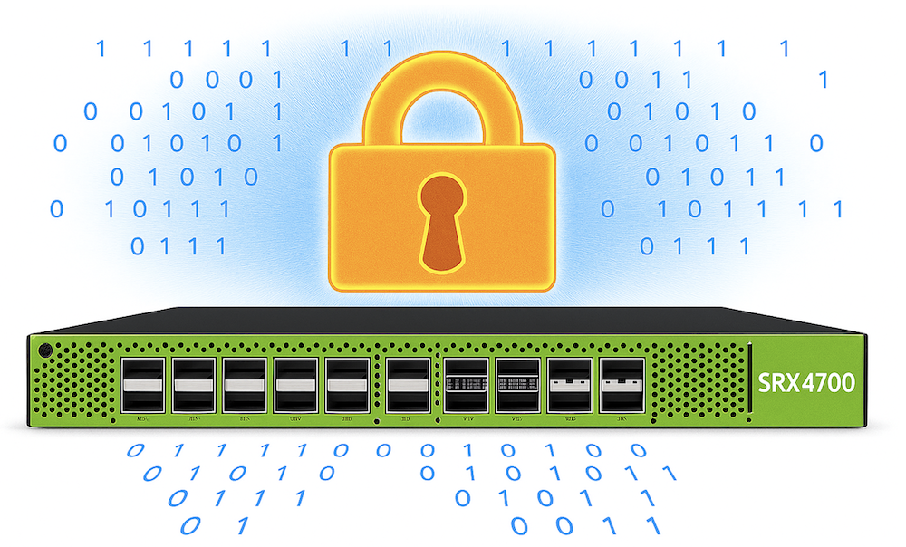
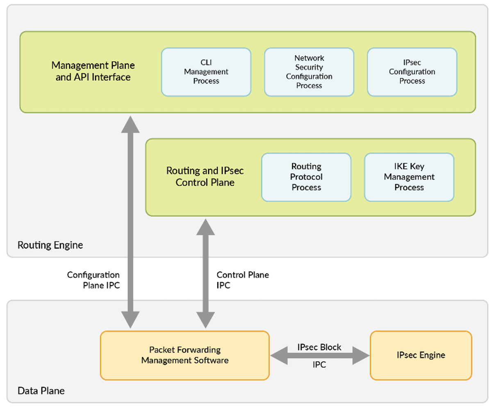
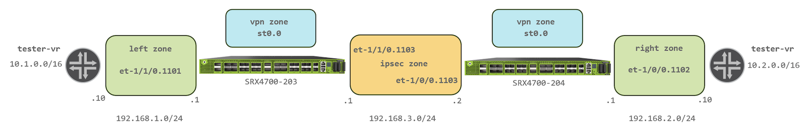
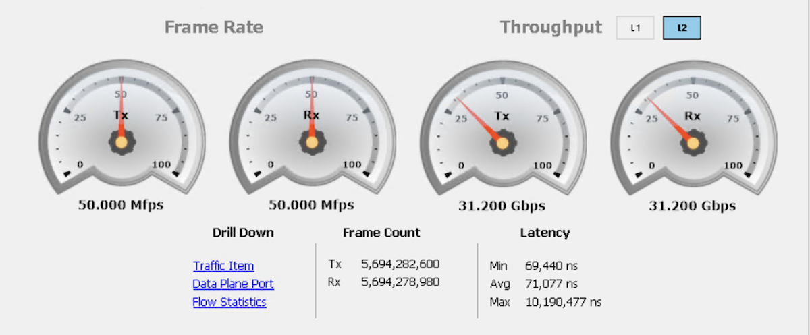
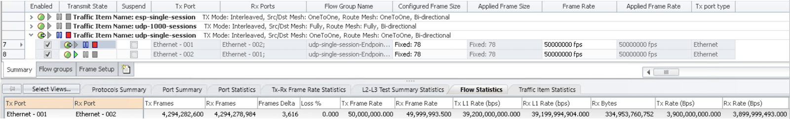
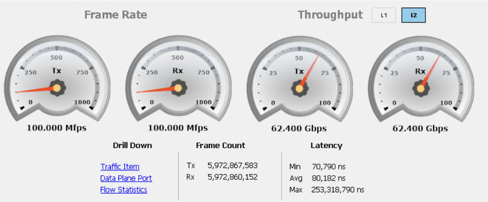
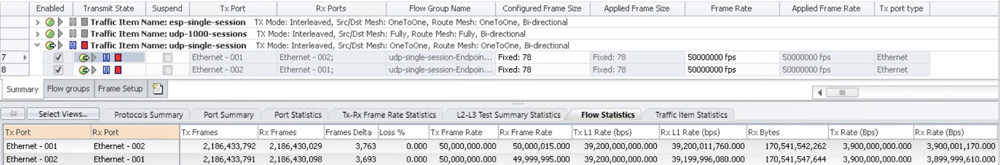
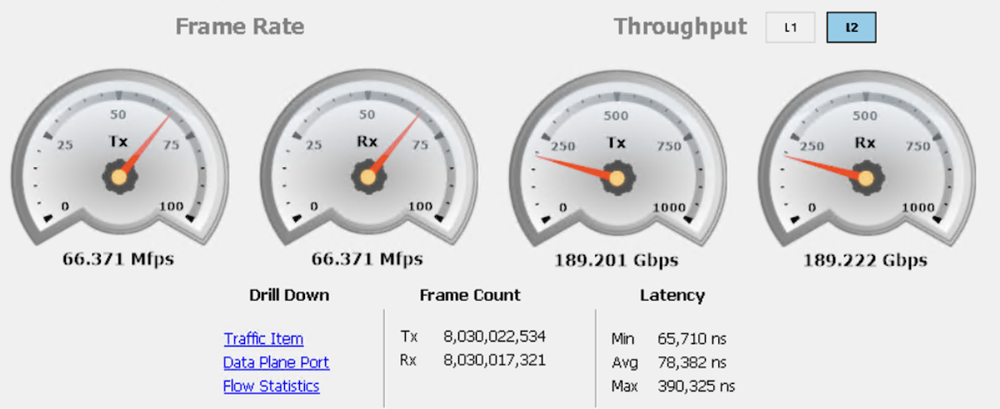
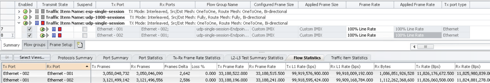

# SRX4700 100Gbps Full Duplex IPSEC tunnel

**Karel Hendrych - 11/05/2025**

The SRX4700 100Gbps Full Duplex IPSEC tunnel TechPost demonstrates the ability of the HPE Juniper Networking flagship 1RU firewall device to encrypt 100Gbps traffic patterns from a single system, such as a server or storage device, communicating within site-to-site tunnels. These single-tunnel, single-elephant flow use cases have never had practical solutions in the past: but this has now changed. Whilst this paper only concentrates on that use case (which was done for a customer performance Proof of Concept), it does not necessarily demonstrate the overall performance of the hardware-accelerated encryption enabled in Junos 25.2R1. The SRX4700 has significantly more headroom than what a single 100GE-connected system can practically produce. Typical use cases include backups, storage replication, and the transfer of large amounts of data between research organizations, whether supercomputer or AI-related workloads.



## Introduction

[The SRX4700](https://www.juniper.net/us/en/products/security/srx-series/srx4700-cloud-service-provider-firewall.html) is the next-generation 1RU fixed form factor firewall product that utilizes the [Juniper Trio 6 ASIC](https://juniper.github.io/techposts/trio-6-packet-walkthrough/article) (also known as YT silicon) as the Packet Forwarding Engine, along with two Intel Sapphire Rapids CPUs, combining resources for both the control and data planes. The Juniper YT ASIC is the same ASIC used in the MX range of routers and is widely deployed around the world. The flexibility of the YT ASIC with its unique fully programable forwarding path makes it an excellent accelerator for security use cases. These use cases range from large enterprise edge deployments to components of scale-out services for large service providers.

Two slices of the YT ASIC offer overall throughput of 1.6Tbps, on the SRX4700 divided between 1.4Tbps front panel Ethernet I/O and 200Gbps CPU connectivity. The idea is to process as much as possible within the YT chip using Services Offload aka [Express Path](https://www.juniper.net/documentation/us/en/software/junos/flow-packet-processing/topics/topic-map/security-express-path.html). This capability has been in SRX4600 and SRX5x00 for now more than a decade. What sets the YT ASIC apart is it now included crypto blocks that accelerate AES GCM encryption, and following on from MX terminology is called inline-IPSEC, [documented here](https://www.juniper.net/documentation/us/en/software/junos/vpn-ipsec/topics/concept/security-inline-ipsec.html). The MX platforms, for instance the [MX304](https://www.juniper.net/us/en/products/routers/mx-series/mx304-universal-routing-platform.html), have been enabled with inline-IPSEC since [Junos 24.4R1](https://www.juniper.net/documentation/us/en/software/junos/interfaces-adaptive-services/topics/topic-map/inline-ipsec.html), delivering scalable IPSEC performance by utilizing multiple PFEs.



Recently, there has been an increasing demand for high-throughput IPSEC tunnels, including elephant flows within those tunnels. As noted in the abstract, typical use cases include backup transfers to remote locations, distributed filesystems or storage replication, and the transfer of large amounts of data between research organizations, whether for supercomputer or AI-related workloads. The need for IPSEC arises in scenarios where MacSEC is not technically feasible (transport is L3 only) or policy deems the solution is insufficient (e.g., certification is required). Prior to the introduction of inline IPSEC, the technology used for high-speed tunnels on the SRX was Power Mode IPSEC, along with [Symmetrical Fat Tunnel](https://www.juniper.net/documentation/us/en/software/junos/vpn-ipsec/topics/topic-map/security-powermode-ipsec-vpn.html), often referred to as fat-core, which utilized multi-threaded processing of a single tunnel. With Junos 25.2R1, performance has increased by a clear order of magnitude due to processing in the YT ASIC, as demonstrated in the following text.

## The Demo Setup

### Topology

In a simplified manner, the demo consists of two back-to-back connected SRX4700 systems, each using a single 400GE interface with VLAN units for interconnection (ipsec zone) and the right and left zones towards a tester acting as the next hop for the respective /16 prefix. According to best practices, the route-based VPN tunnel interface is bound to its own zone (vpn). Hardware and software details are available in Appendix 2.



> Note: the physical topology, in addition to the SRX4700s, consists of QFX10k and PTX10001 devices for hosting 100GE and 400GE links that interconnect the devices and tester ports. The setup is not intended for latency measurements or for showcasing the full potential of the SRX4700's firewall and encryption capabilities.

### SRX Configuration Break-down

The next section breaks down a simple, self-explanatory configuration file used for the demo case of a 100GE-connected tester utilizing an IPSEC tunnel between the two 400GE-connected SRX4700 devices. The entire configurations of both devices are present in Appendix 1.

### SRX4700-203

Both PICs are configured in a mode with 1x400GE, 2x100GE, and 2x50GE (with 25GE, 10GE, 1GE capability):

```
set chassis fpc 1 pic 0 port-profile B-1X400G-2X100G-2X50G
set chassis fpc 1 pic 1 port-profile B-1X400G-2X100G-2X50G
```

IKE configuration classically defines encryption algorithms (with authentication in GCM modes embedded), DH (DHE) groups, lifetimes, pre-shared keys, and the remote peer, along with a bonus post-quantum security add-on in the form of [RFC 8784](https://www.juniper.net/documentation/us/en/software/junos/vpn-ipsec/topics/topic-map/quantum-safe-ipsec-vpn.html) support, where this setup serves as a technology demonstrator with static keys:

```
set security ike proposal ike-1 authentication-method pre-shared-keys
set security ike proposal ike-1 dh-group group20
set security ike proposal ike-1 encryption-algorithm aes-256-gcm
set security ike proposal ike-1 lifetime-seconds 28800
set security ike policy ike-1 proposals ike-1
set security ike policy ike-1 pre-shared-key ascii-text "<SNIP>"
set security ike gateway 4700 ike-policy ike-1
set security ike gateway 4700 address 192.168.3.2
set security ike gateway 4700 external-interface et-1/1/0.1103
set security ike gateway 4700 version v2-only
set security ike gateway 4700 ppk-profile quantum
set security key-manager profiles quantum static key-id ascii-text "<SNIP>"
set security key-manager profiles quantum static key ascii-text "<SNIP>"
```

In the IPSEC part, the child Security Association (SA) configuration effectively, defines encryption algorithms, lifetimes, Perfect Forward Secrecy, adjusts anti-replay attributes, and binds previously defined IKE settings and the tunnel adapter. The extended sequence number prevents fast rollovers of sequence numbers, and high-speed tunnels typically require larger anti-replay windows, which are configured to the maximum supported. For the cipher set, AES GCM mode must be used to enable hardware offload:

```
set security ipsec proposal ipsec-1 extended-sequence-number
set security ipsec proposal ipsec-1 encryption-algorithm aes-256-gcm
set security ipsec proposal ipsec-1 lifetime-seconds 3600
set security ipsec policy ipsec-1 perfect-forward-secrecy keys group20
set security ipsec policy ipsec-1 proposals ipsec-1
set security ipsec vpn 4700 bind-interface st0.0
set security ipsec vpn 4700 ike gateway 4700
set security ipsec vpn 4700 ike anti-replay-window-size 4096
set security ipsec vpn 4700 ike ipsec-policy ipsec-1
set security ipsec vpn 4700 establish-tunnels immediately
```

Security policies and zone configuration are kept as simple as possible---permitting any traffic and minimal host-inbound services for establishing the VPN:

```
set security policies global policy permit match source-address any
set security policies global policy permit match destination-address any
set security policies global policy permit match application any
set security policies global policy permit then permit
set security zones security-zone ipsec interfaces et-1/1/0.1103 host-inbound-traffic system-services ping
set security zones security-zone ipsec interfaces et-1/1/0.1103 host-inbound-traffic system-services ike
set security zones security-zone left interfaces et-1/1/0.1101 host-inbound-traffic system-services ping
set security zones security-zone vpn interfaces st0.0
```

Finally, VLAN-tagged 400GE interface units are configured with static routing towards the remote (via unnumbered tunnel interface) and tester prefixes:

```
set interfaces et-1/1/0 vlan-tagging
set interfaces et-1/1/0 mtu 9000
set interfaces et-1/1/0 unit 1101 vlan-id 1101
set interfaces et-1/1/0 unit 1101 family inet address 192.168.1.1/24
set interfaces et-1/1/0 unit 1103 vlan-id 1103
set interfaces et-1/1/0 unit 1103 family inet address 192.168.3.1/24
set interfaces st0 unit 0 family inet   
set routing-options static route 10.1.0.0/16 next-hop 192.168.1.10
set routing-options static route 10.2.0.0/16 next-hop st0.0
```

SRX4700-204

The VPN peer device is nearly identical, except for using the other 400GE interface (a matter of cabling; there's no difference), interface addressing, and reversed routing. As a side effect of using the alternative interface, the other crypto engine was utilized as well. For completeness, here's the diff of the SRX configurations, with the establish-tunnels immediately setting missing compared to the SRX4700-203:

```
diff SRX4700-203 SRX4700-204

10,11c10,11
< set security ike gateway 4700 address 192.168.3.2
< set security ike gateway 4700 external-interface et-1/1/0.1103
---
> set security ike gateway 4700 address 192.168.3.1
> set security ike gateway 4700 external-interface et-1/0/0.1103
23d22
< set security ipsec vpn 4700 establish-tunnels immediately
27,30c26,29
< set security policies global policy permit then permit
< set security zones security-zone ipsec interfaces et-1/1/0.1103 host-inbound-traffic system-services ping
< set security zones security-zone ipsec interfaces et-1/1/0.1103 host-inbound-traffic system-services ike
< set security zones security-zone left interfaces et-1/1/0.1101 host-inbound-traffic system-services ping
---
> set security policies global policy permit then permit 
> set security zones security-zone right interfaces et-1/0/0.1102 host-inbound-traffic system-services ping
> set security zones security-zone ipsec interfaces et-1/0/0.1103 host-inbound-traffic system-services ping
> set security zones security-zone ipsec interfaces et-1/0/0.1103 host-inbound-traffic system-services ike
34,42c33,41
< set interfaces et-1/1/0 vlan-tagging
< set interfaces et-1/1/0 mtu 9000
< set interfaces et-1/1/0 unit 1101 vlan-id 1101
< set interfaces et-1/1/0 unit 1101 family inet address 192.168.1.1/24
< set interfaces et-1/1/0 unit 1103 vlan-id 1103
< set interfaces et-1/1/0 unit 1103 family inet address 192.168.3.1/24
< set interfaces st0 unit 0 family inet   
< set routing-options static route 10.1.0.0/16 next-hop 192.168.1.10
< set routing-options static route 10.2.0.0/16 next-hop st0.0
---
> set interfaces et-1/0/0 vlan-tagging
> set interfaces et-1/0/0 mtu 9000
> set interfaces et-1/0/0 unit 1102 vlan-id 1102
> set interfaces et-1/0/0 unit 1102 family inet address 192.168.2.1/24
> set interfaces et-1/0/0 unit 1103 vlan-id 1103
> set interfaces et-1/0/0 unit 1103 family inet address 192.168.3.2/24
> set interfaces st0 unit 0 family inet
> set routing-options static route 10.1.0.0/16 next-hop st0.0
> set routing-options static route 10.2.0.0/16 next-hop 192.168.2.10
```

## Performance Demo

The performance demo covers the following three cases of single IPsec tunnel performance:

- 50M PPS unidirectional small packet encryption
- 100M PPS bidirectional small packet encryption / decryption
- 200Gbps IMIX encryption / decryption as the highlight

Sidenote: descriptions of the captures in the first demo case are more detailed, and reading them is recommended to fully understand outputs for the following two scenarios.

### 50M PPS 78B one direction

The following captures show SRX4700-203 encrypting a single UDP session at a nice round rate of 50 Million Packets Per Second (50M PPS). The frame was effectively set to 78 bytes to contain the UDP payload and tester signatures. Naturally, the other SRX4700 is only handling decryption.





> Note: the frame delta in IxNetwork Flow statistics is effectively "on the wire." Stopping the test would result in a frame delta of 0. Noteworthy is also the L1 bit rate.

For completeness, here is the output of the Junos monitor interface traffic, specifically the packet rate view, where the input and output rates on the et-1/1/0 interface are the same. However, st0 with pure output indicates encryption:

```
srx4700-203                       Seconds: 2                   Time: 09:40:32

Interface    Link  Input packets        (pps)     Output packets        (pps)
<SNIP>
 et-1/1/0      Up     7091726309   (49999931)       7091728134   (50000482)
<SNIP>
 st0           Up              0          (0)       7085670999   (50000429)
```

In the bits per second view, the interesting parts are the IPSEC overhead---specifically the et-1/1/0 output/input difference---and the L2 overhead when comparing tester and SRX bandwidth figures (L3):

```
srx4700-203                       Seconds: 22                  Time: 09:40:52

Interface    Link     Input bytes        (bps)      Output bytes        (bps)
<SNIP>
 et-1/1/0      Up    453933903877(22399916480)      907867779921(44799488800)
<SNIP>
 st0           Up               0          (0)      907188863840(44800738888)
```

Security Monitoring with No CPU Load, meaning there is no involvement of the CPU cores in bulk cryptographic operations:

```
root@srx4700-203> show security monitoring 
               
                  Flow session   Flow session     CP session     CP session 
FPC PIC CPU Mem        current        maximum        current        maximum
  0   0   0  17              3       44040192              0              0
```

IPSEC statistics showing pure encryption and No errors:

```
root@srx4700-203> show security ipsec statistics 

ESP Statistics:
  Encrypted bytes:     564503159752
  Decrypted bytes:                0
  Encrypted packets:    10080413567
  Decrypted packets:              0
AH Statistics:
  Input bytes:                    0
  Output bytes:                   0
  Input packets:                  0
  Output packets:                 0
Errors:
  AH authentication failures: 0, Replay errors: 0
  ESP authentication failures: 0, ESP decryption failures: 0
  Bad headers: 0, Bad trailers: 0
  Invalid SPI: 0, TS check fail: 0
  Exceeds tunnel MTU: 0
  Discarded: 0
```

Hardware-Accelerated IPSEC shown in flow statistics among services-offload packets processed:

```
root@srx4700-203> show security flow statistics 

    Current sessions: 3
    Packets received: 6143
    Packets transmitted: 6148
    Packets forwarded/queued: 0
    Packets copied: 0
    Packets dropped: 0
    Services-offload packets processed: 9794771735
    Fragment packets: 0
    Pre fragments generated: 0
    Post fragments generated: 0
```

The extensive session listing shows the single UDP session with the services-offload flag (also firewall processed in hardware), where the packets and bytes counter increased in one direction:

```
root@srx4700-203> show security flow session extensive 

Session ID: 4294967298, Status: Normal
Flags: 0x40/0x0/0x2/0x400003, services-offload
Policy name: permit/4
Source NAT pool: Null
Dynamic application: junos:UNKNOWN, 
Encryption:  Unknown
Url-category:  Unknown
Application traffic control rule-set: INVALID, Rule: INVALID
Maximum timeout: 60, Current timeout: 53
Session State: Valid
Start time: 1757835486, Duration: 203
   In: 10.1.0.1/1024 --> 10.2.0.1/1024;udp, 
  Conn Tag: 0x0, Attachment Id: 0, GW Endpoint Id: 0, Flow Cookie: 0, Interface: et-1/1/0.1101, 
    Session token: 0x8, Flag: 0x200021, 
    Power-Mode Active: True 
    Route: 0x50010, Gateway: 192.168.1.10, Tunnel ID: 0, Tunnel type: None, 
    Port sequence: 0, FIN sequence: 0, 
    FIN state: 0, 
    Pkts: 9794777873, Bytes: 724813452118
   Out: 10.2.0.1/1024 --> 10.1.0.1/1024;udp, 
  Conn Tag: 0x0, Interface: st0.0, 
    Session token: 0x9, Flag: 0x200020, 
    Power-Mode Active: True 
    Route: 0x20010, Gateway: 10.2.0.1, Tunnel ID: 500002, Tunnel type: IPsec, Tunnel info: 537370914 
    Port sequence: 0, FIN sequence: 0, 
    FIN state: 0, 
    Pkts: 0, Bytes: 0

<SNIP>
```

IPSEC SA detail confirming enabled hardware offload, Quantum security, Replay Window and Extended Sequence Numbers:

```
root@srx4700-203> show security ipsec security-associations detail 

ID: 500002 Virtual-system: root, VPN Name: 4700
  Local Gateway: 192.168.3.1, Remote Gateway: 192.168.3.2
  Local Identity: ipv4(0.0.0.0-255.255.255.255)
  Remote Identity: ipv4(0.0.0.0-255.255.255.255)
  TS Type: proxy-id
  Version: IKEv2
  Quantum Secured: Yes
  Hardware Offloaded: Yes
  PFS group: DH-group-20, Packet Encapsulation: None, Dest port: 0
  Passive mode tunneling: Disabled
  DF-bit: clear, Copy-Outer-DSCP: Disabled, Bind-interface: st0.0, Policy-name: ipsec-1
  Port: 500, Nego#: 0, Fail#: 0, Def-Del#: 0 Flag: 0 
  Tunnel events:
    Sun Sep 14 2025 09:34:29: IPsec SA negotiation succeeds (1 times)
  Location: FPC 0, PIC 0
  Anchorship: Thread 4
  Distribution-Profile: default-profile
  Direction: inbound, SPI: 0x6304b842, AUX-SPI: 0
                              , VPN Monitoring: -
    Hard lifetime: Expires in 3179 seconds
    Lifesize Remaining:  Unlimited
    Soft lifetime: Expires in 2559 seconds
    Mode: Tunnel(0 0), Type: dynamic, State: installed
    Protocol: ESP, Authentication: aes256-gcm, Encryption: aes-gcm (256 bits)
    Anti-replay service: counter-based enabled, Replay window size: 4096
    Extended-Sequence-Number: Enabled
    tunnel-establishment: establish-tunnels-immediately
    IKE SA Index: 5
  Direction: outbound, SPI: 0xa6ffa623, AUX-SPI: 0
                              , VPN Monitoring: -
    Hard lifetime: Expires in 3179 seconds
    Lifesize Remaining:  Unlimited
    Soft lifetime: Expires in 2559 seconds
    Mode: Tunnel(0 0), Type: dynamic, State: installed
    Protocol: ESP, Authentication: aes256-gcm, Encryption: aes-gcm (256 bits)
    Anti-replay service: counter-based enabled, Replay window size: 4096
    Extended-Sequence-Number: Enabled
    tunnel-establishment: establish-tunnels-immediately
    IKE SA Index: 5
```

### 50M PPS 78B Full-Duplex (100M PPS)

The following captures show SRX4700-203 handling both encryption and decryption of a bidirectional single UDP session at a nice round rate of 100M PPS (effectively 50M PPS in each direction). The frame size was 78 bytes, as in the previous test.





Junos monitor interface traffic, packet rate view, this time bi-directional:

```
srx4700-203                       Seconds: 2                   Time: 09:46:14

Interface    Link  Input packets        (pps)     Output packets        (pps)
<SNIP>
 et-1/1/0      Up     7514479226  (100000724)       7514478398  (100000545)
<SNIP>
 st0           Up     3751185732   (50000044)       3751187904   (49999994)
```

Bits per second view:

```
srx4700-203                       Seconds: 22                  Time: 09:46:34

Interface    Link     Input bytes        (bps)      Output bytes        (bps)
<SNIP>
 et-1/1/0      Up    801620369910(67200634152)      801620450500(67200837192)
<SNIP>
 st0           Up    266866982200(22400813280)      533734295696(44801769712)
```

Security monitoring with No CPU load:

```
root@srx4700-203> show security monitoring 
               
                  Flow session   Flow session     CP session     CP session 
FPC PIC CPU Mem        current        maximum        current        maximum
  0   0   0  17              3       44040192              0              0
```

IPSEC statistics, both encryption and decryption with No errors:

```
root@srx4700-203> show security ipsec statistics 

ESP Statistics:
  Encrypted bytes:     327747467040
  Decrypted bytes:     655494065968
  Encrypted packets:     5852633340
  Decrypted packets:     5852625589
AH Statistics:
  Input bytes:                    0
  Output bytes:                   0
  Input packets:                  0
  Output packets:                 0
Errors:
  AH authentication failures: 0, Replay errors: 0
  ESP authentication failures: 0, ESP decryption failures: 0
  Bad headers: 0, Bad trailers: 0
  Invalid SPI: 0, TS check fail: 0
  Exceeds tunnel MTU: 0
  Discarded: 0
```

Flow statistics:

```
root@srx4700-203> show security flow statistics
 
    Current sessions: 3
    Packets received: 171300
    Packets transmitted: 171303
    Packets forwarded/queued: 0
    Packets copied: 0
    Packets dropped: 0
    Services-offload packets processed: 16175088435
    Fragment packets: 0
    Pre fragments generated: 0
    Post fragments generated: 0
```

The extensive session listing shows the single UDP session with the services-offload flag, where the packets and bytes counters increased in both directions:

```
root@srx4700-203> show security flow session extensive 

Session ID: 8589934594, Status: Normal
Flags: 0x40/0x0/0x2/0x400003, services-offload
Policy name: permit/4
Source NAT pool: Null
Dynamic application: junos:UNKNOWN, 
Encryption:  Unknown
Url-category:  Unknown
Application traffic control rule-set: INVALID, Rule: INVALID
Maximum timeout: 60, Current timeout: 51
Session State: Valid
Start time: 1757835894, Duration: 117
   In: 10.1.0.1/1024 --> 10.2.0.1/1024;udp, 
  Conn Tag: 0x0, Attachment Id: 0, GW Endpoint Id: 0, Flow Cookie: 0, Interface: et-1/1/0.1101, 
    Session token: 0x8, Flag: 0x200021, 
    Power-Mode Active: True 
    Route: 0x50010, Gateway: 192.168.1.10, Tunnel ID: 0, Tunnel type: None, 
    Port sequence: 0, FIN sequence: 0, 
    FIN state: 0, 
    Pkts: 5394164183, Bytes: 399168032200
   Out: 10.2.0.1/1024 --> 10.1.0.1/1024;udp, 
  Conn Tag: 0x0, Interface: st0.0, 
    Session token: 0x9, Flag: 0x200020, 
    Power-Mode Active: True 
    Route: 0x20010, Gateway: 10.2.0.1, Tunnel ID: 500003, Tunnel type: IPsec, Tunnel info: 537370915 
    Port sequence: 0, FIN sequence: 0, 
    FIN state: 0, 
    Pkts: 5394367769, Bytes: 302084595064

<SNIP>
```

IPSEC SA detail confirming enabled hardware offload, Quantum security, Replay Window and Extended Sequence Numbers:

```
root@srx4700-203> show security ipsec security-associations detail 

ID: 500003 Virtual-system: root, VPN Name: 4700
  Local Gateway: 192.168.3.1, Remote Gateway: 192.168.3.2
  Local Identity: ipv4(0.0.0.0-255.255.255.255)
  Remote Identity: ipv4(0.0.0.0-255.255.255.255)
  TS Type: proxy-id
  Version: IKEv2
  Quantum Secured: Yes
  Hardware Offloaded: Yes
  PFS group: DH-group-20, Packet Encapsulation: None, Dest port: 0
  Passive mode tunneling: Disabled
  DF-bit: clear, Copy-Outer-DSCP: Disabled, Bind-interface: st0.0, Policy-name: ipsec-1
  Port: 500, Nego#: 0, Fail#: 0, Def-Del#: 0 Flag: 0 
  Tunnel events:
    Sun Sep 14 2025 09:42:27: IPsec SA negotiation succeeds (1 times)
  Location: FPC 0, PIC 0
  Anchorship: Thread 4
  Distribution-Profile: default-profile
  Direction: inbound, SPI: 0xf1ab1765, AUX-SPI: 0
                              , VPN Monitoring: -
    Hard lifetime: Expires in 3334 seconds
    Lifesize Remaining:  Unlimited
    Soft lifetime: Expires in 2653 seconds
    Mode: Tunnel(0 0), Type: dynamic, State: installed
    Protocol: ESP, Authentication: aes256-gcm, Encryption: aes-gcm (256 bits)
    Anti-replay service: counter-based enabled, Replay window size: 4096
    Extended-Sequence-Number: Enabled
    tunnel-establishment: establish-tunnels-immediately
    IKE SA Index: 7
  Direction: outbound, SPI: 0x00f61780, AUX-SPI: 0
                              , VPN Monitoring: -
    Hard lifetime: Expires in 3334 seconds
    Lifesize Remaining:  Unlimited
    Soft lifetime: Expires in 2653 seconds
    Mode: Tunnel(0 0), Type: dynamic, State: installed
    Protocol: ESP, Authentication: aes256-gcm, Encryption: aes-gcm (256 bits)
    Anti-replay service: counter-based enabled, Replay window size: 4096
    Extended-Sequence-Number: Enabled
    tunnel-establishment: establish-tunnels-immediately
    IKE SA Index: 7
```

### 100GE Full-Duplex Line Rate IMIX

The final showcase features an IMIX-like traffic mix consisting of 78B, 570B, and 1450B frames, weighted 7:4:1. The resulting packet rate of about 66M PPS is lower than in the previous test case. However, the traffic pattern fully saturates the full-duplex 100GE tester interfaces. The packet rate is the primary concern; larger packets would result in a lower packet rate.





Junos monitor interface traffic, packet rate view:

```
srx4700-203                       Seconds: 4                   Time: 09:32:07

Interface    Link  Input packets        (pps)     Output packets        (pps)
<SNIP>
 et-1/1/0      Up     9662637781   (66376377)       9662636568   (66376205)
<SNIP>
 st0           Up     4791580289   (33187868)       4863019052   (33189093)
```

Bits per second view:

```
srx4700-203                       Seconds: 18                  Time: 09:32:21

Interface    Link     Input bytes        (bps)      Output bytes        (bps)
<SNIP>
 et-1/1/0      Up   3824293730855(192390414472)     3828294540013(192391509024)
<SNIP>
 st0           Up   1752032694540(88765783872)     2073347273192(103629977504)
```

Security monitoring with No CPU load:

```
root@srx4700-203> show security monitoring  
              
                  Flow session   Flow session     CP session     CP session 
FPC PIC CPU Mem        current        maximum        current        maximum
  0   0   0  17              3       44040192              0              0
```

IPSEC statistics, both encryption and decryption with No errors:

```
root@srx4700-203> show security ipsec statistics 

ESP Statistics:
  Encrypted bytes:    2013159389220
  Decrypted bytes:    2322513516792
  Encrypted packets:     6021575570
  Decrypted packets:     5950157644
AH Statistics:
  Input bytes:                    0
  Output bytes:                   0
  Input packets:                  0
  Output packets:                 0
Errors:
  AH authentication failures: 0, Replay errors: 0
  ESP authentication failures: 0, ESP decryption failures: 0
  Bad headers: 0, Bad trailers: 0
  Invalid SPI: 0, TS check fail: 0
  Exceeds tunnel MTU: 0
  Discarded: 0
```

Flow statistics:

```
root@srx4700-203> show security flow statistics
 
    Current sessions: 3
    Packets received: 181
    Packets transmitted: 187
    Packets forwarded/queued: 0
    Packets copied: 0
    Packets dropped: 0
    Services-offload packets processed: 17191286339
    Fragment packets: 0
    Pre fragments generated: 0
    Post fragments generated: 0
```

The extensive session listing shows the single UDP session with the services-offload flag, where the packets and bytes counters increased in both directions:

```
root@srx4700-203> show security flow session extensive 

Session ID: 2, Status: Normal
Flags: 0x40/0x0/0x2/0x400003, services-offload
Policy name: permit/4
Source NAT pool: Null
Dynamic application: junos:UNKNOWN, 
Encryption:  Unknown
Url-category:  Unknown
Application traffic control rule-set: INVALID, Rule: INVALID
Maximum timeout: 60, Current timeout: 52
Session State: Valid
Start time: 1757834961, Duration: 198
   In: 10.1.0.1/1024 --> 10.2.0.1/1024;udp, 
  Conn Tag: 0x0, Attachment Id: 0, GW Endpoint Id: 0, Flow Cookie: 0, Interface: et-1/1/0.1101, 
    Session token: 0x8, Flag: 0x200021, 
    Power-Mode Active: True 
    Route: 0x50010, Gateway: 192.168.1.10, Tunnel ID: 0, Tunnel type: None, 
    Port sequence: 0, FIN sequence: 0, 
    FIN state: 0, 
    Pkts: 5778666557, Bytes: 2035970201938
   Out: 10.2.0.1/1024 --> 10.1.0.1/1024;udp, 
  Conn Tag: 0x0, Interface: st0.0, 
    Session token: 0x9, Flag: 0x200020, 
    Power-Mode Active: True 
    Route: 0x20010, Gateway: 10.2.0.1, Tunnel ID: 500001, Tunnel type: IPsec, Tunnel info: 537370913 
    Port sequence: 0, FIN sequence: 0, 
    FIN state: 0, 
    Pkts: 5707375734, Bytes: 1908155536312

<SNIP>
```

IPSEC SA detail confirming enabled hardware offload and Quantum security:

```
root@srx4700-203> show security ipsec security-associations detail 

ID: 500001 Virtual-system: root, VPN Name: 4700
  Local Gateway: 192.168.3.1, Remote Gateway: 192.168.3.2
  Local Identity: ipv4(0.0.0.0-255.255.255.255)
  Remote Identity: ipv4(0.0.0.0-255.255.255.255)
  TS Type: proxy-id
  Version: IKEv2
  Quantum Secured: Yes
  Hardware Offloaded: Yes
  PFS group: DH-group-20, Packet Encapsulation: None, Dest port: 0
  Passive mode tunneling: Disabled
  DF-bit: clear, Copy-Outer-DSCP: Disabled, Bind-interface: st0.0, Policy-name: ipsec-1
  Port: 500, Nego#: 0, Fail#: 0, Def-Del#: 0 Flag: 0 
  Tunnel events:
    Sun Sep 14 2025 09:25:00: IPsec SA negotiation succeeds (1 times)
  Location: FPC 0, PIC 0
  Anchorship: Thread 4
  Distribution-Profile: default-profile
  Direction: inbound, SPI: 0x0d9cf365, AUX-SPI: 0
                              , VPN Monitoring: -
    Hard lifetime: Expires in 3141 seconds
    Lifesize Remaining:  Unlimited
    Soft lifetime: Expires in 2446 seconds
    Mode: Tunnel(0 0), Type: dynamic, State: installed
    Protocol: ESP, Authentication: aes256-gcm, Encryption: aes-gcm (256 bits)
    Anti-replay service: counter-based enabled, Replay window size: 4096
    Extended-Sequence-Number: Enabled
    tunnel-establishment: establish-tunnels-immediately
    IKE SA Index: 3
  Direction: outbound, SPI: 0x3d56d8be, AUX-SPI: 0
                              , VPN Monitoring: -
    Hard lifetime: Expires in 3141 seconds
    Lifesize Remaining:  Unlimited
    Soft lifetime: Expires in 2446 seconds
    Mode: Tunnel(0 0), Type: dynamic, State: installed
    Protocol: ESP, Authentication: aes256-gcm, Encryption: aes-gcm (256 bits)
    Anti-replay service: counter-based enabled, Replay window size: 4096
    Extended-Sequence-Number: Enabled
    tunnel-establishment: establish-tunnels-immediately
    IKE SA Index: 3
```

## Power Consumption

In the following captures, the dual AC power supply-equipped SRX4700 demonstrates its efficiency in terms of power consumption. The potential differences in power consumption between the demo and production environments would primarily stem from the used optical modules and environmental conditions.

### With traffic

The data are taken from the demo case of 100M PPS with 78B packets:

```
root@srx4700-203> show chassis environment pem    

PEM 0 status:
  State                      Online
  Airflow                    Front to Back                           
  Temp Sensor 0                           35 degrees C / 95 degrees F             
  Temp Sensor 1                           45 degrees C / 113 degrees F            
  Temp Sensor 2                           46 degrees C / 114 degrees F            
  Firmware version           1.5, 2.5                                
  Fan 0                      13744 RPM                               
  DC Output           Voltage(V) Current(A)  Power(W)  Load(%)
                        12.01       25.41         305      13     
  Input                      Voltage(V)  Current(A) Power(W)
  INP INP1                   234.2       1.4        317.5   
  Health check Information:
      Status:                    Unsupported
PEM 1 status:
  State                      Online
  Airflow                    Front to Back                           
  Temp Sensor 0                           35 degrees C / 95 degrees F             
  Temp Sensor 1                           45 degrees C / 113 degrees F            
  Temp Sensor 2                           44 degrees C / 111 degrees F            
  Firmware version           1.5, 2.5                                
  Fan 0                      12992 RPM                               
  DC Output           Voltage(V) Current(A)  Power(W)  Load(%)
                        12.03       23.56         283      12     
  Input                      Voltage(V)  Current(A) Power(W)
  INP INP1                   234.2       1.4        309.0   
  Health check Information:
      Status:                    Unsupported
```

### Without traffic

Due to the internal architecture, the power consumption difference between states with and without traffic load is minimal:

```
root@srx4700-203> show chassis environment pem    

PEM 0 status:
  State                      Online
  Airflow                    Front to Back                           
  Temp Sensor 0                           35 degrees C / 95 degrees F             
  Temp Sensor 1                           45 degrees C / 113 degrees F            
  Temp Sensor 2                           46 degrees C / 114 degrees F            
  Firmware version           1.5, 2.5                                
  Fan 0                      13776 RPM                               
  DC Output           Voltage(V) Current(A)  Power(W)  Load(%)
                        12.02       23.53         282      12     
  Input                      Voltage(V)  Current(A) Power(W)
  INP INP1                   233.0       1.4        311.5   
  Health check Information:
      Status:                    Unsupported
PEM 1 status:
  State                      Online
  Airflow                    Front to Back                           
  Temp Sensor 0                           35 degrees C / 95 degrees F             
  Temp Sensor 1                           45 degrees C / 113 degrees F            
  Temp Sensor 2                           44 degrees C / 111 degrees F            
  Firmware version           1.5, 2.5                                
  Fan 0                      12992 RPM                               
  DC Output           Voltage(V) Current(A)  Power(W)  Load(%)
                        12.03       23.38         281      12     
  Input                      Voltage(V)  Current(A) Power(W)
  INP INP1                   233.2       1.4        301.0   
  Health check Information:
      Status:                    Unsupported
```

## Conclusion

The YT silicon-powered SRX4700's cryptographic (and inherently firewall) performance makes it an interesting choice for high-bandwidth IPSEC and firewall applications. Whether for enterprise data center interconnect or as an SP-grade encryption use case, the SRX4700's capabilities---such as the demonstrated 100 Gbps IMIX full-duplex tunnel---are sufficient to match most of the systems capable of handling massive amounts of data using high-bandwidth interfaces. Additionally, the SRX4700's low footprint in terms of size and the power consumption documented in this TechPost are also potential decision factors for modern security solutions.

## Appendix 1: Complete Configuration

### SRX4700-203

```
set chassis fpc 1 pic 0 port-profile B-1X400G-2X100G-2X50G
set chassis fpc 1 pic 1 port-profile B-1X400G-2X100G-2X50G
set security ike proposal ike-1 authentication-method pre-shared-keys
set security ike proposal ike-1 dh-group group20
set security ike proposal ike-1 encryption-algorithm aes-256-gcm
set security ike proposal ike-1 lifetime-seconds 28800
set security ike policy ike-1 proposals ike-1
set security ike policy ike-1 pre-shared-key ascii-text "<SNIP>"
set security ike gateway 4700 ike-policy ike-1
set security ike gateway 4700 address 192.168.3.2
set security ike gateway 4700 external-interface et-1/1/0.1103
set security ike gateway 4700 version v2-only
set security ike gateway 4700 ppk-profile quantum
set security ipsec proposal ipsec-1 extended-sequence-number
set security ipsec proposal ipsec-1 encryption-algorithm aes-256-gcm
set security ipsec proposal ipsec-1 lifetime-seconds 3600
set security ipsec policy ipsec-1 perfect-forward-secrecy keys group20
set security ipsec policy ipsec-1 proposals ipsec-1
set security ipsec vpn 4700 bind-interface st0.0
set security ipsec vpn 4700 ike gateway 4700
set security ipsec vpn 4700 ike anti-replay-window-size 4096
set security ipsec vpn 4700 ike ipsec-policy ipsec-1
set security ipsec vpn 4700 establish-tunnels immediately
set security policies global policy permit match source-address any
set security policies global policy permit match destination-address any
set security policies global policy permit match application any
set security policies global policy permit then permit
set security zones security-zone ipsec interfaces et-1/1/0.1103 host-inbound-traffic system-services ping
set security zones security-zone ipsec interfaces et-1/1/0.1103 host-inbound-traffic system-services ike
set security zones security-zone left interfaces et-1/1/0.1101 host-inbound-traffic system-services ping
set security zones security-zone vpn interfaces st0.0
set security key-manager profiles quantum static key-id ascii-text "<SNIP>"
set security key-manager profiles quantum static key ascii-text "<SNIP>"
set interfaces et-1/1/0 vlan-tagging
set interfaces et-1/1/0 mtu 9000
set interfaces et-1/1/0 unit 1101 vlan-id 1101
set interfaces et-1/1/0 unit 1101 family inet address 192.168.1.1/24
set interfaces et-1/1/0 unit 1103 vlan-id 1103
set interfaces et-1/1/0 unit 1103 family inet address 192.168.3.1/24
set interfaces st0 unit 0 family inet   
set routing-options static route 10.1.0.0/16 next-hop 192.168.1.10
set routing-options static route 10.2.0.0/16 next-hop st0.0
```

### SRX4700-204

```
set chassis fpc 1 pic 0 port-profile B-1X400G-2X100G-2X50G
set chassis fpc 1 pic 1 port-profile B-1X400G-2X100G-2X50G
set security ike proposal ike-1 authentication-method pre-shared-keys
set security ike proposal ike-1 dh-group group20
set security ike proposal ike-1 encryption-algorithm aes-256-gcm
set security ike proposal ike-1 lifetime-seconds 28800
set security ike policy ike-1 proposals ike-1
set security ike policy ike-1 pre-shared-key ascii-text "<SNIP>"
set security ike gateway 4700 ike-policy ike-1
set security ike gateway 4700 address 192.168.3.1
set security ike gateway 4700 external-interface et-1/0/0.1103
set security ike gateway 4700 version v2-only
set security ike gateway 4700 ppk-profile quantum
set security ipsec proposal ipsec-1 extended-sequence-number
set security ipsec proposal ipsec-1 encryption-algorithm aes-256-gcm
set security ipsec proposal ipsec-1 lifetime-seconds 3600
set security ipsec policy ipsec-1 perfect-forward-secrecy keys group20
set security ipsec policy ipsec-1 proposals ipsec-1
set security ipsec vpn 4700 bind-interface st0.0
set security ipsec vpn 4700 ike gateway 4700
set security ipsec vpn 4700 ike anti-replay-window-size 4096
set security ipsec vpn 4700 ike ipsec-policy ipsec-1
set security policies global policy permit match source-address any
set security policies global policy permit match destination-address any
set security policies global policy permit match application any
set security policies global policy permit then permit 
set security zones security-zone right interfaces et-1/0/0.1102 host-inbound-traffic system-services ping
set security zones security-zone ipsec interfaces et-1/0/0.1103 host-inbound-traffic system-services ping
set security zones security-zone ipsec interfaces et-1/0/0.1103 host-inbound-traffic system-services ike
set security zones security-zone vpn interfaces st0.0
set security key-manager profiles quantum static key-id ascii-text "<SNIP>"
set security key-manager profiles quantum static key ascii-text "<SNIP>"
set interfaces et-1/0/0 vlan-tagging
set interfaces et-1/0/0 mtu 9000
set interfaces et-1/0/0 unit 1102 vlan-id 1102
set interfaces et-1/0/0 unit 1102 family inet address 192.168.2.1/24
set interfaces et-1/0/0 unit 1103 vlan-id 1103
set interfaces et-1/0/0 unit 1103 family inet address 192.168.3.2/24
set interfaces st0 unit 0 family inet
set routing-options static route 10.1.0.0/16 next-hop st0.0
set routing-options static route 10.2.0.0/16 next-hop 192.168.2.10
```

## Appendix 2 - DUT HW/SW details

### SRX4700-203

```
root@srx4700-203> show version
 
Hostname: srx4700-203
Model: srx4700
Family: junos-es
Junos: 25.2R1.9

root@srx4700-203> show chassis hardware 

Hardware inventory:
Item             Version  Part number  Serial number     Description
Chassis                                RG856             SRX4700
Midplane         REV 36   750-165443   EBBV2901          SRX4700
Routing Engine 0          BUILTIN      BUILTIN           SRX Routing Engine
CB 0                      BUILTIN      BUILTIN           Control Board
FPC 0                     BUILTIN      BUILTIN           SRX4700 SPM
  PIC 0                   BUILTIN      BUILTIN           SRX4700 Flow PIC
FPC 1            REV 15   750-158373   EBBV3427          SRX4700 FPC
  PIC 0                   BUILTIN      BUILTIN           1x400G/5x100G/8x50G
    Xcvr 0       REV 01   740-085349   1W2CZBA73301W     QSFP56-DD-400GBASE-FR4
  PIC 1                   BUILTIN      BUILTIN           1x400G/5x100G/8x50G
    Xcvr 0       REV 01   740-085349   1W2CZBA84902X     QSFP56-DD-400GBASE-FR4
Power Supply 0   REV 02   740-110419   1F27E310534       AC AFO 2200W Power Supply
Power Supply 1   REV 02   740-110419   1F27E310335       AC AFO 2200W Power Supply
Fan Tray 0       REV 06   760-169640   EBBV2521          SRX4700 FAN Board
Fan Tray 1       REV 06   760-169640   EBBV2470          SRX4700 FAN Board
Fan Tray 2       REV 06   760-169640   EBBV2299          SRX4700 FAN Board
Fan Tray 3       REV 06   760-169640   EBBV2523          SRX4700 FAN Board
Fan Tray 4       REV 06   760-169640   EBBV2449          SRX4700 FAN Board
Fan Tray 5       REV 06   760-169640   EBBV2243          SRX4700 FAN Board
```

### SRX4700-204

```
root@srx4700-204> show version 

Hostname: srx4700-204
Model: srx4700
Family: junos-es
Junos: 25.2R1.9

root@srx4700-204> show chassis hardware 

Hardware inventory:
Item             Version  Part number  Serial number     Description
Chassis                                RG881             SRX4700
Midplane         REV 36   750-165443   EBBV2847          SRX4700
Routing Engine 0          BUILTIN      BUILTIN           SRX Routing Engine
CB 0                      BUILTIN      BUILTIN           Control Board
FPC 0                     BUILTIN      BUILTIN           SRX4700 SPM
  PIC 0                   BUILTIN      BUILTIN           SRX4700 Flow PIC
FPC 1            REV 15   750-158373   EBBV3415          SRX4700 FPC
  PIC 0                   BUILTIN      BUILTIN           1x400G/5x100G/8x50G
    Xcvr 0       REV 01   740-085349   1W2CZBA54703M     QSFP56-DD-400GBASE-FR4
  PIC 1                   BUILTIN      BUILTIN           1x400G/5x100G/8x50G
    Xcvr 0       REV 01   740-085349   1W2CZBA73301V     QSFP56-DD-400GBASE-FR4
Power Supply 0   REV 02   740-110419   1F27E310601       AC AFO 2200W Power Supply
Power Supply 1   REV 02   740-110419   1F27E310005       AC AFO 2200W Power Supply
Fan Tray 0       REV 06   760-169640   EBBV2410          SRX4700 FAN Board
Fan Tray 1       REV 06   760-169640   EBBV2554          SRX4700 FAN Board
Fan Tray 2       REV 06   760-169640   EBBV2101          SRX4700 FAN Board
Fan Tray 3       REV 06   760-169640   EBBV2484          SRX4700 FAN Board
Fan Tray 4       REV 06   760-169640   EBBV2547          SRX4700 FAN Board
Fan Tray 5       REV 06   760-169640   EBBV2347          SRX4700 FAN Board
```

## Useful links

- [https://www.juniper.net/content/dam/www/assets/datasheets/us/en/security/srx4700-firewall-datasheet.pdf](https://www.juniper.net/content/dam/www/assets/datasheets/us/en/security/srx4700-firewall-datasheet.pdf)
- [https://www.juniper.net/documentation/us/en/software/junos/vpn-ipsec/topics/concept/security-inline-ipsec.html](https://www.juniper.net/documentation/us/en/software/junos/vpn-ipsec/topics/concept/security-inline-ipsec.html)
- [https://www.juniper.net/documentation/us/en/software/junos/vpn-ipsec/vpn-ipsec.pdf](https://www.juniper.net/documentation/us/en/software/junos/vpn-ipsec/vpn-ipsec.pdf)

## Glossary

- AES: Advanced Encryption Standard
- ASIC: Application Specific Integrated Circuit
- CPU: Central Processing Unit
- DH: Diffie Helman
- DUT: Device Under Test
- EDH: Elliptic Curve Diffie Helman
- GCM: Galois Counter Mode
- IMIX: Internet MIX
- IPSEC: Application Layer Gateway
- MACSEC: Media Access Control Security
- PFE: Packet Forwarding Engine
- PIC: Physical Interface Card
- PPS: Packets Per Second
- RU: Rack Unit
- UDP: User Datagram Protocol
- VLAN: Virtual Local Area Network
- VPN: Virtual Private Network

## Acknowledgements

I would like to thank Nicolas Fevrier for tirelessly overseeing the TechPosts site and managing all the publishing tasks. I also want to acknowledge all my colleagues, particularly Mark Barrett as the co-author, along with Kelly Brazil, Tim Carlens, Steven Jacques and Matthijs Nagel, who provided valuable feedback. A special thanks goes to the SRX development and product teams for delivering the Swiss Army knife of security and networking! Lastly, this work would not have been possible without the professional equipment and helpful personnel in the HPE Juniper Networking Amsterdam labs.
