# SRX/CloudATP Multi-Tenant DNS Filtering

**Karel Hendrych - 12/28/2024**

Describes the ability of the Juniper SRX, in conjunction with the CloudATP service, to enforce DNS query blocking through an API-driven, multi-tenant approach. Each tenant has its own virtual router, ingress zone, dedicated API token, and independent visibility for granular control and operational separation.

## Introduction

Lately, security intelligence services on perimeter firewalls that categorize threat levels for IP addresses and URLs have become a common basic measure to prevent access to known malicious destinations. Companies are also utilizing their own threat intelligence data to enhance vendor and third-party feeds. In certain situations, multi-tenancy with custom threat intelligence on the same physical or virtual firewall may be required. This includes separation from the perspective of the API used to modify the lists of DNS queries to block or sinkhole, as well as ensuring corresponding visibility regarding the actions taken. For example, this could apply to an IoT security use case.

In more detail, the following text explains the ability of [CloudATP](https://www.juniper.net/documentation/us/en/software/atp-cloud/atp-cloud-admin-guide/topics/concept/atp-cloud-about.html)-enabled SRX devices to filter DNS queries by using per-tenant security intelligence feeds. This is achieved by assigning the SRX device to a CloudATP realm, mapping individual routing instances to API-enabled subordinate realms, and enabling granular DNS query control.

This feature set is available on premium-tier licensed SRX devices because of the use of the CloudATP API. However, an easy way to try it out is by using vSRX with a security subscription [Trial license](https://www.juniper.net/us/en/dm/download-next-gen-vsrx-firewall-trial.html) available for registered customers and partners. Alternatively, licenses can be obtained through Juniper sales representatives.

## Topology

Let's consider the following topology. The base configuration of the SRX is detailed in Appendix 1, while the expansion through Secintel settings will be addressed in the upcoming sections. Two tenants, designated as green-colored T1 and blue-colored T2, each have their own virtual router instance linked to the corresponding zone (T1 or T2) via an interface. The default gateway is imported from the VR-COMMON routing instance, which has an interface assigned to the common source NAT-enabled UNTRUST zone leading to the Internet. This default gateway import is unidirectional, utilizing the established flow for return traffic.

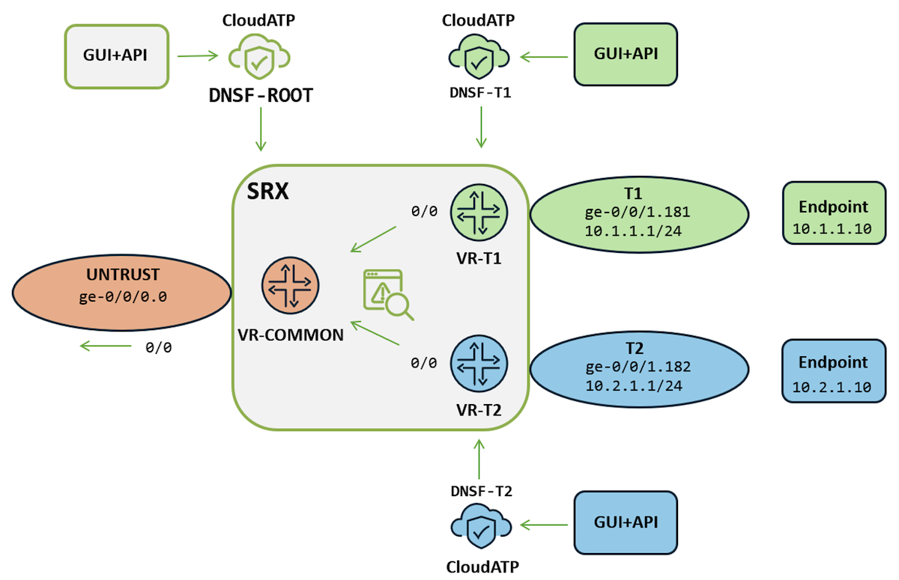

## Summary of Steps

In summary, the approach involves the administrator of the entire setup to:

- Enroll the SRX into a CloudATP realm called, for example, DNSF-ROOT.
- Follow this with the creation of two additional CloudATP realms, DNSF-T1 and DNSF-T2, which are attached to DNSF-ROOT.
- In the Managed Security Services Provider (MSSP) style DNSF-ROOT realm, assign VRs T1 and T2 to the corresponding realms.
- Once the SRX-CloudATP setup is complete, establish API tokens for the tenant realms.
- Follow this with the SRX-side feed and enforcement configuration.
- Complete the API data load and verification as the final steps.

In this specific example, a challenging aspect of DNS is the use of encryption methods such as DNS over TLS (DoT) and DNS over HTTPS (DoH) by clients, which can evade DNS filtering. This topic will be discussed in the Encrypted DNS section.

### CloudATP Setup

The prerequisite is either a commercial Premium CloudATP tier or any Premium trial assigned on the cloud side to the physical SRX serial number. In the case of vSRX, Premium entitlement to the software serial number of the ATP license on the cloud side is required. For vSRX,[ a Trial license](https://www.juniper.net/us/en/dm/download-next-gen-vsrx-firewall-trial.html) set can be immediately used by registered users.

To establish a Cloud ATP realm, a Juniper account must be used in the corresponding region selected on [the global CloudATP page](https://sky.junipersecurity.net/).

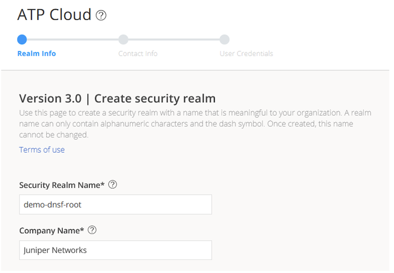

In the next step, the SRX device needs to be enrolled by executing the proposed request command in the SRX CLI:

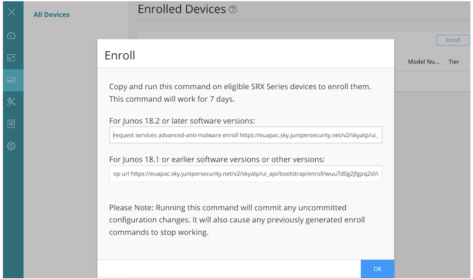

> Note: in case of enrollment issues, the output can be compared to the successful enrollment output provided in Appendix 2.

Upon CloudATP enrollment, the list of devices will include the actual physical or virtual SRX, as well as arbitrary devices representing routing instances:

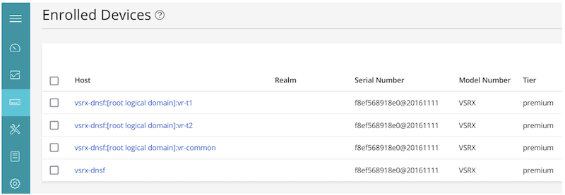

### CloudATP Tenant Realms

In the next steps, realms for attaching to the DNSF-ROOT realm need to be created from the initial CloudATP page using the same process for both DNSF-T1 and DNSF-T2, as there is no separate process for subordinate realms:

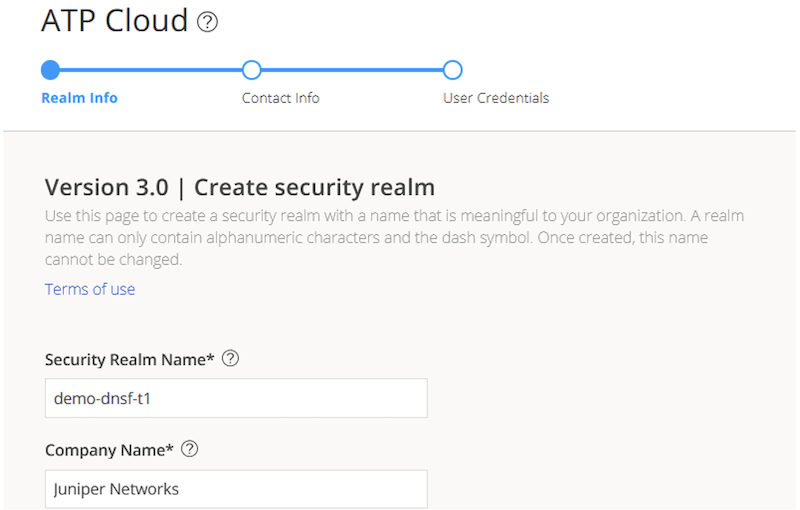

Newly created realms must be attached in the DNSF-ROOT under Misc Configuration/Realm Management:

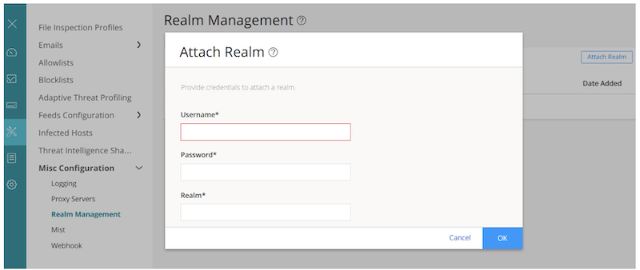

After attaching the realms, a drop-down for realm selection will be available in the upper right corner of the DNSF-ROOT:

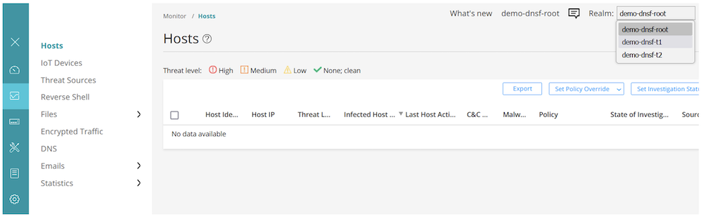

As the next step, in the DNSF-ROOT realm management, device association (Virtual Routers) to realms is configured:

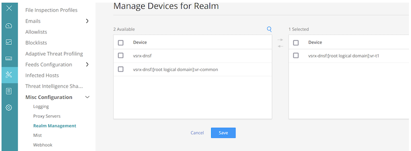

For example, the resulting list of MSSP-style realms and their associated VR devices:

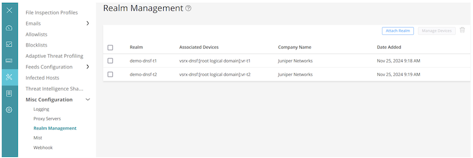

Naturally, when logging in as the DNSF-T1/T2 admin, the management scope is limited to the specific realm, with no realm selection drop-down available:

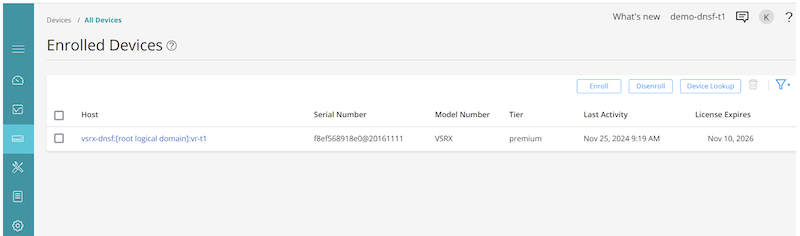

### CloudATP API Setup

As noted in the introduction, the purpose of the API is to provide a programmatic approach to loading a custom list of prohibited domains. In an MSSP environment, one tenant may permit certain domains while others may block them, with each having separate API access.

For the next steps, create folders representing tenants on a Linux/Unix machine equipped with bash and curl, e.g., demo-dnsf-t1 and demo-dnsf-t2.

API token setup is done individually at the tenant realm, either by selecting a particular realm from DNSF-ROOT or by logging in directly. API tokens are created in Administration under Application Tokens:

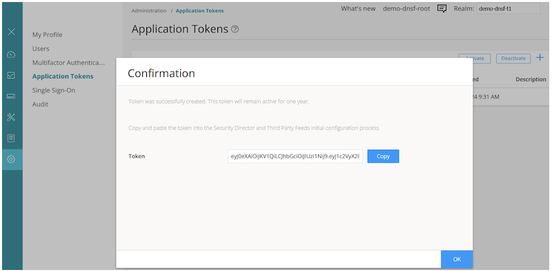

Insert the individual API tokens for both tenants into the api-token.txt file located in the corresponding folder created in the previous step:

```
# echo "DNSF-T1-API-TOKEN" > demo-dnsf-t1/api-token.txt 
# echo "DNSF-T2-API-TOKEN" > demo-dnsf-t2/api-token.txt 
```

The Juniper Threat Intelligence Open API ([documentation](https://www.juniper.net/documentation/us/en/software/atp-cloud/atp-cloud-api-setup/topics/concept/atp-cloud-api-overview.html)) offers a patch option for manipulating feed data (recommended method); however, the easiest option for a lab trial is to recreate the feed object.

A simple one-liner script, api-create-feed.sh, taking the first argument as the DNS feed name and the second as the submitted file containing domain names, may look as follows:

```
#!/bin/bash
curl --form file=@$2 --request POST \
--url https://threat-api.sky.junipersecurity.net/v2/cloudfeeds/DNS/file/$1 \
--header "Authorization: Bearer `cat api-token.txt`" \
```

Similarly, here is a one-liner api-delete-feed.sh script for deleting the DNS feed, which accepts the DNS feed name as the first argument:

```
#!/bin/bash
curl --request DELETE \
  --url https://threat-api.sky.junipersecurity.net/v2/cloudfeeds/DNS/param/$1 \
  --header "Authorization: Bearer `cat api-token.txt`" \
  --header 'Content-Type: multipart/form-data' \
  --form 'server=*'
```

For example, the domains.txt file contains a list of arbitrary sample domains with a threat level of 10 (which can be referenced in policies in terms of actions).

```
smartweb2595.com,10
newstore1460.com,10
topapp5226.com,10
topstore7658.com,10
newapp5634.com,10
topweb8022.com,10
happyzone8922.com,10
smartzone3594.com,10
smartspace9672.com,10
newstore4752.com,10
```

Finally, this may be a simple wrapper script, xreload_feed.sh, that calls the previously created one-liner scripts for creating and deleting the feed for DNSF-T2:

```
#!/bin/bash
./api-delete-feed.sh demo_dnsf_t2
./api-create-feed.sh demo_dnsf_t2 domains.txt
```

Sample reload of DNS feeds for both tenants from their corresponding folders:

```
demo-dnsf-t1# ./xreload_feed.sh 
{"message":"Successfully deleted feed.","request_id":"0bd1e788-f2ab-41c6-b6c1-2d8aee6b8c58"}
{"request_id":"7a0fdadb-9850-4061-8192-d45fc6178c33"}

demo-dnsf-t2# ./xreload_feed.sh
{"message":"Successfully deleted feed.","request_id":"6a0096e7-2411-445d-8c10-be12b740e534"}
{"request_id":"73fa6064-33ec-4ea7-bec9-20b16fac2128"}
```

### SRX Settings

In addition to the sample base configuration available in Appendix 1, the following configuration sets up the SRX Security Intelligence to use the API-created feeds. All matching DNS domain requests flagged with a threat level of 10 will be discarded and logged:

```
set services security-intelligence profile t1 category DNS
set services security-intelligence profile t1 rule 1 match feed-name demo_dnsf_t1
set services security-intelligence profile t1 rule 1 match threat-level 10
set services security-intelligence profile t1 rule 1 then action block drop
set services security-intelligence profile t1 rule 1 then log
set services security-intelligence profile t2 category DNS
set services security-intelligence profile t2 rule 1 match feed-name demo_dnsf_t2
set services security-intelligence profile t2 rule 1 match threat-level 10
set services security-intelligence profile t2 rule 1 then action block drop
set services security-intelligence profile t2 rule 1 then log
```

> Note: if the Juniper-supplied DNS threat feed is not used in any other profile, the following configuration can be used to disable it:

```
set services security-intelligence global-disable-feed feed-name global_dns
```

Then, the profiles are referenced by the Security Intelligence policy:

```
set services security-intelligence policy t1 DNS t1
set services security-intelligence policy t2 DNS t2
```

And Security Intelligence policies are referenced by the actual firewall policies:

```
edit security policies
set from-zone t1 to-zone common policy t1 then permit application-services security-intelligence-policy t1
set from-zone t2 to-zone common policy t2 then permit application-services security-intelligence-policy t2
```

To receive Secintel logs in the CloudATP portal via the data plane channel, the source interface needs to be specified due to the use of a non-default routing table towards the Internet. Additionally, for simple on-box logging, the JWeb report infrastructure can be used:

```
set services advanced-anti-malware connection source-interface ge-0/0/0.0   
set security log report
```

The first place to verify whether the DNS feeds have been loaded is in the summary view of Secintel categories, where 'Vrf name' represents the Virtual Router attribute of the feed. Internally, the SRX adds an extra dimension of the routing instance to the feeds received from the CloudATP DNSF-ROOT realm:

```
> show services security-intelligence category summary    

Category name     :DNS
  Status          :Enable
  Description     :DNS sinkhole
  Update interval :60s
  TTL             :3456000s
  Feed name       :demo_dnsf_t1
    logical-system:root-logical-system
    Vrf name      :vr-t1
    Version       :20241125.0
    Objects number:10
    Create time   :2024-11-25 09:33:50 CET
    Update time   :2024-11-25 09:40:27 CET
    Update status :Store succeeded
    Expired       :No
    Status        :Active
    Options       :N/A
  Feed name       :demo_dnsf_t2
    logical-system:root-logical-system
    Vrf name      :vr-t2
    Version       :20241125.0
    Objects number:10
    Create time   :2024-11-25 09:34:58 CET
    Update time   :2024-11-25 09:40:27 CET
    Update status :Store succeeded
    Expired       :No
    Status        :Active
    Options       :N/A
```

The content of the feed for the DNS category can be viewed as follows:

```
> show services security-intelligence category detail category-name DNS feed-name demo_dnsf_t1     

Category name   :DNS
  Feed name     :demo_dnsf_t1
  logical-system:root-logical-system
  Vrf name      :vr-t1
  Version       :20241125.0
  Objects number:10
  Create time   :2024-11-25 09:33:50 CET
  Update time   :2024-11-25 09:41:03 CET
  Update status :Store succeeded
  Expired       :No
  Options       :N/A
  { url:coolsite3022.com threat_level:10}
  { url:fastweb7639.com threat_level:10}
  { url:greatsite8880.com threat_level:10}
  { url:greattech2443.com threat_level:10}
  { url:happyworld5071.com threat_level:10}
  { url:mytech2524.com threat_level:10}
  { url:newapp1289.com threat_level:10}
  { url:smartweb881.com threat_level:10}
  { url:smartworld7813.com threat_level:10}
  { url:topworld938.com threat_level:10}
```

## Verification

One of the many options is to validate using the host command (from the bind9-host package). DNS resolution works for juniper.net, but times out for the hostname listed in the feed:

```
# host juniper.net
juniper.net has address 44.224.71.252

# host coolsite3022.com
;; connection timed out; no servers could be reached
```

> Note: in the case of an allowed DNS query to a non-existent domain, an NXDOMAIN status would be returned.

Secintel counters indicate the actions taken per DNS query type:

```
> show services security-intelligence dns-statistics profile t1    

Category DNS:
  Profile t1:
    DNS Query Type       Requests      Sinkhole      Drop          Permit        Log

  UDP Counter:
            A              4             0             2             0            2
         AAAA              1             0             0             0            0
           MX              1             0             0             0            0
        CNAME              0             0             0             0            0
          SRV              0             0             0             0            0
    SRV NoErr              0             0             0             0            0
          TXT              0             0             0             0            0
    TXT NoErr              0             0             0             0            0
          ANY              0             0             0             0            0
         MISC              0             0             0             0            0
<SNIP>
        Total              6             0             2             0            2
```

Details about the drop can be found in the SRX logs:

```
> show security log report in-detail dns threat-severity 10
    
2024-11-30T19:26:44 vsrx-dnsf RT_SECINTEL - DNSF_ACTION_LOG [sub-category="custom" query-type="A" protocol-id="17" feed-name="demo_dnsf_t1" source-address="10.1.1.10" destination-address="1.1.1.1" category="dns" query="coolsite3022.com" action="drop" source-port="58866" destination-port="53" policy-name="t1" profile-name="t1" username="N/A" session-id="10" source-zone-name="t1" destination-zone-name="common" threat-severity="10"]
```

And the corresponding CloudATP realm log:

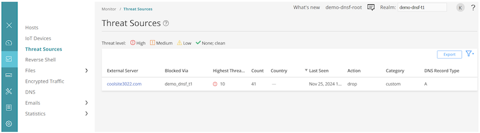

In the case of no logs appearing in the CloudATP realm, the first place to check is the CloudATP data plane connection to see if there is any active connection, as shown below:

```
> show services advanced-anti-malware status 

Server connection status:
  Server hostname: srxapi.eu-west-1.sky.junipersecurity.net
  Server realm: demo-dnsf-root
  Server port: 443
  Proxy hostname: None
  Proxy port: None
    Control Plane:
      Connection time: 2024-11-25 10:20:44 CET
      Connection status: Connected
    Service Plane:
      master
        Connection active number: 1
        Connection retry statistics: 1
```

### Encrypted DNS

Obviously, encrypted DNS, such as DoH and DoT, evades filtering unless interception capability exists. Another method is to prohibit encrypted DNS communication and allow the clients to fall back to traditional unencrypted DNS.

The following would reconfigure Tenant 1 policies to reject the L7 meta-application DNS-ENCRYPTED, representing DoH and DoT, and turn classic firewall rules into a unified NGFW style by using dynamic-application match:

```
delete security policies from-zone t1 to-zone common
edit security policies from-zone t1 to-zone common
set policy t1-reject match source-address any
set policy t1-reject match destination-address any
set policy t1-reject match application any
set policy t1-reject match dynamic-application junos:DNS-ENCRYPTED
set policy t1-reject then reject
set policy t1-reject then log session-init
set policy t1 match source-address any
set policy t1 match destination-address any
set policy t1 match application any
set policy t1 match dynamic-application any
set policy t1 then permit application-services security-intelligence-policy t1
set security policies global policy reject-log match dynamic-application any
```

Sample logs of Application Firewall reject action for DoH:

```
> show security log report in-detail session deny 
                   
2024-11-30T19:27:43 vsrx-dnsf RT_FLOW - RT_FLOW_SESSION_DENY [application="SSL" source-address="10.1.1.10" destination-address="8.8.8.8" nested-application="DNS-ENCRYPTED" username="10.1.1.10" policy-name="t1-reject" packet-incoming-interface="ge-0/0/1.181" source-zone-name="t1" destination-zone-name="common" session-id="13" source-port="35058" destination-port="443" protocol-id="TCP" reason="Rejected by policy"]
```

## Appendix: Configurations

### Appendix 1: base SRX config

```
set version 24.2R1-S1.10
set system host-name vsrx-dnsf
set system syslog file messages any any
set system syslog file messages archive size 5m
set system syslog file messages archive files 5
set services application-identification
set security log mode stream
set security alg h323 disable
set security alg mgcp disable
set security alg msrpc disable
set security alg sunrpc disable
set security alg rtsp disable
set security alg sccp disable
set security alg sip disable
set security alg talk disable
set security alg tftp disable
set security alg pptp disable
set security flow tcp-session strict-syn-check
set security nat source rule-set common from zone t1
set security nat source rule-set common from zone t2
set security nat source rule-set common to zone common
set security nat source rule-set common rule common match source-address 0.0.0.0/0
set security nat source rule-set common rule common match destination-address 0.0.0.0/0
set security nat source rule-set common rule common then source-nat interface
set security policies from-zone t1 to-zone common policy t1 match source-address any
set security policies from-zone t1 to-zone common policy t1 match destination-address any
set security policies from-zone t1 to-zone common policy t1 match application any
set security policies from-zone t1 to-zone common policy t1 then permit
set security policies from-zone t2 to-zone common policy t2 match source-address any
set security policies from-zone t2 to-zone common policy t2 match destination-address any
set security policies from-zone t2 to-zone common policy t2 match application any
set security policies from-zone t2 to-zone common policy t2 then permit
set security policies global policy reject-log match source-address any
set security policies global policy reject-log match destination-address any
set security policies global policy reject-log match application any
set security policies global policy reject-log match to-zone common
set security policies global policy reject-log then reject
set security policies global policy reject-log then log session-init
set security zones security-zone common interfaces ge-0/0/0.0 host-inbound-traffic system-services ping
set security zones security-zone t1 interfaces ge-0/0/1.181 host-inbound-traffic system-services ping
set security zones security-zone t1 tcp-rst
set security zones security-zone t2 interfaces ge-0/0/1.182 host-inbound-traffic system-services ping
set security zones security-zone t2 tcp-rst
set interfaces ge-0/0/0 unit 0 family inet address 203.0.113.10/24
set interfaces ge-0/0/1 vlan-tagging    
set interfaces ge-0/0/1 unit 181 vlan-id 181
set interfaces ge-0/0/1 unit 181 family inet address 10.1.1.1/24
set interfaces ge-0/0/1 unit 182 vlan-id 182
set interfaces ge-0/0/1 unit 182 family inet address 10.2.1.1/24
set policy-options policy-statement import-from-common term 1 from instance vr-common
set policy-options policy-statement import-from-common term 1 from route-filter 0.0.0.0/0 exact
set policy-options policy-statement import-from-common term 1 then accept
set policy-options policy-statement import-from-common term 100 then reject
set routing-instances vr-common instance-type virtual-router
set routing-instances vr-common routing-options static route 0.0.0.0/0 next-hop 203.0.113.1
set routing-instances vr-common interface ge-0/0/0.0
set routing-instances vr-t1 instance-type virtual-router
set routing-instances vr-t1 routing-options instance-import import-from-common
set routing-instances vr-t1 interface ge-0/0/1.181
set routing-instances vr-t2 instance-type virtual-router
set routing-instances vr-t2 routing-options instance-import import-from-common
set routing-instances vr-t2 interface ge-0/0/1.182
```

### Appendix 2: Sample CloudATP Enrollment

```
Platform is supported by ATP Cloud: VSRX.
Version 24.2R1-S1.10 is valid for bootstrapping.
Enrolling with ATP Cloud license serial number: 20161111.
Going to enroll single device for VSRX: f8ef568918e0@20161111 with hostname vsrx-dnsf.
Not finding Application Signature DB on this device.
Installing Application Signature DB.
Start downloading Application Signature DB update...
Check Application Signature DB download status...
Wait for Application Signature DB signature download status...
Start installing Application Signature DB update...
Communicate with cloud...
License type for this device: premium.
License of your device will expire in 714 days.
Remove related security-intelligence service configurations...
Remove related advanced-anti-malware service configurations...
Remove related SSL service configurations...
Remove related PKI configurations...
Clear local certificate aamw-srx-cert...
Clear key pair: aamw-srx-cert...
Clear CA profile aamw-cloud-ca...
Clear CA profile aamw-secintel-ca...
Configure CA...
Request aamw-secintel-ca CA...
Wait aamw-secintel-ca CA download status...
Load aamw-secintel-ca CA...
Request aamw-cloud-ca CA...
Wait aamw-cloud-ca CA download status...
Load aamw-cloud-ca CA...
Retrieve CA profile aamw-ca...
CA certificate ready: aamw-ca...
CA certificate ready: aamw-cloud-ca...
CA certificate ready: aamw-secintel-ca...
Generate key pair: aamw-srx-cert...
Enroll local certificate aamw-srx-cert with CA server...
Configure SSL service...
Configuration added successfully for SSL service.
Configure advanced-anti-malware service...
Configuration added successfully for advanced-anti-malware service.
Configure security-intelligence service...
Configuration added successfully for security-intelligence service.
Check configuration on device...
SSL profile:                          [OK]
SecIntel CA:                          [OK]
Cloud CA:                             [OK]
Client cert found:                    [OK]
SSL profile action:                   [OK]
URL for advanced-anti-malware:        [OK]
Profile for advanced-anti-malware:    [OK]
URL for security-intelligence:        [OK]
Profile for security-intelligence:    [OK]
All configurations are correct for enrollment.
Communicate with cloud...
Wait for aamw connection status...
Device enrolled successfully!
Please see following links for more information:
ATP Cloud sample config:
 https://www.juniper.net/documentation/en_US/release-independent/sky-atp/topics/example/configuration/sky-atp-policy-creating-cli.html
ATP Cloud quick start guide:
 http://www.juniper.net/documentation/en_US/release-independent/sky-atp/information-products/topic-collections/sky-atp-qsg.pdf
ATP Cloud technical documents:
 http://www.juniper.net/documentation/en_US/release-independent/sky-atp/information-products/pathway-pages/index.html
It is recommended to run diagnostic process with the following cli command to make sure all configurations are valid:
 request services advanced-anti-malware diagnostics srxapi.eu-west-1.sky.junipersecurity.net detail
```

## Conclusion

The discussed feature set brings the following benefits:

- Strengthens defense by allowing organizations to block or sinkhole malicious DNS queries with precision.
- Allows combining vendor-provided intelligence with custom threat feeds to address unique business risks.
- Facilitates granular threat intelligence enforcement for multiple tenants on a single SRX device, reducing infrastructure complexity and costs.
- Empowers tenants with independent control, visibility, and API access, improving customer satisfaction in managed service environments.

## Useful links

- [https://www.juniper.net/documentation/us/en/software/atp-cloud/atp-cloud-admin-guide/topics/concept/atp-cloud-about.html](https://www.juniper.net/documentation/us/en/software/atp-cloud/atp-cloud-admin-guide/topics/concept/atp-cloud-about.html)
- [https://www.juniper.net/documentation/us/en/quick-start/software/atp-cloud/atp-cloud-quick-start/topics/topic-map/id-step-1-begin.html](https://www.juniper.net/documentation/us/en/quick-start/software/atp-cloud/atp-cloud-quick-start/topics/topic-map/id-step-1-begin.html)
- [https://www.juniper.net/documentation/us/en/software/atp-cloud/atp-cloud-api-setup/topics/concept/atp-cloud-api-overview.html](https://www.juniper.net/documentation/us/en/software/atp-cloud/atp-cloud-api-setup/topics/concept/atp-cloud-api-overview.html)
- [https://www.juniper.net/us/en/dm/download-next-gen-vsrx-firewall-trial.html](https://www.juniper.net/us/en/dm/download-next-gen-vsrx-firewall-trial.html)
- [https://www.juniper.net/us/en/products/security/srx-series.html](https://www.juniper.net/us/en/products/security/srx-series.html)

## Glossary

- API: Application Programming Interface
- ATP: Advanced Threat Prevention
- CLI: Command Line Interface
- DNS: Domain Name System
- DoH: DNS over HTTPS
- DoT: DNS over TLS
- GUI: Graphical User Interface
- HTTPS: Hyper Text Transfer Protocol Secure
- MSSP: Managed Security Services Provider
- NGFW: Next Generation Firewall
- TLS: Transport Layer Security
- VR: Virtual Router

## Acknowledgments

All the people who provided valuable feedback: Mark Barrett, Kelly Brazil, Tim Carlens, Javier Grizzuti, Steven Jacques, Matthijs Nagel - and others from team JNPR! Finally, vSRX/SRX dev and product teams for delivering the Swiss army knife for security and networking.
