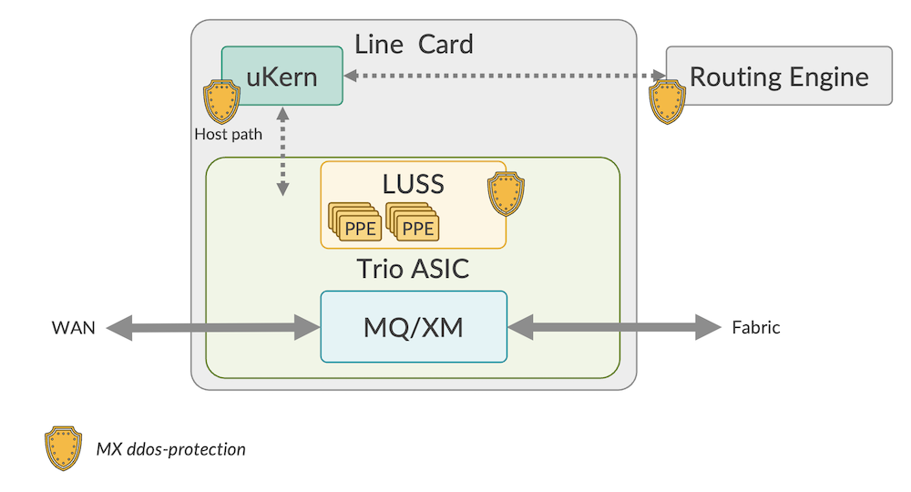
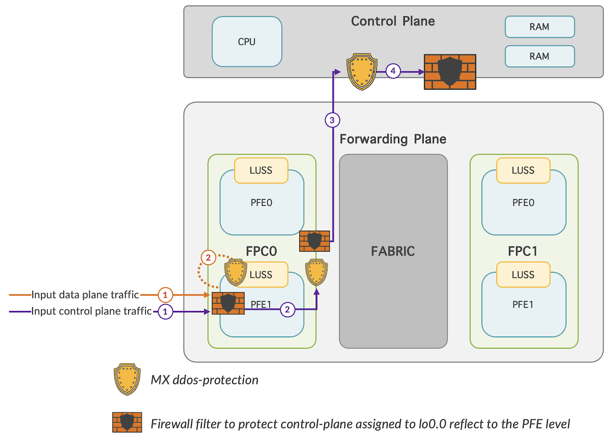
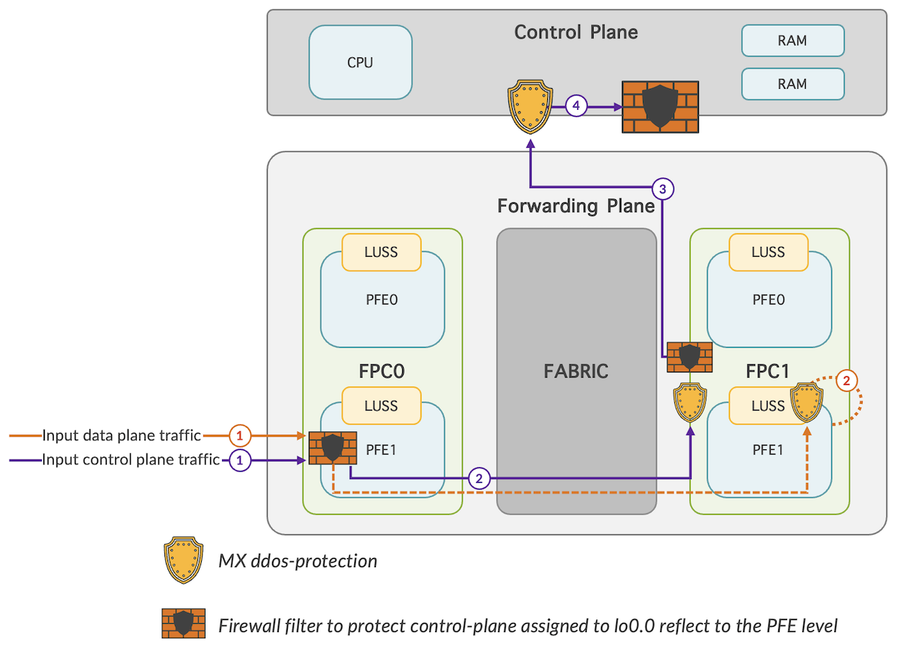
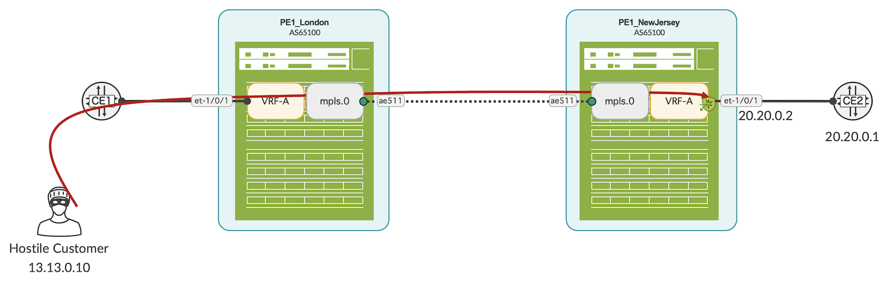
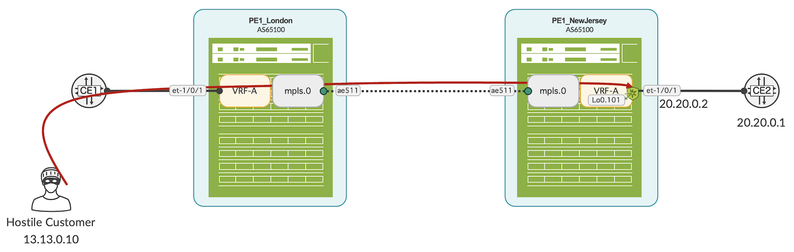

# Suspicious Control Flow Detection

**Moshiko Nayman - 09/18/2023**

Juniper enhanced the initial DDoS protection feature with Suspicious Control Flow Detection (SCFD). It provides deeper analysis within a given protocol or packet-type: a solution that addresses the need for more granular flow policing, supported from Junos OS 17.1R1

## Introduction

Another potent feature integrated into the MX series platform and the MX Trio silicon is the DDoS protection. MX ddos-protection is enabled by default, and the feature is co-operated with the RE filter. A policer configured in the lo0 input filter will be downloaded to the Trio PFE (Packet Forwarding Engine) where it is executed before any DDoS (Distributed Denial of Service) policer functionality. The default mode of ddos-protection feature is supported on all MX platforms. It is also available on the PTX10000 series, and certain ACX7000 models.

The ddos-protection feature is configurable from the CLI and is designed to protect both the control and forwarding plane.

A substantial enhancement has been developed to get more of the MX Trio: the Suspicious Control Flow Detection (SCFD). With this granular flow policing, Juniper has elevated the initial DDoS protection feature to enable more comprehensive analysis within specific protocols or packet types.

Unlike basic DDoS, SCFD remains deactivated by default. Once enabled, flow protection monitors the specific contributors to the various aggregate flows. It dynamically tries to determine those that are "hostile" by virtue of their accounting for the majority of the aggregate packet rate. Suspicious flows are monitored within a specified time frame to record both the moments when they are flagged as suspicious and when these flows revert back to acceptable levels. A suspect flow in violation of its configured rate can be dropped, policed, or forwarded based on configuration. The latter case does not provide any inherent protection over basic DDoS, but the identification and logging of flows that were found to be in violation can be useful for later analysis and possible subsequent DDoS tuning.

Trio offers massive subscriber scale in terms of logical interfaces, IPv4 and IPv6 routes, and hierarchical queuing.

The design of MX Trio PFE that has ASIC performance and flexibility of FPGA allows it. In Trio chipset, multiple instructions can be executed to a packet before it leaves the forwarding engine; run-to-completion.





Exception traffic will traverse through several protection mechanism before it punts to RE.

In Figure 3 below, the depicted scenario involves incoming traffic from FPC0 destined for an interface on FPC1, with the path traversing through the fabric:



## Problem Examples

### Scenario 1

VRF attack to a protocol that is uncovered in lo0.0, associated to VRF-A



### Scenario 2

A new loopback interface Lo0.101 has been assigned to VRF-A lacks appropriate filter protection. Within this context, a VRF attack targets an exception traffic towards either Lo0.101 or a customer facing interface.



## Solution Description

### RE and VRF Filter

While this subject lies beyond the purview of this blog, its significance as a fundamental practice prompted its inclusion in this discussion. RE protection is important and required on every loopback interface which can be added separately or by using apply-groups feature.

Furthermore, other methods, including apply-path, are elaborated in the Day One book, accessible as a PDF: [https://supportportal.juniper.net/s/article/Securing-the-Routing-Engine-on-M-MX-and-T-Series?language=en_US](https://supportportal.juniper.net/s/article/Securing-the-Routing-Engine-on-M-MX-and-T-Series?language=en_US)

Another method would be VRF filter:

```
set routing-instances VRF-A forwarding-options family inet filter input FW_VRF
```

With the focus of this article being MX DDoS protection, let's turn our attention back to:

### SCFD

MX ddos-protection in SCFD (Suspicious Control Flow Detection) mode

Configure:

```
[edit]
mnayman@PE2# set system ddos-protection global flow-detection
```

Example of a BFD attack:

```
mnayman@PE2> show ddos-protection protocols violations    
Packet types: 246, Currently violated: 1

Protocol    Packet      Bandwidth  Arrival   Peak      Policer bandwidth
group       type        (pps)      rate(pps) rate(pps) violation detected at
bfd         aggregate   20000      1         30049     2023-07-24 23:13:26 EDT
          Detected on: FPC-3
```

```
mnayman@PE2> show ddos-protection protocols culprit-flows    
Currently tracked flows: 1, Total detected flows: 2955

Protocol    Packet      Arriving            Source Address
group       type        Interface           MAC or IP
bfd         aggregate   ae1.0               10.144.0.208                          
   sub:00030000000006c9 2023-07-24 23:14:35 EDT pps:1     pkts:85

mnayman@PE2> show ddos-protection protocols culprit-flows detail 
Currently tracked flows: 1, Total detected flows: 2957

Protocol    Packet      Arriving           Aggr    Flow Id
group       type        Interface          level
bfd         aggregate   lsi.411            sub     00030000000006ca
   Source Address:      13.13.0.10                             
   Destination Address: 20.20.0.2                              
   Source Port:    3784     Destination Port: 3784 
   Found at:       2023-07-24 23:15:44 EDT
   Last Violation: 2023-07-24 23:15:46 EDT
   Rate:        0 pps  received packets: 165389
```

Now, what happens with the same attack coming from multiple sources:

```
mnayman@PE2> show ddos-protection protocols culprit-flows    
Currently tracked flows: 1000, Total detected flows: 3969

Protocol    Packet      Arriving            Source Address
group       type        Interface           MAC or IP
uncls       host-rt-v4  lsi.411             13.13.0.95                            
   sub:00030000000006d8 2023-07-24 23:22:27 EDT pps:235   pkts:5914       
uncls       host-rt-v4  lsi.411             13.13.1.95                            
   sub:00030000000006d9 2023-07-24 23:22:27 EDT pps:235   pkts:5915       
uncls       host-rt-v4  lsi.411             13.13.2.154                           
   sub:00030000000006da 2023-07-24 23:22:27 EDT pps:235   pkts:5907       
uncls       host-rt-v4  lsi.411             13.13.2.220                           
   sub:00030000000006db 2023-07-24 23:22:27 EDT pps:235   pkts:5915       
uncls       host-rt-v4  lsi.411             13.13.0.132                           
   sub:00030000000006dc 2023-07-24 23:22:27 EDT pps:235   pkts:5912
...
uncls       host-rt-v4  lsi.411             13.13.2.92                            
   sub:0003000000000abf 2023-07-24 23:22:27 EDT pps:235   pkts:5927
```

And this is where the brilliance of the MX router shines. When facing a massive attack from thousands of sources, it initiates mitigation on a per-flow basis:

```
mnayman@PE2> show ddos-protection protocols culprit-flows    
Currently tracked flows: 3036, Total detected flows: 15970

Protocol    Packet      Arriving            Source Address
group       type        Interface           MAC or IP
uncls       host-rt-v4  lsi.411             13.13.15.63                           
   sub:0003000000002dc5 2023-07-24 23:25:05 EDT pps:0     pkts:185        
uncls       host-rt-v4  lsi.411             13.13.3.82                            
   sub:0003000000002dc6 2023-07-24 23:25:05 EDT pps:0     pkts:183        
uncls       host-rt-v4  lsi.411             13.13.5.208                           
   sub:0003000000002dc7 2023-07-24 23:25:05 EDT pps:0     pkts:187        
uncls       host-rt-v4  lsi.411             13.13.15.47                           
   sub:0003000000002dc8 2023-07-24 23:25:05 EDT pps:0     pkts:184        
uncls       host-rt-v4  lsi.411             13.13.18.20                           
   sub:0003000000002dc9 2023-07-24 23:25:05 EDT pps:0     pkts:185
```

The MX platform intelligently condenses the attack into a single flow, automatically assigning it one Flow ID. This resource-saving approach is enabled due to the attack's consistent signature:

```
mnayman@PE2> show ddos-protection protocols culprit-flows    
Currently tracked flows: 1, Total detected flows: 17933


Protocol    Packet      Arriving            Source Address
group       type        Interface           MAC or IP
uncls       host-rt-v4  lsi.411             -- -- --                              
   ifl:0003000000003e36 2023-07-24 23:25:20 EDT pps:234964 pkts:14609202

mnayman@PE2> show ddos-protection protocols culprit-flows detail    
Currently tracked flows: 1, Total detected flows: 17933


Protocol    Packet      Arriving           Aggr    Flow Id
group       type        Interface          level
uncls       host-rt-v4  lsi.411            ifl     0003000000003e36
   Found at:       2023-07-24 23:25:20 EDT
   Last Violation: 2023-07-24 23:29:43 EDT
   Rate:        234967 pps  received packets: 61602109
```

Most deployments don't require any specific tweaking of the feature.

Telemetry models are also available as described in [https://www.juniper.net/documentation/us/en/software/junos/open-config/interfaces-telemetry/topics/concept/junos-telemetry-interface-grpc-sensors.html](https://www.juniper.net/documentation/us/en/software/junos/open-config/interfaces-telemetry/topics/concept/junos-telemetry-interface-grpc-sensors.html)

Quoting the config guide:  `/junos/system/linecard/ddos/`

Distributed denial of service (DDoS) sensor. This sensor supports the Openconfig data model *junos/ui/openconfig/yang/* and *junos-ddos.yang*.

You can stream information using Juniper proprietary gRPC or UDP (native) export. There are 45 packet types for DDoS. To maintain a reasonably sized data stream, data is exported for all protocols that have seen traffic using the zero-suppression model.

You can also add the following leaves to the end of the path to stream specific statistics:

- group_name
- group_id
- protocol_name
- protocol_id
- location
- received
- arrive-policer
- dropped-individual_policer
- dropped_aggregate_policer
- total_dropped
- final_passed
- arrival_rate
- max_arrival_rate
- pass_rate
- policer_state
- policer_violation_count
- policer_violation_start_time
- policer_violation_end_time
- policer_violation_duration

The following packet types are supported:

```
------ --------- -------- -------- ------------------------------
CMICQ  Channel   bwidth    burst     Qlen           Proto(s)
------ ---------- -------- -------- --------- -------------------
     0        3      500       10      200             uncls
     4        1     4000      200      200          vchassis
     7        3      500      200      200             vxlan
     8        3     1500      200      200           localnh
     9        3     1000      200      200         vcipc-udp
    10        3     2000      200      200     sample-source
    11        3     2000      200      200       sample-dest
    12        3       50       10      200        l3mtu-fail,ttl,ip-opt. 
    14        3      100       10      200        garp-reply
    15        3      500       10      200           fw-host
    16        3      500      200      200             ndpv6
    17        3     1000      200      200          dhcpv4v6
    19        3     1500      200      200     ipmc-reserved
    20        3      300      200      200           resolve
    21        3      100       10      200       l3dest-miss
    22        3      100       10      200          redirect
    23        3      300      200      200            l3nhop
    24        3      100       10      200   l3mc-sgvhit-icl
    25        3       50       10      200   martian-address
    26        3     1000      200      200              l2pt
    27        3       50       10      200         urpf-fail
    28        3     1000      300      300      ipmcast-miss
    29        2      300       10      200   nonucast-switch
    30        2     3000      200      200              rsvp,ldp,bgp
    31        2     3000      200      200      unknown-l2mc,rip,ospf
    32        2     1000      200      200      fip-snooping
    33        2     1000      200      200              igmp
    34        2      500      200      200               arp
    35        2     1500      200      200          pim-data
    36        2     1500      200      200        ospf-hello
    37        2     1500      200      200          pim-ctrl
    38        2     2000      200      200              isis
    39        1      250      200      200              lacp
    40        1     1200      200      200               bfd
    41        1      100       10      200               ntp
    42        1      500      200      200          vchassis
    43        1     1000      200      200               stp,pvstp,lldp
```

## Useful links

- Control Plane DDoS Protection Flow Detection Overview: [https://www.juniper.net/documentation/us/en/software/junos/security-services/topics/concept/subscriber-management-scfd-overview.html](https://www.juniper.net/documentation/us/en/software/junos/security-services/topics/concept/subscriber-management-scfd-overview.html)
- MX Series, 2nd Edition Chapter 4: [https://www.oreilly.com/library/view/juniper-mx-series/9781491932711/ch04.html](https://www.oreilly.com/library/view/juniper-mx-series/9781491932711/ch04.html)
- Telemetry config guide: [https://www.juniper.net/documentation/us/en/software/junos/open-config/interfaces-telemetry/topics/concept/junos-telemetry-interface-grpc-sensors.html](https://www.juniper.net/documentation/us/en/software/junos/open-config/interfaces-telemetry/topics/concept/junos-telemetry-interface-grpc-sensors.html)

## Glossary

- AS: Autonomous System
- BFD:  Bidirectional Forwarding Detection
- DDOS: Distributed Denial-of-Service
- FPGA: Field Programmable Gate Array
- IP: Internet Protocol
- Junos: Operating System used in Juniper Networks routing, switching and security devices.
- MPLS: Multiprotocol Label Switching
- MX: Multi-Service router with programmable silicon
- PE: Provider Edge router
- PFE: Packet Forwarding Engine
- PIC: Physical Interface Cards
- RE: Routing Engine
- SCFD: Suspicious Control Flow Detection
- Trio: Juniper silicon. multi-threaded programmable packet processing engine and a hierarchy of high-capacity memory systems
- VPN: Virtual Private Network
