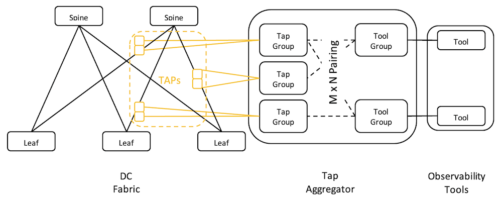
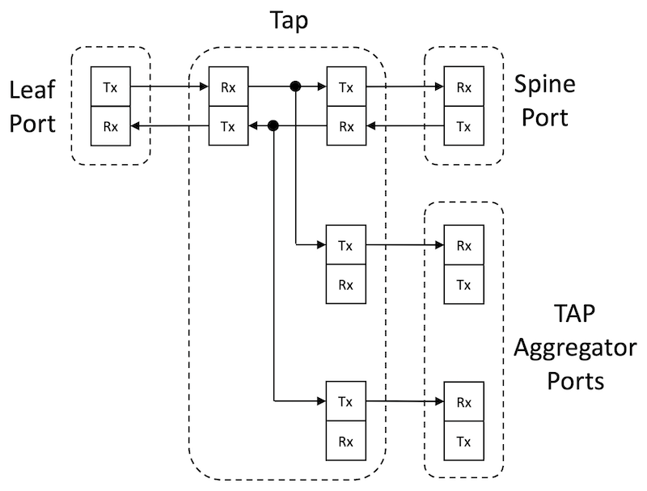

# TAP Aggregation for Network Observability

**Ridha Hamidi - 05/11/2025**

## Introduction

Network observability relies on extensive amounts of data to infer internal network states and KPIs from the observed outputs provided by telemetry and the collection of actual traffic from different network points. Regression algorithms can then be used to predict future states from the observed ones and raise alarms about potential problems before they occur. This is a crucial step in building a self-healing and self-correcting network.

TAP (Test Access Point) Aggregation is one of the key components of a network observability solution and the main building block for traffic collection in data center networks.

Juniper's QFX platforms support TAP Aggregation for link speeds ranging from 10 Gbps up to 800 Gbps.

## Background

Network operators have long relied on NetOps tools that rely on very old protocols such as SNMP and Syslog, providing information after problems happen, to reactively analyze the events, correlate them, and identify the root causes. In the best-case scenarios, remediating a network problem can take minutes to hours, sometimes longer. Network operators also long relied on DevOps tools to implement procedures and designs that aim to prevent the same network problems from happening again in the future. In the best-case scenarios, implementing such new procedures and designs can take weeks to years, if ever.

In recent years, more modern monitoring tools that aim at implementing more proactive network operations have started to be introduced into NOCs, and these often rely on constant telemetry data streaming. Even though these tools will likely achieve the aimed objective in the long term, the challenge they face today is their direct dependency on implementing the relevant sensors within the network devices themselves. That cycle is as long as that of the device operating systems, which can be measured in months, in the best-case scenarios, to years in most common cases. Also, while telemetry-based tools are suitable for providing information about the health of network devices, such as CPU, memory, and buffer utilization, they do not provide much information about the types and quantities of traffic transiting the network. For such analysis and studies, more specialized tools are required, as part of a more complete network visibility and observability solution.

TAP aggregation is the component that collects traffic from different points of the data center network, by tapping into some of its links, and delivers it in an aggregated form into the farm of network visibility tools, dedicated to processing, analysis and inference.

In this post, we will describe how TAP aggregation works and how it is implemented on Juniper QFX platforms. But before we tackle TAP aggregation, let's have a look at the earlier traffic monitoring techniques, that are also supported on Juniper products.

## Traditional Traffic Monitoring Techniques

Juniper products have long supported features that allow one type or another of packet brokering. In this section, we will go over the main ones that are still supported today, and we will briefly describe the use case they're best suited for and the pros and cons of each feature.

## sFLow

sFlow is a monitoring technique based on packet sampling. It is specified in RFC 3176. Sampled data is added to a record that gets encapsulated into a UDP packet (The default UDP port is 6343) and sent to one or more collectors (up to four, at the time of writing this post). The UDP packet is sent when its size reaches the default MTU (1500 bytes) or when a 250 ms timer expires, whichever happens first.

You can configure sFlow in one of the following two modes, or both at the same time on the same interfaces, on ingress only, egress only, or both at the same time:

- Packet-based sampling: The user specifies the number of packets in each sampling interval, and when a packet is sampled, the first 128 bytes of its header are added to the record (this is configurable up to 512 bytes on some platforms). This includes Ethernet (SMAC, DMAC, S-VLAN, D-VLAN), IP (SA and DA), Protocol, and TCP/UDP (SP, DP) header alongside other higher layer protocols, if present, and information from the sFlow agent, like IP address of the sFlow agent, incoming and outgoing interfaces (IFD SNMP index) of the packet.
- Time-based sampling: the user specifies a time interval, and, in this mode, what is sampled are the interface statistics, like Ethernet interface error counters.

### Use Cases of sFlow

sFlow, as its name indicates, relies on traffic sampling to provide statistical information about traffic flows in the data center network. It is not a good fit for monitoring entire conversations between two ends.

### Advantages and Limitations of sFlow

Benefits of the technology:

- sFlow is a simple technique, and because the sampling is done directly on the ASIC by a sFlow agent, the collected information is accurate while the impact on network node (switch) resources (CPU, Memory) is minimized.
- Because sFlow records are encapsulated in a UDP packet, sFlow collectors do not have to be directly connected to the switch, like in one of the other monitoring techniques we will describe later in this post. It is sufficient that sFlow collectors are reachable out-of-band or in-band, as decided upon destination IP lookup by the Software Forwarding Infrastructure Daemon (SFID).

Limitations of sFlow:

- sFlow is based on sampling, so it might not catch mice flows in high-speed links. These might require more aggressive sampling rates, potentially 1:1, meaning "no-sampling" so every packet is accounted for.  Such a configuration might have an impact on the switch resources, especially in the case of a large radix of high-speed interfaces. CPU overload can be mitigated by using Adaptive Sampling, which monitors the overall ingress traffic and adjusts the sampling rate dynamically, using a set of configurable parameters.
- Sampling is done by the ASIC, so there are direct dependencies on the ASIC capabilities. For instance, there are known limitations of sFlow supported features on Trident vs Tomahawk-based switches, and there are also known limitations for encapsulated traffic types, like IP-IP, GRE, or EVPN-VXLAN, multicast vs unicast traffic, egress vs ingress directions, IPv4 vs IPv6, etc.
- sFlow operates at the physical interface level, so all packets that ingress or egress the physical port are subject to the same sampling rules, and you cannot filter traffic to be sampled. This can result in generating unnecessary records about flows that the user is not interested in in the first place.

Some of the limitations of sFlow can be overcome using one of the port mirroring techniques described in the following sections.

## Port Mirroring

When the objective is more than collecting traffic statistics, but rather a complete analysis of end-to-end sessions to detect intrusions, lawful interception, or correlating events, collecting traffic statistics is insufficient, and we need port mirroring features. Unlike sFlow, port mirroring directs entire packets of selected flows to traffic analyzers that can be either directly connected to the switch, or remote but can be reached via a specific VLAN. Another difference with sFlow is that you can be selective about what traffic is mirrored by applying a firewall filter to reduce the amount of traffic to be mirrored. In fact, the way port mirroring is configured is in the "then" section of an action inside a firewall filter, and the user can use the "from" section of the same term to be more specific about traffic being port mirrored, because if the amount of mirrored traffic exceeds the capacity of the analyzer port, it will be tail dropped.
Juniper routers and switches have supported multiple variations of port mirroring over time. This is a high-level overview of these variations and their differences

### Encapsulation/Remote/Switch Port Analyzer (E/R/SPAN)

SPAN is also known as local port mirroring. With SPAN, traffic is mirrored from multiple ingress ports into an egress port where an analyzer is directly connected. This is used for monitoring traffic from a single switch, so it is more targeted at temporary traffic captures for troubleshooting, for example..

RSPAN is like SPAN, but it removes the need for a directly connected analyzer by sending mirrored traffic into a VLAN, allowing to reach a device multiple L2 hops away. This also allows the same analyzer to be used for traffic mirrored from multiple switches.

ERSPAN is similar to RSPAN, but it takes it one step further by encapsulating mirrored traffic in GRE, allowing it to reach an analyzer multiple L3 hops away. This also allows the same analyzer to be used for traffic mirrored from multiple switches.

### Use Cases of Port Mirroring

Port mirroring is used when monitoring applications require copies of entire traffic flows to be provided, typically for both ingress and egress directions simultaneously. Examples of such applications are lawful interception and advanced inference models. It is a good fit for monitoring entire conversations between two ends.

### Advantages and Limitations of Port Mirroring

Port mirroring offers numerous advantages over sFlow, even though these two techniques are not meant for the same use cases and can coexist concurrently on the same switch and the same interfaces, with some restrictions, as mentioned below. The main advantages are that, in the default behavior, the entire packet is mirrored, instead of only a fixed-size header, and also all traffic is mirrored, instead of only samples. These two parameters can be configured from the CLI to mirror only a fixed-size header of packets and to mirror only sampled traffic, like for sFlow. There's an additional parameter called "run-length" that configures the switch to mirror a certain number of packets in a row once a sample packet is identified, instead of only mirroring the sampled packet.

Limitations of this technology: Like sFlow, port mirroring is also impacted by platform-specific and ASIC-specific limitations, and listing all those limitations is out of the scope of this post.

### Comments about Traditional Monitoring Techniques

In the previous section, we purposely did not discuss traditional traffic monitoring techniques, which are based on polling (SNMP), event-driven techniques (SNMP Traps or Syslog), or continuous streaming (Telemetry). We only described sFlow and Port Mirroring because these are the closest and most relevant options to compare with TAP Aggregation.

With either of these techniques, sFlow or Port Mirroring, the device where traffic is being monitored is involved in the monitoring process. Therefore, some of its resources are used to some extent to make traffic monitoring possible. For example, to name a few:

- With sFlow, even though the sampling is done by the ASIC, so little impact is expected, all sampled packet headers are sent to the Routing-Engine (Control Plane) where all the information is aggregated and the sFlow data records are built and then sent to the sFlow Collector. These operations cannot be done without using some RE CPU and Memory resources. Also, the link between the RE and FPC has a limited bandwidth that is also used to perform all the vital actions of the switch, like processing routing updates and programming the FIB in the FPC. That link is at risk of being overloaded with the sampled headers transfer. At a large scale, the sFlow records will not all make it to the RE, resulting in relatively inaccurate traffic statistics received by the collector.
- With Port Mirroring, mirrored packets will use the same data pipelines as those used for actual traffic forwarding, competing on these internal ASIC resources. Also, analyzer ports are dedicated to connecting the switch where traffic is being monitored to either a local or remote analyzer, so the more traffic is mirrored and the more switch ports will be dedicated to that function, at the expense of actual revenue ports on the switch.

These two limitations are eliminated in the TAP aggregation solution, because it is based on using an external device, so the whole traffic monitoring operation is done without the fabric switches knowing about it, other than potentially an optical signal power loss due to the insertion of the tapping devices (~3 dB loss is expected to be caused by passive tapping devices).

It's important to highlight that sFlow and port mirroring are meant for two different use cases. Therefore, they are not mutually exclusive. However, if configured simultaneously on the same interface, then if the same packet is selected for sFlow and port mirroring, port mirroring will take precedence. That packet will not be subject to sFlow collection.

## TAP Aggregation

In a simplified view, TAP aggregation can be considered a packet brokering solution. However, it opens the doors to much more sophisticated packet processing features than legacy packet brokering solutions, without competing for the resources of the switches where traffic is being monitored, because all is happening on an external and dedicated device. Some of the packet processing includes, but is not limited to, filtering, header stripping, packet deduplication, etc,  even though such features are not all implemented at the time of writing this post.

TAP aggregation consists in tapping into some of the data center fabric links and directing the forked traffic into a dedicated device, the TAP aggregator, that aggregates all tapped traffic and delivers it into the dedicated network observability tools, after performing the appropriate packet processing and potentially traffic replications, in case the same packet needs to be sent to multiple tools.

A high-level description of TAP aggregation is illustrated by the following diagram.



The main components of the TAP aggregation solution (TAP Aggregator and TAP Devices) are described in the following sections.

## TAP Aggregator

Features described in this section might not be all supported on all platforms at the time of publishing this post. We are listing them for information only.

A TAP aggregator is a dedicated device for this solution: QFX models that support this feature in the initial release are QFX5220-32CD (TH3), QFX5230-64CD (TH4), QFX5240-64OD/QD (TH5), and QFX5130-32CD (TD4).

It is important to note that once you configure the TAP aggregation feature, the QFX will have to be entirely dedicated to this function. This is enforced by disabling all ports that are not included in the TAP aggregation configuration, either as tap ports or as tool ports.

At the time of writing this post, only 32 ports can be used for TAP aggregation function. The M x N mappings between tap ports and tool ports are internally built using multicast groups. Consequently, the maximum number of mappings that can be supported is 128, due to the capabilities of the ASIC.

The following is a typical tap aggregation configuration example that reflects the diagram in Figure 1 above.

```
forwarding-options {
    tap-aggregation {
        tap-enable;
        pair Tap1 Tool1;
        pair Tap2 Tool2;
        tap Tap1 {
            interface-list [ et-0/0/8.0 et-0/0/9.0 ];
        }
        tap Tap2 {
            interface-list [ et-0/0/0.0 et-0/0/2.0 ];
        }
        tool Tool1 {
            interface-list et-0/0/26.0;
        }
        tool Tool2 {
            interface-list et-0/0/50.0;
        }
    }
}
```

A port can be mapped into only one tap group, but a port can be mapped into multiple tool ports, in case the same packet needs to be processed by two different monitoring tools. Tap ports work in Rx mode only and tool ports work in Tx mode only, therefore, two tap ports are needed to monitor traffic of one link bidirectionally. This is illustrated in Figure 2 below.

Like for all new features, new CLI operational commands are also introduced to support monitoring this feature. A couple of samples are shown below

```
user@qfx > show forwarding-options tap-aggregation
SENT: Ukern command: show forwarding-options tap-aggregation
---------------------------------------------------------
Interface      Link  Mode    Group ( Pair Group )
---------------------------------------------------------
et-0/0/0.0     Up    tap     Tap2  ( Tool2 ) 
et-0/0/2.0     Up    tap     Tap2  ( Tool2 ) 
et-0/0/26.0    Up    tool    Tool1 ( Tap1 )
et-0/0/50.0    Up    tool    Tool2 ( Tap2 )
et-0/0/8.0     Up    tap     Tap1  ( Tool1 )
et-0/0/9.0     Up    tap     Tap1  ( Tool1 )
 
user@qfx >

user@qfx> show forwarding-options tap-aggregation statistics    
Interface     Link      Input       Input     Output     Output     Group
 Name         status     Pkts        Bytes     Pkts       Bytes      Name
------------  -------   ----------  --------- ---------- ----------- ------
et-0/0/0.0     Up        0           0          0           0        Tap2
et-0/0/2.0     Up        0           0          0           0        Tap2
et-0/0/26.0    Up        15          2495       528392    33817088   Tool1
et-0/0/50.0    Up        15          2670       6           2010     Tool2
et-0/0/8.0     Up        539126     34504064    6           1998     Tap1
et-0/0/9.0     Up        0           0          0           0        Tap1

user@qfx>
```

## Tapping Devices

A tapping device is typically a passive optical splitter that, for each link to be tapped, forks the Tx signals in each direction into two Tx signals, one will connect normally to the fabric device, and the other will connect to a dedicated port of the TAP aggregator. These are available in all densities and for all types of optical connectors (LC, MPO) and all types of fibers (SMF, MMF). Because this component is passive, it is expected to have a signal power loss by ~3 dB, which is not a problem and should not degrade the signal beyond tolerated levels, especially when the link being tapped is within the data center.

A simplified view of the tapping operation is depicted in the picture below for one Leaf-Spine link.



## Conclusion

TAP Aggregation is a key building block to respond to the demand for high-density and high-speed traffic monitoring, and it's an essential component of any modern data center network observability ecosystem. In Juniper's data center switching portfolio, TAP Aggregation is supported on both Trident and Tomahawk-based switches, featuring a high radix of ports with speeds ranging from 10G to 800G.

## Useful links

- [RFC3176 InMon Corporation's sFlow](https://datatracker.ietf.org/doc/html/rfc3176): A Method for Monitoring Traffic in Switched and Routed Networks.
- [sFlow Technology Overview](https://www.juniper.net/documentation/us/en/software/junos/network-mgmt/topics/concept/overview-of-sflow-monitoring.html) from Juniper's Network Management and Monitoring Guide.
- [Port Mirroring and Analyzers](https://www.juniper.net/documentation/us/en/software/junos/network-mgmt/topics/topic-map/port-mirroring-and-analyzers.html) from Juniper's Network Management and Monitoring Guide.

## Glossary

- NOC: Network Operating Center
- ERSPAN: Encapsulated Remote Switch Port Analyzer
- LC: Lucent Connector (type of fiber connector with a single Tx and a single Rx fibers)
- MMF: Multi Mode Fiber
- MPO: Multi-fiber Push-On
- RSPAN: Remote Switch Port Analyzer
- SMF: Single Mode Fiber
- SPAN: Switch Port Analyzer
- TAP: Test Access Point
- TDx: Broadcom Trident x
- THx: Broadcom Tomahawk x
