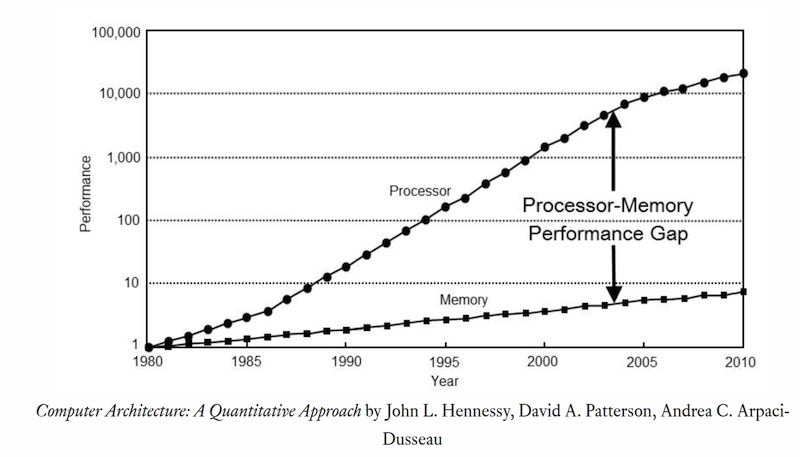
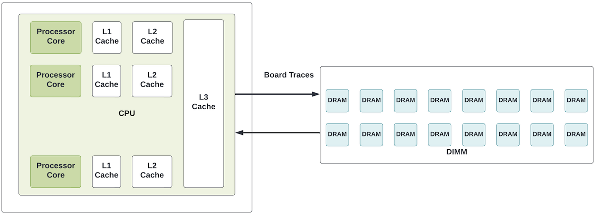
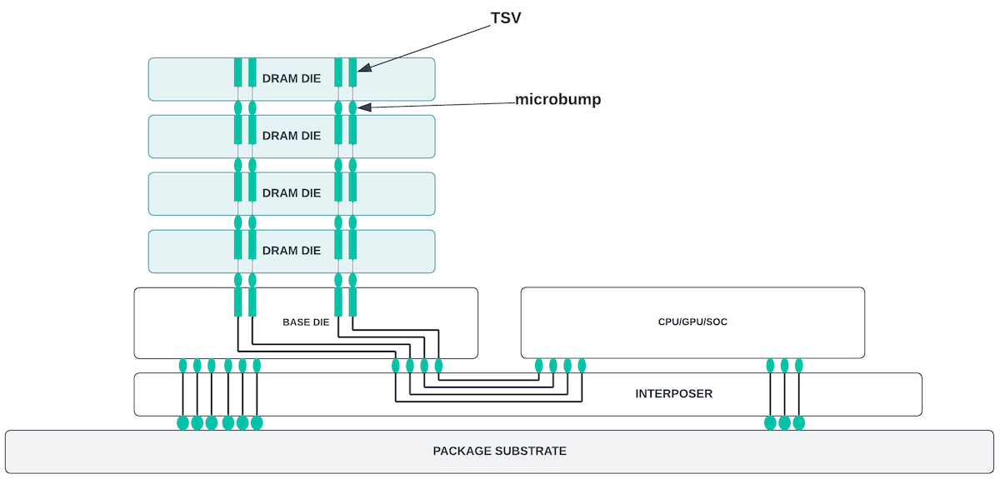
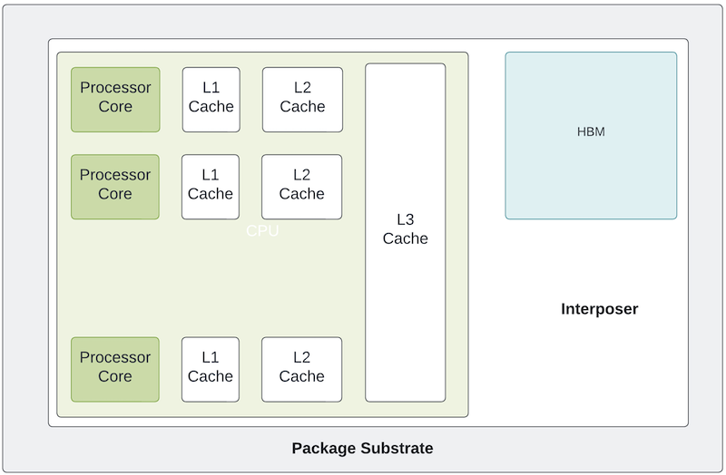
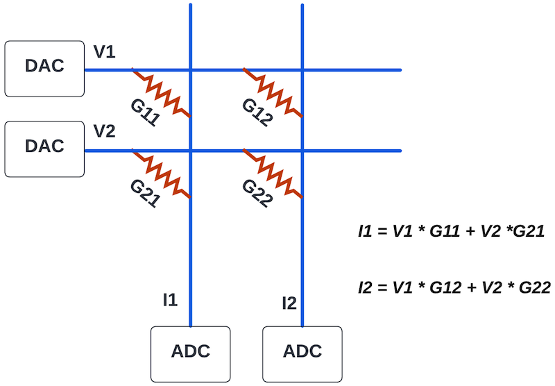
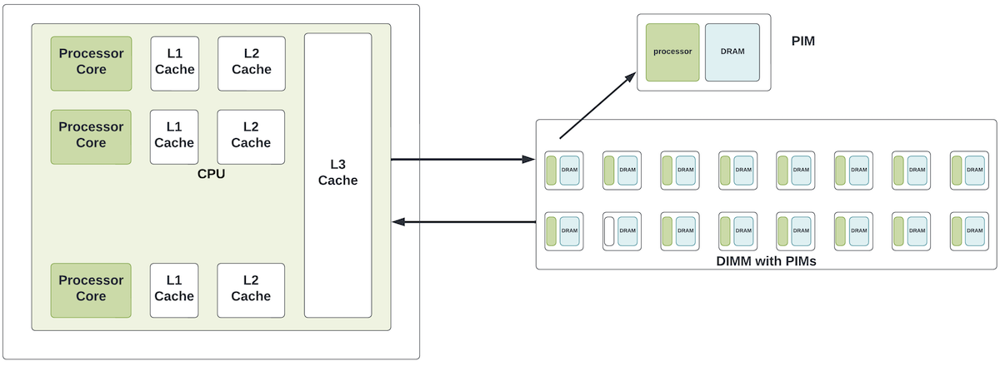
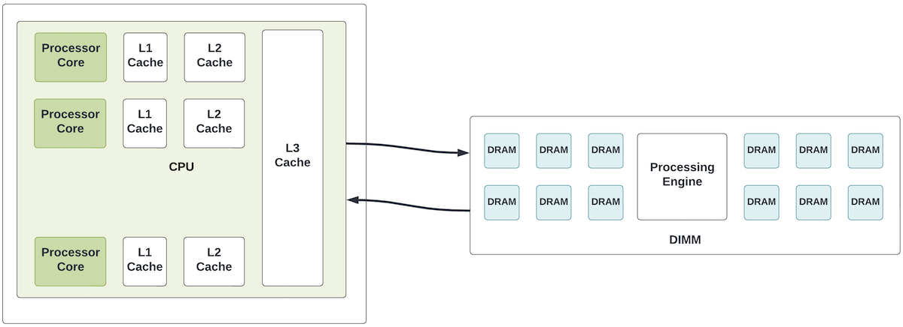
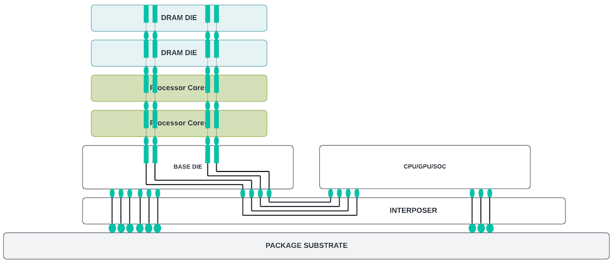
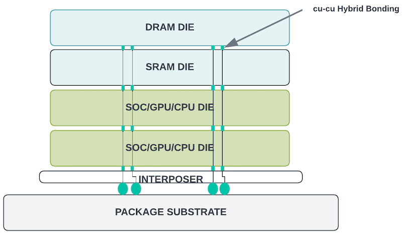

# Tearing Down the Memory Wall

**Sharada Yeluri - 08/22/2022**

The gap between processor and memory performance and density continued to increase - this is often referred to as the "Memory Wall".

Article initially published on LinkedIn.

## Introduction: Von Neumann Bottleneck / Memory Wall

All modern computers are built using the principles of [Von Neuman Architecture](https://en.wikipedia.org/wiki/Von_Neumann_architecture). In this architecture, the program and the data reside in memory (usually an external memory based on the DRAM technology) and the processor (CPU) fetches instructions and data from the memory to execute them sequentially. The process of moving the data from the main memory to the CPU incurs long latencies and consumes significant power.

Processors kept up with Moore's law to a large extent until a decade ago. We have seen transistor densities and performance double every two years or so until the early 2010s. Whereas, whereas DRAMs struggled to keep up the pace. Even though the past decade has seen a slowing down of Moore's law with new process nodes, more slowing down was observed for DRAMs due to the complexities involved in scaling the DRAM technologies. As a result, the gap between processor and memory performance and density continued to increase - this is often referred to as the "Memory Wall"

Over the last four decades, the gap between the CPU and the memory performance has grown from about 50% per year to more than 1,000x today. Memory latencies have also largely remained constant in the past 20 years, making it a significant component of the performance bottleneck. Performance of modern workloads like machine learning, graph processing, real-time data analytics, etc. suffers from this memory wall bottleneck. Similarly, on the networking side, line-rate processing of tens of terabits per second of data hits the same memory bottleneck. Many of these applications are characterized by relatively low data reuse (low cache line utilization), low arithmetic intensity, and large datasets that do not fit in the on-chip buffers.

## Techniques Used in CPUs/GPUs to Reduce the Data Movement

### Caches

The obvious choice for CPUs is to have a hierarchy of caches (embedded SRAMs / eSRAM in the die) to cache frequently accessed data and to pre-fetch instructions/data ahead of the computation. Caching works only if there is either temporal or spatial locality of the data. As noted before, many modern workloads cannot use caches effectively or would require large caches (occupying almost one-third to half of the die area) to make them meaningful.

But, embedded SRAMs (typically 6-8 transistor designs) could not keep up with transistor scaling. For example, TSMC announced that the logic density improved by 1.7x, and the SRAM density improved by 1.2x when going from the 5nm to the 3nm process node. It may sound counterintuitive that SRAMs, consisting of 6-8 transistor memory cells, should scale less than the logic. But the SRAM cell is a unique structure that does not obey the normal logic design rules. It is sensitive to process variations - which are more pronounced in new technology nodes and is harder to scale (aggressive scaling leads to lower yields due to the noise induced by the process variations).

Despite the advantages in density, embedded DRAMs could not replace the SRAMs as the leading choice for caches due to the complexity involved in scaling DRAM technology with process node advances. TSMC and other leading semiconductor manufacturing houses are not spending that much R&D on improving eDRAMs with process node changes.

### Multi-threading or Parallel Computing

Each processor core has multiple active threads such that, when a thread is stalled waiting for the data from the memory, other threads can continue to use the processing power of the CPUs. Even though multi-threading can improve the overall throughput of the CPU, it does not reduce the computation time seen by the applications due to the large memory latencies.

### In Package High Bandwidth Memory (HBM)

HBM is a high bandwidth memory that contains 4/8/12 or 16 DRAM dies stacked on top of each other using Through Silicon Vias (TSVs). It has an optional base die. HBM connects to the core CPU/GPU/SOC die through an interposer inside the package substrate. Because of the die stacking, it is able to achieve high density. In addition, it has a very wide interface to the core logic (~1024bit bus) that enables high throughput. HBM3 could achieve upwards of 7.2Tbps bandwidth.

HBMs are widely used in high-performance computing (HPC) and networking chips and are fast replacing the DDR interfaces. With HBM memories, the latency and the power consumption are also reduced as the long traces on the board are replaced by the short traces inside the interposer. And the wide bus with 8-16 subchannels offers less queueing delays - which in turn translates to better latencies under the load. But, even by moving the memories inside the package, the latencies are still 15-20x compared to the SRAMs due to the latency involved in accessing the memory stack and the path through the PHYs and the interposer.

Many CPUs/Networking chips support both HBM and DDR (Double Data Rate) interfaces, where HBM interfaces are used for high bandwidth functions and the DDR (GDDR4/5) is mainly used for capacity for applications that need access to large data structures.

## Techniques Used in Networking Chips to Reduce the Data Movement

Similar to the processors, networking chips also rely heavily on the external memory for packet storage (to provide deep buffering for congested queues) and for storing Forwarding Information Database (FIB), flow tables, next-hops, and other statistics. With more and more bandwidth packed inside each networking device (a typical core router chip handles 6T - 12Tbps of traffic), the amount of traffic that needs to be buffered in external memory, as well as the rate at which these memories need to be accessed, have also increased linearly with the bandwidth. Networking chip vendors use similar techniques to their CPU counterparts for reducing the data movement and memory load.

### Multi-threading

Similar to the processors, networking chips also exploit the parallelism as there is typically no state that needs to pass on from one packet to the other. In a typical networking chip with multiple engines or threads for packet processing, each engine/thread is working on a unique packet so that if an engine is waiting for a memory read, other engines could make progress. In the end, packets are put back in order using either flow or port-based reordering. The number of threads (and the amount of reordering that needs to be performed) increases linearly with the latency of the external memory. It adds to the logic area and power.

### Lookup Caches

When accessing the external memory to access tables (FIB, Next Hop, etc.), networking devices could also cache the results in on-chip SRAMs similar to their CPU counterparts. This approach is effective if the number of flows is limited or long-lived. Often, the limited size of the on-chip caches results in the frequent thrashing of the cache contents - reducing the effectiveness of caches.

### Bloom Filters

This is a popular approach used to reduce the number of accesses to a hash or lookup table that resides in the external memory. A Bloom filter is a space-efficient probabilistic data structure that is used to test whether an element is a member of a set or not. This data structure is often kept in on-chip SRAMs. Probing a "key" in the bloom filter gives an indication of whether it is present in the off-chip table or not. False positives are possible but there are no false negatives. Using this approach cuts down memory accesses by 70-80% for some network functions.

### On-chip Statistics Aggregation

Aggregating the traffic stats/analytics on the chip and periodically updating the external memory also helps conserve the bandwidth to the memory.

### Packet Buffer Oversubscription/HBM

With high-end networking chips handling 6-12Tbps of traffic, providing full access to external memory for packet buffering (when queues are congested) requires 12-24Tbps of external memory bandwidth. Many of these chips have already transitioned to using HBM for packet buffering. But, even with a high-end HBM3 device, one can only get ~5Tbps of usable bandwidth. As a result, vendors have resorted more to more on-chip buffering, where shallow queues remain on the chip and as the queues start building up, they move to the external memory. But, this would soon hit the memory wall if the on-chip memories do not scale to keep up with the increasing bandwidth needed from the shallow queues.

As evident, while the techniques described above do alleviate the data movement, their effectiveness is highly dependent on the application/traffic patterns. With the increased integration of the processor cores in CPUs and high bandwidth networking ASICs, the amount of data that needs to move in and out of the external memories (including HBM) is increasing at a much higher rate than what they are able to keep up. Improving memory power, performance, and area (PPA) using innovative technologies/solutions has always been a hot research topic in academia as well as in the industry.

Recent years have seen a few new trends. Some have really caught on and others are getting slow momentum. Let's take a look at these approaches.

## Recent Trends

All approaches discussed so far focused on:
- Reducing the data movement between the SOC and external memory by other techniques
- Moving memory closer to where the processing is happening by placing it next to the CPU/SOC die inside the package

How about moving processing closer to or inside the memory array itself?

That is where in-memory computing or Processing In the Memory (PIM) comes into the picture. It has been a hot research topic for over a decade. With modern AI/ML workloads, there is increased momentum in the past few years to get these devices in the hands of the users.

### In-Memory Computing

The term in-memory computing is a generic term that is used in both databases (software term) and in the semiconductor world. With respect to the databases, large databases are often stored in hard disks/SSDs that have latencies when doing the queries. Software applications either cache the queries inside the server's main memory (Memcached or Redis) or load the database to the main memory from hard disks for query processing. This is also referred to as in-memory database or in-memory computing.

In semiconductors, in-memory computing refers to the computing that happens inside the memory array itself - without the need for reading the data stored in the array. There were more than three decades of research on this topic. For example, several techniques were used to replicate DRAM rows (row cloning) without reading the data out, do bit-wise operations of the memory bits cells of two rows, etc. Lately, with the explosion of AI/ML workloads, there is renewed interest in using the multiplicative properties of the memory cells to do multiply-accumulate (MAC) operations.

For example, inference in DNN (Deep Neural Networks) involves doing convolutions (which can be mapped to matrix multiplication) at each layer with inputs from the previous layer and the weights for the current layer. In a deep neural network with hundreds of layers, we are talking about hundreds of megabytes of storage for the weights. In traditional GPUs and TPU, these weights usually reside in the main memory and are fetched before each layer's computation.

The in-memory architecture avoids this problem by looking at the memory as an analog array of resistive elements that store the weights (where the weight is represented by the resistive value of the memory element). When an input voltage V1 is applied to the resistive element, the current flowing through the element is* V1/R1* or *V1*G1* (where conductance *G1 = 1/R1*).

In the memory-array diagram shown on the left, the output current [*I1, I2*] is the matrix multiplication of V (voltages) and G (conductances). For inference processing, the inputs are first converted into analog format. The resulting current is converted back into the digital format. Since the weights are represented in analog format (instead of a binary format, which would require more memory bits to represent a single weight) the array can achieve a much higher density. Existing memory technologies like ReRAM (Resistive RAM), NOR Flash, and Magnetic RAMs, where memory cells could be viewed as resistive elements, can be modified to achieve this analog behavior.

These memories can do edge inference (inference that happens in an IoT edge device) a lot more efficiently than conventional approaches using GPUs. Further, in edge inference, the weights are loaded once and not changed very frequently. This helps NOR flash-based memories to retain their weight for a longer time. Further, inference can generally tolerate some errors introduced by analog/digital conversions and the noise in analog circuits.

The disadvantage of this approach is that these memories cannot be repurposed for general-purpose computing and hence are not suitable for other processing or networking applications. Further, there are challenges in data retention in the presence of electron migration (the data retention is more critical as electron migration could alter the resistance of each cell and can cause the weights to be interpreted incorrectly). ADC/DAC (Analog - Digital Converters) could also consume energy.

### Processing in Memory (PIM) or Processing Near Memory

There are two main approaches to the PIM
- Processing inside DIMM or DRAM module
- Processing inside the HBM

**Processing inside DIMM**

There are several players in this market. UPMEM (a startup) is leading the effort where the DRAM modules (that use the same form factor as the standard DIMMs) contain 8-16 PIM devices. Each PIM device has about 64-128MB of DRAM and a processor core (DPU) inside it. The processors in these DRAM modules are controlled by the main CPU. Even though this PIM-based DIMM could consume more energy than standard DIMM, overall energy savings for data reduction/aggregation applications would be significant due to reduced data movement between CPU and DRAM.

To keep the DRAM banks and the processor cores inside the same die, the DRAM needs to use the same process as the core. That means, giving up on the storage density in the transistor performance-optimized process or giving up on the processor performance in the memory-optimized process. As a result, either performance or memory capacity is compromised in these devices. But, avoiding frequent movement of data between DRAM and the main die could help some applications get superior power/performance.

Recently Samsung announced acceleration inside a DIMM where a processing engine (buffer chip) is placed in a standard form factor DIMM that could process large amounts of data to/from the DRAM banks. This approach circumvents the problem of using the same process node for the processing engine and the DRAMs. But, since the engines take up a significant area of the DIMM, memory capacity in these modules is less (compared to the standard DIMMs).

**Processing inside HBM**

HBM memory is made up of stacks of memory dies (4-16 stacks) with a logic base layer. The base layer is usually the bottom-most layer in the stack and is connected with Through Silicon Vias (or TSVs) to the memory dies. Currently, vendors make limited use of the logic layer. There is a potential to add processing cores to these layers as long as the added logic meets the thermal/power budgets of the 3D stack. Unlike integrating the processors and DRAM banks inside the same die, where the processing core's performance is limited by the use of the memory technology process, the logic layer could be in a different processing node (optimized for performance) than the memory node. Better utilization of the base logic layer overcomes the density and performance problems of the DIMM-based PIM solutions.

Samsung recently announced an HBM-PIM device where the bottom four of the eight DRAM dies are replaced with logic dies consisting of processing cores.

**Why are PIMs not gaining momentum? **

Possible applications for PIM are those that are memory intensive. In the computing domain, graph processing (used in page ranking and many other applications) is characterized by a random pattern of memory access, very less computation, and is an ideal candidate for off-loading to the processing cores near the memory. Research has shown 2x performance improvements and ~50% power reduction for this application.

PIM vendors tout 1.5-4x performance and 40-75% power savings for targeted AI/ML and other applications. But there are two fundamental reasons PIM adaption has been slower:

- Additional processing comes at the expense of the memory capacity.
- To make use of additional processing in the PIM devices, the software stack needs to change significantly. There is a need for easy-to-use programming models, APIs, and compilers to abstract away the underlying hardware details. While some vendors provide support for software development for their devices, widespread adaptation has been slow due to the lack of standard software development kits and the effort involved.

## Future Trends: 3D Packages

With the latest advances in 3D packages, it is possible to stack up multiple dies (a mix of logic, SRAM, and DRAM dies) on top of each other using hybrid bonding. In hybrid bonding, tiny copper interconnects (less than 10um pitch) connect the different dies. These copper interconnects give 15x more density (and performance) than the traditional TSV/microbumps (which have 20-40um pitch) used inside the HBM stacks.

When layers of memory dies are stacked on the top of the logic die, the logic die gets much higher data throughput from the memories as the interconnection from the memory to logic is not confined to one edge of the die but can use the entire surface area of the die.

AMD recently unveiled a processor chip with SRAM die on the top as an L2 cache using TSMC's 3D stacking technology called SOiC. Intel's "Lakefield" is also another 3D processor with the main die, compute die and an SRAM memory die. However, Intel discontinued this line of processors within a year of launching, as it could not compete with price/performance in the market segment.

With the mix and match of the dies, each die could be optimized for its own process. This is a promising technology that not only helps HPC but networking applications as well. The main advantage of this approach over PIM is that the application software does not need to change at all.

Currently, TSMC is the leading provider of this technology but new IDMs/vendors may jump into the race as the technology matures and there is a wider adaptation from the HPC community. Networking chips could piggyback on this and reap the benefits as well.

There are challenges with 3D staking. Power density (power dissipation per unit area) is very high and makes thermal solutions expensive for the systems using these packages. Package design is extremely complex and the technology needs to mature further to get better yields. The dies in the 3D stack communicate with one another using die-to-die links. Most of these die-to-die links are still proprietary. There is a move to develop open standards like UCIe from Intel and its partners. Standard/common communication interfaces are a must to create an open chiplet ecosystem that supports heterogeneous integration between different dies from different vendors.

## Conclusion

PIMs and other niche in-memory processing devices might see more traction in the IoT space for edge inference and other targeted applications.

2.5D packages with HBM memories will see a wider adaptation in the HPC and the high-end networking chips. As a follow-on to the 2.5D package, the 3D package looks very promising for overcoming the memory performance bottlenecks even further, with the potential to provide 10-15x more memory bandwidth (than a 2.5D package) to the logic die beneath it without any software implications.

When this 3D packaging technology matures, it will provide a significant boost for HPC and network applications.

## Useful links

To understand the future technology trends in PIMs, In-memory Computing, and 3D technologies, I relied on the open-sourced articles from technology journals (EETimes, TechTarget, Semiconductor Engineering) and the industry (Samsung, Mythic, Upmem, Intel, AMD, etc).

## Glossary

- ASIC: Application Specific Integrated Circuit
- DDR: Double Data Rate
- DIMM: Dual In-line Memory Module
- DNN: Deep Neural Network
- DRAM: Dynamic Random Access Memory
- eDRAM/eSRAM: embedded DRAM/SRAM
- FIB: Forwarding Information Database
- HBM: High Bandwidth Memory
- HPC: High Performance Computing
- IDM: Integrated Device Manufacturer
- NOR Flash: Negative OR Gate Flash
- PIM: Processing in the Memory
- PPA: Power, Performance and Area
- ReRAM: Resistive RAM
- SOC: System on Chip
- SRAM: Static Random Access Memory
- TSV: Through Silicon Vias
