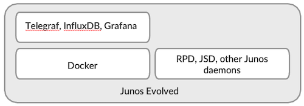
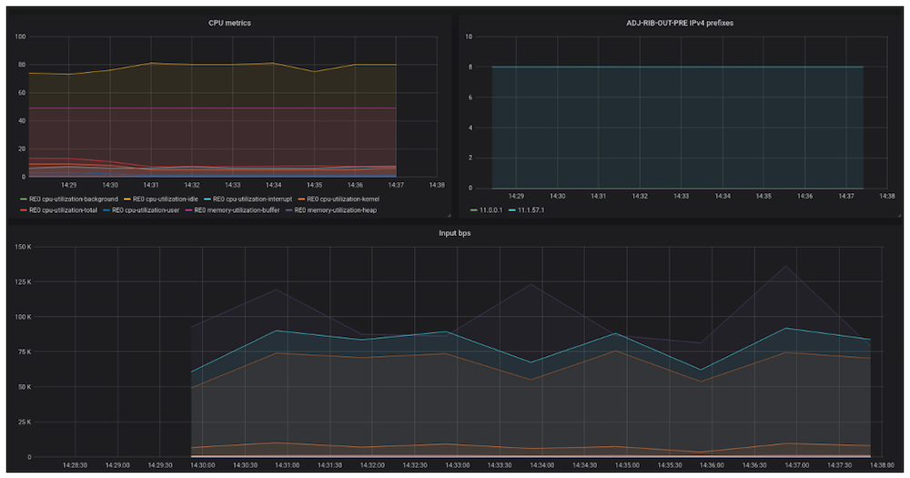
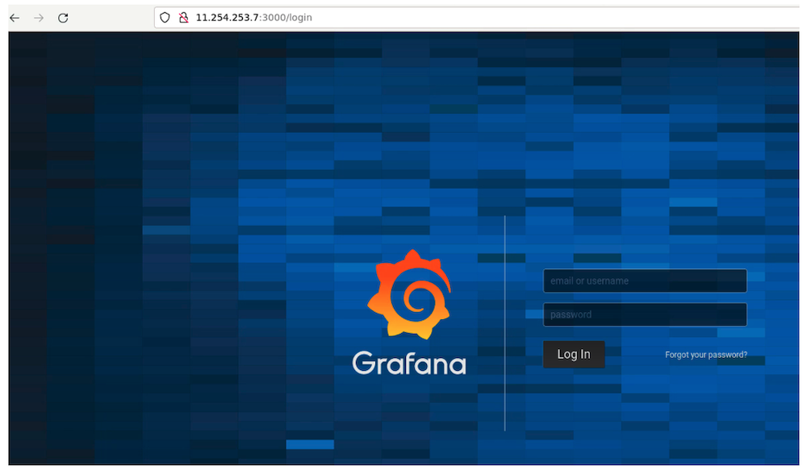
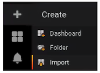
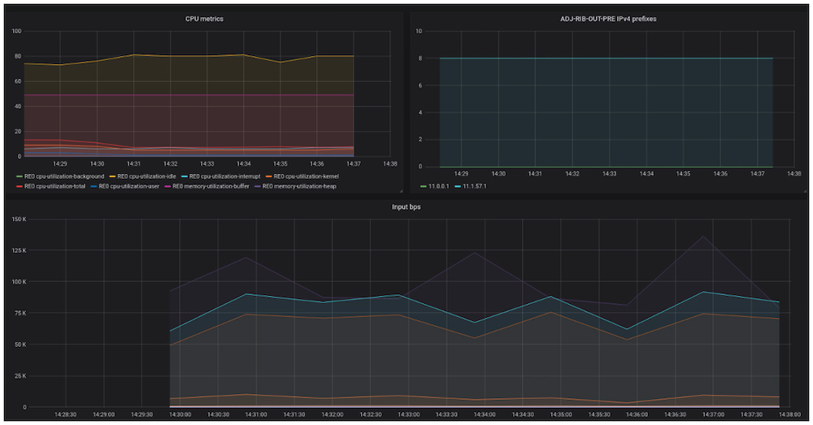

# Telemetry Collector and Graphical Front End on Junos Evolved

**Anton Elita - 07/18/2022**





## Introduction

- Configure Junos to accept Remote Procedure Calls (gRPC)
- Prepare configuration files for docker containers
- Start Docker containers
- Access the graphical interface and create own dashboards for interesting telemetry streams

## Prepare Junos Evolved for Streaming Telemetry

Junos Evolved 21.4R1 is used here as an example. Streaming measurements out of a networking node can be performed in a few ways. In this guide, OpenConfig gRPC Network Management Interface (GNMI) is used for data encoding and transport. It is a widely adopted choice.

Basic configuration of gRPC:

```
system {
    management-instance;
    services {
        extension-service {
            request-response {
                grpc {
                    clear-text {
                        port 32767;
                    }
                    max-connections 30;
                    routing-instance mgmt_junos;
                }
            }
        }
    }
}
routing-instances {
    mgmt_junos {        
        description default;
    }
}
```

```
> start shell user root
# export DOCKER_HOST=unix:///run/docker-mgmt_junos.sock
# docker image pull grafana/grafana:5.4.5
# docker image pull influxdb:1.8.10
# docker image pull telegrafa
```

```
docker image pull grafana/grafana:5.4.5
docker image pull influxdb:1.8.10
docker image pull telegraf
docker save grafana/grafana -o /var/tmp/grafana.tar
docker save influxdb:1.8.10 -o /var/tmp/influxdb.tar
docker save telegraf -o /var/tmp/telegraf.tar
scp /var/tmp/grafana.tar /var/tmp/influxdb.tar /var/tmp/telegraf.tar 11.254.253.7:/var/tmp/
```

```
> start shell user root
# export DOCKER_HOST=unix:///run/docker-mgmt_junos.sock
# docker load < /var/tmp/telegraf.tar
# docker load < /var/tmp/grafana.tar
# docker load < /var/tmp/influxdb.tar
```

```
> start shell user root
# mkdir -p /var/home/root/grafana/dashboards /var/home/root/telegraf /var/home/root/influxdb
# chmod -R 777 /var/home/root/grafana/
```

## Create Configuration Files

```
> start shell user root
# cat <<EOF > /var/home/root/influxdb/env
INFLUXDB_DB=telegraf
INFLUXDB_USER=telegraf
INFLUXDB_ADMIN_ENABLED=true
INFLUXDB_ADMIN_USER=admin
INFLUXDB_ADMIN_PASSWORD=lab123
EOF
```

```
> start shell user root
# cat <<EOF > /var/home/root/telegraf/conf
[[outputs.influxdb]]
   urls = ["http://10.100.3.120:8086"]
   database = "telegraf"
   write_consistency = "any"
   timeout = "5s"
   username = "admin"
   password = "lab123"
[[inputs.jti_openconfig_telemetry]]
  servers = ["10.100.3.120:32767"]
  username = "user"
  password = "SECRET-PASSWORD"
  client_id = "telegraf"
  sample_frequency = "60000ms"
  sensors = [
      "60000ms bgp /network-instances/network-instance/protocols/protocol/bgp/neighbors/neighbor/state/session-state",
     "60000ms task /junos/task-memory-information/",
     "60000ms num_routes /bgp-rib/afi-safis/afi-safi/ipv4-unicast/neighbors/neighbor/adj-rib-out-pre/num-routes",
     "60000ms re0 /components/component[contains(name,'Engine0')]/properties/property[contains(name,'utilization')]/state/value/",
     "60000ms interfaces /interfaces/interface/"
  ]
str_as_tags = false
[[processors.converter]]
  [processors.converter.fields]
    float = ["/components/component/properties/property/state/value"]
EOF
```

## Start Docker Containers

```
> start shell user root
# export DOCKER_HOST=unix:///run/docker-mgmt_junos.sock
 
# docker run \
-d --name grafana \
-v /var/home/root/grafana/:/var/lib/grafana/ \
-v /var/home/root/grafana/dashboards:/usr/share/grafana/conf/provisioning/dashboards/ \
-v /etc/localtime:/etc/localtime:ro \
--cap-add=NET_ADMIN \
--network=host \
--restart=always \
grafana/grafana:5.4.5

# docker run \
-d --name influxdb \
--env-file=/var/home/root/influxdb/env \
-v /etc/localtime:/etc/localtime:ro \
-v /var/home/root/influxdb:/var/lib/influxdb \
--cap-add=NET_ADMIN \
--network=host \
--restart=always \
influxdb:1.8.10

# docker run \
-d --name telegraf \
-v /var/home/root/telegraf/conf:/etc/telegraf/telegraf.conf:ro \
-v /etc/localtime:/etc/localtime:ro \
--cap-add=NET_ADMIN \
--network=host \
--restart=always \
telegraf
```

```
# docker ps
CONTAINER ID        IMAGE                   COMMAND                  CREATED             STATUS              PORTS               NAMES
8c105cb2a587        telegraf                "/entrypoint.sh tele..."   21 hours ago        Up 21 hours                             telegraf
332e790beb6c        influxdb:1.8.10         "/entrypoint.sh infl..."   9 days ago          Up 9 days                               influxdb
a40d11a0c2f0        grafana/grafana:5.4.5   "/run.sh"                9 days ago          Up 9 days                               Grafana
```

```
# docker stats --no-stream
CONTAINER ID        NAME                CPU %               MEM USAGE / LIMIT     MEM %               NET I/O             BLOCK I/O           PIDS
8c105cb2a587        telegraf            1.20%               30.96MiB / 15.39GiB   0.20%               0B / 0B             0B / 0B             0
332e790beb6c        influxdb            0.15%               265.3MiB / 15.39GiB   1.68%               0B / 0B             0B / 0B             0
a40d11a0c2f0        grafana             0.02%               20.56MiB / 15.39GiB   0.13%               0B / 0B             0B / 0B             0
```

## Work with a Graphical Interface

```
http://11.254.253.7:3000/
```







## Resources Management

```
> start shell user root
# export DOCKER_HOST=unix:///run/docker-mgmt_junos.sock

# cat /etc/extensions/platform_attributes
## Edit to change upper cap of total resource limits for all containers.
## applies only to containers and does not apply to container runtimes.
## memory.memsw.limit_in_bytes = EXTENSIONS_MEMORY_MAX_MIB + EXTENSIONS_MEMORY_SWAP_MAX_MIB:-0
## check current defaults, after starting extensions-cglimits.service
## $ /usr/libexec/extensions/extensions-cglimits get
## please start extensions-cglimits.service to apply changes here
 
## device size limit will be ignored once extensionsfs device is created
#EXTENSIONS_FS_DEVICE_SIZE_MIB=
#EXTENSIONS_CPU_QUOTA_PERCENTAGE=
#EXTENSIONS_MEMORY_MAX_MIB=
#EXTENSIONS_MEMORY_SWAP_MAX_MIB=
```

- **EXTENSIONS_FS_DEVICE_SIZE_MIB=** is the maximum storage space in bytes that containers can use. The default value is 8 GB or 30% of the total size of /var, whichever is smaller.
- **EXTENSIONS_CPU_QUOTA_PERCENTAGE=** is the maximum percentage of CPU usage that containers can use. The default value is 20% max CPU use across all cores.
- **EXTENSIONS_MEMORY_MAX_MIB=** is the maximum amount of physical memory in bytes that containers can use. The default value is 2 GB or 10% of total physical memory, whichever is smaller.

```
> start shell user root
# export DOCKER_HOST=unix:///run/docker-mgmt_junos.sock

# systemctl restart extensions-cglimits.service
```

```
> start shell user root
# export DOCKER_HOST=unix:///run/docker-mgmt_junos.sock

# docker exec -it influxdb influx -database telegraf -execute "show retention policies"
name    duration shardGroupDuration replicaN default
----    -------- ------------------ -------- -------
autogen 0s       168h0m0s           1        true

# docker exec -it influxdb influx -database telegraf -execute "ALTER RETENTION POLICY autogen ON telegraf DURATION 168h  DEFAULT"

# docker exec -it influxdb influx -database telegraf -execute "show retention policies"
name    duration shardGroupDuration replicaN default
----    -------- ------------------ -------- -------
autogen 168h0m0s 168h0m0s           1        true
```

## Useful links

- Running third-party applications on Junos Evolved: [https://www.juniper.net/documentation/us/en/software/junos/overview-evo/topics/task/third-party-applications-deploying.html](https://www.juniper.net/documentation/us/en/software/junos/overview-evo/topics/task/third-party-applications-deploying.html)
- Telegraf:[ https://www.influxdata.com/time-series-platform/telegraf/](https://www.influxdata.com/time-series-platform/telegraf/)
- InfluxDB: [https://www.influxdata.com/products/influxdb-overview/](https://www.influxdata.com/products/influxdb-overview/)
- Grafana: [https://grafana.com/](https://grafana.com/)

## Glossary

- RPD: Routing Process Daemon
- JSD: Juniper Extension Toolkit (JET) Service Process
- TIG: Telegraf, InfluxDB, Grafana
- GNMI: gRPC (Remore Procedure Call) Network Management Interface
- DB: database
- CPU: central processing unit
