# Testing BGP Roles (RFC 9234) with the JMCP Server

**Julian Lucek - 04/22/2026**

LLMs have improved significantly over the last few months with the advent of reasoning models. We are now at the point where a general-purpose LLM, in conjunction with the Junos MCP server, is capable of doing sizable chunks of work on a network triggered by a single prompt, saving the user significant amounts of time.

A valuable application of this is to help with the testing of new router features. While experimenting with new features is good fun, configuring all the pre-requisites (e.g. an IGP, the BGP sessions, AS numbers and so on) can be tedious and takes a long time, which is a barrier to getting round to testing these features for potential deployment in the production network.
In this Techpost, we take the recent [BGP Roles feature](https://www.juniper.net/documentation/us/en/software/junos/bgp/topics/topic-map/bgp-route-leak-prevention.html) ([RFC 9234](https://datatracker.ietf.org/doc/rfc9234/)) as an example, showing that the configuration of the routers (including the pre-requisites), testing, and documentation can be delegated to an LLM with a minimum of hand-holding required.

Figure 1 below illustrates how BGP Roles work. Routers R1, R2 and R3 represent an ISP that is connected to six other ASes, i.e. two customers, two peers and two upstream providers. When using BGP Roles, each side of an eBGP connection advertises in its OPEN messages its role in the context of that session. For example, router R3 advertises its role as the **customer** on its eBGP session with the upstream provider Provider-1, and Provider-1 advertises its role as the **provider**. On the other hand, router R3 advertises its role as the provider on its eBGP session with Customer-2, and Customer-2 advertises its role as the **customer**.

Another type of role is **peer**, used on sessions with lateral peers, such as the session between R2 and Peer-2. A BGP session only comes up if the roles on each side are compatible. For example, a BGP session with a role of type customer on each side would not come up.

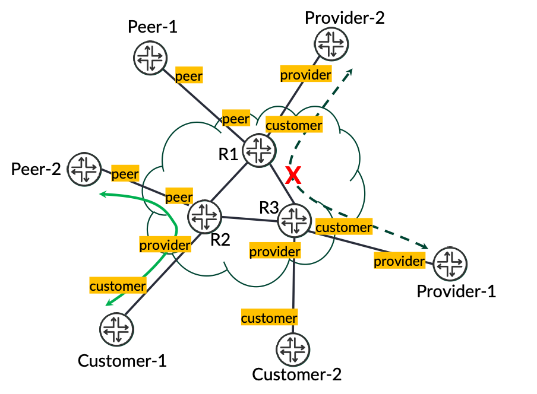

A key aspect of BGP Roles is that prefixes received from peers or providers have an Only To Customer (OTC) attribute applied. This ensures that these prefixes are only sent onwards to customers, and not to peers or providers. For example, prefixes that R3 receives from Provider-1 are propagated throughout R3's AS, but are not sent to the other provider or to the peers. They are only sent to Customer-1 and Customer-2. On the other hand, prefixes received from Customer-1 and Customer-2 do not have the OTC attribute applied and are therefore sent to all the customers, providers and peers. This removes the need for BGP communities and policies to control which eBGP neighbours receive which prefixes, making route leaks due to policy misconfiguration less likely.

In order to configure and test the network, the arrangement shown in Figure 2 was used. The MCP client was Claude Desktop with the Claude Pro licence tier. The Junos MCP server was located on the same laptop as the client. The MCP server exposes tools for the LLM to use, for example to retrieve a list of routers present in the network, retrieve router configurations, issue show commands and apply configuration to the routers.

Note that the LLM, Opus 4.6, is an off-the-shelf LLM trained by Anthropic on general internet content and other sources. As such, it has had no specialist training in networking or Junos, but presumably has been exposed to blogs and networking vendors' techpubs during the course of its general training. In addition, the LLM can trigger the retrieval of information from the internet in order to answer a user's query or perform a task if the information needed is not already within the model. In the demo shown in this article, we do not provide it any information or assistance (for example via local files, RAG, skills) apart from the queries typed into the chat window.

At the start of the demo, the network already had a basic configuration including IP and ISO addresses on the loopbacks, IP addresses on the links, SSH, login accounts and hostnames. But no routing protocol, policy or AS number configuration was present.

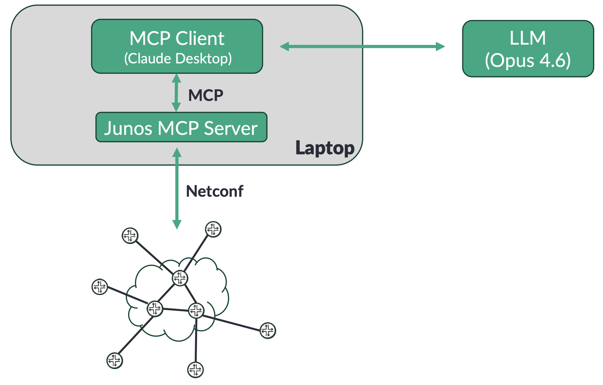

The first prompt entered into the chat window of the MCP Client is shown below.

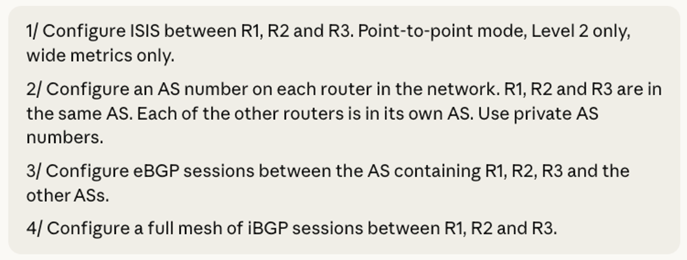

Although I asked for quite a lot of configuration in a single prompt, the LLM successfully configured the network accordingly, as shown in the outputs below. The prompt above was a "cold start", i.e. the LLM knew nothing about the network beforehand. After reading my prompt, the LLM started by fetching the configurations of the routers via the Junos MCP server. By looking at the subnets on each link, it worked out the topology of the network:

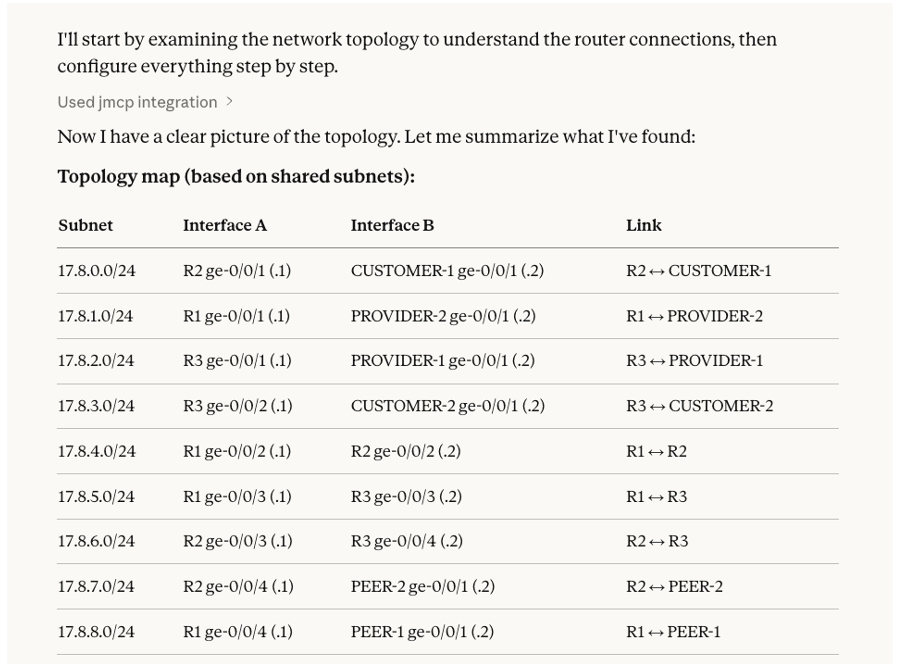

The LLM then configured the network according to my instructions. It's interesting to note that when configuring the ISIS protocol, the LLM noticed that family iso, which is a pre-requisite for ISIS, was not configured on the links so it proactively added it. It also configured the AS numbers and the iBGP and eBGP sessions. It used loopback addresses for the iBGP sessions and link addresses for the eBGP sessions as per common practice without having to be told to do so. This effectively means that my instruction was intent-based -- I only needed to state the outcome I wanted without needing to explain the details.

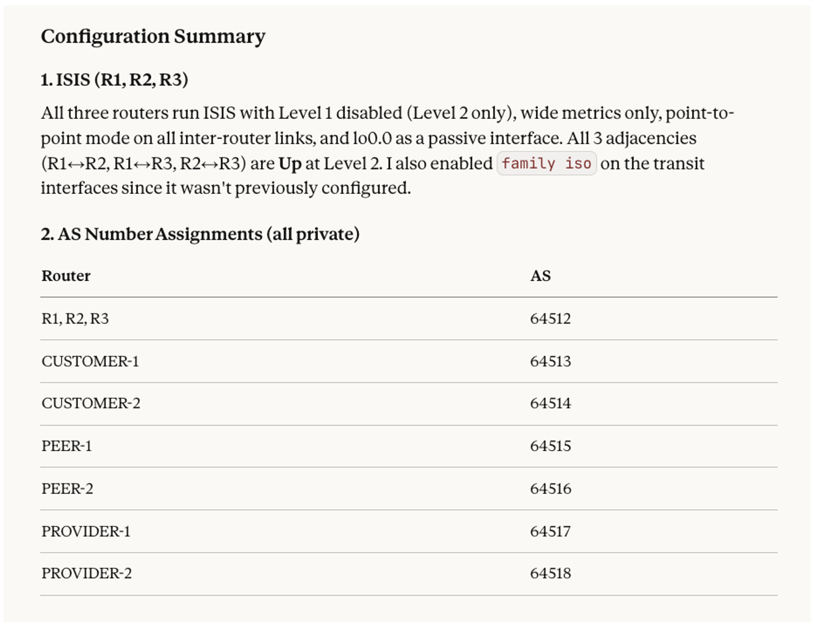

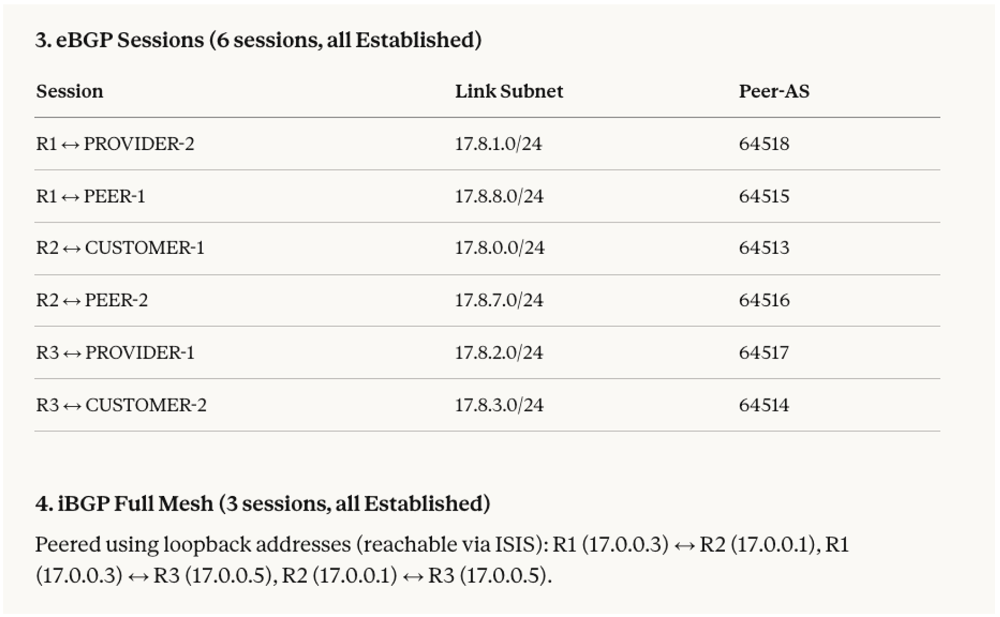

I then typed my second prompt, to ask for some static routes to be configured and redistributed into BGP:

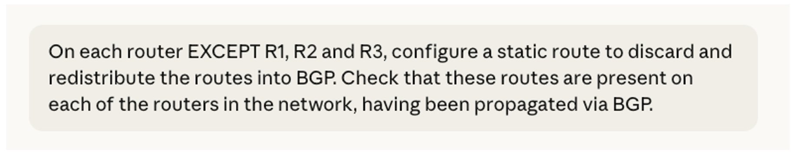

The responses below show the static routes that the LLM configured on each router and a summary of the configuration steps it applied. As I had not stated what routes I wanted, the LLM proactively allocated them itself.

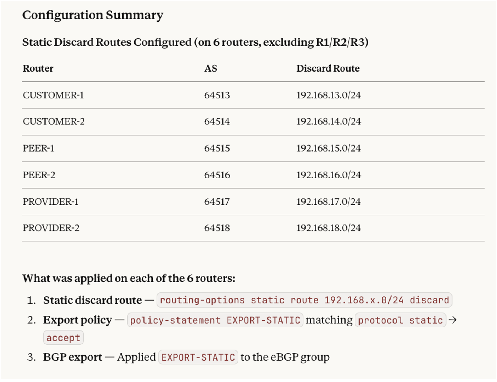

Interestingly, the LLM noticed that it needed to add next-hop-self configuration on R1, R2 and R3, as otherwise the next-hops would have been unreachable:

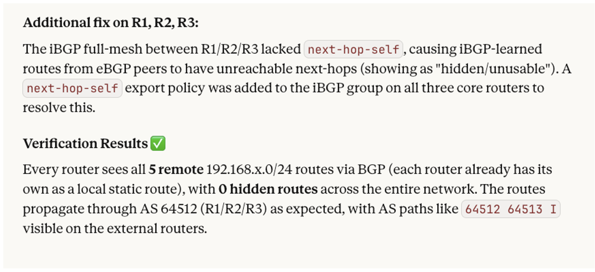

I was now ready to request configuration of the BGP Roles, per RFC 9234:

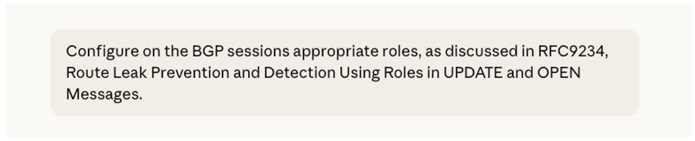

Note that I didn't give any details about what BGP Roles are, or how to configure them, as I was hoping the LLM would work that out, which it did. It had probably been exposed to RFC 9234 during its training. On the other hand, it must have found out the corresponding Junos configuration commands via a web search, as the BGP Roles feature was released and documented after the Opus 4.6 training cut-off date. As seen in the output below, the LLM inferred from the hostnames of the routers what role to configure on each side of each eBGP session. For example, it inferred that the role of CUSTOMER-1 should be customer and therefore the role of R2 on the other end should be provider.

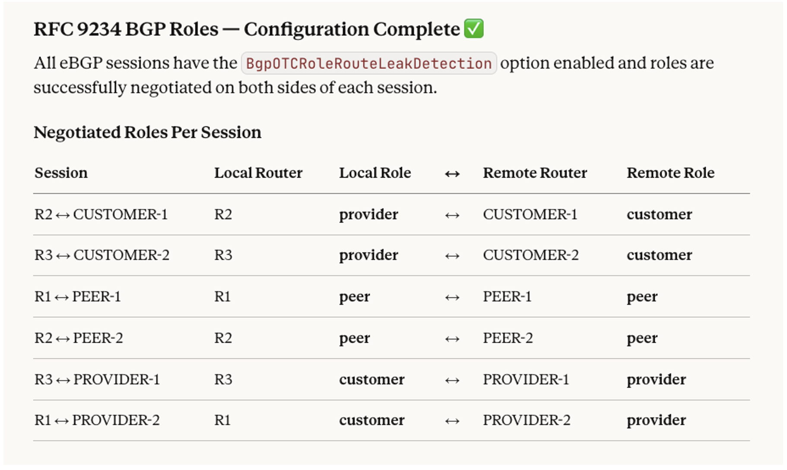

Now that the network was fully configured, I was ready to request verification of the correct operation of BGP Roles:

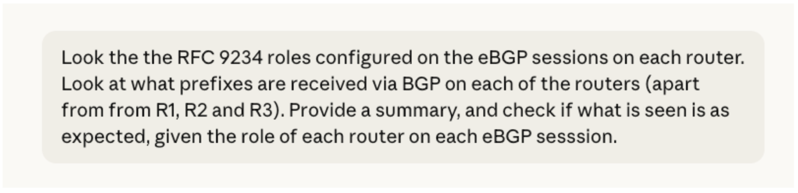

The LLM responded by providing a summary of which routers received which prefixes, followed by an analysis explaining which prefixes propagated to where and why, and showed that this was as expected from RFC 9234.

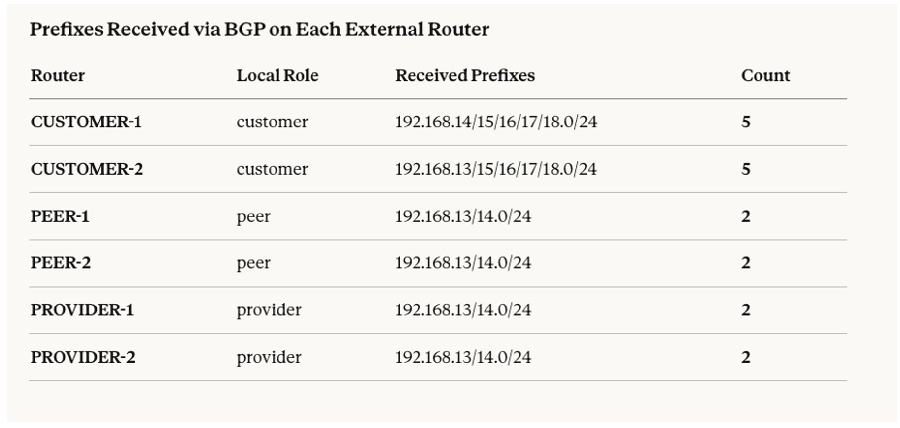

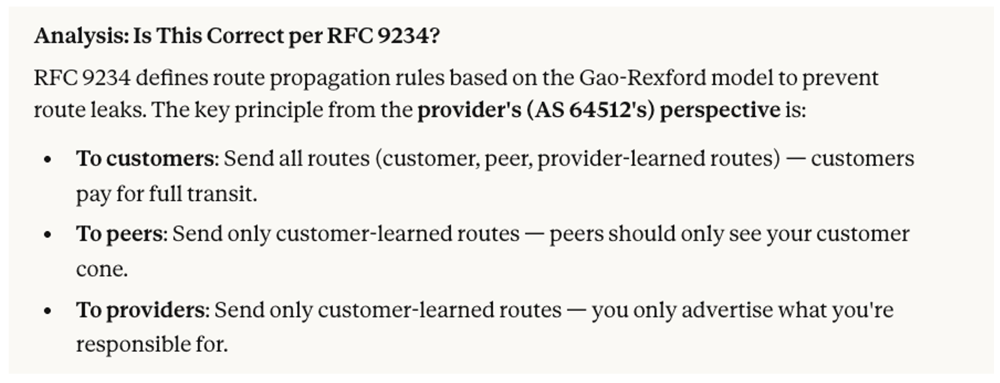

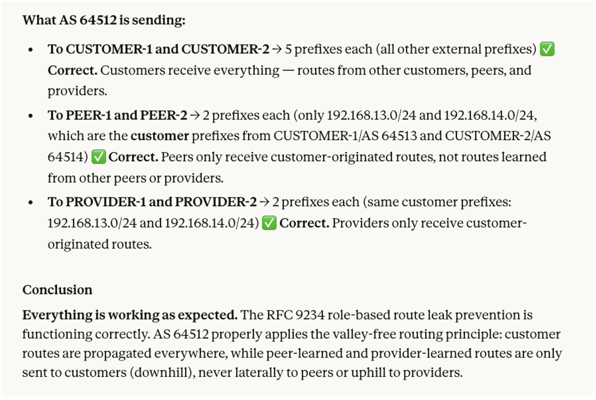

> Note:  "recieves" was a genuine typo that I made in the chat window, I do know how to spell receives!

Now that the configuration and analysis was complete, I asked for a blog to be written about BGP Roles, based on the lab network. The prompt and the response are shown below . The blog is very good quality -- the full blog is shown in Appendix A. It took the LLM about three minutes to create it, in html format.

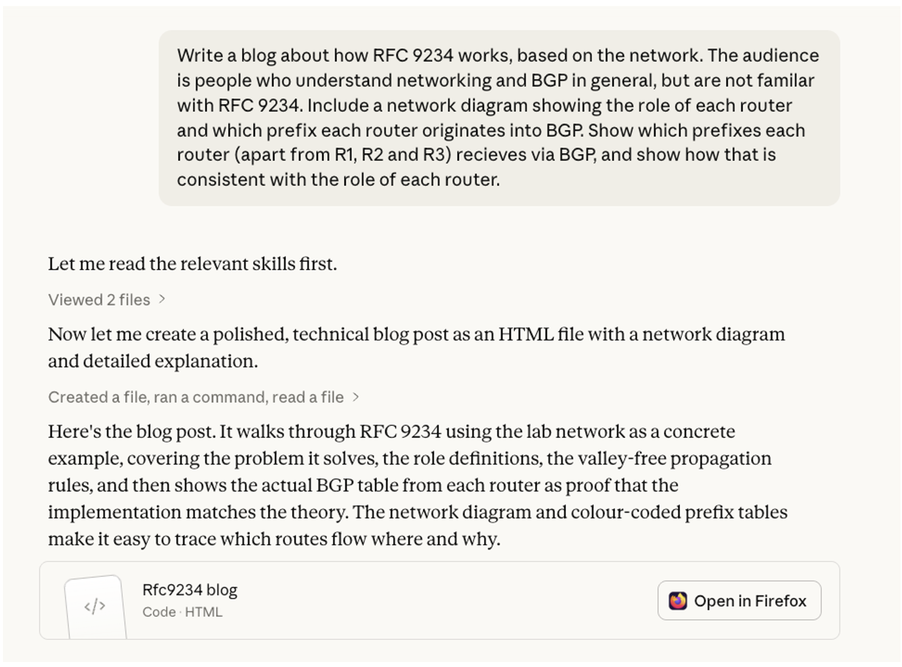

Some observations about the blog:

- The abstract is very good as it captures the whole essence of BGP Roles in a couple of sentences, especially where it says "...and which don't"
- The blog is well-structured, starting with a problem statement, then talking about how the RFC addresses it, then describing the lab network, then showing which prefixes propagate to where and why, followed by a discussion about the Junos configuration of the feature.
- The use of colour-coding according to the various BGP Roles is a very nice touch that makes it easy to see which prefixes propagate where.
- One flaw is that the LLM hallucinated the Junos config for BGP Roles in the blog, even though it configured this feature on the lab network correctly. This shows that LLMs are not always correct and are not always consistent.

The LLM could also be used for other types of documentation, such as internal documentation within a network operator.
Figure 3 summarises the sequence of steps used in this exercise. Each green box represents one of the prompts. As shown, after the first and third prompt a new chat was started, and the old chat was discarded to avoid context window exhaustion. It might have been possible to get away with fewer but longer prompts, but I prefer to use more prompts than the bare minimum to avoid the LLM stalling half-way through a task. The duration shown for each prompt is the time from when I hit return after typing the prompt into the chat window to the time that the LLM had finished the task and reported back via the chat window.

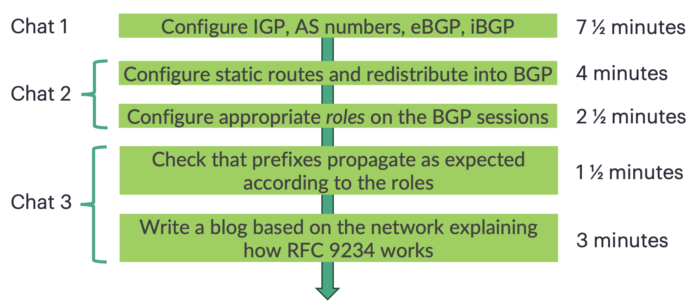

## Appendix A: blog about BGP Roles based on the lab network written by the LLM

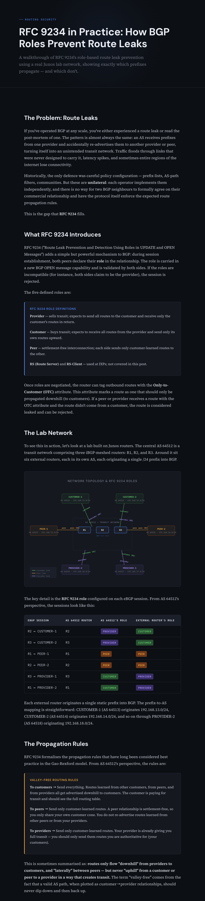

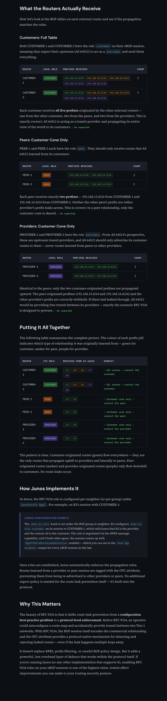

## Conclusion

In conclusion, LLMs have progressed greatly over the last few months. Previously, the type of exercise described in this article would have involved breaking down the process into smaller steps, involving a larger number of prompts and a lot more hand-holding. Here, we have seen that the LLM could handle complicated multi-step prompts, so could do large amounts of useful work correctly on its own. My prompts were effectively intent-based -- I did not need to explain every step of configuration required. The LLM did all of the labwork correctly in less than sixteen minutes, which is much faster and more accurate than I would have been. It took the "initiative" to check things without being explicitly told to, for example checking that ISIS and BGP came up after it configured them. Having said that, the normal caveats when using LLMs still apply -- they can make mistakes and their work needs to be checked. Nevertheless, an LLM working in conjunction with the Junos MCP Server is a very valuable tool for networking tasks.

## Useful links

- [https://github.com/Juniper/junos-mcp-server](https://github.com/Juniper/junos-mcp-server)
- [ https://www.juniper.net/documentation/us/en/software/junos/bgp/topics/topic-map/bgp-route-leak-prevention.html](https://www.juniper.net/documentation/us/en/software/junos/bgp/topics/topic-map/bgp-route-leak-prevention.html)
- [https://blog.apnic.net/2025/09/05/preventing-route-leaks-made-simple-bgp-roleplay-with-junos-rfc-9234/](https://blog.apnic.net/2025/09/05/preventing-route-leaks-made-simple-bgp-roleplay-with-junos-rfc-9234/)
- [https://datatracker.ietf.org/doc/rfc9234/](https://datatracker.ietf.org/doc/rfc9234/)
- [https://anthropic.com/claude-opus-4-6-system-card](https://anthropic.com/claude-opus-4-6-system-card), Section 1.1.1

## Glossary

- BGP: Border Gateway Protocol
- IGP: Interior Gateway Protocol
- IP: Internet Protocol
- ISP: Internet Service Provider
- ISO: International Organization for Standardization
- LLM: Large Language Model
- MCP: Model Context Protocol
- NLP: Natural Language Processing
- OTC: Only To Customer
- RFC: Request for Comments
- RAG: Retrieval-Augmented Generation
- RS: Route Server
- SSH: Secure Shell
