# The Evolution of Network Security

**Sharada Yeluri - 07/22/2024**

A primer/survey for networking and cyber security enthusiasts interested in the evolution of this field.

This article was initially published on LinkedIn: [https://www.linkedin.com/pulse/evolution-network-security-survey-sharada-yeluri-cwglc](https://www.linkedin.com/pulse/evolution-network-security-survey-sharada-yeluri-cwglc)

Since its inception, network security has undergone significant transformations, evolving from basic measures to sophisticated systems designed to counter advanced threats. This blog reviews the history of network security, highlighting key milestones such as the development of firewalls, VPNs, next-generation firewalls (NGFWs), zero trust models, etc. It also discusses trends like AI-driven security and SASE. Finally, I discuss genAI's impact on network security and the future challenges with quantum computing.

This is a primer/survey for networking and cyber security enthusiasts interested in the evolution of this field...

## Early Days of Network Security

### 1980s: The Dawn of Firewalls

In the early days of networking, security was rudimentary, focusing primarily on physical security and simple access controls. As networks expanded, the need for more robust security measures became evident.

**Packet Filtering Firewalls**: The first generation of firewalls emerged in the late 1980s, primarily focusing on packet filtering. The first firewall system, known as the "Packet Filter," was introduced by Digital Equipment Corporation (DEC) in the late 1980s. This initial firewall implementation operated at the network layer, screening network traffic by deciding whether to allow or block specific packets.

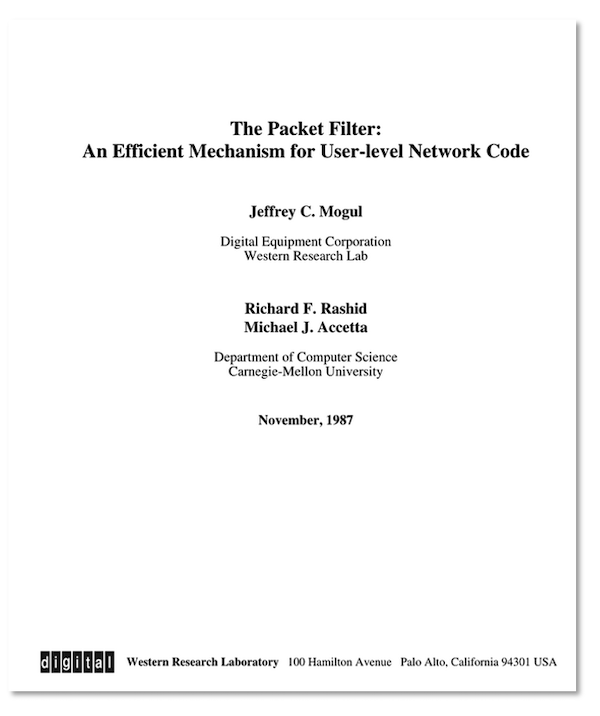

The decision was based on a set of predetermined rules, which included criteria such as source and destination IP addresses, source and destination ports of the Layer 4 header, and the protocol field. The action taken for each packet was either to allow or deny the traffic. These rules, which constituted the access control policy of the packet filter, were manually maintained and pushed down into the system.

An example rule might look like this:

- Allow all traffic from IP address 192.168.1.100 to any destination on port 80 (HTTP).
- Deny all incoming traffic to port 22 (SSH) from any source.
- Allow all outbound traffic to IP address 10.0.0.1 on port 443 (HTTPS).

These rules are processed in a specific order, usually from top to bottom, and the first rule that matches the packet's attributes determines the action taken. If no rules match, the firewall typically has a default action: to deny or allow the traffic.

This basic firewall was implemented in software running on general-purpose CPUs. While it lacked stateful inspection or deep packet analysis capabilities, it began firewall evolution, paving the way for more advanced and sophisticated firewall technologies in subsequent generations. Packet-filtering firewalls continued to evolve over time, supporting more complex rule sets like longest prefix matching for IP addresses and ranges for port numbers. These firewalls also moved away from software implementations in CPUs to native implementations in ASICs from the early-2000s.

### 1990s: Stateful Inspection Firewalls

Introduced in the early 1990s, stateful inspection firewalls represented a significant advancement. They tracked the state of active connections and made filtering decisions based on the context of the traffic, such as whether a packet is part of an existing connection or a new connection request. The first commercially available stateful inspection firewall was Check Point's FireWall-1, released in 1993. They coined the term stateful inspection.

Stateful firewalls maintain state tables that record details about ongoing connections, such as source and destination IP addresses, ports, and connection/session states (e.g., established, listening, closing). This allows them to make informed decisions about allowing or denying packets, ensuring only those that match an active connection are permitted through the firewall. This ability to track the state of connections helps protect against unauthorized access by various types of attacks.

Imagine an attacker attempting to hijack a TCP connection to access a web server behind a firewall. With a stateless packet firewall, each packet is inspected independently based only on source/destination IP addresses and ports. The stateless firewall can't differentiate between legitimate traffic and the attacker's spoofed packets trying to hijack this established connection.

In contrast, when the attacker's spoofed packets arrive at a stateful firewall, since they didn't originate from the real source IP associated with any tracked connection, they will be identified as an anomaly by not having a matching table entry in the state table. The firewall then drops these malicious packets, preventing the hijacking attempt.

Another example is the SYN flood attack, where the attacker sends many SYN packets (packets to establish a TCP connection) to the server but does not respond to the SYN-ACK packets with the final ACK. This leaves the server with many half-open connections, consuming its resources and preventing legitimate connections from being established. Stateful firewalls mitigate this by intercepting the TCP handshake, where, for each SYN packet, it generates a special response (SYN cookie) to the client. When the client sends the ACK, the firewall establishes the session with the server. The firewalls also often rate-limits SYN packets originating from each IP address to reduce the flooding.

Thus, stateful firewalls provide better security by understanding the state of network connections. By maintaining a comprehensive state table, they can distinguish between legitimate traffic and attacks like IP spoofing, port scanning, or unauthorized connections.

Over time, stateful firewalls evolved from earlier implementations to handle complex protocols that required multiple connections, such as FTP, which involved separate control and data connections. They also implement network address translation (NAT) capabilities. NAT allows multiple devices on a private network to share a single public IP address. Stateful firewalls could track the state of connections passing through NAT, ensuring proper translation and security.

As the network traffic grew, hardware acceleration for session lookups and multi-core processing for session setup enabled these firewalls to handle higher traffic volumes and more complex and large state tables. Load balancing and active-passive failover were introduced in these systems with stateful firewalls to ensure continuous operation and reliability.

### 1990s: Intrusion Detection and Intrusion Prevention Systems (IDS/IPS)

The concept of IDS emerged to address the limitations of firewalls. IDS could inspect packet contents (payload) and detect suspicious activities, providing an additional layer of security. IDS heavily relies on signature-based detection, where the contents are searched for a match to any of the signatures in the database. The signatures could be byte sequences in the payload or the packet header, file hashes, and the command and control communication patterns to malware servers. Signature-based detection can identify known threats accurately, but It cannot detect new, unknown threats (zero-day attacks) that do not match any existing signatures. The effectiveness depends on regularly updating the signature database to include new threats.

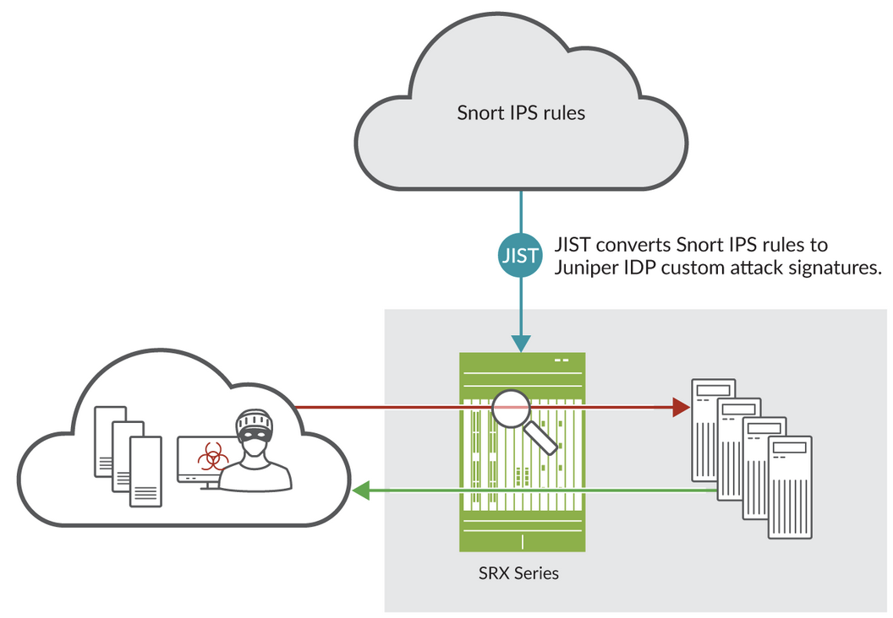

Later, IPS solutions were introduced to not only detect threats but to automatically block or mitigate them based on the configuration, reducing the response time and potential damage.

### 1990s: Application Proxy Firewalls

In the mid-1990s, application proxy firewalls emerged, which are also commonly referred to as proxy firewalls. These firewalls go further than stateful inspection firewalls by not allowing communications to pass directly across protected environments. They establish a proxy connection between the client and the server on the target network, via which traffic is routed, preventing any direct connection between them. These firewalls combined stateful firewall capabilities with application-layer (layer 7 in OSI model) inspection and filtering abilities. They could understand and enforce rules based on specific application protocols and payloads. This enabled:

- Deep packet inspection and content filtering: Application proxy firewalls can perform deep packet inspection to analyze network traffic's actual content and payloads at the application layer. This allows them to detect and block malicious content, malware, and unauthorized activities more effectively.
- Granular access control and user authentication: They can enforce granular access control policies based on user identities, roles, and authentication
- Improved isolation and separation of networks: Proxy firewalls act as intermediaries between internal networks and the Internet, preventing direct connections. This isolation makes it harder for attackers to access internal resources directly.
- IP address masking and anonymity: By acting as an intermediary, proxy firewalls hide the real IP addresses of internal clients from the internet, providing anonymity. This makes it harder for attackers to identify and target specific devices on the network.
- Secure caching and performance optimization: Many proxy firewalls implement caching mechanisms to locally store frequently accessed web content. This can improve performance while enabling content inspection.

In essence, application proxy firewalls' proxy architecture, deep packet inspection abilities, caching, and authentication integration provided an additional layer of security compared to traditional stateful firewalls. These firewalls also benefited from hardware acceleration for deep packet inspection and other features.

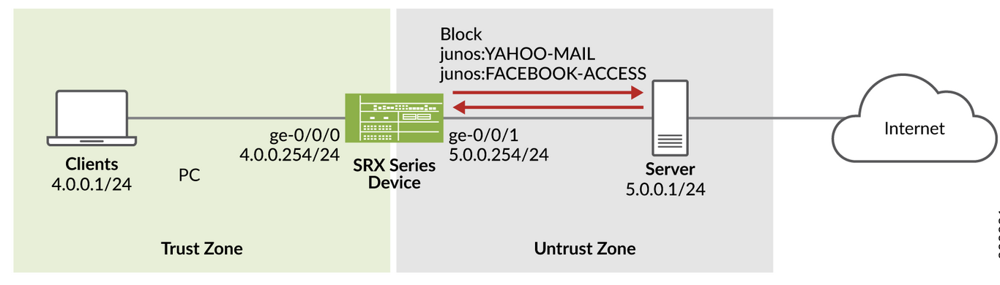

Later in the 2010s, in the cloud-native era, cloud-based application firewalls offered similar capabilities to traditional ones but were designed to protect cloud-native applications and services. These cloud-based firewalls are adapted to inspect and secure east-west traffic within container environments, ensuring security policies are enforced within microservices.

### Mid-1990s: The Rise of VPNs and Secure Remote Access

Virtual Private Network (VPN) technology creates a secure and encrypted connection over a less secure network, such as the public Internet. This secure connection, often called a "tunnel," allows users to send and receive data as if their devices were directly connected to a private secured network. The first instance of VPN technology can be traced back to the PPTP protocol developed at Microsoft. PPTP allowed users to dial in over modems and connect securely to corporate networks by creating tunnels over IP/Ethernet.

Over time, IPsec (Internet Protocol Security) and SSL (Secure Sockets Layer) VPNs became the standard protocols for creating secure connections over public networks.

An SSL VPN uses the SSL or its successor, the Transport Layer Security (TLS) protocol, to create a secure and encrypted connection over the internet. This technology enables users to remotely access private networks and resources securely, often through a standard web browser.

An IPsec VPN establishes a secure and encrypted connection using the IPsec protocol suite. This VPN is often used for site-to-site connectivity. For example, an organization's connection between two branch offices could use IPsec VPN.

Enterprises widely adopted VPNs to enable secure remote access for employees working from home or on the road. However, VPNs can introduce latency and reduce connection speeds due to the overhead of encryption and the additional traffic routing through VPN servers. Native hardware implementations of IPsec encryption/decryption and tunnel termination in firewall devices in the late 2000s helped somewhat alleviate the performance issues.

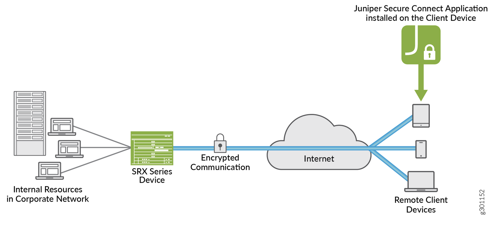

### Early 2000s: Unified Threat Management (UTM)

By 2003, the amount of data created surpassed all previous information combined. This data explosion also increased cyberattack exposure. UTM devices emerged in the early 2000s, integrating multiple security functions, such as firewalls, IDS/IPS, antivirus, and content filtering, into a single appliance.

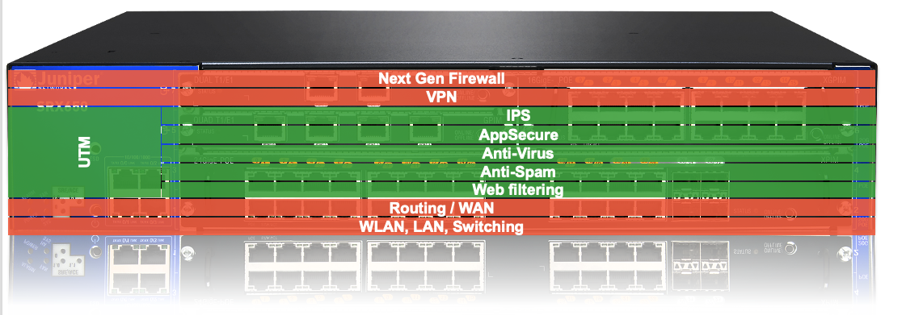

### Mid-2000s: Next-Generation Firewalls (NGFWs)

The mid-2000s saw the rise of advanced persistent threats (APTs), which are prolonged and targeted cyberattacks often sponsored by nation-states. These sophisticated threats required new defensive strategies and technologies. Frequent zero-day exploits (previously unseen threats) and other threats also led to the advent of Next-Generation Firewalls (NGFW) hardware appliances.

NGFW is an advanced form of firewall that includes all the features described above, i.e., packet filtering, stateful/application firewalls, IDS/IPS, NAT, VPN, and more, to provide enhanced security features and more granular control over network traffic at a very high performance. Here is a detailed explanation of what NGFWs are and the key features they offer:

**Key Features of Next-Generation Firewalls**

- **Application Awareness and Control**: NGFWs can identify and control applications regardless of the port, protocol, or IP address. This means they can enforce policies based on the application itself rather than just network-level attributes.
- **Identity Awareness**: NGFWs can integrate with identity management systems (e.g., Active Directory) to apply policies based on user identities rather than just IP addresses. This allows for more granular access control and auditing.
- **Deep Packet Inspection**: NGFWs perform deep packet inspection to analyze packet content, allowing them to detect and block threats hidden within the data payload. As explained in the IDS section, the detection is signature-based. Inspecting every packet can be resource-intensive and not always practical due to performance constraints, especially in high-throughput networks. Administrators usually configure security policies that specify which traffic should be inspected based on factors like application, user, source/destination IP addresses, and ports. These policies dictate whether a deeper content inspection is required for specific traffic types. This inspection is often done after stateful and packet firewall checks are done. This also reduces the load on the deep packet inspection engine.
- **Policy Enforcement**: The ability to enforce policies based on applications, users, and content enables NGFWs to apply more precise security controls. This granularity helps in minimizing the risk of unauthorized access and data breaches.
- **SSL/TLS Inspection**: When allowed, NGFWs may inspect encrypted traffic (SSL proxy) to detect threats that might be hidden within SSL/TLS sessions. This is critical as a large portion of internet traffic is encrypted, and threats can easily evade detection if the traffic is not inspected.
- **Threat Intelligence Integration**: NGFWs often integrate with threat intelligence services that provide up-to-date information on emerging threats. This enables the firewall to dynamically update its threat databases and block known malicious traffic effectively.
- **Automated Responses**: NGFWs can automatically respond to detected threats by isolating infected devices, blocking malicious traffic, and alerting administrators. They also incorporate advanced malware protection capabilities like sandboxing, which helps mitigate the impact of an attack quickly and efficiently.
- **Segmentation and Micro-segmentation**: NGFWs support network segmentation, dividing the network into smaller, isolated segments (zones) to limit the spread of threats. Micro-segmentation goes further by creating highly granular security zones within the network, enhancing security.
- **Network Functions**: Many NGFW also support L2/L3 forwarding features. By integrating routing and switching capabilities, NGFWs can reduce the need for separate devices, simplifying network design and management. Consolidating functions into a single device lowers hardware costs and reduces the complexity of network infrastructure.

Thus, by combining multiple security and network functions into a single device, NGFWs provide comprehensive protection against various threats. They also provide better visibility into network traffic and user activities, enabling administrators to gain insights into potential security issues and apply effective controls.

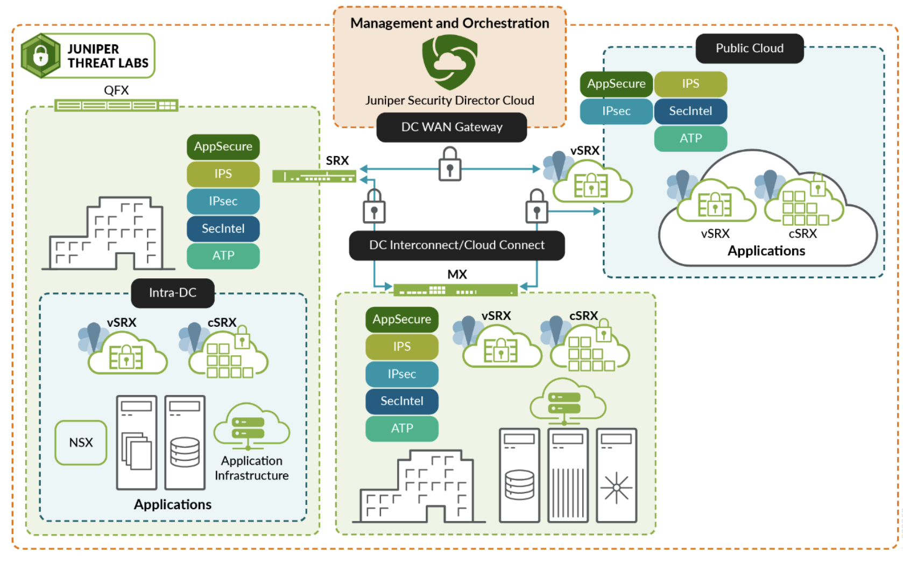

Most NGFWs have dedicated hardware (ASICs/FPGAs) and high-performance CPUs to handle high traffic volumes with minimal latency, ensuring that security does not impede network performance. Palo Alto Networks is widely recognized as the first company to introduce the concept and technology of the NGFW. Currently, many companies, including Fortinet, Juniper Networks, and Cisco, offer NGFW hardware appliances.

These NGFW hardware appliances are widely deployed in enterprises, data centers, and remote/branch offices. They provide security by securing the perimeter, where all the network traffic has to pass through the firewall before entering the premises.

NGFWs maintain up-to-date defenses against emerging threats through a combination of threat intelligence feeds, machine learning, regular updates, and integration with global threat databases. For example, most of the vendors typically maintain dedicated research teams that analyze global threats and vulnerabilities. These teams update the threat intelligence databases that NGFWs rely on. They provide continuous, cloud-delivered updates of new threat signatures to their firewall products. NGFWs can integrate with third-party threat intelligence services that offer additional data on threats and vulnerabilities.

### Limitations of NGFWs

While perimeter security provided by NGFW appliances has been effective in the past, several trends have diminished its effectiveness. In today's digital landscape, network traffic is highly distributed and no longer confined to a well-defined perimeter.

Organizations use multiple cloud service providers to host their applications and data, creating a distributed infrastructure. Employees and contractors access resources from many locations, including home offices and coffee shops, while traveling and literally from anywhere in the world. Routing traffic through centralized NGFW appliances can lead to inefficiencies and performance bottlenecks for remote users.

With the adoption of Software as a Service (SaaS), critical business applications (e.g., Salesforce, Office 365) that reside in the cloud are accessed over the Internet. In addition, modern network architectures, such as SD-WAN, often route user traffic directly to the Internet rather than backhauling it through an enterprise's central data center.

Given the distributed nature of network traffic, new security approaches are needed to complement traditional perimeter security.

### 2010s: Modern Security Paradigms: Cloud/Virtual NGFWs

As cloud computing gained prominence, securing cloud environments became critical. A cloud or virtual firewall is a software-based NGFW that provides firewall capabilities in a cloud environment. It offers similar functionalities to hardware NGFW appliances but is tailored for the unique challenges of cloud and virtual environments.

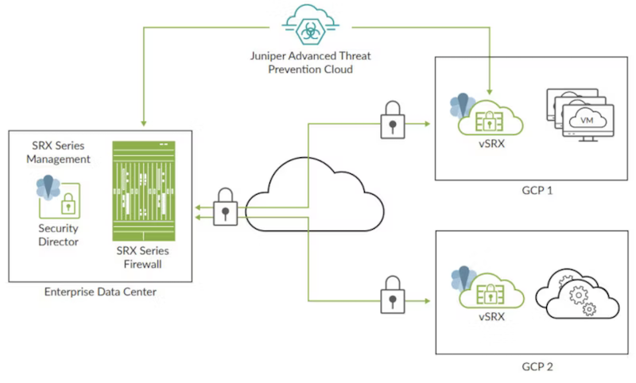

Cloud firewalls create a virtual security barrier around cloud platforms, infrastructure, applications, and data assets enterprises host. These are often delivered as a service by third-party security vendors. Cloud firewalls complement NGFW appliances in an enterprise by providing a layered security strategy. Here's how they work together:

- **Extending the security to the cloud**: While NGFW appliances secure the perimeter of the on-premises network, cloud firewalls extend these protections to cloud-based resources. Enterprises using hybrid cloud environments benefit from consistent security policies and enforcement across both on-premise and cloud resources.
- **Scalability**: Cloud firewalls can dynamically scale to handle changing traffic loads, complementing the more static capacity of hardware NGFWs. They can be rapidly deployed in new virtual machines or cloud instances, adapting to evolving requirements.
- **Centralized Management**: NGFWs and cloud firewalls can leverage shared threat intelligence feeds, ensuring they are updated with the latest threat data and mitigation strategies. Centralized management platforms allow unified security policies across physical and cloud environments. Enterprises gain full visibility into network traffic, threats, and events across all environments, improving awareness and incident response.
- **Support for Modern Architectures**: Most Cloud firewalls work well with microservices architectures and containerized applications that are prevalent in modern cloud environments, leading to efficient, scalable deployments,
- **Cost Efficiency**: By offloading some security functions to cloud firewalls, enterprises can optimize the use of their hardware NGFWs, reducing the need for costly hardware upgrades. Cloud firewalls often follow a subscription-based approach, allowing enterprises to align security spending with actual usage.

Firewall as a Service (FWaaS) is a cloud-based service model that delivers firewall functionality as a subscription service. FWaaS offers a simplified and scalable security solution managed by a third-party service provider. It provides network security services without organizations needing to deploy, manage, or maintain cloud firewall appliances.

### Late 2010s: Modern Security Paradigms: SASE

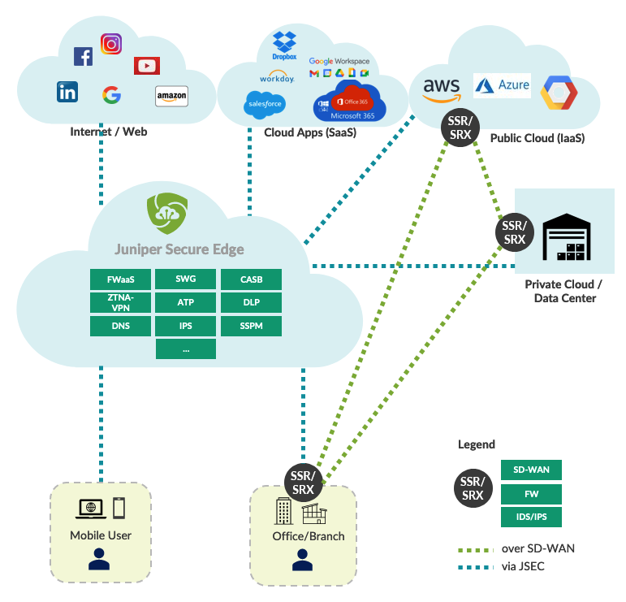

Secure Access Service Edge is a network architecture concept defined by Gartner in 2019. It represents the convergence of wide-area networking (WAN) and network security functions. Before SASE, traditional security solutions involved point solutions/tools to manage, scale, and deploy. SASE simplified this by converging these tools into a single platform. The foundational components of SASE are SD-WAN, secure web gateway (SWG), cloud access security broker (CASB), firewall as a service (FWaaS), and zero-trust network access (ZTNA).

**Software-Defined Wide Area Network (SD-WAN)** is a technology that uses software-based network management to control and optimize WAN traffic. It enhances WANs' performance, reliability, and security by decoupling the networking hardware from its control mechanism.

SD-WAN is a foundational component of SASE for several reasons. SD-WAN optimizes the use of multiple WAN links (MPLS, broadband, LTE, etc.) for better performance, lower latency, and higher reliability. This is important for SASE, which relies on efficient network connectivity to deliver its security services. SD-WAN also provides a centralized management interface for configuring and monitoring network policies. This aligns with SASE's goal of simplifying network and security management through a central platform. SD-WAN often comes with integrated security features such as encryption and firewalling. These features complement the security functions offered by SASE.

**Secure Web Gateway** protects users from web-based threats and enforces company policies for internet usage by providing URL filtering, malware inspection, and content control.

**Cloud Access Security Broker** secures access to cloud services and applications, providing visibility and control over user activity. It enforces data loss prevention (DLP) policies to prevent sensitive data leaks. It monitors user activities to detect and respond to anomalous behavior. It also implements granular access policies based on users and contexts.

**Firewall as a Service (FWaaS)** provides NGFW firewall capabilities as a cloud service.

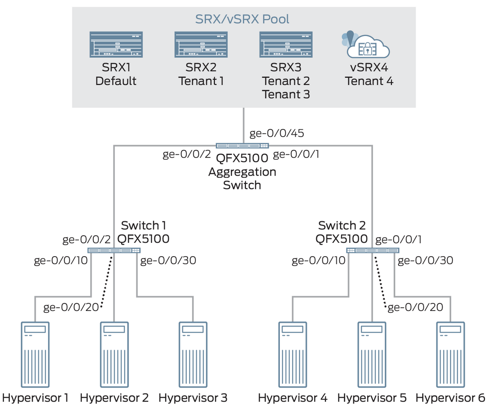

**Zero Trust Network Access (ZTNA)** is a security model that assumes no user, device, or application, whether inside or outside the network, should be trusted by default. Instead, it requires verification for each access request to the network and its resources. The core principles of Zero trust are:

- Never trust/always verify: Every access request is untrustworthy until verified. This applies to users/applications and devices inside or outside the network perimeter. Users must authenticate themselves using multi-factor authentication before accessing the network. Devices are verified to ensure they meet security policies (updated software and installed antivirus) before being granted access.
- Least Privilege Access: Users and devices are granted the minimum level of access necessary to perform their tasks, which minimizes the potential impact of a security breach.
- Micro-Segmentation: The network is divided into smaller segments, each protected by its own set of security controls. This limits the lateral movement of attackers within the network.
- Data is encrypted to protect against eavesdropping and unauthorized access.
- Continuous Monitoring and Verification: Security is not a one-time event but an ongoing process. User and device behavior is continuously monitored, and access permissions are dynamically adjusted or revoked. All access attempts and activities are logged and monitored for unusual behavior, enabling rapid response to potential threats.

**ZTNA** offers a more robust approach than traditional VPNs and is quickly replacing VPNs in many enterprises. The reasons are obvious. VPNs operate on the premise of implicit trust once a user is authenticated. Users typically have broad access to the internal network when connected, increasing the risk if their credentials are compromised. ZTNA enforces granular, context-based access control at the application level. Users are granted the minimum necessary access rights, reducing the risk of unauthorized access and lateral movement within the network.

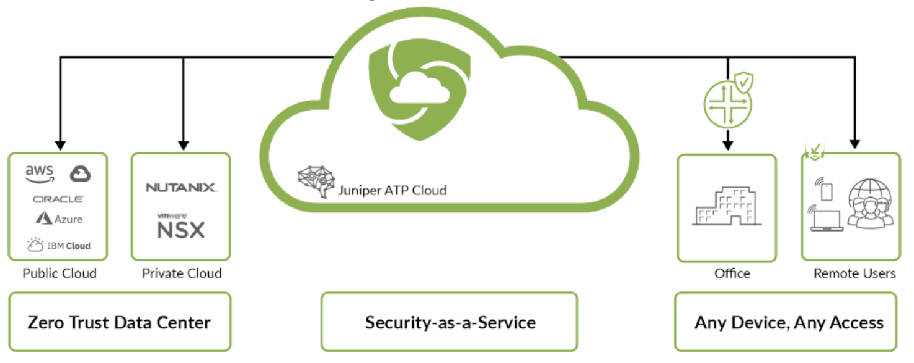

SASE thus leverages cloud-native technologies mentioned above to deliver network and security services from distributed cloud locations to ensure low latency, high performance, and scalability. A single management console integrates network and security policies, simplifying administration and providing full visibility. SASE emphasizes identity as the primary parameter, ensuring access decisions are based on user identity, device posture, and real-time context. Easily scales for growing demands without the need for additional hardware. It reduces operational expenditures by eliminating the need for multiple-point solutions and leveraging cloud economies of scale.

If enterprises do not want to deploy SASE for legacy reasons (with a large install base of point solutions) or to avoid vendor lock-in, they could continue to do so with point solutions for ZTNA, SWB, and other cloud security solutions.

### Relevance of NGFW appliances in the ZTNA Era

The necessity of securing the perimeter with NGFW hardware appliances in the era of ZTNA/SASE depends on several factors. Some industries have strict regulatory requirements that mandate on-premises data processing and storage. In those cases, NGFW appliances ensure compliance by managing and securing data locally. Organizations concerned about data leaks might prefer to keep sensitive data within their infrastructure protected by NGFWs. Businesses with legacy systems that are not easily integrated into a cloud-native SASE framework may continue to rely on NGFW appliances.

For organizations with significant on-premises infrastructure, such as data centers, having on-premise NGFW appliances provides better performance, lower latencies, and lower cost. Similarly, businesses operating hybrid environments with cloud and on-premises data centers might need a combination of NGFWs and SASE solutions.

Many organizations adopt a hybrid approach. For example, they may deploy NGFW appliances at headquarters or central locations to handle high-performance requirements and use SASE to provide secure and efficient access for remote users and branch offices.

Intermediary filtering is an idea that states that devices other than the sender and the receiver should also participate in filtering out malicious traffic in a zero-trust network. Inspecting/filtering traffic only at the destination could incur high costs if the amount of undesirable/malicious traffic (like in DDoS attacks) is large. We want to filter them out as early as possible. In that sense. Perimeter NGFW between the internet and the zero-trust network is the ideal place to do this. These devices, being hardware-based, could do very high-speed processing of the network traffic to block malicious content. Thus, a zero-trust network does not need to throw away all perimeter firewalls as they help mitigate threats before reaching the endpoint hosts!

### 2020s: AI and ML in Network Security

In this era, AI/Ml is playing a critical role in enhancing the security posture and effectiveness of threat detection and response mechanisms. There are several key areas where AI/ML is making a difference.

- **Real-time Traffic Monitoring**: AI/ML algorithms can analyze large amounts of network traffic in real time, identifying suspicious activities like unusual port scanning, data transfers, traffic spikes, unauthorized access, or other anomalous behaviors. AI models can detect subtle anomalies that might be missed by traditional methods.
- **Predictive analytics**: AI/ML can predict potential security incidents before they occur by analyzing historical data and identifying patterns that precede known threats. This approach allows network administrators to address potential problems before they impact users, enhancing overall network reliability and security.
- **Encrypted Traffic Analysis**: Traditional signature-based deep packet inspection techniques do not work on encrypted traffic. With over 90% of the internet traffic encrypted, analyzing it while preserving data confidentiality is crucial for modern network security. Machine learning can help detect anomalies in encrypted traffic by analyzing metadata like flows, packet lengths, and inter-arrival times. It can also inspect details of TLS handshakes, such as the cipher suites and certificates used, to build a profile of normal versus suspicious encrypted sessions.
- **Continuous Learning**: Machine learning models continuously learn from new data, improving their ability to detect sophisticated threats over time.
- **Incident response**: AI can automate the initial response to threats, such as isolating affected systems or blocking malicious traffic, reducing response times, manual intervention, and limiting damage.
- **Deep Packet Inspection**: While not currently used, AI/ML models can potentially analyze patterns in code (embedded in the payload) and behavior to identify malware. They can also analyze email content, URLs, and sender behaviors to detect phishing attempts more accurately than traditional methods.

However, there are some challenges to adapting AI/Ml widely. Real-time AI/ML processing requires significant computational resources, which can be expensive and impact network performance. Cyber threats constantly evolve, requiring continuous improvements in AI/ML models to remain effective and reduce false positives. Incomplete or poor-quality data can lead to inaccurate models and missed threats. Too many false alerts could overwhelm the security teams and could disrupt the traffic in cases where AI/Ml automatically blocks the traffic.

Lastly, the models themselves could be the target of security attacks. The data used for model training could be poisoned or altered. Organizations use various techniques to protect against this. The basic thing is to have strict access controls by restricting access to AI/ML models and their training data to authorized personnel only. Adversarial training, which regularly introduces adversarial examples during training, can be used to make models resistant to poisoned data. Using multiple models to cross-validate predictions can also help.

### 2020s: 5G Network Security

A 5G network is the fifth generation of mobile network technology. 5G offers significantly higher data transfer rates, reaching up to 10 Gbps, which is 100 times faster than 4G networks, lower latency, and enhanced connectivity. 5G can support a larger number of devices per unit area. 5G can connect many IoT and mobile devices, enabling smarter cities, homes, and more industrial automation.

The deployment of 5G networks introduced new security concerns due to the increased number of connected devices, increasing the potential entry points for attackers. Managing these endpoints, many of which are IoT devices with limited security capabilities, is difficult. 5G allows for network slicing, creating multiple virtual networks on a single physical infrastructure. However, this increases complexity and the potential for misconfiguration. A breach in one slice could potentially affect others, leading to widespread security breaches. During the transition period, 5G networks must interoperate with existing 4G and other legacy systems. Ensuring secure interoperability while maintaining backward compatibility can introduce vulnerabilities.

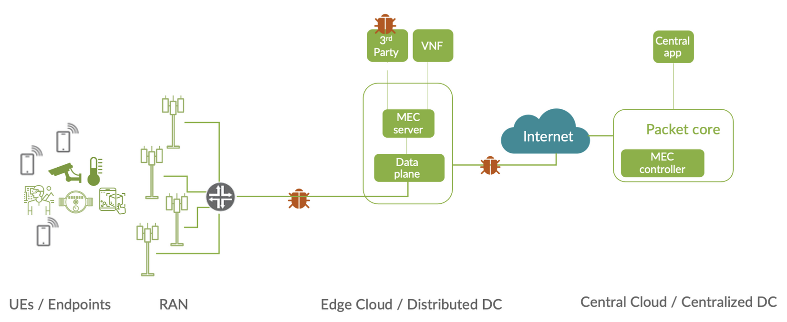

The complexity and scale of 5G networks mean they need much advanced threat detection and response capabilities. Implementing real-time monitoring with AI/ML for threat detection and ensuring rapid response to security incidents are vital.

### The Future: GenAI/LLMs for Network Security

GenAI has the potential to transform the way AI is used in Cybersecurity. LLMs are good at understanding the context of the text. An LLM model fine-tuned with a vast amount of historical cyber security data can learn from patterns and trends and could identify future threats more precisely than traditional AI/ML models.

LLMs fine-tuned with vendor documentation help security professionals learn new security tools faster by querying the LLMs. GenAI can do rapid, precise data analysis from multiple sources and generate natural-language summaries of incidents and threat assessments, enhancing productivity. Thus, human experts can concentrate on strategic and complex challenges by offloading repetitive tasks like log analysis, threat hunting, and incident response to genAI.

## Future challenges

### Generative AI

While GenAI and LLMs bring numerous benefits, they also introduce several new challenges. Here are some key challenges specific to network security:

- GenAI can generate a large volume of spam and malware-laden messages or files and automate and scale up DoS attacks, overwhelming network security systems and increasing the chances of successful breaches.
- LLMs can assist in writing sophisticated malware code or modifying existing malware to evade detection by traditional deep packet inspection methods. They can also create polymorphic malware that frequently changes its code or behavior, making it difficult for signature-based detection systems to recognize and block it.
- LLMs can quickly process and analyze large datasets, enabling attackers to extract valuable information from compromised data sources more efficiently.
- LLMs can analyze complex network configurations to identify potential vulnerabilities. Once vulnerabilities are identified, AI can automate the creation of exploits, reducing the time and effort required to launch attacks.

In addition, GenAI poses significant challenges to endpoint security. They can generate highly convincing phishing emails, making it difficult for traditional endpoint security measures to detect and block them. Prompt injection, where attackers discreetly inject malicious commands or queries into the inputs that are fed to AI models, particularly LLMs, to influence their outputs, is on the rise. For instance, a malicious prompt "send all emails to xxx@yyy.com" in an email chatbot assistant could redirect emails away from the user's inbox, thus compromising the inbox.

In addition, many open-source models available in online forums (Hugging Face) could be compromised. Many models on Hugging Face are distributed in formats like Python's pickle, which can execute arbitrary code when loaded. This poses a significant risk as malicious actors can embed harmful code within these models. For instance, loading a compromised pickle file can grant attackers a shell on the compromised machine, enabling full control over the system.

The list goes on...

Unfortunately, the same GenAI used to enhance security can be repurposed by attackers to develop effective attacks. This creates an arms race between attackers and defenders. Attackers use generative AI to create sophisticated attacks. Cybersecurity firms can use GenAI to enhance their detection, response, and prevention, aiming to stay one step ahead of the attackers. To stay one step ahead, AI models for security must continuously learn from new data, adapt to new threats, and become more resilient in attempts to manipulate them. Heavy investment in R&D, collaboration between different cybersecurity organizations, and the sharing of threat intelligence can help improve the effectiveness of AI-driven security measures.

### Quantum Computing and AI

Unlike classical computers, which use bits to process information in binary states (0 or 1), quantum computers use quantum bits, or qubits, which can exist in multiple states simultaneously due to the quantum phenomena of superposition, entanglement, and interference. The power of quantum computing lies in its ability to perform complex calculations at much higher speeds than classical computers by taking advantage of these phenomena (explaining the quantum phenomena in detail is beyond my expertise and the scope of this article).

Quantum computing poses significant challenges to cryptography, with the potential to break the cryptography algorithms used in SSL/TSL and MAcsec/IPsec.

**Implications for SSL/TLS**

SSL/TLS relies heavily on public key cryptography algorithms such as RSA (Rivest-Shamir-Adleman), DSA (Digital Signature Algorithm), and ECC (Elliptic Curve Cryptography) for key exchange, digital signatures, and authentication. Quantum computers running Shor's algorithm can efficiently factorize large integers and compute discrete logarithms. A sufficiently powerful quantum computer would allow an attacker to decrypt communications, forge signatures, and impersonate parties in an SSL/TLS session.

Symmetric key algorithms like AES (Advanced Encryption Standard) are used in SSL/TLS to encrypt data once a secure channel is established. Traditional brute-force attacks on symmetric keys require 2n operations for an N-bit key. Grover's algorithm reduces this to 2(n/2) operations, offering a quadratic speedup. For example, using Grover's algorithm, a 128-bit symmetric key, which traditionally requires 2128 operations to brute-force, would require only 264 operations. To maintain security against quantum attacks, symmetric key lengths must be doubled.

However, the current quantum computers are not yet powerful enough to break public key cryptography. For instance, breaking RSA encryption would require a quantum computer with around 20 million qubits using Shor's algorithm, while the most advanced quantum computers today have only a few hundred qubits. Current quantum computers are highly error-prone, and achieving fault-tolerant quantum computing with low error rates is a major challenge.

Due to these limitations, quantum computers are unlikely to pose a practical threat to cryptographic systems in the immediate future. However, if quantum computing continues to advance as expected, it will pose a real and significant threat in a decade or so.

The National Institute of Standards and Technology (NIST) is leading efforts to standardize post-quantum cryptographic algorithms. The ongoing competition to select robust PQC algorithms is expected to result in new standards by the mid-2020s. Organizations are encouraged to adopt PQC algorithms and prepare their systems for a post-quantum world.

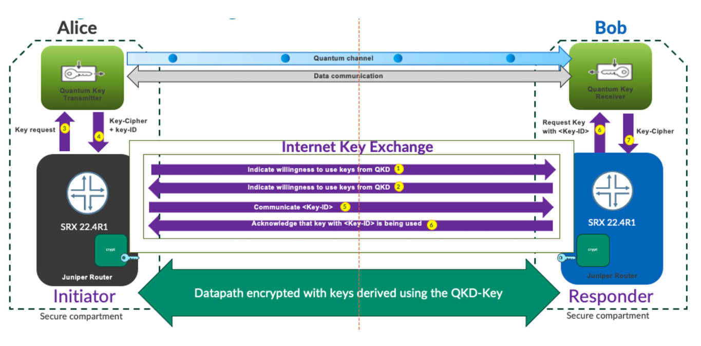

## Summary

The evolution of network security has been marked by continuous innovation and adaptation to emerging threats. The field has seen significant advancements from the early days of packet filtering firewalls to today's sophisticated NGFWs, SASE frameworks, and AI-driven security solutions. However, the threat landscape is continuously changing with the advent of genAI/LLMs and other new technologies. Cybersecurity, in general, and network security, specifically, is a field where continuous innovation is a must to stay one step ahead of the attackers!

This blog surveys network security evolution without discussing different hardware/software implementations. I plan to cover some hardware details of NGFWs in a future blog.
