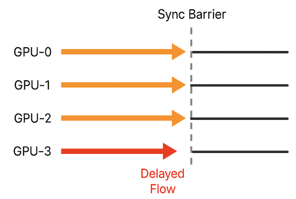
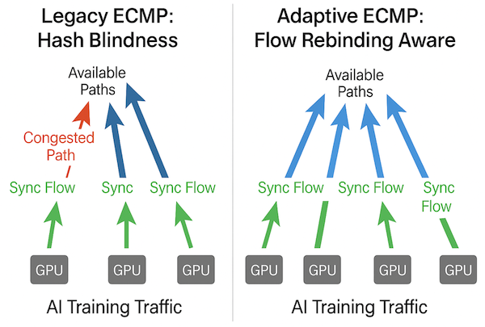
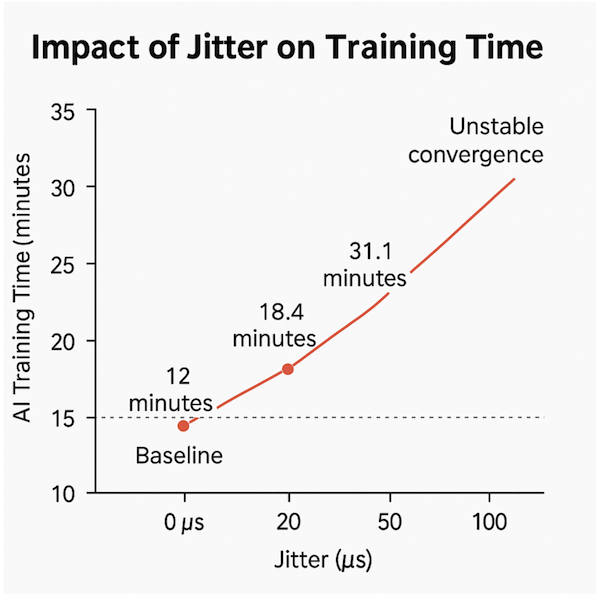
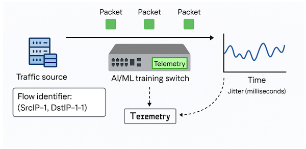
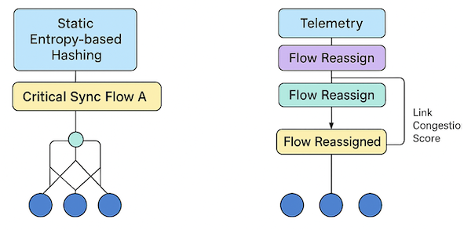
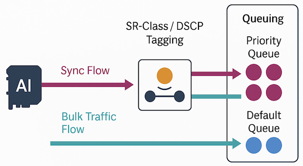
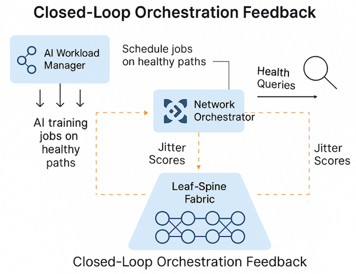

# The Hidden Cost of Jitter in AI/ML Training Fabrics

**Mohan Kumar M V - 06/05/2025**

And Why It Matters More Than You Think...

## Introduction: A Hidden Villain in AI Data Centers

In AI/ML training environments, speed isn't just a competitive advantage---it's survival. Companies invest millions into GPU clusters, expecting models to converge faster and deliver smarter results. Yet a silent villain often sabotages these ambitions: **jitter**.

Jitter in AI training is like a drummer playing off-beat during a synchronized orchestra---disruptive, costly, and increasingly intolerable.

Small, often invisible fluctuations in packet timing can trigger cascading slowdowns across tightly synchronized GPU workloads. In contrast to traditional web traffic, where a few milliseconds of delay go unnoticed, AI training frameworks like NCCL and AllReduce are extremely sensitive to micro-variances in flow timing.

This article presents field-proven observations, including lab simulations and telemetry instrumentation, to underscore the *operational and economic impact of jitter *--- and introduces real, product-supported strategies for making AI fabrics jitter-resilient by design.

## Why AI/ML Traffic Is Uniquely Sensitive to Jitter

Training workloads in AI/ML are tightly coupled and synchronized. When running models such as GPT-4 or diffusion transformers, GPUs across multiple nodes must synchronize at defined steps to exchange model gradients or tensors. Synchronization is enforced through collective communication primitives (e.g., **AllReduce**, **Broadcast**, **AllGather**).

These operations are highly susceptible to flow timing misalignments:

- A delay in one link causes all GPUs to stall.
- Latency variations across links introduce barriers in execution.
- Flow path stability becomes more important than just bandwidth.
- Even microsecond-level jitter is enough to destabilize collective sync windows, especially in large clusters (>256 GPUs).

This is why jitter, more than bandwidth, becomes the limiting factor for convergence time.

Each horizontal line represents a GPU involved in a collective sync. Most flows complete in time, but **GPU-3** suffers from a jitter spike, reaching the **Sync Barrier** late. As collective operations are blocking by nature, this delay causes all other GPUs to wait, leading to longer iteration times. This effect worsens as cluster size increases.

## Why Classical Networking Fails AI Workloads?

Legacy data center networks were engineered for transactional workloads:

- Microservice traffic
- Web replication and distributed databases
- High oversubscription and stat-mux tolerance

These fabrics assumed traffic would be:

- Bursty and elastic
- Resilient to small delays
- Easily absorbed by ECMP and standard QoS

AI training workloads break these assumptions. They are:

- Synchronized and deterministic
- Long-lived and high-throughput
- Sensitive to even microsecond-level timing misalignments

Here's where traditional networking falls short:

**1. Hash-Based ECMP Is Blind to Flow Criticality**

- ECMP distributes traffic based on static header hashes. Critical synchronization flows can be hashed to congested or unstable paths, introducing asymmetric timing across GPUs.
- For example, with 2,048 NCCL flows and 32 ECMP members, hash collisions can cause jitter concentration.

Figure 2 below illustrates this problem: legacy ECMP blindly hashes multiple high-priority AI sync flows onto one congested path, while other paths remain underutilized. The resulting imbalance introduces jitter and delays that go unnoticed by traditional load balancers.

ECMP hash-based distributioncauses multiple critical sync flows to land on a single congested path, while others are underutilized. This blind hash collision creates asymmetric delays and exacerbates jitter without visibility or correction.

**2. Static Buffering and Queue Policies**

- Shallow buffers can't absorb GPU burst synchronizations.
- Standard QoS treats AI sync flows like background data.

**3. No Per-Flow Timing Visibility**

- Legacy telemetry (e.g., SNMP) reports averages and totals, not per-flow jitter.
- AI-centric delay patterns go undetected.

**4. Jitter Is Not a Tracked Metric**

- Utilization and drops are tracked; timing variability is not.
- Fabrics lack internal mechanisms to detect or react to jitter.

**5. No Flow-Aware Queue Scheduling**

- AI flows are not isolated by default.
- Without tagging or orchestration hints, critical flows contend with bulk data.

Result: AI workloads run blind, with no visibility into timing delays or recourse to correct jitter-related impairments.

## Jitter has a Real Business Cost

AI infrastructure cost is measured in **GPU hours per training cycle**. Jitter amplifies cost by extending these cycles:

- Each additional 10% delay in training increases GPU usage nonlinearly.
- Cloud GPU billing at scale (e.g., 512 x A100s) can exceed $20K/day.
- Even a 3--5% jitter-induced delay can lead to thousands of dollars in waste per run.

For reference, OpenAI's GPT-3 consumed **355 GPU-years**. A conservative 5% delay equates to **~18 GPU-years, **a non-trivial financial and environmental cost.

While exact cost metrics vary by workload, even microsecond-scale jitter can nonlinearly increase model iteration time. In many customer environments, AI clusters run at hyperscale (hundreds of GPUs), where each minute of training matters. A seemingly small timing misalignment can translate into thousands of dollars in additional GPU billing, longer time-to-market, and significantly higher energy use.

Real-world benchmarking has shown that even **20--50us of jitter, **when left uncorrected, can lead to **30--60% increases in training duration**, depending on the collective operation and topology skew. This delay stems not from packet loss or congestion, but from a lack of **timing determinism**, which is invisible to most legacy tools.

## Real-World Impact of Microsecond Jitter

### Quantifying Jitter's Effect on AI Training Efficiency

Measurements were made using a controlled lab environment simulating NCCL AllReduce workloads over a 32-GPU training cluster. To emulate flow skew due to ECMP collisions, the Linux tc netem utility was used to inject controlled jitter values (20--100mus) onto selected paths.

- Baseline (0mus jitter): Training completed 100 iterations in 12 minutes
- 20mus jitter -> Training time increased to 18.4 minutes
- 50mus jitter -> Extended further to 31.1 minutes
- 100mus jitter -> Led to unstable convergence and training stalls

Unlike traditional packet loss or congestion, these delays stem purely from *microsecond-scale timing misalignments*. The cost arises from collective sync barriers, where a single delayed flow stalls all participating GPUs---leading to nonlinear slowdowns.

This experiment highlights how invisible timing variation, when undetected by standard telemetry tools, becomes a critical hidden bottleneck in large-scale AI fabrics.

Instrumentation Tools:

- **Jitter Injection**: tc netem for fine-grained flow perturbation
- **Training Metrics**: NCCL AllReduce logs across synchronized GPU rings
- **Telemetry Monitoring**: Juniper JTI with OpenConfig sensors on interface counters and delay markers

## Emerging Design Strategies for Jitter-Aware Fabrics

As AI/ML clusters grow and importance, modern data center fabrics must evolve beyond bandwidth-centric optimization to jitter-aware architecture. Below are practical, field-aligned strategies that leading infrastructure teams---and Juniper itself---are deploying:

### Real-Time Jitter Telemetry via OpenConfig and JTI

While most fabrics don't export per-flow jitter natively, Juniper's JTI stack with OpenConfig can be extended to infer jitter indirectly by:

- Tracking microburst-induced delay spikes in interface counters
- Correlating per-path counters with packet inter-arrival variance
- Using histogram or distribution-based metrics for inter-packet timing

This offers a product-aligned competitive advantage---supporting next-gen observability through custom sensors and gNMI extensions.

A modern jitter-aware telemetry stack segments flows tracks microburst delays, and dynamically adjusts queue forwarding logic to isolate AI synchronization traffic.

### Entropy-Aware ECMP and Flow Rebinding

Legacy ECMP relies on deterministic hash functions, which blindly map flows without regard for link congestion or jitter. Modern fabrics can minimize timing skew and collisions using:

- Entropy Injection -- Vary packet header fields (e.g., UDP src ports, VLAN tags) to influence ECMP path selection.
- Flow Hashing Telemetry -- Monitor flow-to-path assignments and detect persistent hash collisions using live counters.
- Dynamic Rebinding Agents -- Use real-time telemetry to migrate high-priority sync flows away from jitter-heavy paths

Entropy-aware ECMPuses real-time telemetry inputs to score link health and dynamically rebind AI sync flows away from jitter-heavy paths. Flow rebinding logic operates inline or via a controller, avoiding blind hash collisions and stabilizing GPU synchronization.

Frameworks like **Juniper Apstra** can enforce this logic through declarative intent and gNMI-based policy feedback loops.

### Queue Isolation for Synchronization Flows

In tightly synchronized AI training, even brief queuing delays can break iteration timing. One effective strategy is to **isolate sync traffic** in low-jitter queues using QoS tagging.

By tagging collective sync traffic (e.g., via DSCP or SR-Class), fabrics can:

- Allocate latency-critical flows to dedicated low-latency queues
- Avoid FIFO queue contention with bulk or background traffic
- Dynamically adjust queue thresholds or shaping based on real-time AI job metadata

Emerging fabrics allow **per-job tagging policies **to be automatically propagated from AI orchestration layers (e.g., Slurm, Kubernetes, DeepSpeed) into the data plane---ensuring each model run gets the right priority treatment.

Queue isolation separates critical AI sync flows from bulk traffic using QoS tags. Low-latency queues help preserve deterministic timing, minimizing jitter-induced delays across the training fabric.

### Network-Aware AI Training Orchestration

In traditional architectures, AI job schedulers operate independently of the network fabric. But in jitter-sensitive environments, orchestration platforms must become **network-aware** to avoid unstable or degraded links.

Modern AI stacks can integrate with telemetry platforms to:

- **Query fabric health in real-time** using gNMI or JTI APIs
- **Schedule training jobs** only across healthy leaf-spine segments
- **Trigger job migration or rescheduling** when jitter thresholds are exceeded

Frameworks like **Apstra**, **Slurm**, or **Kubernetes** can be extended to form a closed-loop feedback system, where job placement is influenced by real-time path health metrics.

A closed-loop pipeline enables AI job orchestrators to query telemetry, assess path health, and steer training workloads away from jitter-prone regions in the network fabric. Telemetry data flows from switches to collectors, where path health scoring occurs. AI workload managers then adjust job scheduling in real-time, ensuring training pipelines remain synchronized and resilient.

This not only improves job completion predictability but also helps avoid costly stalls caused by sync delay amplification.

Key Stages in the Diagram (Figure 7):

1. **Switch Fabric Streams Telemetry**: Real-time path health metrics (jitter, queue depth, latency) are exported via gNMI/JTI.
2. **Telemetry Collector Aggregates and Scores Data**: Path health scores are computed per link or ECMP path using defined thresholds.
3. **AI Orchestrator Consumes Path Health Metrics**: Systems like Slurm or Kubernetes query telemetry or subscribe to streaming updates.
4. **Job Scheduler Applies Placement Logic**: Training jobs are scheduled or rescheduled only across healthy paths.
5. **Feedback Loop Reacts Dynamically**: If jitter increases mid-job, workloads may be migrated or paused to avoid sync barriers.

## Final Thoughts and Next Steps

The impact of jitter on AI/ML training is no longer theoretical, it's measurable, material, and increasingly unavoidable as cluster sizes grow and convergence targets tighten. The traditional focus on throughput and utilization is not enough. **Timing determinism** must become a design objective, not an afterthought.

Organizations building or operating GPU fabrics should now consider:

- Instrumenting jitter-aware telemetry using OpenConfig and JTI extensions
- Prioritizing synchronization flows with explicit tagging and queue design
- Enabling orchestration-to-network coordination via APIs and policy frameworks like Apstra

The next frontier in AI infrastructure isn't just faster---it's smarter, more adaptive, and built for synchronized precision.
If you're architecting AI networks, ask not just "How fast is my fabric?" but "How consistently does it behave under synchronization pressure?

Author Comments: This article was inspired by real-world debugging efforts in AI training fabrics where invisible jitter effects delayed time-to-model convergence. The need for synchronized GPU communication has elevated jitter from a secondary metric to a critical performance factor.

## Glossary

- AllReduce / AllGather / Broadcast: Collective communication primitives used to synchronize data across multiple GPUs.
- ECMP (Equal-Cost Multipath Routing): A routing strategy that spreads traffic across multiple equal-cost paths using hash-based algorithms.
- Jitter: Variation in packet arrival time, which can disrupt tightly synchronized operations like AI model training.
- Sync Barrier: A synchronization point where all processes must arrive before continuing.
- DSCP / SR-Clas Network-level tagging mechanisms used to assign priority levels or service classes to packets.
- gNMI / JTI (Juniper Telemetry Interface) --: Protocols and frameworks for streaming telemetry data from network devices.
- Slurm / Kubernetes / Apstra: Orchestration and infrastructure policy engines used to manage AI workloads and coordinate job scheduling.
- Entropy Injection: Technique to modify header fields in packets to influence ECMP path selection.
- Dynamic Flow Rebinding: Rerouting active flows in real-time based on current network conditions.
- Telemetry Collector: A system that gathers and processes network performance data for analysis or decision-making.

## Useful links

- [Juniper Apstra for AI Networking](https://www.juniper.net/documentation/product/us/en/apstra/)
- [Broadcom Tomahawk 5 Product Brief](https://www.broadcom.com/products/ethernet-connectivity/switching/strataxgs/bcm78900-series)
- [OpenConfig Telemetry Model Reference](https://github.com/openconfig/public)
- [NVIDIA NCCL Documentation](https://docs.nvidia.com/deeplearning/nccl/user-guide/docs/index.html)
- [OpenConfig gNMI Specification](https://github.com/openconfig/gnmi)
- [Linux tc netem Tool (Jitter Injection)](https://man7.org/linux/man-pages/man8/tc-netem.8.html)

## Acknowledgements

Special thanks to the Kiran K.L, Suraj Sharma, Yong Han (yhan@juniper.net) and PLM teams who helped expose hidden performance bottlenecks during AI fabric validation efforts. Their field insights were instrumental in identifying the critical role of jitter in AI training throughput.
