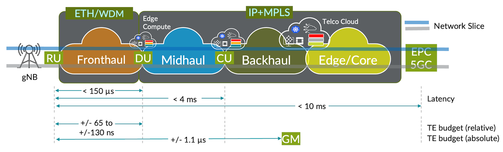

# Time Synchronization and Class D Clocks Support

**Rafik P - 06/20/2023**

Timing and synchronization requirements and capabilities are continually evolved to drive the ultra-low latency, mission critical and advanced radio applications for 5G and beyond. Satisfying the new enhanced ITU-T and other standards for time accuracy in network equipment requires careful planning of the timing architecture.

## Introduction

As the timing synchronization technologies have evolved beyond 5G, synchronization requirements are becoming tighter and harder to achieve, creating the need for accurate and reliable synchronization solutions across the network. There are a lot of adaptation and requirements for time and sync from ITU-T standards apart from the IEEE 1588 v2. Timing and synchronization in the 5G context involve Physical Layer Synchronous Ethernet (Sync-E) and IEEE 1588 Precision Timing Protocol (PTP) when full path timing profile deployment exercised (ITU-T G.8275.1 profile). Sync-E (ITU-T G.8262 and ITU-T G.8264) is a physical layer technology that functions regardless of the network load and supports hop-by-hop frequency transfer, where all nodes on the trail must support Synchronous Ethernet.

Juniper routing platforms capable of supporting various end sync-applications because of specialized hardware including PHY/MAC timestamping, high stratum OCXO, Advanced EEC PLL (phase locked loops) and our in-house timing software with great flexibility to support any profiles across the vertical with max number of client support. There are many timing applications emerging based on the end applications, but these are few target applications.

- Mobile backhauls (4G and 5G, NGFI) -- ITU-T standards based.
- Financial applications (HFT and Stock exchanges) -- IETF standards based.
- Cable applications (RPD and DOCSIS) -- Cable lab specification
- IP video broadcasting (SDI to Ethernet) -- SMPTE standards based.
- Power Profiles (IEEE standard)

Time is so universal that everyone in this world can understand the importance of time keeping. Synchronization is related to timekeeping. Time synchronization plays a pivotal role in almost every walk of modern communications, especially in mobile backhaul applications. And now, with the advent of 5G, synchronization requirements are much more stringent and more widely spread. We also witness tightening of O-RAN synchronization as we move beyond 5G and other time sensitive applications, both our hardware and software need to meet this stringent synchronization accuracy like 5nsec for system level and 1nsec for silicon level accuracy.

Juniper is heavily invested for over more than a decade in the development of high-performance timing and synchronization solution across our routing portfolio. The in-house timing servo stack has capability to support multiple timing profiles with better holdover performance, jitter/wander compliance and meeting the G.8273.2 Class D specifications.

Table: Timing synchronization requirements

| Network Segment | Required Synchronization Accuracy | Juniper in house timing Stack + Silicon |
|:--|:--|:--|
| Fronthaul | Nanoseconds | Nanoseconds |
| Backhaul/Midhaul | Sub-Microseconds | Nanoseconds |
| Edge | Sub-Microseconds | Nanoseconds |
| Metro aggregation/Core | Sub-Microseconds | Nanoseconds |
| Data Center | Sub-Milliseconds | 10s of nanoseconds |

## Juniper FPGA

- FPGA based PTP packet acceleration logic -- supports 512 PTP clients without compromising the packet rate of 128PPS.
- Servo and time-stamping engine is built onto Juniper Custom PTP-FPGA, Juniper owns the entire PTP stack and servo without dependency on any external vendors.
- Flexible to support any timing profiles without depending on the external vendors capability.
- Capable to support different PTP packet transports at the same time.
- Greater flexibility to switch and operate between the different clock domains internally (OCXO, Sync-E, BITS, GPS etc.).
- Independent phase and frequency plane as defined in ITU-T G.8273.2 standard.
- One step timestamping as master clock irrespective of packet rate and number of PTP clients configured.
- Supports both one-step and two-step slave clocks.

Juniper routing devices can support our proprietary Enhanced Profiles for greater flexibility of VLAN Tags, Parameters & PTP-over-E/IPv4 Interworking and flexible HW and SW can support multiple profiles i.e., ITU-T, IEEE, IETF and SMPTE. When it comes to high precision phase synchronization, there are different timing profiles defined by the ITU-T SG15/Q13 standards body. The two standards profiles for phase synchronization are:

- 8275.1 -- Full-path Timing Support (FTS) profiles.
- 8275.2 -- Partial-path Timing Support (PTS) and Assisted Partial-path Timing Support (A-PTS) profiles.

Both profiles are defined based on IEEE 1588 (precision time protocol -- PTP) standard. Similarly, in case of frequency synchronization over packet networks, there are few standards defined:

- 8265.1 -- Frequency synchronization using PTP protocol
- 8262 -- Physical layer clock synchronization using Synchronous Ethernet
- 8262.1 -- Physical layer clock synchronization using Enhanced Synchronous Ethernet

### Juniper unique profile and features

Table: Advantages of  G.8275.1 Enhanced Profile*

| Standard-based G.8275.1 Profile | Juniper's Unique G.8275.1 Enhanced Profile |
|:--|:--|
| Allows only PTPoE multicast transport | Allows both PTPoE multicast and PTPoE unicast profile |
| VLANs are not allowed | Up to two VLAN tags are allowed |
| No fixed port roles allowed (no slave-only ports) | Allows slave-only ports or fixed-port roles for Slave port |
| Restricted domain numbers only can be used | Allows to configure any domain number |
| Allows to talk only PTPoE GM/Master | Allows to talk both PTPoE and PTPoIPv4 GM/Masters same time |
| Not possible to use transport boundariesbetween PTPoIPv4 and PTPoE | Nicely works in transport boundaries betweenPTPoIPv4 and PTPoE |

The ITU-T has recently updated the revision of G.8273.2 specifications, the recommendation describing the performance standards for boundary clocks in the network. The revision adds more accuracy to Class D specifications. For Class D, the maximum time error measured through a first-order low-pass filter with a bandwidth of 0.1 Hz, max|TEL|

Table: Maximum absolute time error low-pass filtered

| T-BC/T-TSC Class | Maximum absolute time error -- max ; TEL ; (ns) |
|:--|:--|
| Class D | 5ns |

The noise generation is divided into two components, the cTE and the dTE noise generation.

To design a system with all the calibration techniques to correctly manage the cTE and dTE and identify the potential source of cTE error due to various parameters and minimize the delays introduced by any system components and correct them with a calibration technique at the system level

Table: Class of devices as per ITU-T G.8273.2 standard

| Clock Types as per G.8271.1 and G.8273.2 |
|:--|
| Class A |
| max|TEL| of 100nscTE of +/- 50nsdTELof 40nsdTEHof 70ns |

> tbc*: latest ITU T draft mentions these items as "for further study".

Our next generation Cloud Metro platform, ACX7000, exceeds the next-generation 5G radio requirements including synchronization and offers full ITU-T G.8273.2 T-BC/T-TSC class D compliance. This provides better accuracy for the mission critical and sensitive applications across the segment. We have tested and deployed various timing applications using Juniper products across the globe and our hardware and software fungible enough to customize the profiles to meet the end applications.

Juniper platforms supporting Class D:

- ACX710
- ACX7024
- ACX7100-48L
- ACX7100-32C
- ACX7509

Timing and Synchronization requirements and capabilities are continually evolved to drive the ultra-low latency, mission critical and advanced radio applications for 5G and beyond. Satisfying the new enhanced ITU-T and other standards for time accuracy in network equipment requires careful planning of the timing architecture.

## Glossary

- A-PTS: Assisted Partial-path Timing Support
- BITS: Building Integrated Timing Supply equipment
- cTE: Constant Time Error
- CU: 5G Central Unit
- dTE: Dynamic Time Error
- DU: 5G Distributed Unit
- FPGA: Field-Programmable Gate Array
- FTS: Full-path Timing Support
- GM: (Telecom) Grand Master
- GPS: Global Positioning System
- max|TEL| : Maximum absolute time error
- O-RAN: Open Radio Access Network
- OCXO:  Oven-Controlled CRystal Oscillator
- PLL: Phase Locked Loop
- PTP: IEEE 1588 Precision Timing Protocol
- PTS: Partial-path Timing Support
- RU: 5G Radio Unit
- SMPTE: Society of Motion Picture and Television Engineers
- Sync-E: Physical Layer Synchronous Ethernet
- T-BC: Telecom Boundary Clock
- TEL: Time Error Low-pass filtered
- T-TSC: Telecom Time Slave Clock

## Acknowledgments

Thanks to Kamatchi Gopalakrishnan

### Reference

- ITU-T G.8273.2/Y.1368.2: [https://www.itu.int/rec/T-REC-G.8273.2/en](https://www.itu.int/rec/T-REC-G.8273.2/en)
