# To Spray or Not to Spray

**Dmitry Shokarev - 11/21/2023**

## Introduction

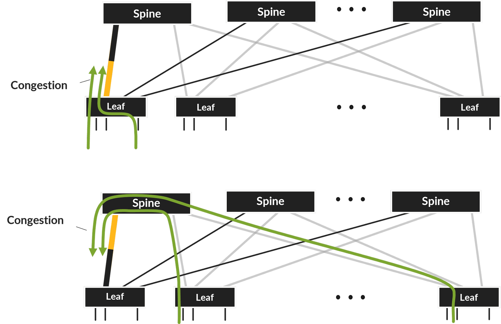

Every networking vendor acknowledges this problem and tries to find a solution. Various techniques to redistribute flows away from congested paths are proposed by vendors: Dynamic Load Balancing / Global Load Balancing from Broadcom or Adaptive Load Balancing from Juniper.

Fully scheduled fabrics with random packet or cell-based spraying over fabric links and re-ordering in the fabric were recently proposed by at least two vendors -- but the technique is proprietary, adds latency, and it is quite expensive. Re-ordering inside the fabric requires buffering, associated scheduler data structures also increase in size. As a result, more chip area is needed, and that has cost, port density and power consumption implications at a high fabric scale (tens of thousands of ports).

Is there a better choice? Packet **spraying** inside the fabric is by far the best option -- this way parallel paths can be utilized very efficiently. But can we avoid expensive **re-ordering** inside the fabric without causing adverse impact to the applications?

To answer the question, we need to step back and investigate the actual GPU workloads.

## GPU Workloads

We will use open source [Nvidia Collective Communications Library (NCCL)](https://github.com/NVIDIA/nccl/tree/master/src) for the investigation, with the focus on the InfiniBand / RoCEv2 transport.

### What do GPUs send to each over?

Well, they transfer data from random access memory of one GPU to random access memory of another.

Technically, training applications do not care in which order the data is written into memory -- whether the last byte shows up in memory first or the first byte shows up last. As long as the notification of the successful transmission is delivered after **all bytes** are transferred, the application performs fine.

The operation is schematically shown below, the application only initiates the transfer or receives the completion notification, and the NICs pull data from memory or write into memory using Direct Memory Access (DMA) -- GPU memory can be accessed randomly from the NIC.

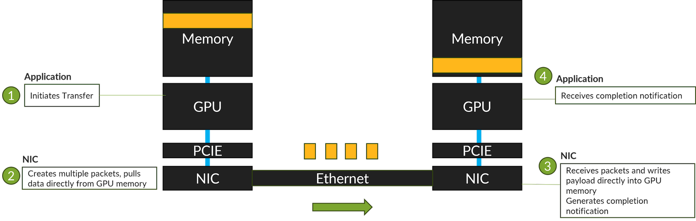

The application itself does not require in-order delivery of packets, but it must be notified when transfer completes.

### How does it work in reality?

NCCL uses InfiniBand Reliable Connected transport service. This service is connection-oriented, the packet delivery is acknowledged by the sender, and (the most troubling of all), the order of packets on the wire is **strictly maintained** -- RoCEv2 specification explicitly mandates mapping of the connections to a single IP flow for this reason.

**This is why we have a low entropy problem.**

## Solution to the Low Entropy Problem

Can we as an industry change the standard, and modify the transport semantics to enable out of order delivery? The solution was actually [proposed](https://people.eecs.berkeley.edu/~apanda/assets/papers/sigcomm18-irn.pdf) by a group of academic researchers plus Mellanox engineers (Mellanox was later acquired by Nvidia). Eventually it will be solved at the standard level and Juniper will support these efforts.

But in the interim, before the new standard is established, it is possible to use a NIC that implements refined out-of-order reception and retransmission logic, for example, Nvidia Connect-X 5, Connect 6 DX and above for Adaptive Routing with Ethernet. Fabric switches can spray supported packet types to achieve uniform fabric links utilization, highest transfer rate possible and shorter job completion times.

This is how it works:

NCCL uses two flavors of the InfiniBand "verbs" or operations for transfer:

- **RDMA_WRITE** -- transfer from the memory of the source to the destination. The transaction is initiated at the source.
- **RDMA_WRITE_WITH_IMM**. Same as above, but also notifies the destination about the transfer completion with so called "Immediate Data". This operation is used for the last memory transfer transaction in series.

The remote memory write operation supports transfer of up to 2GB of data. The actual transfer happens in smaller fragments that are less than or equal to the maximum transmission unit size, usually 4KB.

Normally, the transfer is split between series of packets (fragments) of four different types:

- **RDMA WRITE First**. This is the first fragment. It contains the RDMA Extended Transport Header that carries the remote memory address and the length of the data. The header is followed by the data payload. The NIC stores address information in its local state and uses it for subsequent fragments.
- **RDMA WRITE Middle**. Represents middle fragments. There is only data payload.
- **RDMA WRITE Last**. Represents the last fragment of the transfer. There is only data payload in the fragment.
- **RDMA WRITE Last with Immediate**. Represents the last fragment of the transfer. Includes the data payload and the immediate data.

NICs do not support out-of-order reception of the packets above -- this would require expensive buffering of the payload in the NIC. For example, if the middle fragment is received first, the NIC would have to keep this packet in the NIC memory until the first fragment arrives -- megabytes of data must be stored in the NIC, and this is clearly not feasible.

However, the Connect X 5 NIC from Nvidia starts to operate very differently if Nvidia Adaptive Routing is [enabled](https://enterprise-support.nvidia.com/s/article/How-To-Configure-Adaptive-Routing-and-Self-Healing-Networking-New) or lossy accelerations are [enabled](https://mellanox.my.site.com/mellanoxcommunity/s/article/How-to-Enable-Disable-Lossy-RoCE-Accelerations).

Every **RDMA WRITE** request is now mapped to one or more RDMA operations of a single type: **RDMA WRITE Only**. This operation has RDMA Extended Transport Header embedded into each packet, and this allows the NIC to write data directly into the GPU memory upon reception of any packet and carry minimal extra state inside the NIC memory to detect the packet loss.

Note, apparently, Nvidia NICs implement this behavior for **RDMA_WRITE**, but not for **RDMA_WRITE_WITH_IMM**. This is why NCCL also has a special setting to enable [Adaptive Routing](https://docs.nvidia.com/deeplearning/nccl/user-guide/docs/env.html#nccl-ib-adaptive-routing) (disabled on Ethernet transports by default). In this mode of operation, NCCL uses **RDMA_WRITE** verb for the data payload, if data length exceeds certain limit, followed up by a zero-length **RDMA_WRITE_WITH_IMM** verb that triggers completion notification.

And the NIC takes care of the ordered delivery of the notification towards the receiving application.

At this point it looks like the NIC can handle out of order packets -- this means **we may** spray them in transit.

## Let's Validate It

In this section, we will present spraying validation results with shipping Nvidia Connect X 6 DX NICs, that support out of order RoCEv2 Reliable Connected transport service packet processing. This NVidia extension is called "Adaptive Routing".

In summary, spraying works even in case of heavy re-ordering in the Ethernet fabric.

Let's first define where and how re-ordering can occur and what level of re-ordering can we expect in production.

### What kind of the re-ordering can we expect?

The figure below shows the concept of the packet spraying solution -- packets take different paths through the fabric and the path selection is done at the leaf randomly, packet by packet.

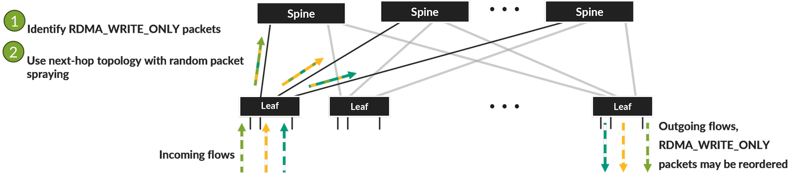

Packets of the same flow are directed into different queues, where some other packets may reside. As a result, some packets may stay longer in the fabric and subsequent packets may reach the endpoint earlier, breaking the order.

The diagram below shows one example, where packet is delayed because of some other packet in the spine port queue -- re-ordering in the flow occurs as a result.

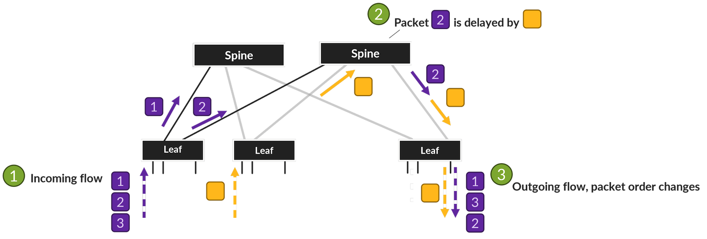

Load balancing is random, therefore over longer periods of time all the paths in the system are loaded evenly, but several packets may accidentally take the same path during a very short period (microseconds). The number of packets that may be directed to the same queue is a function of the incoming and outgoing port count:

- At the leaf device there are typically 16 or 32 GPU ports sending traffic to 16 or 32 uplinks.
- In the 3-stage CLOS network, many leaf devices (typically from 32 to 64) may pick the same spine device causing congestion towards target leaf.

While it is possible to mathematically find out the number of packets that may show up on a given uplink with certain confidence, it is fair to assume that this number is a fraction of the incoming port count.

Our main focus are out of order packets, or packets with lower sequences number arriving after packets with higher sequence number.

In this test, we initially verified the scenario where packets arriving out of order are separated by 1 to 20 other packets of the same flow. Two more tests verified scenario where sequential out of order packets were separated by more than 200 and 400 packets.

The capture below shows the case where the distance (in packets) between two subsequent unordered packets is 18.

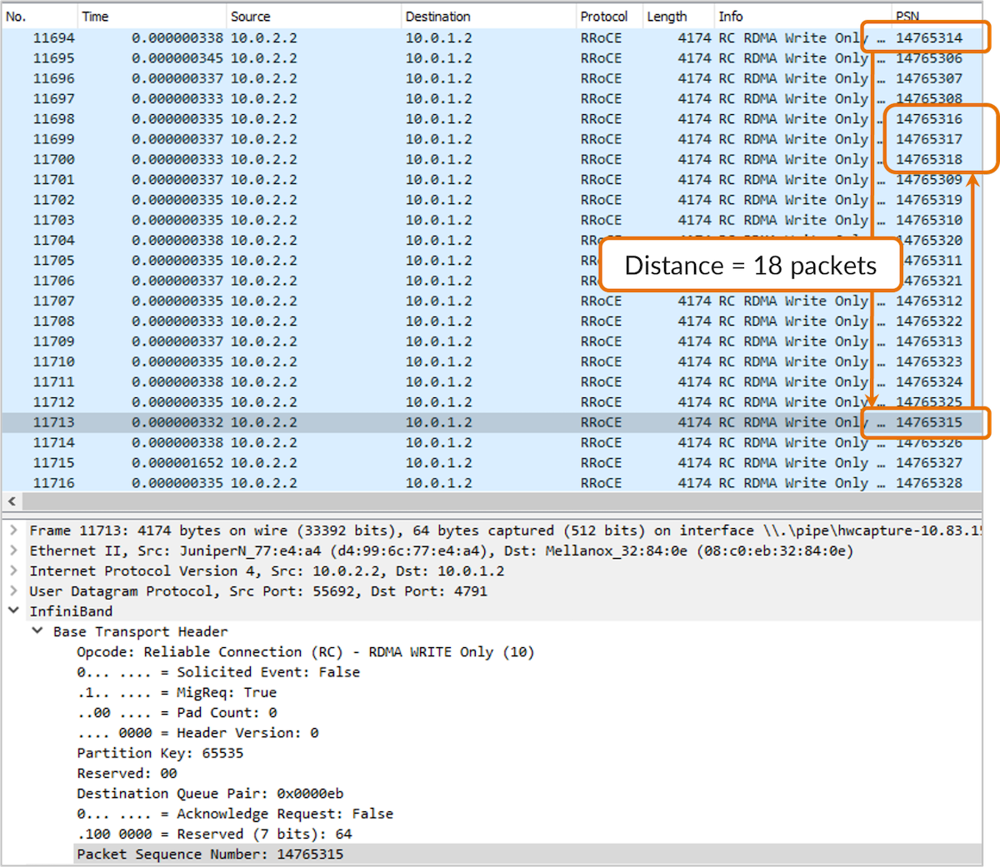

The distance between the unordered packets is a good measure of re-ordering.

The following plot shows the distance distribution of the packets we used in the test, it is shown as percentage of total packet count.

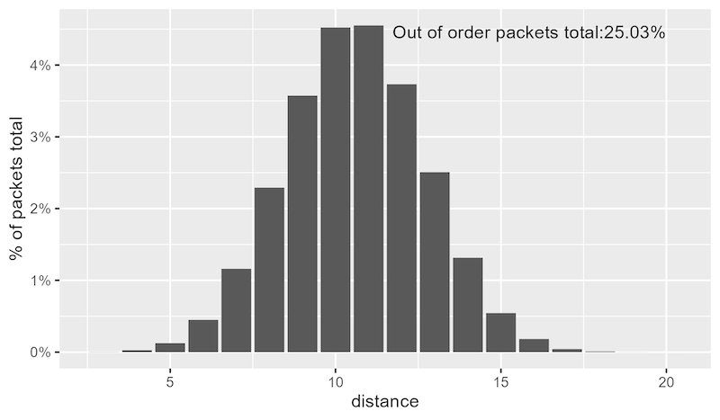

The bell-shaped curve in the middle is not intentional -- this is a property of the test bed. In this test, 25.03% of the packets in this test scenario arrived to the target NIC out of order.

How did we achieve this? We were using the most versatile router on the planet: Juniper Networks MX.

### Juniper MX Router for the Packet Re-order Emulation

Juniper MX supports a large variety of the use cases: residential and business edge services, metro, enterprise routing, Virtual Private Cloud routing just to name a few. In the AI/ML context, we demonstrated in-network aggregation support on MX too. But in this test, we use MX in an usual role: configurable packet re-ordering device.

Note, our actual AI/ML fabric design is based on PTX routers and QFX switches.

The diagram below shows the traffic flow through the router (from right to left).

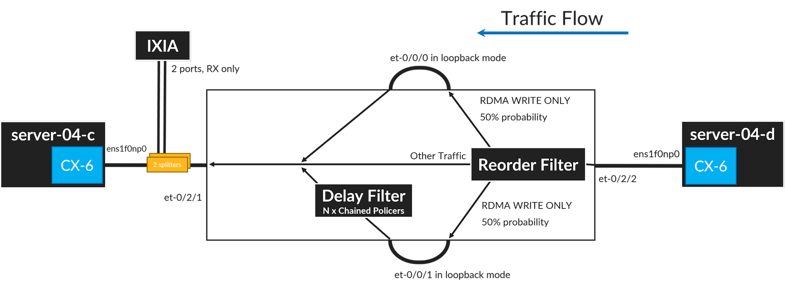

Packet re-ordering is emulated using the following technique:

- **RDMA_WRITE_ONLY** packets are separated into two groups: packets following normal (short delay) path and packets following longer path. Paths are taken randomly, with the same 50% probability. Other non-RDMA_WRITE_ONLY packets are sent over a 3rd (direct) path.
- Extra delays on one of the paths are implemented by chaining 8 policer instructions in a filter. This adds several microseconds to the packet processing time. Very high policing rate is chosen to avoid any drops -- the policer has no effect on packet processing except the delay added. By changing the number of policers in a chain we can manipulate the distance distribution.

Besides the fabric re-ordering emulation device, we also need the actual NIC and the server.

### The NIC and the server

We used Nvidia Connect X 6 DX NIC for our tests connected to the emulated fabric through 100GE interfaces. RoCEv2 Adaptive Routing functionality requires firmware versions higher than or equal to 22, hence we picked the NIC supported by this firmware.

Here is the list of the hardware used:

- Connect X 6 DX NIC ( P/N MCX623106AC-CDA_Ax), firmware version 22.38.1900.
- Supermicro Server, with Intel(R) Xeon(R) CPU E5-2670 v3 @ 2.30GHz, Ubuntu 22.04.3 LTS.

### Test Results

The tests were performed using **ib_write_bw** utility from the perftest package. The tool reports throughput in gigabits. Note that specific processor core was picked to ensure that the processor and the NIC are on the same NUMA node.

Here is the sample output :

```
root@rtme-server04-d:/home/regress# taskset -c 12  ib_write_bw -d mlx5_0 -i 1 10.0.1.2 -F --perform_warm_up --report_gbits -D 600
--------------------------------------------------------------------------
                    RDMA_Write BW Test
 Dual-port       : OFF          Device         : mlx5_0
 Number of qps   : 1            Transport type : IB
 Connection type : RC           Using SRQ      : OFF
 PCIe relax order: ON
 ibv_wr* API     : ON
 TX depth        : 128
 CQ Moderation   : 1
 Mtu             : 4096[B]
 Link type       : Ethernet
 GID index       : 3
 Max inline data : 0[B]
 rdma_cm QPs     : OFF
 Data ex. method : Ethernet
--------------------------------------------------------------------------
 local address: LID 0000 QPN 0x0121 PSN 0xc97e49 RKey 0x202f00 VAddr 0x007ff87e05f000
 GID: 00:00:00:00:00:00:00:00:00:00:255:255:10:00:02:02
 remote address: LID 0000 QPN 0x011f PSN 0xf1eb2 RKey 0x202f00 VAddr 0x007f4dcc873000
 GID: 00:00:00:00:00:00:00:00:00:00:255:255:10:00:01:02
--------------------------------------------------------------------------
 #bytes  #iterations BW peak[Gb/sec]    BW average[Gb/sec]   MsgRate[Mpps]
 65536   55881440      0.00               97.66              0.186272
--------------------------------------------------------------------------
```

First, we ran the test in 3 different scenarios for 10 minutes each, and received results that match theoretical maximum performance:

- Adaptive Routing : **Enabled**. Spraying : **Disabled**. Throughput : **97.66 Gbps**.
- Adaptive Routing : **Enabled**. Spraying : **Enabled**. Throughput : **97.66 Gbps**.
- Adaptive Routing : **Disabled**. Spraying : **Disabled**. Throughput : **98.01 Gbps**.

For a packet carrying 4096 byte of the payload, the L2 and L3 overhead is 78 byte and 20 byte is added at L1. 4096 / 4194 * 100 Gbps= **97.66332 Gbps**.

Note that if Adaptive Routing is disabled, the network overheads reduce a little because not every packet has RDMA Extended Transport Header (RETH), and the performance improves by **0.34%**.

Just for comparison, the next test verifies the impact of packet re-ordering when adaptive routing is disabled. In this test, all packets traversing the MX router were re-ordered.

As expected, the impact is significant, the performance drops more than 80x times (probably to the point where no re-ordering is seen due to the increased gaps between packets).

- Adaptive Routing : **Disabled**. Spraying : **Enabled**. Throughput : **0.19 Gbps**.

The result confirms that one **can not just randomly spray all packets** - only eligible packets must be sprayed and only if endpoints support out of order packet reception.

Finally, two more tests were performed to exercise how much re-ordering the NIC can tolerate (in a default NIC configuration).

In the first test, the number of paths was increased to 8 and delays were adjusted using the following policer / counter combinations (more policer / counter instructions increase the delay):

- Path 1 : 0 policers / counters
- Path 2 : 8 policers / counters
- Path 3 : 8 policers / counters
- Path 4 : 8 policers / counters
- Path 5 : 16 policers / counters
- Path 6 : 32 policers / counters
- Path 7 : 64 policers / counters
- Path 8 : 128 policers / counters

The resulting distance distribution is shown below.

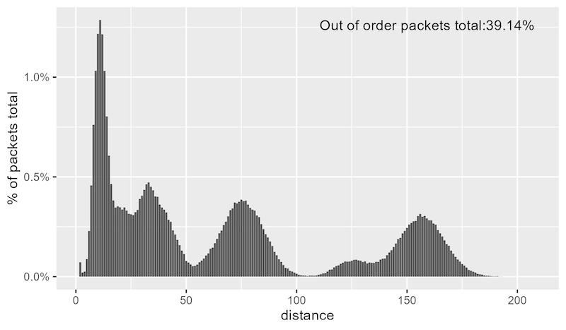

And the final test increased the number of policers / counters for the path 2 from 8 to 256, the maximum distance has further increased as shown below.

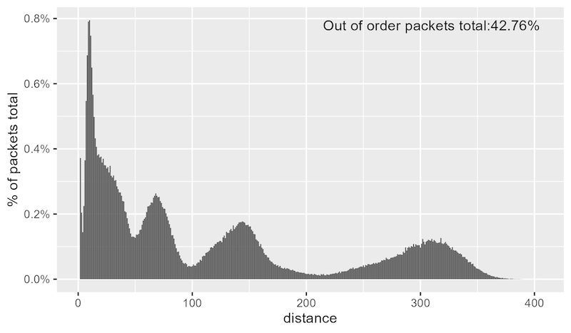

The performance results are shown below

- Profile with **200+** distance. Adaptive Routing : **Enabled**. Spraying : **Enabled**. Throughput : **97.66 Gbps**.
- Profile with **400+** distance. Adaptive Routing : **Enabled**. Spraying : **Enabled**. Throughput : **87.58 Gbps**.

As seen from the tests, in a scenario with very large re-ordering, the performance may degrade. Note, there were no drops registered, and most likely the rate reduces when the number of unacknowledged packets reach configured / supported maximum.

Overall, the Adaptive Routing and Spraying combination results are very encouraging -- NICs that have been shipping for many years deployed with Juniper AI/ML fabric emulation perform great with very heavy re-ordering!

But is there a downside?

## What is the cost of doing it?

Well, first, RDMA packet spraying is not a new technique -- it is enabled by default in Nvidia InfiniBand deployments. It has been in use for a while, without people even noticing it.

But we tried to understand the negative impact, and here is what we found so far, besides small 0.34% reduction in the throughput: if out of order packet reception is enabled in the NIC (Adaptive Routing), the number of packets with acknowledgements does increase. In the non-Adaptive Routing case, the acknowledgements are generated per entire message (which may be comprised of **RDMA WRITE First**, **RDMA WRITE Last** and multiple **RDMA WRITE Middle** packets), whereas in case of Adaptive Routing, the acknowledgments are generated for a group of several **RDMA_WRITE_ONLY** packets. In our case the ACKs were sent for a group of 3 to 4 packets.

Here is the capture of the packet with an acknowledgement.

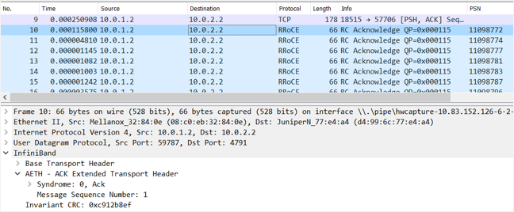

For every 3 to 4 frames 4096 bytes each in one direction, there will be a small 66-byte L2 packet sent in the other direction.

Is it worth enabling it? 66 bytes for a transfer of 12K to 16K is probably not a big tax, compared to the alternative techniques, such as Fully Scheduled Fabrics.

## Conclusion

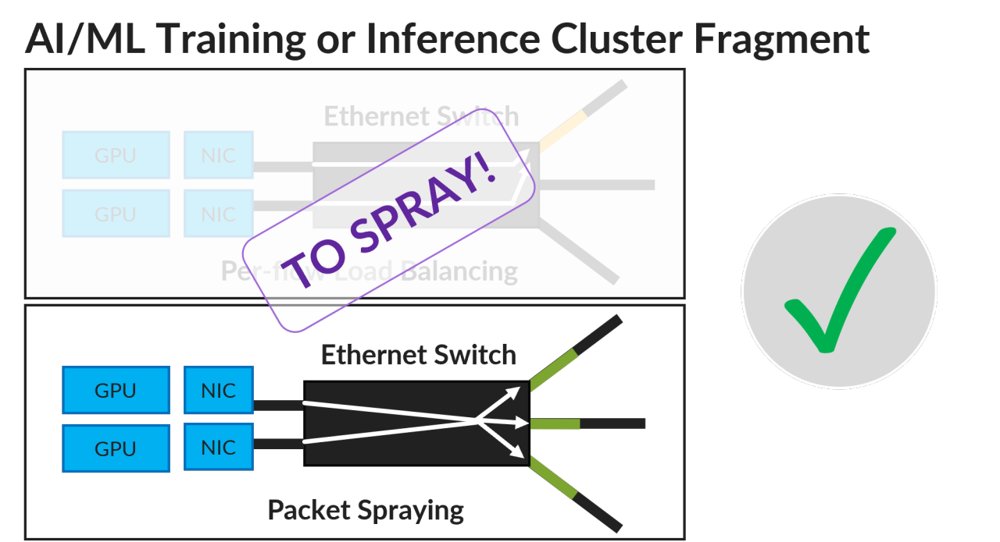

This test validates simple yet effective Juniper AI/ML fabric design which uses packet spraying as a technique to load balance traffic evenly across all fabric paths and avoid congestion, thus reducing job completion times.

The tests were performed with Nvidia Connect X 6 DX NIC, and we are open to verifying it with other NICs too.

## Useful links

- [https://github.com/NVIDIA/nccl/tree/master/src](https://github.com/NVIDIA/nccl/tree/master/src)
- [https://people.eecs.berkeley.edu/~apanda/assets/papers/sigcomm18-irn.pdf](https://people.eecs.berkeley.edu/~apanda/assets/papers/sigcomm18-irn.pdf)
- [https://enterprise-support.nvidia.com/s/article/How-To-Configure-Adaptive-Routing-and-Self-Healing-Networking-New](https://enterprise-support.nvidia.com/s/article/How-To-Configure-Adaptive-Routing-and-Self-Healing-Networking-New)
- [https://mellanox.my.site.com/mellanoxcommunity/s/article/How-to-Enable-Disable-Lossy-RoCE-Accelerations](https://mellanox.my.site.com/mellanoxcommunity/s/article/How-to-Enable-Disable-Lossy-RoCE-Accelerations)
- [https://docs.nvidia.com/deeplearning/nccl/user-guide/docs/env.html#nccl-ib-adaptive-routing](https://docs.nvidia.com/deeplearning/nccl/user-guide/docs/env.html#nccl-ib-adaptive-routing)
- [https://www.linkedin.com/pulse/spray-solving-low-entropy-problem-aiml-training-fabrics-shokarev/](https://www.linkedin.com/pulse/spray-solving-low-entropy-problem-aiml-training-fabrics-shokarev/)
- [https://www.linkedin.com/pulse/spray-validation-dmitry-shokarev](https://www.linkedin.com/pulse/spray-validation-dmitry-shokarev)

## Glossary

- DMA: Direct Memory Access
- GPU: Graphical Process Unit
- NCCL: Nvidia Collective Communications Library
- NIC: Network Interface Card
- RDMA: Remote Direct Memory Access
- RoCEv2: RDMA over Converged Ethernet Version2
