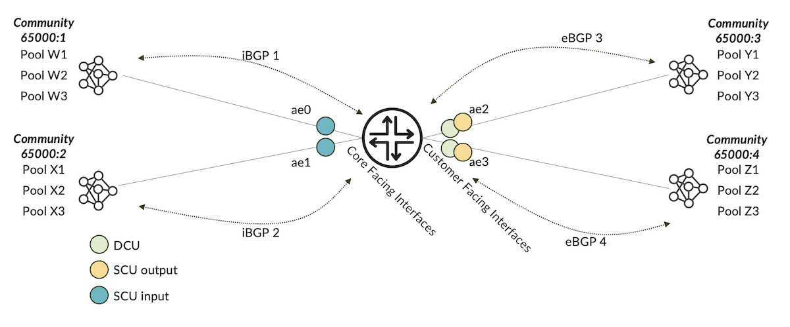
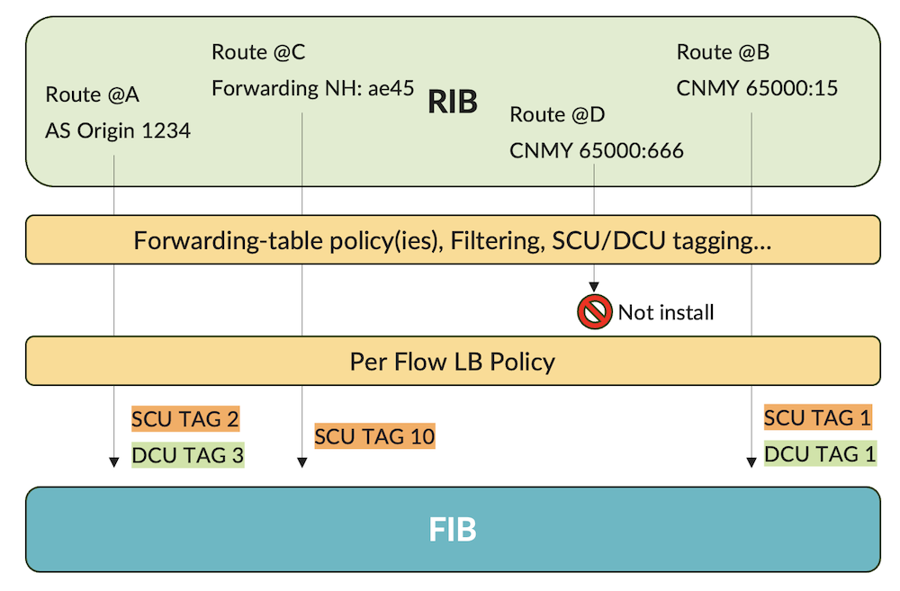
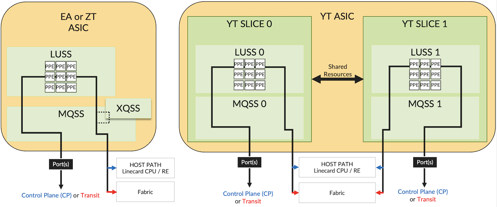
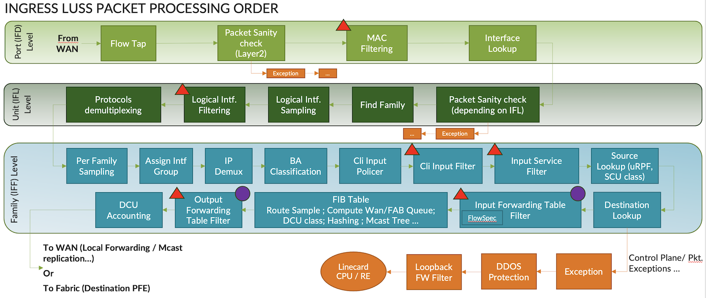
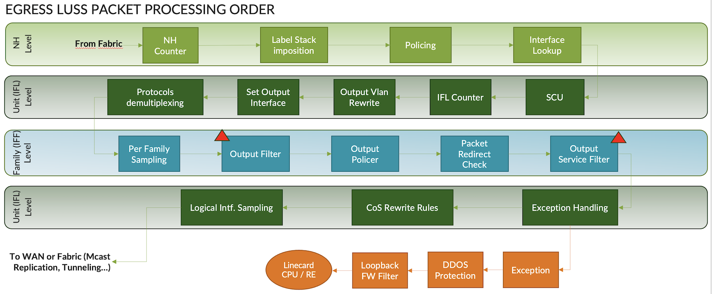
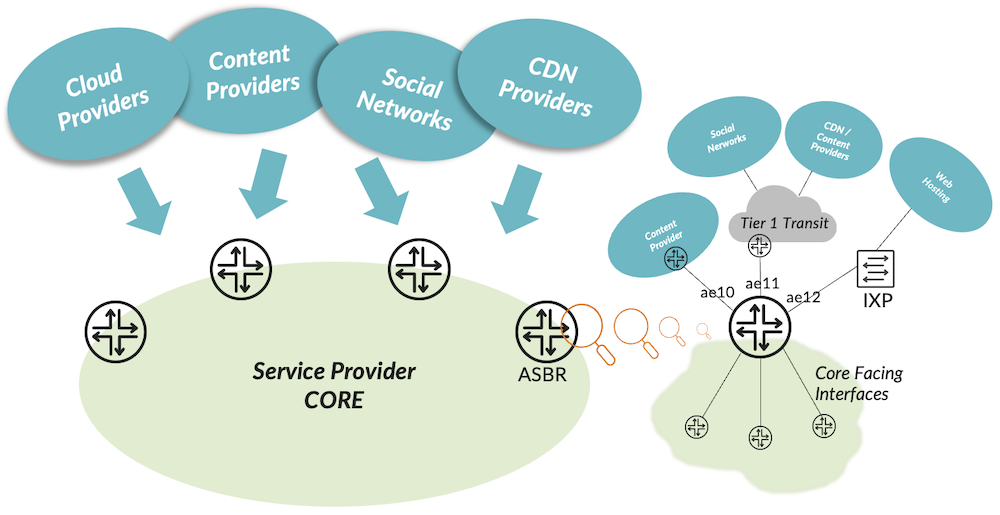
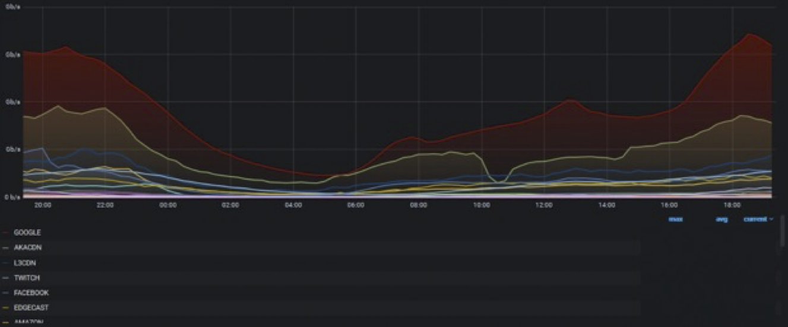
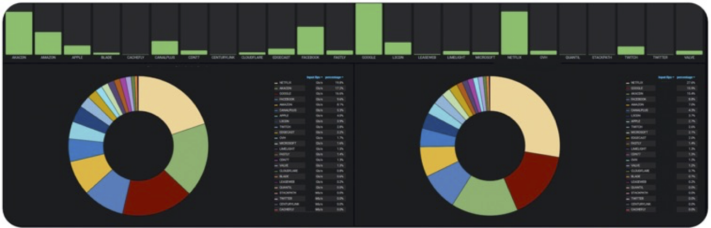
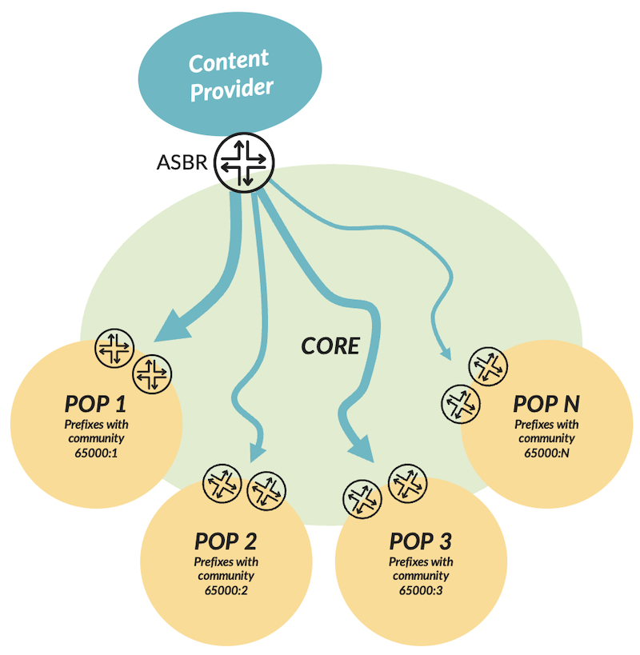
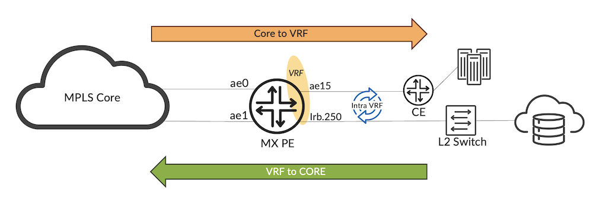

# Traffic Accounting with MX Features

**David Roy - 09/12/2023**

How much traffic coming from Internet reach my different POPs? Can I monitor in real time the traffic coming from the "TOP Internet Talkers"? Is there an easy way to count traffic entering and leaving my VRFs?"... If you are part of a support or capacity planning team, you frequently got this questions.

Let's imagine a dialogue between two network engineers to introduce what we'll detail in this article:

- **Bob**:  To answer to the use cases, why not using Inline JFlow?
- **Patrick**: Indeed, sampling is one possible answer but this implies using external servers, external computation elements: this has cost, needs dedicated skills to keep a solution up and running.
- **Bob**: Yes, but our capacity planning already uses IPFIX to follow how the overall traffic is growing. We already have tools.
- **Patrick**: Absolutely. I don't say we need to replace IPFIX but sampling means also "approximation" and this solution is not really real-time (as routers perform flow aggregation which adds latency). And moreover, this is a dedicated tool, not fully embedded in our Grafana monitoring solution and not all technicians from 24x7 Monitoring team are familiar with it.
- **Bob**: Ok, but on MX, we also support Inline Monitoring (aka. IMON) which should overcome this latency issue.
- **Patrick**: Good point. But once again, this feature, as powerful as it may be, requests more computation on the collector side. Remember we need to decode each sampled packet with Inline Monitoring. It's totally feasible but it's not exactly what we are looking for... and it stays "sampling" and we need a solution that gives us the amount of traffic without any approximations.
- **Bob**: Right, but what do you suggest then?
- **Patrick**: I want to use a mix of 3 MX features to achieve that: SCU/DCU, Forwarding Table Filter (FTF), and of course a bit of Telemetry to fully integrate these new KPI in our existing monitoring system.
- **Bob**: Ok... can you show me how to do that?
- **Patrick**: Sure, here we go....

## Features Introduction

Let's first have a look at each feature separately and we'll finally see, in the next part, how to combine them together to build a real time monitoring system that could answer to all our previous requirements - and this with very few compute resources on the collector side. Please note, all those features we are going to present in this article can also be combined with inline Jflow or Inline Monitoring without any compromises.

### SCU/DCU

These two features are a bit old (introduced in Junos 5.2); though, they are still very useful for some use cases. SCU stands for Source Class Usage and DCU for Destination Class Usage. As of today, you can define up to 126 SCU and 126 DCU classes per chassis. Classes can be reasonably thought of as internal tags and based on these tags, we'll do traffic accounting and much much (but this is out of the scope of this article). SCU and DCU are supported for inet and inet6 families and works in the Global Routing Table (aka. GRT) or in L3VPN VRF.

Let's take a simple example depicted by figure 1:



If we have a look at the [Juniper Guide [1]](https://www.juniper.net/documentation/us/en/software/junos/routing-policy/topics/concept/source-class-usage-options-junos-nm.html), we'll find these definitions:

- Source Class Usage (SCU) counts packets sent to customers by performing lookups on the IP source address and the IP destination address. SCU makes it possible to track traffic originating from specific prefixes on the provider core and destined for specific prefixes on the customer edge. You must enable SCU accounting on both the inbound and outbound physical interfaces.
Based on figure 1, this would mean: "how much traffic coming from core interfaces (e.g., ae0) is reaching customers attached to ae2 or ae3"

- Destination Class Usage (DCU) counts packets from customers by performing lookups of the IP destination address. DCU makes it possible to track traffic originating from the customer edge and destined for specific prefixes on the provider core router.
Once again, referring to figure 1, this would mean: "how much traffic coming from customer facing interfaces (e.g., ae2) is forwarded to core interfaces ae0 or ae1"

As previously mentioned, we view classes as internal tags. The "tagging" action is performed at PFE level during the packet lookup. To indicate which packet should be tagged or not, Junos provides a straightforward solution called the "forwarding-table export policy".  This export policy is widely used to enable "per-flow" load-balancing (see below). We won't open back the Pandora box and waste time to explain why per-packet meant per-flow, this is out of the scope of this article. In recent releases, the per-packet knob has been deprecated in favor of per-flow option.

```
bob@sponge> show configuration policy-options policy-statement PER-FLOW-LOAD-BALANCE 
term 1 {
    then {
        load-balance per-flow; <<<< per-packet for non-recent releases
        accept;
    }
}

bob@sponge> show configuration routing-options forwarding-table                         
export PER-FLOW-LOAD-BALANCE;
```

Thanks to this export policy/policies (i.e., we can chain several policies) we may also filter which RIB routes we wish to install into the FIB but not only. Indeed, we can also assign a SCU and/or DCU class to some prefixes. This is the power of how Junos implements SCU/DCU concept. Indeed, we have the whole routing policy toolkit to define which prefixes must be tagged. Thus, the "tagging" decision is performed at the RIB level, before exporting routes to the FIB. At the RIB level, we have all routing information available as filtering criteria such as BGP communities, AS PATH, incoming Interface, Internal vs External routes etc... Those offers much more conditions than classical firewall filter match conditions (remember at FIB level where filtering occurs, we have lost all these routing information such as the BGP attributes). Figure 2 below, summarizes the flexibility of "forwarding table export policies" on Junos to assign SCU and DCU classes.



Let's create an SCU/DCU policy based on our initial topology (figure 1).

First, we consider each prefix received on each iBGP and eBGP session are associated, via a BGP import policy, to a specific community respectively:

- CNMY1 (65000:1) for iBGP 1
- CNMY2 (65000:2) for iBGP 2
- CNMY3 (65000:3) for eBGP 3
- CNMY4 (65000:4) for eBGP 4

We will reuse this BGP marking to assigned internally our SCU and DCU tags. The "tagging" policy is defined like that. Each pool of prefixes is assigned to a SCU tag prefixed with "sc_tag" and a DCU tag prefixed with "dc_tag":

```
bob@sponge> show configuration policy-options policy-statement TAGGING 
term tag1 {
    from community CNMY1;
    then {
        destination-class dc_tag1;
        source-class sc_tag1;
        next policy;
    }
}
term tag2 {
    from community CNMY2;
    then {
        destination-class dc_tag2;
        source-class sc_tag2;
        next policy;
    }
}
term tag3 {
    from community CNMY3;
    then {
        destination-class dc_tag3;
        source-class sc_tag3;
        next policy;
    }
}
term tag4 {
    from community CNMY4;
    then {
        destination-class dc_tag4;
        source-class sc_tag4;
        next policy;
    }
}
```

Now, let's chain this policy to the existing export policy of the forwarding-table:

```
bob@sponge> show configuration routing-options forwarding-table 
export [ TAGGING PER-FLOW-LOAD-BALANCE ];
```

You can verify if a route is well assigned to one or more "classes". You need to issue the "show route" command with the "extensive" option. Let's do it for a route received by the iBGP session 1:

```
bob@sponge> show route 10.0.0.0/24 extensive |match class 
Destination class: dc_tag1
Source class: sc_tag1
```

Good! Classes are there, we are ready to start doing accounting.

Note: In our example we track IPv4 flows but it works as the same for IPv6 family.

Let's start using DCU tags (the simplest way to start playing with SCU/DCU). It is important to say that's DCU tagging action is done by default during the classical destination lookup. In other words, if during the lookup, the longest prefix match (aka. LPM) is assign to a DCU class, we keep it internally for further processing.
However, to trigger per interface DCU accounting you must enable "destination-class-usage" knob on each ingress interface you want to track flows targeting Destination Classes.

To quickly summarize, packet tagging is done during destination lookup and the DCU accounting is performed per interface basis afterward (all these actions are implemented by ingress PFE).

Hereafter, we commit the DCU IPv4 accounting knob for ingress interface ae0 (similar for family inet6):

```
bob@sponge> show configuration interfaces ae0 
unit 0 {
    family inet {
        accounting {
            destination-class-usage;
        }
        address 172.16.0.0/31;
    }
    family iso;
}
```

In practical, when a packet enters through ae0 a packet lookup is performed to find out the right forwarding next-hop and if the LPM is assigned to a destination class the packet internal header will then carry the DCU associated tag. Finally packet accounting based on each DCU tag is done if the ingress interface owns the "destination-class-usage" config option. To better understand let's check ae0 interface statistics:

```
bob@sponge> show interfaces statistics ae0    
Physical interface: ae0, Enabled, Physical link is Up
[...]
                                               Packets                Bytes
      Destination class            (packet-per-second)    (bits-per-second)


                          dc_tag1                    0                    0
                                  (                  0) (                 0)
                          dc_tag2                    0                    0
                                  (                  0) (                 0)
                          dc_tag3             27894162          13779716028
                                  (              19999) (          79038416)
                          dc_tag4             73393891          36256582154
                                  (              49998) (         197595056)
```

As you can see, dc_tag3 conveys 20K pps and dc_tag4 50K pps. This means that 20K pps entering ae0 are targeting destinations matching dc_tag3 which is associated to our BGP CNMY3 (prefixes conveyed by eBGP session 3). Likewise, 50Kpps ingressing into ae0 are destined to prefixes assigned to BGP community CNMY4 (prefixes of the eBGP session 4).

Let's now see how SCU accounting works. SCU requires a double lookup: a source lookup to assign the SCU tag associated to the IP source address of the packet, followed by a classical destination lookup to find out the forwarding next hop. These 2 lookups are performed by the ingress PFE. SCU accounting is finally carried out by the egress PFE (when packet egressing a given interfaces). To avoid triggering source lookup on every interface we need to specify on which ingress interfaces we wish to do a double lookup. This is achieved by applying the knob "source-class-usage input" on desired ingress interfaces. A second knob "source-class-usage output" must be configured on egress interfaces to trigger accounting based on SCU classes: actually, on egress interfaces we want to track flows coming from given sources. Not easy to figure out? No worries, let's illustrate the concept. First, we commit the following ae1 interface configuration:

```
bob@sponge> show configuration interfaces ae1             
unit 0 {
    family inet {
        accounting {
            source-class-usage {
                input;
            }
        }
        address 172.16.0.2/31;
    }
    family iso;
}
```

This means we want to do Source and Destination lookup for packets entering ae1. If the source lookup matches a prefix attached to a SCU tag, this one will be associated internally to the packet for further processing.

Now, let's enable SCU tag accounting on ae3 interface. This means we wish to track flows coming from SCU tags (in our case coming from source prefixes attached to ae1) and leaving the router through ae3.

```
bob@sponge> show configuration interfaces ae3    
unit 0 {
    family inet {
        accounting {
            source-class-usage {
                output;
            }
        }
        address 172.16.0.6/31;
    }
}
```

To validate our traffic accounting is working as expected, issue the following command to check ae3 interfaces statistics:

```
bob@sponge> show interfaces ae3 statistics     
Physical interface: ae3, Enabled, Physical link is Up
  [...]
                                               Packets                Bytes
      Source class                 (packet-per-second)    (bits-per-second)

                          sc_tag1                    0                    0
                                  (                  0) (                 0)
                          sc_tag2              1931497            954159518
                                  (              99998) (         395193280)
                          sc_tag3                    0                    0
                                  (                  0) (                 0)
                          sc_tag4                    0                    0
                                  (                  0) (                 0)
```

Great! 100K pps coming from prefixes attached to SCU tag sc_tag2 (prefixes coming from iBGP session 2) are egressing ae3.

Finally, we roll out this configuration by committing SCU/DCU on all interfaces like that:

```
bob@sponge> wildcard range set interfaces ae[0-3] unit 0 family inet accounting source-class-usage input                                   
bob@sponge> wildcard range set interfaces ae[0-3] unit 0 family inet accounting source-class-usage output   
bob@sponge> wildcard range set interfaces ae[0-3] unit 0 family inet accounting destination-class-usage
```

and now let's check statistics for example for interface ae0:

```
bob@sponge> show interfaces ae0 statistics 
Physical interface: ae0, Enabled, Physical link is Up
  [...]
      Destination class            (packet-per-second)    (bits-per-second)

                          dc_tag1                    0                    0
                                  (                  0) (                 0)
                          dc_tag2               680813            336321622
                                  (              33332) (         131729776)
                          dc_tag3             71893484          35515381096
                                  (              33332) (         131729776)
                          dc_tag4            182370981          90091264614
                                  (              33332) (         131729776)
                                               Packets                Bytes
      Source class                 (packet-per-second)    (bits-per-second)

                          sc_tag1                    0                    0
                                  (                  0) (                 0)
                          sc_tag2              4205087           2077312978
                                  (             499989) (        1975958528)
                          sc_tag3              1765972            872390168
                                  (             209995) (         829901160)
                          sc_tag4               647499            319864506
                                  (              76998) (         304297288)
```

Here we have a kind of traffic matrix. Indeed, this output gives us the following information:

- 33K pps of traffic entering ae0 is destined to prefixes attached to BGP community CNMY2
- 33K pps of traffic entering ae0 is destined to prefixes attached to BGP community CNMY3
- 33K pps of traffic entering ae0 is destined to prefixes attached to BGP community CNMY4
- 500K pps of traffic egressing ae0 comes from prefixes attached to BGP community CNMY1
- 210K pps of traffic egressing ae0 comes from prefixes attached to BGP community CNMY1
- 77K pps of traffic egressing ae0 comes from prefixes attached to BGP community CNMY4

This is the power of SCU/DCU on Junos! We will see later how we'll use this feature to achieve our use cases.

### Forwarding Table Filter

Forwarding Table Filter also known as FTF is a unique Juniper feature which offers a "global filtering solution". "Global" means for all interfaces. For that, we are not going to use an "apply-group" but we will apply a filter on ingress or egress direction and for a given family at the "forwarding-options" configuration level instead.

> *Note: When you apply a firewall filter at this level, independently of the direction, the filtering will be done by the ingress PFE.*

Let's do a short break to give an overview of the MX PFE's architecture. For more information, please refer to these two Day One books [2] and [3]. Trio ASICs rely on "run-to-completion" model and are built around 3 main functional blocks: the Lookup Block aka. LU Chip, the central/queuing Block aka MQ Chip and the Hierarchical/Rich Queuing Block aka. QX Block. Starting from EA ASIC (Trio gen. 4) and onwards (ZT (Trio gen. 5) and YT (Trio gen. 6)) all those blocks have been merged in a single die, but functional sub-blocks have been kept, slightly renamed though. For those monolithic ASICs we talk about LUSS, MQSS and XQSS sub-blocks.

> *Note: From YT ASIC, XQSS functionalities are now managed by MQSS block.*

So, we can illustrate the recent Trio Forwarding ASICs architecture as follow:



At PFE level (ingress and egress) we do many packet manipulations such as packet filtering, policing; packet lookup; packet remarking; packet accounting; packet queuing and many other stuff depending on the configuration. Some tasks are done in parallel and some others sequentially.

We will focus our eyes on the LUSS sub-block, the "brain" of the ASIC. In other words, this is where all advanced packet processing take place. LUSS is made of many physical cores aka. PPE (for Packet Processing Engines) with thousands of threads. Each PPE can handle a packet and apply all the rich feature set offered by the MX. Features list applies to a packet, depends on many parameters such as the router's configuration. We can view this list of instructions or tasks as more or less a long list of handlers ("next-hop") stitched together to form the forwarding path. The list of tasks managed by LUSS are so long and dependent on each use case that it's impossible to share this exhaustive list in this article.

Nevertheless, the next two figures try to give an overview of how packet are manipulated by the LUSS's PPE. On those diagrams, we've included some of the classic tasks found in many configurations. Let's have a look at the "red triangles" where filtering task usually occurs. For our purpose, we added a "purple circle" where FTF feature is implemented. Finally, you can also observe where SCU/DCU, previously discussed, run.

Remember the meaning of these acronyms:

- IFD: Interface Descriptor -- this is the physical interface.
- IFL: Interface Logical -- this is the logical interface level aka. the "unit".
- IFF: Interface Family -- this is one or more families (inet, inet6, iso, mpls, bridge, ccc...) attached to the IFL.





To apply a firewall filter at PFE level, just configure any classical filters at this configuration level:

```
bob@sponge> show configuration     
forwarding-options {                    
    family inet {
        filter {
            input FTF_INPUT;
            output FTF_OUTPUT;
        }
    }
    family inet6 {
        filter {
            input FTF_INPUT6;
            output FTF_OUTPUT6;
        }
    }
}
```

### gNMI streaming Telemetry

The last feature, and not the least, we'll need is the Juniper streaming Telemetry solution. For that, we will rely on gNMI interface to collect periodically (every 30s) firewall filter counters (proprietary JTI interface is supported as well).

The Xpath to collect firewall counters is: /junos/system/linecard/firewall. The relevant tags (key) are:

- /junos/firewall/name: the filter name
- /junos/firewall/state/counter/name: the counter name

And the relevant fields are:

- /junos/firewall/state/counter/bytes: the number of forwarded bytes for a given tuple (filter name; counter name)
- /junos/firewall/state/counter/packets: the number of forwarded packets for a given tuple (filter name; counter name)

Presenting Juniper Telemetry Interface and gNMI is out of the scope of this article. Remember, there are only few things to do to enable grpc streaming telemetry. Hereafter, you'll find the way to configure grpc server without encryption (Junos also support TLS encryption refer to [4] for more information):

```
bob@sponge> show configuration system services 
extension-service {
    request-response {
        grpc {
            clear-text {
                port 33333;
            }
        }
    }
} 
```

## Playing with features

It's time to combine these features all together in order to achieve our 3 use cases:

- Internet Top Talker traffic monitoring
- Per POP traffic distribution monitoring
- Per VRF accounting Internet Top

### Talkers traffic accounting

How to provide a simple solution to follow in real time the overall traffic coming from the "Top Internet Talkers" on all my ASBR?

Let's start analyzing the Figure 6. Here we have a Service Provider connected to the rest of world through its ASBR. This ISP delivers Internet connectivity for residential customers (xDSL, FTTH, mobile 4G/5G...). ASBR could be connected directly to some "providers" or using Transit, IXP, private peering, etc... to provide connectivity to remote Internet contents.



The aim of this part is to provide a template of configuration to retrieve the traffic, in real time, of each "big" Internet Talker independently of how many interfaces the ASBR has. We will separate IPv4 traffic from IPv6 traffic. On the collector side you could simply sum both families to compute the total bandwidth of a given "Talker".

First of all, how we can identify the prefixes coming from a given talker? The easiest solution is to use the Origin AS information. A "provider", a "company", has one or more ASN, well known and registered on RIR (you can also have a look into PeeringDB [5]). We consider this list (non-exhaustive) of 20 top talkers for our example. Those are very popular providers when we wrote this article. Based on PeeringDB information, we built, for each provider, an as-path regex matching all the ASN (origin AS) owned by a provider.

```
bob@sponge> show configuration policy-options 
as-path PROVIDER_GOOGLE ".* (15169|16550|36040|36561|11344|43515|19527)$"
as-path PROVIDER_NETFLIX ".* (55095|40027|394406|2906)$"
as-path PROVIDER_FACEBOOK ".* (63293|54115|32934)$"
as-path PROVIDER_APPLE ".* (714|6185)$"
as-path PROVIDER_VALVE ".* 32590$"
as-path PROVIDER_BLADE ".* 64476$"
as-path PROVIDER_TWITCH ".* 46489$"
as-path PROVIDER_CLOUDFLARE ".* (395747|394536|209242|203898|202623|13335|132892|14789|139242|133877)$"
as-path PROVIDER_AMAZON ".* (7224|16509|19047|14618|9059|8987|39111|62785)$"
as-path PROVIDER_EDGECAST ".* 15133$"
as-path PROVIDER_FASTLY ".* 54113$"
as-path PROVIDER_MICROSOFT ".* (8075|8068|8069)$"
as-path PROVIDER_STACKPATH ".* (54104|12989|33438)$"
as-path PROVIDER_LEASEWEB ".* (16265|133752|59253|28753|205025|60781|205544|7203|15003|60626|30633|394380)$"
as-path PROVIDER_CDN77 ".* 60068$"
as-path PROVIDER_LIMELIGHT ".* 22822$"
as-path PROVIDER_AKACDN ".* (16625|20940)$"
as-path PROVIDER_L3CDN ".* (209|202818|3356)$"
as-path PROVIDER_ZOOM ".* 30103$"
as-path PROVIDER_TIKTOK ".* (396986|138699)$"
```

Great! Based on these as-path-regex we will create our SCU Marking Policy: For each as-path-regex we'll assign a given SCU tag. But how does It work? It relies on the power of Junos SCU/DCU marking. The decision is done at the RIB level (remember before pushing prefixes into the FIB). With this method, we don't care to know how many prefixes are attached to a given Origin AS or if prefixes will be removed or added during the time - no big prefix-lists to maintain... This task is driven by Junos, automatically.

```
bob@sponge> show policy-options policy-statement SCU_MARKING 
term google {
    from as-path PROVIDER_GOOGLE;
    then {
        source-class scu_google;
        next policy;
    }
}
term netflix {
    from as-path PROVIDER_NETFLIX;
    then {
        source-class scu_netflix;
        next policy;
    }
}
term facebook {
    from as-path PROVIDER_FACEBOOK;
    then {
        source-class scu_facebook;
        next policy;
    }
}
term cloudflare {
    from as-path PROVIDER_CLOUDFLARE;
    then {
        source-class scu_cloudflare;
        next policy;
    }
}


[...] Output Truncated
 
term tiktok {
    from as-path PROVIDER_TIKTOK;
    then {
        source-class scu_tiktok;
        next policy;
    }
}
term other {
    then next policy;
}
```

We have now our "tagging" policy ready - we just have to apply it. As usual, we chain our SCU policy with the exiting Load-balance policy:

```
bob@sponge> show configuration routing-options forwarding-table 
export [ SCU_MARKING PER-FLOW-LOAD-BALANCE ];
```

Afterward, we may check if our "tagging" policy is working as expected. Just issue a "show route extensive" for some well-known provider's prefixes. You'll notice tagging is natively working for IPv4 and IPv6 families.

```
bob@sponge> show route 8.8.8.0/24 extensive |match class 
Destination class: scu_google


bob@sponge> show route 2606:4700:4700::/48 table inet6.0 extensive |match class 
Destination class: scu_cloudflare
```

Alright, now we have all our prefixes well tagged with their respective SCU class. Next step, consists in enabling source lookup to force PFE to add internal SCU tag, if present. If we refer to our ASBR topology, figure 6, we must enable "source-class-usage input" on all "customers/peering/transit" facing interfaces. We enable it for ae10, ae11 and ae12 and for both families. 

> *Note: the LAG 12 is connected to an IXP through several routed VLANs, we'll enable the knob on all required sub-interfaces:*

```
bob@sponge> show configuration interfaces ae10
unit 0 {
    family inet {
        accounting {
            source-class-usage {
                input;
            }
        }
    }
    family inet6 {
        accounting {
            source-class-usage {
                input;
            }
        }
    }
}
show configuration interfaces ae11
unit 0 {
    family inet {
        accounting {
            source-class-usage {
                input;
            }
        }
    }
    family inet6 {
        accounting {
            source-class-usage {
                input;
            }
        }
    }
}
show configuration interfaces ae12
unit 100 {
    vlan-id 100;
    family inet {
        accounting {
            source-class-usage {
                input;
            }
        }
    }
    family inet6 {
        accounting {
            source-class-usage {
                input;
            }
        }
    }
}
[...]
unit 199 {
    vlan-id 199;
    family inet {
        accounting {
            source-class-usage {
                input;
            }
        }
    }
    family inet6 {
        accounting {
            source-class-usage {
                input;
            }
        }
    }
}
```

By committing the previous config, we trigger source lookup for all packets entering through the interfaces supporting the "source-class-usage input" knob. If the IP source address of the packet matches a prefix with an internal SCU tag, we will piggyback it on the packet for further processing. At this step, there is nothing more to do if we then want to perform traffic accounting based on SCU tag with a firewall filter.

But wait one second! Why did we mention earlier that SCU requires 2 knobs: "source-class-usage input" to trigger the source lookup and "source-class-usage output" to perform accounting? Indeed, if you want to have per outgoing interface accounting you must use the second knob on all egress interfaces -- core facing interfaces if you refer to figure 6. But here, we don't care of that. We just want aggregated counters -- per router counters in other words. So, this is why we won't apply the statement "source-class-usage output" on our core facing ports.

So, the next step is to create 2 firewall filters (FTF filters more precisely) -- one per family -- where each term will match a given SCU tag and count packets/bytes. Hereafter the format of the 2 following filters (we have omitted some terms for better reading):

```
bob@sponge> show configuration firewall family inet
filter TOP_TALKERS_V4 {
    term google {
        from {
            source-class scu_google;
        }
        then {
            count GOOGLE_V4;
            accept;
        }
    }
    term netflix {
        from {
            source-class scu_netflix;
        }
        then {
            count NETFLIX_V4;
            accept;
        }
    }
    term facebook {
        from {
            source-class scu_facebook;
        }
        then {
            count FACEBOOK_V4;
            accept;                     
        }
    }
[...] Output Truncated
    term other {
        then accept;
    }
}


show configuration firewall family inet6
filter TOP_TALKERS_V6 {
    term google {
        from {
            source-class scu_google;
        }
        then {
            count GOOGLE_V6;
            accept;
        }
    }
    term netflix {
        from {
            source-class scu_netflix;
        }
        then {
            count NETFLIX_V6;
            accept;
        }
    }
    term facebook {
        from {
            source-class scu_facebook;
        }
        then {
            count FACEBOOK_V6;
            accept;                     
        }
    }
[...] Output Truncated
    term other {
        then accept;
    }
}
```

Final step consists in applying those filters at the forwarding-table level (FTF). We configure them on input direction. Quickly glance at the figure 4 to observe the SCU "marking" is done before the forwarding-table-filter input processing.

```
bob@sponge> show configuration     
forwarding-options {                    
    family inet {
        filter {
            input TOP_TALKERS_V4;
        }
    }
    family inet6 {
        filter {
            input TOP_TALKERS_V6;
        }
    }
}
```

All the TOP_TALKERS_V4 and TOP_TALKERS_V6 counters should start incrementing -- you could issue a "show firewall filter" to validate that point. But for now, we prefer to collect those statistics via the Juniper Streaming Telemetry solution. For that, we subscribe (gNMI) to the following path /junos/system/linecard/firewall, already discussed in previous part. You can finally display those counters in Grafana Dashboard, aggregate these KPI coming from all ASBR, etc... Your Capacity Planning and NOC will enjoy.





### Per POP traffic distribution monitoring

The second use case is close to the first one, though, it illustrates another view of the power of SCU/DCU coupled with FTF filter. This time we'll use DCU.

Let's have a look at figure 7 which depicts a classical multi-areas service provider network where regional POPs are connected to the core. The regional prefixes are often marked with a specific BGP community to help production tracking, policy routing, traffic enginnering or even for troubleshooting.

In our example, each POP has its given community: 65000:<POP_Number>. The core network uses its ASRB to connect other autonomous systems for transit or peering. We simplify the architecture with only one ASBR connected to one Content provider - i.e. for our solution the number of ASBR has no matter.



We will reuse the BGP communities allocated to regional prefixes to assign one DCU tag per region. Remember we can use up to 126 DCU classes, but for our purpose that's more than enough. Let's commit this configuration:

```
bob@sponge> show configuration policy-options
policy-statement DCU_MARKING {
        term POP_REGION1 {
            from community CNMY_REGION1;
            then {
                destination-class dc_pop_region1;
                next policy;
            }
        }
        term POP_REGION2 {
            from community CNMY_REGION1;
            then {
                destination-class dc_pop_region2;
                next policy;
            }
        }
        term POP_REGION3 {
            from community CNMY_REGION1;
            then {
                destination-class dc_pop_region3;
                next policy;
            }
        }
[...]
        term POP_REGIONN {
            from community CNMY_REGIONN;
            then {
                destination-class dc_pop_regionN;
                next policy;
            }
        }
        term other {
            then next policy;
        }
}


bob@sponge> show configuration routing-options forwarding-table 
export [ DCU_MARKING PER-FLOW-LOAD-BALANCE ];
```

Then, we configure "destination-class-usage" on the content provider interfaces, this step is not mandatory though. Indeed, DCU marking is done by default during the destination lookup. Configuring "destination-class-usage" only enable per interface (show interface statistics) DCU traffic accounting (where the knob is configured"). Unlike SCU marking that needs to explicitly configure on which interfaces we want to trigger a source lookup and thus SCU tagging -- remember this is done by configuring "source-class-usage input" on desired ingress interfaces.

```
bob@sponge> show configuration interfaces ae120             
unit 0 {
    family inet {
        accounting {
            destination-class-usage;
        }
    }
    family inet6 {
        accounting {
            destination-class-usage;
        }
    }
}
```

Now, let's create 2 firewall filters, one for IPv4 and one for IPv6 family.

> *Note: we consider the content provider PNI is a dual stack connectivity. Remember marking is done by ingress PFE. It means that even if the content is then encapsulated in MPLS within the Core we will be able to perform traffic accounting (e.g. Core could use 6PE to convey IPv6 traffic).*

In our case we want to count traffic coming from only the specific content provider interface and targeting our regional POPs. For that, we add the "interface" knob in the match condition -- see below:

```
bob@sponge> show configuration firewall family inet
filter FF-PER_POP_CONTENT_V4 {
    term REGION1 {
        from {
            destination-class dc_pop_region1;
            interface ae120.0;
        }
        then {
            count TO_REGION1_V4;
            accept;
        }
    }
    term REGION2 {
        from {
            destination-class dc_pop_region2;
            interface ae120.0;
        }
        then {
            count TO_REGION2_V4;
            accept;
        }
    }
    term REGION3 {
        from {
            destination-class dc_pop_region3;
            interface ae120.0;
        }
        then {
            count TO_REGION3_V4;
            accept;
        }
    }
}


bob@sponge> show configuration firewall family inet6
filter FF-PER_POP_CONTENT_V6 {
    term REGION1 {
        from {
            destination-class dc_pop_region1;
            interface ae120.0;
        }
        then {
            count TO_REGION1_V6;
            accept;
        }
    }
    term REGION2 {
        from {
            destination-class dc_pop_region2;
            interface ae120.0;
        }
        then {
            count TO_REGION2_V6;
            accept;
        }
    }
    term REGION3 {
        from {
            destination-class dc_pop_region3;
            interface ae120.0;
        }
        then {
            count TO_REGION3_V6;
            accept;
        }
    }
}
```

Once again, the final step is to apply these 2 firewall filters to the forwarding table. We configure both filters in output direction as DCU marking is done after the forwarding-table-filter input task (have a look at figure 4).

```
bob@sponge> show configuration 
forwarding-options {                    
    family inet {
        filter {
            output FF-PER_POP_CONTENT_V4;
        }
    }
    family inet6 {
        filter {
            output FF-PER_POP_CONTENT_V6;
        }
    }
}
```

Here we are, you have just to configure your Telemetry collector and subscribe to the firewall Sensor Path and collect every e.g. 30secs the firewall counters. With this solution you will be able to collect how much traffic of your content provider is targeting each POP, with no  approximation and in real-time. Once again, your capacity planning and NOC teams will thank you for those new Dashboards.

### Per VRF Accounting

The idea behind this last use case is to provide a straightforward solution to count traffic entering and leaving a VRF with one constraint which is: "not count intra VRF traffic. To illustrate this use case, we will rely on this simple network topology: one PE with one VRF where 2 Routed Interfaces are connected (ae15, and one IRB). The PE is also connected to the MPLS Core through 2 LAG: ae0 and ae1.



Let's see how we can count the overall Orange and Green Traffic while excluding the blue one. First, we create a SCU/DCU policy like that.

```
bob@sponge> show configuration policy-options policy-statement SCU_DCU 
term 0 {
    to instance master;
    then {
  destination-class toCORE;
      next policy;
    }
}
term 1 {
    from instance master;
    then {
  source-class fromCORE;
      next policy;
    }
}

bob@sponge> show configuration routing-options forwarding-table 
export [ SCU_DCU PER-FLOW-LOAD-BALANCE ]; 
```

As said earlier, we have access to all the routing policy toolkit to tag our prefixes. As observed, here we used the "from instance" and "to instance" knobs to let Junos automatically finds out the routes that have a next-hop pointing to another instance that the GRT and routes that are attached to a next-hop which resides in the GRT. In details:

- Term 0 matches all traffic which is destined to the "master" routing instance (the GRT). In our topology only MPLS core interfaces ae0 and ae1 are part of the master instance. All the other interfaces are attached to VRFs, therefore to other routing instances.
- The term 1 matches the traffic coming from the master routing instance- i.e from ae0 or ae1.

As you can see all traffic matching term 0 will be associated to the DCU class "toCore": this will be the case for traffic coming from interfaces of the VRF and destined to core interfaces. Intra-VRF traffic won't match this term because traffic will be destined to a "VRF" instance and not to the master instance. The action on term 1 is the reverse path. Traffic matching term 1 will be associated to the SCU class "fromCore".

Let's move on. For L3VPN environment, you need to enable vrf-table-label knob with the SCU option in your VRF as we need to perform a L3 lookup. So, we add this statement in the VRF configuration, like that:

```
bob@sponge> show configuration 
routing-instances { 
     RI-MYVRF1 { 
           vrf-table-label source-class-usage; 
     } 
}
```

Now, let's configure SCU and DCU accounting on the right interface. We first want to perform a source lookup on Core facing interfaces, to identify prefixes coming from the core and thus assigning internally the SCU Tag "fromCORE". So, we apply this configuration for both core interfaces ae0 and ae1:

```
bob@sponge> show configuration interfaces ae[0|1]             
unit 0 {
    family inet {
        accounting {
            source-class-usage {
                input;
            }
        }
        address x.x.x.x/31;
    }
    family iso;
    family mpls;
    family inet6;
}
```

For customer facing interfaces we must enable SCU output knob to trigger traffic accounting (traffic coming from the core) as well as the DCU accounting knob to force PFE to mark the traffic destined to prefixes outside the VRF to be marked with the DCU Tag "toCORE", the DCU accounting will be compute then. Hereafter, the configuration you should apply for both ae15.0 and irb.215 interfaces:

```
bob@sponge> show configuration interfaces ae15             
unit 0 {
    family inet {
        accounting {
            source-class-usage {
                output;
            }
            destination-class-usage;
        }
    }
}
[...]
bob@sponge> show configuration interfaces irb             
unit 215 {
    family inet {
        accounting {
            source-class-usage {
                output;
            }
            destination-class-usage;
        }
    }
}
```

Once committed you have now per direction "fromCore" and "toCore" counters per VRF's interface. Here the example on ae15.0 :

```
bob@sponge> show interfaces ae0 statistics 
Physical interface: ae0, Enabled, Physical link is Up
  [...]
      Destination class            (packet-per-second)    (bits-per-second)
                          toCORE                680813            336321622
                                  (              33332) (         131729776)
                                               Packets                Bytes
      Source class                 (packet-per-second)    (bits-per-second)


                          fromCORE             4205087           2077312978
                                  (             499989) (        1975958528)
```

This is cool we have now for each customer facing interface the traffic fromCORE and toCORE. But, how to collect this information? Once again, we'll use FTF. At PFE level we can use SCD/DCU tags as a match condition. Using FTF will offer another benefit rather than per interface filter (even though we can also use this approach). Remember, using FTF, will perform for us the accounting aggregation. In other words, we will be able to collect the overall traffic entering and leaving the VRF independently the number of core and customer facing interfaces we could have. Let's do that. First, we create a firewall filter like that:

```
bob@sponge> show configuration firewall family inet
filter FF-MYVRF1{
    term in {
        from {
            source-class fromCORE;
        }
        then {
            count CT-IN;
            accept;
        }
    }
    term out {
        from {
            destination-class toCORE;
        }
        then {
            count CT-OUT;
            accept;
        }
    }
    term other {
        then accept;
    }
}
```

Now, apply the filter on the forwarding-table of our VRF as below. But why using "output" direction? Let's have a look back at figure 4. Remember, DCU class assignment is performed after the FTF input task, so this is why we prefer using FTF output for this specific use case.

```
bob@sponge> show configuration   
routing-instances { 
     RI-MYVRF1 { 
          forwarding-options {                    
               family inet {
                    filter {
                         output FF-MYVRF1;
                    }
               }
           }
      }
}
```

Finally, you have just to collect CT-IN and CT-OUT counters by subscribing to XPATH "/junos/system/linecard/firewall". You can repeat those tasks for each VRF you have, just create a FTF filter for each VRF.

## Conclusion

As you read, SCU/DCU feature, even a bit old, is still very useful and fully supported by all TRIO ASICs. It offers a higher level of traffic identification to generate relevant KPI. Combined with FTF we can easily expose, pre-aggregate, those SCU/DCU counters. Finally, Juniper Streaming Telemetry is the most powerful solution to collect in real time and at scale all the traffic information. We presented 3 examples leveraging those cool features. But we can imagine many others. Don't hesitate to share in the comment your use-cases.

## Useful links

- [1] [https://www.juniper.net/documentation/us/en/software/junos/routing-policy/topics/concept/source-class-usage-options-junos-nm.html](https://www.juniper.net/documentation/us/en/software/junos/routing-policy/topics/concept/source-class-usage-options-junos-nm.html)
- [2] [https://www.juniper.net/documentation/en_US/day-one-books/TW_MX3D_PacketWalkthrough.pdf](https://www.juniper.net/documentation/en_US/day-one-books/TW_MX3D_PacketWalkthrough.pdf)
- [3] [https://www.juniper.net/documentation/en_US/day-one-books/DO_MX5G.pdf](https://www.juniper.net/documentation/en_US/day-one-books/DO_MX5G.pdf)
- [4] [https://www.juniper.net/documentation/us/en/software/junos/interfaces-telemetry/interfaces-telemetry.pdf](https://www.juniper.net/documentation/us/en/software/junos/interfaces-telemetry/interfaces-telemetry.pdf)
- [5] [https://www.peeringdb.com/](https://www.peeringdb.com/)

## Glossary

- ASN: Autonomous System Number
- BGP: Border Gateway Protocol
- DCU: Destination Class Usage
- FTF: Forwarding Table Filter
- FTF: Forwarding Table Filter
- GRT: Global Routing Table
- IFD: InterFace Descriptor
- IFF: InterFace Family
- IFL: InterFace Logical
- IMON: Inline MONitoring
- IPFIX: Internet Protocol Flow Information Export
- KPI: Key Performance Indicator
- LPM: Longest Prefix Match
- PFE: Packet Forwarding Engine
- PPE: Packet Processing Engine
- RIR: Regional Internet Register
- SCU: source Class Usage
- VRF: Virtual Routing and Forwarding
