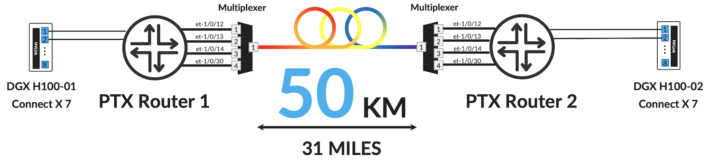
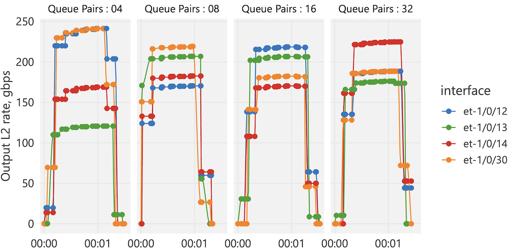
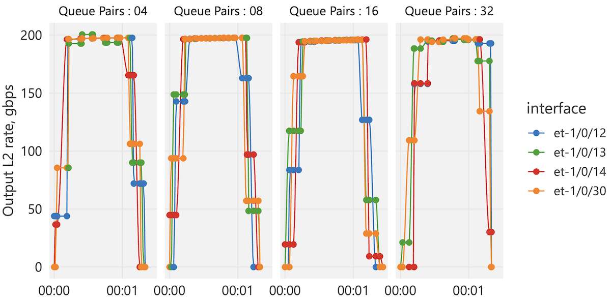
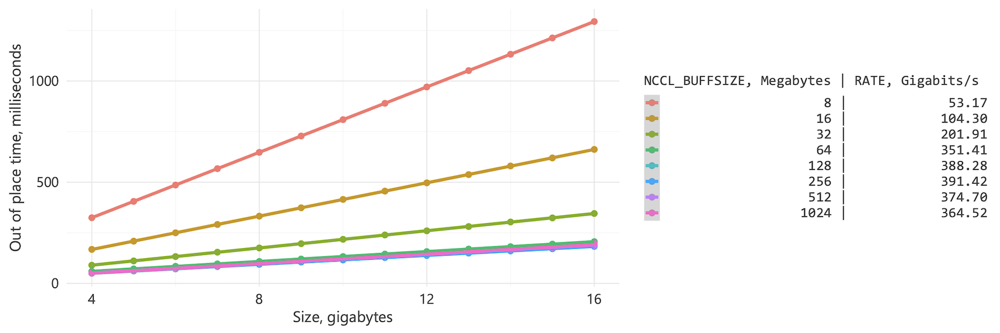
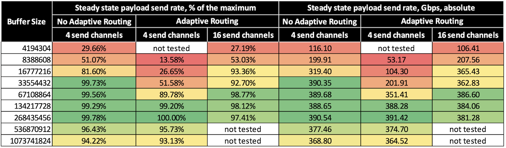

# Training over 50km 800GE Links with PTX Routers

**Dmitry Shokarev - 10/28/2025**

Can we run distributed training between clusters located 50 km apart? How do we interconnect these sites? Do we need to tweak the collectives library and the NIC settings to run training jobs? And provision anything special on the router side?

This article shows how PTX routers make it happen: secure, cost-efficient interconnects with 800 GE ZR optics and perfectly uniform load balancing across all links. We wrap it up with NCCL all reduce validation results - proof that it works in the real world.

Article cross-posted in [Linkedin too](https://www.linkedin.com/feed/update/urn:li:activity:7389073296828395520/).

## Introduction

First, why do we need training over the long-distance links? The main reason is the facilities' limits in a single location, mainly the availability of power. That naturally constrains the size of the cluster, forces users to distribute clusters and interconnect them.

In this scenario, it is quite likely that the interconnect distance is tens of kilometers.

Longer distances have implications:

- Higher delays. There is a potential impact on the transfer efficiency and training times.
- Higher cost of the interconnect. Uniform link utilization is even more important to solve.

Let's study both and see if we have a solution.

## Solution Testbed

### Building Blocks

Figure 1 shows the diagram of the solution testbed.****



The following components are used in the solution:

- PTX routers. These are the flagship systems from HPE Juniper Networking for the WAN, AI Data Centers and Data Center Interconnect. We are using 28.8T LC1301 line cards that offer 36x 800GE ports, MACSec encryption and high-power 800GE ZR optics support on every port.
- Nvidia DGX with Connect X 7 NICs, firmware version 28.39.3560.
- Nvidia Collective Communication Library, version 2.18.3.
- Passive DWDM multiplexers.
- 50KM fiber spool.

### Test methodology

In our verification, we run standard NCCL all reduce performance test. In all tests, two GPUs per DGX are in use, four GPUs total. Each GPU is connected through 400Gbps Connect X NIC to the PTX router.

NCCL automatically picks ring topology in this scenario. Up to 800Gbps of traffic may be transmitted between the sites in each direction during training. We need to solve several problems though: load balancing and the NCCL performance tuning.

Let's start with the Load Balancing.

### Load Balancing

Training traffic is bursty and typically involves only a few flows, making effective load balancing difficult even within a single cluster. When clusters are connected over longer distances, bandwidth becomes a costly resource, therefore simple overprovisioning isn't an option.

Let's first try to run the training job without any special configuration, using per-flow load balancing.

In our test setup, the expected average traffic rate over the long-distance link is around 200 Gbps. The traditional approach is to load balance per flow, where each queue pair represents one flow. To evaluate this method, we varied the number of queue pairs using the ***NCCL_IB_QPS_PER_CONNECTION*** environment variable. To distribute traffic over all queue pairs, ***NCCL_IB_SPLIT_DATA_ON_QPS*** was set to 1.

Figure 2 shows output rates across four PTX Spine 1 interfaces connected to PTX Spine 2. Each panel corresponds to an NCCL all reduce test run with a different number of queue pairs.



Queue pairs are allocated per channel, and the actual number of queue pairs in transmit direction is four times higher, because in this topology NCCL creates four channels per direction.

As seen from the test, large imbalance is registered with 4 queue pairs only, and it is improving with more queue pairs. However, in case of the 32 queue pairs, maximum interface utilization is slightly higher than in 8 and 16 queue pairs runs,we were unlucky this time.

Is there a better solution? Reliable unordered delivery and packet spraying is by far the most promising technique. It is currently being standardized in the UEC Transport Working Group, but proprietary implementations do exist today:

- Mellanox / NVidia Connect X NICs Adaptive Routing.
- AMD Pollara Out of Order Delivery.

We are using Nvidia Connect X in our setup and let's see how Nvidia Adaptive Routing performs.

Figure 3 shows long-distance interface utilization with adaptive routing enabled.



The utilization is uniform! See practical guidelines about reliable unordered delivery configuration on both Connect X and PTX routers at the end of this document.

But here is the catch, we were able to reach the maximum utilization shown above only by tuning NCCL settings. Why was this required?

Delay is the problem, more on that in the next section.

### Delay Impact

With the 50KM fiber spool, end-to-end delay is dominated by the signal propagation delay, which is 245 microseconds in our case. Packet serialization plus latency through routers are insignificant contributors with less than 3% of the overall end-to-end delay.

Delays impact the operation of the network stack:

- First, at transport level. Each queue pair has maximum number of unacknowledged packets in flight. With higher delays, the maximum number of packets in flight becomes the factor limiting the transmission rate.
- Second, at application level, NCCL in this case. NCCL utilizes pipelined architecture, where computation and data transfer is happening in parallel. To achieve maximum performance, there should always be enough data on the receive side to perform the computation. NCCL utilizes so-called "channel buffers" that senders can use in advance. The computation starts after the data is received; then the computation results are transferred to the next destination. All these operations are happening using the same buffer, and only after all operations complete, the buffer will be released, so the sender can use it again. NCCL uses a separate communication channel to report buffer availability to the sender. The time it takes to fill in the buffers and release them is a function of the transmission delay. Larger delays can be compensated by larger buffers.

Let's dive into transport-level delay impact, first.

We are using unordered delivery / adaptive routing, and in this mode Connect X tracks unacknowledged packets on transmit side within a small window.

[Nvidia documentation ](https://enterprise-support.nvidia.com/s/article/How-to-Enable-Disable-Lossy-RoCE-Accelerations)suggests the size of the window is configurable and can be changed from 256 to 512 values, however our observations show that transmission performance remains the same when this setting is changed, at least with the firmware we used.

We were able to reach ~32Gbps transmission rate per single queue pair using ***ib_write_bw*** tool over 50km distance.

And this roughly corresponds to 512 unacknowledged packets:

- 245 microseconds transmission delay of the original packet and the same amount for acknowledging the reception. Therefore, it takes 490 microseconds before the sequence number is re-used.
- Each packet has 4096 worth of data and 4194 bytes with all L1 to L4 overheads included.
- Expected packet sequence number space = (observed 32 Gbps x 245 microseconds x 2 round trip) / (4194 bytes x 8 bits) ~ 467 packets. Rounding to the nearest power of 2 produces 512. The difference between 467 and 512 can be attributed to latency through the router, NIC processing times and other factors.

Therefore, to send data at 400Gbps rate over 50km link, we need at least 400Gbps / 32Gbps ~ **13 queue pairs**. In our subsequent tests we will use at least 16 queue pairs per link.

NCCL application-level performance for all reduce collective is more difficult to predict. But we found it is controlled by two parameters:

- Number of concurrent channels, configured via ***NCCL_MIN_CTAS*** environment variable.
- Buffer size per channel, configured via ***NCCL_BUFFSIZE*** environment variable.

Initially, we conducted the test with default number of channels in our configuration with 4 GPUs: 8 per GPU, 4 for sending data and 4 for receiving data.

We did vary the ***NCCL_BUFFSIZE*** and performed it across multiple array sizes from 4GB to 16GB.

Figure 4 shows the time in milliseconds to complete the transaction, each point on the plot represents a measurement, the color corresponds to a different buffer size, and lines represent linear regression over points of each color.



As expected, completion time is a linear function of the array size. The slope of the line represents the steady state transmission rate, and this number is shown (in gigabits) in the legend. This steady state rate is a simple performance metric, and we want to ensure it is close to the theoretical maximum value, which is around 390Gbps (for each 4096 bytes of the payload, there are 98 bytes of the overhead when adaptive routing is enabled, excluding the packets with acknowledgements).

We performed more experiments with different ***NCCL_BUFFSIZE*** and ***NCCL_MIN_CTAS*** configurations, see Table 1.



As seen from the results, the performance is nearly reaching maximum with 128MB buffers when adaptive routing is enabled.

The difference between the adaptive routing and non-adaptive routing performance at smaller buffer sizes is hard to explain, and we could not troubleshoot it and find the rational explanation. However, the results show that training over WAN is possible, but it requires NCCL parameters tuning.

So, the conclusion is, it works!

In the following sections, you will find practical configuration examples of the packet spraying configuration on the PTX router, plus corresponding Connect X configuration.

## Packet Spraying on a PTX Router

This [article](https://juniper.github.io/techposts/to-spray-or-not-to-spray/article) explains in detail the principle of the adaptive routing in Nvidia's implementation from the network perspective.

In this implementation, Connect X behavior has minimal deviations from the standard Infiniband transport specification, the NICs only use different RDMA write op-code that includes the additional header with the target memory address.

In short, the network equipment should be intelligent enough to identify eligible packets and spray them.

Non-eligible packets should be load balanced using regular ECMP.

### Packet Identification

To identify interesting packets, we are using a filter configured on the interface towards the GPU in the input direction.

```
/* Filter Definition */
firewall {
    family inet {
        filter gpu-input {
            term write-only {
                from {
                    protocol udp;
                    destination-port 4791;
                    /* 10 is the RDMA_WRITE_ONLY opcode */
                    first-byte-of-payload 10;
                }
                then {
                    routing-instance spraying;
                }
            }
            term default {
                then accept;
}}}}
```

Note the "**spraying**" instance action, we will come to that later.

Then the filter is applied to an interface. We are using a cool JUNOS configuration groups feature to apply repetitive configurations to multiple objects, in this case interfaces, at once.

```
groups {
    gpu-intf {
        interfaces {
            <et-*/*/*> {
                speed 400g;
                unit 0 {
                    proxy-arp unrestricted;
                    family inet {
                        filter {
                            input gpu-input;
}}}}}}}
apply-groups gpu-intf;
```

Another interesting tidbit, GPU interface addresses are allocated from the same subnet, this is to conserve address space, but at the same time we are not creating a L2 bridge domain, and we use proxy-arp instead. This simplifies router's configuration, management and troubleshooting, similar idea is presented [in our CDN solution](https://juniper.github.io/techposts/layer-3-solution-for-the-cdn-gateway/article).

Now, the spraying instance has a copy of all routes (for simplicity, ISIS routes in our case).

```
routing-instances {
    spraying {
        instance-type forwarding;
        routing-options {
            instance-import all-routes;
        }
    }
}
policy-options {
    policy-statement all-routes {
        term default {
            from instance master;
            then accept;
}}}
```

But when we export them into the forwarding table (another cool Juniper router feature!), we selectively enable random load balancing only for those routes exported into spraying instance and per-flow load balancing is enabled for all other routes.

```
routing-instances {
    spraying {
        instance-type forwarding;
        routing-options {
            instance-import all-routes;
        }
    }
}
policy-options {
    policy-statement lb-policy {
        term spraying-rib {
            from rib spraying.inet.0;
            then {
                load-balance random;
                accept;
            }
        }
        term default {
            then {
                load-balance per-flow;
}}}}
routing-options {
    forwarding-table {
        export lb-policy;
    }
}}
```

As a summary:

- The filter identifies eligible traffic and directs it into a separate spraying instance.
- This instance keeps a copy of the routes which are tagged for spraying.
- When traffic is forwarded over this instance, the Express silicon lookup processor picks random spraying load balancing function for the tagged routes.

Voila! We have perfect balance!

### Nvidia Connect X NIC Configuration

To enable adaptive routing on Connect X we are using the configuration below:

```
#!/bin/bash

for bcd in $(for id in {0..7}; do ethtool -i gpu${id}_eth | grep bus-info: | awk '{ print $2 }'; done);do
        echo $bcd
        mlxreg -d $bcd --reg_name ROCE_ACCL --set "adaptive_routing_forced_en=0x1" -y
done;

exit
```

However, you may need to use the firmware that supports it (we are using 28.39.3560).

Also, [a post on Nvidia support site](https://forums.developer.nvidia.com/t/bluefield3-cx7-roce-adaptive-routing-configuration-adaptive-routing-forced-en-issue/330488/3) suggests that the feature is only enabled if the NIC is attached to the Nvidia switch.

Practically, this means there must be a Nvidia switching layer between the NIC and the PTX router in the actual deployment.

## Useful links

- [To Spray or Not to Spray](https://juniper.github.io/techposts/to-spray-or-not-to-spray/article)
- [Layer 3 solution for CDN gateway](https://juniper.github.io/techposts/layer-3-solution-for-the-cdn-gateway/article)

## Glossary

- CDN: Content Delivery Network
- ECMP: Equal Cost Multi Path
- GPU: Graphical Processor Unit
- NIC : Network Interface Card
- NCCL : Nvidia Collective Communications Library
- RDMA: Remote Direct Memory Access
