# Trio 6 Packet Walkthrough

**David Roy - 10/31/2024**

A transit packet walkthrough inside an MX Series Trio 6 ASIC, with all the internal details on the different memory and components involved in the process.

This article has been co-written by David Roy and Nicolas Fevrier. It's the first post of a Series on the Trio 6 "packet walkthrough". The next articles will treat more specifically the host path and "for-us" packets, the packets with tunnel and service interfaces, the life of a multicast packet, and the replication.

## Introduction

The Trio chipset is a true run-to-completion Packet Forwarding Engine (PFE) powering the MX Series. The latest revision of the ASIC is Trio 6 and you can find it in multiple routing devices such as the MX304 and MX10000 line cards like LC4800 and LC9600.

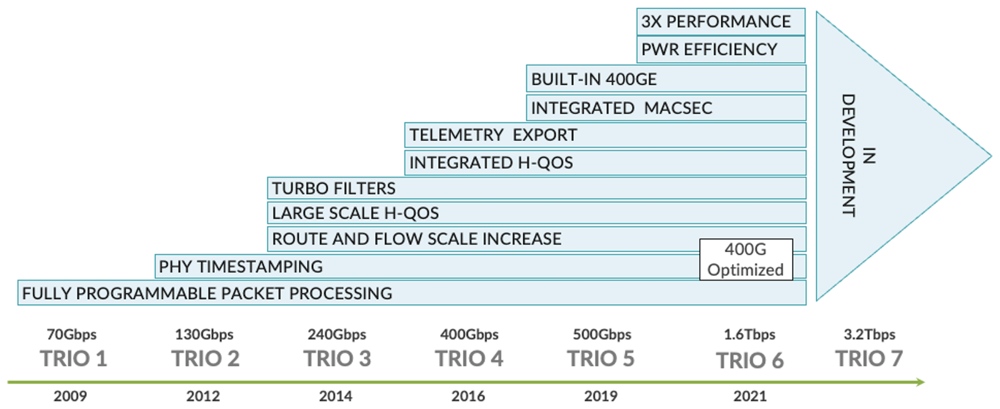

This article will describe in detail the internal components of the chipset and will follow a unicast packet transiting through the router between two different Packet Forwarding Engines (PFEs).

## High-Level ASIC Description

Trio 6 is primarily derived from the previous Trio5 ASIC, with enhanced performance. It is a 7-nanometer chipset operating at an internal clock speed of 1.2 GHz and offering a full-duplex bandwidth of 1.6 Tbps.

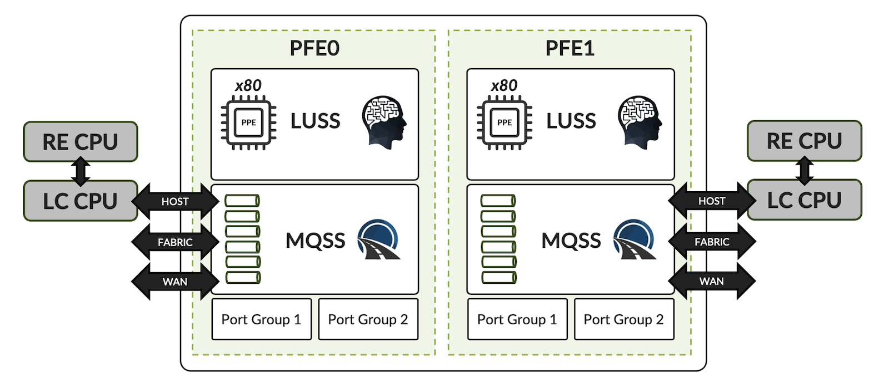

In Figure 2 above, we see the package is composed of two slices, known as PFE (Packet Forwarding Engine), with a capacity of 800 Gbps each. It may seem a bit counter-intuitive for the first-time user, who could consider the entire chipset to be a PFE. But from the Operating System perspective, in CLI outputs, the slice is seen as an individual PFE.

The PFE consists of two main functional blocks:

- The MQSS (Memory and Queueing SubSystem) provides WAN and fabric connectivity. It manages queueing and implements Class of Service
     - 64,000 WAN queues per slice (128k per Trio 6)
- The LUSS (Look Up SubSystem) serves as the brain of the ASIC:
     - Each LUSS contains 80 packet processor engines (PPEs).
     - Each PPE can be multi-threaded in 20 "contexts"
     - Other internal components are instrumental in Trio 6 chipset:
- Packets, cells, and data structures are stored in on-chip memory (SRAM) and off-chip memory (external HBM2 present in the package)
- Connectivity between components and optical cages is guaranteed by SerDes (Serializer-Deserializer):
     - 32x WAN SerDes supporting speeds up to 56Gbps
     - 48x 56Gbps Fabric SerDes
- Other connectivity:
     - 2x 10Gbps Ethernet for Host Path
     - 2x PCIe Gen2 connection (total 10Gbps)

Certain functions are accelerated by dedicated hardware elements:
- The FLT block is shared between the two slices and is in charge of the filtering.
- Each slice has a dedicated crypto engine for IPsec inline functions. MACsec is supported on all ports.

The MQSS acts as the packet router: it is connected to all interfaces, including the WAN and fabric ports, but also to a dedicated interface called the "host path", primarily used for conveying control and management plane traffic. The second article in this series will be dedicated to this host path.

You may also notice that the WAN ports are divided into two groups, a topic we will discuss shortly.

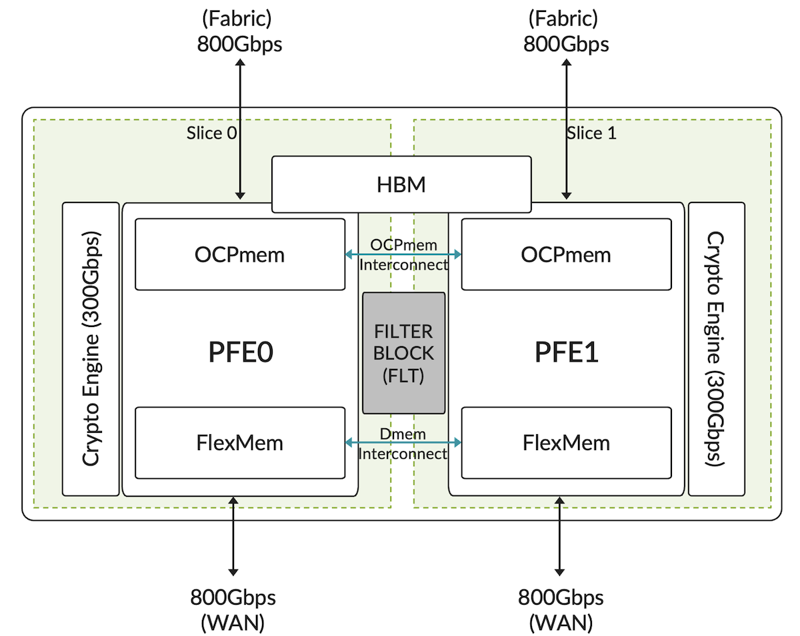

Figure 3 presents another illustration of the internal architecture of the Trio 6 ASIC where we included the Filter (FLT) block in the middle and the crypto blocks on the side of each slice.

A couple of key points:

- Intra-slice forwarding does not require a fabric
- Inter-slice forwarding utilizes the fabric interface, there is no direct data path between the two slices on a given Trio 6.
- Trio 6 does not support back-to-back connectivity, a feature expected to be available in the upcoming Trio 7 ASIC.
- Control and management plane packets can be generated directly by the LUSS, or the ASIC itself. This is the case for features such as inline BFD, jflow, IMON, packet mirroring, and others.
- All tunnels and inline services are managed by the LUSS.

## Internal Resources

The two slices share some common resources. Let's take a closer look at them.

Each slice of the Trio 6 ASIC contains high-speed internal memory with moderate capacity and has access to an external HBM storage, which offers slightly lower bandwidth but significantly larger storage capacity. These two types of memory are partitioned, with most partitions shared between the two slices. Each internal memory partition has a corresponding partition in the external HBM.

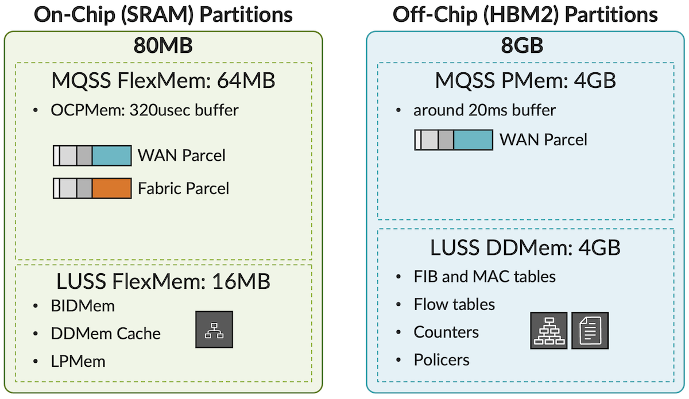

For instance, to store packets in transit, we have 64 MB of On-Chip Flex Memory (**FlexMem**), with 32 MB allocated per slice, providing approximately 320 microseconds of Delay Bandwidth Buffer (DBB). This is where packets are stored within the router under normal conditions. In a congestion situation, this memory begins to fill up, packets are offloaded to the external memory in the **PMem** partition, which has about 4 GB of storage, equivalent to around 20 milliseconds of DBB.

In summary, packets entering and leaving a WAN port are stored in either the **OCPMem** or the **PMem**, depending on the router's load. Packets that need to be forwarded through the fabric (from one PFE to another PFE) remain on-chip in the MQSS FlexMem.

The LUSS block also has its dedicated internal memory for storing data structures such as internal Trio objects, some FIB routes, or filter programs. The main LUSS FlexMem is the **BIDMem**, which provides ultra-fast access to the most frequently used structures. Its equivalent in the external memory is **DDMem**, with 4 GB per Trio 6. This larger memory stores various elements, including the full FIB. It's important to note that this memory is shared between the two PFEs (slices) and contains only one copy of the FIB for both slices. Additionally, the LUSS has an internal **DMem Cache** that enhances the **BIDMem**.

In summary, the data structures are distributed between BIDMem and DDMem based on scale.

Table: Trio 6 Memory Types

| Memory Types | Description |
|:--|:--|
| FlexMem | Flexible Memory |
| HBM | High-Bandwidth Memory |
| OCPMem | On-Chip Packet Memory |
| Pmem | Packet Memory |
| BIDMem | Big Internal Data Memory |
| DDMem | DRAM-based Data Memory |
| DDMem Cache | DRAM-based Data Memory Cache |
| LPMem | Link Pointer |

## Port Groups

A Trio 6 chipset is made of two PFEs with a capacity of 800 Gbps of WAN connectivity each, themselves internally divided into two port groups. These port groups or "PGs" can forward up to 400 Gbps individually. It's made of eight SerDes we can operate at different speeds, from 10Gbps to 56Gbps. Clubbing these SerDes, we can offer an Ethernet port of various speeds, from 10 GbE to 400 GbE. But it's not very efficient to use a 56Gbps-capable lane at 10Gbps, that's why we will often use an additional part called PHY (or sometimes "reverse gearbox" to increase the fan-out of lower-speed ports, down to 1GbE.

Each PG is mapped (directly or through a PHY) to physical cages where the optic modules will be inserted. For example, on MX304 LMIC, we have four ports per PG and two PGs per slice, resulting in eight ports per slice and 16 ports per Trio 6 / LMIC.

The WAN ports of a PG may share the 400 Gbps bandwidth with other internal interfaces too, like loopback and host path. This is illustrated in table 2 below:

Table: Trio 6 Port Groups

| Port Group (PG) | Type of Internal Interface | Maximum Bandwidth |
|:--|:--|:--|
| 0 | Loopback | 400Gbps (200Gbps for LT) |
| IPsec Loopback | 300Gbps (150Gbps bi-dir) |  |
| Host Ethernet (control plane to/from LCPU --> RE CPU) | 10Gbps |  |
| Host Interface (PCIe DMA like FIB Programming) | Around 10Gbps |  |
| 1 | Loopback | 400Gbps (200Gbps for LT) |

PG0 (Port Group 0) shares its bandwidth between WAN ports and several other internal interfaces:

- Loopback interfaces, used to recirculate packets when enabling LT interfaces or inline services
- IPsec crypto engine.
- Host interface, carrying control plane or management plane traffic.
- Another interface typically used for reprogramming the ASIC.

Similarly, the WAN ports connected to PG1 (Port Group 1) share their bandwidth with a second host loopback interface.

Please note: the bandwidth listed in Table 2 represents the maximum bandwidth that a given internal interface could use. This bandwidth is not reserved nor guaranteed:  it is dynamically allocated and shared based on demand.

## Life of the Transit Packet

### Ingress PFE

In this section, we will see how the transit packets will be handled by the MQSS and LUSS functional blocks. We'll use a 250-byte long unicast packet for the illustration, received on an ingress port of PFE0 and forwarded to its destination via an egress port on PFE1

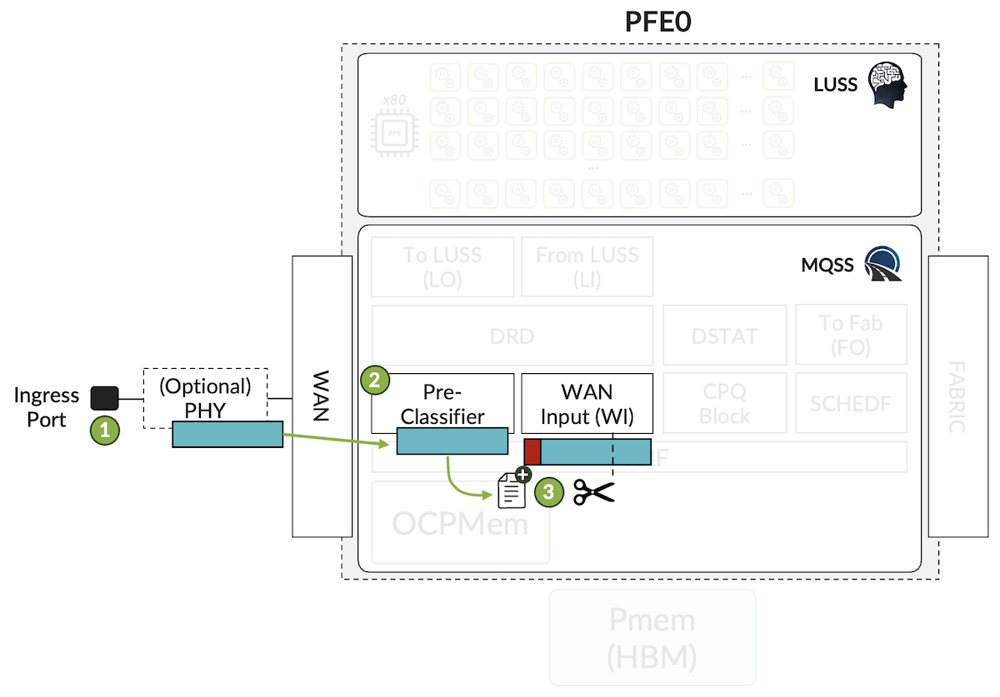

**Step 1**: The physical port receives a 250-byte-long packet

**Step 2**: The MQSS receives this packet, and passes it to the pre-classifier. Based on well-known fields in the header, it determines whether the packet carries control or management plane information. If that's the case, the packet is assigned internally to a stream called "control". All other transit packets are assigned to a "best-effort" (BE) stream. This pre-classification is hardcoded and should not be confused with classical BA (Behavior Aggregate) classifiers or multi-field classifiers used for CoS (Class of Service). The purpose of this step is to make sure the MQSS or LUSS has the highest possible chance to handle control packets when the PFE runs out of resources.

**Step 3**: Once pre-classified, the packet is passed to the WAN Input (WI) block. This block is responsible for multiple tasks, including the flow control management.

If the packet is larger than 225 bytes, we split it into two parts. The first 192 bytes represent the Head and the rest of the packet, is called the Tail. The head is enriched with internal metadata, forming a Parcel.

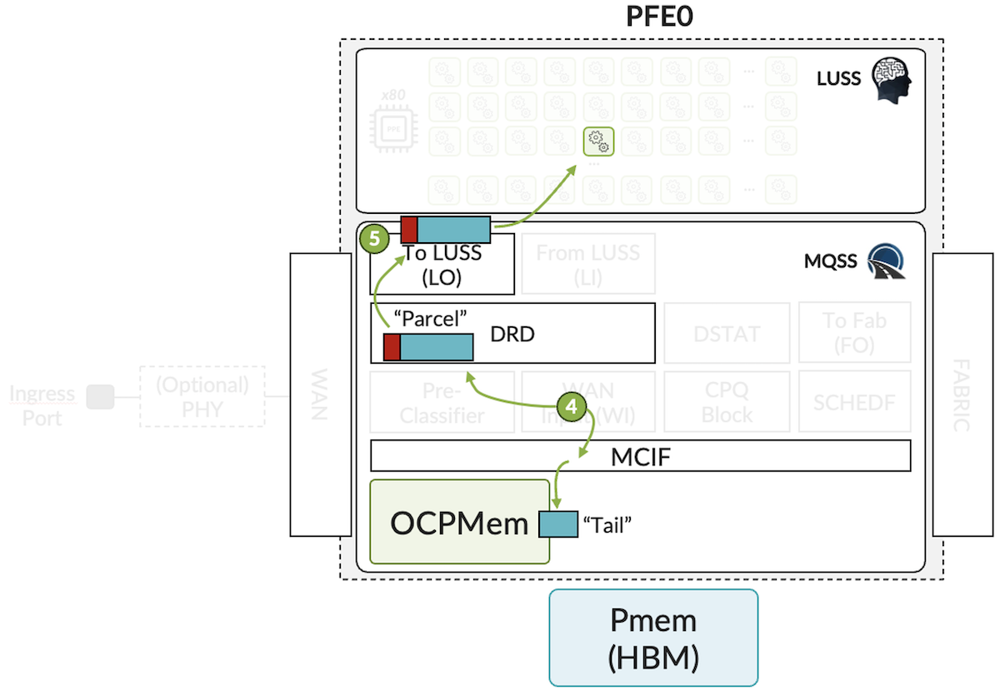

**Step 4**: Since the packet is 250 bytes long (>225), a split is performed

- The Tail is stored in the MQSS packet buffer into the internal Flex Memory.  The MCIF (Memory Control Interface) is the block controlling the read and write tasks in SRAM and HBM.
- The Parcel is sent to the dispatcher, the DRD (Dispatch and Reorder) block, which acts as an internal load balancer. It is also responsible for keeping packets in order in a flow. We have 80 PPEs (Packet Processing Engines), and 20 threads or contexts per PPE.

Within the LUSS, the order of packets within a given flow can be slightly modified, since they could be processed in parallel. It's DRD's job to make sure each packet is put back in its original order.

**Step 5**: The LUSS Output, or "LO" block serves as the interface between MQSS and LUSS. At this point, the Parcel is processed by the ASIC brain, the LUSS, which performs packet lookup and other functions.

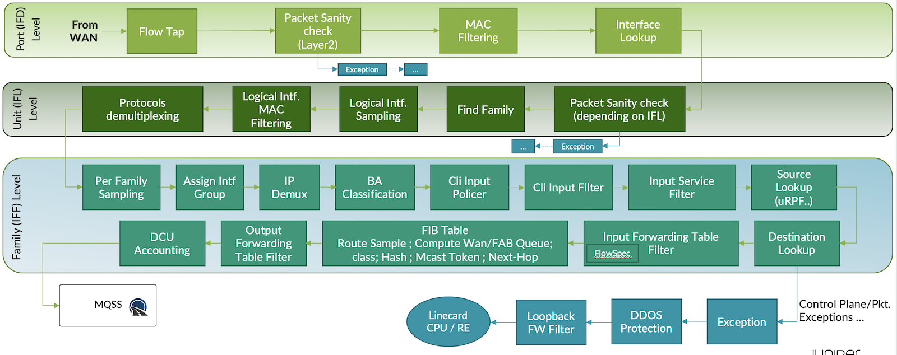

Let's delve into the LUSS, where each packet is handled separately by a thread of a PPE. Occasionally, a packet may require an additional thread, but this is only for very specific scenarios.

The Trio ASIC is a run-to-completion ASIC, meaning that a Parcel stays inside the LUSS until all features derived from the configuration are applied. The packet is processed by microcode, task after task, and may be modified: fields can be added, changed, or removed in the header, and new internal metadata is assigned to the Parcel. The result of the lookup determines which queue the packet is assigned to, its forwarding state, whether it needs to be dropped or forwarded, and so on.

Figure 7 illustrates the most common tasks performed by the LUSS. This diagram is NOT meant to be an exhaustive list of all LUSS functions. The order and number of tasks may vary depending on the configured features. This illustration showcases the adaptability of the LUSS packet processing.

Before going into more detail, a few words on the basic concepts that are IFD, IFL, IFF (and IFA).

I quote this article from Juniper Knowledge Base: [https://supportportal.juniper.net/s/article/Explanation-of-ifd-and-ifl-indexes-and-how-to-map-them-to-an-interface](https://supportportal.juniper.net/s/article/Explanation-of-ifd-and-ifl-indexes-and-how-to-map-them-to-an-interface) (credential may be required):

- IFD: Refers to a physical device
- IFL: Refers to a logical device
- IFF: Refers to an address family
- IFA: Refers to an address

ifd is the physical interface device, while ifl is the logical interface usually called unit.

Logical interfaces are always related to a physical interface. For example, interface ge-1/2/3 would be a physical interface, while ge-1/2/3.0 would be a logical unit.

```
interfaces {
     ge-1/2/3 {    /* ifd */
          unit 0 { /* ifl */
               family inet { /* iff */
                    address 10.1.2.3/24 { /* ifa */
                         primary;
                    } 
               } 
          } 
     } 
} 
```

Now presented the different interface levels, let's get back to our LUSS.

There are several levels of packet manipulation within the LUSS:

- 1. At IFD level: If the packet has not yet been assigned to a given logical interface or family, it is handled at the IFD level. The physical port, which could be a LAG, demux, or LT interface, is considered an IFD.
- 2. At IFL level: Once the packet has been associated with a logical port or unit, it is handled at the IFL level.
- 3. At IFF level: Finally, the packet is handled at the IFF level once it has been associated with a given family. For instance, an IPv4 packet is classified at the IFF level.

Based on the diagram in Figure 7, we can see that the BA classification is performed before the CLI input filter. This is why you can override the BA classification with an input firewall filter. Similarly, the CLI input filter is processed before another level of filtering called FTF, or "forwarding table filter." This is also where flowspec takes place. The diagram helps illustrate why an ingress static filter or policer could improve the overall performance of flowspec by pre-filtering well-known attacks.

The identification of the packet is done during the packet lookup. This means that if it's a transit, control, or management packet, it is detected here, and the packet is pointed to the CPU if necessary.

Now, let's assume that our parcel has been processed, some fields have been modified and updated, and new metadata has been added.

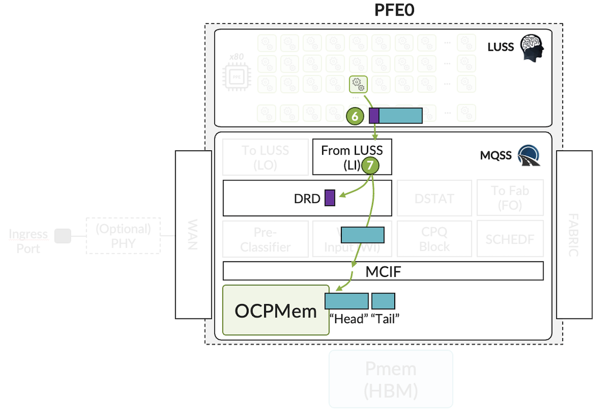

**Step 6**: The Parcel returns to the MQSS via the LI blocks.

**Step 7**:  The packet chunk (Head) contained in the Parcel is no longer needed for follow-up treatment in the ingress PFE. So the LI block moves the packet Head to the internal packet memory, via the MCIF, in case of inter-PFE forwarding. This is the scenario here, where the egress port is attached to a remote PFE. Only the metadata (shown in purple in the diagram) is retained now. This metadata has been updated with new information in the LUSS stages, like fabric token (forwarding next-hop info), FAB or WAN Queue Number, re-order ID, etc. The LI block creates also a packet descriptor, part of this metadata.

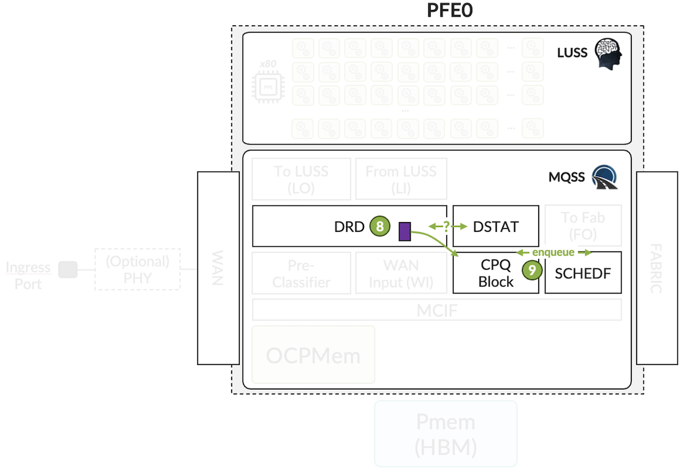

**Step 8**: Based on the metadata, and if necessary, the DRD block reorders packets of the same flow and asks DSTAT (Drop and Statistics block), whether the packet should be dropped or transmitted. If the drop is confirmed, resources are freed.

**Step 9**: If not, the CPQ (Chunk Pointer Queue) block is solicited to enqueue packet descriptor in the Fabric Scheduler (SCHEDF). This element uses the FAB Queue details provided by LUSS. We have 2 Fabric Queues per destination PFE, configurable via CoS: High and Low Priority (selected by default).

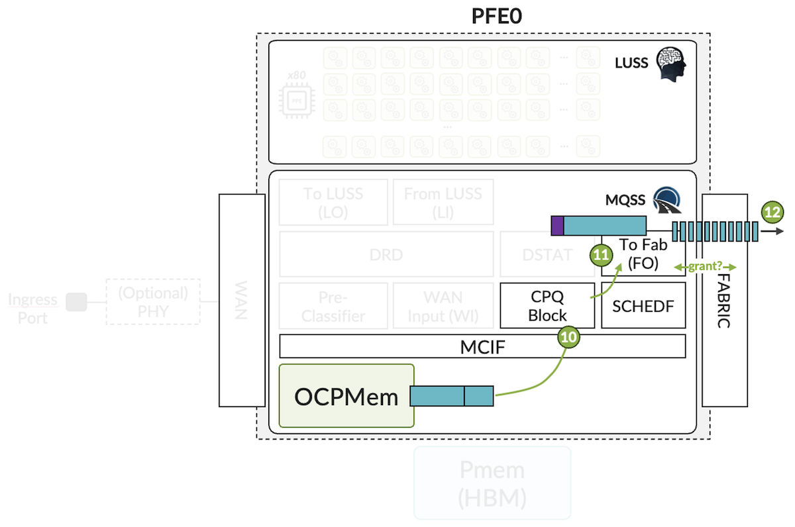

**Step 10**: Once the packet is eligible for transmission, CPQ(F) fetches it from Packet Memory and calculates the number of required cells to forward it to the fabric.

**Step 11**: The FO block requests from the fabric authorization to transmit cells to the remote PFE.

**Step 12**: If it receives a Grant message back from remote PFE, it splits the packet into fixed-size cells (64B), otherwise packet(s) are queued in the respective FAB Queue.

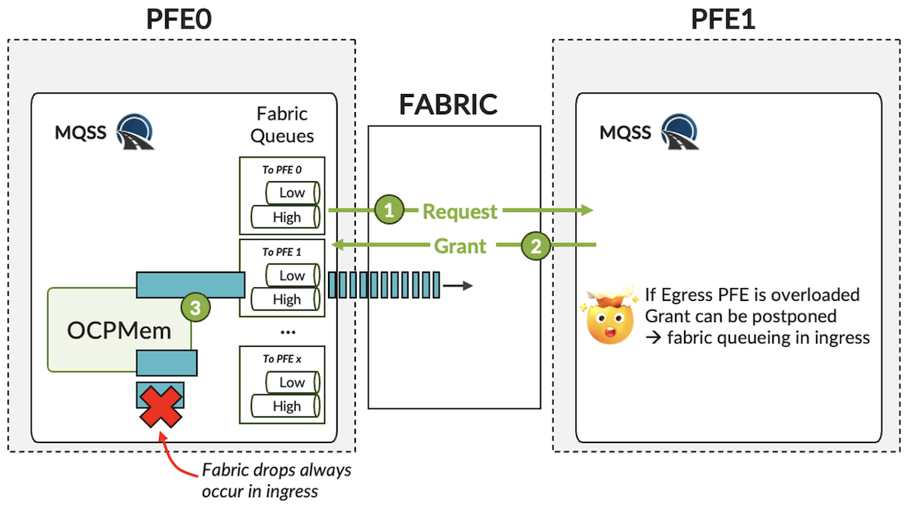

Let's take a moment to examine inter-PFE communication here. The MQSS maintains two fabric queues per remote destination PFE: a High-Queue and a Low-Queue:

- By default, most of the fabric DBB (96% of the Delay Bandwidth Buffer) is reserved for the High-Queue. The High-Queue primarily carries internal keepalive and critical messages, maintaining a clear view of the health of each PFE. High and Medium-High priority queues are also mapped to it.
- The rest of the transit traffic is carried in the Low-Queue.
- This default behavior can be changed by assigning a specific forwarding class to the High-Queue under the Class of Service (CoS) configuration.

Fabric queueing only occurs at the ingress side. Therefore, if you experience fabric drops, these drops will only be visible on the ingress PFE. However, fabric drops at the ingress do not always indicate ingress congestion. In most cases, the congestion is actually at the egress side. For example, multiple ingress PFEs trying to send traffic to a single egress PFE.

A fabric Request/Grant mechanism is used to manage this process. When a PFE needs to send a specific packet to another PFE, it needs to ask and obtain authorization. This ensures that the fabric resources are efficiently utilized and that packets are correctly forwarded to their destination PFEs.

In our case, we received the grant, split the packets into cells, and sent them over the fabric toward the egress PFE. Let's now examine what is happening in the egress PFE.

### Egress PFE

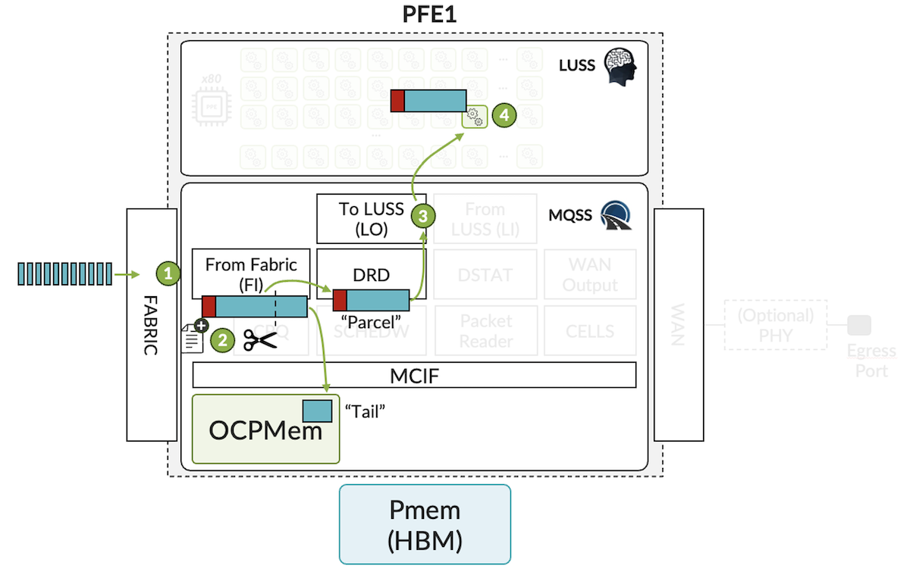

**Step 1**: Cells are received from the fabric into the input "From Fabric"(FI) block.

**Step 2**: Cells are combined to form the packet + metadata sent by the ingress PFE. In these first steps, we will repeat the same process executed in ingress: the packet is split into Head and Tail, if the packet is larger than 225 bytes, which is the case in our example, and the Tail is moved into packet memory via the MCIF.

**Step 3**: The Parcel (Head + metadata) is passed to the DRD where the ordering will be managed, and the LO block handling the interface to the egress LUSS is used to move it to an available context/PPE for Step 4.

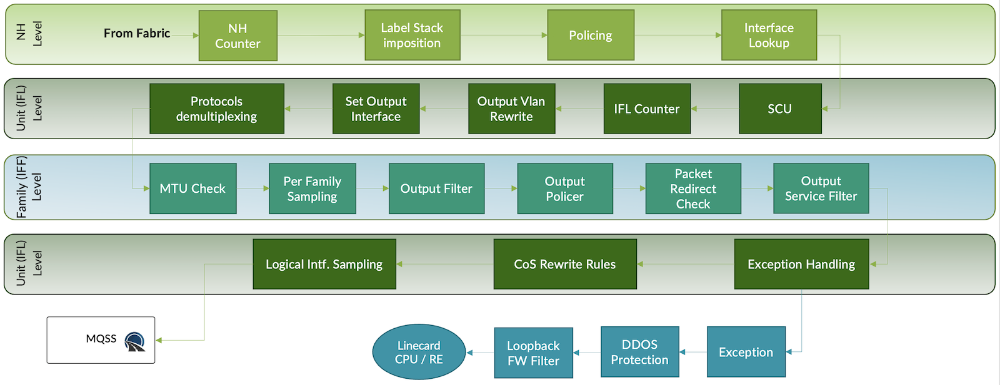

Inside the egress LUSS, many tasks must be completed again, depending on the router configuration. We listed the most common ones here and as mentioned earlier, this is a partial view for illustration.

Note: in most of the cases, there is no egress lookup since it has been performed by the ingress PFE and the result has been communicated via the fabric token. As often, exceptions exist for specific cases.

The egress PFE can perform egress sampling, reclassification, policing, or filtering and will prepend the layer 2 header to the packet, again, based on the result of the packet lookup performed in ingress.

In this egress LUSS stage, we added new metadata, such as the WAN queue number and the flow ID for re-ordering.

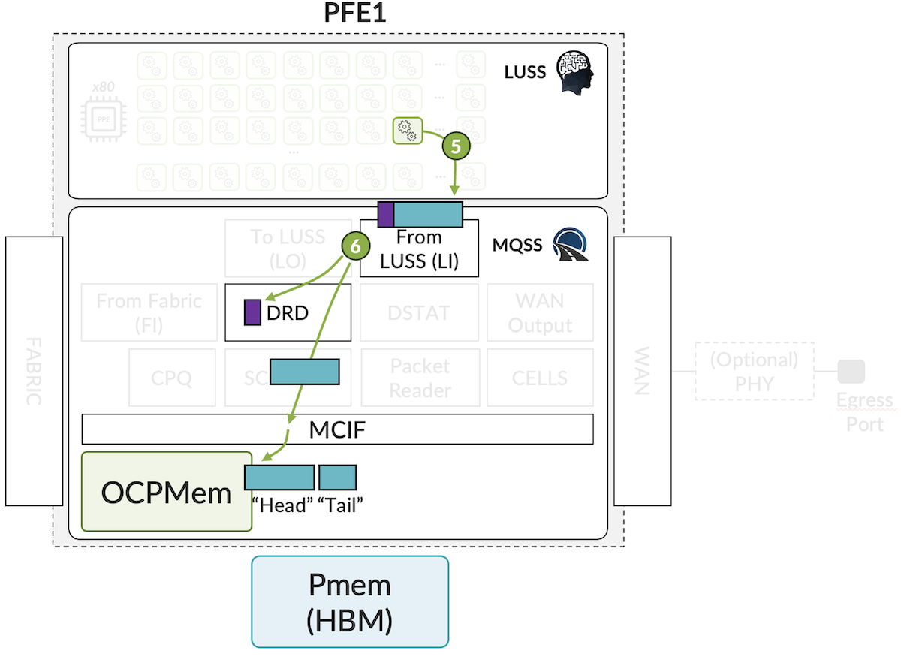

**Step 5**: The Parcel is sent back to the MQSS.

**Step 6**: The LI block moves the packet Head into the Packet Memory, thanks to the MCIF interface, creates a packet descriptor, and sends this metadata to DRD.

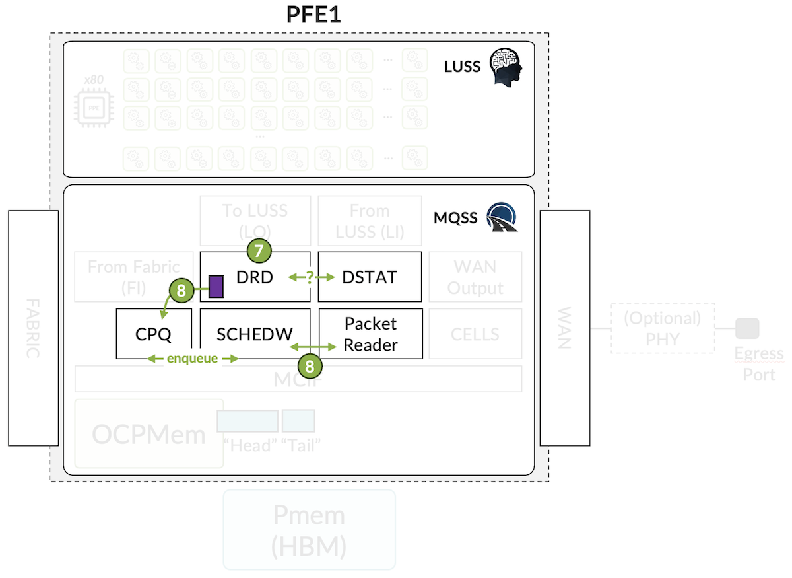

**Step 7**: Based on the packet description info, the DRD blocks reorders packets from the same flow and provides the packet's details (like the packet length, the WAN Queue number, ...) to the DSTAT block, asking whether the packet must be dropped or transmitted. If the drop is confirmed the resources are freed. Otherwise, the DRD pushes the packet descriptor to the CPQ block.

At this point, based on the OCPMem occupancy and the queue congestion level (current queue length), the entire packet could be moved to the external buffer PMem.

**Step 8**: The CPQ(W) notifies the WAN scheduler block (SCHEDW) to enqueue the data based on the descriptor. Up to 5 levels of CoS are supported here.

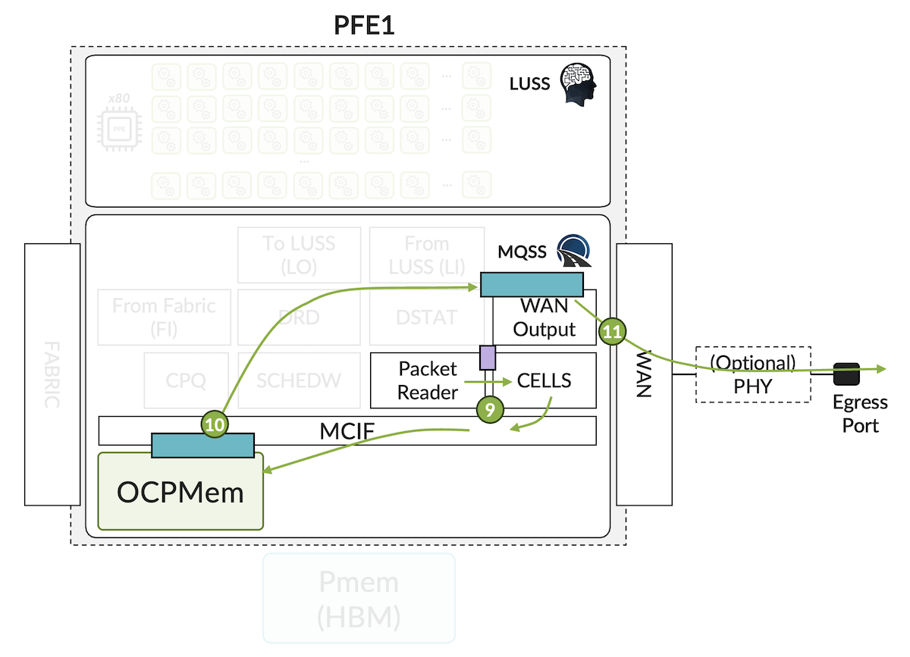

**Step 9**: The PR block notifies the CELLS block and provides information about the packet's chunks stored in Packet Memory (here in OCPMem). CELLS triggers the request to fetch the packet.

Multiple interactions between the Packet Reader, Cell, and WO blocks are happening here, resulting in the implementation of the Hierarchical QoS configuration and egress queuing management.

**Step 10**: MCIF returns the whole packet to WO.

**Step 11**: The packet is sent out from WO, and the MAC layer appends the FCS (4Bytes). After WO treatment, if needed, MACsec encryption is performed (in hardware).

## Conclusion

The Trio 6 ASIC marks a significant advancement in network processing, offering enhanced performance with infinite programmability, very high scale, and 1.6 Tbps full duplex bandwidth.

This first post described in detail the different resources used for packet forwarding in Trio 6 chipset and illustrated the life of a unicast packet received and transmitted on two different PFEs. The next article will present the specific case of traffic targeted to the router itself.

## Useful links

- Placeholder for article 2 on Host Path
- Placeholder for article 3 on LT Packet Walkthrough
- Placehollder for article 4 on Multicast Packet Walkthrough
- An Expert Packet Walkthrough on the MX Series 3D: [https://www.juniper.net/documentation/en_US/day-one-books/TW_MX3D_PacketWalkthrough.pdf](https://www.juniper.net/documentation/en_US/day-one-books/TW_MX3D_PacketWalkthrough.pdf)
- Inside the MX 5G: [https://www.juniper.net/documentation/en_US/day-one-books/DO_MX5G.pdf](https://www.juniper.net/documentation/en_US/day-one-books/DO_MX5G.pdf)
- Deepdive MX304: [https://juniper.github.io/techposts/mx304-deepdive/article](https://juniper.github.io/techposts/mx304-deepdive/article)
- Deepdive LC9600: [https://juniper.github.io/techposts/mx10000-lc9600-deepdive/article](https://juniper.github.io/techposts/mx10000-lc9600-deepdive/article)

## Glossary

- ASIC: Application-Specific Integrated Circuit
- BA: Behavior Aggregate (Policer)
- BE: Best Effort
- BFD: Bidirectional Failure Detection:
- BIDMem: Big Internal Data Memory
- CoS: Class of Service
- CPQ: Chunk Pointer Queue
- DBB: Delay Bandwidth Buffer
- DDMem: DRAM-based Data Memory
- DMem: Data Memory
- DRD: Dispatch and Reorder Block
- DSTAT: Drop and Statistics block
- FAB: Fabric
- FCS: Frame Check Sequence
- FLT: Filter Block
- HBM: High Bandwidth Memory
- IFD: Interface Physical Device
- IFF: Interface Address Family
- IFL: Interface Logical Device
- IMON: Inline Monitoring
- IPFIX: IP Flow Information Export
- LMIC: MX304 Interface Line Card
- LPMem: Link Pointer Memory
- LUSS: Look Up Sub-System
- MAC: Medium Access Control Address
- MCIF: Memory Controller Interface
- MQSS: Memory and Queuing SubSystem
- LI: "From LUSS" block, interface for LUSS to MQSS communication
- LO: "To LUSS" block, interface for MQSS to LUSS communication
- OCP: On-Chip
- PFE: Packet Forwarding Engine
- PG: Port Group
- PMem: Packet Memory
- PR: Packet Reader
- SCHEDF: Fabric Scheduler
- SCHEDW: WAN Scheduler
- SRAM: Static Random Access Memory
- WAN: Wide Area Network
- WI: WAN Input
- WO: WAN Output

## Acknowledgements

This article has been written by David Roy and Nicolas Fevrier. Thanks to Jeff Libby for the feedback and corrections.
