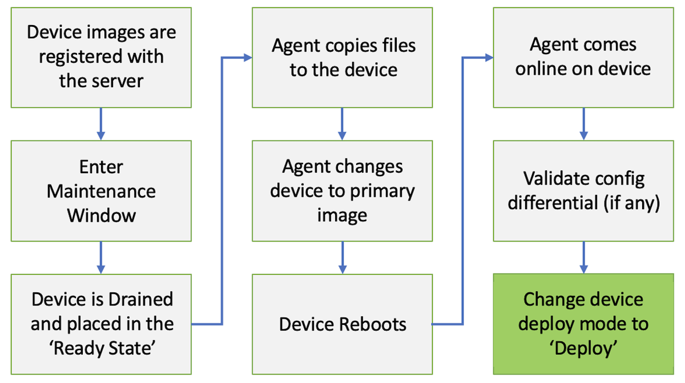
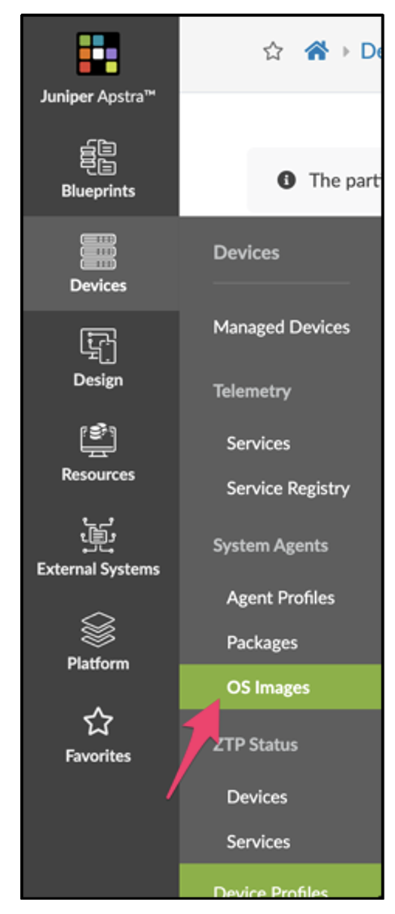
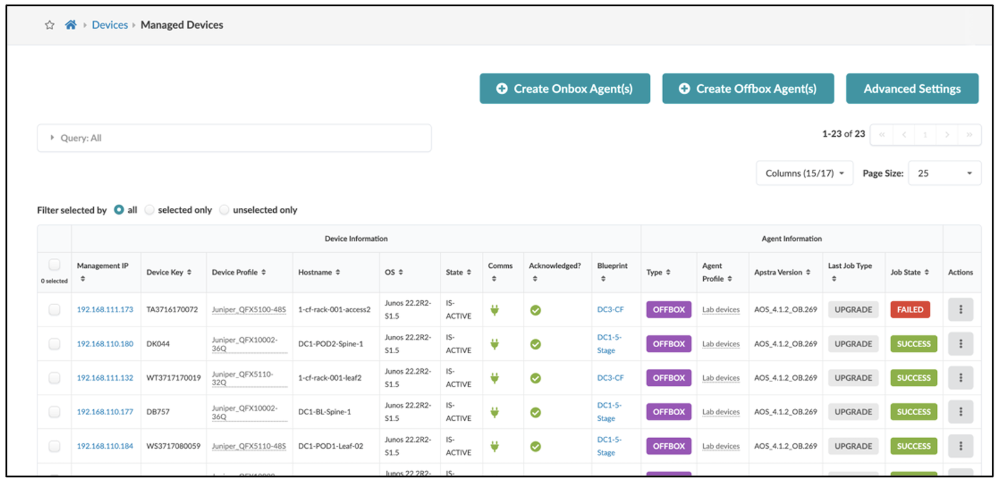
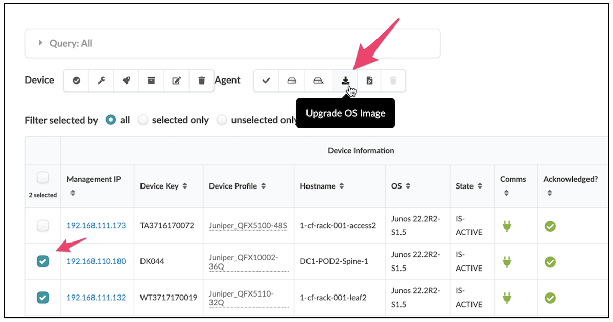
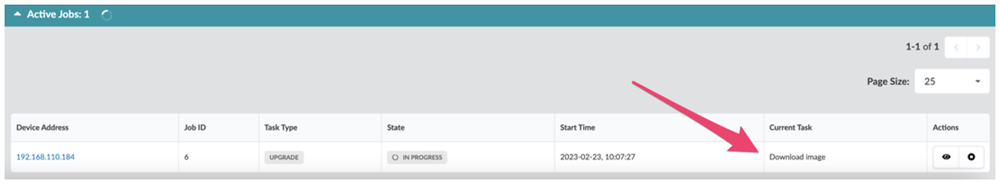
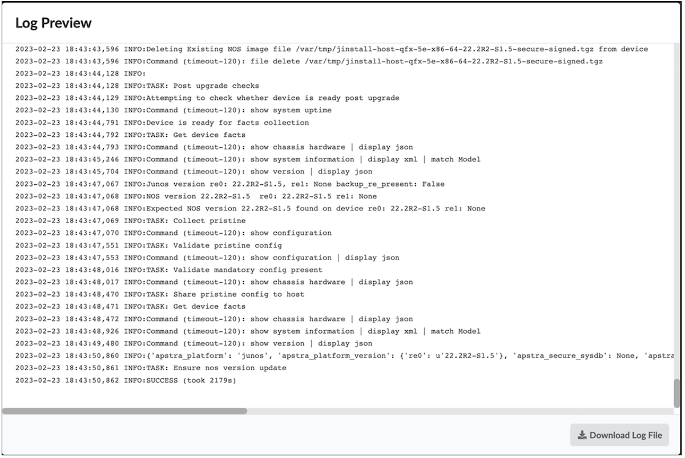

# Upgrading Device Operating Systems with Apstra

**Adam Grochowski - 01/09/2024**

Juniper Apstra supports Network Operating System (NOS) Upgrades for managed switches, allowing you to upgrade devices directly from the Apstra Server within a consistent workflow process.

*This document is based on original work by Josh Saul*

## Introduction

- Apstra supports NOS upgrades for the following platforms:
- Juniper Junos
- Cisco NX-OS
- Arista EOS
- SONiC (Dell or Edgecore)

> **Recommendation**: The Apstra workflow describes a process for taking (gracefully, where possible) a device out for maintenance. This workflow describes taking a device out-of-service for maintenance (or decommissioning) by using the Apstra Drain mode to remove all application traffic from the devices you wish to upgrade. Drain mode is covered in a separate TechPost on the Juniper Elevate site, and in the Apstra User Guide cited in the Useful References section at the end of this article.

## The NOS Upgrade Process

The following flowchart shows the high-level steps of the upgrade process. The following sections delve into more detail of the flow.



## Preparing for the Upgrade

### Register Device OS Images with the Apstra Server

The Apstra server stores the device os switch image in the following underlying directory (/opt/aos/frontend/www/dos_images/): The current options for switch image uploads are:

- JUNOS
- NXOS
- SONIC
- EOS



| Recommendation:  Register the Device OS images before any maintenance windows, as copying the files will take time. |
|:--|

### Check OS Storage on Devices

Before starting the OS upgrade, verify that there is enough space on each device. If disk utilization crosses the 90% threshold, Apstra warns you with a general message across the top of the UI. It also provides visual feedback on the OS Images page showing the amount of available space on the filesystem.


For Arista upgrades, you need enough FLASH space to fit three images, two for the current image (on boot Arista makes a copy), and one for the new upgrade image. Prior to downloading the new image, you must delete any *swi files that are not the current image and the future upgrade image to make space for the boot. If there's not enough space for the copy of the boot image, the upgrade will fail asking you to free up space. Otherwise, systems on the upgrade will end up in the Arista "aboot" prompt which is not desired.

### Check MLAG Devices for Upgrade Compatibility

Apstra does not currently have features to detect or remediate issues related to mixed-version MLAG pairs.  If you want to upgrade an MLAG pair, either upgrade both switches at the same time or take due care to review the vendor's known bug list for the versions in question to ensure that an MLAG peer group with mixed NOS versions can be supported.

> *Recommendation*:  Always review the known issues, bug list and caveats for each release to ensure that the active features will not be affected on devices.

### Upgrade Sequence

*Note: **you are responsible** for ensuring the proper switches are selected for redundant upgrades. Apstra does not verify the device redundancy status for the Device OS upgrade process.*

### Selecting Devices

You manage device operating systems from the Devices -> Managed Devices page.



Select devices (from the same platform) from the list of devices. All devices selected will be upgraded to the same registered OS image file.



Click the "Upgrade OS Image" button. If the set of devices is invalid, then an error dialog box explains why an upgrade cannot be initiated. For example, if you chose both EOS and Junos systems, then on Upgrade an error dialog appears indicating that different platforms were selected.

### Select Device OS Image

Assuming the selected devices are valid, a dialog presenting the list of registered OS images for that platform appears. Device selection is valid when all devices are the same platform, and that platform is in the supported set.

The Apstra GUI lists available Device OS images matching the selected Devices. Select a single image for the Device OS upgrade.

> *Note: You can use the same upgrade process to "downgrade" the Device OS.*

Click the "Upgrade OS Image" button. A new upgrade job is scheduled.

### Confirm Upgrade

1. Apstra confirms the Device OS upgrade with the user. Apstra lists the current and target Device OS for each device.
2. Apstra verifies available disk space for each device and deletes old images on the device to make room for the new image. At a minimum, Apstra keeps the current image. If Apstra is unable to make space is available for the device, Apstra displays an error for that device.

### Upgrade Status

On the list of Device Agents, the "Active Tasks" list will list the status upgrade tasks.



The Active Tasks list includes the following information:

- Management IP
- Job Type
- State
  - **In Progress** - take name shows the current upgrade action
  - **Success** - Device successfully reloaded, new Device OS image verified
  - **Failed** - Success criteria is not met within defined timeout, error message provides additional failure information
  Each platform provides numerous error messages for example:
    - Not enough space on device to upgrade OS.  Free up space.
    - file <image os name>  failed SHA512 verification

### Upload Image to Devices

Apstra will begin the process of upgrading the network devices.

1. Apstra uploads the target Device OS image to the device being upgraded from the Apstra server. Apstra simultaneously uploads as many as possible until the target device OS image has been uploaded to all devices in the upgrade group.
2. Device installer verifies the device OS image using the platform's SHA checksum convention.

If an error occurs during the upload process, an error is raised. You'll need to correct the error and resubmit a new upgrade.



**Arista**

```
localhost#routing-context vrf management 
localhost(vrf:management)#copy http://(aos-server-ip)/arista/vEOS-lab-4.20.1F.swi flash:
Copy completed successfully.    
```

**Cisco**

```
switch# copy http://(aos-server-ip)/cisco/nxos.7.0.3.I7.3.bin bootflash: vrf management
  % Total    % Received % Xferd  Average Speed   Time    Time     Time  Current
                                 Dload  Upload   Total   Spent    Left  Speed
100  918M  100  918M    0     0  5176k      0  0:03:01  0:03:01 --:--:-- 5722k
Copy complete, now saving to disk (please wait)...
Copy complete.
```

### Validate Checksum on the Device

If a checksum was provided during the image registration process, Apstra automatically validates the checksum of the uploaded file against the defined checksum. If the checksum does not validate the upgrade fails.

### Modify Boot Parameter and Reload the Device

Apstra automatically changes the boot file statements to match the new image that has been uploaded. Apstra reloads the network devices:

**Arista**

```
router#conf t
router(config)#boot system flash:vEOS-lab-4.20.1F.swi
router(config)#exit
router#reload now
```

**Cisco**

```
switch# install all nxos bootflash:nxos.7.0.3.I7.3.bin
switch# reload now
```

Once the device upgrade is complete, the upgrade process verifies that the device is back online.

### Accept Device Config Diffs

In various operating systems, some parts of the running configuration may change - for example, boot filename, boot time, MLAG neighbor version, and sometimes some configuration parts are cosmetically re-ordered. Some devices, including Cisco NX-OS, will report a new version, and Apstra will treat it as a configuration anomaly. You can accept this as the new Pristine Config by going into the device and clicking the Accept Changes button after reviewing the configuration changes. These changes are mostly cosmetic and safely accepted. Apstra does not automatically accept these cosmetic changes in case there is something Apstra doesn't recognize, so you must approve them.

### Device Certification

The admin validates and certifies the device. The device can be augmented with custom IBA probes.  After the devices come online after rebooting, we recommend doing the following:

- Check for generic anomalies
- Check for configuration differential anomalies
- Resolve config diff anomalies (after review) by clicking "Accept Changes"
- Reenable any paused IBA probes related to this device
- Place the device into the Ready state before switching to the mode to Deploy

### Restore the Device to Service

In the blueprint the device is assigned to, switch the device Deploy Mode from Drain back to Deploy and commit.

### Advanced Workflow Script Example

This workflow is an example of how to perform a rolling upgrade of the NOS in a fabric. You can leverage Apstra APIs to automate this process outside of Apstra.

1. Select all devices of role "spine"
2. Drain Device1
3. Wait for no anomalies
4. Change the device to ready
5. Wait for no anomalies
6. Upgrade NOS
7. Wait for system-agent to complete the upgrade process, with devices ending in READY status in system-agent UI
8. Potential Config Diffs - User Intervention
9. Accept Changes
10. Change the device to Deploy
11. Wait for no anomalies
12. Select Device2
13. Repeat

## Summary

Juniper Apstra automates NOS upgrades of devices in its fabric so that the upgrade is monitored and errors or resource limitations are easily identified. Aside from the upgrade itself, the end goal is to ensure that the NOS and the device configuration remain fully in compliance with Apstra and Apstra control of the fabric remains complete.

## Useful links

- The Apstra User Guide contains full overage of NOS upgrades:
[https://www.juniper.net/documentation/us/en/software/apstra4.1/apstra-user-guide/topics/topic-map/device-nos-upgrade.html](https://www.juniper.net/documentation/us/en/software/apstra4.1/apstra-user-guide/topics/topic-map/device-nos-upgrade.html)
- Apstra Drain Mode is also covered in the User Guide:
[https://www.juniper.net/documentation/us/en/software/apstra4.1/apstra-user-guide/topics/task/device-drain.html](https://www.juniper.net/documentation/us/en/software/apstra4.1/apstra-user-guide/topics/task/device-drain.html)

## Glossary

- MLAG: (aka MC-LAG) Multi-Chassis Link Aggregation Group
- NOS: Network Operating System
- SHA: Secure Hash Algorithm
- UI: User Interface

## Acknowledgments

This document is based on original work by Josh Saul
