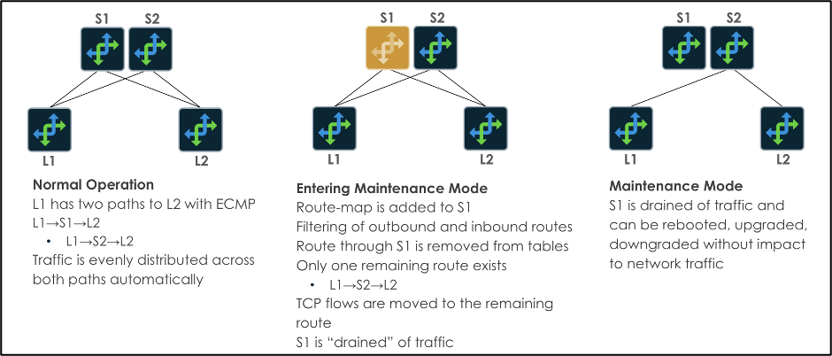
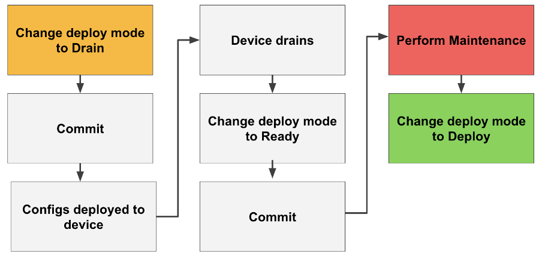
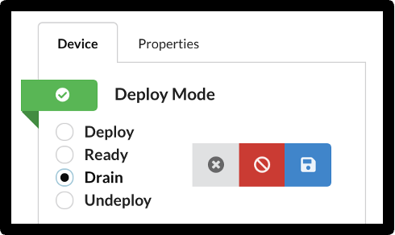
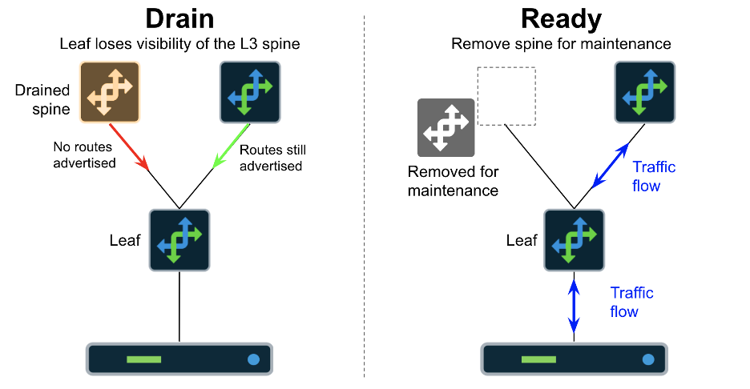
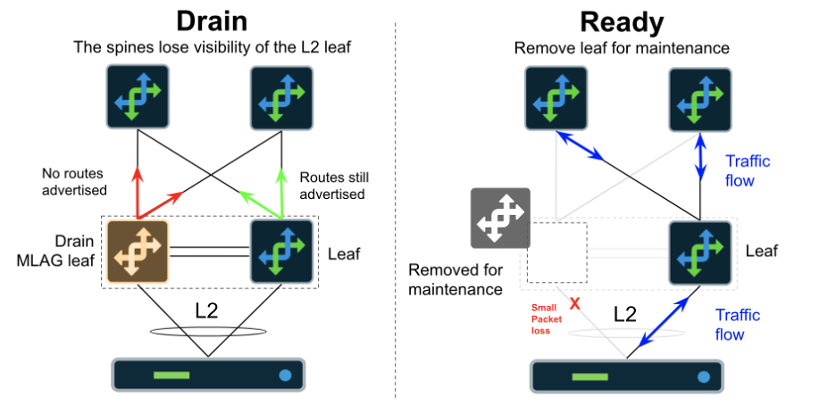
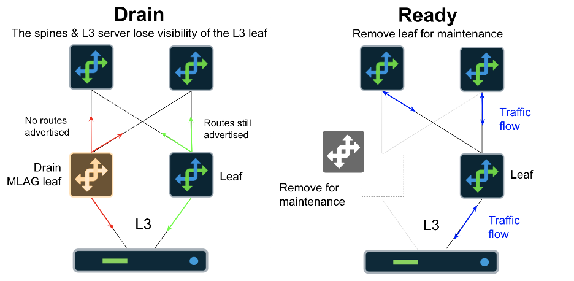

# Using Apstra Drain Mode

**Jeffrey Doyle - 11/16/2023**

Apstra supports Drain Mode for managed switches, allowing the operator to gracefully drain traffic from devices without simply shutting down the BGP neighbor relationships.

This article is derived from original documentation by Josh Saul

## Introduction

This is implemented through modifications to the BGP process (inbound/outbound route-maps) and shutting down connected L2 server ports and MLAG peer link ports.  By using Drain Mode, operators can minimize the number of dropped/lost traffic during these operations.  During maintenance, redundancy is handled by ECMP/MLAG as long as there are suitable redundant systems in place.  A visual example of Drain Mode on Spine switches is displayed below:



The workflow described in this document is summarized below:



## Activating Drain Mode

Drain Mode is activated by switching devices to the Drain state in Apstra:



Once the device is switched to Drain, the change must be completed with the Commit button.

## Disabling Drain Mode

To restore a device to service, switch the Deploy Mode setting back to Deploy, then commit.

## IBA Monitoring of Devices in Drain Mode

You can activate a predefined IBA (Intent-Based Analytics) probe in Apstra, named "Drain Traffic Anomaly."  The required value for **Threshold in bps** works as follows:

- Value is the net sum of traffic on all hosted_interfaces
- This does not include traffic on the Ethernet management port which is not part of the probe measurement
- These interfaces include all L3 BGP-enabled paths
- Server-facing interfaces are shut during Drain Mode and are not part of this calculation
- The threshold describes the amount of traffic you wish to be alerted on (above the value) if devices are in the Drain state
- This ensures that you do not perform actual maintenance operations on a device that has not been fully drained.

## Example

Spine1 is connected to 4 leaf switches, each connection runs the eBGP routing process.  All application (server) based traffic flows will be rehashed via ECMP onto other links, the basic BGP neighbor updates will still be running.  In a lab example with a small topology, this is effectively 1.5KBPS per link.  With 4 neighbors, the total traffic we expect to remain on the devices is approximately 6KBPS.  If we set the probe** Threshold in bps** to 10KBPS (10000), the probe will generate anomalies if there is more than 10K on all of the 4 interfaces combined.

### Recommended Usage

Enable the probe with 100KBPS and leave it running in all blueprints.  When a device enters the Drain state, you will see an anomaly as the traffic is removed from the links.  This anomaly should only exist for a few seconds.  If the anomaly does not clear, the device is not fully in Drain Mode.  Once the anomaly clears, you can switch the device to the Ready state to take it out of service completely. You may not see the anomaly as it may appear and quickly disappear.

## Configuration Examples

### Spine (L2 and L3 Blueprints)

For this operation:

- A route-map is placed on the Spine switch on all BGP neighbors, restricting inbound and outbound routes

What happens:

- Outbound routes are removed from the device's routing table
- Routes to destinations with the device's ASN in the AS_PATH are removed from all devices in the network
- Packets are forwarded through the remaining ECMP paths for all destinations
- It is highly unlikely that a single in-flight packet will be lost. However, this is dependent on the L3 ECMP to L2 path hashing algorithms in the hardware and NOS



Drain NX-OS

```
ip prefix-list Drain seq 5 permit 0.0.0.0/0 le 32
route-map Drain deny 10
  match ip address prefix-list Drain
  exit
!
  neighbor 172.16.0.1 remote-as 64514
    address-family ipv4 unicast
      route-map Drain out
      route-map Drain in
      exit
    exit
  neighbor 172.16.0.3 remote-as 64514
    address-family ipv4 unicast
      route-map Drain out
      route-map Drain in
      exit
    exit
```

Drain Junos

```
[edit policy-options]
+   route-filter-list Drain {
+       0.0.0.0/0 upto /32;
+   }
[edit policy-options]
+   policy-statement Drain {
+       term Drain-10 {
+           from {
+               family inet;
+               route-filter-list Drain;
+           }
+           then reject;
+       }
+   }
[edit protocols bgp group l3clos-s neighbor 172.16.0.7]
+     import ( Drain );
-     export ( SPINE_TO_LEAF_FABRIC_OUT && BGP-AOS-Policy );
+     export ( Drain );
[edit protocols bgp group l3clos-s neighbor 172.16.0.9]
+     import ( Drain );
-     export ( SPINE_TO_LEAF_FABRIC_OUT && BGP-AOS-Policy );
+     export ( Drain );
[edit protocols bgp group l3clos-s neighbor 172.16.0.11]
+     import ( Drain );
-     export ( SPINE_TO_LEAF_FABRIC_OUT && BGP-AOS-Policy );
+     export ( Drain );
[edit protocols bgp group l3clos-s-evpn neighbor 10.0.0.0]
+     import ( Drain );
-     export ( SPINE_TO_LEAF_EVPN_OUT );
+     export ( Drain );
[edit protocols bgp group l3clos-s-evpn neighbor 10.0.0.1]
+     import ( Drain );
-     export ( SPINE_TO_LEAF_EVPN_OUT );
+     export ( Drain );
[edit protocols bgp group l3clos-s-evpn neighbor 10.0.0.2]
+     import ( Drain );
-     export ( SPINE_TO_LEAF_EVPN_OUT );
+     export ( Drain );
```

### Leaf (L2 Server Facing Ports with MLAG)

For this operation:

- A route-map is placed on all BGP neighbors restricting inbound and outbound routes
- Server facing interfaces are shutdown
- MLAG peer interfaces are shutdown

What happens (L3):

- Outbound routes are removed from the device's routing table
- Routes to destinations with the device's ASN in the AS-PATH are removed from all devices in the network
- Packets are forwarded through the remaining ECMP paths for all destinations
- It is highly unlikely that a single in-flight packet will be lost. However, this is dependent on the L3 ECMP to L2 path hashing algorithms in the hardware and NOS

What happens (L2):

- The server interface to this device will go DOWN
- Packets from the server that happen to be hashed onto this device via MLAG may be dropped depending on where they are in the forwarding process
- Packets from the server that happen to be hashed onto this device via MLAG may be forwarded over the MLAG peer link depending on where they are in the forwarding process
- Flows will be re-established on the alternate MLAG interfaces
- New flows will be established on the remaining MLAG interfaces



Drain (NX-OS)

```
interface Ethernet1/1
  shutdown
  exit
!
interface Ethernet1/2
  shutdown
  exit
!
interface port-channel1
  shutdown
  exit
!
ip prefix-list Drain seq 5 permit 0.0.0.0/0 le 32
ipv6 prefix-list DrainV6 seq 5 permit 0::0/0 le 128
route-map Drain deny 10
  match ip address prefix-list Drain
  exit
!
route-map DrainV6 deny 10
  match ipv6 address prefix-list DrainV6
  exit
!
router bgp 64514
  neighbor 10.0.0.0 remote-as 64512
    address-family l2vpn evpn
      route-map Drain out
      route-map Drain in
      exit
    exit
  neighbor 172.16.0.0 remote-as 64512
    address-family ipv4 unicast
      route-map Drain out
      route-map Drain in
      exit
    exit
```

Drain (EOS)

```
interface Ethernet5
 shutdown
 exit
!
interface Ethernet6
 shutdown
 exit
!
interface port-channel1
 shutdown
 exit
!
interface port-channel2
 shutdown
 exit
!
ip prefix-list Drain seq 5 permit 0.0.0.0/0 le 32
route-map Drain deny 10
 match ip address prefix-list Drain
 exit
!
router bgp 102
 neighbor 10.10.4.0 route-map Drain out
 neighbor 10.10.4.0 route-map Drain in
 neighbor 10.10.4.8 route-map Drain out
 neighbor 10.10.4.8 route-map Drain in
 default neighbor 10.10.4.19 route-map MlagPeer out
 neighbor 10.10.4.19 route-map Drain out
 neighbor 10.10.4.19 route-map Drain in
!
```

Undrain (NX-OS)

What happens (L2):

- The server interface to this device will go UP
- New flows will be hashed onto the newly available MLAG interface

```
interface Ethernet1/1
  no shutdown
  exit
!
interface Ethernet1/2
  no shutdown
  exit
!
interface port-channel1
  no shutdown
  exit
!
no ip prefix-list Drain seq 5 permit 0.0.0.0/0 le 32
no ipv6 prefix-list DrainV6 seq 5 permit 0::0/0 le 128
no route-map Drain deny 10
!
no route-map DrainV6 deny 10
!
router bgp 64514
  neighbor 10.0.0.0 remote-as 64512
    address-family l2vpn evpn
      default route-map Drain out
      default route-map Drain in
      exit
    exit
```

Undrain (EOS)

What happens (L2):

- Server interface to this device will go UP
- New flows will be hashed onto the newly available MLAG interface

```
interface Ethernet5
 no shutdown
 exit
!
interface Ethernet6
 no shutdown
 exit
!
interface port-channel1
 no shutdown
 exit
!
interface port-channel2
 no shutdown
 exit
!
no ip prefix-list Drain seq 5 permit 0.0.0.0/0 le 32
no route-map Drain deny 10
!
router bgp 102
 default neighbor 10.10.4.0 route-map Drain out
 default neighbor 10.10.4.0 route-map Drain in
 default neighbor 10.10.4.8 route-map Drain out
 default neighbor 10.10.4.8 route-map Drain in
 default neighbor 10.10.4.19 route-map Drain out
 neighbor 10.10.4.19 route-map MlagPeer out
 default neighbor 10.10.4.19 route-map Drain in
!
```

### Leaf (L2 Server Facing Ports no MLAG)

For this operation:

- A route-map is placed on all BGP neighbors, restricting inbound and outbound routes
- Server-facing interfaces are shutdown

Drain (Junos)

```
[interfaces replace: ae1]
+ disable;

[interfaces replace: xe-0/0/2]
+ disable;

[interfaces replace: xe-0/0/3]
+ disable;

[routing-instances blue protocols bgp group l3rtr neighbor 192.168.0.11]
- import ( RoutesFromExt-blue-Default_immutable );
- export ( RoutesToExt-blue-Default_immutable );
+ import ( Drain );
+ export ( Drain );

[routing-instances red protocols bgp group l3rtr neighbor 192.168.0.7]
- import ( RoutesFromExt-red-Default_immutable );
- export ( RoutesToExt-red-Default_immutable );
+ import ( Drain );
+ export ( Drain );

[protocols bgp group l3clos-l neighbor 172.16.0.2]
- export ( LEAF_TO_SPINE_FABRIC_OUT && BGP-AOS-Policy );
+ import ( Drain );
+ export ( Drain );

[protocols bgp group l3clos-l neighbor 172.16.0.8]
- export ( LEAF_TO_SPINE_FABRIC_OUT && BGP-AOS-Policy );
+ import ( Drain );
+ export ( Drain );

[protocols bgp group l3clos-l-evpn neighbor 10.0.0.3]
- export ( LEAF_TO_SPINE_EVPN_OUT && EVPN_EXPORT );
+ import ( Drain );
+ export ( Drain && EVPN_EXPORT );

[protocols bgp group l3clos-l-evpn neighbor 10.0.0.4]
- export ( LEAF_TO_SPINE_EVPN_OUT && EVPN_EXPORT );
+ import ( Drain );
+ export ( Drain && EVPN_EXPORT );

[protocols bgp group l3rtr neighbor 192.168.0.3]
- import ( RoutesFromExt-default-Default_immutable );
- export ( RoutesToExt-default-Default_immutable );
+ import ( Drain );
+ export ( Drain );

+ [policy-options route-filter-list Drain]
+ 0.0.0.0/0 upto /32;

+ [policy-options policy-statement Drain term Drain-10 from]
+ route-filter-list Drain;
+ family inet;

+ [policy-options policy-statement Drain term Drain-10]
+ then reject
```

Drain (NX-OS)

```
interface Ethernet1/41
  shutdown
  exit
!
ip prefix-list Drain seq 5 permit 0.0.0.0/0 le 32
route-map Drain deny 10
  match ip address prefix-list Drain
  exit
!
router bgp 64516
  neighbor 172.16.0.8 remote-as 64512
    address-family ipv4 unicast
      route-map Drain out
      route-map Drain in
      exit
    exit
  neighbor 172.16.0.22 remote-as 64513
    address-family ipv4 unicast
      route-map Drain out
      route-map Drain in
      exit
    exit
  exit
!
```

Drain (EOS)

```
interface Ethernet5
  shutdown
  exit
!
ip prefix-list Drain seq 5 permit 0.0.0.0/0 le 32
route-map Drain deny 10
  match ip address prefix-list Drain
  exit
!
router bgp 104
  default neighbor 9.0.0.1 route-map RoutesToExt out
  neighbor 9.0.0.1 route-map Drain out
  default neighbor 9.0.0.1 route-map RoutesFromExt in
  neighbor 9.0.0.1 route-map Drain in
  neighbor 10.10.4.4 route-map Drain out
  neighbor 10.10.4.4 route-map Drain in
  neighbor 10.20.30.4 route-map Drain out
  neighbor 10.20.30.4 route-map Drain in
  neighbor 10.10.4.12 route-map Drain out
  neighbor 10.10.4.12 route-map Drain in
  neighbor 10.20.30.5 route-map Drain out
  neighbor 10.20.30.5 route-map Drain in
  vrf Finance
    default neighbor 9.0.0.1 route-map RoutesToExt-Finance out
    neighbor 9.0.0.1 route-map Drain out
    default neighbor 9.0.0.1 route-map RoutesFromExt-Finance in
    neighbor 9.0.0.1 route-map Drain in
    exit
!
```

Undrain (NX-OS)

```
interface Ethernet1/41
  no shutdown
  exit
!
no ip prefix-list Drain seq 5 permit 0.0.0.0/0 le 32
no route-map Drain deny 10
!
router bgp 64516
  neighbor 172.16.0.8 remote-as 64512
    address-family ipv4 unicast
      default route-map Drain out
      default route-map Drain in
      exit
    exit
  neighbor 172.16.0.10 remote-as 64512
    address-family ipv4 unicast
      default route-map Drain out
      default route-map Drain in
      exit
    exit
  neighbor 10.0.0.1 remote-as 64513
    address-family l2vpn evpn
      default route-map Drain out
      default route-map Drain in
      exit
    exit
  neighbor 172.16.0.20 remote-as 64513
    address-family ipv4 unicast
      default route-map Drain out
      default route-map Drain in
      exit
    exit
  neighbor 172.16.0.22 remote-as 64513
    address-family ipv4 unicast
      default route-map Drain out
      default route-map Drain in
      exit
    exit
  exit
!
```

Undrain (EOS)

```
interface Ethernet5
  no shutdown
  exit
!
no ip prefix-list Drain seq 5 permit 0.0.0.0/0 le 32
no route-map Drain deny 10
!
router bgp 104
  default neighbor 9.0.0.1 route-map Drain out
  neighbor 9.0.0.1 route-map RoutesToExt out
  default neighbor 9.0.0.1 route-map Drain in
  neighbor 9.0.0.1 route-map RoutesFromExt in
  default neighbor 10.10.4.4 route-map Drain out
  default neighbor 10.10.4.4 route-map Drain in
  default neighbor 10.20.30.4 route-map Drain out
  default neighbor 10.20.30.4 route-map Drain in
  default neighbor 10.10.4.12 route-map Drain out
  default neighbor 10.10.4.12 route-map Drain in
  default neighbor 10.20.30.5 route-map Drain out
  default neighbor 10.20.30.5 route-map Drain in
  vrf Finance
    default neighbor 9.0.0.1 route-map Drain out
    neighbor 9.0.0.1 route-map RoutesToExt-Finance out
    default neighbor 9.0.0.1 route-map Drain in
    neighbor 9.0.0.1 route-map RoutesFromExt-Finance in
    exit
!
```

### Leaf (L3 Connected Servers)

For this operation: A route-map is placed on all BGP neighbors, restricting inbound and outbound routes



Drain (EOS)

```
ip prefix-list Drain seq 5 permit 0.0.0.0/0 le 32
route-map Drain deny 10
  match ip address prefix-list Drain
  exit
!
router bgp 102
  neighbor 10.10.4.0 route-map Drain out
  neighbor 10.10.4.0 route-map Drain in
  neighbor 10.10.4.8 route-map Drain out
  neighbor 10.10.4.8 route-map Drain in
  neighbor 11.0.0.1 route-map Drain out
  neighbor 11.0.0.1 route-map Drain in
!
Undrain (EOS)
no ip prefix-list Drain seq 5 permit 0.0.0.0/0 le 32
no route-map Drain deny 10
!
router bgp 102
  default neighbor 10.10.4.0 route-map Drain out
  default neighbor 10.10.4.0 route-map Drain in
  default neighbor 10.10.4.8 route-map Drain out
  default neighbor 10.10.4.8 route-map Drain in
  default neighbor 11.0.0.1 route-map Drain out
  default neighbor 11.0.0.1 route-map Drain in
!
```

## Summary

Generically, draining a device before taking it out of service is a standard operational procedure. Done "by hand," it involves reconfiguring the device's BGP so that traffic is directed away from the device -- that is, BGP within a fabric sees the device as the least desirable next-hop to any destination. The practice ensures that packets in-flight through the device are delivered, while no new packets are sent through the device, minimizing packet drops before taking the deice out of service.

Juniper Apstra quickly and easily automates the drain process, triggering the necessary configurations with a simple button click to put the device in Drain Mode and letting you know through a predefined IBA probe when drain is completed, another click to undeploy the device, and another click to redeploy the device when maintenance is completed.

## Useful links

- Apstra Drain Mode is also covered in the User Guide: [https://www.juniper.net/documentation/us/en/software/apstra4.1/apstra-user-guide/topics/task/device-drain.html](https://www.juniper.net/documentation/us/en/software/apstra4.1/apstra-user-guide/topics/task/device-drain.html)

## Glossary

- AS_PATH: BGP attribute tracking Autonomous System Numbers along a specific route
- ASN: Autonomous System Number
- BGP: Border Gateway Protocol
- eBGP: External Border Gateway Protocol
- ECMP: Equal-Cost Multipath
- IBA: Intent-Based Analytics
- MLAG: (aka MC-LAG) Multi-Chassis Link Aggregation Group

## Acknowledgements

This article is derived from original documentation by Josh Saul
