# Using Apstra Policy Assurance

**Dj Spry - 10/16/2023**

Apstra manages network security and workload isolation via the Policy Assurance feature.  This feature allows you to create policies that are decoupled from enforcement mechanisms and will enable the specification of the intent in an implementation-independent way.

## Background

Using Juniper Apstra and our Intent-Based Networking approach, you can make quick progress in terms of your security posture.  By avoiding some of the most common causes of security mishaps - including lack of visibility, consistency, accountability, and inability to resolve problems quickly - Apstra brings structure to the operational process by using one central source of reliable information. This helps maintain consistency in policies and workflows and allows for real-time testing and visibility. It also helps quickly identify and address any issues or security concerns that may arise.

The closed-loop capability in Apstra continuously provides assurance checks about the drift between the **intended "Golden Configuration"** and the operational state.  Compliance enforcement is done under real-time evaluation, and any violations are flagged to the user---no need for lengthy and tedious device-by-device, line-by-line auditing efforts. An audit trail feature allows you to track the origin and content of any change going through Apstra to the entire network. You can correlate any specific line of a device configuration change directly from the GUI to the actual operator intent and identity.

Apstra manages network security and workload isolation via the Policy Assurance feature.  This feature allows you to create policies that are decoupled from enforcement mechanisms and will enable the specification of the intent in an implementation-independent way. As a note, you can see demos of this feature in action at [https://www.juniper.net/us/en/dm/apstra-demos.html ](https://www.juniper.net/us/en/dm/apstra-demos.html)

## Introduction

Apstra manages network security and workload isolation through a Group Based Policy (GBP) framework.  This GBP framework has been around for a number of years, and variants of the concept of using endpoint/group-based policy specifications can be found in [OpenStack, for example](https://gbp.readthedocs.io/en/latest/usage.html). This feature allows you to create policies that are decoupled from enforcement mechanisms and allow specification of the intent in an implementation-independent way. Apstra's current reference design translates these policies into Access Lists (ACLs) for each supported vendor NOS. These ACLs are installed on the associated L3 interfaces, controlling traffic flows between virtual networks and external systems.

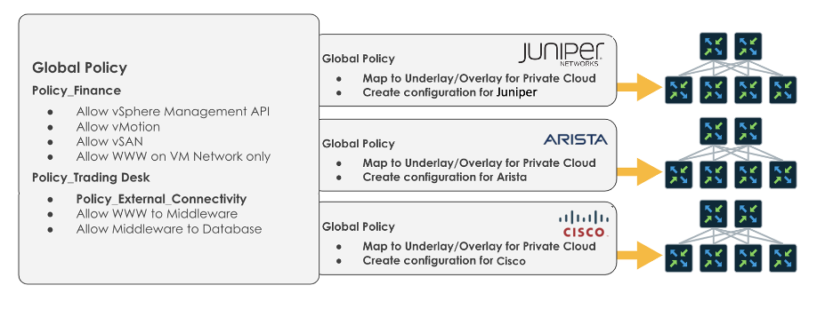

Security policies allow or block traffic between endpoints based on their IP addresses, port numbers, and protocols.  You create separate policies for each direction between endpoints, entire networks, or more specific host IP endpoints.  The order of the rules matters!  The security policies define permitted or denied communications in your data center fabric.  An easy way to think about this is with a human analogy:

- Party A - A group of people
- Party B - Another group of people
- Conversation - What can they talk about? Should we block all mention of sports?

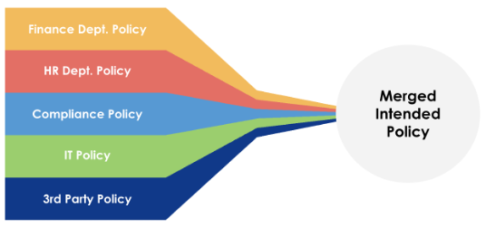

Policy Assurance is designed to keep you, the architect or administrator, "above the fray."  You do not want to get into the weeds of managing ACL intricacies or the differences between vendor syntax.

This feature allows you to create policies that are decoupled from enforcement mechanisms and will enable the specification of the intent in an implementation-independent way.

Apstra provides a simple user interface, or API, that allows you to define policies to control traffic flow between virtual networks and IP endpoints. Policy Assurance **radically simplifies the management of ACL and reduces ACL table size**. Apstra automatically composes ACLs and applies them to routed interfaces, such as Switch Virtual Interfaces (SVI) or Integrated Routing and Bridging (IRB) interfaces for internal or external connectivity.  ACLs are auto-rendered in the correct device syntax and applied to the relevant enforcement points.  Adding a new VXLAN Endpoint, such as a rack or leaf, to a virtual network automatically places the ACL on the virtual network interface. Furthermore, Apstra can **detect conflicts** when multiple policies applied within a Blueprint overlap and **automatically resolve the conflicts** based on user settings such as "More specific first" or "More generic first." You can search existing policies based on source/destination object and by type of traffic (protocol and port number) to determine if a particular traffic flow is affected by any active policies.

Further maintaining a responsive and effective security posture, Apstra ensures the network does not enter an open (free-flowing traffic) state while the rules are being provisioned. To minimize the potential impact on existing traffic flows of policy deployment, Apstra will automatically perform an** incremental ACL deployment** process for deploying policy changes on each enforcement point.

### Security Policy Benefits

- Simplicity
  - Vendor-agnostic GUI implementation for creating ACLs
- Introspection/visibility
  - Given an endpoint/group, what are all the policies that apply to it (security, reachability, QoS)
  - Given a policy, which endpoints/groups it applies to
- Conflict Detection (at the policy level)
  - Security conflicts, admission control constraints/priorities/pre-emption
- Conflict resolution
  - Defaults ("more specific wins," "override")

Apstra automates merging multiple policies and assists with conflicts in remediation (both automated and user resolved).  Policies are combined before device config rendering takes place, which ensures that Apstra can support rendering the final policy for multiple vendors. Apstra also ensures that the resulting vendor configuration syntax accurately reflects your intent.

Routing Policies are supported via Virtual Networks (VXLAN/VLAN) and Routing Zone (RZ), which are rendered as Virtual Routing and Forwarding (VRF) instances on physical devices.  A Role-Based Access Control (RBAC) model also controls user privileges per Blueprint, Routing Zone, or Virtual Network basis.

Apstra enables customers to create granular security policies and enforcement across the entire Data Center between these constructs.

## Security Policies

Security policies consist of a source point (subnet or IP address), a destination point (subnet or IP address), and rules to allow or deny traffic between those points based on protocol.  The policies and rules are stateless, meaning the network policy does not consider the previous state of network connections.  Instead, it makes decisions based solely on the characteristics of individual network packets, such as their source and destination addresses and ports.  Endpoints are administratively defined IP ranges within an Apstra Blueprint or external to the Blueprint.

Using an analogy, addresses within an IP network are like stations along train tracks - Policies utilize endpoints and endpoint groups to specify which sections of track, or IP ranges within a Virtual Network (VN), specific rules will apply to. If you aim to create a policy applied to an entire VN - think the whole rail network - you can consider endpoints optional because the policy will cover the entire IP address space within that VN.

Policies have five components:

- Source
- Destination
- IP Protocol
- Port
- Action (Permit, Permit & Log, Deny, Deny & Log)

Source/Destination objects within a policy can be selected from any of the following:

- Internal Endpoints
- Internal Endpoint Groups
- External Endpoints
- External Endpoint Groups
- Virtual Networks
- Routing Zones (all Virtual Networks within an SZ)

IP Protocol can be any of the following:

- IP
- TCP
- UDP
- ICMP

Ports can be individual port numbers (ex., TCP 22 for SSH) or ranges of ports.

The action component specifies the intended behavior of the rule when a packet that matches the four identifiers is detected. This behavior may include allowing the packet to pass through, blocking the packet entirely, or dropping the packet. Optionally you can add traffic logging in each policy, which will write the policy log locally to the network device.

Remember, for a bi-directional security, you need to create two policies, one for each direction, and you can apply more than one policy to each subnet/endpoint, meaning the ordering of rules impacts behavior.

### Policy Group Objects

Apstra provides policy constructs to express security/segmentation intent with different levels of granularity.

Endpoints/groups that are possible subjects of security policies are as follows:

- VN (virtual networks, contain subnet)
- IPE (internal IP endpoints associated with VN, have IP /32 address)
- IPECG (IP endpoints custom groups)
- EIPE (External IP endpoints, contain /32 or subnet)
- EIPCG (External IP endpoint custom groups)
- RZ (Routing Zone, logical collection of all VNs and IPE)

Segmentation and Policies have many available use cases.

- Customers have multiple vendor types and want simplified security management.
- Customers wish to isolate VMs and control the allowed application flows between VNs.

### Internal Endpoints

Internal Endpoints are IP subnets or individual IP **addresses within a virtual network that is part of the Apstra Blueprint**.  These addresses are associated with a VN but can be a smaller subnet of the larger VN.  For example:

- Virtual Network 100 (vlan100): 192.168.0.0/24
- Internal Endpoint: 192.168.0.128/26
- This correlates to the upper half of the full /24

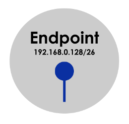

> Note: When creating Internal Endpoints, the defined IP range cannot overlap with the Apstra-configured SVI addresses used for VRRP.

### External Endpoints

External Endpoints are IP subnets that exist **outside of the Blueprint**.  These IP addresses are located beyond the Apstra external routers.  Examples of external endpoints include:

- NTP source (located outside of the Apstra Blueprint)
- NOC management subnet (located outside of the Apstra Blueprint)
- Trusted API endpoints (IP addresses or ranges) on the internet
- 3rd party IP addresses

### Internal Endpoint Groups

Internal Endpoint Groups combine multiple internal endpoints into a logical group that shares similar security requirements.  Using endpoint groups will simplify the management of policies within an enterprise environment.  Examples of effective use of Internal Endpoint Groups:

- All database servers
- Finance department servers

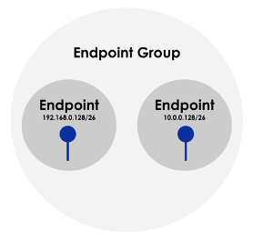

### External Endpoint Groups

External Endpoint Groups combine multiple external endpoints into a logical group that shares similar security requirements.  Using endpoint groups will simplify the management of policies within an enterprise environment.  Examples of effective use of External Endpoint Groups:

- Corporate NTP/DNS server (if these servers are not on the Apstra-managed fabric)
- Corporate Directory and Key servers (security)
- Partner API endpoint IPs (Internet)

Using groups in this manner, you can easily create a policy that states:

- Permit ALL servers to reach corporate NTP/DNS
- Deny ALL other NTP/DNS sources (by TCP ports)

Endpoint Group Notes:

- Group Based Policy elements, including endpoint groups, are defined within each Apstra Blueprint.

### Virtual Networks

Virtual Networks (VNs) are objects used to define all L2 and L3 endpoints within a VLAN or VXLAN.  Whereas Endpoint Groups define subnets within a Virtual Network, the VN correlates to all IP addresses within the network.

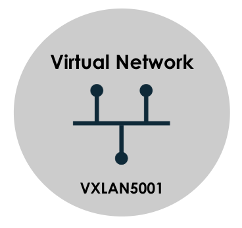

### Routing Zones

Routing Zones (RZ) are the highest-level objects.  RZ is directly aligned with a Virtual Routing and Forwarding instance (VRF).  VRFs offer isolation at the routing table level, separating tenants from being able to reach each other at L3.  VRFs do not directly provide encapsulation or encryption, the routing tables are entirely isolated, but packets in flight from multiple VRFs share the same forwarding plane.  As a best practice, Inter-VRF communication should be sent to a network firewall for stateful inspection.

## Enforcement Points

All connections to the external routers are enabled as Enforcement Points by default.  This includes:

- Physical interfaces
- 802.1q sub-interfaces

### Policy Enforcement

The policy is applied as an L3 ACL on the applicable Enforcement Points within a blueprint.  This means that the policy elements that are irrelevant to a particular enforcement point are not rendered.  This causes a radical simplification of the size of the final ACL.

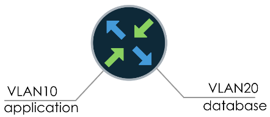

## Conflicts & Resolution

Apstra supports multiple policies applied to a single blueprint.  When conflicting or overlapping rules are present, a few different results can occur.  In some cases, Apstra can automatically resolve the policy conflict, while in other instances, user intervention is required to resolve the conflict.  Let's look at this in more detail.

### Overlapping Policies

An overlapping policy is when all the fields in the 5-tuple match another policy. The rules can have the same or different actions, such as "allow" vs. "deny." The following sections will cover different conflicts and resolutions.

1. Automatic ACL optimization by combining the two matching rules with the same action into a single rule (Shadow Rules)
2. Automatic resolution and rule ordering based upon the default Conflict Resolution setting chosen in the Policy Setting
3. Manual resolution when policies have overlapping rules with different actions that Apstra can't auto-resolve.

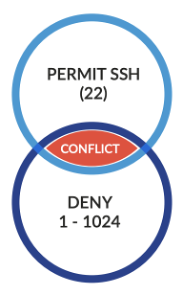

### Shadow Rules

Shadow Rules are policy rules that are covered by another larger policy rule.  Consider two different policies:

- Policy-A: Rule 10 - Permit SSH from VLAN10 to VLAN20
- Policy-B: Rule 20 - Permit TCP 1-1024 from VLAN10 to VLAN20

Since the rule in Policy-A is entirely contained within the rule in Policy-B, the first rule is redundant and does not need to be rendered in the final ACL.  When viewing a policy in Apstra, you will see "Shadowing" for rules that are considered Shadow Rules.

### Automated Resolution

Apstra can automatically resolve conflicts between multiple policies.  This capability is determined by global blueprint settings under Policy Settings, described below.

In this example, Apstra can auto-resolve the conflicts between the two policies.

- Policy-A:
  - Virtual Network `red_vxland_32_v4_1` <--> Virtual network `default-All 0.0.0.0/0`
  - deny TCP 443
- Policy-B:
  - Routing Zone `red` <--> Virtual network `default-All 0.0.0.0/0`
  - deny TCP 443

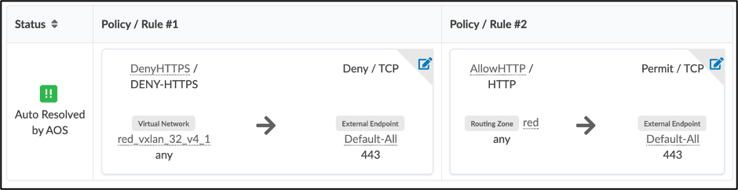

### Manual Conflict Resolution

When Apstra can't ascertain which rule to use, permit or deny, the conflict is flagged and prompts you to select which rule you want to take priority.

In this example, Apstra can't ascertain which rule to use: the policy permitting TCP 1-1024 or denying 22-2000.   You must resolve the conflict error before being allowed to commit the change to the blueprint.

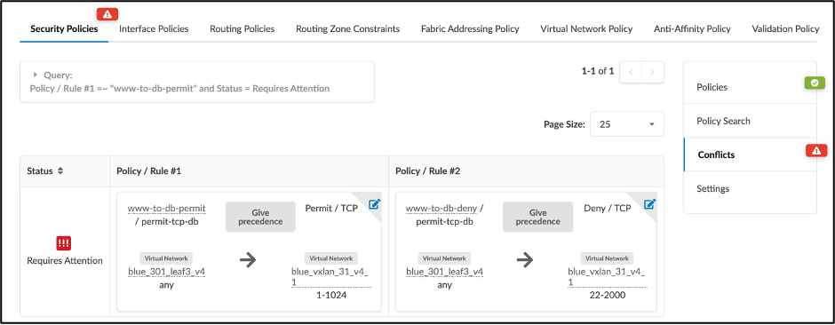

- Policy-A:
  - Virtual Network ` blue_301_leaf3_v4` <--> Virtual network ` blue_vxlan_31_v4_1
  - permit TCP 1-1024
- Policy-B:
  - Virtual Network ` blue_301_leaf3_v4` <--> Virtual network ` blue_vxlan_31_v4_1
  - deny TCP 22-2000

### Blueprint Policy Settings

Apstra will attempt to resolve conflicts automatically based on a few simple settings, which are global on a per blueprint basis.  The default settings are sane defaults, i.e., more specific rules will be selected, and explicit permit rules are preferred over denying traffic.  This setting should be configured once per blueprint.  You can apply more than one policy to each subnet/endpoint, which means the ordering of rules has an impact on behavior. An implicit hierarchy exists between routing zones, virtual networks, and IP endpoints, so you must consider how policies are applied at different levels of hierarchy. When one rule's match set contains the other's match set (full containment), the rules can conflict. You can set the rules to execute more specific rules first ("exception" focus/mode) or less specific first ("override" focus/mode).

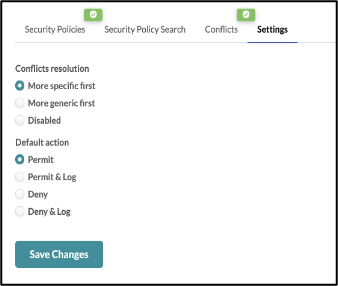

### Policy Search

You can search existing policies to determine if a certain type of traffic will be affected by the active combined policies.  Your searches can be based on any of the predefined objects, an IP address, or a range of addresses.  Examples of searches include:

- Is HTTP traffic allowed from Server-A to Server-B?
- Can any servers route TCP ports 20-21 outside of their subnet?
- What ports are open between the Database and Application virtual networks?

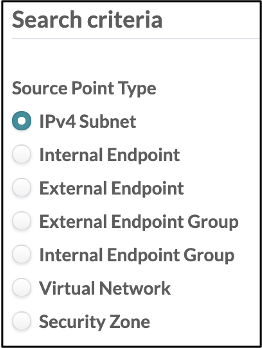

## Policy Assurance Operations

### Incremental ACL Deployment

To minimize the potential impact on existing traffic flows of a policy deployment in operating systems that leverage instant activation and line-by-line changes, Apstra will automatically perform a multistep process for deploying policy changes.  This ensures that the network does not enter an open (free-flowing traffic) state while the rules are being pushed into the TCAM.

Apstra performs the following workflow during policy changes:

1. Install temp ACL, write it to the device as "previous-acl-name_TMP"
2. Switch to _TMP ACL
3. Add original ACL with new rendering
4. Switch to the original ACL
5. Remove the TMP ACL

> Note: We recommend not using more than 50% of TCAM to allow for secondary ACL (some NOS can do this on their own but require TCAM to "merge" entries into an ACL).  We recommend that customers leave "default ACL atomic update" settings as is in NX-OS and EOS. This means if an applied ACL (say, using X TCAM entries) is modified, the NOS needs 2X free TCAM space during ACK modification. Our change improvement improves modification by enforcing policies even when the atomic update is impossible. Changing atomic update settings is not controlled by Apstra.

### Example Policy Deployment

```
ip access-list ACL_VLAN_3_IN_TMP  <CREATES TMP ACL>
  4 remark Policy: 'www to db ssh copy'
  5 deny TCP 10.0.1.128/25 eq 22 10.0.2.128/25
  9 remark Policy: 'www to db ssh'
  10 permit TCP 10.0.1.128/25 range 1 1024 10.0.2.128/25
  14 remark Trailing default action rule
  15 permit IP 10.0.1.0/24 0.0.0.0/0
  exit
!
interface vlan 3
  ip access-group ACL_VLAN_3_IN_TMP in  <SWITCH TO TMP ACL>
  exit
!
no ip access-list ACL_VLAN_3_IN  <REMOVE ORIGINAL ACL>
!
ip access-list ACL_VLAN_3_IN   <CREATE UPDATED ORIGINAL ACL>
  4 remark Policy: 'www to db ssh allow'
  5 deny TCP 10.0.1.128/25 range 22 23 10.0.2.128/25
  9 remark Policy: 'www to db ssh'
  10 permit TCP 10.0.1.128/25 range 1 1024 10.0.2.128/25
  14 remark Trailing default action rule
  15 permit IP 10.0.1.0/24 0.0.0.0/0
  Exit
interface vlan 3
  ip access-group ACL_VLAN_3_IN in  <SWITCH TO UPDATED ACL>
  exit
!
no ip access-list ACL_VLAN_3_IN_TMP  <REMOVE TMP ACL>
```

### Policy Enable/Disable

Policies can be enabled and disabled easily through the Apstra UI or API.  Switching a policy to disabled queues the change in Uncommitted, and the administrator must Commit the changes to the Blueprint for them to take effect.

### Policy Export/Import

Policies can be imported and exported via the API.  The same policy objects are required for a proper import.  This is especially helpful when managing multiple blueprints with identical policies.

## Routing Zone Constraints

Routing Zone Constraints enable you to define policies, at the management layer, on what VRF services or combination of services are authorized to exist on any port.  The constraint policy can be defined in various ways, such as a list of allowed VRFs, a list of VRFs to exclude, a maximum number of VRFs permitted, and so on. For example, you may have security or data protection demands that state services from Customer_A are never allowed to exist on the same port with services of Customer_B.  In other words, a VLAN belonging to Customer_A VRF and VLAN in Customer_B VRF should never be allowed to exist on any port simultaneously.  Alternatively, you could have a business requirement that states a port can belong to a maximum of 1 VRF, or a port can carry all VRFs except ***Payment***.

In each of these use cases, the requirement is to enforce a business or security requirement that prevents a network operator from performing completely valid networking actions.  Nothing is preventing you from provisioning an interface as a trunk port and adding two VLANs to it.  What the Routing Zone Constraints policy allows you to do is capture these requirements in code and enforce them at run time for everyone rather than hoping all the operators follow the policy.

### Only Trusted Use Case Example

In this example, the business must conform to a General Data Protection Regulation (GDPR) directive that obliges endpoints with data from trusted networks and domains to never contain data from untrusted networks. In networking terminology, this translates to clustering Routing Zones (network VRFs) and all of the Virtual Networks and endpoints in those Routing Zones together. Then, continuously audit and validate that the Day-2 changes your administrators perform adhere to this lawful regulation. The Routing Constraints feature does precisely this. It automatically cross-references each VN you assign to an interface to its assigned RZ, verifies if the RZ is part of the Trusted or Untrusted Group, and then ensures that you don't mistakenly provision an interface to host any Trusted and Untrustworthy networks at the same time.

### Routing Zone Group

The first step is to create the Routing Zone Group with `red` and `blue` members.  You can create multiple groups, for instance, a `Contractors` group for any VN's part of the Orange Routing Zone. Trusted networks are any VN's part of the `red` or `blue` Routing Zones.

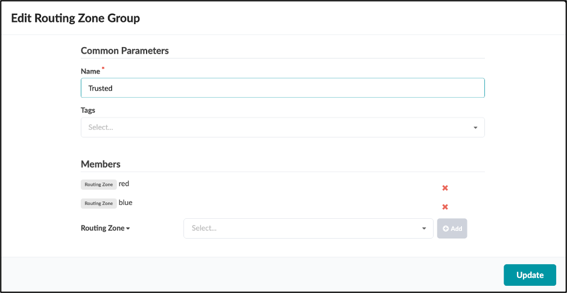

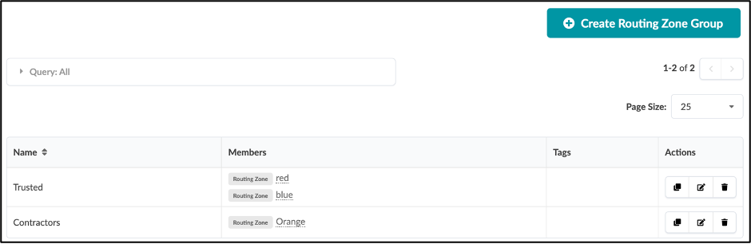

### Routing Zone Constraints

Next, you need to define your routing zone policy constraints. You can write constraints in several ways. Some examples of how you could constrain VRFs include:

- One VRF maximum
- Any VRF except Management
- Only VRFs Blue and Red
- Only VRF Group Orange

The `ONLY TRUSTED` Routing Zone Constraint below creates a policy that allows only networks that are part of the Trusted Group to be provisioned on any interface.

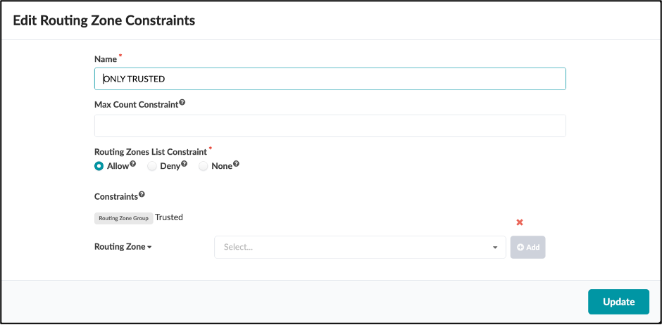

### Routing Zone Constraint Connectivity Policy

Once the constraint is defined, you enforce the constraint on server-facing interfaces by utilizing connectivity templates.  These connectivity templates present the means by which to assign the policy specifically to an individual interface or with the flexibility to allocate the policy to many interfaces in bulk or reliant on explicit tags.  The connectivity templates act as a mold, allowing you to shape the policy precisely to the interface or group of interfaces requiring targeted enforcement.  This ensures that you proactively enforce the policy accurately and effectively for each and every operation in real time.

Here is a new connectivity template using the Routing Zone Constraint primitive.  The `ONLY TRUSTED` Routing Zone Constraint from above is called.

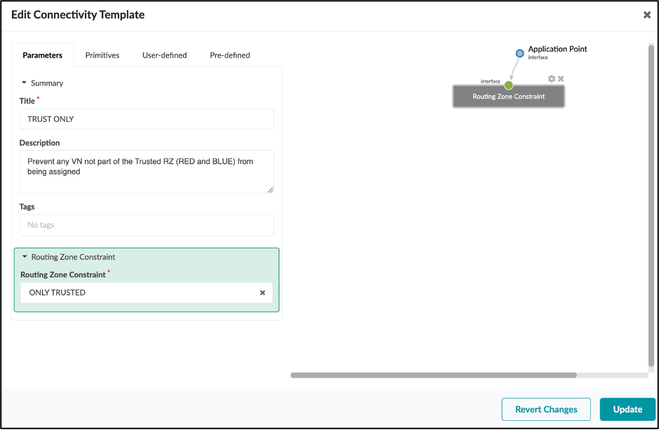

### Apply Constraints to Endpoints

Once the connectivity template is created, you assign the policy specifically to the interfaces on which you want this policy enforcement.

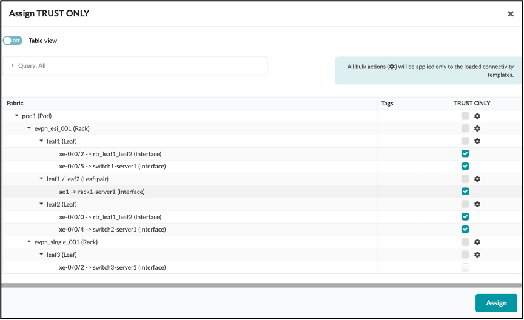

### Operation & Validation

Once the policy is applied, every time a network admin performs a task that alters the VN configuration of an interface, Apstra will figure out which routing zones those virtual networks belong to and consult with the routing zone constraint policy to determine if the newly intended state complies with or violates the given constraint policy.

Here you can see the validation warning alerting you of a violation. The `Badge Net` VN belongs to RZ Orange, which is not a Trusted RZ Constraint Group member. This operation violates the TRUST ONLY policy because Leaf1, interface xe-0/0/2, already has a VN that belongs to the `red` or `blue` Routing Zones that are members of the Trusted network.

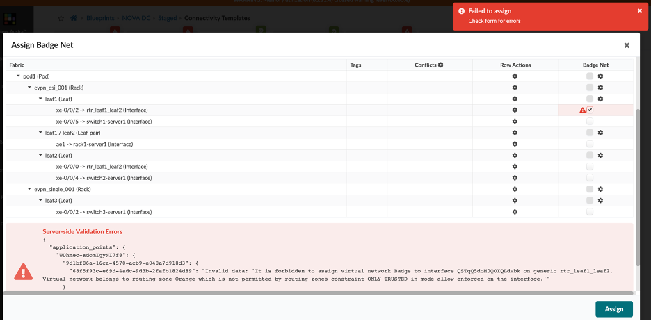

## Summary

This post provides you with an overview of Juniper Apstra's Policy Assurance feature. Policy Assurance is vendor-agnostic and, in conjunction with Apstra's Intent-Based Networking approach, can significantly enhance your organization's security posture. The post walks you through concepts and use case examples. To see an interactive demo, check out the link below in the "Useful Links" section.

## Useful links

- Demo of Policy Assurance in action: [https://www.juniper.net/us/en/dm/apstra-demos.html](https://www.juniper.net/us/en/dm/apstra-demos.html)
- OpenStack view of Group-Based Policy:[ https://gbp.readthedocs.io/en/latest/usage.html ](https://gbp.readthedocs.io/en/latest/usage.html)

## Glossary

- ACL: Access List
- API: Application Programming Interface
- Blueprint: An Apstra specification of a given data center fabric
- DNS: Domain Name Service
- EIPCG: External IP Endpoint Custom Group
- EIPE: External IP Endpoint
- GBP: Group-Based Policy
- GDPR: General Data Protection Regulation
- Golden Configuration: A validated, known-good configuration
- GUI: Graphical User Interface
- HTTP: Hypertext Transfer Protocol
- Intent-Based Networking: An approach to networking in which you express the "what" (intent or expectations), and the system takes care of the "how."
- IPE: Internal IP Endpoint
- IPECG: IP Endpoints Custom Group
- IRB: Integrated Routing and Bridging
- L3: Layer 3
- NOC: Network Operations Center
- NOS: Network Operating System
- NTP: Network Time Protocol
- Policy Assurance: A means of expressing and validating policies independent of specific vendor syntax
- QoS: Quality of Service
- RBAC: Role-Based Access Control
- RZ: Routing Zone, aka Virtual Routing and Forwarding zone
- SSH: Secure Shell
- SVI: Switched Virtual Interface
- TCAM: Tertiary Content-Addressable Memory
- VLAN: Virtual Local Area Network
- VN: Virtual Network
- VRF: Virtual Routing and Forwarding table, aka Routing Zone
- VRRP: Virtual Route Redundancy Protocol
- VXLAN: Virtual Extensible Local Area Network
