# Building Virtual Fabrics with vJunos-switch and Containerlab

**Aninda Chatterjee - 10/27/2023**

How vJunos-switch is deployed as a VM, packaged within a container, on a bare metal server using the open source network emulation tool Containerlab.

We'll start with instructions on how to install Containerlab on Ubuntu 22.04 LTS, along with other dependencies that are needed to create the vJunos-switch docker image. Once done, we'll demonstrate how network topologies can be deployed using this vJunos-switch container in a simple, and declarative format using Containerlab.

Finally, we'll wrap this up by onboarding vJunos-switch devices in Juniper Apstra and building a simple Data Center fabric to show that these devices work seamlessly with Apstra.

## What is Containerlab and vJunos-switch?

Containerlab is an open-source network emulation tool that offers users the ability to deploy virtual network operating systems as containers, connected together, to build small, medium or large scale network topologies for feature and functionality testing. More information can be found on their homepage - [https://containerlab.srlinux.dev/](https://containerlab.srlinux.dev/). Containerlab supports both native containers from vendors (that provide it) and VM based qemu images, that can be packaged inside a docker container. The full list of supported images can be found in their user manual located here - [https://containerlab.dev/manual/kinds/](https://containerlab.dev/manual/kinds/).

vJunos-switch is a new VM-based virtual software offering from Juniper Networks, which emulates the software functionality of Junos OS. This was integrated into Containerlab release 0.45.0, and is now a deployable node from this release onwards. All releases of vJunos-switch can be found here - [https://support.juniper.net/support/downloads/?p=vjunos](https://support.juniper.net/support/downloads/?p=vjunos)

## Installing Containerlab and Building the vJunos-switch Container

Containerlab installation instructions can be found in their installation page ([https://containerlab.dev/install/](https://containerlab.dev/install/)) or their quick start page ([https://containerlab.dev/quickstart/](https://containerlab.dev/quickstart/)). It can be installed as shown below, which installs the latest version of containerlab.

```
root@server:~# bash -c "$(curl -sL https://get.containerlab.dev)"
Downloading https://github.com/srl-labs/containerlab/releases/download/v0.47.0/containerlab_0.47.0_linux_amd64.deb
Preparing to install containerlab 0.47.0 from package
Selecting previously unselected package containerlab.
(Reading database ... 148116 files and directories currently installed.)
Preparing to unpack .../containerlab_0.47.0_linux_amd64.deb ...
Unpacking containerlab (0.47.0) ...
Setting up containerlab (0.47.0) ...

                           _                   _       _
                 _        (_)                 | |     | |
 ____ ___  ____ | |_  ____ _ ____   ____  ____| | ____| | _
/ ___) _ \|  _ \|  _)/ _  | |  _ \ / _  )/ ___) |/ _  | || \
( (__| |_|| | | | |_( ( | | | | | ( (/ /| |   | ( ( | | |_) )
\____)___/|_| |_|\___)_||_|_|_| |_|\____)_|   |_|\_||_|____/

    version: 0.47.0
     commit: d2a2ede1
       date: 2023-10-22T19:33:30Z
     source: https://github.com/srl-labs/containerlab
 rel. notes: https://containerlab.dev/rn/0.47/
```

To build VM-based containers, Containerlab uses a fork of the *vrnetlab* project ([https://github.com/hellt/vrnetlab/](https://github.com/hellt/vrnetlab/)). In order to build such images, this repository must be cloned locally.

```
root@server:/home/anindac# git clone https://github.com/hellt/vrnetlab/
Cloning into 'vrnetlab'...
remote: Enumerating objects: 4133, done.
remote: Counting objects: 100% (1123/1123), done.
remote: Compressing objects: 100% (266/266), done.
remote: Total 4133 (delta 947), reused 927 (delta 857), pack-reused 3010
Receiving objects: 100% (4133/4133), 1.97 MiB | 8.31 MiB/s, done.
Resolving deltas: 100% (2516/2516), done.
```

Within this newly cloned repository, there will be several folders available for different vendor images, including a new *vjunosswitch* folder.

```
root@server:/home/anindac# cd vrnetlab/
root@server:/home/anindac/vrnetlab# ls -l
total 144
-rw-r--r-- 1 root root   94 Oct 23 05:36 CODE_OF_CONDUCT.md
-rw-r--r-- 1 root root  706 Oct 23 05:36 CONTRIBUTING.md
-rw-r--r-- 1 root root 1109 Oct 23 05:36 LICENSE
-rw-r--r-- 1 root root  342 Oct 23 05:36 Makefile
-rw-r--r-- 1 root root 4013 Oct 23 05:36 README.md
drwxr-xr-x 3 root root 4096 Oct 23 05:36 aoscx
drwxr-xr-x 2 root root 4096 Oct 23 05:36 ci-builder-image
drwxr-xr-x 2 root root 4096 Oct 23 05:36 common
drwxr-xr-x 3 root root 4096 Oct 23 05:36 config-engine-lite
drwxr-xr-x 3 root root 4096 Oct 23 05:36 csr
drwxr-xr-x 3 root root 4096 Oct 23 05:36 ftosv
-rwxr-xr-x 1 root root 5210 Oct 23 05:36 git-lfs-repo.sh
-rw-r--r-- 1 root root 3158 Oct 23 05:36 makefile-install.include
-rw-r--r-- 1 root root  370 Oct 23 05:36 makefile-sanity.include
-rw-r--r-- 1 root root 1898 Oct 23 05:36 makefile.include
drwxr-xr-x 3 root root 4096 Oct 23 05:36 n9kv
drwxr-xr-x 3 root root 4096 Oct 23 05:36 nxos
drwxr-xr-x 3 root root 4096 Oct 23 05:36 ocnos
drwxr-xr-x 3 root root 4096 Oct 23 05:36 openwrt
drwxr-xr-x 3 root root 4096 Oct 23 05:36 pan
drwxr-xr-x 3 root root 4096 Oct 23 05:36 routeros
drwxr-xr-x 3 root root 4096 Oct 23 05:36 sros
drwxr-xr-x 2 root root 4096 Oct 23 05:36 topology-machine
drwxr-xr-x 3 root root 4096 Oct 23 05:36 veos
drwxr-xr-x 3 root root 4096 Oct 23 05:36 vjunosswitch
drwxr-xr-x 3 root root 4096 Oct 23 05:36 vmx
drwxr-xr-x 3 root root 4096 Oct 23 05:36 vqfx
drwxr-xr-x 3 root root 4096 Oct 23 05:36 vr-bgp
drwxr-xr-x 2 root root 4096 Oct 23 05:36 vr-xcon
-rw-r--r-- 1 root root 1135 Oct 23 05:36 vrnetlab.sh
drwxr-xr-x 3 root root 4096 Oct 23 05:36 vrp
drwxr-xr-x 3 root root 4096 Oct 23 05:36 vsr1000
drwxr-xr-x 3 root root 4096 Oct 23 05:36 vsrx
drwxr-xr-x 3 root root 4096 Oct 23 05:36 xrv
drwxr-xr-x 3 root root 4096 Oct 23 05:36 xrv9k
```

This folder has a Makefile and a Dockerfile (within the *docker* folder), that facilitates building of the vJunos-switch docker image.

```
root@server:/home/anindac/vrnetlab# cd vjunosswitch/
root@server:/home/anindac/vrnetlab/vjunosswitch# ls -l
total 12
-rw-r--r-- 1 root root  346 Oct 23 05:36 Makefile
-rw-r--r-- 1 root root  513 Oct 23 05:36 README.md
drwxr-xr-x 2 root root 4096 Oct 23 05:36 docker
```

The user simply needs to copy the vJunos-switch images to this folder and initiate the **make** command. This will trigger the build, and once it is done, a new docker image for vJunos-switch should be available under **docker images**.

```
root@server:/home/anindac/vrnetlab/vjunosswitch# ls -l
total 3873680
-rw-r--r-- 1 root root        346 Oct 23 05:36 Makefile
-rw-r--r-- 1 root root        513 Oct 23 05:36 README.md
drwxr-xr-x 2 root root       4096 Oct 23 05:36 docker
-rwxr-xr-x 1 root root 3966631936 Oct 23 05:54 vjunos-switch-23.2R1.14.qcow2

root@dc-tme-bigtwin-02:/home/anindac/vrnetlab/vjunosswitch# make
for IMAGE in vjunos-switch-23.2R1.14.qcow2; do \
 echo "Making $IMAGE"; \
 make IMAGE=$IMAGE docker-build; \
done
Making vjunos-switch-23.2R1.14.qcow2
make[1]: Entering directory '/home/anindac/vrnetlab/vjunosswitch'
rm -f docker/*.qcow2* docker/*.tgz* docker/*.vmdk* docker/*.iso
Building docker image using vjunos-switch-23.2R1.14.qcow2 as vrnetlab/vr-vjunosswitch:23.2R1.14
cp ../common/* docker/
make IMAGE=$IMAGE docker-build-image-copy
make[2]: Entering directory '/home/anindac/vrnetlab/vjunosswitch'
cp vjunos-switch-23.2R1.14.qcow2* docker/
make[2]: Leaving directory '/home/anindac/vrnetlab/vjunosswitch'
(cd docker; docker build --build-arg http_proxy= --build-arg https_proxy= --build-arg IMAGE=vjunos-switch-23.2R1.14.qcow2 -t vrnetlab/vr-vjunosswitch:23.2R1.14 .)
DEPRECATED: The legacy builder is deprecated and will be removed in a future release.
            Install the buildx component to build images with BuildKit:
            https://docs.docker.com/go/buildx/

Sending build context to Docker daemon  3.967GB
Step 1/11 : FROM ubuntu:20.04
 ---> d5447fc01ae6
Step 2/11 : ENV DEBIAN_FRONTEND=noninteractive
 ---> Running in b8387480fabb
Removing intermediate container b8387480fabb
 ---> 3027669a2e7b
Step 3/11 : RUN apt-get update -qy  && apt-get upgrade -qy  && apt-get install -y     dosfstools     bridge-utils     iproute2     python3-ipy     socat     qemu-kvm  && rm -rf /var/lib/apt/lists/*
 ---> Running in fa6033407315

<snip>

root@server:/home/anindac/vrnetlab/vjunosswitch# docker images
REPOSITORY                 TAG         IMAGE ID       CREATED          SIZE
vrnetlab/vr-vjunosswitch   23.2R1.14   331fe9769a3d   33 seconds ago   4.4GB
sflow/sflow-rt             latest      cad189a26e3b   5 months ago     100MB
ubuntu                     20.04       d5447fc01ae6   10 months ago    72.8MB
```

The image is now ready to use with Containerlab.

## Building a Network Topology with vJunos-switch and Containerlab

Containerlab uses a simple, declarative format of writing a network topology in YAML. The topology is written in the form of network nodes that need to be deployed, the type and image of the node, and how these nodes are connected to each other. Containerlab provides a lot of control over the management of the network topology -- this includes breaking out via the servers management interface, defining your own custom bridges and connecting the management interface of the network nodes to these bridges and so on. More details regarding network wiring can be found here - [https://containerlab.dev/manual/network/](https://containerlab.dev/manual/network/).

For example, a network topology for a 3-stage Clos fabric is described below.

```
root@server:/home/anindac/# cat test-topology.yml
name: test-lab
mgmt:
  bridge: virbr0
  ipv4-subnet: 192.168.122.0/24
topology:
  nodes:
    spine1:
            kind: vr-vjunosswitch
            image: vrnetlab/vr-vjunosswitch:23.2R1.14
            mgmt-ipv4: 192.168.122.101
            startup-config: spine1.cfg
    spine2:
            kind: vr-vjunosswitch
            image: vrnetlab/vr-vjunosswitch:23.2R1.14
            mgmt-ipv4: 192.168.122.102
            startup-config: spine2.cfg
    leaf1:
            kind: vr-vjunosswitch
            image: vrnetlab/vr-vjunosswitch:23.2R1.14
            mgmt-ipv4: 192.168.122.11
            startup-config: leaf1.cfg
    leaf2:
            kind: vr-vjunosswitch
            image: vrnetlab/vr-vjunosswitch:23.2R1.14
            mgmt-ipv4: 192.168.122.12
            startup-config: leaf2.cfg
    h1:
            kind: linux
            image: aninchat/host:v1
            mgmt-ipv4: 192.168.122.51
            exec:
                - sleep 5
                - sysctl -w net.ipv4.icmp_echo_ignore_broadcasts=0
                - ip route add 10.10.20.0/24 via 10.10.10.254
            binds:
                - hosts/h1_interfaces:/etc/network/interfaces
    h2:
            kind: linux
            image: aninchat/host:v1
            mgmt-ipv4: 192.168.122.52
            exec:
                - sleep 5
                - sysctl -w net.ipv4.icmp_echo_ignore_broadcasts=0
                - ip route add 10.10.10.0/24 via 10.10.20.254
            binds:
                - hosts/h2_interfaces:/etc/network/interfaces
  links:
          - endpoints: ["leaf1:eth1", "spine1:eth1"]
          - endpoints: ["leaf1:eth2", "spine2:eth1"]
          - endpoints: ["leaf2:eth1", "spine1:eth2"]
          - endpoints: ["leaf2:eth2", "spine2:eth2"]
          - endpoints: ["leaf1:eth3", "h1:eth1"]
          - endpoints: ["leaf2:eth3", "h2:eth1"]
```

Let's understand what this topology is doing in some more detail:

- This topology describes four fabric nodes named spine1, spine2, leaf1 and leaf2.
- Each of these nodes are of type *vr:vjunosswitch*, which is the containerlab naming convention for this virtual OS.
- Each of these nodes are of image type *vrnetlab/vr-vjunosswitch:23.2R1.14*, which is the docker tag that was created for this image when it was built.
- In addition to the fabric nodes, two hosts are defined (named h1 and h2) and they are simply a Linux container of type *aninchat/host:v1*. This is a container that is hosted on docker hub within the repository 'aninchat/host' and has a tag of 'v1'.
- Each network node (fabric nodes and hosts) are connected to the internal KVM default bridge called *virbr0* using the *mgmt* hierarchy in the topology definition. Each node is also given a specific IP address from this subnet using the *mgmt-ipv4* key.
- The fabric nodes (spine1, spine2, leaf1 and leaf2) also have a startup configuration attached to them. This configuration is a base configuration to facilitate onboarding into Apstra, later in this document.
- Finally, using the *links* key, the interconnections between nodes is described.

> Note: When any of these images are not found locally by docker, it will attempt to pull it from docker hub.

A Containerlab topology can be deployed using the **containerlab deploy** command, as shown below. This spins up the containers, creates the virtual wires to connect nodes as described in the topology, and executes any instructions tied to a node.

```
root@dc-tme-bigtwin-01:/home/anindac/jvd# containerlab deploy -t test-topology.yml
INFO[0000] Containerlab v0.47.0 started
INFO[0000] Parsing & checking topology file: test-topology.yml
INFO[0000] Creating docker network: Name="clab", IPv4Subnet="192.168.122.0/24", IPv6Subnet="", MTU='l'
INFO[0000] Creating lab directory: /home/anindac/jvd/clab-jvd
INFO[0000] Creating container: "h1"
INFO[0000] Creating container: "h2"
INFO[0000] Creating container: "spine2"
INFO[0000] Creating container: "leaf1"
INFO[0000] Creating container: "leaf2"
INFO[0000] Creating container: "spine1"
INFO[0001] Creating link: leaf2:eth1 <--> spine1:eth2
INFO[0001] Creating link: leaf1:eth1 <--> spine1:eth1
INFO[0001] Creating link: leaf2:eth3 <--> h2:eth1
INFO[0001] Creating link: leaf1:eth2 <--> spine2:eth1
INFO[0001] Creating link: leaf2:eth2 <--> spine2:eth2
INFO[0001] Creating link: leaf1:eth3 <--> h1:eth1
INFO[0002] Adding containerlab host entries to /etc/hosts file
INFO[0002] Adding ssh config for containerlab nodes
INFO[0013] Executed command "sleep 5" on the node "h2". stdout:
INFO[0013] Executed command "sysctl -w net.ipv4.icmp_echo_ignore_broadcasts=0" on the node "h2". stdout:
net.ipv4.icmp_echo_ignore_broadcasts = 0
INFO[0013] Executed command "ip route add 10.10.10.0/24 via 10.10.20.254" on the node "h2". stdout:
INFO[0013] Executed command "sleep 5" on the node "h1". stdout:
INFO[0013] Executed command "sysctl -w net.ipv4.icmp_echo_ignore_broadcasts=0" on the node "h1". stdout:
net.ipv4.icmp_echo_ignore_broadcasts = 0
INFO[0013] Executed command "ip route add 10.10.20.0/24 via 10.10.10.254" on the node "h1". stdout:
+---+-----------------+--------------+------------------------------------+-----------------+---------+--------------------+--------------+
| # |      Name       | Container ID |               Image                |      Kind       |  State  |    IPv4 Address    | IPv6 Address |
+---+-----------------+--------------+------------------------------------+-----------------+---------+--------------------+--------------+
| 1 | clab-jvd-h1     | 6e3e7b99b71e | aninchat/host:v1                   | linux           | running | 192.168.122.51/24  | N/A          |
| 2 | clab-jvd-h2     | 591bd1b9ed1d | aninchat/host:v1                   | linux           | running | 192.168.122.52/24  | N/A          |
| 3 | clab-jvd-leaf1  | 47bd8120ac60 | vrnetlab/vr-vjunosswitch:23.2R1.14 | vr-vjunosswitch | running | 192.168.122.11/24  | N/A          |
| 4 | clab-jvd-leaf2  | a5c2e5e85315 | vrnetlab/vr-vjunosswitch:23.2R1.14 | vr-vjunosswitch | running | 192.168.122.12/24  | N/A          |
| 5 | clab-jvd-spine1 | c492d76a54b5 | vrnetlab/vr-vjunosswitch:23.2R1.14 | vr-vjunosswitch | running | 192.168.122.101/24 | N/A          |
| 6 | clab-jvd-spine2 | 2d6cc3b2a6ee | vrnetlab/vr-vjunosswitch:23.2R1.14 | vr-vjunosswitch | running | 192.168.122.102/24 | N/A          |
+---+-----------------+--------------+------------------------------------+-----------------+---------+--------------------+--------------+ 
```

The virbr0 bridge interface is created on the host itself, and has the following IP address assigned to it by default.

```
root@dc-tme-bigtwin-01:~# ifconfig virbr0
virbr0: flags=4163<UP,BROADCAST,RUNNING,MULTICAST>  mtu 1500
        inet 192.168.122.1  netmask 255.255.255.0  broadcast 192.168.122.255
        ether 52:54:00:d2:94:37  txqueuelen 1000  (Ethernet)
        RX packets 1641995  bytes 559839364 (559.8 MB)
        RX errors 0  dropped 0  overruns 0  frame 0
        TX packets 1627134  bytes 244901034 (244.9 MB)
        TX errors 0  dropped 0 overruns 0  carrier 0  collisions 0
```

Once the nodes are deployed via Containerlab, they should be reachable from the host server, via the virbr0 interface. In the example below, all nodes are reachable via the **ping** utility from the host server.

```
root@server:~# ping 192.168.122.101
PING 192.168.122.101 (192.168.122.101) 56(84) bytes of data.
64 bytes from 192.168.122.101: icmp_seq=1 ttl=64 time=0.081 ms
64 bytes from 192.168.122.101: icmp_seq=2 ttl=64 time=0.059 ms
^C
--- 192.168.122.101 ping statistics ---
2 packets transmitted, 2 received, 0% packet loss, time 1009ms
rtt min/avg/max/mdev = 0.059/0.070/0.081/0.011 ms

root@server:~# ping 192.168.122.102
PING 192.168.122.102 (192.168.122.102) 56(84) bytes of data.
64 bytes from 192.168.122.102: icmp_seq=1 ttl=64 time=0.078 ms
64 bytes from 192.168.122.102: icmp_seq=2 ttl=64 time=0.034 ms
^C
--- 192.168.122.102 ping statistics ---
2 packets transmitted, 2 received, 0% packet loss, time 1029ms
rtt min/avg/max/mdev = 0.034/0.056/0.078/0.022 ms

root@server:~# ping 192.168.122.11
PING 192.168.122.11 (192.168.122.11) 56(84) bytes of data.
64 bytes from 192.168.122.11: icmp_seq=1 ttl=64 time=0.111 ms
64 bytes from 192.168.122.11: icmp_seq=2 ttl=64 time=0.056 ms
^C
--- 192.168.122.11 ping statistics ---
2 packets transmitted, 2 received, 0% packet loss, time 1032ms
rtt min/avg/max/mdev = 0.056/0.083/0.111/0.027 ms

root@server:~# ping 192.168.122.12
PING 192.168.122.12 (192.168.122.12) 56(84) bytes of data.
64 bytes from 192.168.122.12: icmp_seq=1 ttl=64 time=0.109 ms
64 bytes from 192.168.122.12: icmp_seq=2 ttl=64 time=0.054 ms
^C
--- 192.168.122.12 ping statistics ---
2 packets transmitted, 2 received, 0% packet loss, time 1003ms
rtt min/avg/max/mdev = 0.054/0.081/0.109/0.027 ms

root@server:~# ping 192.168.122.51
PING 192.168.122.51 (192.168.122.51) 56(84) bytes of data.
64 bytes from 192.168.122.51: icmp_seq=1 ttl=64 time=0.115 ms
64 bytes from 192.168.122.51: icmp_seq=2 ttl=64 time=0.027 ms
^C
--- 192.168.122.51 ping statistics ---
2 packets transmitted, 2 received, 0% packet loss, time 1017ms
rtt min/avg/max/mdev = 0.027/0.071/0.115/0.044 ms

root@server:~# ping 192.168.122.52
PING 192.168.122.52 (192.168.122.52) 56(84) bytes of data.
64 bytes from 192.168.122.52: icmp_seq=1 ttl=64 time=0.152 ms
64 bytes from 192.168.122.52: icmp_seq=2 ttl=64 time=0.057 ms
^C
--- 192.168.122.52 ping statistics ---
2 packets transmitted, 2 received, 0% packet loss, time 1013ms
rtt min/avg/max/mdev = 0.057/0.104/0.152/0.047 ms
```

We can login to one of the devices (spine1, as an example) and confirm that it only has the base configuration that we had mapped to the startup-config key in the Containerlab topology.

```
root@server:~# ssh -l admin 192.168.122.101
(admin@192.168.122.101) Password:
Last login: Mon Oct 23 07:36:19 2023
--- JUNOS 23.2R1.14 Kernel 64-bit  JNPR-12.1-20230613.7723847_buil
admin@spine1> show configuration
## Last commit: 2023-10-23 07:36:12 UTC by root
version 23.2R1.14;
system {
    host-name spine1;
    root-authentication {
        encrypted-password "$6$RAqyBEFe$ZeuTiT94b4nN7WCPs7eNBtnK6oX.nqKEZLjdV7ckY0Nddh9wfYGPwKslqD2hUKtJFNle5Lt2LlD36FiKOLo701"; ## SECRET-DATA
    }
    commit synchronize;
    login {
        user admin {
            uid 2000;
            class super-user;
            authentication {
                encrypted-password "$6$p5WEDsOX$sg.MSJal/bHvaaoUOB6Vq3Htar9Y4HE4aFn8uCQc85T1vQ0e8GqQEMhhOQWtmLjwB1ybSb4jX6AV1TTQAdl6b1"; ## SECRET-DATA
            }
        }
    }
    services {
        ssh {
            root-login allow;
        }
        netconf {
            ssh;
        }
    }
    management-instance;
}
interfaces {
    fxp0 {
        unit 0 {
            family inet {
                address 10.0.0.15/24;
                address 192.168.122.101/24;
            }
        }
    }
}
routing-instances {
    mgmt_junos {
        routing-options {
            static {
                route 0.0.0.0/0 next-hop 10.0.0.2;
            }
        }
    }
}
protocols {
    lldp {
        interface all;
    }
}
```

## Integrating a vJunos-switch Containerlab Based Network Topology with Juniper Apstra

The deployed Containerlab network topology is orchestrated and managed by Juniper Apstra, to demonstrate how virtual fabrics can be brought to life with Apstra as well for feature and functionality testing.

The Apstra version used for the purposes of this demonstration is Apstra 4.2.0. This version comes with a Device Profile for vJunos-switch. Before we begin, the topology that has been deployed with Containerlab is as shown below.

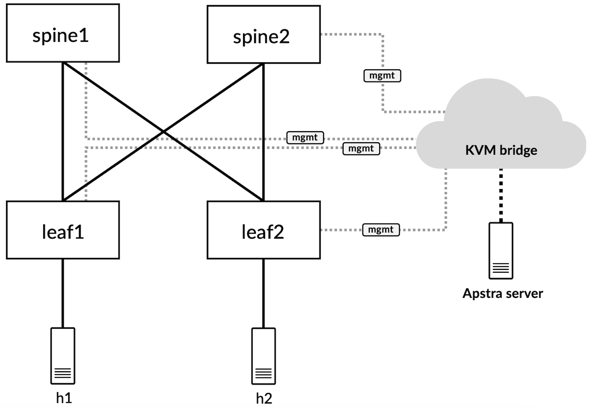

The Device Profile for vJunos-switch, in Apstra, is shown below.

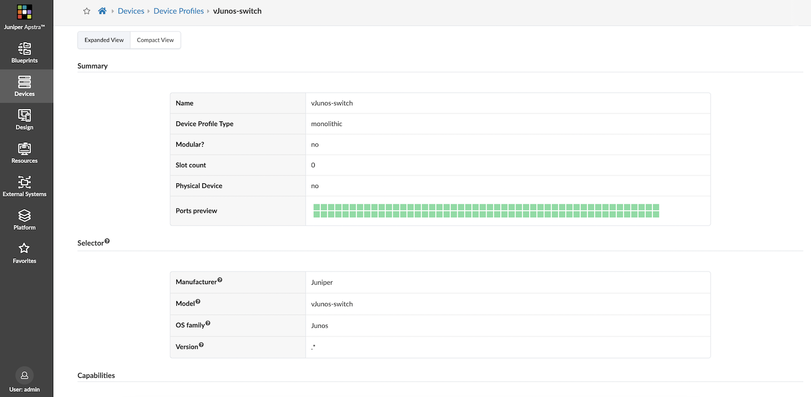

A Logical Device is created to match this Device Profile, with 96x1G ports as shown below.

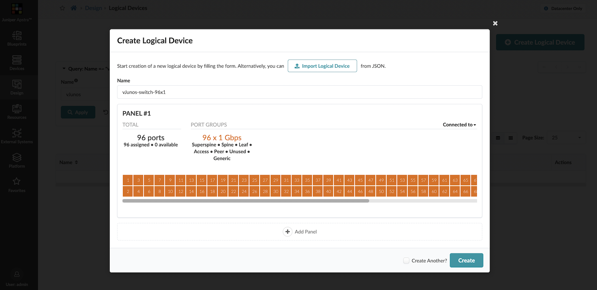

To tie the Device Profile and the Logical Device together, an Interface Map is created as shown below.

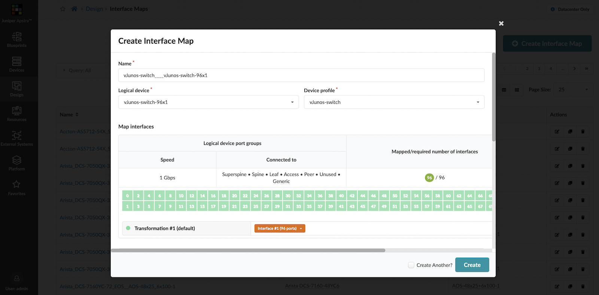

We can start to create the actual fabric now. This process includes building a rack with vJunos-switch Logical Devices, building a 3-stage Clos Template based on this rack, and finally deploying a Blueprint using this Template.

First, a new Rack Type is created in Apstra to match our network topology.

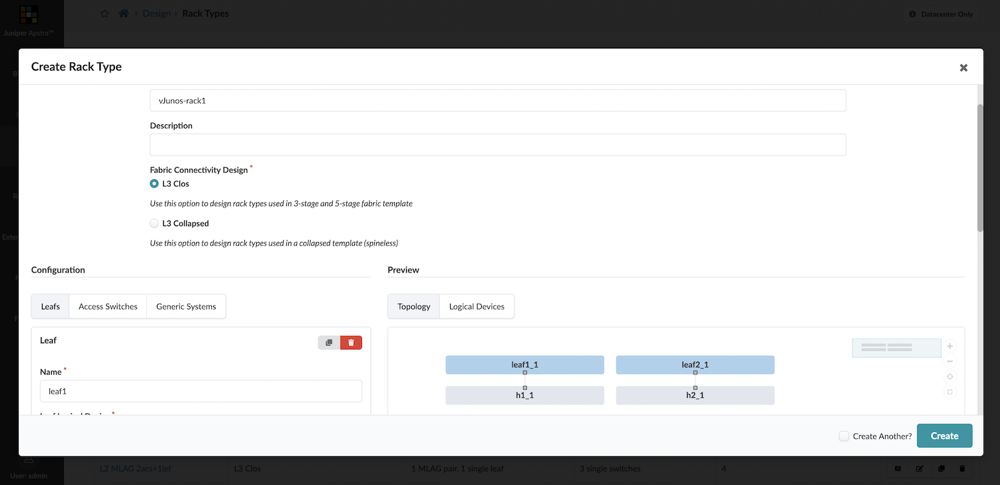

This new Rack Type can now be used to create a Template, which defines the overall schema of the fabric, as shown below.

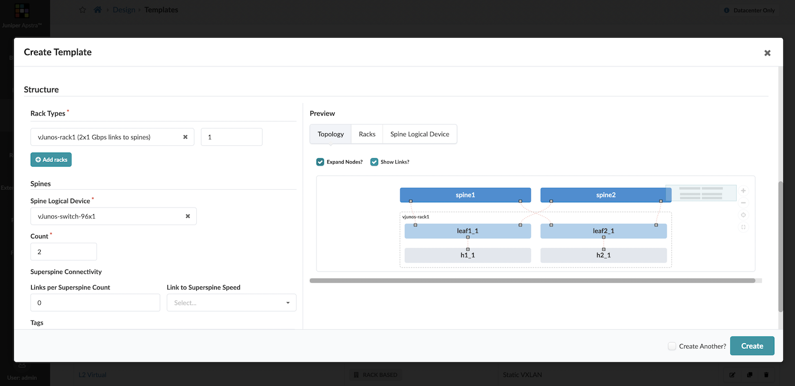

Finally, once this Template is created, it is used as the only input to the Blueprint to create the initial fabric for this virtual Data Center.

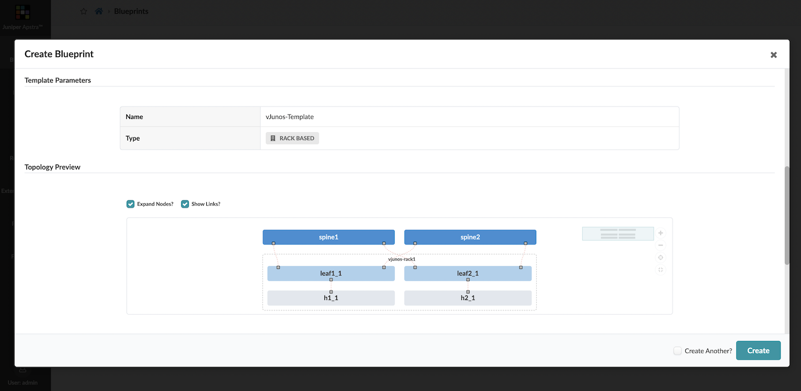

The Blueprint itself needs several other basic resources. This includes:

- An IP pool for the point-to-point links between the leafs and the spines.
- An IP pool for loopbacks of all VTEPs in the fabric.
- An ASN pool for the leafs and the spines.

These can be created from the Resources tab in Apstra. For the sake of brevity, this is already done for the purposes of this demonstration.

At this point, the Blueprint is simply *staged*, and no configuration has been generated or deployed to the network devices.

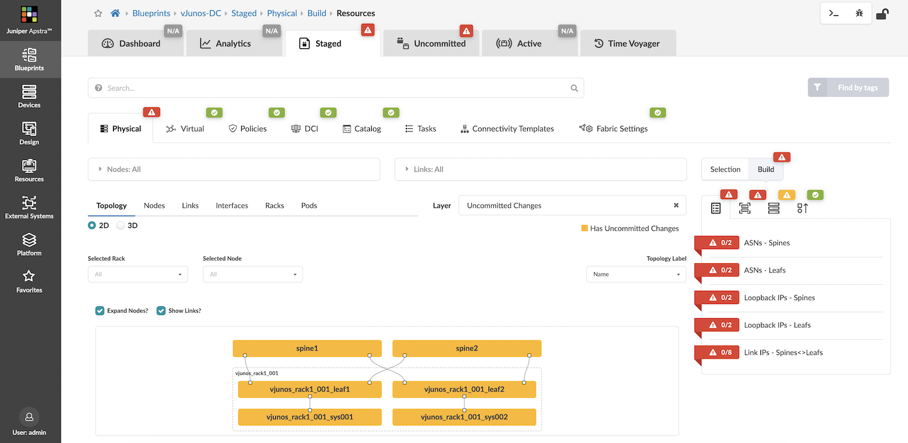

We need to add all required sources into this Blueprint and map an appropriated Interface Map against every fabric node. Once this is done, you should see everything start to turn green from red.

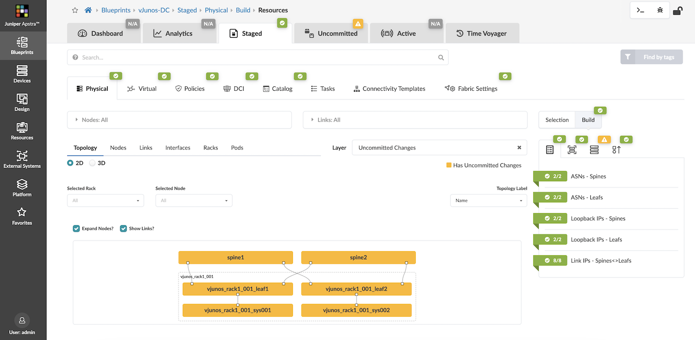

This can now be committed as the first revision of this Data Center deployment. So far, no devices have actually been mapped to this fabric. In order to do that, our vJunos-switch virtual devices must be onboarded into Apstra by creating offline Device Agents for them, as shown below.

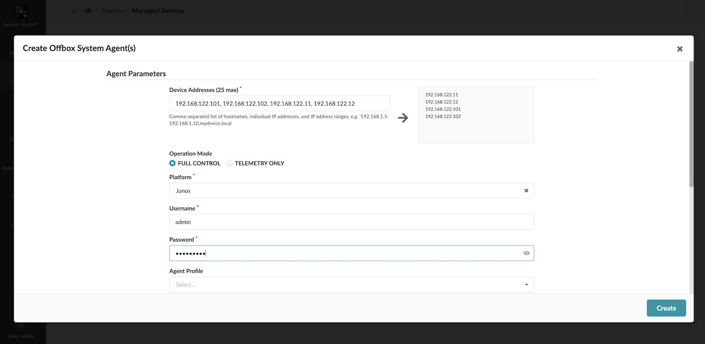

Once the agent is created, it can be acknowledged and these devices should now be available to be deployed in a Blueprint.

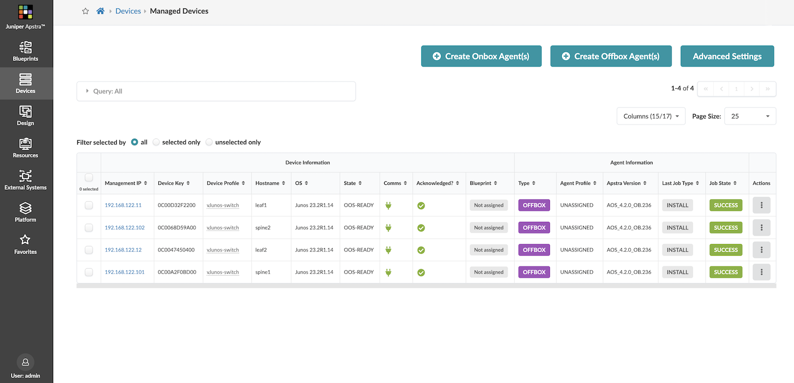

To deploy these in the Blueprint we just built, their respective System IDs need to be assigned in the Blueprint to the corresponding fabric nodes.

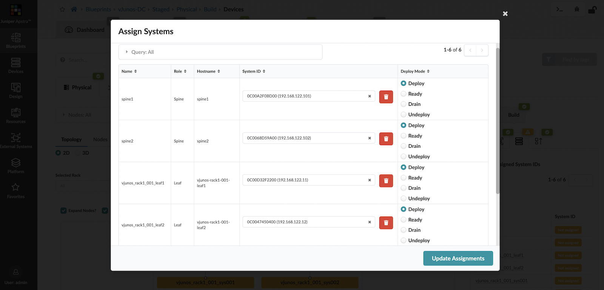

Now, all relevant configuration that was generated for the respective nodes will be pushed to the fabric devices. From both spines, we can confirm that BGP peering for the underlay and overlay is in an *Established* state.

```
admin@spine1> show bgp summary

Threading mode: BGP I/O
Default eBGP mode: advertise - accept, receive - accept
Groups: 2 Peers: 4 Down peers: 0
Table          Tot Paths  Act Paths Suppressed    History Damp State    Pending
inet.0
                       6          4          0          0          0          0
bgp.evpn.0
                       0          0          0          0          0          0
Peer                     AS      InPkt     OutPkt    OutQ   Flaps Last Up/Dwn State|#Active/Received/Accepted/Damped...
192.0.2.2             65423          4          2       0       0          57 Establ
  bgp.evpn.0: 0/0/0/0
192.0.2.3             65424          5          3       0       0          58 Establ
  bgp.evpn.0: 0/0/0/0
198.51.100.1          65423          6          5       0       0        1:05 Establ
  inet.0: 2/3/3/0
198.51.100.3          65424          6          5       0       0        1:06 Establ
  inet.0: 2/3/3/0

admin@spine2> show bgp summary

Threading mode: BGP I/O
Default eBGP mode: advertise - accept, receive - accept
Groups: 2 Peers: 4 Down peers: 0
Table          Tot Paths  Act Paths Suppressed    History Damp State    Pending
inet.0
                       6          4          0          0          0          0
bgp.evpn.0
                       0          0          0          0          0          0
Peer                     AS      InPkt     OutPkt    OutQ   Flaps Last Up/Dwn State|#Active/Received/Accepted/Damped...
192.0.2.2             65423          7          5       0       0        1:54 Establ
  bgp.evpn.0: 0/0/0/0
192.0.2.3             65424          7          6       0       0        1:50 Establ
  bgp.evpn.0: 0/0/0/0
198.51.100.5          65423          8          7       0       0        2:02 Establ
  inet.0: 2/3/3/0
198.51.100.7          65424          8          8       0       0        1:58 Establ
  inet.0: 2/3/3/0
```

This builds our core infrastructure for the virtual DC, however, the connectivity to the hosts is still not established. For this, we will create a Routing Zone and two Virtual Networks within this Routing Zone (corresponding to h1 and h2).

This also creates corresponding Connectivity Templates to provide Layer-2, untagged connectivity down to the hosts.

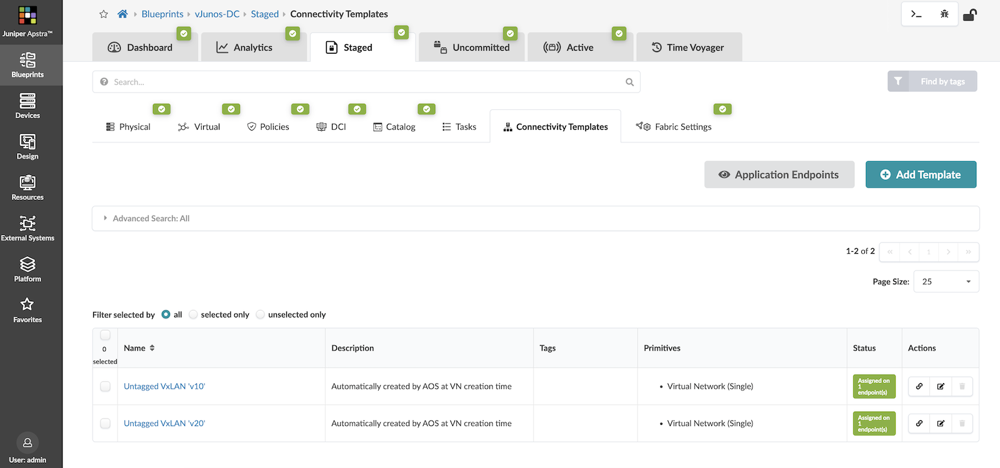

Once this is deployed, the two hosts can communicate with each other, as shown below.

```
root@h1:~# ping 10.10.20.2
PING 10.10.20.2 (10.10.20.2) 56(84) bytes of data.
64 bytes from 10.10.20.2: icmp_seq=1 ttl=62 time=2.33 ms
64 bytes from 10.10.20.2: icmp_seq=2 ttl=62 time=2.35 ms
64 bytes from 10.10.20.2: icmp_seq=3 ttl=62 time=2.58 ms
64 bytes from 10.10.20.2: icmp_seq=4 ttl=62 time=2.32 ms
^C
--- 10.10.20.2 ping statistics ---
4 packets transmitted, 4 received, 0% packet loss, time 8ms
rtt min/avg/max/mdev = 2.321/2.396/2.580/0.112 ms
```

## Summary

Through this post, we were able to demonstrate a working deployment of Juniper's new virtual offering, vJunos-switch, using Containerlab and integrate it with Juniper Apstra to deploy a Data Center fabric.

## Useful links

- Juniper Networks software downloads - [https://www.juniper.net/us/en/dm/vjunos-labs.html ](https://www.juniper.net/us/en/dm/vjunos-labs.html)
- Containerlab home page - [https://containerlab.dev/ ](https://containerlab.dev/)
- Juniper Apstra documentation - [https://www.juniper.net/documentation/product/us/en/apstra/](https://www.juniper.net/documentation/product/us/en/apstra/)

## Acknowledgments

- Ridha Hamidi -- TME, CRDC
- Vivek V -- TME, CRDC
- Nick Davey -- Director, Product Management, CRDC
- Cathy Gadecki -  Senior Director, Product Management, CRDC
