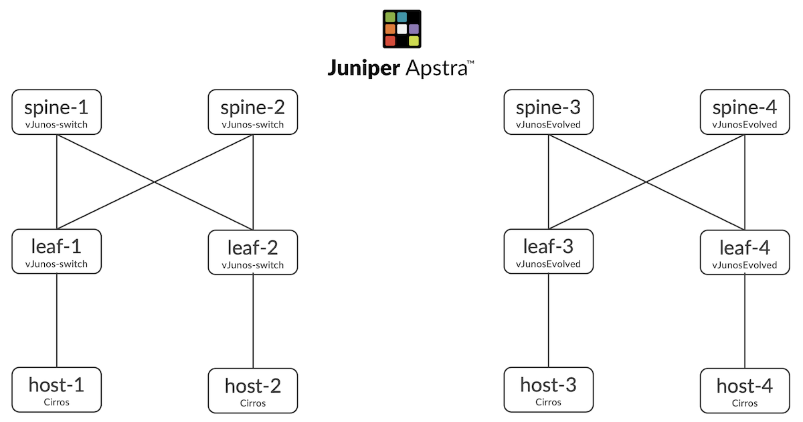

# vJunos Deployment on KVM

**Ridha Hamidi - 05/10/2023**

A comprehensive user guide on how to successfully deploy and use vJunos-switch and vJunosEvolved on KVM (one of the most popular virtualized environments in the community, alongside EVE-NG and GNS3).

## Summary

Juniper is releasing a new virtual test product named vJunos that is targeted at data center and campus switching use cases.

vJunos comes in two flavours for the initial release:
- vJunos-switch : based on the legacy Junos OS running on Free BSD, and targeted for data center and campus switching use cases
- vJunosEvolved based on the newer Junos OS Evolved on top of Linux, and targeted for both routing and switching use cases

This post provides a comprehensive user guide on how to successfully deploy and use vJunos-switch and vJunosEvolved on KVM. This other post explains [how to deploy vJunos-switch and vJunosEvolved on EVE-NG](https://juniper.github.io/techposts/deploying-vjunos-in-a-bare-metal-eve-ng-server/article).

## Introduction

The steps used on our setup and detailed in the rest of this post are:

- Prepare their KVM environment for vJunos deployment
- Deploy vJunos
- Troubleshoot some of the most common deployment issues
- Build a simple EVPN-VXLAN topology using multiple vJunos instances managed by Juniper Apstra
- Verify your work

We will try to provide comprehensive explanations about the procedure and explain all the steps. However, for the sake of brevity, we will not address a few topics that might be of interest for some users, like using vJunos with ZTP. This can be the topic of a separate post in the future.

Let's get started.

## Prepare the Environment

The server we will use in our deployment has the following:

- Server: Supermicro SYS-220BT-HNC9R
- CPUs: 128 x Intel(R) Xeon(R) Gold 6338 CPU @ 2.00GHz
- RAM: 256 GB DDR4
- SSD: 1 TB
- OS: Ubuntu 20.04.5 LTS

We will first verify that this server supports virtualization, then we will install KVM components.

### Update packages

```
user@host:~$ sudo apt-get update && sudo apt-get upgrade -y

<output truncated>
```

### Check if the Server Supports Hardware Virtualization

```
user@host:~$ grep -Eoc '(vmx|svm)' /proc/cpuinfo
128
user@host:~$
```

In our case, our server has 128 CPUs that have "vmx" or "svm" flags enabled to support virtualization

### Check if VT is Enabled in the BIOS

This is done by installing and using the "kvm-ok" tool, which is included in the cpu-checker package.

```
user@host:~$ sudo apt-get install cpu-checker -y
<output truncated>

user@host:~$ kvm-ok
INFO: /dev/kvm exists
KVM acceleration can be used
user@host:~$
```

Now that we have checked that the server is ready, we can proceed and install KVM.

### Install KVM

There are several packages that need to be installed, some are mandatory and some are optional

- qemu-kvm: software that provides hardware emulation for the KVM hypervisor.
- libvirt-bin: software for managing virtualization platforms.
- bridge-utils: a set of command-line tools for configuring ethernet bridges.
- virtinst : a set of command-line tools for creating virtual machines.
- virt-manager: provides an easy-to-use GUI interface and supporting command-line utilities for managing virtual machines through libvirt.

We included all mandatory and optional packages in the same install command

```
user@host:~$ sudo apt-get install qemu-kvm bridge-utils virtinst virt-manager -y
 
<output truncated>
```

### Verify installation

```
user@host:~$ sudo systemctl is-active libvirtd
active
user@host:~$ virsh version
Compiled against library: libvirt 4.0.0
Using library: libvirt 4.0.0
Using API: QEMU 4.0.0
Running hypervisor: QEMU 2.11.1

user@host:~$ apt show qemu-system-x86
Package: qemu-system-x86
Version: 1:2.11+dfsg-1ubuntu7.41
Priority: optional
Section: misc
Source: qemu
Origin: Ubuntu
<output truncated>
```

Now that KVM is installed and up and running, we can proceed and deploy vJunos.

## Deploy vJunos-switch

### Pre-requisite Tips

There are a few pieces of information to know about Juniper vJunos before you start building your virtual lab. These are the most important ones:

- vJunos is not an official Juniper Networks product, it is a test product, so it is neither sold nor officially supported by Juniper's TAC. If you run into any issues, we encourage you to report it in the Juniper community. Juniper Networks makes vJunos available for free to download and use with no official support.
- It is recommended to use vJunos for feature testing only, and not for any scaling or performance tests. For the same reasons, it is not recommended to use vJunos in production environments. It is recommended to join the [Juniper Labs Community](https://juniper.github.io/techpost) if you need further support on vJunos
- A vJunos instance is composed of one single VM that nests both Control and Data Planes, hence some limitations of deploying options of vJunos. Please see vJunos FAQ.
- Default login of vJunos is root with no password.
- vJunos must be provisioned with at least one vNIC for the management, and as many vNICs as there are data plane interfaces.
- It is our experience that vNICs are more reliable if you configure them to use virtio driver. We have not experienced any issue when using this driver, instead of the other ones, like e1000.
- There is no license to use vJunos, so all features should work without entering any license key, even though some features will trigger warnings about missing licenses. You can ignore those warning and move on.
- You need to have an account with Juniper support to have access to the download page. It is recommended to select "Evaluation User Access" that gives you access to evaluation software. If you are a new user, beware that creating a new user account is not immediate, as it goes through an approval process that might take up to 24 hours, so plan accordingly.

Now that all these notes are read and well understood, we're ready to deploy our first vJunos, knowing all limitations and restrictions.

### Download vJunos Images

vJunos-switch image can be downloaded from the official Juniper support page [https://support.juniper.net/support/downloads/?p=vjunos](https://support.juniper.net/support/downloads/?p=vjunos).

vJunosEvolved image can be downloaded from the official Juniper support page [https://support.juniper.net/support/downloads/?p=vjunos-evolved](https://support.juniper.net/support/downloads/?p=vjunos-evolved)

At the time of writing this post, the latest vJunos release is 23.1R1.8.

Note that in addition to vJunos images, you will also need a Linux image to deploy host VMs to be connected to vJunos instances for testing purposes. The exact type and version of these Linux instances are not important, but it must support installing specific packages to run protocols like LLDP and LACP. For this post, we used cirros-0.5.2.

### Deploy vJunos-switch Instances

For this post, we will deploy the following fabric topology



Given that the downloaded vJunos files are disk images (.qcow2) it is a best practice to make as many copies as there are vJunos instances to avoid attaching all vJunos instances to the same disk image. This will take up some disk space, so plan your setup accordingly. We will put these disk image copies under the default directory /var/lib/libvirt/images. The following bash script will help make these copies.

copy-images.sh:

```
#!/bin/bash
sudo cp cirros-0.5.2-x86_64-disk.img /var/lib/libvirt/images/host-1.img
sudo cp cirros-0.5.2-x86_64-disk.img /var/lib/libvirt/images/host-2.img
sudo cp cirros-0.5.2-x86_64-disk.img /var/lib/libvirt/images/host-3.img
sudo cp cirros-0.5.2-x86_64-disk.img /var/lib/libvirt/images/host-4.img
sudo cp vjunos-switch-23.1R1.8.qcow2 /var/lib/libvirt/images/vjunos-switch-23.1R1.8.qcow2
sudo cp vJunosEvolved-23.1R1.8-EVO.qcow2 /var/lib/libvirt/images/vJunosEvolved-23.1R1.8-EVO.qcow2
sudo qemu-img create -F qcow2 -b /var/lib/libvirt/images/vjunos-switch-23.1R1.8.qcow2 -f qcow2 /var/lib/libvirt/images/leaf-1.qcow2
sudo qemu-img create -F qcow2 -b /var/lib/libvirt/images/vjunos-switch-23.1R1.8.qcow2 -f qcow2 /var/lib/libvirt/images/spine-1.qcow2
sudo qemu-img create -F qcow2 -b /var/lib/libvirt/images/vjunos-switch-23.1R1.8.qcow2 -f qcow2 /var/lib/libvirt/images/leaf-2.qcow2
sudo qemu-img create -F qcow2 -b /var/lib/libvirt/images/vjunos-switch-23.1R1.8.qcow2 -f qcow2 /var/lib/libvirt/images/spine-2.qcow2
sudo qemu-img create -F qcow2 -b /var/lib/libvirt/images/vJunosEvolved-23.1R1.8-EVO.qcow2 -f qcow2 /var/lib/libvirt/images/leaf-3.qcow2
sudo qemu-img create -F qcow2 -b /var/lib/libvirt/images/vJunosEvolved-23.1R1.8-EVO.qcow2 -f qcow2 /var/lib/libvirt/images/spine-3.qcow2
sudo qemu-img create -F qcow2 -b /var/lib/libvirt/images/vJunosEvolved-23.1R1.8-EVO.qcow2 -f qcow2 /var/lib/libvirt/images/leaf-4.qcow2
sudo qemu-img create -F qcow2 -b /var/lib/libvirt/images/vJunosEvolved-23.1R1.8-EVO.qcow2 -f qcow2 /var/lib/libvirt/images/spine-4.qcow2
```

Using "qemu-img create" instead of a simple "cp" allows to have much smaller disk images, as shown below, which is good if you have a limited disk space.

```
user@host:~$ sudo ls -la /var/lib/libvirt/images/
total 25232500
drwx--x--x 2 root         root       4096 Apr  5 16:00 .
drwxr-xr-x 7 root         root       4096 Apr  3 23:42 ..
-rw-r--r-- 1 root         root 4212916224 Mar  8 05:19 aos_server_4.1.2-269.qcow2
-rw-r--r-- 1 libvirt-qemu kvm    36306944 Apr  5 17:28 host-1.img
-rw-r--r-- 1 libvirt-qemu kvm    36306944 Apr  5 17:43 host-2.img
-rw-r--r-- 1 libvirt-qemu kvm    36306944 Apr  5 17:43 host-3.img
-rw-r--r-- 1 libvirt-qemu kvm    36306944 Apr  5 17:29 host-4.img
-rw-r--r-- 1 libvirt-qemu kvm   339017728 Apr  5 19:37 leaf-1.qcow2
-rw-r--r-- 1 libvirt-qemu kvm   338755584 Apr  5 19:37 leaf-2.qcow2
-rw-r--r-- 1 libvirt-qemu kvm  3691118592 Apr  5 19:37 leaf-3.qcow2
-rw-r--r-- 1 libvirt-qemu kvm  3619880960 Apr  5 19:37 leaf-4.qcow2
-rw-r--r-- 1 libvirt-qemu kvm   336592896 Apr  5 19:37 spine-1.qcow2
-rw-r--r-- 1 libvirt-qemu kvm   341442560 Apr  5 19:37 spine-2.qcow2
-rw-r--r-- 1 libvirt-qemu kvm  3619487744 Apr  5 19:37 spine-3.qcow2
-rw-r--r-- 1 libvirt-qemu kvm  3644981248 Apr  5 19:37 spine-4.qcow2
-rw-r--r-- 1 libvirt-qemu kvm  1766653952 Apr  5 16:00 vJunosEvolved-23.1R1.8-EVO.qcow2
-rw-r--r-- 1 libvirt-qemu kvm  3781951488 Apr  5 15:59 vjunos-switch-23.1R1.8.qcow2
user@host:~$
```

We will start by creating the networks of the above topology first then the create the virtual machines after, because this way, VMs can be effectively connected to the appropriate networks immediately when they boot up. It is our experience that when we create the VMs first, then the networks after, we need to reboot the VMs once more for connections to networks to take effect.

To deploy a network, we start by creating its xml definition file. The following is a sample network xml file.

leaf1-spine1.xml:

```
<network>
  <name>leaf1-spine1</name>
  <bridge stp='off' delay='0'/>
</network>
```

then we execute the following commands to create a persistent network, and configure it to start automatically when libvirt daemon is restarted

```
user@host:~$ virsh net-define leaf1-spine1.xml
Network leaf1-spine1 defined from leaf1-spine1.xml

user@host:~$ virsh net-start leaf1-spine1
Network leaf1-spine1 started

user@host:~$ virsh net-autostart leaf1-spine1
Network leaf1-spine1 marked as autostarted

user@host:~$ virsh net-list
 Name                 State      Autostart     Persistent
----------------------------------------------------------
 default              active     yes           yes
 leaf1-spine1         active     yes           yes

user@host:~$
```

Note that we used "net-define" and not "net-create" because the former makes the network persistent, whereas the latter makes it transient, that is non persistent across reboots.

The reverse commands to delete the above network are the following:

```
user@host:~$ virsh net-destroy leaf1-spine1
Network leaf1-spine1 destroyed

user@host:~$ virsh net-undefine leaf1-spine1
Network leaf1-spine1 has been undefined

user@host:~$
```

The previous commands will preserve the xml definition file, so you can edit it again and start over.

We used the following bash script to create all the networks we need in this lab setup

create-networks.sh:

```
#!/bin/bash
echo "<network>" > macvtap.xml
echo "  <name>macvtap</name>" >> macvtap.xml
echo "  <forward mode='bridge'>" >> macvtap.xml
echo "    <interface dev='ens9f0'/>" >> macvtap.xml
echo "  </forward>" >> macvtap.xml
echo "</network>" >> macvtap.xml
virsh net-define macvtap.xml
virsh net-start macvtap
virsh net-autostart macvtap
for network in leaf1-host1 leaf2-host2 leaf1-spine1 leaf1-spine2 leaf2-spine1 leaf2-spine2 \
        leaf3-host3 leaf4-host4 leaf3-spine3 leaf3-spine4 leaf4-spine3 leaf4-spine4 \
        leaf3_PFE_LINK leaf3_RPIO_LINK spine3_PFE_LINK spine3_RPIO_LINK leaf4_PFE_LINK leaf4_RPIO_LINK spine4_PFE_LINK spine4_RPIO_LINK
do
    echo "<network>" > $network.xml
    echo "  <name>$network</name>" >> $network.xml
    echo "  <bridge stp='off' delay='0'/>" >> $network.xml
    echo "</network>" >> $network.xml
    virsh net-define $network.xml
    virsh net-start $network
    virsh net-autostart $network
done
```

The following bash script deletes all created networks with the previous script, in case you need to do so

delete-networks.sh:

```
#!/bin/bash
for network in leaf1-host1 leaf2-host2 leaf1-spine1 leaf1-spine2 leaf2-spine1 leaf2-spine2 \
               leaf3-host3 leaf4-host4 leaf3-spine3 leaf3-spine4 leaf4-spine3 leaf4-spine4 \
               leaf3_PFE_LINK leaf3_RPIO_LINK spine3_PFE_LINK spine3_RPIO_LINK leaf4_PFE_LINK leaf4_RPIO_LINK spine4_PFE_LINK spine4_RPIO_LINK \
               macvtap
do
    virsh net-destroy $network
    virsh net-undefine $network
    rm $network.xml
done
```

After completing the previous task for all networks with your preferred method, you should see the following output

```
user@host:~$ virsh net-list
 Name               State    Autostart   Persistent
-----------------------------------------------------
 default            active   yes         yes
 leaf1-host1        active   yes         yes
 leaf1-spine1       active   yes         yes
 leaf1-spine2       active   yes         yes
 leaf2-host2        active   yes         yes
 leaf2-spine1       active   yes         yes
 leaf2-spine2       active   yes         yes
 leaf3-host3        active   yes         yes
 leaf3-spine3       active   yes         yes
 leaf3-spine4       active   yes         yes
 leaf3_PFE_LINK     active   yes         yes
 leaf3_RPIO_LINK    active   yes         yes
 leaf4-host4        active   yes         yes
 leaf4-spine3       active   yes         yes
 leaf4-spine4       active   yes         yes
 leaf4_PFE_LINK     active   yes         yes
 leaf4_RPIO_LINK    active   yes         yes
 macvtap            active   yes         yes
 spine3_PFE_LINK    active   yes         yes
 spine3_RPIO_LINK   active   yes         yes
 spine4_PFE_LINK    active   yes         yes
 spine4_RPIO_LINK   active   yes         yes

user@host:~$
```

### Deploy vJunos

There are multiple ways to deploy vJunos instances on KVM, one can name at least these three:

- virt-manager : deploy all VMs by using KVM GUI
- virsh-define: this method requires creating an XML definition file of each VM
- virt-install : CLI based method. One needs only to specify the deployment parameters of VMs

virt-manager procedure works fine for small setups. The GUI is very intuitive, which makes this method less error prone. However, like most GUI-based tools, it does not scale well if you need to create a large number of VMs.

virsh-define is very error prone because the XML file is quite large and it is very easy to make syntax mistakes. It is highly recommended that you start with an existing XML file from a previously created and working VM, and not start from scratch, if you use virsh-define. If you do not have any XML file to start with, you can create a VM by using the virt-manager, then copy its XML file located under /etc/libvirt/qemu/, or generate it by using the command

```
virsh-dumpxml vm_name > vm_name.xml
```

Even though all 3 methods would work just fine, depending on the user's familiarity with each method. In this port we're going to use virt-install, because we can put all commands inside a shell script, and repeat the operation if anything is not working as expected. Like with any new product,  it might take a few tries before you get everything right with all the parameters.

Below is a sample virt-install command to deploy one of the vJunos-switch VMs:

```
virt-install \
     --name leaf-1 \
     --vcpus 4 \
     --ram 5120 \
     --disk path=/var/lib/libvirt/images/leaf-1.qcow2,size=10 \
     --os-variant generic \
     --import \
     --autostart \
     --noautoconsole \
     --nographics \
     --serial pty \
     --cpu IvyBridge,+erms,+smep,+fsgsbase,+pdpe1gb,+rdrand,+f16c,+osxsave,+dca,+pcid,+pdcm,+xtpr,+tm2,+est,+smx,+vmx,+ds_cpl,+monitor,+dtes64,+pbe,+tm,+ht,+ss,+acpi,+ds,+vme \
     --sysinfo smbios,system_product=VM-VEX \
     --network network=macvtap,model=virtio \
     --network network=leaf1-spine1,model=virtio \
     --network network=leaf1-spine2,model=virtio \
     --network network=leaf1-host1,model=virtio
```

Below is a sample virt-install command to deploy one of the vJunosEvolved VMs:

```
virt-install \
     --name leaf-3 \
     --vcpus 4 \
     --ram 5120 \
     --disk path=/var/lib/libvirt/images/leaf-3.qcow2,size=10 \
     --os-variant generic \
     --import \
     --autostart \
     --noautoconsole \
     --nographics \
     --serial pty \
     --cpu IvyBridge,+vmx \
     --qemu-commandline="-smbios type=0,vendor=Bochs,version=Bochs -smbios type=3,manufacturer=Bochs -smbios type=1,manufacturer=Bochs,product=Bochs,serial=chassis_no=0:slot=0:type=1:assembly_id=0x0D20:platform=251:master=0:channelized=no" \
     --network network=macvtap,model=virtio \
     --network network=leaf3_PFE_LINK,model=virtio \
     --network network=leaf3_RPIO_LINK,model=virtio \
     --network network=leaf3_RPIO_LINK,model=virtio \
     --network network=leaf3_PFE_LINK,model=virtio \
     --network network=leaf3-spine3,model=virtio \
     --network network=leaf3-spine4,model=virtio
```

The highlighted lines are important for a successful deployment of a vJunosEvolved instance.

Below is a sample virt-install command to deploy one of the Cirros VMs:

```
virt-install \
     --name host-1 \
     --vcpus 1 \
     --ram 1024 \
     --disk path=/var/lib/libvirt/images/host-1.img,size=10 \
     --os-variant generic \
     --import \
     --autostart \
     --noautoconsole \
     --nographics \
     --serial pty \
     --network network=macvtap,model=virtio \
     --network network=leaf1-host1,model=virtio
```

A few comments about the command above:

- `--serial pty` allows you to access the guest VM's console from the host by using `virsh console <vm_name>`. Another alternative to allow access to guest VMs from the host is via telnet by specifying, for example `--serial tcp,host=:4001,mode=bind,protocol=telnet`, where 4001 is a tcp port that is specific to the VM, so it must be different for each guest VM.
- The first interface of the VM is connected to `macvtap` bridge that connects to host's interface eno1. This way the VM will be connected to the same management network than than the host itself, so we can reach it directly without jumping to the host. Other alternatives to how to manage the guest VM include the following:


`--network type=direct,source=eno1,source_mode=bridge,model=virtio` : this works the same way than `macvtap` bridge
`--network network=**default**,model=virtio` : this way, the VM will be connected to KVM's internal default network and will get an IP address via DHCP from the default 192.168.122.0/24 subnet. To make the VM reachable from outside, we need to configure the host for port forwarding.

We used a bash script to create the VMs needed in this lab setup. The script is not provided here for brevity, but it executes the above virt-install command for as many times as there are VMs with the specific parameters and interfaces.

Note that we provisioned each vJunos with 4 vCPU and 5 GB of RAM.

You can delete a VM by using the following commands, for example

```
virsh shutdown leaf-1
virsh undefine leaf-1
sudo rm /var/lib/libvirt/images/leaf-1.qcow2
```

Once all VMs are deployed, you should see the following output:

```
user@host:~$ virsh list
 Id   Name      State
-------------------------
 13   leaf-1    running
 14   leaf-2    running
 15   leaf-3    running
 16   leaf-4    running
 17   spine-1   running
 18   spine-2   running
 19   spine-3   running
 20   spine-4   running
 21   host-1    running
 22   host-2    running
 23   host-3    running
 24   host-4    running

user@host:~$
```

At this point, all VMs should be up and running, and should be reachable directly from the outside without jumping on the host. However, vJunos management interfaces run DHCP by default, so we do not know at this point what IP addresses have been assigned to vJunos instances. To that end, we must console to the instances either from the host by using "virsh console" or telnet to the specific port, as explained above, or by using virt-manager.

The vJunos instances should reach each other once we complete the basic Junos configurations. Let's verify that.

### Verifications

Try accessing the console of one of the vJunos-switch instances by using the following command

```
user@host:~$ virsh console leaf-1
Connected to domain leaf-1
Escape character is ^]
 
 
FreeBSD/amd64 (Amnesiac) (ttyu0)
 
login: root
Last login: Fri Mar  3 00:29:56 on ttyu0
 
--- JUNOS 23.1R1.8 Kernel 64-bit  JNPR-12.1-20230203.cf1b350_buil
root@:~ #
```

The default credentials are "root" and no password.

Enable Junos CLI and verify that the dataplane is online

```
root@:~ # cli  
root> show chassis fpc
 
                     Temp  CPU Utilization (%)   CPU Utilization (%)  Memory    Utilization (%)
Slot State            (C)  Total  Interrupt      1min   5min   15min  DRAM (MB) Heap     Buffer
  0  Online           Testing   4         0        3      3      3    1023       19          0
  1  Empty
  2  Empty
  3  Empty
  4  Empty
  5  Empty
  6  Empty
  7  Empty
  8  Empty
  9  Empty
 10  Empty
 11  Empty
 
root>
```

Verify that 10 "ge" interfaces are present

```
root> show interfaces ge* terse
Interface               Admin Link Proto    Local                 Remote
ge-0/0/0                up    up
ge-0/0/0.16386          up    up
ge-0/0/1                up    up
ge-0/0/1.16386          up    up
ge-0/0/2                up    up
ge-0/0/2.16386          up    up
ge-0/0/3                up    down
ge-0/0/3.16386          up    down
ge-0/0/4                up    down
ge-0/0/4.16386          up    down
ge-0/0/5                up    down
ge-0/0/5.16386          up    down
ge-0/0/6                up    down
ge-0/0/6.16386          up    down
ge-0/0/7                up    down
ge-0/0/7.16386          up    down
ge-0/0/8                up    down
ge-0/0/8.16386          up    down
ge-0/0/9                up    down
ge-0/0/9.16386          up    down
 
root>
```

A vJunos-switch instance comes up with 10 ge-x/x/x interfaces by default, but you can configure it with up to 96 ge-x/x/x interfaces by using the following command:

```
set chassis fpc 0 pic 0 number-of-ports 96
```

On the other hand, a vJunosEvolved instance comes up with 12 xe-x/x/x interfaces by default, and that cannot be changed by CLI.

Try accessing the console of one of the Cirros host VMs

```
user@host:~$ virsh console host-1
Connected to domain host-1
Escape character is ^]
 
login as 'cirros' user. default password: 'gocubsgo'. use 'sudo' for root.
cirros login: cirros
Password:
$
```

If you used an Ubuntu image for the host VMs, you may not have access to the console with "virsh console". If that's the case, access the console with virt-manager and make the following changes in the guest VM:

```
sudo systemctl enable serial-getty@ttyS0.service
sudo systemctl start serial-getty@ttyS0.services
```

edit file `etc/default/grub` of the guest VM and configure the following lines

```
GRUB_CMDLINE_LINUX_DEFAULT="console=tty0 console=ttyS0"
GRUB_TERMINAL="serial console"
```

then

```
sudo update-grub
```

At this point, you should be able to access the Ubuntu VMs with "virsh console".

Now that all looks good and we're ready to start configuring our devices to build the EVPN-VXLAN topology shown above.

## Configuration

### Base vJunos-switch Configuration

When a vJunos-switch instance comes up, it has a default configuration that needs to be cleaned up before we proceed further. For example, the default configuration is ready for ZTP, which we will not address in this post.

The following configuration should be the bare minimum needed to start using a vJunos-switch instance, and you can delete everything else:

```
[edit]
root@leaf-1# show
## Last changed: 2023-03-03 23:34:53 UTC
version 23.1R1.8;
system {
    host-name leaf-1;
    root-authentication {
        encrypted-password "*****"; ## SECRET-DATA
    }
    services {
        ssh {
            root-login allow;
        }
        netconf {
            ssh;
        }
    }
    syslog {
        file interactive-commands {
            interactive-commands any;
        }
        file messages {
            any notice;
            authorization info;
        }
    }
}
interfaces {
    fxp0 {
        unit 0 {
            family inet {
                dhcp {
                    vendor-id Juniper-ex9214-VM64013DB545;
                }
            }
        }
    }
}
protocols {
    lldp {
        interface all;
        interface fxp0 {
            disable;
        }
    }
}
 
[edit]
root@leaf-1#
```

A bare minimum vJunosEvolved configuration is very similar, except the management interface name, which is re0:mgmt-0 for vJunosEvolved instead of fxp0 for vJunos-switch.

Once all vJunos-switch instances have the minimum configuration above entered and committed, let us verify that the topology is built properly by verifying LLDP neighborship.

```
[edit]
root@leaf-1# run show lldp neighbors
 
[edit]
root@leaf-1#

[edit]
root@leaf-1# run show lldp statistics
Interface    Parent Interface  Received  Unknown TLVs  With Errors  Discarded TLVs  Transmitted  Untransmitted
ge-0/0/0     -                 0         0             0            0               127          0
ge-0/0/1     -                 0         0             0            0               127          0
ge-0/0/2     -                 0         0             0            0               127          0
 
[edit]
root@leaf-1#
```

The output above shows that LLDP neighborship are not forming, and that the instance is transmitting LLDP packets but is not receiving any. This is expected because, by default, IEEE 802.1D compliant bridges Linux bridges do not forward frames of link local protocols, like LLDP and LACP. For reference, the destination MAC address used by LLDP is 01-80-C2-00-00-0**E**.

Let's checking the default value of the Group Forwarding Mask of one of the bridges

```
user@host:~$ cat /sys/class/net/virbr1/bridge/group_fwd_mask
0x0
user@host:~$
```

The zero value means that this bridge does not forward any link local protocol frames. To change the bridge's behavior and force it to forward LLDP frames we need to set the 15th bits of this 16-bit mask, specified by the rightmost 0xE in the MAC address, that is writing the hex value 0x4000, or decimal value 2^14=16,384, to group_fwd_mask. Let's try it on all bridges of this host.

We used the following shell script to accomplish that. Please adjust bridge and interface numbers to your specific case ; use "brctl show" command to get the number of virbrX bridges and vnetX interfaces

```
user@host:~$ brctl show
bridge name     bridge id               STP enabled     interfaces
virbr0          8000.5254006f5abc       yes             virbr0-nic
virbr1          8000.525400e46740       no              virbr1-nic
                                                        vnet2
                                                        vnet34
virbr10         8000.5254004bf7c3       no              virbr10-nic
                                                        vnet11
                                                        vnet32
virbr11         8000.525400158ad5       no              virbr11-nic
                                                        vnet16
                                                        vnet27
virbr12         8000.525400a700c7       no              virbr12-nic
                                                        vnet17
                                                        vnet33
virbr13         8000.525400b539f0       no              virbr13-nic
                                                        vnet6
                                                        vnet9
virbr14         8000.5254007070dc       no              virbr14-nic
                                                        vnet7
                                                        vnet8
virbr15         8000.5254005ed09f       no              virbr15-nic
                                                        vnet22
                                                        vnet25
virbr16         8000.52540012d521       no              virbr16-nic
                                                        vnet23
                                                        vnet24
virbr17         8000.525400895359       no              virbr17-nic
                                                        vnet12
                                                        vnet15
virbr18         8000.5254007bc6c4       no              virbr18-nic
                                                        vnet13
                                                        vnet14
virbr19         8000.5254003dffbd       no              virbr19-nic
                                                        vnet28
                                                        vnet31
virbr2          8000.5254007a6662       no              virbr2-nic
                                                        vnet35
                                                        vnet5
virbr20         8000.52540062fca2       no              virbr20-nic
                                                        vnet29
                                                        vnet30
virbr3          8000.525400d2ebec       no              virbr3-nic
                                                        vnet0
                                                        vnet18
virbr4          8000.52540036dab2       no              virbr4-nic
                                                        vnet1
                                                        vnet20
virbr5          8000.525400831b16       no              virbr5-nic
                                                        vnet19
                                                        vnet3
virbr6          8000.525400a74b01       no              virbr6-nic
                                                        vnet21
                                                        vnet4
virbr7          8000.52540010f358       no              virbr7-nic
                                                        vnet36
virbr8          8000.525400587638       no              virbr8-nic
                                                        vnet37
virbr9          8000.525400434614       no              virbr9-nic
                                                        vnet10
                                                        vnet26
user@host:~$
```

overwrite-mask.sh:

```
#!/bin/bash
for i in {0..20}
do
    echo 0x4000 > /sys/class/net/virbr$i/bridge/group_fwd_mask
done
```

At this point, LLDP should be working fine on all vJunos-switch instances, as shown below

```
[edit]
root@leaf-1# run show lldp statistics
Interface    Parent Interface  Received  Unknown TLVs  With Errors  Discarded TLVs  Transmitted  Untransmitted
ge-0/0/0     -                 10        0             0            0               170          0
ge-0/0/1     -                 10        0             0            0               169          0
ge-0/0/2     -                 0         0             0            0               167          0
 
[edit]
root@leaf-1# run show lldp neighbors
Local Interface    Parent Interface    Chassis Id          Port info          System Name
ge-0/0/0           -                   2c:6b:f5:19:f5:c0   ge-0/0/0           spine-1
ge-0/0/1           -                   2c:6b:f5:a6:fc:c0   ge-0/0/0           spine-2
 
[edit]

root@leaf-1# run show lldp neighbors
Local Interface    Parent Interface    Chassis Id          Port info          System Name
ge-0/0/0           -                   2c:6b:f5:1a:65:c0   ge-0/0/0           spine-1
ge-0/0/1           -                   48:cd:91:2e:05:d5   et-0/0/0           spine-2

[edit]
root@leaf-1#
```

Note that LLDP neighborship is not forming between leaf-1 and host-1, and that's because Linux does not include LLDP package by default. It can be installed on some Linux distributions, but not on Cirros, that we used here.

## Adding Apstra Controller

Now that all vJunos instances are deployed and working properly, we will onboard them on Apstra server and deploy the fabric.

Please note the following important requirements:

- You need Juniper Apstra version 4.1.1 or higher to manage vJunos instances ; at the time of writing this post, we used Juniper Apstra version 4.1.2-269
- By default, vJunos-switch comes up with 10 GbE interfaces, but you can configure it for up to 96 GbE interfaces. Also, Juniper Apstra has a default Device Profile for vJunos-switch, called vEX, that has 10 1GbE/10GbE interfaces, and this DP is automatically associated with all vJunos-switch instances. If your topology uses 10 or less dataplane interfaces, all should work just fine. However, if your topology requires more than 10 interfaces, then additional configuration both on vJunos-switch instances and Juniper Apstra will be required.
- vJunosEvolved instance is a virtual representation of the Juniper PTX10001-36MR, as shown below, and therefore we could just use the Device Profile of that platform that comes bundled with Juniper Apstra 4.1.2. However, because vJunos-switch and vJunosEvolved versions that we used in this lab, are release 23.1R1, we needed to create new Device Profiles to make the change necessary change in the Selector of the Device Profiles to include this version. We changed the RegEx from (1[89]|2[0-3])\..*  to (1[89]|2[0-3])\..*  for vJunos-switch and from (20\.[34].*|2[12]\..*)-EVO$ to (20\.[34].*|2[123]\..*)-EVO$ for vJunosEvolved.

```
root@leaf-1> show system information
Model: ex9214
Family: junos
Junos: 23.1R1.8
Hostname: leaf-1

root@leaf-1>
```

And, 

```
root@spine-3> show system information
Model: ptx10001-36mr
Family: junos
Junos: 23.1R1.8-EVO
Hostname: spine-3

root@spine-3>
```

In our setup, leaf-1, leaf-2, spine-1 and spine-2 are running vJunos-switch and leaf-3, leaf-4, spine-3 and spine-4 are running vJunosEvolved, so we will create 2 separate interface maps and rack types, then create a template and a blueprint that includes both racks to build two 2 x leaf, 2-sapine EVPN-VXLAN fabrics. The fabrics will have routing on the leafs, in ERB style, and we will show that everything is working fine by testing connectivity between host-1 in subnet 10.1.1.0/24 and host-2 in subnet 10.1.2.0/24 on one fabric, and between host-3 in subnet 10.2.1.0/24 and host-4 in subnet 10.2.2.0/24 on the other fabric.

Note that because vJunos-switch simulates an EX9214 system with redundant Routine-Engine, you must add the following CLI commands to the pristine configuration before onboarding leaf-1 and spine-1 on Apstra

```
set system commit synchronize
set chassis evpn-vxlan-default-switch-support
```

The other caveat to be aware of, is that vJunosEvolved leafs need the following command to be configured, so you need to push this configuration via an Apstra configlet

```
set forwarding-options tunnel-termination
```

Apstra configuration steps for vJunos instances are no different than for all other hardware platforms so we will not share details here for the sake of brevity.

## Conclusion

In this post, we shared the step to successfully deploy vJunos-switch and vJunosEvolved virtual appliances. Our purpose was to provide all the details to avoid running into running into issues that might cause long troubleshooting sessions.

We hope we achieved this goal.

## Useful links

- vJunos-switch: [https://support.juniper.net/support/downloads/?p=vjunos](https://support.juniper.net/support/downloads/?p=vjunos)
- vJunosEvolved: [https://support.juniper.net/support/downloads/?p=vjunos-evolved](https://support.juniper.net/support/downloads/?p=vjunos-evolved)
- Juniper Apstra documentation: [https://www.juniper.net/documentation/product/us/en/apstra/](https://www.juniper.net/documentation/product/us/en/apstra/)
- Deploying and Using Junos in a Bare Metal EVEN-NG Server: [https://juniper.github.io/techposts/deploying-vjunos-in-a-bare-metal-eve-ng-server/article](https://juniper.github.io/techposts/deploying-vjunos-in-a-bare-metal-eve-ng-server/article)

## Glossary

- DHCP : Dynamic Host Configuration Protocol
- ERB : Edge Routing and Bridging
- LACP : Link Aggregation Control Protocol
- LLDP : Link Layer Discovery Protocol

## Acknowledgements

Special thanks to the following individuals who helped understand implementation details of vJunos-switch and vJunosEvolved, to those who helped in building and troubleshooting the setups we used in this post, and who also helped reviewing this post:

- Aninda Chatterjee
- Art Stine
- Hartmut Schroeder
- Kaveh Moezzi
- Shalini Mukherjee
- Yogesh Kumar
- Vignesh Shanmugaraju
