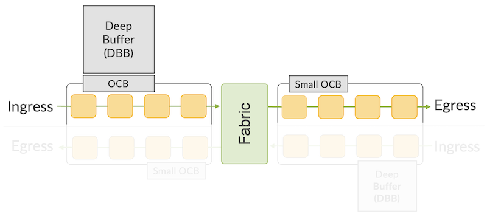
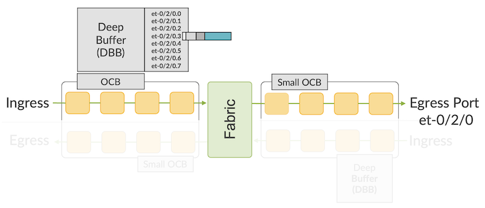
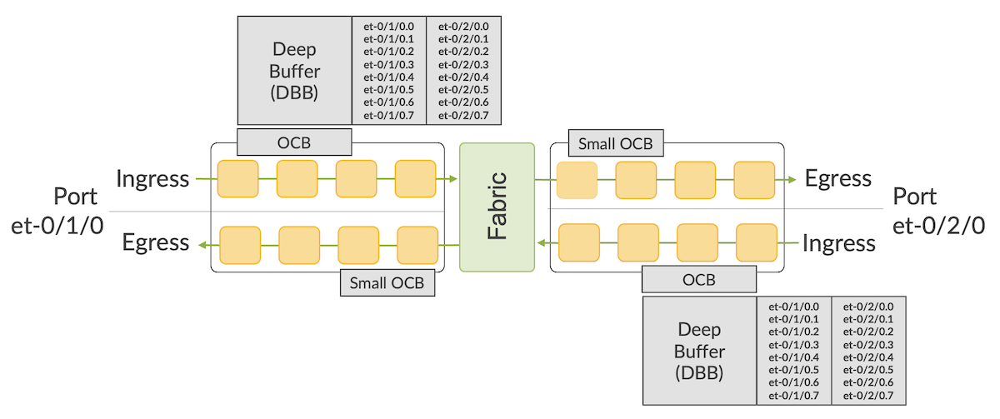
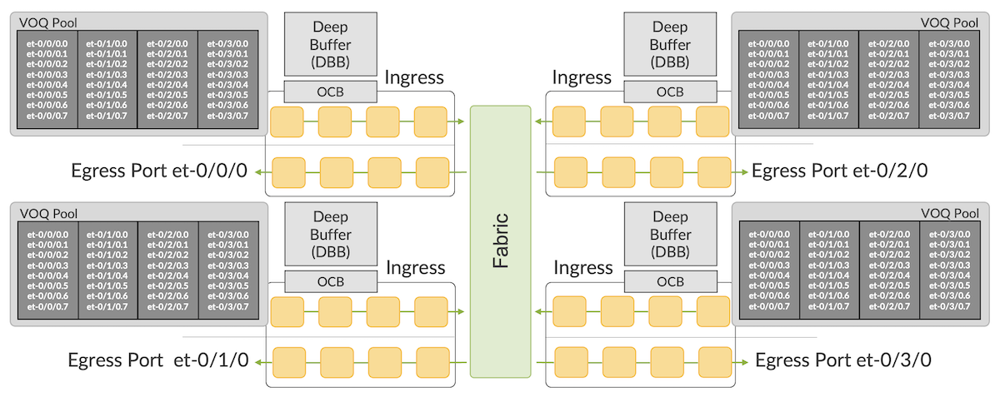
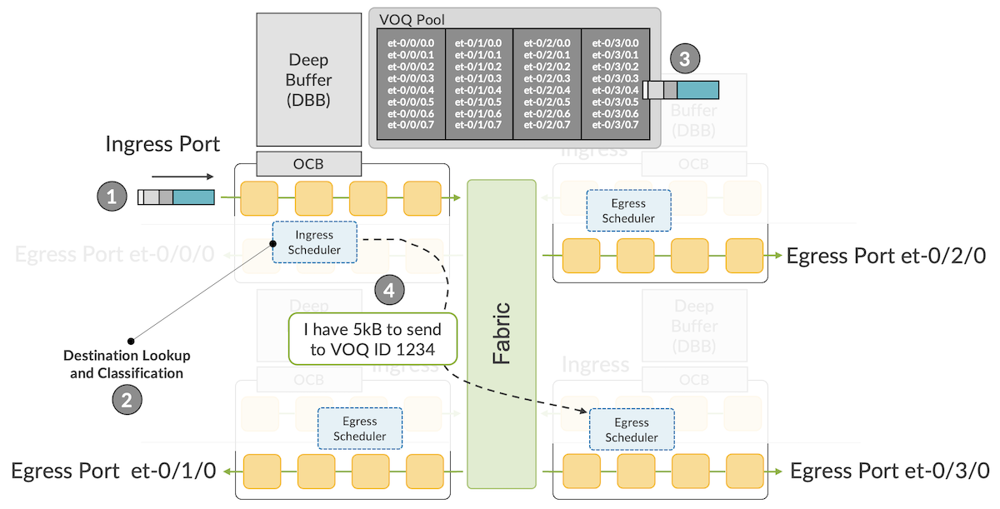
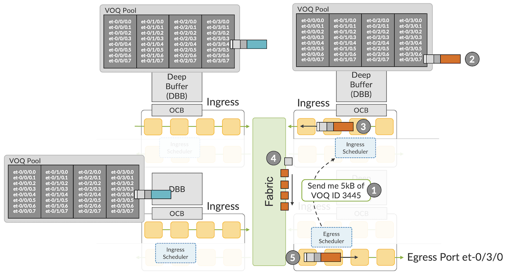
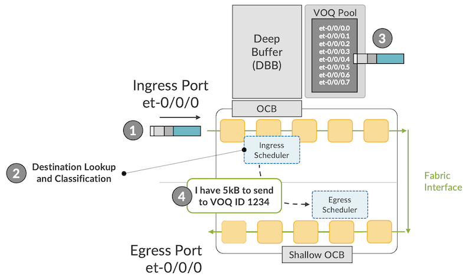
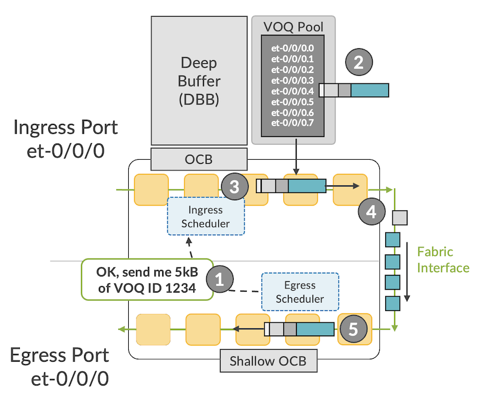
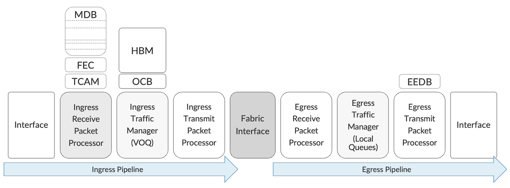

# Let's Talk About VOQ and DNX Pipeline

**Nicolas Fevrier - 07/27/2022**

To understand the life of a packet in an ACX7000 Series router, you first need to understand the idea behind Virtual Output Queues.

## Introduction

Many Network Processing Unit (NPU) architectures are available on the market today. They propose different packet buffering approaches, performed in both ingress and egress datapaths (sometimes referred to as "2-stage buffering architecture") or in the ingress pipeline only. That second case includes the DNX chipsets powering Juniper ACX Series. More details on the DNX options and their architecture has been covered in the first article of the series: [https://juniper.github.io/techposts/building-the-acx7000-series-the-pfe/article](https://juniper.github.io/techposts/building-the-acx7000-series-the-pfe/article)

In this article, we describe this packet buffering logic by following the life of a packet, and we introduce the concept of a Virtual Output Queue (VOQ).

The concept described here will be useful for all follow up articles on ACX7k platforms since these principles are common to all products in this family.

## Ingress-only Buffering

DNX ASICs used in ACX7000 Series are based on a pipeline design where the packet memory is present in the ingress part.

We talk about "ingress-only buffering model" but in all fairness, we should probably call it "ingress-mostly buffering". Indeed, a small packet buffer is still present in the egress pipeline, but it's a very shallow space compared to the very large High-Bandwidth Memory (HBM) used off-chip and reachable from the ingress pipeline.



In normal traffic conditions, the packets are stored in the **ingress** On-Chip Buffer (OCB). It's only when a queue is getting congested that packets are moved to the Delay Bandwidth Buffer (DBB) or "Off-Chip Buffer". This second memory type will be an HBM or DDR.

This mechanism of queue eviction to an off-chip buffer and return to an on-chip buffer occurs dynamically as soon as a threshold is exceeded.

The small on-chip buffer on the **egress** pipeline can be used to store packets before they are sent to the interface and can only discriminate between high and low priority. It doesn't have the size nor the structure to perform Quality of Service (QoS) treatment.

To compare the different memory sizes, let's take the Jericho2 NPU example:

- The ingress on-chip buffer is 32 MB (16 per core)
- The ingress off-chip buffer is 8 GB (shared)
- The egress on-chip buffer is 12 MB (6 per core)

Using an ingress-only deep buffer offers multiple advantages:

- It reduces by half the memory requirement
- It reduces the footprint on the Printed Circuit Board (PCB)
- It reduces the latency
- It reduces power consumption
- Eventually, it optimizes the cost

Everything in technology is a trade-off, it creates other challenges. When the packets are stored in egress before transmission, it's easy to classify them and apply different treatments with QoS policies. But when packets are buffered in potentially dozens of ingress PFEs (Packet Forwarding Engines), we need a new mechanism to guarantee the forwarding efficiency. It requires fast communication between the ingress pipeline and its egress counterpart. We are talking about "scheduling".

## Scheduled Forwarding and Virtual Output Queues

How does it work then?

When a packet is received in a port, it starts its journey in the ingress pipeline. A lookup determines the packet destination, and a classification associates the traffic to a queue. But again, the queues are not present in the outbound path, so we need to create a virtual representation of this pair (destination port, queue) that can be associated with every packet stored in the ingress pipeline.



In Diagram 2 above, we represent the queues created, from the ingress pipeline perspective, for port et-0/2/0. Note that it's not necessarily limited to a physical port, we can create "attach points" for these queues and it could be an IFL (logical interface, like a sub-interface for example).

When packets are received:

- Destination lookup is done, itself "resolved" to a destination interface (or again, an attachment point)
- Classification will be performed to differentiate packet class, by default or dictated by a QoS policy, eventually associating the packet to a queue.

At the end of the operation, we can store the packet in the buffer (for the sake of simplicity, let's imagine it will be done in the off-chip buffer, but the same logic applies to on-chip). The system stores the packet with an internal header representing the pair (destination port, queue) represented by a number. This number is a Virtual Output Queue Identifier (VOQ ID).
Again, I insist on this important aspect, the queues are not carved in memory. It should be seen as a flag added to the packet.

<personal rant> Please don't write VoQ. The "O" is for "Output", not "of" (like in QoS). Ok, it's not that important, I agree.</personal rant>

To put it differently, a VOQ is the virtual representation of a queue and an egress port, but from the ingress pipeline perspective, where the buffering is actually done.

This representation exists for the port itself, as presented in the example below in the ingress NPU on 0/1 manages the queues of local ports like et-0/1/0 and remote ports like et-0/2/0. Same thing for the ingress structure of the NPU(s) on 0/2 handling the queues for remote port et-0/1/0 and local port et-0/2/0.



The treatment is the same if the packet is targeted to the same interface it comes from (loopback or routing to a different VLAN) or if it will be sent to a remote port.

We can go further with the idea, if we have 1,000 egress ports or attachment points, we will need to create 1,000 sets of 8 queues (total 8,000 queues) on all PFEs present in the router. If it's a modular chassis made of 24 PFEs, I will need to create this 8,000-queue structure in all 24 ASICs.

That's why, by default, a VOQ scale should be considered a global number. If your ASIC supports 64,000 VOQs, it means the entire router supports 64,000 queues and all egress ports will need to share this pool. It's a fundamental difference compared to systems where packets are stored in ingress and egress paths, like the Trio chipset in the MX Series.



To illustrate it, Diagram 4 above represents 4 different egress interfaces located on 4 distinct PFEs. You can extend the idea to thousands of ports (it's just pretty hard to illustrate on a diagram ;))

## Life of a Packet

In the ingress pipeline, we will break the process into four steps:



1. A packet is received on port et-0/0/0 (mapped to the core 0 of the PFE 0/0)
2. In this ingress pipeline, multiple blocks will treat the packet, determining where the packet is meant to be sent to, and which class of traffic it belongs to. This will help figure out an egress port (and the egress PFE associated) and a queue, represented by a VOQ ID. In our example, port et-0/3/0 and queue 5, VOQ 1234
3. The packet is stored in HBM, with additional internal headers, including information like the VOQ ID. The system keeps track of the memory position used to store this packet.
4. The Ingress Scheduler informs the destination Egress Scheduler present in the PFE pipeline associated with the port et-0/3/0 that it has 5kB of traffic for this particular VOQ. And that's all it will do now until further notification.

For the egress part of the process, let's imagine our Egress Scheduler on PFE 0/3 received solicitations to transmit packets to interface et-0/3/0 from 3 different ingress PFEs.

From PFE 0/2 (top right of the diagram), it received a solicitation for a high-priority packet in port et-0/3/0 queue 7 (VOQ ID 3445).

And from PFE 0/0 and 0/1 it received a solicitation for packets targeted to port et-0/3/0 queue 4, the best effort queue (VOQ ID 1234).



Our egress PFE has 3 solicitations to address and based on the QoS configuration, it will decide that the high-priority packet from PFE 0/2 needs to be transmitted.

1. The Egress Scheduler will generate a token or grant, to the Ingress Scheduler of PFE 0/2 (top right), for a specific amount of traffic.
2. With this "right to transmit" the Ingress Scheduler will trigger the dequeue of this high-priority packet
3. It will continue its journey in the last blocks of the ingress pipeline. The last step will consist in splitting the packets into cells and spraying them among the available fabric interfaces
4. The cells are routed to the destination PFE in the fabric
5. Cells are re-assembled and the high-priority packet continues its journey in the egress pipeline, with a short buffering in the "EGQ" (Egress port Queue). In that step, a very basic classification will occur, differentiating high from low priority packets and unicast from multicast. After all egress features are applied, the packet is transmitted to its next-hop via et-0/3/0

The system is now ready to service the two remaining solicitations. Since they have the same destination and queue, they have the same priority and will be treated in a round-robin fashion. The same 5 steps described above will be executed, a token sent to the Ingress Scheduler, the packets "cell-ified" will travel to the destination PFE via the fabric interfaces, and they will be eventually transmitted to port et-0/3/0.

In this model, the packet forwarding is "scheduled", which means it relies entirely on the constant and extremely fast communication between all ingress and egress schedulers of the different PFEs in the system.

Note: the total traffic to port et-0/3/0 queue 4 is not really measured on the egress PFE, but it's the sum of all the requests to transmit scattered among all ingress PFEs. That makes the traffic accounting a bit more challenging in very large multi-PFE systems.

It also applies to system-on-the-chip (SoC) architectures, even if they are made of a single core (like the Jericho2c for example).



In the ingress direction, we have the same steps as described earlier, with the only difference, the destination resolution points to a local interface. But whether the egress pipeline is local or remote, it makes no difference from the ingress scheduler's perspective, it simply informs the destination of its desire to transmit traffic to a specific VOQ.



On the egress side too, no difference if the request went from a distant or a local scheduler. It will decide the allocation of tokens/rights to transmit based on the quality of service configuration. Even if everything happens in the same PFE core, the packets are still "cell-ified" to be transmitted to the fabric interface, and the cells are re-assembled when arriving in the egress pipeline.

## Illustration with CLI

You'll understand now the key concept: the queues for a specific egress port are scattered all around the router. Refer to this article to understand the different Packet Forwarding Engines (PFE) used in the different ACX7k family members: [https://juniper.github.io/techposts/building-the-acx7000-series-the-pfe/article](https://juniper.github.io/techposts/building-the-acx7000-series-the-pfe/article)

If it's a single PFE device (aka SoC/RoC for System/Router on a Chip), the queues are naturally present on this single NPU, as it's the case for an ACX7100-32C or ACX7100-48L:

```
regress@rtme-acx7100-32c-a> show interfaces et-0/0/0 | grep Index
  Interface index: 1006, SNMP ifIndex: 505
  Logical interface et-0/0/0.16386 (Index 1001) (SNMP ifIndex 508)
 
regress@rtme-acx7100-32c-a> show interfaces et-0/0/1 | grep Index    
  Interface index: 1007, SNMP ifIndex: 507
  Logical interface et-0/0/1.16386 (Index 1002) (SNMP ifIndex 510)
 
regress@rtme-acx7100-32c-a> show interfaces et-0/0/2 | grep Index  
  Interface index: 1008, SNMP ifIndex: 509
  Logical interface et-0/0/2.16386 (Index 1003) (SNMP ifIndex 512)
 
regress@rtme-acx7100-32c-a> show interfaces et-0/0/3 | grep Index   
  Interface index: 1009, SNMP ifIndex: 511
  Logical interface et-0/0/3.16386 (Index 1004) (SNMP ifIndex 514)
 
jnx(/dev/pts/1)# show cos ifd 1006  
IFD Name : et-0/0/0
IFD Index : 1006
BCM Port : 1
IFD h/w information
        slotId         : 0
        Unit           : 0
        BCM Port       : 1
        System Port    : 1
        Port Gport     : 0x8000001
        Voq Base id    : 40
        Unit           : 0 Connector Flow id : 40
        Unit           : 0 Gport ucast voq connector group : 0xc4000028
        Port Speed     : 100000000000 bps
        Shaping Rate   : 0 bps
        AE scale factor: 1
        Scheduler map Id : 2
 
jnx(/dev/pts/1)# show cos ifd 1007
IFD Name : et-0/0/1
IFD Index : 1007
BCM Port : 3
IFD h/w information
        slotId         : 0
        Unit           : 0
        BCM Port       : 3
        System Port    : 3
        Port Gport     : 0x8000003
        Voq Base id    : 56
        Unit           : 0 Connector Flow id : 56
        Unit           : 0 Gport ucast voq connector group : 0xc4000038
        Port Speed     : 100000000000 bps
        Shaping Rate   : 0 bps
        AE scale factor: 1
        Scheduler map Id : 2
 
jnx(/dev/pts/1)# show cos ifd 1008
IFD Name : et-0/0/2
IFD Index : 1008
BCM Port : 5
IFD h/w information
        slotId         : 0
        Unit           : 0
        BCM Port       : 5
        System Port    : 5
        Port Gport     : 0x8000005
        Voq Base id    : 72
        Unit           : 0 Connector Flow id : 72
        Unit           : 0 Gport ucast voq connector group : 0xc4000048
        Port Speed     : 100000000000 bps
        Shaping Rate   : 0 bps
        AE scale factor: 1
        Scheduler map Id : 2
 
jnx(/dev/pts/1)# show cos ifd 1009
IFD Name : et-0/0/3
IFD Index : 1009
BCM Port : 7
IFD h/w information
        slotId         : 0
        Unit           : 0
        BCM Port       : 7
        System Port    : 7
        Port Gport     : 0x8000007
        Voq Base id    : 88
        Unit           : 0 Connector Flow id : 88
        Unit           : 0 Gport ucast voq connector group : 0xc4000058
        Port Speed     : 100000000000 bps
        Shaping Rate   : 0 bps
        AE scale factor: 1
        Scheduler map Id : 2
 
jnx(/dev/pts/1)#

```

In the example of ACX7100-32C above, we consider the first four 100GE ports.

The VOQ Base ID represents the first VOQ ID for an interface. The system allocates 8 VOQ IDs per interface, but you'll notice with have 16 between et-0/0/0 and et-0/0/1 and 32 between et-0/0/0 and et-0/0/2...

It's simply because port et-0/0/0 can be used with a breakout cable and four ports. It will disable the port et-0/0/1 so we will have 4 channelized interfaces from et-0/0/0:0 to et-0/0/0:3, each one will be allocated 8 VOQs.

In the next example, we are considering an ACX7509. It's a centralized platform based on two REs and two FEBs. Each forwarding board contains two Qumran2C in a back-to-back configuration.

Logically, half of the ports will be connected on one PFE and the other half to the second PFE.

```
root@acx7509-p1b-a-re0> show interfaces queue et-6/0/0
Physical interface: et-6/0/0, up, Physical link is Up
  Interface index: 1026, SNMP ifIndex: 505
Forwarding classes: 8 supported, 8 in use
Egress queues: 8 supported, 8 in use
Queue: 0, Forwarding classes: q0
  Queued:
    Packets              :                     0                     0 pps
    Bytes                :                     0                     0 bps
  Transmitted:
    Packets              :                     0                     0 pps
    Bytes                :                     0                     0 bps
    Tail-dropped packets :                     0                     0 pps
    Tail-dropped bytes   :                     0                     0 bps
    RED-dropped packets  :                     0                     0 pps
    RED-dropped bytes    :                     0                     0 bps
Queue: 1, Forwarding classes: q1
  Queued:
    Packets              :                     0                     0 pps
    Bytes                :                     0                     0 bps
  Transmitted:
    Packets              :                     0                     0 pps
    Bytes                :                     0                     0 bps
    Tail-dropped packets :                     0                     0 pps
    Tail-dropped bytes   :                     0                     0 bps
    RED-dropped packets  :                     0                     0 pps
    RED-dropped bytes    :                     0                     0 bps
Queue: 2, Forwarding classes: q2
  Queued:
    Packets              :                     0                     0 pps
    Bytes                :                     0                     0 bps
  Transmitted:
    Packets              :                     0                     0 pps
    Bytes                :                     0                     0 bps
    Tail-dropped packets :                     0                     0 pps
    Tail-dropped bytes   :                     0                     0 bps
    RED-dropped packets  :                     0                     0 pps
    RED-dropped bytes    :                     0                     0 bps
Queue: 3, Forwarding classes: q3       
  Queued:
    Packets              :                 72660                     0 pps
    Bytes                :               7629300                   152 bps
  Transmitted:
    Packets              :                 72660                     0 pps
    Bytes                :               7629300                   152 bps
    Tail-dropped packets :                     0                     0 pps
    Tail-dropped bytes   :                     0                     0 bps
    RED-dropped packets  :                     0                     0 pps
    RED-dropped bytes    :                     0                     0 bps
Queue: 4, Forwarding classes: q4
  Queued:
    Packets              :                     0                     0 pps
    Bytes                :                     0                     0 bps
  Transmitted:
    Packets              :                     0                     0 pps
    Bytes                :                     0                     0 bps
    Tail-dropped packets :                     0                     0 pps
    Tail-dropped bytes   :                     0                     0 bps
    RED-dropped packets  :                     0                     0 pps
    RED-dropped bytes    :                     0                     0 bps
Queue: 5, Forwarding classes: q5
  Queued:
    Packets              :                     0                     0 pps
    Bytes                :                     0                     0 bps
  Transmitted:
    Packets              :                     0                     0 pps
    Bytes                :                     0                     0 bps
    Tail-dropped packets :                     0                     0 pps
    Tail-dropped bytes   :                     0                     0 bps
    RED-dropped packets  :                     0                     0 pps
    RED-dropped bytes    :                     0                     0 bps
Queue: 6, Forwarding classes: q6
  Queued:
    Packets              :                     0                     0 pps
    Bytes                :                     0                     0 bps
  Transmitted:                         
    Packets              :                     0                     0 pps
    Bytes                :                     0                     0 bps
    Tail-dropped packets :                     0                     0 pps
    Tail-dropped bytes   :                     0                     0 bps
    RED-dropped packets  :                     0                     0 pps
    RED-dropped bytes    :                     0                     0 bps
Queue: 7, Forwarding classes: q7
  Queued:
    Packets              :                     0                     0 pps
   Bytes                :                     0                     0 bps
  Transmitted:
    Packets              :                     0                     0 pps
    Bytes                :                     0                     0 bps
    Tail-dropped packets :                     0                     0 pps
    Tail-dropped bytes   :                     0                     0 bps
    RED-dropped packets  :                     0                     0 pps
    RED-dropped bytes    :                     0                     0 bps
 
{master}
root@acx7509-p1b-a-re0>

root@acx7509-p1b-a-re0> show interfaces voq et-6/0/0  
Physical interface: et-6/0/0, up, Physical link is Up
  Interface index: 1026, SNMP ifIndex: 505
 
Queue: 0, Forwarding classes: q0
 
  FPC number: 0
    PFE: 0
    Queued:
      Packets               :                     0                     0 pps
      Bytes                 :                     0                     0 bps
    Transmitted:
      Packets               :                     0                     0 pps
      Bytes                 :                     0                     0 bps
    Dropped:
      Tail-dropped packets  :                     0                     0 pps
      Tail-dropped bytes    :                     0                     0 bps
      RED-dropped packets   :                     0                     0 pps
      RED-dropped bytes     :                     0                     0 bps
    Queue-depth bytes:
      Current               :                     0
      Peak                  :                     0
      Average               :                     0
 
    PFE: 1
    Queued:
      Packets               :                     0                     0 pps
      Bytes                 :                     0                     0 bps
    Transmitted:
      Packets               :                     0                     0 pps
      Bytes                 :                     0                     0 bps
    Dropped:
      Tail-dropped packets  :                     0                     0 pps
      Tail-dropped bytes    :                     0                     0 bps
      RED-dropped packets   :                     0                     0 pps
      RED-dropped bytes     :                     0                     0 bps
    Queue-depth bytes:
      Current               :                     0
      Peak                  :                     0
      Average               :                     0
 
 
Queue: 1, Forwarding classes: q1
 
  FPC number: 0
    PFE: 0
    Queued:
      Packets               :                     0                     0 pps
      Bytes                 :                     0                     0 bps
    Transmitted:
      Packets               :                     0                     0 pps
      Bytes                 :                     0                     0 bps
    Dropped:
      Tail-dropped packets  :                     0                     0 pps
      Tail-dropped bytes    :                     0                     0 bps
      RED-dropped packets   :                     0                     0 pps
      RED-dropped bytes     :                     0                     0 bps
    Queue-depth bytes:
      Current               :                     0
      Peak                  :                     0
      Average               :                     0
 
    PFE: 1
    Queued:
      Packets               :                     0                     0 pps
      Bytes                 :                     0                     0 bps
    Transmitted:
      Packets               :                     0                     0 pps
      Bytes                 :                     0                     0 bps
    Dropped:
      Tail-dropped packets  :                     0                     0 pps
      Tail-dropped bytes    :                     0                     0 bps
      RED-dropped packets   :                     0                     0 pps
      RED-dropped bytes     :                     0                     0 bps
    Queue-depth bytes:
      Current               :                     0
      Peak                  :                     0
      Average               :                     0
 
                                       
Queue: 2, Forwarding classes: q2
 
  FPC number: 0
    PFE: 0
    Queued:
      Packets               :                     0                     0 pps
      Bytes                 :                     0                     0 bps
    Transmitted:
      Packets               :                     0                     0 pps
      Bytes                 :                     0                     0 bps
    Dropped:
      Tail-dropped packets  :                     0                     0 pps
      Tail-dropped bytes    :                     0                     0 bps
      RED-dropped packets   :                     0                     0 pps
      RED-dropped bytes     :                     0                     0 bps
    Queue-depth bytes:
      Current               :                     0
      Peak                  :                     0
      Average               :                     0
 
    PFE: 1
    Queued:
      Packets               :                     0                     0 pps
      Bytes                 :                     0                     0 bps
    Transmitted:
      Packets               :                     0                     0 pps
      Bytes                 :                     0                     0 bps
    Dropped:
      Tail-dropped packets  :                     0                     0 pps
      Tail-dropped bytes    :                     0                     0 bps
      RED-dropped packets   :                     0                     0 pps
      RED-dropped bytes     :                     0                     0 bps
    Queue-depth bytes:
      Current               :                     0
      Peak                  :                     0
      Average               :                     0
 
                                       
Queue: 3, Forwarding classes: q3
 
  FPC number: 0
    PFE: 0
    Queued:
      Packets               :                     0                     0 pps
      Bytes                 :                     0                     0 bps
    Transmitted:
      Packets               :                     0                     0 pps
      Bytes                 :                     0                     0 bps
    Dropped:
      Tail-dropped packets  :                     0                     0 pps
      Tail-dropped bytes    :                     0                     0 bps
      RED-dropped packets   :                     0                     0 pps
      RED-dropped bytes     :                     0                     0 bps
    Queue-depth bytes:
      Current               :                     0
      Peak                  :                     0
      Average               :                     0
 
    PFE: 1
    Queued:
      Packets               :                 72666                     0 pps
      Bytes                 :               7629930                   152 bps
    Transmitted:
      Packets               :                 72666                     0 pps
      Bytes                 :               7629930                   152 bps
    Dropped:
      Tail-dropped packets  :                     0                     0 pps
      Tail-dropped bytes    :                     0                     0 bps
      RED-dropped packets   :                     0                     0 pps
      RED-dropped bytes     :                     0                     0 bps
    Queue-depth bytes:
      Current               :                     0
      Peak                  :                     0
      Average               :                     0
 
                                        
Queue: 4, Forwarding classes: q4
 
  FPC number: 0
    PFE: 0
    Queued:
      Packets               :                     0                     0 pps
      Bytes                 :                     0                     0 bps
    Transmitted:
      Packets               :                     0                     0 pps
      Bytes                 :                     0                     0 bps
    Dropped:
      Tail-dropped packets  :                     0                     0 pps
      Tail-dropped bytes    :                     0                     0 bps
      RED-dropped packets   :                     0                     0 pps
      RED-dropped bytes     :                     0                     0 bps
    Queue-depth bytes:
      Current               :                     0
      Peak                  :                     0
      Average               :                     0
 
    PFE: 1
    Queued:
      Packets               :                     0                     0 pps
      Bytes                 :                     0                     0 bps
    Transmitted:
      Packets               :                     0                     0 pps
      Bytes                 :                     0                     0 bps
    Dropped:
      Tail-dropped packets  :                     0                     0 pps
      Tail-dropped bytes    :                     0                     0 bps
      RED-dropped packets   :                     0                     0 pps
      RED-dropped bytes     :                     0                     0 bps
    Queue-depth bytes:
      Current               :                     0
      Peak                  :                     0
      Average               :                     0
 
                                       
Queue: 5, Forwarding classes: q5
 
  FPC number: 0
    PFE: 0
    Queued:
      Packets               :                     0                     0 pps
      Bytes                 :                     0                     0 bps
    Transmitted:
      Packets               :                     0                     0 pps
      Bytes                 :                     0                     0 bps
    Dropped:
      Tail-dropped packets  :                     0                     0 pps
      Tail-dropped bytes    :                     0                     0 bps
      RED-dropped packets   :                     0                     0 pps
      RED-dropped bytes     :                     0                     0 bps
    Queue-depth bytes:
      Current               :                     0
      Peak                  :                     0
      Average               :                     0
 
    PFE: 1
    Queued:
      Packets               :                     0                     0 pps
      Bytes                 :                     0                     0 bps
    Transmitted:
      Packets               :                     0                     0 pps
      Bytes                 :                     0                     0 bps
    Dropped:
      Tail-dropped packets  :                     0                     0 pps
      Tail-dropped bytes    :                     0                     0 bps
      RED-dropped packets   :                     0                     0 pps
      RED-dropped bytes     :                     0                     0 bps
    Queue-depth bytes:
      Current               :                     0
      Peak                  :                     0
      Average               :                     0
 
                                       
Queue: 6, Forwarding classes: q6
 
  FPC number: 0
    PFE: 0
    Queued:
      Packets               :                     0                     0 pps
      Bytes                 :                     0                     0 bps
    Transmitted:
      Packets               :                     0                     0 pps
      Bytes                 :                     0                     0 bps
    Dropped:
      Tail-dropped packets  :                     0                     0 pps
      Tail-dropped bytes    :                     0                     0 bps
      RED-dropped packets   :                     0                     0 pps
      RED-dropped bytes     :                     0                     0 bps
    Queue-depth bytes:
      Current               :                     0
      Peak                  :                     0
      Average               :                     0
 
    PFE: 1
    Queued:
      Packets               :                     0                     0 pps
      Bytes                 :                     0                     0 bps
    Transmitted:
      Packets               :                     0                     0 pps
      Bytes                 :                     0                     0 bps
    Dropped:
      Tail-dropped packets  :                     0                     0 pps
      Tail-dropped bytes    :                     0                     0 bps
      RED-dropped packets   :                     0                     0 pps
      RED-dropped bytes     :                     0                     0 bps
    Queue-depth bytes:
      Current               :                     0
      Peak                  :                     0
      Average               :                     0
 
                                       
Queue: 7, Forwarding classes: q7
 
  FPC number: 0
    PFE: 0
    Queued:
      Packets               :                     0                     0 pps
      Bytes                 :                     0                     0 bps
    Transmitted:
      Packets               :                     0                     0 pps
      Bytes                 :                     0                     0 bps
    Dropped:
      Tail-dropped packets  :                     0                     0 pps
      Tail-dropped bytes    :                     0                     0 bps
      RED-dropped packets   :                     0                     0 pps
      RED-dropped bytes     :                     0                     0 bps
    Queue-depth bytes:
      Current               :                     0
      Peak                  :                     0
      Average               :                     0
 
    PFE: 1
    Queued:
      Packets               :                     0                     0 pps
      Bytes                 :                     0                     0 bps
    Transmitted:
      Packets               :                     0                     0 pps
      Bytes                 :                     0                     0 bps
    Dropped:
      Tail-dropped packets  :                     0                     0 pps
      Tail-dropped bytes    :                     0                     0 bps
      RED-dropped packets   :                     0                     0 pps
      RED-dropped bytes     :                     0                     0 bps
    Queue-depth bytes:
      Current               :                     0
      Peak                  :                     0
      Average               :                     0
 
 
{master}
root@acx7509-p1b-a-re0>

```

You notice in these CLI outputs that we can display the aggregated stats in the show interface queue while we display the stats of the VOQ for each individual PFE with the show interface voq command.

In this ACX7509 case above, we just have two PFEs.

But the output will become much longer with a chassis form factor like the ACX7908. In this last example below, we have 3 line cards (FPC):

- Slot 2: FPC with a single PFE
- Slot 3: same kind of FPC with a single PFE
- Slot 6: denser FPC with 3 PFEs

```
root@acx7908-sw-pfe-d-re0> show interfaces queue et-6/0/9:0
Physical interface: et-6/0/9:0, up, Physical link is Up
  Interface index: 1216, SNMP ifIndex: 810
Forwarding classes: 8 supported, 4 in use
Egress queues: 8 supported, 4 in use
Queue: 0, Forwarding classes: best-effort
  Queued:
    Packets              :                     0                     0 pps
    Bytes                :                     0                     0 bps
  Transmitted:
    Packets              :                     0                     0 pps
    Bytes                :                     0                     0 bps
    Tail-dropped packets :                     0                     0 pps
    Tail-dropped bytes   :                     0                     0 bps
    RED-dropped packets  :                     0                     0 pps
    RED-dropped bytes    :                     0                     0 bps
Queue: 1, Forwarding classes: expedited-forwarding
  Queued:
   Packets              :                     0                     0 pps
    Bytes                :                     0                     0 bps
  Transmitted:
    Packets              :                     0                     0 pps
    Bytes                :                     0                     0 bps
    Tail-dropped packets :                     0                     0 pps
    Tail-dropped bytes   :                     0                     0 bps
    RED-dropped packets  :                     0                     0 pps
    RED-dropped bytes    :                     0                     0 bps
Queue: 2, Forwarding classes: assured-forwarding
  Queued:
    Packets              :                     0                     0 pps
    Bytes                :                     0                     0 bps
  Transmitted:
    Packets              :                     0                     0 pps
    Bytes                :                     0                     0 bps
    Tail-dropped packets :                     0                     0 pps
    Tail-dropped bytes   :                     0                     0 bps
    RED-dropped packets  :                     0                     0 pps
    RED-dropped bytes    :                     0                     0 bps
Queue: 3, Forwarding classes: network-control
  Queued:
    Packets              :                     0                     0 pps
    Bytes                :                     0                     0 bps
  Transmitted:
    Packets              :                     0                     0 pps
    Bytes                :                     0                     0 bps
    Tail-dropped packets :                     0                     0 pps
    Tail-dropped bytes   :                     0                     0 bps
    RED-dropped packets  :                     0                     0 pps
    RED-dropped bytes    :                     0                     0 bps
 
{master}
root@acx7908-sw-pfe-d-re0> show interfaces voq et-6/0/9:0
Physical interface: et-6/0/9:0, up, Physical link is Up
  Interface index: 1216, SNMP ifIndex: 810
 
Queue: 0, Forwarding classes: best-effort
 
  FPC number: 2
    PFE: 0
    Queued:
      Packets               :                     0                     0 pps
      Bytes                 :                     0                     0 bps
    Transmitted:
      Packets               :                     0                     0 pps
      Bytes                 :                     0                     0 bps
    Dropped:
      Tail-dropped packets  :                     0                     0 pps
      Tail-dropped bytes    :                     0                     0 bps
      RED-dropped packets   :                     0                     0 pps
      RED-dropped bytes     :                     0                     0 bps
    Queue-depth bytes:
      Current               :                     0
      Peak                  :                     0
      Average               :                     0
 
 
  FPC number: 3
    PFE: 0
    Queued:
      Packets               :                     0                     0 pps
      Bytes                 :                     0                     0 bps
    Transmitted:
      Packets               :                     0                     0 pps
      Bytes                 :                     0                     0 bps
    Dropped:
      Tail-dropped packets  :                     0                     0 pps
      Tail-dropped bytes    :                     0                     0 bps
      RED-dropped packets   :                     0                     0 pps
      RED-dropped bytes     :                     0                     0 bps
    Queue-depth bytes:                 
      Current               :                     0
     Peak                  :                     0
      Average               :                     0
 
 
  FPC number: 6
    PFE: 0
    Queued:
      Packets               :                     0                     0 pps
      Bytes                 :                     0                     0 bps
    Transmitted:
      Packets               :                     0                     0 pps
      Bytes                 :                     0                     0 bps
    Dropped:
      Tail-dropped packets  :                     0                     0 pps
      Tail-dropped bytes    :                     0                     0 bps
      RED-dropped packets   :                     0                     0 pps
      RED-dropped bytes     :                     0                     0 bps
    Queue-depth bytes:
      Current               :                     0
      Peak                  :                     0
      Average               :                     0
 
    PFE: 1
    Queued:
      Packets               :                     0                     0 pps
      Bytes                 :                     0                     0 bps
    Transmitted:
      Packets               :                     0                     0 pps
      Bytes                 :                     0                     0 bps
    Dropped:
      Tail-dropped packets  :                     0                     0 pps
      Tail-dropped bytes    :                     0                     0 bps
      RED-dropped packets   :                     0                     0 pps
      RED-dropped bytes     :                     0                     0 bps
    Queue-depth bytes:
      Current               :                     0
      Peak                  :                     0
      Average               :                     0
 
    PFE: 2
    Queued:
      Packets               :                     0                     0 pps
      Bytes                 :                     0                     0 bps
    Transmitted:
      Packets               :                     0                     0 pps
      Bytes                 :                     0                     0 bps
    Dropped:
      Tail-dropped packets  :                     0                     0 pps
      Tail-dropped bytes    :                     0                     0 bps
      RED-dropped packets   :                     0                     0 pps
      RED-dropped bytes     :                     0                     0 bps
    Queue-depth bytes:
      Current               :                     0
      Peak                  :                     0
      Average               :                     0
 
 
Queue: 1, Forwarding classes: expedited-forwarding
 
<We removed the output for the three remaining queues for the sake of brevity)> 
 
{master}
root@acx7908-sw-pfe-d-re0>

```

## The pipeline

You can find a lot of details in the Traffic Management Architecture Design Guide here: [https://docs.broadcom.com/doc/88800-DG1-PUB](https://docs.broadcom.com/doc/88800-DG1-PUB)

To summarize the key concepts, we can represent the pipeline like this:



Packets are received from ingress interfaces, but this description doesn't only apply to network interfaces (NIFs). Traffic could also come from the:

- Recycle interfaces
- CPU interface
- OAMP (Operation and Maintenance Processor) interface
- SAT (Service Availability Testing) interface
- And some others like OLP (Offload Processor) interfaces

The first 144 bytes of each packet are sent to the IRPP (Ingress Receive Packet Processor).

- IRPP takes care of the majority of the features, including the identification of the incoming interface, the lookup  (L2, L3, MPLS, ...), the next hop resolution and load balancing, the filtering, the insertion of internal headers and many more
- ITM handles the queues, on-chip or off-chip. That's also where the multicast replication can be performed
- ITPP is the last step before the fabric interface, packets can be edited here also
- ERPP manages some of the egress features like filtering
- ETM handles the queues from the egress perspective and can also perform multicast replication
- ETPP can edit packets based on indication from the ingress pipeline (present in the internal headers)

## Conclusion

This article provided some details on the life of a unicast packet in the DNX-based systems and presented the concept of Virtual Output Queue, essential to understand how the ACX7k Series products operate. In the next articles, we will dig deep into the internals of each ACX7k family members.

## Useful links

- [https://docs.broadcom.com/doc/88800-DG1-PUB](https://docs.broadcom.com/doc/88800-DG1-PUB)
- Building the ACX7000 Series - The PFE: [https://juniper.github.io/techposts/building-the-acx7000-series-the-pfe/article](https://juniper.github.io/techposts/building-the-acx7000-series-the-pfe/article)

## Glossary

- CoS/QoS: Class of Service / Quality of Service
- DBB: Delay Bandwidth Buffer
- DDR: Double Data Rate (Memory)
- EGQ: Egress Queue
- HBM: High Bandwidth Memory
- IFL: Logical Interface
- PFE: Packet Forwarding Engine
- NPU: Network Processing Unit
- OAMP: Operation and Maintenance Processor
- OCB: On-Chip Buffer
- OLP: Offload Processor
- SAT/ Service Availability Testing
- TM: Traffic Manager
- VOQ / VOQ ID: Virtual Output Queue / Identifier
- SoC: System on a Chip

## Acknowledgements

Thanks a lot to Biju Kumar Karunakaran Nair for all the details on queueing and review of this document.
