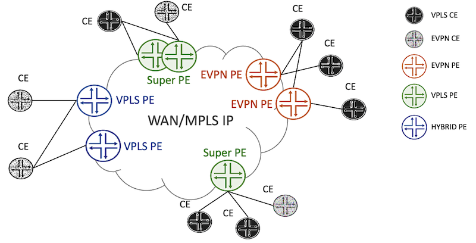
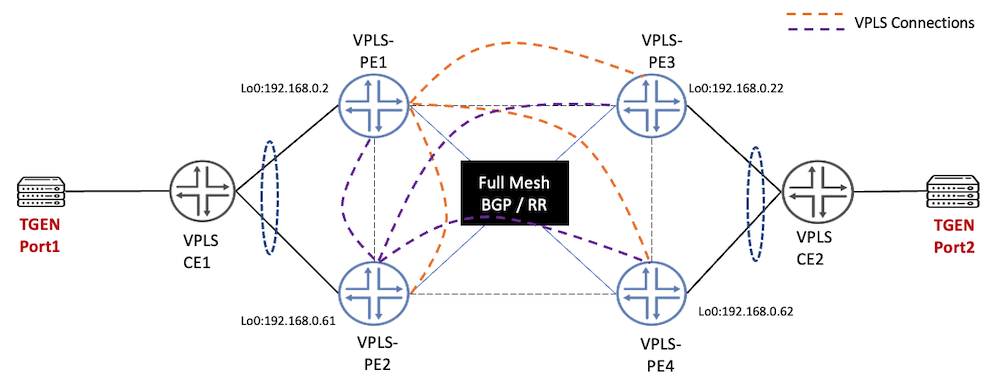
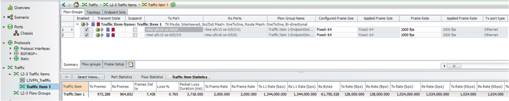
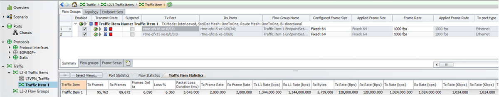
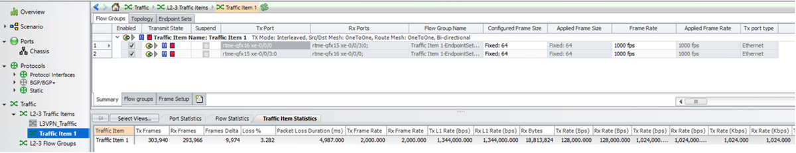
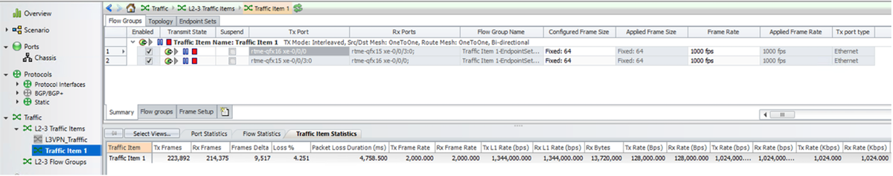

# VPLS to EVPN-VPLS Seamless Migration on MX Routers

**Ramdas Machat - 11/01/2022**

Techniques, configurations and best practices for migrating from legacy business services to EVPN on MX Routers.

## Introduction

Service providers started adopting the EVPN technology as a replacement for their L2 technology requirements like VPLS, L2VPN. There is a lot of benefits of EVPN as a technology which is briefly covered in the below section. At the same time service providers also look for the migration of the legacy L2 technologies (which has with a lot of limitations) to the EVPN technology.

This solution provides a lot of flexibility to the service providers in doing a staged migration and the best part is the coexistence of the legacy technologies and EVPN at the same time as described in Figure 1. So, PEs in different segments can run VPLS and EVPN for the same VPN routing instance. Also, the migration supports all the different scenarios like single-homed / multi-homed PEs.



The [TechLibrary article linked here](https://www.juniper.net/documentation/us/en/software/junos/evpn-vxlan/topics/concept/bgp-vpls-to-evpn-migration.html) describes the migration from BGP VPLS to EVPN.

EVPN is a next-generation technology helping the service providers to overcome the limitations of the legacy L2 business services. It's a more efficient technology with better control plane, the data plane learning and programming capabilities.

EVPN over MPLS is considered the main enabler of the Carrier Ethernet services in the Metro Area Networks (MAN) and Mobile BackHaul (MBH) networks by many service providers and is the integral attribute of the Cloud Metro Architecture. It covers all possible overlay service topology: point-to-point, multipoint-to-multipoint and point-to-multipoint, seamlessly. The table below shows the mapping of Layer 2 service definitions with different industry stands and technology including EVPN.

| Standard | Point-to-Point | Multipoint-to-Multipoint | Point-to-Multipoint |
|:--|:--|:--|:--|
| MEF | E-LINE | E-LAN | E-TREE |
| IETF | VPWS (Virtual Private Wire Service) | VPLS (Virtual Private LAN Service) | Achieved using Flooding mechanism |
| Martini (LDP) | L2Circuit | VPLS | H-VPLS |
| BGP | L2VPN/FEC-129 | VPLS/FEC-129 | H-VPLS/FEC-129 |
| EVPN | EVPN-EVPS | EVPN | EVPN E-Tree |

### Seamless Migration: Best practices

Let's pick a VPLS PE router with multiple instances. The idea of "seamless migration" represents the capability of migrating some instances to EVPN technology while maintaining the VPLS operation on the other instances. The instance migrated to EVPN can also operate with a VPLS instance till the other end VPLS PE is also migrated to EVPN.

Here are some best practices for migration.

1. In a scaled environment, pick the VPLS PE instances with lower MAC count and least traffic. Do the migration (procedure in details given below) and wait for all the MAC addresses to be learnt and traffic is forwarded successfully.
2. When all the instances are migrated, the PE is completely migrated to EVPN: it is time to clean-up old configuration. For the BGP-VPLS clean-up, a BGP flap is expected because of signalling and negotiation of BGP capabilities.
3. Migrate all multihomed PEs to EVPN and do NOT leave some as VPLS-only and migrate others (as VPLS and EVPN use different algorithms to decide Designated forwarder). Multihomed PEs must be in sync regarding the forwarding decision of BUM traffic received from the core towards access.



|  | CE1 | PE1 | PE2 | PE3 | PE4 | CE2 |
|:--|:--|:--|:--|:--|:--|:--|
| Model | qfx5110-48s-4c | MX480 | MX10008 | MX240 | MX960 | qfx5200-32c-32q |
| JUNOS Version | 20.2R2.11 | 22.1R2 | 22.1R2 | 22.1R2 | 22.1R2 | 21.3R1.9 |

## BGP-Signaled VPLS to EVPN Migration

### BGP-VPLS Configuration and Operational status

All four PEs in the above topology are BGP-VPLS PE and have the VPLS instance setup and then relevant configurations are made in each one of these PEs. These PEs discover each other in the network and establishes the VPLS sessions. The configuration and operational status on two of the PE1 and PE4 are shown below, the rest is removed for sake of brevity.

PE1 Configuration:

```
regress@rtme-mx-02# show protocols bgp
group iBGP {
    type internal;
    local-address 192.168.0.2;
    family inet {
        unicast;
    }
    family inet-vpn {
        unicast;
    }
    family l2vpn {
        signaling;
    }
    neighbor 192.168.0.22;
    neighbor 192.168.0.62;
    neighbor 192.168.0.61;
}

regress@rtme-mx-02# show routing-instances vpls-bgp
instance-type vpls;
protocols {
    vpls {
        site site1 {
            site-identifier 2;
        }
        no-tunnel-services;
    }
```

PE4 Configuration:

```
regress@rtme-mx-62-1# show protocols bgp
group iBGP {
    type internal;
    local-address 192.168.0.62;
    family inet {
        unicast;
    }
    family inet-vpn {
        unicast;
    }
    family l2vpn {
        signaling;
    }
    neighbor 192.168.0.2;
    neighbor 192.168.0.61;
    neighbor 192.168.0.22;
}


regress@rtme-mx-62-1# show routing-instances vpls-bgp
instance-type vpls;
protocols {
    vpls {
        site site1 {
            site-identifier 62;
        }
        no-tunnel-services;
    }
}
interface et-5/0/2.1;
route-distinguisher 192.168.0.62:1;
vrf-target target:1:1;


regress@rtme-mx-62-1# show interfaces et-5/0/2
description acces-qfx15;
flexible-vlan-tagging;
encapsulation flexible-ethernet-services;
unit 1 {
    encapsulation vlan-vpls;
    vlan-id 1234;
}  
```

PE1 operational status:

```
regress@rtme-mx-02# run show vpls connections
Layer-2 VPN connections:
Instance: vpls-bgp
Edge protection: Not-Primary
  Local site: site1 (2)
    connection-site           Type  St     Time last up          # Up trans
    22                        rmt   Up     Feb 13 05:43:01 2022           1
      Remote PE: 192.168.0.22, Negotiated control-word: No
      Incoming label: 78, Outgoing label: 70
      Local interface: lsi.1048576, Status: Up, Encapsulation: VPLS
        Description: Intf - vpls vpls-bgp local site 2 remote site 22
      Flow Label Transmit: No, Flow Label Receive: No
    61                        rmt   Up     Feb 13 05:43:01 2022           1
      Remote PE: 192.168.0.61, Negotiated control-word: No
      Incoming label: 85, Outgoing label: 55
      Local interface: lsi.1048577, Status: Up, Encapsulation: VPLS
        Description: Intf - vpls vpls-bgp local site 2 remote site 61
      Flow Label Transmit: No, Flow Label Receive: No
    62                        rmt   Up     Feb 13 05:43:01 2022           1
      Remote PE: 192.168.0.62, Negotiated control-word: No
      Incoming label: 86, Outgoing label: 48
      Local interface: lsi.1048578, Status: Up, Encapsulation: VPLS
        Description: Intf - vpls vpls-bgp local site 2 remote site 62
      Flow Label Transmit: No, Flow Label Receive: No


regress@rtme-mx-02# run show bgp summary
Threading mode: BGP I/O
Default eBGP mode: advertise - accept, receive - accept
Groups: 2 Peers: 3 Down peers: 0
Table          Tot Paths  Act Paths Suppressed    History Damp State    Pending
inet.0               
                       0          0          0          0          0          0
bgp.l3vpn.0          
                       0          0          0          0          0          0
lsdist.0             
                       0          0          0          0          0          0
bgp.l2vpn.0          
                       9          9          0          0          0          0
Peer                     AS      InPkt     OutPkt    OutQ   Flaps Last Up/Dwn State|#Active/Received/Accepted/Damped...
192.168.0.22          65000        327        337       0       0     2:22:59 Establ
  inet.0: 0/0/0/0
  bgp.l3vpn.0: 0/0/0/0
  bgp.l2vpn.0: 3/3/3/0
192.168.0.61          65000       3762        334       0       0     2:22:59 Establ
  inet.0: 0/0/0/0
  bgp.l3vpn.0: 0/0/0/0
  bgp.l2vpn.0: 3/3/3/0
192.168.0.62          65000        336        336       0       0     2:22:59 Establ
  inet.0: 0/0/0/0
  bgp.l3vpn.0: 0/0/0/0
  bgp.l2vpn.0: 3/3/3/0
```

PE4 operational status:

```
regress@rtme-mx-62-1# run show vpls connections
Layer-2 VPN connections:
Instance: vpls-bgp
Edge protection: Not-Primary
  Local site: site1 (62)
    connection-site           Type  St     Time last up          # Up trans
    2                         rmt   Up     Feb 13 05:43:01 2022           1
      Remote PE: 192.168.0.2, Negotiated control-word: No
      Incoming label: 48, Outgoing label: 86
      Local interface: lsi.1048578, Status: Up, Encapsulation: VPLS
        Description: Intf - vpls vpls-bgp local site 62 remote site 2
      Flow Label Transmit: No, Flow Label Receive: No
    22                        rmt   Up     Feb 13 05:36:29 2022           1
      Remote PE: 192.168.0.22, Negotiated control-word: No
      Incoming label: 44, Outgoing label: 66
      Local interface: lsi.1048576, Status: Up, Encapsulation: VPLS
        Description: Intf - vpls vpls-bgp local site 62 remote site 22
      Flow Label Transmit: No, Flow Label Receive: No
    61                        rmt   Up     Feb 13 05:44:30 2022           1
      Remote PE: 192.168.0.61, Negotiated control-word: No
      Incoming label: 35, Outgoing label: 43
      Local interface: lsi.1048579, Status: Up, Encapsulation: VPLS
        Description: Intf - vpls vpls-bgp local site 62 remote site 61
      Flow Label Transmit: No, Flow Label Receive: No

[edit]
regress@rtme-mx-62-1# run show bgp summary
Threading mode: BGP I/O
Default eBGP mode: advertise - accept, receive - accept
Groups: 4 Peers: 7 Down peers: 2
Table          Tot Paths  Act Paths Suppressed    History Damp State    Pending
inet.0               
                       0          0          0          0          0          0
bgp.l3vpn.0          
                       0          0          0          0          0          0
bgp.l2vpn.0     
                       9          9          0          0          0          0
Peer                     AS      InPkt     OutPkt    OutQ   Flaps Last Up/Dwn State|#Active/Received/Accepted/Damped...
192.168.0.2           65000        339        337       0       2     2:24:14 Establ
  inet.0: 0/0/0/0
  bgp.l3vpn.0: 0/0/0/0
  bgp.l2vpn.0: 3/3/3/0
192.168.0.22          65000        662        662       0       0     4:52:52 Establ
  inet.0: 0/0/0/0
  bgp.l3vpn.0: 0/0/0/0
  bgp.l2vpn.0: 3/3/3/0
192.168.0.61          65000         32         30       0       0       10:19 Establ
  inet.0: 0/0/0/0
  bgp.l3vpn.0: 0/0/0/0
  bgp.l2vpn.0: 3/3/3/0
```

### PE1 Instance Migration from BGP-VPLS to EVPN

All the four PEs in the topology in Figure 2 are BGP-VPLS Pes. We will perform the migration for one of them, from VPLS to EVPN. Once completed, we will have VPLS PE on one side and EVPN PE on the other.

Migration of PE1: We add the protocol evpn details under the routing-instance and we add the family evpn signalling:

```
regress@rtme-mx-02# show routing-instances vpls-bgp
instance-type evpn;
protocols {
    evpn {              <<< Add this part to the routing instance and keep the VPLS config
        interface et-0/1/2.1;
    }
    vpls {
        site site1 {
            site-identifier 2;
        }
        no-tunnel-services;
    }
}
vlan-id 1234;
interface et-0/1/2.1;
route-distinguisher 192.168.0.2:1;
vrf-target target:1:1;

regress@rtme-mx-02# show protocols bgp group iBGP
type internal;
local-address 192.168.0.2;
family inet {
    unicast;
}
family inet-vpn {
    unicast;
}
family l2vpn {
    signaling;
}
family evpn {   <<< Add this to signal the BGP with evpn family to all the neighbours. 
                <<< You can also specifically add this under the desired neighbour for signalling.
    signaling;
}
neighbor 192.168.0.22;
neighbor 192.168.0.62;
neighbor 192.168.0.61;
```

PE1 still maintains the VPLS status with the other PE, however, the forwarding is now happening using the EVPN technology. We can see the new EVPN tables are created, and the EVPN routes are exchanged between the PEs.

```
regress@rtme-mx-02# run show vpls connections
Layer-2 VPN connections:

Instance: vpls-bgp
Edge protection: Not-Primary
  Local site: site1 (2)
    connection-site           Type  St     Time last up          # Up trans
    22                        rmt   Up     Feb 13 07:33:32 2022           1
      Remote PE: 192.168.0.22, Negotiated control-word: No
      Incoming label: 117, Outgoing label: 87
      Local interface: lsi.1049093, Status: Up, Encapsulation: VPLS
        Description: Intf - vpls vpls-bgp local site 2 remote site 22
      Flow Label Transmit: No, Flow Label Receive: No
    61                        rmt   Up     Feb 13 07:33:32 2022           1
      Remote PE: 192.168.0.61, Negotiated control-word: No
      Incoming label: 124, Outgoing label: 79
      Local interface: lsi.1049094, Status: Up, Encapsulation: VPLS
        Description: Intf - vpls vpls-bgp local site 2 remote site 61
      Flow Label Transmit: No, Flow Label Receive: No
    62                        rmt   Up     Feb 13 07:33:32 2022           1
      Remote PE: 192.168.0.62, Negotiated control-word: No
      Incoming label: 125, Outgoing label: 67
      Local interface: lsi.1049095, Status: Up, Encapsulation: VPLS
        Description: Intf - vpls vpls-bgp local site 2 remote site 62
      Flow Label Transmit: No, Flow Label Receive: No


regress@rtme-mx-02# run show bgp summary
Threading mode: BGP I/O
Default eBGP mode: advertise - accept, receive - accept
Groups: 2 Peers: 3 Down peers: 0
Table          Tot Paths  Act Paths Suppressed    History Damp State    Pending
inet.0
                       0          0          0          0          0          0
bgp.l3vpn.0
                       0          0          0          0          0          0
bgp.evpn.0
                       0          0          0          0          0          0
lsdist.0
                       0          0          0          0          0          0
bgp.l2vpn.0
                       9          9          0          0          0          0
Peer                     AS      InPkt     OutPkt    OutQ   Flaps Last Up/Dwn State|#Active/Received/Accepted/Damped...
192.168.0.22          65000        176        178       0       0     1:14:49 Establ
  inet.0: 0/0/0/0
  bgp.l3vpn.0: 0/0/0/0
  bgp.l2vpn.0: 3/3/3/0
  vpls-bgp.l2vpn.0: 3/3/3/0
192.168.0.61          65000        176        177       0       0     1:14:49 Establ
  inet.0: 0/0/0/0
  bgp.l3vpn.0: 0/0/0/0
  bgp.l2vpn.0: 3/3/3/0
  vpls-bgp.l2vpn.0: 3/3/3/0
192.168.0.62          65000        112        109       0       2       44:49 Establ
  inet.0: 0/0/0/0
  bgp.l3vpn.0: 0/0/0/0
  bgp.l2vpn.0: 3/3/3/0
  vpls-bgp.l2vpn.0: 3/3/3/0


regress@rtme-mx-02# run show evpn instance
                            Intfs       IRB intfs         MH      MAC addresses
Instance                    Total   Up  Total   Up  Nbrs  ESIs    Local  Remote
__default_evpn__                                       0
vpls-bgp                        2    2      0    0     0     0        0       0

[edit]
regress@rtme-mx-02# run show evpn instance extensive
Instance: __default_evpn__
  Route Distinguisher: 192.168.0.2:0
  Number of bridge domains: 0
  Number of neighbors: 0

Instance: vpls-bgp
  Route Distinguisher: 192.168.0.2:1
  VLAN ID: 1234
  Per-instance MAC route label: 102
  Duplicate MAC detection threshold: 5
  Duplicate MAC detection window: 180
  MAC database status                     Local  Remote
    MAC advertisements:                       0       0
    MAC+IP advertisements:                    0       0
    Default gateway MAC advertisements:       0       0
  Number of local interfaces: 2 (2 up)
    Interface name  ESI                            Mode             Status     AC-Role
    .local..8       00:00:00:00:00:00:00:00:00:00  single-homed     Up         Root
    et-0/1/2.1      00:00:00:00:00:00:00:00:00:00  single-homed     Up         Root
  Number of IRB interfaces: 0 (0 up)
  Number of protect interfaces: 0
  Number of bridge domains: 1
    VLAN  Domain-ID Intfs/up   IRB-intf  Mode            MAC-sync IM-label  MAC-label  v4-SG-sync IM-core-NH v6-SG-sync IM-core-NH Trans-ID
    1234               1  1              Extended        Enabled  128                 Disabled              Disabled
  Number of neighbors: 0
  Number of ethernet segments: 0
  SMET Forwarding: Disabled
  Migration: BGP-VPLS


regress@rtme-mx-02# run show route table bgp.evpn.0

bgp.evpn.0: 1 destinations, 1 routes (1 active, 0 holddown, 0 hidden)
+ = Active Route, - = Last Active, * = Both

3:192.168.0.2:1::1234::192.168.0.2/248 IM
                   *[EVPN/170] 00:10:27
                       Indirect
```

PE2, PE3, and PE4 continue to be VPLS PEs, so no change in configuration.

Below is the operational status of PE4, just as a reference that this PE still has the business service up using VPLS on its end while PE1 is now EVPN.

```
regress@rtme-mx-62-1# run show vpls connections
Layer-2 VPN connections:

Instance: vpls-bgp
Edge protection: Not-Primary
  Local site: site1 (62)
    connection-site           Type  St     Time last up          # Up trans
    2                         rmt   Up     Feb 13 07:33:32 2022           1
      Remote PE: 192.168.0.2, Negotiated control-word: No
      Incoming label: 67, Outgoing label: 125
      Local interface: lsi.1048839, Status: Up, Encapsulation: VPLS
        Description: Intf - vpls vpls-bgp local site 62 remote site 2
      Flow Label Transmit: No, Flow Label Receive: No
    22                        rmt   Up     Feb 13 07:33:14 2022           1
      Remote PE: 192.168.0.22, Negotiated control-word: No
      Incoming label: 79, Outgoing label: 99
      Local interface: lsi.1048837, Status: Up, Encapsulation: VPLS
        Description: Intf - vpls vpls-bgp local site 62 remote site 22
      Flow Label Transmit: No, Flow Label Receive: No
    61                        rmt   Up     Feb 13 07:33:14 2022           1
      Remote PE: 192.168.0.61, Negotiated control-word: No
      Incoming label: 62, Outgoing label: 75
      Local interface: lsi.1048838, Status: Up, Encapsulation: VPLS
        Description: Intf - vpls vpls-bgp local site 62 remote site 61
      Flow Label Transmit: No, Flow Label Receive: No
```

### PE3: BGP-VPLS Instance to EVPN Instance Migration

The below section shows the migration of PE3 (VPLS PE) to EVPN PE and checks how it learns the routes from PE1 which is already moved to EVPN technology.

```
regress@rtme-mx-22# show routing-instances vpls-bgp
instance-type evpn;
protocols {
    evpn {
        interface et-0/0/2.1;
    }
    vpls {
        site site1 {
            site-identifier 22;
        }
        no-tunnel-services;
    }
}
vlan-id 1234;
interface et-0/0/2.1;
route-distinguisher 192.168.0.22:1;
vrf-target target:1:1;

[edit]
regress@rtme-mx-22# show protocols bgp group iBGP 
type internal;
local-address 192.168.0.22;
family inet {
    unicast;
}
family inet-vpn {
    unicast;
}
family l2vpn {
    signaling;
}
family evpn {
    signaling;
}
neighbor 192.168.0.2;
neighbor 192.168.0.61;
neighbor 192.168.0.62;
```

PE3 has established an EVPN PE neighborship with PE1 and has learnt the EVPN routes. At the same time, the other two PEs which are still VPLS PEs maintain the VPLS control plane and forwarding state.

```
regress@rtme-mx-22# run show vpls connections
Layer-2 VPN connections:

Instance: vpls-bgp
Edge protection: Not-Primary
  Local site: site1 (22)
    connection-site           Type  St     Time last up          # Up trans
    2                         rmt   Up     Feb 13 07:51:04 2022           1
      Remote PE: 192.168.0.2, Negotiated control-word: No
      Incoming label: 108, Outgoing label: 117
      Local interface: lsi.1048593, Status: Up, Encapsulation: VPLS
        Description: Intf - vpls vpls-bgp local site 22 remote site 2
      Flow Label Transmit: No, Flow Label Receive: No
    61                        rmt   Up     Feb 13 07:51:04 2022           1
      Remote PE: 192.168.0.61, Negotiated control-word: No
      Incoming label: 98, Outgoing label: 91
      Local interface: lsi.1048594, Status: Up, Encapsulation: VPLS
        Description: Intf - vpls vpls-bgp local site 22 remote site 61
      Flow Label Transmit: No, Flow Label Receive: No
    62                        rmt   Up     Feb 13 07:51:04 2022           1
      Remote PE: 192.168.0.62, Negotiated control-word: No
      Incoming label: 99, Outgoing label: 79
      Local interface: lsi.1048595, Status: Up, Encapsulation: VPLS
        Description: Intf - vpls vpls-bgp local site 22 remote site 62
      Flow Label Transmit: No, Flow Label Receive: No

[edit]
regress@rtme-mx-22# run show bgp summary
Threading mode: BGP I/O
Default eBGP mode: advertise - accept, receive - accept
Groups: 2 Peers: 3 Down peers: 0
Table          Tot Paths  Act Paths Suppressed    History Damp State    Pending
inet.0
                       0          0          0          0          0          0
bgp.l3vpn.0
                       0          0          0          0          0          0
bgp.evpn.0
                       1          1          0          0          0          0
lsdist.0
                       0          0          0          0          0          0
bgp.l2vpn.0
                       9          9          0          0          0          0
Peer                     AS      InPkt     OutPkt    OutQ   Flaps Last Up/Dwn State|#Active/Received/Accepted/Damped...
192.168.0.2           65000         15         17       0       0        4:01 Establ
  inet.0: 0/0/0/0
  bgp.l3vpn.0: 0/0/0/0
  bgp.evpn.0: 1/1/1/0
  __default_evpn__.evpn.0: 0/0/0/0
  bgp.l2vpn.0: 3/3/3/0
  vpls-bgp.evpn.0: 1/1/1/0
  vpls-bgp.l2vpn.0: 3/3/3/0
192.168.0.61          65000         15         13       0       0        3:57 Establ
  inet.0: 0/0/0/0
  bgp.l3vpn.0: 0/0/0/0
  bgp.l2vpn.0: 3/3/3/0
  vpls-bgp.l2vpn.0: 3/3/3/0
192.168.0.62          65000         16         15       0       0        4:01 Establ
  inet.0: 0/0/0/0
  bgp.l3vpn.0: 0/0/0/0
  bgp.l2vpn.0: 3/3/3/0
  vpls-bgp.l2vpn.0: 3/3/3/0

regress@rtme-mx-22# run show evpn instance              
                            Intfs       IRB intfs         MH      MAC addresses
Instance                    Total   Up  Total   Up  Nbrs  ESIs    Local  Remote
__default_evpn__                                       0
vpls-bgp                        2    1      0    0     1     0        0       0

[edit]
regress@rtme-mx-22# run show evpn instance extensive
Instance: __default_evpn__
  Route Distinguisher: 192.168.0.22:0
  Number of bridge domains: 0
  Number of neighbors: 0

Instance: vpls-bgp
  Route Distinguisher: 192.168.0.22:1
  VLAN ID: 1234
  Per-instance MAC route label: 102
  Duplicate MAC detection threshold: 5
  Duplicate MAC detection window: 180
  MAC database status                     Local  Remote
    MAC advertisements:                       0       0
    MAC+IP advertisements:                    0       0
    Default gateway MAC advertisements:       0       0
  Number of local interfaces: 2 (1 up)
    Interface name  ESI                            Mode             Status     AC-Role
    .local..11      00:00:00:00:00:00:00:00:00:00  single-homed     Up         Root
    et-0/0/2.1      00:00:00:00:00:00:00:00:00:00  single-homed     Up         Root
  Number of IRB interfaces: 0 (0 up)
  Number of protect interfaces: 0
  Number of bridge domains: 1
    VLAN  Domain-ID Intfs/up   IRB-intf  Mode            MAC-sync IM-label  MAC-label  v4-SG-sync IM-core-NH v6-SG-sync IM-core-NH Trans-ID
    1234               1  1              Extended        Enabled  104                 Disabled              Disabled
  Number of neighbors: 1
    Address               MAC    MAC+IP        AD        IM        ES Leaf-label Remote-DCI-Peer
    192.168.0.2             0         0         0         1         0
  Number of ethernet segments: 0
  SMET Forwarding: Disabled
  Migration: BGP-VPLS


regress@rtme-mx-22# run show route table bgp.evpn.0

bgp.evpn.0: 2 destinations, 2 routes (2 active, 0 holddown, 0 hidden)
+ = Active Route, - = Last Active, * = Both

3:192.168.0.2:1::1234::192.168.0.2/248 IM
                   *[BGP/170] 00:05:26, localpref 100, from 192.168.0.2
                      AS path: I, validation-state: unverified
                    >  to 11.0.0.30 via et-1/1/2.0, Push 43
3:192.168.0.22:1::1234::192.168.0.22/248 IM
                   *[EVPN/170] 00:05:27
                       Indirect
```

On PE1:

```
regress@rtme-mx-02# run show vpls connections
Layer-2 VPN connections:

Instance: vpls-bgp
Edge protection: Not-Primary
  Local site: site1 (2)
    connection-site           Type  St     Time last up          # Up trans
    22                        rmt   Up     Feb 13 07:51:04 2022           1
      Remote PE: 192.168.0.22, Negotiated control-word: No
      Incoming label: 117, Outgoing label: 108
      Local interface: lsi.1049096, Status: Up, Encapsulation: VPLS
        Description: Intf - vpls vpls-bgp local site 2 remote site 22
      Flow Label Transmit: No, Flow Label Receive: No
    61                        rmt   Up     Feb 13 07:33:32 2022           1
      Remote PE: 192.168.0.61, Negotiated control-word: No
      Incoming label: 124, Outgoing label: 79
      Local interface: lsi.1049094, Status: Up, Encapsulation: VPLS
        Description: Intf - vpls vpls-bgp local site 2 remote site 61
      Flow Label Transmit: No, Flow Label Receive: No
    62                        rmt   Up     Feb 13 07:33:32 2022           1
      Remote PE: 192.168.0.62, Negotiated control-word: No
      Incoming label: 125, Outgoing label: 67
      Local interface: lsi.1049095, Status: Up, Encapsulation: VPLS
        Description: Intf - vpls vpls-bgp local site 2 remote site 62
      Flow Label Transmit: No, Flow Label Receive: No

[edit]
regress@rtme-mx-02# run show bgp summary
Threading mode: BGP I/O
Default eBGP mode: advertise - accept, receive - accept
Groups: 2 Peers: 3 Down peers: 0
Table          Tot Paths  Act Paths Suppressed    History Damp State    Pending
inet.0
                       0          0          0          0          0          0
bgp.l3vpn.0
                       0          0          0          0          0          0
bgp.evpn.0
                       1          1          0          0          0          0
lsdist.0
                       0          0          0          0          0          0
bgp.l2vpn.0
                       9          9          0          0          0          0
Peer                     AS      InPkt     OutPkt    OutQ   Flaps Last Up/Dwn State|#Active/Received/Accepted/Damped...
192.168.0.22          65000         24         20       0       1        6:09 Establ
  inet.0: 0/0/0/0
  bgp.l3vpn.0: 0/0/0/0
  bgp.evpn.0: 1/1/1/0
  evpn-vpws-vlan-aware.evpn.0: 0/0/0/0
  __default_evpn__.evpn.0: 0/0/0/0
  bgp.l2vpn.0: 3/3/3/0
  vpls-bgp.l2vpn.0: 3/3/3/0
  vpls-bgp.evpn.0: 1/1/1/0
192.168.0.61          65000        210        212       0       0     1:30:30 Establ
  inet.0: 0/0/0/0
  bgp.l3vpn.0: 0/0/0/0
  bgp.l2vpn.0: 3/3/3/0
  vpls-bgp.l2vpn.0: 3/3/3/0
192.168.0.62          65000        146        144       0       2     1:00:30 Establ
  inet.0: 0/0/0/0
  bgp.l3vpn.0: 0/0/0/0
  bgp.l2vpn.0: 3/3/3/0
  vpls-bgp.l2vpn.0: 3/3/3/0

regress@rtme-mx-02# run show evpn instance
                            Intfs       IRB intfs         MH      MAC addresses
Instance                    Total   Up  Total   Up  Nbrs  ESIs    Local  Remote
__default_evpn__                                       0
vpls-bgp                      2    2      0    0     1     0        0       0

[edit]
regress@rtme-mx-02# run show evpn instance extensive
Instance: __default_evpn__
  Route Distinguisher: 192.168.0.2:0
  Number of bridge domains: 0
  Number of neighbors: 0

Instance: vpls-bgp
  Route Distinguisher: 192.168.0.2:1
  VLAN ID: 1234
  Per-instance MAC route label: 102
  Duplicate MAC detection threshold: 5
  Duplicate MAC detection window: 180
  MAC database status                     Local  Remote
    MAC advertisements:                       0       0
    MAC+IP advertisements:                    0       0
    Default gateway MAC advertisements:       0       0
  Number of local interfaces: 2 (2 up)
    Interface name  ESI                            Mode             Status     AC-Role
    .local..8       00:00:00:00:00:00:00:00:00:00  single-homed     Up         Root
    et-0/1/2.1      00:00:00:00:00:00:00:00:00:00  single-homed     Up         Root
  Number of IRB interfaces: 0 (0 up)
  Number of protect interfaces: 0
  Number of bridge domains: 1
    VLAN  Domain-ID Intfs/up   IRB-intf  Mode            MAC-sync IM-label  MAC-label  v4-SG-sync IM-core-NH v6-SG-sync IM-core-NH Trans-ID
    1234               1  1              Extended        Enabled  128                 Disabled              Disabled
  Number of neighbors: 1
    Address               MAC    MAC+IP        AD        IM        ES Leaf-label Remote-DCI-Peer
    192.168.0.22            0         0         0         1         0
  Number of ethernet segments: 0
  SMET Forwarding: Disabled
  Migration: BGP-VPLS

[edit]
regress@rtme-mx-02# run show route table bgp.evpn.0

bgp.evpn.0: 2 destinations, 2 routes (2 active, 0 holddown, 0 hidden)
+ = Active Route, - = Last Active, * = Both

3:192.168.0.2:1::1234::192.168.0.2/248 IM
                   *[EVPN/170] 00:21:53
                       Indirect
3:192.168.0.22:1::1234::192.168.0.22/248 IM
                   *[BGP/170] 00:07:16, localpref 100, from 192.168.0.22
                      AS path: I, validation-state: unverified
                    >  to 11.0.0.2 via et-0/0/3.0, Push 32
```

## LDP-Signaled VPLS to EVPN Migration

All four PEs in the topology in Figure 2 are signalled with LDP-VPLS. We will migrate PEs from VPLS to EVPN one by one. After each migration, we can see how on one end we have VPLS PE and on the other end, we have the EVPN PE.

Here are the configuration changes that need to be done during the migration

1. For the intended routing instance, change the instance-type from "vpls" to "evpn".
2. Keep the existing VPLS configuration for now.
3. Add protocol evpn and the relevant evpn configurations to the routing instance
4. Add route-distinguisher and route-target to the routing-instance
5. Under the protocol bgp, add the family evpn signalling
6. Commit the configuration

PE1 configuration

```
regress@rtme-mx-02# show interfaces
et-0/0/2 {
    description "to rtme-mx-01 et-1/0/1";
    unit 0 {
        family inet {
            address 11.0.0.25/31;
        }
        family iso;
        family mpls
    }
}
et-0/0/3 {
    description "To MX-61 et-0/0/3";
    unit 0 {
        family inet {
            address 11.0.0.3/31;
        }
        family iso;
        family mpls
    }
}
et-0/1/2 {
    description access-qfx16;
    flexible-vlan-tagging;
    encapsulation flexible-ethernet-services;
    unit 1 {
        encapsulation vlan-vpls;
        vlan-id 1;
    }
}
lo0 {
    unit 0 {
        family inet {
            address 192.168.0.2/32 {
                primary;
            }
        }
        family iso;
    }
}

regress@rtme-mx-02# show routing-options 
router-id 192.168.0.2;
autonomous-system 65000;

regress@rtme-mx-02# show protocols mpls
interface lo0.0;
interface all;
interface fxp0.0 {
    disable;
}

regress@rtme-mx-02# show protocols ldp 
interface all;
interface fxp0.0 {
    disable;
}
interface lo0.0;

regress@rtme-mx-02# show protocols bgp
group iBGP {
    type internal;
    local-address 192.168.0.2;
    family inet {
        unicast;
    }
    family inet-vpn {
        unicast;
    }
    neighbor 192.168.0.22;
    neighbor 192.168.0.62;
    neighbor 192.168.0.61;
}

regress@rtme-mx-02-1# show routing-options
router-id 192.168.0.2;
autonomous-system 65000;

[edit]
regress@rtme-mx-02-1# show chassis
aggregated-devices {
    ethernet {
        device-count 128;
    }
}
fpc 0 {
    pic 0 {
        pic-mode 100G;
        tunnel-services;
    }
}

regress@rtme-mx-02# show routing-instances vpls
instance-type vpls;
protocols {
    vpls {
        neighbor 192.168.0.22;
        neighbor 192.168.0.61;
        neighbor 192.168.0.62;
        vpls-id 2;
    }
}
interface et-0/0/2.1;
```

PE3 configuration

```
regress@rtme-mx-22# show interfaces
et-0/0/2 {
    description "to rtme-qfx15 et-0/0/2";
    flexible-vlan-tagging;
    encapsulation flexible-ethernet-services;
    unit 1 {
        encapsulation vlan-vpls;
        vlan-id 1;
    }
}
et-1/0/2 {
    description "to rtme-mx-62 et-5/2/0";
    unit 0 {
        family inet {
            address 11.0.0.21/31;
        }
        family iso;
        family mpls;
    }
}
et-1/0/5 {
    description "to rtme-mx-01 et-1/0/0";
    unit 0 {
        family inet {
            address 11.0.0.22/31;
        }
        family iso;
        family mpls;
    }
}
et-1/1/2 {
    description "to rtme-mx25 0/0/5";
    unit 0 {
        family inet {
            address 11.0.0.31/31;
        }
        family iso;
        family mpls;
    }
}
lo0 {
    unit 0 {
        family inet {
            address 192.168.0.22/32 {
                primary;
            }
        }
        family iso;
    }
}

regress@rtme-mx-22# show protocols mpls
interface all;
interface fxp0.0 {
    disable;
}

regress@rtme-mx-22# show protocols ldp 
interface all;
interface fxp0.0 {
    disable;
}

regress@rtme-mx-22# show protocols bgp
group iBGP {
    type internal;
    local-address 192.168.0.22;
    family inet {
        unicast;
    }
    family inet-vpn {
        unicast;
    }
    neighbor 192.168.0.2;
    neighbor 192.168.0.61;
    neighbor 192.168.0.62;
}

regress@rtme-mx-22# show routing-options
router-id 192.168.0.22;
autonomous-system 65000;

regress@rtme-mx-22# show chassis
aggregated-devices {
    ethernet {
        device-count 128;
    }
}
fpc 0 {
    pic 0 {
        tunnel-services;
        pic-mode 100G;
    }
pic 1 {
    tunnel-services;
pic-mode 100G;
}
}

regress@rtme-mx-22# show routing-instances vpls
instance-type vpls;
protocols {
    vpls {
        neighbor 192.168.0.2;
        neighbor 192.168.0.61;
        neighbor 192.168.0.62;
        vpls-id 22;
    }
}
interfaces et-0/0/2.1
```

On PE1, all the VPLS connections are up. Output below shows the status of each PE in the topology. Some output is cut for purpose of brevity.

PE1:

```
regress@rtme-mx-02# run show vpls connections
Layer-2 VPN connections:
Instance: vpls
  VPLS-id: 2
    Neighbor                  Type  St     Time last up          # Up trans
    192.168.0.22(vpls-id 2)   rmt   Up     Jul  7 00:26:43 2022           1
      Remote PE: 192.168.0.22, Negotiated control-word: No
      Incoming label: 47, Outgoing label: 302
      Negotiated PW status TLV: No
      Local interface: vt-0/0/0.1048832, Status: Up, Encapsulation: ETHERNET
        Description: Intf - vpls vpls neighbor 192.168.0.22 vpls-id 2
      Flow Label Transmit: No, Flow Label Receive: No
    192.168.0.61(vpls-id 2)   rmt   Up     Jul  7 00:26:43 2022           1
      Remote PE: 192.168.0.61, Negotiated control-word: No
      Incoming label: 48, Outgoing label: 40
      Negotiated PW status TLV: No
      Local interface: vt-0/0/0.1048833, Status: Up, Encapsulation: ETHERNET
        Description: Intf - vpls vpls neighbor 192.168.0.61 vpls-id 2
      Flow Label Transmit: No, Flow Label Receive: No
    192.168.0.62(vpls-id 2)   rmt   Up     Jul  7 00:26:43 2022           1
      Remote PE: 192.168.0.62, Negotiated control-word: No
      Incoming label: 49, Outgoing label: 16029
      Negotiated PW status TLV: No
      Local interface: vt-0/0/0.1048834, Status: Up, Encapsulation: ETHERNET
        Description: Intf - vpls vpls neighbor 192.168.0.62 vpls-id 2
      Flow Label Transmit: No, Flow Label Receive: No

regress@rtme-mx-02# run show vpls mac-table
MAC flags       (S -static MAC, D -dynamic MAC, L -locally learned, C -Control MAC
    O -OVSDB MAC, SE -Statistics enabled, NM -Non configured MAC, R -Remote PE MAC, P -Pinned MAC)

Routing instance : vpls
 Bridging domain : __vpls__, VLAN : NA
   MAC                 MAC      Logical          NH     MAC         active
   address             flags    interface        Index  property    source
   00:cc:cc:cc:00:00   D        et-0/1/2.1 

regress@rtme-mx-02-1# run show bgp summary 
Threading mode: BGP I/O
Default eBGP mode: advertise - accept, receive - accept
Groups: 1 Peers: 3 Down peers: 0
Table          Tot Paths  Act Paths Suppressed    History Damp State    Pending
inet.0 
                       0          0          0          0          0          0
bgp.l3vpn.0          
                       0          0          0          0          0          0
Peer                     AS      InPkt     OutPkt    OutQ   Flaps Last Up/Dwn State|#Active/Received/Accepted/Damped...
192.168.0.22          65000          5          3       0       0          26 Establ
  inet.0: 0/0/0/0
  bgp.l3vpn.0: 0/0/0/0
192.168.0.61          65000          5          3       0       0          26 Establ
  inet.0: 0/0/0/0
  bgp.l3vpn.0: 0/0/0/0
192.168.0.62          65000          4          3       0       0          26 Establ
  inet.0: 0/0/0/0
  bgp.l3vpn.0: 0/0/0/0
```

PE3:

```
regress@rtme-mx-22# run show vpls connections   
Layer-2 VPN connections:
Instance: vpls
  VPLS-id: 2
    Neighbor                  Type  St     Time last up          # Up trans
    192.168.0.2(vpls-id 2)    rmt   Up     Jul  7 00:26:47 2022           1
      Remote PE: 192.168.0.2, Negotiated control-word: No
      Incoming label: 302, Outgoing label: 47
      Negotiated PW status TLV: No
      Local interface: vt-0/0/0.1049346, Status: Up, Encapsulation: ETHERNET
        Description: Intf - vpls vpls neighbor 192.168.0.2 vpls-id 2
      Flow Label Transmit: No, Flow Label Receive: No
    192.168.0.61(vpls-id 2)   rmt   Up     Jul  7 00:15:19 2022           1
      Remote PE: 192.168.0.61, Negotiated control-word: No
      Incoming label: 303, Outgoing label: 41
      Negotiated PW status TLV: No
      Local interface: vt-0/0/0.1049345, Status: Up, Encapsulation: ETHERNET
        Description: Intf - vpls vpls neighbor 192.168.0.61 vpls-id 2
      Flow Label Transmit: No, Flow Label Receive: No
    192.168.0.62(vpls-id 2)   rmt   Up     Jul  7 00:07:26 2022           1
      Remote PE: 192.168.0.62, Negotiated control-word: No
      Incoming label: 304, Outgoing label: 16030
      Negotiated PW status TLV: No
      Local interface: vt-0/0/0.1049344, Status: Up, Encapsulation: ETHERNET
        Description: Intf - vpls vpls neighbor 192.168.0.62 vpls-id 2
      Flow Label Transmit: No, Flow Label Receive: No

regress@rtme-mx-22# run show vpls mac-table 
MAC flags       (S -static MAC, D -dynamic MAC, L -locally learned, C -Control MAC
    O -OVSDB MAC, SE -Statistics enabled, NM -Non configured MAC, R -Remote PE MAC, P -Pinned MAC)

Routing instance : vpls
 Bridging domain : __vpls__, VLAN : NA
   MAC                 MAC      Logical          NH     MAC         active
   address             flags    interface        Index  property    source
   00:cc:cc:cc:00:00   D        vt-0/0/0.1048584

regress@rtme-mx-22# run show bgp summary 
Threading mode: BGP I/O
Default eBGP mode: advertise - accept, receive - accept
Groups: 1 Peers: 3 Down peers: 0
Table          Tot Paths  Act Paths Suppressed    History Damp State    Pending
inet.0     
                       0          0          0          0          0          0
bgp.l3vpn.0          
                       0          0          0          0          0          0
lsdist.0             
                       0          0          0          0          0          0
Peer                     AS      InPkt     OutPkt    OutQ   Flaps Last Up/Dwn State|#Active/Received/Accepted/Damped...
192.168.0.2           65000         26         25       0       1       10:27 Establ
  inet.0: 0/0/0/0
  bgp.l3vpn.0: 0/0/0/0
192.168.0.61          65000         27         25       0       0       10:31 Establ
  inet.0: 0/0/0/0
  bgp.l3vpn.0: 0/0/0/0
192.168.0.62          65000         27         25       0       0       10:31 Establ
  inet.0: 0/0/0/0
  bgp.l3vpn.0: 0/0/0/0
```

On the traffic generator, we verify the packets are flowing end to end:


### PE1 LDP-VPLS to EVPN Migration

In this section, we are going to migrate the VPLS PE to an EVPN. Only PE1 is migrating to EVPN and the rest will continue to operate as VPLS PEs. After the migration is done the evpn instance shows details about which parameters are programmed including the ESI and the migration model (BGP-VPLS / LDP-VPLS). The highlighted below configurations are the ones that are required for the seamless migration to work. PE1 does move the mac entries from the VPLS database to the EVPN database. However, since there is no other PE in the network that has migrated this PE does not have any EVPN routes learnt.

PE1 configuration

```
regress@rtme-mx-02# show | compare
[edit routing-instances vpls]
-   instance-type vpls;
+   instance-type evpn;
[edit routing-instances vpls protocols]
+     evpn {
+         interface et-0/1/2.1;
+     }
[edit routing-instances vpls]
+   route-distinguisher 192.168.0.2:100;
+   vrf-target target:1:100;
[edit protocols bgp group iBGP]
+      family evpn {
+          signaling;
+      }

[edit]
regress@rtme-mx-02# show routing-instances vpls
instance-type evpn;
protocols {
    evpn {
        interface et-0/1/2.1;
    }
    vpls {
        neighbor 192.168.0.22;
        neighbor 192.168.0.61;
        neighbor 192.168.0.62;
        vpls-id 2;
    }
}
interface et-0/1/2.1;
route-distinguisher 192.168.0.2:100;
vrf-target target:1:100;

regress@rtme-mx-02# show protocols bgp
group iBGP {
    type internal;
    local-address 192.168.0.2;
    family inet {
        unicast;
    }
    family inet-vpn {
        unicast;
    }
    family evpn {
        signaling;
    }
    neighbor 192.168.0.22;
    neighbor 192.168.0.62;
    neighbor 192.168.0.61;
}
```

PE1 operational status

```
regress@rtme-mx-02# run show evpn instance vpls extensive
Instance: vpls
  Route Distinguisher: 192.168.0.2:100
  VLAN ID: 1
  Per-instance MAC route label: 101
  Duplicate MAC detection threshold: 5
  Duplicate MAC detection window: 180
  MAC database status                     Local  Remote
    MAC advertisements:                       1       0
    MAC+IP advertisements:                    0       0
    Default gateway MAC advertisements:       0       0
  Number of local interfaces: 2 (2 up)
    Interface name  ESI                            Mode             Status     AC-Role
    .local..14      00:00:00:00:00:00:00:00:00:00  single-homed     Up         Root
    et-0/1/2.1      00:00:00:00:00:00:00:00:00:00  single-homed     Up         Root
  Number of IRB interfaces: 0 (0 up)
  Number of protect interfaces: 0
  Number of bridge domains: 1
    VLAN  Domain-ID Intfs/up   IRB-intf  Mode            MAC-sync v4-SG-sync v6-SG-sync
    1                  1  1              Extended        Enabled  Disabled   Disabled
  Number of neighbors: 0
  Number of ethernet segments: 0
  SMET Forwarding: Disabled
  Migration: LDP-VPLS

regress@rtme-mx-02# run show vpls connections
Instance: vpls
  VPLS-id: 2
    Neighbor                  Type  St     Time last up          # Up trans
    192.168.0.22(vpls-id 2)   rmt   Up     Jul 12 02:10:24 2022           1
      Remote PE: 192.168.0.22, Negotiated control-word: No
      Incoming label: 103, Outgoing label: 28
      Negotiated PW status TLV: No
      Local interface: vt-0/0/0.1049106, Status: Up, Encapsulation: ETHERNET
        Description: Intf - vpls vpls neighbor 192.168.0.22 vpls-id 2
      Flow Label Transmit: No, Flow Label Receive: No
    192.168.0.61(vpls-id 2)   rmt   Up     Jul 12 02:10:24 2022           1
      Remote PE: 192.168.0.61, Negotiated control-word: No
      Incoming label: 104, Outgoing label: 42
      Negotiated PW status TLV: No
      Local interface: vt-0/0/0.1049105, Status: Up, Encapsulation: ETHERNET
        Description: Intf - vpls vpls neighbor 192.168.0.61 vpls-id 2
      Flow Label Transmit: No, Flow Label Receive: No
    192.168.0.62(vpls-id 2)   rmt   Up     Jul 12 02:10:24 2022           1
      Remote PE: 192.168.0.62, Negotiated control-word: No
      Incoming label: 105, Outgoing label: 16029
      Negotiated PW status TLV: No
      Local interface: vt-0/0/0.1049104, Status: Up, Encapsulation: ETHERNET
        Description: Intf - vpls vpls neighbor 192.168.0.62 vpls-id 2
      Flow Label Transmit: No, Flow Label Receive: No

regress@rtme-mx-02# run show vpls mac-table


regress@rtme-mx-02# run show evpn mac-table
MAC flags       (S -static MAC, D -dynamic MAC, L -locally learned, C -Control MAC
    O -OVSDB MAC, SE -Statistics enabled, NM -Non configured MAC, R -Remote PE MAC, P -Pinned MAC)
Routing instance : vpls
 Bridging domain : __vpls__, VLAN : 1
   MAC                 MAC      Logical          NH     MAC         active
   address             flags    interface        Index  property    source
   00:cc:cc:cc:00:00   D        et-0/1/2.1

regress@rtme-mx-02-1# run show evpn database
Instance: vpls
VLAN  DomainId  MAC address        Active source                  Timestamp        IP address
1               00:cc:cc:cc:00:00  et-0/1/2.1                     Jul 12 02:10:24

regress@rtme-mx-02-1# run show bgp summary 
Threading mode: BGP I/O
Default eBGP mode: advertise - accept, receive - accept
Groups: 1 Peers: 3 Down peers: 0
Table          Tot Paths  Act Paths Suppressed    History Damp State    Pending
inet.0
                       0          0          0          0          0          0
bgp.l3vpn.0
                       0          0          0          0          0          0
bgp.evpn.0
                       0          0          0          0          0          0
Peer                     AS      InPkt     OutPkt    OutQ   Flaps Last Up/Dwn State|#Active/Received/Accepted/Damped...
192.168.0.22          65000         30         29       0       0       12:11 Establ
  inet.0: 0/0/0/0
  bgp.l3vpn.0: 0/0/0/0
192.168.0.61          65000         31         29       0       0       12:11 Establ
  inet.0: 0/0/0/0
  bgp.l3vpn.0: 0/0/0/0
192.168.0.62          65000         31         29       0       0       12:11 Establ
  inet.0: 0/0/0/0
  bgp.l3vpn.0: 0/0/0/0
```

PE3 operational status

```
regress@rtme-mx-22> show vpls connections
Instance: vpls
  VPLS-id: 2
    Neighbor                  Type  St     Time last up          # Up trans
    192.168.0.2(vpls-id 2)    rmt   Up     Jul 12 01:48:49 2022           1
      Remote PE: 192.168.0.2, Negotiated control-word: No
      Incoming label: 28, Outgoing label: 103
      Negotiated PW status TLV: No
      Local interface: vt-0/0/0.1048584, Status: Up, Encapsulation: ETHERNET
        Description: Intf - vpls vpls neighbor 192.168.0.2 vpls-id 2
      Flow Label Transmit: No, Flow Label Receive: No
    192.168.0.61(vpls-id 2)   rmt   Up     Jul 12 01:48:49 2022           1
      Remote PE: 192.168.0.61, Negotiated control-word: No
      Incoming label: 29, Outgoing label: 41
      Negotiated PW status TLV: No
      Local interface: vt-0/0/0.1048586, Status: Up, Encapsulation: ETHERNET
        Description: Intf - vpls vpls neighbor 192.168.0.61 vpls-id 2
      Flow Label Transmit: No, Flow Label Receive: No
    192.168.0.62(vpls-id 2)   rmt   Up     Jul 12 01:48:49 2022           1
      Remote PE: 192.168.0.62, Negotiated control-word: No
      Incoming label: 30, Outgoing label: 16030
      Negotiated PW status TLV: No
      Local interface: vt-0/0/0.1048585, Status: Up, Encapsulation: ETHERNET
        Description: Intf - vpls vpls neighbor 192.168.0.62 vpls-id 2
      Flow Label Transmit: No, Flow Label Receive: No

regress@rtme-mx-22> show vpls mac-table 
MAC flags       (S -static MAC, D -dynamic MAC, L -locally learned, C -Control MAC
    O -OVSDB MAC, SE -Statistics enabled, NM -Non configured MAC, R -Remote PE MAC, P -Pinned MAC)

Routing instance : vpls
 Bridging domain : __vpls__, VLAN : NA
   MAC                 MAC      Logical          NH     MAC         active
   address             flags    interface        Index  property    source
   00:cc:cc:cc:00:00   D        vt-0/0/0.1048584
```

Screenshot of the traffic generator console while PE1 migrates showing a slight disruption because of BGP signalling.



### PE3 LDP-VPLS to EVPN Migration

In this section, we are going to migrate the VPLS PE (PE3) to an EVPN PE. As seen in the section above PE1 has already migrated to EVPN, so when PE3 migrates the rest will continue to operate as VPLS PEs. After completion of PE1 & PE3 migration, these will continue to be EVPN PE and the other two PEs (PE2 & PE4) will continue to operate as VPLS PE.

PE3 configuration

```
regress@rtme-mx-22# show | compare
[edit routing-instances vpls]
-   instance-type vpls;
+   instance-type evpn;
[edit routing-instances vpls protocols]
+     evpn {
+         interface et-0/0/2.1;
+     }
[edit routing-instances vpls]
+   route-distinguisher 192.168.0.22:100;
+   vrf-target target:1:100;
[edit protocols bgp group iBGP]
+      family evpn {
+          signaling;
+      }

regress@rtme-mx-22# show routing-instances vpls
instance-type evpn;
protocols {
    evpn {
        interface et-0/0/2.1;
    }
    vpls {
        neighbor 192.168.0.2;
        neighbor 192.168.0.61;
        neighbor 192.168.0.62;
        vpls-id 2;
    }
}
interface et-0/0/2.1;
route-distinguisher 192.168.0.22:100;
vrf-target target:1:100;

regress@rtme-mx-22# commit 
commit complete
```

PE1 operational status

```
regress@rtme-mx-02# run show bgp summary
Threading mode: BGP I/O
Default eBGP mode: advertise - accept, receive - accept
Groups: 1 Peers: 3 Down peers: 0
Table          Tot Paths  Act Paths Suppressed    History Damp State    Pending
inet.0
                       0          0          0          0          0          0
bgp.l3vpn.0
                       0          0          0          0          0          0
bgp.evpn.0
                       1          1          0          0          0          0
Peer                     AS      InPkt     OutPkt    OutQ   Flaps Last Up/Dwn State|#Active/Received/Accepted/Damped...
192.168.0.22          65000         11         11       0       1        2:23 Establ
  inet.0: 0/0/0/0
  bgp.l3vpn.0: 0/0/0/0
  bgp.evpn.0: 1/1/1/0
  vpls.evpn.0: 1/1/1/0
  __default_evpn__.evpn.0: 0/0/0/0
192.168.0.61          65000         60         58       0       0       25:21 Establ
  inet.0: 0/0/0/0
  bgp.l3vpn.0: 0/0/0/0
192.168.0.62          65000         60         59       0       0       25:21 Establ
  inet.0: 0/0/0/0
  bgp.l3vpn.0: 0/0/0/0

regress@rtme-mx-02# run show evpn instance vpls extensive
Instance: vpls
  Route Distinguisher: 192.168.0.2:100
  VLAN ID: 1
  Per-instance MAC route label: 101
  Duplicate MAC detection threshold: 5
  Duplicate MAC detection window: 180
  MAC database status                     Local  Remote
    MAC advertisements:                       1       0
    MAC+IP advertisements:                    0       0
    Default gateway MAC advertisements:       0       0
  Number of local interfaces: 2 (2 up)
    Interface name  ESI                            Mode             Status     AC-Role
    .local..14      00:00:00:00:00:00:00:00:00:00  single-homed     Up         Root
    et-0/1/2.1      00:00:00:00:00:00:00:00:00:00  single-homed     Up         Root
  Number of IRB interfaces: 0 (0 up)
  Number of protect interfaces: 0
  Number of bridge domains: 1
    VLAN  Domain-ID Intfs/up   IRB-intf  Mode            MAC-sync v4-SG-sync v6-SG-sync
    1                  1  1              Extended        Enabled  Disabled   Disabled
  Number of neighbors: 1
    Address               MAC    MAC+IP        AD        IM        ES Leaf-label Remote-DCI-Peer
    192.168.0.22            0         0         0         1         0
  Number of ethernet segments: 0
  SMET Forwarding: Disabled
  Migration: LDP-VPLS

regress@rtme-mx-02# run show evpn database
Instance: vpls
VLAN  DomainId  MAC address        Active source                  Timestamp        IP address
1               00:cc:cc:cc:00:00  et-0/1/2.1                     Jul 12 02:33:27

regress@rtme-mx-02-1# run show evpn mac-table
MAC flags       (S -static MAC, D -dynamic MAC, L -locally learned, C -Control MAC
    O -OVSDB MAC, SE -Statistics enabled, NM -Non configured MAC, R -Remote PE MAC, P -Pinned MAC)

Routing instance : vpls
 Bridging domain : __vpls__, VLAN : 1
   MAC                 MAC      Logical          NH     MAC         active
   address             flags    interface        Index  property    source
   00:cc:cc:cc:00:00   D        et-0/1/2.1

regress@rtme-mx-02# run show route table vpls.evpn.0
vpls.evpn.0: 3 destinations, 3 routes (3 active, 0 holddown, 0 hidden)
+ = Active Route, - = Last Active, * = Both

2:192.168.0.2:100::1::00:cc:cc:cc:00:00/304 MAC/IP 
                   *[EVPN/170] 00:26:03
                       Indirect
3:192.168.0.2:100::1::192.168.0.2/248 IM
                   *[EVPN/170] 00:26:01
                       Indirect
3:192.168.0.22:100::1::192.168.0.22/248 IM
                   *[BGP/170] 00:03:03, localpref 100, from 192.168.0.22
                      AS path: I, validation-state: unverified
                    >  to 11.0.0.24 via et-0/0/2.0, Push 313

regress@rtme-mx-02-1# run show route table bgp.evpn.0
bgp.evpn.0: 3 destinations, 3 routes (3 active, 0 holddown, 0 hidden)
+ = Active Route, - = Last Active, * = Both
2:192.168.0.2:100::1::00:cc:cc:cc:00:00/304 MAC/IP
                   *[EVPN/170] 00:26:08
                       Indirect
3:192.168.0.2:100::1::192.168.0.2/248 IM
                   *[EVPN/170] 00:26:06
                       Indirect
3:192.168.0.22:100::1::192.168.0.22/248 IM
                   *[BGP/170] 00:03:08, localpref 100, from 192.168.0.22
                      AS path: I, validation-state: unverified
                    >  to 11.0.0.24 via et-0/0/2.0, Push 313
```

PE3 operational status:

```
regress@rtme-mx-22# run show bgp summary
Threading mode: BGP I/O
Default eBGP mode: advertise - accept, receive - accept
Groups: 1 Peers: 3 Down peers: 0
Table          Tot Paths  Act Paths Suppressed    History Damp State    Pending
inet.0
                       0          0          0          0          0          0
bgp.l3vpn.0
                       0          0          0          0          0          0
lsdist.0
                       0          0          0          0          0          0
bgp.evpn.0
                       2          2          0          0          0          0
Peer                     AS      InPkt     OutPkt    OutQ   Flaps Last Up/Dwn State|#Active/Received/Accepted/Damped...
192.168.0.2           65000          7          5       0       0           3 Establ
  inet.0: 0/0/0/0
  bgp.l3vpn.0: 0/0/0/0
  bgp.evpn.0: 2/2/2/0
  vpls.evpn.0: 2/2/2/0
  __default_evpn__.evpn.0: 0/0/0/0
192.168.0.61          65000          4          3       0       0           3 Establ
  inet.0: 0/0/0/0
  bgp.l3vpn.0: 0/0/0/0
192.168.0.62          65000          4          3       0       0           3 Establ
  inet.0: 0/0/0/0
  bgp.l3vpn.0: 0/0/0/0

regress@rtme-mx-22# run show evpn instance vpls extensive
Instance: vpls
  Route Distinguisher: 192.168.0.22:100
  VLAN ID: 1
  Per-instance MAC route label: 36
  Duplicate MAC detection threshold: 5
  Duplicate MAC detection window: 180
  MAC database status                     Local  Remote
    MAC advertisements:                       0       1
    MAC+IP advertisements:                    0       0
    Default gateway MAC advertisements:       0       0
  Number of local interfaces: 2 (2 up)
    Interface name  ESI                            Mode             Status     AC-Role
    .local..9       00:00:00:00:00:00:00:00:00:00  single-homed     Up         Root
    et-0/0/2.1      00:00:00:00:00:00:00:00:00:00  single-homed     Up         Root
  Number of IRB interfaces: 0 (0 up)
  Number of protect interfaces: 0
  Number of bridge domains: 1
    VLAN  Domain-ID Intfs/up   IRB-intf  Mode            MAC-sync v4-SG-sync v6-SG-sync
    1                  1  1              Extended        Enabled  Disabled   Disabled
  Number of neighbors: 1
    Address               MAC    MAC+IP        AD        IM        ES Leaf-label Remote-DCI-Peer
    192.168.0.2             1         0         0         1         0
  Number of ethernet segments: 0
  SMET Forwarding: Disabled
  Migration: LDP-VPLS

regress@rtme-mx-22# run show evpn database
Instance: vpls
VLAN  DomainId  MAC address        Active source                  Timestamp        IP address
1               00:cc:cc:cc:00:00  192.168.0.2                    Jul 12 02:33:25

regress@rtme-mx-22# run show evpn mac-table   
MAC flags       (S -static MAC, D -dynamic MAC, L -locally learned, C -Control MAC
    O -OVSDB MAC, SE -Statistics enabled, NM -Non configured MAC, R -Remote PE MAC, P -Pinned MAC)

Routing instance : vpls
 Bridging domain : __vpls__, VLAN : 1
   MAC                 MAC      Logical          NH     MAC         active
   address             flags    interface        Index  property    source
   00:cc:cc:cc:00:00   DC                        1048578            192.168.0.2

regress@rtme-mx-22# run show route table vpls.evpn.0
vpls.evpn.0: 3 destinations, 3 routes (3 active, 0 holddown, 0 hidden)
+ = Active Route, - = Last Active, * = Both

2:192.168.0.2:100::1::00:cc:cc:cc:00:00/304 MAC/IP
                   *[BGP/170] 00:01:32, localpref 100, from 192.168.0.2
                      AS path: I, validation-state: unverified
                    >  to 11.0.0.23 via et-1/0/5.0, Push 305
3:192.168.0.2:100::1::192.168.0.2/248 IM
                   *[BGP/170] 00:01:32, localpref 100, from 192.168.0.2
                      AS path: I, validation-state: unverified
                    >  to 11.0.0.23 via et-1/0/5.0, Push 305
3:192.168.0.22:100::1::192.168.0.22/248 IM
                   *[EVPN/170] 00:01:33
                       Indirect

regress@rtme-mx-22# run show route table bgp.evpn.0
bgp.evpn.0: 3 destinations, 3 routes (3 active, 0 holddown, 0 hidden)
+ = Active Route, - = Last Active, * = Both

2:192.168.0.2:100::1::00:cc:cc:cc:00:00/304 MAC/IP
                   *[BGP/170] 00:01:36, localpref 100, from 192.168.0.2
                      AS path: I, validation-state: unverified
                    >  to 11.0.0.23 via et-1/0/5.0, Push 305
3:192.168.0.2:100::1::192.168.0.2/248 IM
                   *[BGP/170] 00:01:36, localpref 100, from 192.168.0.2
                      AS path: I, validation-state: unverified
                    >  to 11.0.0.23 via et-1/0/5.0, Push 305
3:192.168.0.22:100::1::192.168.0.22/248 IM
                   *[EVPN/170] 00:01:37
                       Indirect
```

Screenshot of traffic generator while PE1 migrates showing a slight disruption because of BGP signalling.



### PE1 and PE3 Configuration Clean Up

Once the migration of the PEs is complete, we will remove the VPLS related configuration from these PEs.

PE1 configuration

```
[edit]
regress@rtme-mx-02# show routing-instances vpls 
instance-type evpn;
protocols {
    evpn {
        interface et-0/1/2.1;
    }
    vpls {
        neighbor 192.168.0.22;
        neighbor 192.168.0.61;
        neighbor 192.168.0.62;
        vpls-id 2;
    }
}
interface et-0/1/2.1;
route-distinguisher 192.168.0.2:100;
vrf-target target:1:100;

regress@rtme-mx-02-1# delete routing-instances vpls protocols vpls

[edit]
regress@rtme-mx-02-1# show | compare
[edit routing-instances vpls protocols]
-     vpls {
-         neighbor 192.168.0.22;
-         neighbor 192.168.0.61;
-         neighbor 192.168.0.62;
-         vpls-id 2;
-     }

[edit]
regress@rtme-mx-02-1# commit 
commit complete

[edit]
regress@rtme-mx-02-1# show routing-instances vpls
instance-type evpn;
protocols {
    evpn {
        interface et-0/1/2.1;
    }
}
interface et-0/1/2.1;
route-distinguisher 192.168.0.2:100;
vrf-target target:1:100;
```

Screenshot of traffic generator: traffic disruption when reverting to VPLS from EVPN on PE1



And reverting to VPLS from EVPN on PE3



## References

- TechLibrary: [https://www.juniper.net/documentation/us/en/software/junos/evpn-vxlan/topics/concept/bgp-vpls-to-evpn-migration.html](https://www.juniper.net/documentation/us/en/software/junos/evpn-vxlan/topics/concept/bgp-vpls-to-evpn-migration.html)

## Glossary

- CE: Customer Edge
- EVPN: Ethernet Virtual Private Network
- MAN: Metro Area Network
- MBH: Mobile BackHaul Network
- PE: Provider Edge
- TGEN: Traffic Generator
- VPLS: Virtual Private LAN Services

## Acknowledgement

Thanks to Nicolas Fevrier, Vasu Venkataraman, and Wen Lin for their feedback and review comments on this document.
