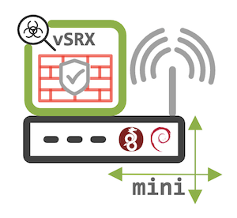
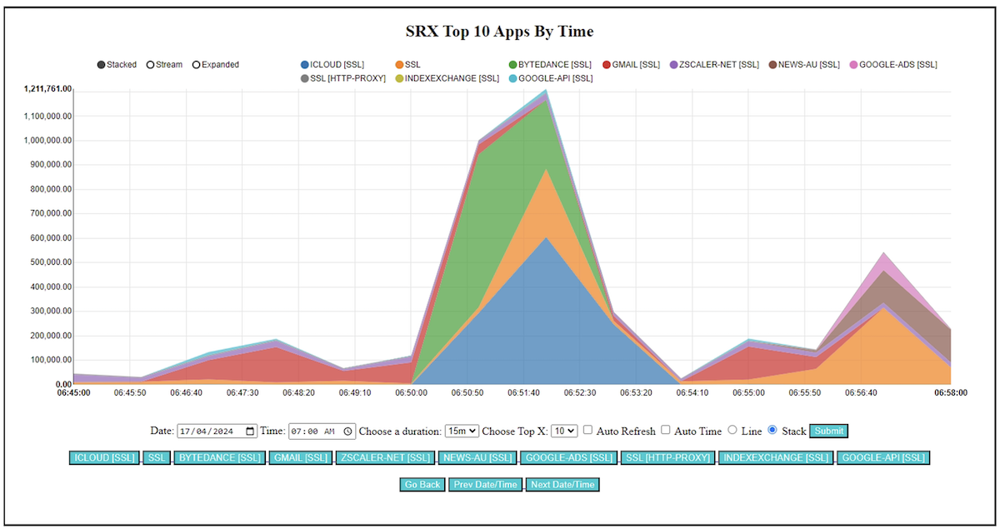
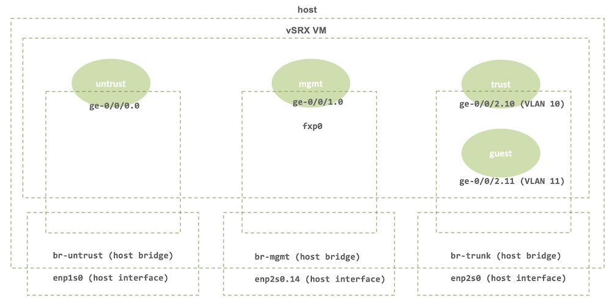
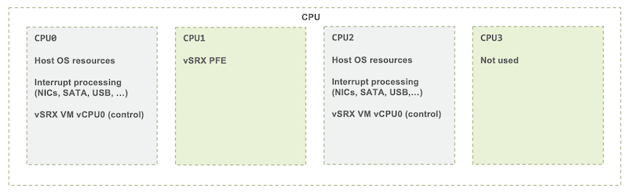
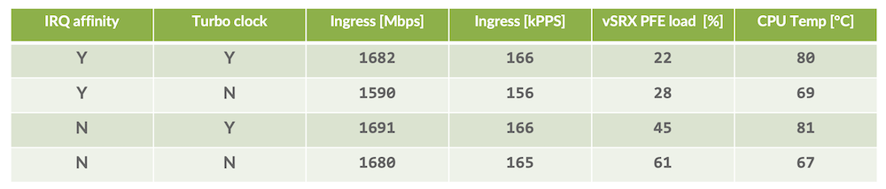
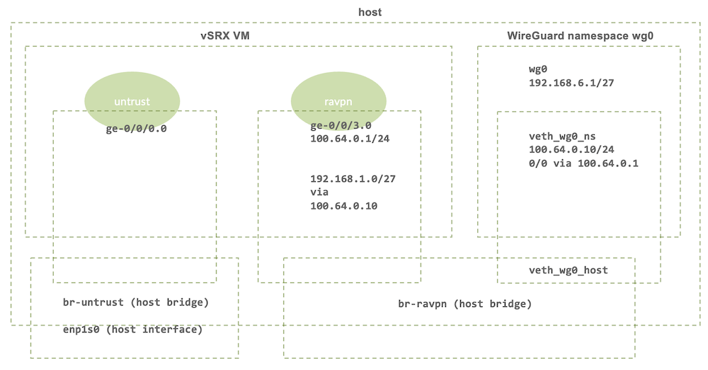

# vSRX on mini-PC with Linux/KVM

**Karel Hendrych - 04/21/2024**

Using Juniper vSRX on hardware with constrained resources, typically a mini-PC serving as flexible Internet gateway. Those are lately very popular due to low footprint yet with capabilities making them suitable for running virtual machines.



## Introduction

At very minimum, a mini-PC is tool for engineers to have x86 based SRX ([vSRX](https://www.juniper.net/us/en/products/security/srx-series/vsrx-virtual-firewall.html)) at home in small form factor, with low power consumption and no noise on fan-less units. For example, Juniper and J-partner Engineers can use it for the purpose of always on learning/demo system passing real life traffic patterns, especially interesting along with additional components like Juniper [Security Director Cloud,](https://www.juniper.net/documentation/us/en/software/sd-cloud/sd-cloud/topics/concept/sd-cloud-overview.html) [Cloud ATP](https://www.juniper.net/documentation/product/us/en/juniper-sky-advanced-threat-prevention/) and [Juniper Secure Connect](https://www.juniper.net/us/en/products/security/juniper-secure-connect.html). Complete professional Enterprise mini-setup can be formed together with the [EX switch](https://www.juniper.net/us/en/products/switches/ex-series/ex4100-f-line-of-ethernet-datasheet.html) and [MIST APs/software stack](https://www.juniper.net/us/en/products/access-points.html).

Production use for small enterprise Firewall or distributed WAN solution is perfectly possible too, there are many suitable Whitebox appliances including environmentally hardened for industrial applications.

### Pre-requisite for Reading and Applying this TechPost Practically

- Basic Linux/KVM skills, however not necessarily oriented on specific Linux distribution. Things are made partially in non-distribution specific way to avoid dependency on Linux flavor specifics by using generic tools like crond for startup script
- Knowledge of Junos, SRX, vSRX
- Modern x86 machine of choice, advisable are two or more Ethernet interfaces. Lately reasonably priced mini-PCs even with 2.5GE Ethernet and new generations of CPUs are available
- vSRX license, however every fresh install comes with 60 days trial, Advanced L7 trial licenses (including ATP) are provided on [Juniper web](https://www.juniper.net/us/en/dm/download-next-gen-vsrx-firewall-trial.html)

### Motivating Factors for Using vSRX on Mini-PC

- Control plane speed: Junos commit times taking only second or two
- Decent boot times: packets can be passing in about two minutes after host power-on
- x86 PFE excels for crypto and heavy L7 security tasks: Anti-malware, IDP, SSL proxy, ...
- Operational factors like
  - easy to snapshot/rollback entire SRX "device" in a form of single file
  - out of band style of work with the SRX during maintenance
  - tcpdump of traffic on Linux bridge before and after entering the vSRX
- HW flexibility
  - in-build WiFi in some of the appliances can be turned into an AP/AP client
  - USBs can be used to connect additional NICs
- Possible to use any other virtual or container applications together with the vSRX VM
- Last but not least research and learning - it could have been too easy to use some out of the box virtualization solutions
- Meeting pre-requisites for planned follow-up article focusing on L7 security setup of vSRX on mini-PC along with details about SRXMON: great tool for Application, Netwok and System visibility created by Mark Barrett



### Everything Comes at a Price

- Mini-PC with hypervisor and vSRX is not out of the box solution like SRX appliances
- Constrained HW resources of a mini-PC require initially attention
- Performance of software bringing can't match direct PCI resource access
- Unlike server HW, consumer grade mini-PC do not usually have
  - out of band iLo/DRAC like management (on some could be substituted by vPro or similar)
  - SR-IOV support in chipset/BIOS
  - hardware watchdog known from servers
  - NICs may not have Open vSwitch/DPDK support for accelerated networking
- Mini-PCs are usually coming as barebones and need to be equipped with RAM and storage
- Secure boot/TPM might not be present
- Custom host OS install needs be maintained, although that might be just fine with unattended-upgrades like tooling

## Sample Mini-PC Setup

Tested hardware specification:

- Intel i3-10110U CPU (2 Cores, 4 Threads)
- 2x 1GE Realtek NIC port
- 16GB DDR4 RAM and 1TB SATA SSD

Reasonable minimum on RAM/storage side would have been 8GB /128GB respectively. This specific setup has been running flawlessly for 3 years including a period of more than a year of host OS uptime. Greater SSD capacity is better for write intensive applications due to increased TBW: essentially write endurance in TB Written.

> Note: at the time of writing 2.96 x 2.96 x 2.05'' sized Intel N95 based mini-PC with 4x2.5GE Ethernet, 8GB RAM and 128GB SSD is priced for less than 300 USD.

### Time Proven Approach

(Effectively spoiler, more details in next parts of the TechPost)

**Using 2C/4T CPU Resources**

- 1st core and HT sibling assigned to vSRX RE, NIC interrupt handling and Linux soft bridge processing
- 2nd core assigned to vSRX PFE core, both core and HT sibling excluded from OS scheduler
- Turbo CPU clock disabled couple of minutes after boot
  - Sustainable turbo clock is between 3.2-3.4GHz (at about 85deg/185F) when looked after thermald
  - Nominal clock is 2.1GHz (55deg/131F) when vSRX PFE thread is running, other threads idling)
  - When running Turbo clock vSRX PFE load seem to be 20% lower with the same traffic pattern

> Note: lately to achieve better vSRX performance on Hyperthreading capable CPU, it might be worth experimenting with vSRX PFE cores spawned across core(s) and HT siblings(s). Newer CPUs may not introduce jitter/latency for parallel performance of DPDK applications.

**Two Ethernet ports **

- 1st port dedicated to external bridge hosting vSRX untrust interface, usually Internet uplink
- 2nd port used for internal bridge passing 802.1Q VLAN tags to vSRX, avoids ge-0/0/x interfaces on vSRX for every network (possible scaling issue).
- VirtIO NICs bound to regular Linux bridge(s) are probably the best choice as there are no capabilities and resources for any accelerated networking option with consumer grade Realtek NIC. Might be different with higher end mini-PCs using NICs suitable for SR-IOV or Open vSwitch/DPDK.
- VLAN filtering where applicable, firewall to protect host
- Security considered: secured Linux bridge, disabled IPv6 except specific management

**Host OS**

- Linux has all the tooling and features to achieve above
- One of the choices is Debian Linux, known for stability and rich package offering
- In the specific setup Debian 11 had been in use for almost 3 years, now upgraded to Debian 12 with newer kernel and user space (Debian strength is usually very seamless upgrade)
- Generally, any modern Linux distribution should do, just matter of preference

## Linux/KVM host

For Debian Linux, lightweight [net install](https://www.debian.org/CD/netinst/) launched in text mode with only SSH server selected on software selection page makes the installation minimal. Disabling SSH password authentication (default for root) and use of only SSH keys is highly recommended.

### Install OS on LVM

- Logical Volume Management offers partitioning layout flexibility and has block-layer snapshots if there is available space in Volume Group
- In case of boot issues /boot can be a separate partition (e.g, sda2), then 2nd partition as Physical Volume for LVM mapped to Volume Group. But lately booting off LVM is not an issue anymore.
- In the specific HW/SW setup, VG has 850GiB containing / root Logical Volume of 10GiB, /var LV sized 60GiB, swap LV 8GiB, the rest is spare for snapshots and future use
- Alternatively, BTRFS or similar filesystems can be considered (nothing wrong about using even on an LV) for brilliant cp --reflink=always to quickly copy files, compression, checksums, subvolumes, etc.)
- Ext4 filesystem is solid and reliable, without LVM is the easiest option, less flexible though

### Relevant software packages

Hint: for non-GUI Debian system, apt install --no-install-recommends [package(s)] keeps the installed dependencies at minimum

- qemu-system libvirt-daemon-system libvirt-clients bridge-utils: KVM hypervisor base
- haveged - enhances Linux /dev/random entropy
- thermald: prevents overheating of Intel CPU by monitoring system and taking measures
- smartmontools: delivers smartd for monitoring SSD/HDD using S.M.A.R.T. attributes
- chrony: might be better option than systemd NTP capabilities (timedatectl set-ntp 0)
- nftables: manages, saves and restores IPv4/IPv6 Linux firewall for host OS protection (enabled upon installation by systemctl enable nftables)
- postfix: powerful yet relatively simple and lightweight MTA software, handy for sending out reports and notifications from host
- logwatch: might help to reveal issues based on log analytics
- apticron:  monitors and reveals packages eligible for upgrade
- unattended-upgrades: automatically upgrades packages
- htop: ultimate alternative to top, monitors temperature and network throughput as well
- rfkill: software kill switch for WiFi/BT
- inxi: detailed system information (inxi --F --v7)
- intel-microcode: Intel CPU microcode, has AMD variant as well
- firmware-linux* - firmware for various hardware components (NIC, WiFi, BT, GPU, ...)
- iptraf-ng: real time traffic monitoring tool
- tcpdump: ultimate traffic capture tool
- wpa_supplicant: wireless client tooling
- hostapd: software for turning wireless card into an AP
- mate-desktop-environment, virt-manager: lightweight Linux desktop environment and desktop application for managing VMs
- xrdp, xorgxrdp: access to Linux GUI using RDP protocol, works well with above

> Note: desktop environment brings lots of dependencies, inflates the installation and opens potentially new attack surfaces. Ideal is just to use SSH for management of a small setup.

List of core packages for copy/pasting:

```
qemu-system libvirt-daemon-system libvirt-clients bridge-utils haveged thermald smartmontools chrony nftables postfix logwatch apticron unattended-upgrades htop rfkill inxi firmware-linux iptraf-ng tcpdump
```

### Linux Bridge Networking Layout

The schematics below describes more in detail the idea for networking layout described earlier, proposed vSRX zones are green colored.

- enp1s0 host interface connects to br-untrust bridge with no VLAN tagging
- enp2s0.14 is bridging VLAN 14 to br-mgmt for purposes of host OS and vSRX management (fxp0 + ge-0/0/1, latter one acting as for default GW for management segment), br-mgmt binds host OS management IP
- enp2s0 is passing VLAN tags to the vSRX VM (like VLAN 10 and VLAN 11) via bridge br-trunk, with the exception of VLAN 14
- With more than two NICs, better practice to use separate NIC for management



- Important: [Vincent Bernat's blog post about Linux bridge isolation](https://vincent.bernat.ch/en/blog/2017-linux-bridge-isolation)

On Debian networking configuration takes place in /etc/network/interfaces file. Sample setup of bridges for trust, untrust and management:

**br-untrust **

external Linux bridge connecting vSRX untrust interface ge-0/0/0 with host physical interface enp1s0

```
auto enp1s0 br-untrust
iface enp1s0 inet manual
iface br-untrust inet manual
bridge_ports enp1s0
bridge_stp off
bridge_fd 0
bridge_maxwait 0
post-up echo 1 > /sys/class/net/br-untrust/bridge/vlan_filtering
post-up bridge vlan del dev br-untrust vid 1 self
```

- Above creates br-untrust bridge for vSRX untrust interface
- Bridges host enp1s0 physical NIC
- Disables STP, no delay prior bringing up
- Isolates host from IP processing according to the blog-post above

**br-trunk **

internal Linux bridge for passing VLAN tagged traffic from switch to vSRX ge-0/0/2 (no explicit filtering, switch taking care)

```
auto enp2s0 br-trunk
iface enp2s0 inet manual
iface br-trunk inet manual
bridge_ports enp2s0
bridge_stp off
bridge_fd 0
bridge_maxwait 0
post-up bridge vlan del dev br-trunk vid 1 self
```

- Creates br-trunk bridge for vSRX interface using tagging from within VM
- Bridges host enp2s0 physical NIC
- Disables STP, no delay prior bringing up
- Isolates host from possible IP processing
- No explicit VLAN filtering, OK if adjacent switch is under control

**br-mgmt**

br-mgmt Linux bridge is an exception to br-trunk VLAN tagging, instead of passing VLAN 14 via br-trunk, VLAN 14 is bridged to br-mgmt for management purposes

```
auto enp2s0.14 br-mgmt
iface enp2s0.14 inet manual
iface br-mgmt inet static
address 192.168.6.136/27
gateway 192.168.6.129
dns-nameservers 1.1.1.1 8.8.8.8
bridge_ports enp2s0.14
bridge_stp off
bridge_fd 0
bridge_maxwait 0
post-up echo 0 > /proc/sys/net/ipv6/conf/br-mgmt/disable_ipv6
```

- Creates br-mgmt bridge for hosting fpx0 and vSRX interface ge-0/0/1 (acting as default gateway for fxp0 and host OS)
- Assigns host IP address, default gateway (vSRX) and name servers
- Bridges host VLAN 14 from enp2s0 (removes VLAN tag)
- Disables STP, no delay prior bringing up
- Enables IPv6 (disabled globally otherwise, link local address without any other config)
- VLAN filtering not applicable here

### Revealing CPU layout details

Based on lscpu -e command output below:

```
  CPU NODE SOCKET CORE L1d:L1i:L2:L3 ONLINE    MAXMHZ   MINMHZ
    0    0      0    0 0:0:0:0          yes 4100.0000 400.0000
    1    0      0    1 1:1:1:0          yes 4100.0000 400.0000
    2    0      0    0 0:0:0:0          yes 4100.0000 400.0000
    3    0      0    1 1:1:1:0          yes 4100.0000 400.0000
```

CPU topology is following:

```
CPU core 0: CPU0 + HT sibling CPU2
CPU core 1: CPU1 + HT sibling CPU3
```

Proposed CPU resources split in detail:



### Tuning Host OS

To achieve above resource split, vSRX PFE CPU core and its HT sibling needs to be isolated from scheduling by tuning kernel parameters in /etc/default/grub (or equivalent), followed by update-grub to reflect changes for next boot:

```
GRUB_CMDLINE_LINUX_DEFAULT="isolcpus=1,3 nohz_full=1,3 irqaffinity=0,2 mitigations=off default_hugepagesz=1GB hugepagesz=1G hugepages=8 transparent_hugepage=never"
```

Break-down of kernel parameters:

- isolcpus - remove CPU 1 and 3 from OS balancing and scheduling
- nohz_full


removes as much as possible kernel noise from vSRX CPU (LOC interrupts)

not supported in every kernel image, indicated in dmesg output as: Housekeeping: nohz unsupported (kernel not built with CONFIG_NO_HZ_FULL)
- irqaffinity: configures default IRQ affinity to CPU 0 and 2 (can be configured also run-time, in /proc/irq/... )
- mitigations - disables all the performance impacting in-kernel mitigations for CPU vulnerabilities,
  - not that relevant for single tenant network appliance
  - as side channel attacks are possible only if someone compromised the host/vSRX and can run an application
  - for those concerned, keep enabled by removing the parameter along with up-to-date Linux kernel and Intel/AMD CPU microcode packages
- hugepages: prevents memory fragmentation and increases performance for DPDK applications, 8x 1GB hugepages on host with 16GB RAM
- Analyze output below or similar on given HW to identify devices causing most interrupts on CPU core/sibling before and after reboot (complete picture may appear over time, NICs are a good start). Prior adjustments, interrupts would have interfered with vSRX PFE core:

```
cat /proc/interrupts 

            CPU0       CPU1       CPU2       CPU3
126:          0          7231440    0          0        enp1s0
128:          0          0          0          5687501  enp2s0
```

- Classic ext4 filesystem SSD related settings in /etc/fstab (adjust accordingly for filesystem of choice to treat SSDs well)

```
/dev/mapper/vg01-root / ext4 errors=remount-ro,noatime,nodiratime,discard 0 1
```

- discard informs SSD device which block can be trimmed internally
- noatime, nodiratime relieve SSD from some more writes

### Startup Script

```
#!/bin/bash
export PATH=/usr/local/sbin:/usr/local/bin:/sbin:/bin:/usr/sbin:/usr/bin
# disable IPv6, enable per interfaces in network settings
echo 1 > /proc/sys/net/ipv6/conf/all/disable_ipv6
echo 1 > /proc/sys/net/ipv6/conf/default/disable_ipv6
# block wifi and BT
rfkill block 0
rfkill block 1
# minimize swap use on SSD
echo 1 > /proc/sys/vm/swappiness
# sample pointer to WireGuard setup script 
#/root/scripts/./wg0.sh 
# disable turbo after 3 minutes
sleep 180; echo 1 > /sys/devices/system/cpu/intel_pstate/no_turbo
```

### Break-down of the setup script

- Disables IPv6 globally (enabled explicitly per interface in network config)
- Disables BT/WiFi if needed
- Adjusts host OS swap behavior to reduce SSD wear out
- Proposal how to initiate WireGuard settings from Appendix 1
- Disables turbo clock 3 minutes after boot (leverages full steam during vSRX boot)

### Startup Script at Boot

- Systematic way is to create systemd unit or any form of init script used by specific init system
- Similarly kernel run-time tunables are systematically set at boot in /etc/sysctl.conf
- Or use distribution specific rc.local like alternatives
- The easy way is to place the script (+ chmod 755 [file]) for example root /root/scripts with @reboot crontab event. That keeps the things in one place while the setup is being tuned and potentially helps to navigate. For example:

```
crontab --e

@reboot /root/scripts/startup.sh
```

- When doing non-systematic things, message in /etc/motd should remind about that during every login

### Host OS Firewall

Good practice is to engage Linux packet filtering to protect host OS management interface. Linux firewall can be used for both stateless and stateful filtering on bridge if certain traffic patterns would need to be dropped prior reaching vSRX. Sample nftables settings for host OS management protection stored in /etc/nftables.conf:

```
#!/usr/sbin/nft -f

flush ruleset

table inet filter  {

        set MGMT {
                #permits SSH 
                type ipv4_addr
                counter
                flags interval
                elements = {
                        192.168.6.128/27,
                        192.168.6.2,
                }
        }         

        set MGMT6 {
                #permits IPv6 SSH
                type ipv6_addr
                counter
                flags interval
                elements = {
                        2a02:cbe0:dead::/64,
                }
        }         

        chain INPUT {
                type filter hook input priority filter; policy accept;
                ct state invalid counter drop
                ip protocol icmp counter limit rate 10/second accept
                ip protocol icmp counter drop
                ip6 nexthdr icmpv6 counter limit rate 10/second accept
                ip6 nexthdr icmpv6 counter drop
                ct state related,established counter accept
                ip saddr @MGMT ct state new tcp dport 22 counter log flags all prefix "MGMT " accept
                ip6 saddr @MGMT6 ct state new tcp dport 22 counter log flags all prefix "MGMT " accept
                ip saddr 192.168.6.0/24 udp dport 123 counter accept
                iifname "lo" counter accept
                counter limit rate 10/second reject with icmpx type admin-prohibited
                counter drop
        }

        chain FORWARD {
                type filter hook forward priority filter; policy drop;
                counter drop
        }

        chain OUTPUT {
                type filter hook output priority filter; policy accept;
                counter accept
        }
}
```

Break-down of above nftables settings:

- Both ICMPv4 and v6 are throttled to 10 packets/second,
- Established connections are permitted,
- SSH can be established from specific IPv4 and IPv6 addresses stored in sets only, those can be expanded runtime using nft add/delete element syntax
- NTP permitted from specific /24 prefix
- All outbound traffic is permitted (sub-par)

Validation, application and listing of changes done in /etc/nftables.conf:

```
nft -c -f /etc/nftables.conf
systemctl reload nftables 
nft list ruleset
```

## vSRX VM

### vSRX VM Settings

- Sample QEMU/KVM VM config for vSRX3 in text box below
- Suitable for CTRL+A, CTRL+C and placement to favorite text editor, then to VM configuration file /etc/libvirt/qemu/vsrx.xml
- Important part is section with CPU pinning, this effectively pins 2nd vCPU to host CPU1 (numbering starts with 0)

```
<cputune>
    <vcpupin vcpu='1' cpuset='1'/>
</cputune>
```

- VM memory size must be aligned (=<) to configured hugepages (extra OS settings part)
- vNICs are configured and mapped as follows:

```
1st fxp0 (br-mgmt)
2nd ge-0/0/0 (br-untrust)
3rd ge-0/0/1 (br-mgmt)
4th ge-0/0/2 (br-trunk)
```

- vHDD image placed in /var/lib/libvirt/images/vsrx.qcow2
- Minimal amount of vRAM (4GiB) and vCPUs (2)

```
<domain type='kvm'>
  <name>vsrx</name>
  <memory unit='KiB'>4194304</memory>
  <currentMemory unit='KiB'>4194304</currentMemory>
  <memoryBacking>
    <hugepages>
      <page size='1048576' unit='KiB'/>
    </hugepages>
    <nosharepages/>
    <locked/>
    <allocation mode='immediate'/>
  </memoryBacking>
  <vcpu placement='static'>2</vcpu>
  <cputune>
    <vcpupin vcpu='1' cpuset='1'/>
  </cputune>
  <os>
    <type arch='x86_64' machine='pc-i440fx-3.1'>hvm</type>
    <boot dev='hd'/>
  </os>
  <features>
    <acpi/>
    <apic/>
  </features>
  <cpu mode='host-model' check='partial'/>
  <clock offset='utc'>
    <timer name='rtc' tickpolicy='catchup'/>
    <timer name='pit' tickpolicy='delay'/>
    <timer name='hpet' present='no'/>
  </clock>
  <on_poweroff>destroy</on_poweroff>
  <on_reboot>restart</on_reboot>
  <on_crash>restart</on_crash>
  <pm>
    <suspend-to-mem enabled='no'/>
    <suspend-to-disk enabled='no'/>
  </pm>
  <devices>
    <emulator>/usr/bin/kvm</emulator>
    <disk type='file' device='disk'>
      <driver name='qemu'a type='qcow2'/>
      <source file='/var/lib/libvirt/images/vsrx.qcow2'/>
      <target dev='vda' bus='virtio'/>
      <address type='pci' domain='0x0000' bus='0x00' slot='0x06' function='0x0'/>
    </disk>
    <controller type='usb' index='0' model='ich9-ehci1'>
      <address type='pci' domain='0x0000' bus='0x00' slot='0x05' function='0x7'/>
    </controller>
    <controller type='usb' index='0' model='ich9-uhci1'>
      <master startport='0'/>
      <address type='pci' domain='0x0000' bus='0x00' slot='0x05' function='0x0' multifunction='on'/>
    </controller>
    <controller type='usb' index='0' model='ich9-uhci2'>
      <master startport='2'/>
      <address type='pci' domain='0x0000' bus='0x00' slot='0x05' function='0x1'/>
    </controller>
    <controller type='usb' index='0' model='ich9-uhci3'>
      <master startport='4'/>
      <address type='pci' domain='0x0000' bus='0x00' slot='0x05' function='0x2'/>
    </controller>
    <controller type='pci' index='0' model='pci-root'/>
    <controller type='virtio-serial' index='0'>
      <address type='pci' domain='0x0000' bus='0x00' slot='0x04' function='0x0'/>
    </controller>
    <interface type='bridge'>
      <source bridge='br-mgmt'/>
      <model type='virtio'/>
      <address type='pci' domain='0x0000' bus='0x00' slot='0x03' function='0x0'/>
    </interface>
    <interface type='bridge'>
      <source bridge='br-untrust'/>
      <model type='virtio'/>
      <address type='pci' domain='0x0000' bus='0x00' slot='0x09' function='0x0'/>
    </interface>
    <interface type='bridge'>
      <source bridge='br-mgmt'/>
      <model type='virtio'/>
      <address type='pci' domain='0x0000' bus='0x00' slot='0x0a' function='0x0'/>
    </interface>
    <interface type='bridge'>
      <source bridge='br-trunk'/>
      <model type='virtio'/>
      <address type='pci' domain='0x0000' bus='0x00' slot='0x0b' function='0x0'/>
    </interface>
    <serial type='pty'>
      <target type='isa-serial' port='0'>
        <model name='isa-serial'/>
      </target>
    </serial>
    <console type='pty'>
      <target type='serial' port='0'/>
    </console>
    <input type='mouse' bus='ps2'/>
    <input type='keyboard' bus='ps2'/>
    <graphics type='vnc' port='-1' autoport='yes'>
      <listen type='address'/>
    </graphics>
    <video>
      <model type='qxl' ram='65536' vram='65536' vgamem='16384' heads='1' primary='yes'/>
      <address type='pci' domain='0x0000' bus='0x00' slot='0x02' function='0x0'/>
    </video>
    <memballoon model='virtio'>
      <address type='pci' domain='0x0000' bus='0x00' slot='0x07' function='0x0'/>
    </memballoon>
    <rng model='virtio'>
      <backend model='random'>/dev/random</backend>
      <address type='pci' domain='0x0000' bus='0x00' slot='0x08' function='0x0'/>
    </rng>
  </devices>
</domain>
```

Finally define VM from XML, set automatic start with host and start with serial console attached.

```
virsh define vsrx.xml
virsh autostart vrsx
virsh start vsrx --console
```

> Note: use virsh edit vsrx after vSRX VM has been defined, otherwise changes won't be reflected.

### Basic Performance Benchmark

- Simple L4 FW+NAT test using two nuttcp TCP streams across two physical NICs (theoretical limit is 1Gbps full-duplex)
- 4 test cases:
  - w/wo effective isolcpus, irqaffinity
  - w/wo turbo CPU clock (nominal 2.1GHz, turbo in range between 3.2-3.4GHz)
  - PPS and BPS figures are average over 60s run, it's summary of ingress on both enp1s0 and enp2s0



### Performance test conclusions

- Noticeable difference is lower vSRX PFE load when CPU1 is dedicated purely to vSRX
- In optimized cases still lots of headroom on vSRX PFE core, e.g., for heavy L7 services
- Turbo clock not worth it in the given setup, probably only more cores would overcome software bridge processing bottleneck
- Performance should do the trick on 1Gbps Internet link
- Professional equipment would be needed for proper testing, like to see where packet loss starts occurring

## Lessons Learned

- Having alternative access (VGA, USB-serial tty, WiFi,...) is a good idea when tuning host OS networking and firewall
- Quite handy are Junos config interface descriptions containing name of adjacent Linux bridge and bound physical NIC / VLAN
- Tools for E2E stability and performance test if the stack is stable and well behaved: iperf, nuttcp
- When using nuttcp like tools, taskset --c [CPU] [command] prevents jitter, otherwise OS scheduler re-balances continuously the test tool task to another CPU
- Bright WiFi status LED diodes can be potentially disabled using kernel module parameters
- Devices with slow commit are after vSRX experience challenging to deal with

## Appendix 1: WireGuard on host OS note

- Following is an idea to complement SRX IPSEC capabilities for both site to site and remote access VPNs
- Main purpose is to get a practical grasp of Linux network namespaces and potentially have  traffic passing through the vSRX all the time
- [WireGuard](https://www.wireguard.com/) is simple modern just works like VPN technology with in-build roaming capability, available out of the box starting with Ubuntu 20.04 and Debian 11
- Linux, Android and Windows clients works nicely in existing setup, recently also BSD flavors got their ports too
- Easy way to integrate with vSRX would be next-hop VM running WireGuard, however that's not needed when host OS supports WireGuard directly
- Proposed lightweight like namespace approach has a flip side of
- WireGuard being possibly processed also on vSRX PFE core sibling (kernel threads, needs investigation), but practically no issue has been seen
- Potential attack surface against host OS (great reputation so far though)
- WireGuard tunnel termination IPv4 must be reachable via vSRX (NAT, routing)
- Works with IPv6 addresses, both inner and outer
- Decapsulated traffic is controlled on vSRX between ravpn zone and other zones, encapsulated needs to be controlled towards ravpn zone



WireGuard namespace setup description:

- vSRX zone ravpn, ge-0/0/3.0 (configured as another exception to tagging like br-mgmt)
- Host OS bridge br-ravpn connecting namespace and vSRX
- WireGuard namespace connected using veth pair to br-ravpn
- veth is like Junos lt- interface, works in a pair
- Namespace having default gateway via vSRX 100.64.0.1
- vSRX routing 192.168.1.0/27 (client tunnel address pool) via namespace IP (+IPv6 if in use)
- wg0 tunnel adapter has the 1st IP from the tunnel prefix.
- Assumes DNAT to tunnel termination port from outside towards 100.64.0.10

### Server Configuration

- Following is Sample WireGuard config in "remote access" headend style, including IPv6
- Placed in /etc/wireguard/wg0.conf on host OS, effectively used in wg0 namespace

```
[Interface]
Address = 192.168.6.1/27, 2a02:cbe0:dead:f::1/64
ListenPort = 51820
PostUp = wg set %i private-key /etc/wireguard/private.key

[Peer]
AllowedIPs = 192.168.6.2, 2a02:cbe0:dead:f::2
PublicKey = [remote public key]
PresharedKey = [pre-shared key]

[Peer]
AllowedIPs = 192.168.6.3, 2a02:cbe0:dead:f::3
PublicKey = [remote public key]
PresharedKey = [pre-shared key]
```

- Addresses WireGuard tunnel interface with IPv4 and IPv6
- Assigns listening port
- Loads private key from a file (not revealed in configuration)
- Two peers, peer's traffic can't be sourced from any other IPs than allowed
- Pre-shared key is optional however best practice for post-quantum security
- At the same time route traffic towards peers

### Client Configuration

- Sample WireGuard config, "remote access" client style matching one of the clients defined in server side configuration

```
[Interface]
Address = 192.168.6.2, 2a02:cbe0:dead:f::3
PrivateKey = [private key]
DNS = [DNS1, DNS2, search-prefix1.tld, search-prefix2.tld]

[Peer]
EndPoint = [hostname]:51820
PublicKey = [remote public key]
PresharedKey = [pre-shared key]
AllowedIPs = 0.0.0.0/0, ::/0
PersistentKeepalive = 25
```

- Defines local tunnel interface IPv4 and IPv6 IPs
- Private key
- Pre-shared key if enabled on server side as best practice
- DNS servers and prefix search list
- Remote peer IP/hostname and port
- Tunnels all IPv4 and IPv6 traffic
- Optional keepalives, preserves the same UDP session

### Sample setup script

- Namespace and WireGuard sample start/restart script, includes IPv6
- Would be called probably from startup.sh (by uncommenting specific line in the general startup script if placed in /root/scripts/wg0.sh) or some distribution specific init style way

```
#/bin/bash
IFS=$'\n'

function ns () {
  ip netns exec wg0 $@
}

test -e /run/netns/wg0 && ip netns del wg0 && sleep 0.5
ip netns add wg0
ip link add veth_wg0_host type veth peer veth_wg0_ns
ip link set veth_wg0_host master br-wgvpn up
ip link set dev veth_wg0_ns netns wg0

# ip netns exec wg0 nft list ruleset
ns nft add table filter
ns nft add chain filter input { type filter hook input priority 0\; policy drop \; }
ns nft add chain filter forward { type filter hook forward priority 0\; policy drop \; }
ns nft add chain filter output { type filter hook output priority 0\; policy accept \; }

ns nft add rule filter input udp dport 51820 counter accept
ns nft add rule filter input meta l4proto icmp icmp type echo-request counter accept
ns nft add rule filter input meta l4proto ipv6-icmp counter accept
ns nft add rule filter input counter reject

ns nft add rule filter output counter accept

ns nft add rule filter forward iifname "wg0" oifname "wg0" ct state related,established counter accept
ns nft add rule filter forward iifname "wg0" oifname "wg0" ip saddr 192.168.6.2 counter accept
ns nft add rule filter forward iifname "wg0" oifname "wg0" counter reject
ns nft add rule filter forward counter accept

ns ip link set veth_wg0_ns up

ns ip addr add 100.64.0.10/24 dev veth_wg0_ns
ns ip rou add default via 100.64.0.1 
ns sysctl -q -w net.ipv4.ip_forward=1
ns ping -c1 -w1 100.64.0.1 &>/dev/null

ns ip -6 addr add 2a02:cbe0:dead:e::10/64 dev veth_wg0_ns
ns ip -6 route add ::/0 via 2a02:cbe0:dead:e::1
ns sysctl -q -w net.ipv6.conf.all.forwarding=1

#echo module wireguard +p > /sys/kernel/debug/dynamic_debug/control
ns wg-quick up wg0 &>/dev/null
```

Break-down of the init script:

- Removes wg0 namespace if present
- Creates wg0 namespace, veth pair
- veth_wg0_host is host side veth, veth_wg0_ns becomes wg0 namespace side
- veth_wg0_host bound to br-ravpn bridge
- nftables in namespace allowing on input only ICMP and WireGuard port
- nftables rejecting VPN endpoints talking each other with exception of 192.168.6.2
- Enables forwarding for both IPv4 and IPv6 in namespace
- Adds IPv4/IPv6 addressing and routing in namespace
- vSRX ARP record refresh by running ping
- Optional WireGuard kernel module debug (deactivated)
- Initializes WireGuard using /etc/wireguard/wg0.conf

To execute commands in namespace, for example to retrieve WireGuard status:

```
ip netns exec wg0 wg
```

## Useful links

- [https://www.debian.org/distrib/](https://www.debian.org/distrib/)
- [https://wiki.archlinux.org/index.php/LVM](https://wiki.archlinux.org/index.php/LVM)
- [https://wiki.debian.org/SSDOptimization](https://wiki.debian.org/SSDOptimization)
- [https://manpages.debian.org/buster/ifupdown/interfaces.5.en.html](https://manpages.debian.org/buster/ifupdown/interfaces.5.en.html)
- [https://vincent.bernat.ch/en/blog/2017-linux-bridge-isolation](https://vincent.bernat.ch/en/blog/2017-linux-bridge-isolation)
- [https://manpages.debian.org/testing/bridge-utils/bridge-utils-interfaces.5.en.html](https://manpages.debian.org/testing/bridge-utils/bridge-utils-interfaces.5.en.html)
- [https://www.kernel.org/doc/Documentation/admin-guide/kernel-parameters.txt](https://www.kernel.org/doc/Documentation/admin-guide/kernel-parameters.txt)
- [https://www.suse.com/c/cpu-isolation-nohz_full-part-3/](https://www.suse.com/c/cpu-isolation-nohz_full-part-3/)
- [https://wiki.debian.org/KVM](https://wiki.debian.org/KVM)
- [https://wiki.nftables.org/wiki-nftables/index.php/Main_Page](https://wiki.nftables.org/wiki-nftables/index.php/Main_Page)
- [https://libvirt.org/formatdomain.html](https://libvirt.org/formatdomain.html)
- [https://www.juniper.net/documentation/us/en/software/vsrx/vsrx-kvm/topics/concept/security-vsrx-kvm-understanding.html](https://www.juniper.net/documentation/us/en/software/vsrx/vsrx-kvm/topics/concept/security-vsrx-kvm-understanding.html)
- [https://www.wireguard.com/](https://www.wireguard.com/)
- [https://btrfs.readthedocs.io/en/latest/](https://btrfs.readthedocs.io/en/latest/)

## Glossary

- AP Access Point
- BPS Bits Per Second
- DPDK Data Plane Development Kit
- DRAC Dell Remote Access Controller
- HT Hyper Threading
- IDP Intrusion Detection Prevention
- iLo Integrated Lights Out
- KVM Kernel Virtual Machine
- LV Logical Volume
- NIC Network Interface Card
- OVS Open vSwitch
- PFE Packet Forwarding Engine
- PPS Packets Per Second
- RDP Remote Desktop Protocol
- RE Routing Engine
- SR-IOV Single Root Input Output Virtualization
- SSD Solid State Disk
- STP Spanning Tree Protocol
- TBW Terabytes Written
- TPM Trusted Platform Module
- VG Volume Group

## Acknowledgements

Subbiah Kandasamy for looking at the x86 aspects in the initial PPT form of this document. Then all the people who provided feedback - Matthijs Nagel, Mark Barrett, Steven Jacques, Kelly Brazil and others from team JNPR!  Of course, no way to make things happen without all the brilliant Open-Source Software. Finally, vSRX/SRX dev and product teams for delivering the Swiss army knife for security and networking.
