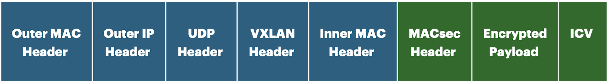
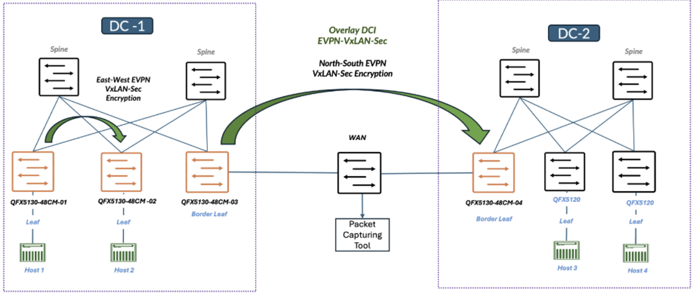
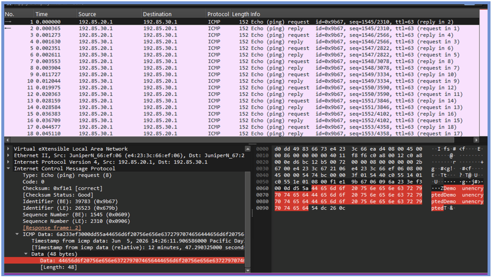
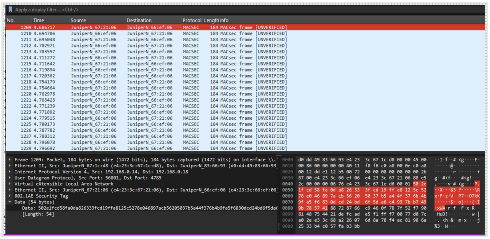
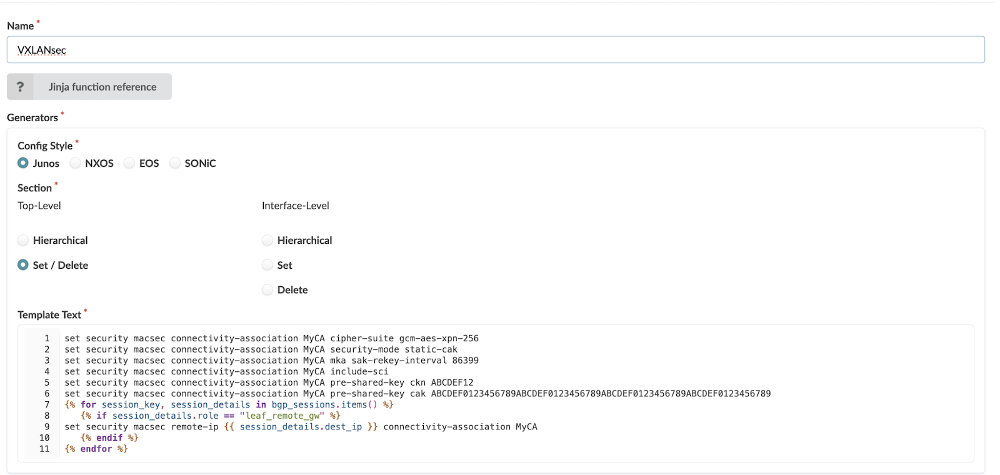

# VXLANsec: Securing Modern Data Centers, One Tunnel at a Time

**Riti Sharma - 07/31/2026**

## Introduction

Modern data center networks are increasingly built around overlay technologies that enable scalability, workload mobility, and efficient network segmentation. VXLAN has become a widely adopted solution for extending Layer 2 connectivity across Layer 3 infrastructures, serving as a foundational technology in many EVPN-based data center deployments.

As organizations continue to expand cloud and distributed networking environments, ensuring secure communication across these overlay networks has become an important design consideration.

To address this need, the QFX5130-48CM introduces VXLANsec support within the QFX switching portfolio, enabling secure communication between VXLAN Tunnel Endpoints (VTEPs), while preserving the scalability and flexibility of EVPN-VXLAN architectures.

This paper explores security within VXLAN-based networks, with a particular focus on protecting overlay traffic between VTEPs. It discusses the security considerations associated with traditional VXLAN deployments, introduces VXLANsec as an overlay encryption solution, and presents a practical demonstration conducted using QFX5130-48CM platforms in an EVPN-VXLAN environment. The paper concludes with observations from the demonstration and discusses the benefits and deployment considerations of securing VXLAN overlays in data center and inter-data-center networks

## Challenges with Traditional MACsec

VXLAN is widely used in modern data centers because it allows networks to scale beyond the limits of traditional VLANs and enables seamless connectivity between workloads across the data center. However, VXLAN was designed to provide network virtualization and segmentation, not encryption. While it encapsulates traffic and transports it across the network, the data inside the VXLAN tunnel remains unencrypted.

To protect data in transit, many organizations deploy MACsec on physical network links. MACsec is commonly used to secure communication between leaf and spine switches or between border leaf devices across WAN connections.

The challenge is that traditional MACsec operates on a hop-by-hop basis. Every device along the communication path must support and be configured for MACsec. In large data center networks, especially those spanning multiple sites, ensuring MACsec is enabled across every hop can increase operational complexity and deployment costs.

At the same time, traffic exchanged between VXLAN Tunnel Endpoints (VTEPs) often contains sensitive applications and business data. Although the traffic is encapsulated inside a VXLAN tunnel, it is not encrypted. As a result, the overlay of traffic may be exposed if the underlying network is monitored or compromised.

These limitations highlight the need for a solution that secures the VXLAN overlay payload itself while preserving normal Layer 3 transport across the existing IP network. Such a solution should integrate seamlessly into existing EVPN-VXLAN deployments without requiring significant architectural changes. It should also ensure that user traffic is forwarded only after a secure MACsec session has been successfully established between the communicating endpoints.

Performance is equally important in modern data centers. Any encryption mechanism must be able to operate at high speeds without introducing significant latency or reducing throughput. Therefore, the ideal solution should be hardware accelerated, allowing security to be applied while maintaining the performance and scale expected in data center environments.

Together, these requirements reveal a security gap in traditional VXLAN deployments and establish the need for a mechanism that can provide the required secure overlay communication while maintaining operational simplicity and high-performance forwarding.

## Solution for Overlay Encryption using VXLANsec

VXLANsec extends VXLAN by adding encryption and security between VXLAN Tunnel Endpoints (VTEPs), while preserving normal network operations. The goal is to secure overlay traffic without requiring changes to the underlying IP transport network. By combining the scalability of VXLAN with the security benefits of MACsec, VXLANsec helps organizations protect application traffic while maintaining high performance and operational simplicity.

### Data Confidentiality

Data confidentiality ensures that sensitive information can only be accessed by authorized parties. In many enterprise environments, VXLAN tunnels carry customer data, business transactions, application communications, and other critical information. While standard VXLAN provides connectivity between workloads, it does not encrypt the traffic being transported. VXLANsec protects this traffic by encrypting the overlay payload, preventing unauthorized users from viewing the contents of communications even if they gain visibility into the underlying network.

### Data Integrity

Protecting data is not only about keeping it private but also about ensuring it remains accurate and unchanged during transmission. Data integrity helps guarantee that information received by an application is exactly the same as the information that was sent. This is particularly important for distributed applications, database synchronization, and business-critical workloads where even small changes to data can impact operations. VXLANsec helps ensure that traffic exchange between endpoints remains trustworthy throughout its journey across the network.

### Better Latency Than IPsec

Performance is a critical consideration for network security solutions. While IPsec is commonly used to secure IP traffic, encryption and decryption processes can introduce additional overhead and latency. VXLANsec leverages MACsec-based encryption and hardware acceleration to minimize these impacts. By integrating security directly into the networking platform, traffic can be protected while maintaining the low latency and high throughput required by modern applications and services.

### Reduced Cost

Traditional MACsec deployments secure traffic on a hop-by-hop basis, requiring every device in the forwarding path to support and be configured for MACsec. In large fabrics, this can increase both deployment complexity and infrastructure costs, especially as the network continues to grow. VXLANsec simplifies this model by requiring MACsec support only on the VTEPs that participate in the VXLAN overlay. The underlying fabric can continue to operate normally without MACsec on every device. As a result, organizations can scale their networks to meet future business requirements while maintaining security without significantly increasing infrastructure costs.

### Business Continuity

Business continuity depends on applications and services remaining available, secure, and reliable as network requirements evolve. By protecting sensitive data, ensuring data integrity, maintaining low-latency communication, and enabling security to scale without significantly increasing infrastructure costs, VXLANsec helps organizations support uninterrupted operations across both local and geographically distributed environments. Together, these benefits allow critical services to remain protected while meeting performance and availability expectations, helping organizations maintain business continuity as their networks grow.

## Packet Transformation with VXLANsec

### Standard VXLAN Packet

In a standard VXLAN deployment, the original Ethernet frame is encapsulated for transport across the IP network. The resulting packet includes an outer MAC header, outer IP header, UDP header, and VXLAN header, followed by the original frame's inner MAC header and payload. This structure enables Layer 2 communication over a Layer 3 network, since intermediate devices forward traffic based on the outer headers alone. The payload itself, however, is never encrypted --- it travels in plain form regardless of how it is wrapped.


### VXLANsec Packet

VXLANsec leaves the outer MAC, IP, UDP, and VXLAN headers untouched, so existing Layer 3 infrastructure continues forwarding traffic exactly as before --- no changes required. What changes is what happens after encapsulation: a MACsec header is inserted, the payload is encrypted, and an Integrity Check Value (ICV) is appended so any tampering in transit can be detected.



### Comparison

The core difference comes down to this: standard VXLAN only wraps traffic for delivery, while VXLANsec also encrypts it and verifies its integrity. Because the forwarding headers stay untouched, the network routes packets exactly as it always has --- the protection applies only to the payload moving between VTEPs. This lets organizations secure overlay traffic without altering how the underlying transport network behaves.

## VXLANsec Configuration Overview

To establish a secure VXLANsec session, the participating VTEPs must share a common MACsec configuration. The configuration consists of four key elements: an encryption policy, an authentication mechanism, key management parameters, and identification of the remote peer.

### Cipher Suite

The cipher suite defines the encryption algorithm used to protect overlay traffic. GCM-AES-XPN-128 or GCM-AES-XPN-256 cipher is used to provide confidentiality and integrity protection for traffic exchange between VTEPs.

```
set security macsec connectivity-association <ca_name> cipher-suite gcm-aes-xpn-256
```

### Security Mode

VXLANsec uses a Connectivity Association (CA) to define the security relationship between peers. The static-cak security mode enables authentication using pre-shared credentials configured on both VTEPs.

```
set security macsec connectivity-association <ca_name> security-mode static-cak
```

### Key Management and Rekeying

To improve long-term security, MACsec periodically refreshes its encryption keys. The Secure Association Key (SAK) rekey interval determines how frequently new encryption keys are generated and distributed between the peers.

```
set security macsec connectivity-association <ca_name> mka sak-rekey-interval 86399
```

### Secure Channel Identifier (SCI)

The Secure Channel Identifier uniquely identifies the MACsec peer participating in the communication. Including the SCI helps the receiving VTEP correctly associate incoming encrypted traffic with the appropriate secure session.

```
set security macsec connectivity-association <ca_name> include-sci
```

### Peer Authentication

Authentication is performed using a Connectivity Key Name (CKN) and a Connectivity Association Key (CAK). The CKN acts as an identifier for the security association, while the CAK serves as the shared secret used during the authentication process. Both values must match the participating VTEPs.

```
set security macsec connectivity-association ca <ca_name> pre-shared-key ckn <Name>
set security macsec connectivity-association ca <ca_name> pre-shared-key cak <Key>

```

ckn `<Name>`: Connectivity association key name, an even number of hexadecimal characters between 2 and 64

cak `<Key>`: 32 hexadecimal characters for 128-bit cyphers (gcm-aes-128 and gcm-aes-xpn-128). 64 hexadecimal characters for 256-bit cyphers (gcm-aes-256 and gcm-aes-xpn-256).

### Remote VTEP Configuration

Finally, the MACsec policy must be associated with a remote VTEP. The remote IP address identifies the peer device with which the VXLANsec session will be established.

```
set security macsec remote-ip <address> connectivity-association <ca-name>
```

## Demo Environment and Test Setup

The Below topology was set up to validate secure communication for both intra-data-center and inter-data-center EVPN-VXLAN traffic. The test environment consisted of two data center sites (DC-1 and DC-2) connected through a WAN network. Each site contained a spine-leaf architecture supporting EVPN-VXLAN connectivity between attached hosts.

Within DC-1, QFX5130-48CM switches were deployed as leaf and border leaf devices, while DC-2 consisted of a 1 QFX5130-48CM border leaf and QFX5120 as leaf switches. Hosts were attached to the leaf switches to generate application traffic and validate end-to-end connectivity across the VXLAN fabric.

The demo focused on two primary use cases. The first use case validated east-west traffic encryption within the EVPN-VXLAN fabric, securing communication between workloads connected to different leaf switches in the same data center. The second use case validated overlay of Data Center Interconnect (DCI) encryption, securing traffic exchange between the two data center sites across the WAN network.

VXLANsec was enabled on the participating VTEPs, establishing secure MACsec-based sessions between the endpoints. Once the secure associations were established, traffic exchanged between the VTEPs was encrypted while continuing to use the existing EVPN-VXLAN overlay and Layer 3 underlay infrastructure.

A packet capture tool was connected within the WAN path to observe and analyze the traffic exchange between the data centers. Packet captures were used to verify that the VXLAN overlay payload was protected after VXLANsec was enabled, while the forwarding headers remained visible to allow normal network routing and transport operations.



## Overlay Traffic Captures and Validation

To validate VXLANsec, packet captures were collected before and after enabling the feature on the VTEPs. Traffic was generated using ICMP packets with a payload pattern of "demo unencrypted" so that the data could be easily identified in the packet capture.

The test was first performed with VXLANsec disabled, allowing the payload to be observed within the VXLAN packet. VXLANsec was then enabled, and the test was repeated using the same traffic pattern. This provided a direct comparison between unencrypted and encrypted VXLAN traffic.

The validation was performed for both intra-data-center and inter-data-center communication. Since VXLANsec operates identically between VTEPs in both scenarios, the packet captures and observations were the same. The following packet analysis highlights the differences between standard VXLAN traffic and VXLANsec protected traffic.

### Before VXLANsec is Enabled



The packet capture included in Fig 4 is with VXLANsec disabled. A ping was sent between the hosts using the payload pattern "demo unencrypted". There are a few things to notice in this capture. First, the protocol is clearly visible as ICMP, which means anyone capturing the traffic can easily identify the type of traffic being exchanged between the VTEPs.

Second, the packet contains the standard VXLAN encapsulation headers used to transport the traffic across the network, and the payload is not encrypted.

Most importantly, when looking at the data section of the packet, the text "demo unencrypted" can be clearly seen. This confirms that the application data is being transmitted in clear text and is visible to anyone with the ability to capture traffic on the path between the VTEPs.

The demonstrates one of the key limitations of standard VXLAN. Although it provides overlay connectivity, it does not protect the data itself. In environments carrying sensitive information, this can create concerns around data confidentiality and data integrity if the traffic is intercepted or monitored.

### After VXLANsec is Enabled



This packet capture included in Picture 3 is with VXLANsec being enabled, and the MACsec session was successfully established between the VTEPs.

There are a few key differences compared to the previous capture. First, the traffic is now identified as MACsec instead of ICMP. This indicates that the traffic is being protected before it is transmitted between the VTEPs.

Second, the outer VXLAN transport headers remain unchanged. The network continues to use the same outer MAC, IP, UDP, and VXLAN headers for forwarding the packet across the underlay network. This means the existing routing and forwarding behavior is preserved, allowing the traffic to flow normally without any changes to the underlying infrastructure.

Another noticeable change is the addition of the MACsec security information, including the MACsec header and the integrity protection fields. These fields are used to secure and validate the traffic between the VTEPs.

Most importantly, the packet payload is no longer readable. In the previous capture, the text "demo unencrypted" was clearly visible in the data section. After VXLANsec is enabled, the payload appears encrypted data, and the original message can no longer be identified. This ensures that anyone capturing traffic between the VTEPs cannot view the application data being transmitted.

The packet capture demonstrates the key advantage of VXLANsec: the overlay payload is protected while the underlay network continues to forward traffic exactly as it did before. As a result, organizations gain data confidentiality and integrity without impacting normal network operations.

## Key Findings

Standard VXLAN provides network segmentation and overlay connectivity, but the payload remains visible during transport.

After enabling VXLANsec, the payload is encrypted and cannot be read from packet captures.

The VXLAN transport headers remain unchanged, allowing the existing underlay network to forward traffic normally.

The same level of protection was successfully validated for both intra-data-center and inter-data-center communication.

Unlike traditional MACsec, which operates on a hop-by-hop basis and requires MACsec support on every device along the forwarding path, VXLANsec secures traffic between VTEPs. As a result, only the participating VTEPs need MACsec support, simplifying deployment and reducing infrastructure costs.

VXLANsec provides data confidentiality and integrity while preserving the scalability and operational simplicity of EVPN-VXLAN deployments.

## Feature Requirements

VXLANsec secures traffic between VTEPs and cannot be enabled on a per-VNI basis. Unlike traditional MACsec, which operates hop-by-hop, VXLANsec establishes a MACsec session between VTEP pairs. To ensure scalability, only XPN ciphers are supported, and key rollover is time-based. In addition, Traditional MACsec and VXLANsec cannot be configured simultaneously on the same device. During MACsec session establishment, there may also be a brief period before encryption becomes active, so secure session establishment should be verified before carrying sensitive traffic.

VXLANsec is a platform-specific feature and is supported only when both ends of the VXLAN tunnel terminate on supported QFX5130-48CM platforms. Interoperability with other platforms is not currently supported. Additionally, some MACsec features are not supported with VXLANsec, including Dynamic CAK, Bounded Delay, Exclude Protocol, Should-Secure, Offset, and No-Encryption modes.

## HPE Networking Data Center Director Configlet

Apstra Datacenter Director is a powerful tool that enables centralized monitoring and management of data center infrastructure, helping teams improve visibility, operational efficiency, and resource utilization.

Configlets are predefined automation templates that allow network administrators to deploy configuration changes quickly and consistently. They reduce repetitive manual tasks, enforce configuration standards, and simplify the process of applying updates across multiple network devices.

As part of this demonstration, we created the following dynamic Configlet to enable the VXLAN MACsec feature.



> **Note:** The above MACsec configuration values are the settings used for our demo environment. These values may need to be adjusted based on the deployment requirements and design, for example, pre-shared key.

## Conclusions

VXLAN has become the foundation of many EVPN-based data center fabrics, providing scalable overlay connectivity across Layer 3 networks. However, as demonstrated in this paper, standard VXLAN focuses on connectivity and segmentation rather than protection of the data carried within the overlay.

VXLANsec extends the VXLAN architecture by securing communication between VTEPs while preserving the existing underlay and forwarding behavior. The packet analysis demonstrated that overlay traffic remains protected without impacting network operation, making it possible to add security without introducing architectural complexity.

By applying encryption at the overlay level instead of on a hop-by-hop basis throughout the fabric, VXLANsec provides a scalable and efficient approach for securing both intra-data-center and inter-data-center communications. This allows organizations to enhance the security of EVPN-VXLAN deployments while maintaining the performance, flexibility, and scalability required in modern network environments.

## Glossary

- CA : Connectivity Association
- CAK : Connectivity Association Key
- CKN : Connectivity Key Name
- DCI : Data Center Interconnect
- ICV : Integrity Check Value
- MACsec : Media Access Control Security
- MKA : MACsec Key Agreement
- SAK : Secure Association Key
- SCI : Secure Channel Identifier
- VNI : VXLAN Network Identifier
- VTEP : VXLAN Tunnel Endpoint
- VXLAN : Virtual eXtensible LAN
- VXLAN : Sec--VXLAN Security
- XPN : Extended Packet Number

## Acknowledgements

I would like to sincerely thank my colleagues from the DCN PLM and TME teams for their collaboration, valuable feedback, and support throughout this work.

Special thanks to Ridha Hamidi for his guidance and contribution in building the demo and for sharing his technical expertise and insights throughout the process. His support was instrumental in the success of this effort.
