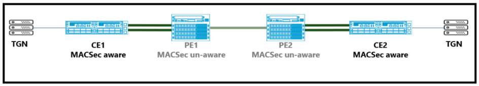
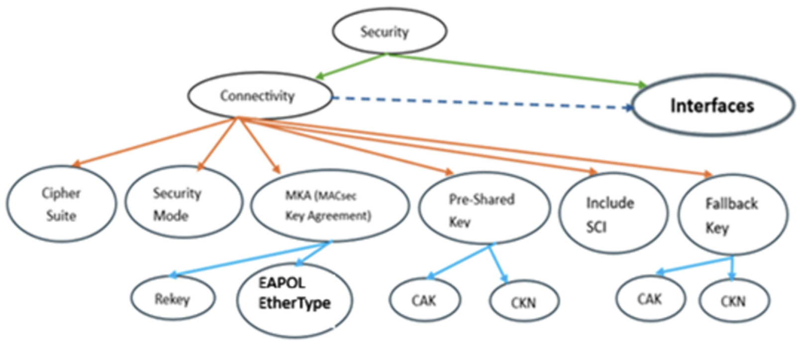
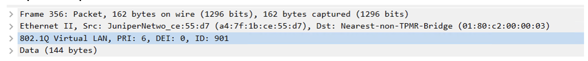
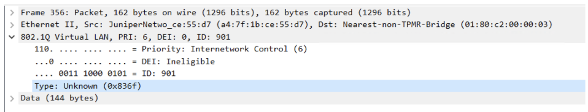
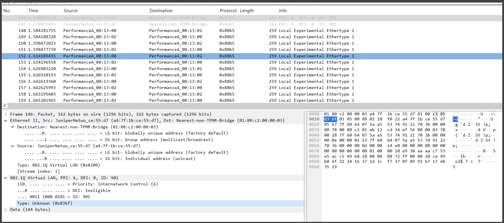
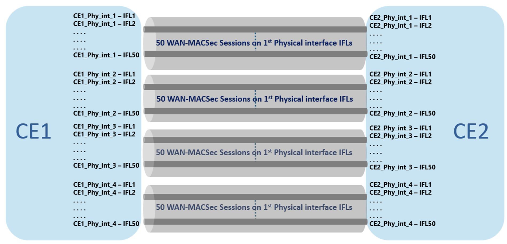
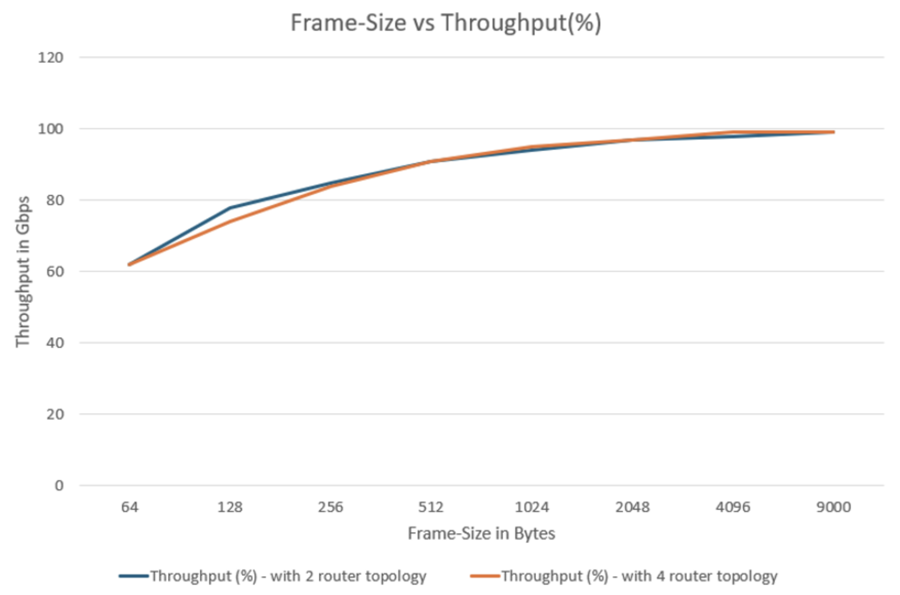
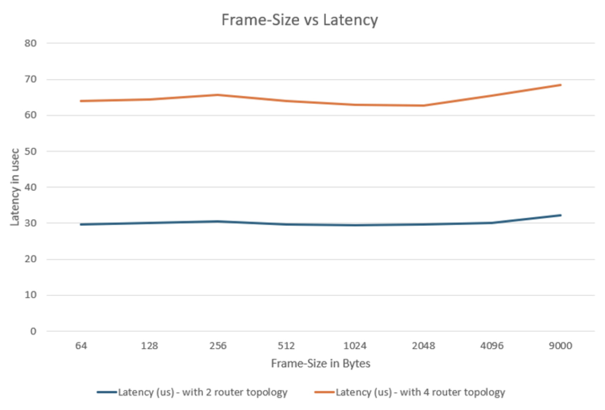
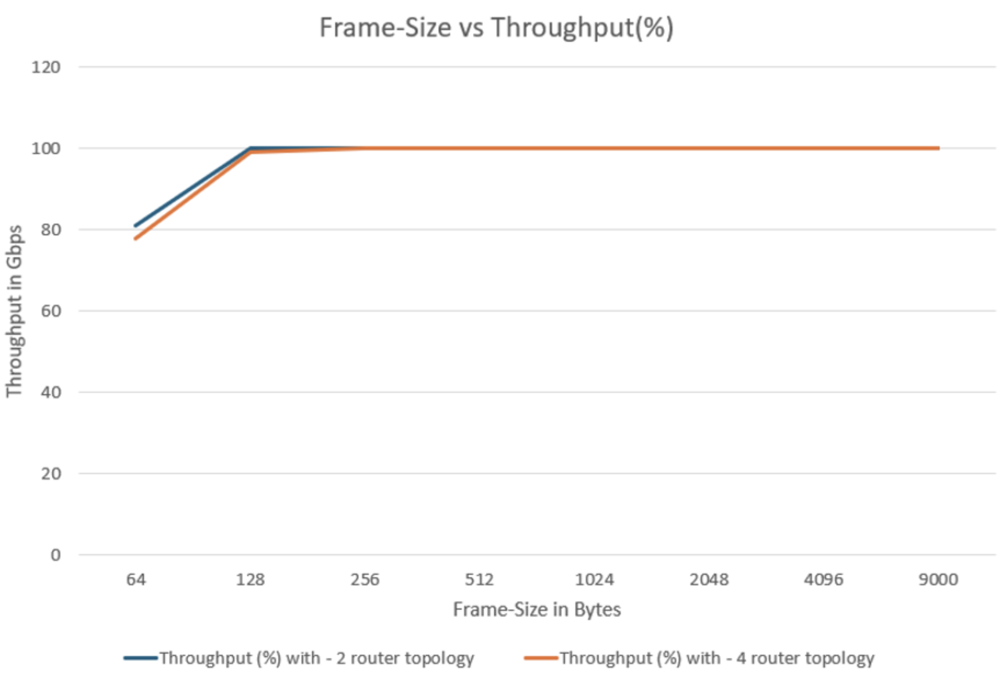
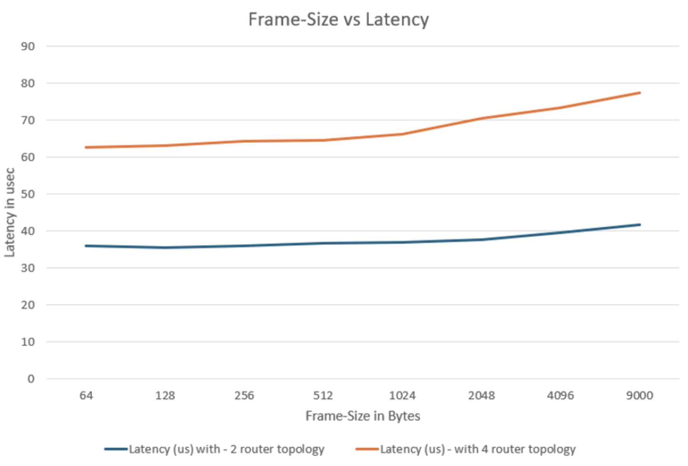

# WAN MACsec Inline Throughput Testing on MX Series

**Amin Ehtesham - 07/27/2026**

This Tech-Post validates WAN-MACSec over WAN on MX Trio 6 platforms, focusing on session scale and forwarding throughput under EAPOL/MKA operation. It provides configuration, verification commands, and practical observations from a 200-session testbed.

## Introduction

MACSec is increasingly being deployed to secure Layer 2 communications between hosts and access switches, as well as between switches. Its value becomes even more significant when network links traverse public or untrusted infrastructure, such as inter-building connections.

MACSec sessions are established using the MACSec Key Agreement (MKA) protocol. MKA relies on Extensible Authentication Protocol over LAN (EAPOL) as its transport mechanism. MKA messages transported using EAPOL frames are referred to throughout this document as MACsec control traffic.

This Tech-Post addresses a scenario where a WAN-MACSec session is established between Customer Edge (CE) devices across a service provider core network. In such deployments, MACSec control packets exchanged between the CEs may be identified and locally processed by intermediate core devices, such as Provider Edge (PE) devices instead of being transparently forwarded to the destination CE.

MACsec over WAN enables secure Ethernet connectivity between remote customer sites across a service provider network while maintaining line-rate performance. In a typical deployment, MACsec-capable Customer Edge (CE) devices establish secure sessions across MACsec-unaware Provider Edge (PE) and transit devices using EVPN-VPWS as the Layer 2 transport mechanism. A key challenge in this architecture is the handling of WAN-MACSec control traffic, which relies on EAPOL (EtherType 0x888E) and MKA (MACsec Key Agreement) messages. Some intermediate devices may identify and process packets solely based on the standard EAPOL EtherType, potentially preventing transparent delivery of WAN-MACSec control packets between CE devices. To overcome this limitation, a configurable EtherType for MACsec control traffic can be used, allowing customer-specific or service-specific identification and ensuring that MACsec control packets are transparently forwarded across the WAN without being intercepted by intermediate devices.

MACsec over WAN uses EAPOL to initiate peer communication and MKA to establish, manage, and maintain secure sessions. The configured Connectivity Association Key (CAK) serves as a root key, while MKA dynamically derives and distributes Secure Association Keys (SAKs) that are used for actual traffic encryption. MKA continuously synchronizes security information between peers, including key management, key server election, and rekeying operations, providing a robust and automated security framework. This approach delivers high-speed data confidentiality, integrity protection, and replay protection for Layer 2 services such as data center interconnects and secure backbone connectivity. While WAN-MACSec is limited to Layer 2 transport and cannot provide encryption across routed IP networks, it remains an effective solution for securing high-bandwidth Ethernet WAN links with minimal impact on network architecture and operational performance.

## Executive Summary for Design Decisions

Choose WAN-MACSec for high-speed Layer-2 transport protection (DCI and metro handoffs) and choose IPsec when traffic must remain encrypted across untrusted or multi-hop routed networks.

Table: Design Decisions

| Use Case | WAN-MACSec/IPSec | Why? |
|:--|:--|:--|
| Data Center Interconnect (DCI) | WAN-MACSec | MACSec provides line-rate Layer-2 encryption with very low latency |
| Metro Ethernet Handoff | WAN-MACSec | Secures the carrier Ethernet handoff while preserving performance |
| Router-to-Router | MACSec | Ideal for protecting trusted transport links |
| High-Speed WAN Links (100G/400G) | WAN-MACSec | MACSec scales better for high-bandwidth interfaces |
| Internet Connectivity | IPSec | Traffic traverses an untrusted network requiring end-to-end encryption |
| Site-to-Site VPN | IPSec | IPsec provides secure tunnels across routed networks |
| Branch-to-HQ Connectivity | IPSec | IPsec protects traffic across service provider and Internet networks |
| Provider MPLS WAN (Trusted Transport) | MACSec | MACSec protects the transport handoff between devices |

Choose WAN-MACSec When:

- You need to secure a direct Ethernet or Layer-2 WAN connection.
- Low latency and near line-rate performance are critical.
- Connecting data centers, metro sites, or dedicated WAN circuits.
- Encryption is only required on the transport segment.

Choose IPsec When:

- Traffic crosses the Internet or an untrusted routed network.
- Traffic must remain encrypted across multiple hops.
- Building VPNs between branches, campuses, and data centers.
- End-to-end Layer-3 encryption is required.

## MACSec Security Association

MACsec and WAN-MACsec are founded on the IEEE 802.1AE security architecture and leverage a comprehensive cryptographic framework that includes Connectivity Associations (CAs), Security Associations (SAs), Connectivity Association Keys (CAKs), Connectivity Association Key Names (CKNs), Secure Association Keys (SAKs), Association Numbers (ANs), and Packet Numbers (PNs). These components collectively establish a trusted security domain and define the parameters required to protect Ethernet traffic. Through MACsec Key Agreement (MKA), participating devices perform mutual authentication, derive and distribute encryption keys, synchronize security parameters, and execute automated rekeying operations. 

This architecture ensures robust data confidentiality, integrity protection, source authenticity, and replay attack mitigation while maintaining high-performance Layer 2 communication. In WAN-MACsec deployments, the same security constructs are preserved, with the service provider network functioning solely as a transparent transport medium for MACsec-encrypted traffic, thereby extending native Layer 2 security across geographically dispersed sites.

## WAN-MACSec Authentication

WAN-MACsec extends the native MACsec authentication and key-management framework beyond a local Ethernet segment, enabling secure communication across carrier Ethernet and wide-area network infrastructures. Authentication is established through MKA using either dynamically negotiated credentials or statically configured CAK/CKN pairs, allowing peers to securely identify each other and form a trusted Connectivity Association. 

Once authentication is successful, MKA derives and manages operational SAKs, maintains Security Association state, performs periodic key refresh, and coordinates encryption parameters such as packet numbering and replay protection. By preserving the standard MACsec security model while transporting encrypted traffic transparently across intermediate provider networks, WAN-MACsec delivers scalable and high-performance end-to-end Layer 2 confidentiality, integrity, and protection against unauthorized access without requiring participation from transit devices in the encryption process.

Custom EAPOL EtherType Support for WAN MACSec: To enable customers to configure a custom EtherType from the unreserved EtherType range there is a need of new CLI. Additional details on the CLI syntax and configuration workflow are provided in the Manageability section.

WAN MACSec is currently supported on MX platforms with the following feature set.

VLAN-based MACSec configured at the IFL level (vlan-in-clear)

- With this capability, MKA/EAPOL packets are transmitted with the VLAN tag in clear text.
- This allows intermediate service provider devices to correctly switch and forward the packets across the network.

The introduction of a custom EtherType for EAPOL packets addresses the non-uniform handling of the standard EAPOL EtherType (0x888E). This enhancement eliminates issues arising from inconsistent EAPOL trap rules and mitigates a key vulnerability in the Juniper WAN MACSec solution.

On Juniper MX platforms, particularly those based on the Trio 6 architecture, MACSec is integrated directly into the hardware forwarding pipeline, allowing encryption and decryption to occur inline at near wire speed. Traffic is processed through the normal forwarding path, while the Secure Entity (SecY) applies security policies, validates secure channels, performs replay protection, and executes AES-GCM encryption or decryption using hardware-installed Security Associations. This hardware-based implementation minimizes latency and maximizes throughput, making WAN-MACSec an effective solution for securing modern high-bandwidth network environments. By combining robust cryptographic protection with line-rate performance, WAN-MACSec delivers a scalable and efficient alternative for organizations seeking high-speed WAN encryption without the overhead traditionally associated with higher-layer security mechanisms.

## High Speed Encryption Demand

The demand for high-speed network encryption has grown rapidly as organizations increasingly rely on cloud services, data center interconnects, video applications, and large-scale data transfers.

Modern network architectures are placing new performance requirements on encryption technologies. The growth of cloud computing, real-time applications, IoT devices, and cross-data-center traffic has significantly increased bandwidth consumption. As network speeds have evolved from 10 Gbps to 100 Gbps and beyond, organizations require encryption solutions that can protect sensitive data without limiting network performance. Traditional IPsec deployments can face scalability challenges in these high-speed environments because every packet must undergo encryption, authentication, and tunnel encapsulation, adding processing overhead and potentially increasing latency.

WAN-MACSec extends the security benefits of traditional MACSec beyond a single physical link by enabling encrypted communication between Customer Edge (CE) devices across a service provider or enterprise WAN. Unlike Point-to-Point MACSec, which protects only the directly connected link between two neighboring devices, WAN-MACsec provides encrypted Layer 2 communication between MACsec-capable endpoints across a service-provider transport network. Intermediate devices forward encrypted traffic transparently without participating in the WAN-MACsec security association. As a result, customer traffic remains encrypted while traversing Provider Edge (PE) and Provider (P) devices, significantly improving data confidentiality and reducing exposure to security threats within the transit network.

Another key advantage of WAN-MACSec is the reduced reliance on service provider security controls. Since traffic remains encrypted between the customer endpoints, intermediate devices are unable to access or inspect sensitive payload data. This makes WAN-MACSec particularly attractive for organizations with strict security, regulatory, or compliance requirements. Additionally, WAN-MACSec simplifies deployment and operations by requiring WAN-MACSec configuration only on the customer edge devices, eliminating the need to enable and manage WAN-MACSec on every physical link throughout the network.
WAN-MACSec also offers better scalability and cost efficiency compared to Point-to-Point MACSec. Enterprises can securely connect remote sites over metro Ethernet, carrier Ethernet, or other shared transport networks without upgrading every intermediate device to support WAN-MACSec. By enforcing security policies at the endpoints and leveraging existing WAN infrastructure, organizations can achieve consistent end-to-end protection, lower operational complexity, and reduced infrastructure costs while maintaining high-performance Layer 2 encryption across geographically distributed networks.

## Test Topology

The topology shown consists of two customer edge routers (CE1 and CE2) connected in the middle with 2 PEs, with traffic generators (TGN) attached on both ends of CE devices. There are two physical connections between the TGNs and each CE router, which are used to generate and receive traffic for validation. Additionally, there are four physical links between CE1 and PE1 and CE2 and PE2 forming multiple parallel paths over which WAN-MACSec sessions can be established between CE devices. The central highlighted link in the diagram on CE devices towards PE devices represents the WAN-MACSec-enabled connections (IFL).



The WAN-MACSec validation was successfully performed on two MX304 platforms running Junos OS 24.4R2-S3.5, using 100G physical interfaces and associated IFLs. The objective of the test was to validate scaled WAN-MACSec deployment, session scalability, and encrypted traffic forwarding across high-speed enterprise WAN links under realistic traffic conditions.

The test environment consisted of four WAN-MACSec connections established between the two MX304 devices. Although the platform supports up to 60 MACSec sessions per physical interface, this validation tested 50 sessions per interface, resulting in 200 sessions across four interfaces. All MKA sessions were established successfully, secure associations were programmed correctly, and encrypted traffic forwarding remained stable throughout the duration of the test. The deployment also included a SAK rekey interval of 300 seconds, allowing periodic encryption-key refreshes to validate secure rekey operations and ensure uninterrupted traffic flow during key transitions.

To simulate real-world enterprise traffic patterns, an iMIX traffic profile was used with frame sizes ranging from 64 bytes to 9000 bytes, covering both small-packet and jumbo-frame traffic. Throughout the test, traffic remained stable with successful encryption and decryption across all active WAN-MACSec sessions. The results demonstrate that WAN-MACSec on MX304 platforms can scale to a high session count while supporting high-speed interfaces, frequent rekey events, and mixed packet sizes, providing secure transport encryption with minimal impact on throughput and operational stability.

## Device Configurations and Validations

The configuration schema for bringing up WAN-MACSec on MX304 is as follows:



This diagram in Figure 2 illustrates the configuration hierarchy for WAN-MACSec (Media Access Control Security) settings within a network interface. At the top level, Security controls the overall security configuration and is associated with Connectivity and Interfaces. The dashed line between Connectivity and Interfaces indicates that security-related connectivity settings are applied to specific network interfaces. Under Connectivity, several WAN-MACSec parameters can be configured, including the Cipher Suite (encryption algorithm), Security Mode (operation mode), MKA (MACSec Key Agreement), Pre-Shared Key, Include SCI (Secure Channel Identifier), and Fallback Key. These settings collectively determine how secure communication is established and maintained on the interface.

The Figure 2 also shows dependencies between these configuration components. The MKA branch includes settings for Rekey (periodic key refresh) and EAPOL Ethertype, which are used during MACSec key negotiation. The Pre-Shared Key and Fallback Key branches each require a CAK (Connectivity Association Key) and a CKN (Connectivity Key Name), which are used to authenticate peers and establish encrypted communication channels. In operation, the system can either dynamically negotiate keys using MKA or use manually configured pre-shared/fallback keys, ensuring secure and resilient connectivity even when automatic key agreement mechanisms are unavailable.

During the test on MX304, WAN-MACSec requires a bandwidth-based MACSec license starting with Junos OS 23.1R1 and later. The license is perpetual, and the required license tier depends on the total bandwidth of all MACSec-enabled ports configured on the router.

### Available MX304 MACSec Licenses

Table: Available MX304 MACSec Licenses

| License SKU | MACSec Bandwidth Entitlement |
|:--|:--|
| S-MX-1C-MSEC-P | 100G |
| S-MX-4C-MSEC-P | 400G |

### Licensing Requirement Examples

Table: Licensing Requirement Examples

| MACSec Configurations | Required License |
|:--|:--|
| One 100G MACSec | S-MX-1C-MSEC-P |
| Four 100G MACSec ports | S-MX-4C-MSEC-P |

The WAN-MACSec bandwidth license on an MX304 is based on the total bandwidth of all active WAN-MACSec enabled interfaces, and the installed license capacity must be equal to or greater than the combined bandwidth being protected. For example, if WAN-MACSec is enabled on multiple high-speed interfaces, the sum of those interface speeds determines the required license tier. Juniper introduced bandwidth-based MACSec licensing beginning with Junos OS Release 23.1R1

### Configuration - CE1

```
security {
  macsec {
    connectivity-association MTS_MACSEC_TECH_SUPPORT {
      cipher-suite gcm-aes-xpn-256;
      security-mode static-cak;
      mka {
        sak-rekey-interval 300;
        eapol-ether-type-profile EAPOL_ETH_PROFILE_TECH_SUP_3;
      }
      offset 50;
      include-sci;
      pre-shared-key {
        ckn ab12cd34ef56;
        cak "<REDACTED>"; ## SECRET-DATA
      }
      fallback-key {
        ckn a1b2c3d4e5f6;
        cak "<REDACTED>"; ## SECRET-DATA
      }
    }
    interfaces {
      et-0/0/11 {
        unit 901 {
          connectivity-association MTS_MACSEC_TECH_SUPPORT;
        }
        unit 802 {
          connectivity-association MTS_MACSEC_TECH_SUPPORT;
        }
      }
    }
  }
}
interfaces {
  et-0/1/1 {
    flexible-vlan-tagging;
    mtu 9022;            
    encapsulation flexible-ethernet-services;
    unit 901 {
      encapsulation vlan-bridge;
      vlan-id 901;
    }
    unit 802 {
      encapsulation vlan-bridge;
      vlan-id 802;
    }
  et-0/0/11 {
    flexible-vlan-tagging;
    mtu 9022;
    encapsulation flexible-ethernet-services;
    unit 901 {
      encapsulation vlan-bridge;
      vlan-id 901;
    }
    unit 802 {
      encapsulation vlan-bridge;
      vlan-id 802;
    }
  }
}
forwarding-options {
  custom-eapol-ether-type-profiles EAPOL_ETH_PROFILE_TECH_SUP_1 {
    ether-type 0x816F;
  }
  custom-eapol-ether-type-profiles EAPOL_ETH_PROFILE_TECH_SUP_2 {
    ether-type 0x826F;
  }
  custom-eapol-ether-type-profiles EAPOL_ETH_PROFILE_TECH_SUP_3 {
    ether-type 0x836F;
  }
}
bridge-domains {
  bd901 {
    domain-type bridge;
    vlan-id 901;
    interface et-0/0/11.901;
    interface et-0/1/1.901;
  }
  bd802 {
    domain-type bridge;
    vlan-id 802;
    interface et-0/0/11.802;
    interface et-0/1/1.802;
  }
}
```

### Configuration - CE2

```
security {
  macsec {
    connectivity-association MTS_MACSEC_TECH_SUPPORT {
      cipher-suite gcm-aes-xpn-256;
      security-mode static-cak;
      mka {
        sak-rekey-interval 300;
        eapol-ether-type-profile EAPOL_ETH_PROFILE_TECH_SUP_3;
      }
      offset 50;
      include-sci;
      pre-shared-key {
        ckn ab12cd34ef56;
        cak "<REDACTED>"; ## SECRET-DATA
      }
      fallback-key {
        ckn a1b2c3d4e5f6;
        cak "<REDACTED>"; ## SECRET-DATA
      }
    }
    interfaces {
      et-0/0/10 {
        unit 901 {
          connectivity-association MTS_MACSEC_TECH_SUPPORT;
        }
        unit 802 {
          connectivity-association MTS_MACSEC_TECH_SUPPORT;
        }
      et-0/2/8 {
        flexible-vlan-tagging;
        mtu 9022;
        encapsulation flexible-ethernet-services;
        unit 901 {
          encapsulation vlan-bridge;
          vlan-id 901;
        }                
        unit 802 {
          encapsulation vlan-bridge;
          vlan-id 802;
        }
      et-0/0/10 {
        flexible-vlan-tagging;
        mtu 9022;
        encapsulation flexible-ethernet-services;
        unit 901 {
          encapsulation vlan-bridge;
          vlan-id 901;
        }
        unit 802 {
          encapsulation vlan-bridge;
          vlan-id 802;
        }
    }
forwarding-options {
  custom-eapol-ether-type-profiles EAPOL_ETH_PROFILE_TECH_SUP_1 {
    ether-type 0x816F;
  }
  custom-eapol-ether-type-profiles EAPOL_ETH_PROFILE_TECH_SUP_2 {
    ether-type 0x826F;
  }
  custom-eapol-ether-type-profiles EAPOL_ETH_PROFILE_TECH_SUP_3 {
    ether-type 0x836F;
  }
}
bridge-domains {   
  bd901 {
    domain-type bridge;
    vlan-id 901;
    interface et-0/2/8.901;
    interface et-0/0/10.901;
  }
  bd802 {
    domain-type bridge;
    vlan-id 802;
    interface et-0/2/8.802;
    interface et-0/0/10.802;    
  }
}
```

## Fallback Key Benefits

In the configuration, a primary key (AB12CD34EF56) and a fallback key (A1B2C3D4E5F6) are configured. The fallback key acts as a secondary Connectivity Association Key (CAK) that can be used if the primary key becomes invalid, expires, or is changed during a key rollover event.

Advantages of the fallback key:

- Provides hitless key transitions without bringing down the WAN-MACSec session.
- Improves resiliency by maintaining an alternate authenticated key.
- Minimizes the risk of traffic interruption during planned key rotations.
- Allows seamless migration from one CAK/CKN pair to another during maintenance windows.
- Helps avoid manual intervention when updating security credentials across multiple devices.

## Rekeying Benefits

MKA rekeying generates and distributes a new Secure Association Key (SAK) every 300 seconds. The SAK is the actual encryption key used to protect data traffic.

Advantages of rekeying:

- Limits the amount of traffic encrypted with a single encryption key.
- Reduces exposure if a key were ever compromised.
- Improves compliance with security best practices and regulatory requirements.
- Provides enhanced cryptographic hygiene by periodically refreshing encryption material.
- Enables WAN-MACSec to maintain long-lived secure sessions without relying on static encryption keys.

## Verification of WAN MACSec

```
root@CE1-1-MX304> show security mka sessions detail 
 Interface name: et-0/0/11.901
   Interface state: Secured - Primary
   Ether-type profile: EAPOL_ETH_PROFILE_TECH_SUP_3 - 0x836f
   Member identifier: E229745F3F04CCF6B6CA6B31
   CAK name: AB12CD34EF56
   Security mode: static
   MKA suspended: 0(s)
   Transmit interval: 1020(ms)
   SAK rekey interval: 300(s)
   Preceding Key: enabled
   Bounded Delay: disabled
   Outbound SCI: A4:7F:1B:CE:53:69/1
   Message number: 179    Key number: 2
   MKA ICV Indicator: enabled
   Key server: yes      Key server priority: 16
   Latest SAK AN: 1      Latest SAK KI: E229745F3F04CCF6B6CA6B31/2
   Previous SAK AN: 0     Previous SAK KI: E229745F3F04CCF6B6CA6B31/1
   MKA Suspend For: disabled MKA Suspend On Request: disabled
   CAK list: (2)
    1. CAK name: AB12CD34EF56
      CAK type: primary               Status: live
      Member identifier: E229745F3F04CCF6B6CA6B31  Message number: 179
      Peer list: (1)
       1. Member identifier: F3EB05166895FA2500C80D43 (live)
         Message number: 182     Hold time: 6000 (ms)
         SCI: E8:24:A6:29:D6:44/1110 Uptime: 00:05:49
         Lowest acceptable PN: 1453138
    2. CAK name: A1B2C3D4E5F6
      CAK type: fallback              Status: active
      Member identifier: E73F6295334B0E80E0EAB23B  Message number: 174
      Peer list: (1)        
       1. Member identifier: 156AFF4BD132CB9C8F23C327 (live)
         Message number: 177     Hold time: 5000 (ms)
         SCI: E8:24:A6:29:D6:44/1110 Uptime: 00:05:43
         Lowest acceptable PN: 1453138
root@CE2-MX304> show security mka sessions detail 
 Interface name: et-0/0/10.901
   Interface state: Secured - Primary
   Ether-type profile: EAPOL_ETH_PROFILE_TECH_SUP_3 - 0x836f
   Member identifier: F3EB05166895FA2500C80D43
   CAK name: AB12CD34EF56
   Security mode: static
   MKA suspended: 0(s)
   Transmit interval: 1020(ms)
   SAK rekey interval: 300(s)
   Preceding Key: enabled
   Bounded Delay: disabled
   Outbound SCI: E8:24:A6:29:D6:44/1
   Message number: 183    Key number: 0
   MKA ICV Indicator: enabled
   Key server: no       Key server priority: 16
   Latest SAK AN: 1      Latest SAK KI: E229745F3F04CCF6B6CA6B31/2
   Previous SAK AN: 0     Previous SAK KI: E229745F3F04CCF6B6CA6B31/1
   MKA Suspend For: disabled MKA Suspend On Request: disabled
   CAK list: (2)
    1. CAK name: AB12CD34EF56
      CAK type: primary               Status: live
      Member identifier: F3EB05166895FA2500C80D43  Message number: 183
      Peer list: (1)
       1. Member identifier: E229745F3F04CCF6B6CA6B31 (live)
         Message number: 178     Hold time: 5000 (ms)
         SCI: A4:7F:1B:CE:53:69/1109 Uptime: 00:05:48
         Lowest acceptable PN: 1830180
    2. CAK name: A1B2C3D4E5F6
      CAK type: fallback              Status: active
      Member identifier: 156AFF4BD132CB9C8F23C327  Message number: 178
      Peer list: (1)        
       1. Member identifier: E73F6295334B0E80E0EAB23B (live)
         Message number: 173     Hold time: 6000 (ms)
         SCI: A4:7F:1B:CE:53:69/1109 Uptime: 00:05:43
         Lowest acceptable PN: 1830180
```

## MACSec Events

MACSec Event Log Message Snippet:

```
Jun 8 21:47:35 CE1-1-MX304 secure-dot1xd[96033]: DOT1XD_MACSEC_SC_PRIMARY_CAK_IN_USE: ifd: et-0/0/11.901 primary ckn: AB12CD34EF56 is in-use
Jun 8 21:47:40 CE1-1-MX304 secure-dot1xd[96033]: DOT1XD_MACSEC_SC_CAK_ACTIVATED: ifd: et-0/0/11.901 sci-out:A47F1BCE5369051C sci-in:E824A629D6440456 ckn: AB12CD34EF56
Jun 8 21:47:46 CE1-1-MX304 secure-dot1xd[96033]: DOT1XD_MACSEC_SC_CAK_ACTIVATED: ifd: et-0/0/11.901 sci-out:A47F1BCE5369051C sci-in:E824A629D6440456 ckn: A1B2C3D4E5F6
Jun 8 21:47:40 CE2-MX304 secure-dot1xd[10471]: DOT1XD_MACSEC_SC_CAK_ACTIVATED: ifd: et-0/0/10.901 sci-out:E824A629D6440456 sci-in:A47F1BCE5369051C ckn: AB12CD34EF56
Jun 8 21:47:45 CE2-MX304 secure-dot1xd[10471]: DOT1XD_MACSEC_SC_CAK_ACTIVATED: ifd: et-0/0/10.901 sci-out:E824A629D6440456 sci-in:A47F1BCE5369051C ckn: A1B2C3D4E5F6
```

These log messages below show the normal MKA (MACSec Key Agreement) process where the peers establish secure connectivity, select the active encryption key, and program the MACSec hardware for traffic encryption and decryption.

The first message indicates that the MACSec Secure Channel has selected the primary CAK (Connectivity Association Key) identified by CKN key and is actively using it `DOT1XD_MACSEC_SC_PRIMARY_CAK_IN_USE`

This occurs after successful MKA negotiation between the MACSec peers. Once the peers authenticate each other and agree on the keying material, the primary CAK becomes the active key for the Secure Channel. The subsequent DOT1XD_MACSEC_SC_CAK_ACTIVATED messages on both CE1 and CE2 confirm that the MACSec Secure Channel has been successfully programmed using the negotiated key. The logs also display the local and remote SCI (Secure Channel Identifier) values, which uniquely identify each MACSec participant and allow peers to associate encrypted traffic with the correct Secure Channel.

The appearance of two activation messages with different CKN values (AB12CD34EF56 and A1B2C3D4E5F6) indicates that the connectivity association has both a primary key and a fallback key configured. During MKA negotiation, both keys are learned and maintained to support seamless rekey operations and resiliency. The primary key is used for active traffic encryption, while the fallback key remains available if a key rollover or transition is required. This behavior aligns with the MKA design, allowing MACSec to perform key changes without interrupting traffic forwarding.

Warning Message Snippet:

```
Jun  8 21:47:24  CE1-1-MX304 mgd[22684]: MACSEC_CKN_LENGTH_WARNING: To maximize security, recommend configuring all 64 hexadecimal digits of pre-shared-key ckn
Jun  8 21:47:24  CE1-1-MX304 mgd[22684]: MACSEC_CKN_LENGTH_WARNING: To maximize security, recommend configuring all 64 hexadecimal digits of pre-shared-key ckn
```

The above log message MACSEC_CKN_LENGTH_WARNING is a configuration validation when the configured CKN (Connectivity Association Key Name) is shorter than the recommended maximum length. The CKN is an identifier used by MKA (MACSec Key Agreement) to identify the Connectivity Association between MACSec peers. Although the configured CKN is valid and the MACSec session can still form successfully, Junos flags it as a security best-practice warning because a shorter CKN provides less uniqueness than a full-length value.

To remove the warning and follow Juniper's recommended security practice, configure the CKN using the full 64 hexadecimal digits on all MACSec peers participating in the same Connectivity Association. The CKN value must be identical on both ends of the MACSec link. After committing the updated configuration, the warning will no longer appear.

In summary, the warning is caused by a shorter-than-recommended CKN value. No immediate action is required if MACSec is operating normally, but for production deployments it is recommended to use a full-length 64-hexadecimal-digit CKN to maximize uniqueness and align with MACSec security best practices.

## Packet Flow - Encryption

Traffic hitting the Ingress IFL of CE1 destined to hosts behind CE2

```
root@CE1-1-MX304> show interfaces et-0/0/11.901 extensive | match pps 
  Input packets:      153872547        95211 pps
  Output packets:      154236267        34 pps
root@CE2-MX304> show interfaces et-0/2/8.901 extensive | match pps 
  Input packets:      158421591        35 pps
  Output packets:      155652103        95198 pps

```

Bridge MAC Table Validation

```
root@CE1-1-MX304> show bridge mac-table bridge-domain bd901 
MAC flags    (S -static MAC, D -dynamic MAC, L -locally learned, C -Control MAC
  O -OVSDB MAC, SE -Statistics enabled, NM -Non configured MAC, R -Remote PE MAC, P -Pinned MAC)
Routing instance : default-switch
 Bridging domain : bd901, VLAN : 901
  MAC         MAC   GBP   Logical     NH   MAC     active
  address       flags  Tag   interface    Index property  source
  00:10:94:00:16:eb  D        et-0/0/11.901  
  00:10:94:00:17:4f  D        et-0/1/1.901  
{master}
root@CE1-1-MX304> show bridge mac-table bridge-domain bd901 detail 
MAC address: 00:10:94:00:16:eb
 Routing instance: default-switch
  Bridging domain: bd901, VLAN : 901
  Learning interface: et-0/0/11.901
  ELP-NH: 0     
  Base learning interface: et-0/0/11.901
  Layer 2 flags: in_hash,in_ifd,in_ifl,in_vlan,in_rtt,kernel,in_ifbd
  Epoch: 0              Sequence number: 2   
  Learning mask: 0x00000001    
  Time: 2026-06-08 21:47:35 PDTMAC address: 00:10:94:00:17:4f
 Routing instance: default-switch
  Bridging domain: bd901, VLAN : 901
  Learning interface: et-0/1/1.901 
  ELP-NH: 0     
  Base learning interface: et-0/1/1.901 
  Layer 2 flags: in_hash,in_ifd,in_ifl,in_vlan,in_rtt,kernel,in_ifbd
  Epoch: 1              Sequence number: 1   
  Learning mask: 0x00000001    
  Time: 2026-06-08 21:26:36 PDT

{master}
root@CE1-1-MX304>
root@CE2-MX304> show bridge mac-table bridge-domain bd901  
MAC flags    (S -static MAC, D -dynamic MAC, L -locally learned, C -Control MAC
  O -OVSDB MAC, SE -Statistics enabled, NM -Non configured MAC, R -Remote PE MAC, P -Pinned MAC)
Routing instance : default-switch
 Bridging domain : bd901, VLAN : 901
  MAC         MAC   GBP   Logical     NH   MAC     active
  address       flags  Tag   interface    Index property  source
  00:10:94:00:16:eb  D        et-0/2/8.901  
  00:10:94:00:17:4f  D        et-0/0/10.901  

root@CE2-MX304> show bridge mac-table bridge-domain bd901 detail 
MAC address: 00:10:94:00:16:eb
 Routing instance: default-switch
  Bridging domain: bd901, VLAN : 901
  Learning interface: et-0/2/8.901 
  ELP-NH: 0     
  Base learning interface: et-0/2/8.901 
  Layer 2 flags: in_hash,in_ifd,in_ifl,in_vlan,in_rtt,kernel,in_ifbd
  Epoch: 1              Sequence number: 1   
  Learning mask: 0x00000001    
  Time: 2026-06-08 21:26:36 PDT
MAC address: 00:10:94:00:17:4f
 Routing instance: default-switch
  Bridging domain: bd901, VLAN : 901
  Learning interface: et-0/0/10.901
  ELP-NH: 0     
  Base learning interface: et-0/0/10.901
  Layer 2 flags: in_hash,in_ifd,in_ifl,in_vlan,in_rtt,kernel,in_ifbd
  Epoch: 0              Sequence number: 0   
  Learning mask: 0x00000001    
  Time: 2026-06-08 21:26:36 PDT

```

The MACSec statistics for encrypted and decrypted packets are as follows:

```
root@CE2-MX304> show security macsec statistics  
 Interface name: et-0/0/10.901
  Secure Channel transmitted
    Encrypted packets: 63474947
    Encrypted bytes:  79978408020
    Protected packets: 0
    Protected bytes:  0
  Secure Association transmitted
    Encrypted packets: 0
    Protected packets: 0
  Secure Channel received
    Accepted packets: 63461196
    Validated bytes:  0
    Decrypted bytes:  79960968360
  Secure Association received
    Accepted packets: 0
    Validated bytes:  0
    Decrypted bytes:  0
Interface name: et-0/0/10.802
  Secure Channel transmitted
    Encrypted packets: 185018914
    Encrypted bytes:  233123457420
    Protected packets: 0
    Protected bytes:  0
  Secure Association transmitted
    Encrypted packets: 52739263
    Protected packets: 0
  Secure Channel received
    Accepted packets: 185011272
    Validated bytes:  0
    Decrypted bytes:  233112353040
  Secure Association received
    Accepted packets: 53868479   
    Validated bytes:  0      
    Decrypted bytes:  67872433860 
```

### Captured packet:

Captured packet from SPIRENT looks like this.



This Figure shows a MACsec control packet captured on VLAN 901 within the WAN-MACsec test environment. The packet capture confirms that tagged control-plane traffic is being transported across the EVPN-VPWS service and successfully traverses the underlying provider network. The presence of the VLAN tag validates that the MACsec control traffic is associated with the intended customer service instance and is being forwarded transparently between the MACsec peers.



The above figure provides a detailed view of the VLAN header and EtherType fields within the captured control packet. The packet is carried on VLAN 901 with a configured priority value and uses the custom EtherType 0x836F instead of the standard EAPOL EtherType (0x888E). This confirms that the custom EtherType feature is operating as expected, allowing MACsec control packets to traverse intermediate PE devices without being identified and processed as standard EAPOL traffic.



The last figure presents the complete packet decode and hexadecimal representation of the captured frame. The analysis verifies that the configured custom EtherType 0x836F is preserved throughout the transport path and is received exactly as transmitted by the MACsec endpoint. This demonstrates that the EVPN-VPWS network transparently forwards MACsec control traffic, enabling successful MKA communication, key exchange, and WAN-MACsec session establishment between the remote CE devices.

## Scale and Performance of WAN MACSec

In this Trio 6 based MX platform, a total of 200 MACSec sessions are successfully established using EAPOL, demonstrating high scalability of both the control plane (MKA/EAPOL exchanges) and the data plane (hardware encryption). However, there is a platform limitation where a single physical interface can support only up to 60 MACSec sessions. To overcome this constraint and achieve higher scale, the sessions are distributed across multiple interfaces. Specifically, to support around 200 MACSec sessions between CE devices, four parallel CE-to-CE connections are used, allowing the sessions to be evenly spread while staying within the per-interface limit. This approach ensures efficient utilization of hardware resources and enables large-scale MACSec deployment without exceeding interface-level constraints.



Device show CLI commands for scale scenario:

```
{master}
root@CE1-1-MX304> show security mka sessions summary | match "primary   live" | count   
Count: 200  lines

{master}
root@CE1-1-MX304> show security mka sessions summary | match "fallback  active" | count  
Count: 200 lines

root@CE2-MX304> show security mka sessions summary | match "primary   live" | count   
Count: 200 lines

root@CE2-MX304> show security mka sessions summary | match "fallback  active" | count  
Count: 200 lines

root@CE2-MX304> show security mka sessions summary                     
Interface  Member-ID         Type    Status    Tx    Rx    CAK Name
et-0/0/10.901 F3EB05166895FA2500C80D43 primary   live     2515   1747   AB12CD34EF56
et-0/0/10.901 156AFF4BD132CB9C8F23C327 fallback  active    2500   1735   A1B2C3D4E5F6

et-0/0/10.850 A04AB1D856526C8E6507BE46 primary   live     2514   2508   AB12CD34EF56
et-0/0/10.850 8F7E7EE39362E06625C44355 fallback  active    2499   2493   A1B2C3D4E5F6

et-0/1/0.851 831FD3581084CBBCE7DB6909  primary   live     2516   2507   AB12CD34EF56
et-0/1/0.851 9AFDABB04C68409FFA8E81CD  fallback  active    2499   2493   A1B2C3D4E5F6

et-0/1/0.900 DE807076FA2AB74C75D159DE  primary   live     2514   2507   AB12CD34EF56
et-0/1/0.900 C9E41E273D4E749AB4FC1347  fallback  active    2499   2493   A1B2C3D4E5F6

et-0/2/2.901 D2D5BE4C46EB76FC748AABBC  primary   live     2517   2507   AB12CD34EF56
et-0/2/2.901 F74A7E671D731EE919782832  fallback  active    2499   2492   A1B2C3D4E5F6

et-0/2/2.950 659364BE812A285349217017  primary   live     2513   2507   AB12CD34EF56
et-0/2/2.950 C02602A30349D2210598E131  fallback  active    2499   2493   A1B2C3D4E5F6

et-0/2/1.951 4F75B2896EC076B42F3A8A8C  primary   live     2513   2508   AB12CD34EF56
et-0/2/1.951 40F226449526640CFFB5EEB9  fallback  active    2499   2493   A1B2C3D4E5F6

et-0/2/1.1000 A4A407CF567EE52AE2A8C54A primary   live     2516   2507   AB12CD34EF56
et-0/2/1.1000 E52B51EE697CBF176FF07FB9 fallback  active    2499   2493   A1B2C3D4E5F6
```

## Performance

The WAN-MACSec performance evaluation was conducted using both Layer 2 (L2) and Layer 3 (L3) traffic streams to assess the impact of MACSec encryption on traffic forwarding efficiency.

The L3 stream throughput graph demonstrates that throughput increases significantly as the frame size grows from smaller packets toward standard Ethernet frame sizes. At smaller frame sizes, throughput is relatively lower because the forwarding devices must process a higher number of packets per second while simultaneously performing MACSec encryption, decryption and integrity verification. As the frame size increases, the packet processing overhead becomes less significant relative to the amount of user data carried within each packet.



For the L3 stream in Figure 7, throughput improves rapidly and reaches approximately 97--98 Gbps around the standard Ethernet MTU of 1500 bytes. This behavior indicates that the MACSec hardware is efficiently handling Layer 3 traffic without introducing substantial forwarding limitations. The increase in throughput is primarily due to the reduction in packets-per-second processing requirements and the decreasing impact of fixed MACSec overhead on larger packet sizes. As a result, the system can utilize the available link bandwidth more effectively.



The graph in Figure 8 shows that average latency remains highly stable across all tested frame sizes, ranging from 64 bytes to 9000 bytes, with measured latency varying only between approximately 63 us and 68 us. This indicates that the EVPN-VPWS over WAN-MACsec solution delivers predictable and consistent forwarding performance regardless of packet size, which is essential for latency-sensitive applications and secure transport services.

A slight increase in latency is observed for larger frame sizes, particularly at 4096-byte and 9000-byte jumbo frames, primarily due to additional packet serialization and processing requirements. However, the overall latency variation is minimal, demonstrating that WAN-MACsec encryption and EVPN-VPWS service processing introduce very low overhead and benefit from efficient hardware-based forwarding. These results validate the solution's ability to provide secure Layer 2 connectivity while maintaining low-latency, high-performance operation suitable for Data Center Interconnect (DCI) and enterprise WAN deployments.



Figure 9 shows the throughput performance of L2-stream traffic as the frame size increases from 64 bytes to 9000 bytes. The throughput is approximately 78 Gbps for the minimum Ethernet frame size of 64 bytes, reflecting the higher packet-processing overhead associated with small packets. As the frame size increases to 128 bytes, throughput rapidly improves to nearly 99 Gbps and remains consistently close to 100 Gbps across all larger frame sizes, including jumbo frames. This behavior indicates that the system efficiently utilizes the available bandwidth once packet-processing overhead is reduced, achieving near line-rate forwarding performance for frame sizes of 128 bytes and above. The stable throughput across medium, large, and jumbo frames demonstrates the robustness of the forwarding architecture and its ability to sustain high-performance Layer 2 traffic handling under varying packet sizes.



Figure 10 illustrates the average latency of L2-stream traffic as a function of frame size, ranging from 64 bytes to 9000 bytes. The results show that latency remains relatively stable at approximately 63 us for frame sizes between 64 bytes and 1024 bytes, indicating efficient packet processing and minimal forwarding delay across small to medium-sized Ethernet frames. As the frame size increases beyond 1024 bytes, the average latency gradually rises, reaching approximately 65 us at 2048 bytes, 69 us at 4096 bytes, and 73 us at 9000 bytes. This increase is expected due to the additional serialization and transmission time required for larger frames. Despite this upward trend, the overall latency variation remains modest, demonstrating that the platform maintains consistent forwarding performance and low processing overhead even when handling jumbo-frame traffic. These results highlight the efficiency and scalability of the L2 forwarding architecture under varying packet sizes.

## Throughput Test Summary

The test environment was designed to evaluate large-scale MACsec session handling, where a total of 200 active WAN-MACsec sessions were established across distributed Customer Edge (CE)-to-CE links, with each session configured with both a primary CAK and a fallback CAK. This setup reflects a high-density deployment scenario and validates resiliency and redundancy at scale. By maintaining both primary and fallback keys within each active session, the solution supports seamless key rollover and failover operations without disrupting traffic forwarding, which is critical for maintaining operational continuity in modern secure network architectures.

To accommodate the full session load, traffic and sessions were distributed across four parallel links. This approach highlights the importance of understanding hardware constraints and designing the network accordingly. Rather than overloading a single interface, spreading sessions ensures optimal utilization of available resources, prevents bottlenecks, and maintains consistent performance under heavy loads.

Forwarding performance validation further confirmed that the system operated efficiently at the hardware level. Packet rate measurements on interfaces, along with MACSec encryption and decryption counters, showed steady and consistent increments during traffic execution. This indicates that the processing was handled inline by dedicated hardware rather than being punted to software, which would degrade performance. From an operational standpoint, the key takeaway is the necessity of proactive planning for interface distribution in high-scale deployments. Additionally, continuous validation using MKA summaries and MACSec statistics at both endpoints is essential at each stage of scaling to ensure stability, correctness, and performance consistency.

## Conclusion

WAN-MACSec on MX Trio 6 demonstrates production-grade security with minimal forwarding impact when deployed over Ethernet WAN handoffs. The test confirms stable EAPOL/MKA operation, successful key lifecycle handling, and scalable session establishment at 200 sessions in this Tech-Post by distributing load across multiple physical links. For deployment readiness, prioritize key-length policy, per-interface(IFL) session planning, and verification workflows. WAN-MACsec secures Ethernet WAN links by providing Layer 2 encryption, confidentiality, integrity, and replay protection between MACsec peers, making it ideal for high-speed DCI and carrier Ethernet environments; however, it protects only the transport segment between MACsec endpoints, whereas IPsec is required when end-to-end encryption across routed or untrusted multi-hop networks is needed.

## Useful links

- IEEE 802.1AE MACSec standard: https://standards.ieee.org/standard/802_1AE-2018.html
- Juniper Community TechPosts: https://juniper.github.io/techpost/articles/
- IEEE MACSec standard 802-1ae-2018
- IEEE EtherType reserved list: https://standards-oui.ieee.org/ethertype/eth.txt
- https://www.juniper.net/documentation/us/en/software/junos/security-services/topics/topicmap/understanding_media_access_control_security_wan.html
- https://www.juniper.net/documentation/us/en/software/junos/cli-reference/topics/ref/statement/macsec-eapol-addressmx-series.html
- Reference to release notes https://www.juniper.net/documentation/us/en/software/junos/release-notes/25.4/junos-evo-release-notes-25.4r1/index.html
- https://www.juniper.net/documentation/us/en/software/junos/release-notes/25.4/junos-release-notes-25.4r1/index.html
- https://www.juniper.net/documentation/rne/us/en/release-notes/Junos%20OS/26.2R1

## Glossary

- CA: Connectivity Association
- CAK: Connectivity Association Key
- CKN: Connectivity Association Key Name
- MKA: MACSec Key Agreement
- SAK: Secure Association Key
- SCI: Secure Channel Identifier
- SecY: Secure Entity (MACSec processing function)

## Acknowledgments

Special thanks to Amin Ehtesham for his continuous guidance and valuable contributions throughout the creation of this TechPost. I would also like to thank Suneesh Babu, Kawata Jerry, Dhanushkodi Prasennaram  and Ravi Sharma for their technical insights,f eedback and reviewing the document
