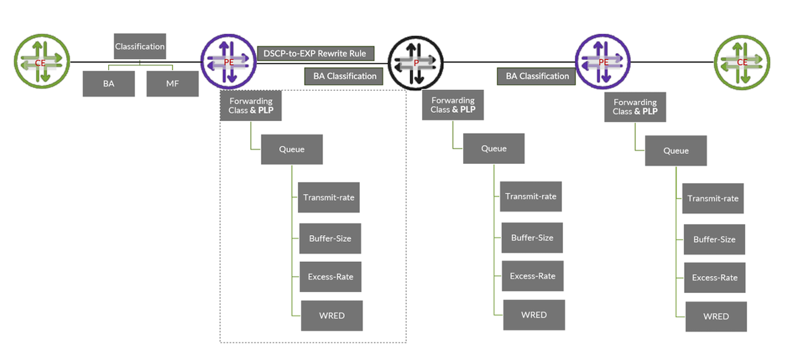

# Wholistic Design Approach for MPLS Backbone Class of Service

**Kashif Nawaz - 06/19/2025**

Class of Service (CoS) on an MPLS backbone is essential to ensure differentiated traffic handling and maintain QoS across complex, high-throughput networks. It is challenging due to the need for consistent traffic classification, IP-to-MPLS header bit marking, and assigning transmission resources to maintain various service level agreements (SLA).

## Introduction

Designing and deploying Class of Service (CoS) in an MPLS backbone network is inherently more complex than in a pure IP or switching network. In an MPLS architecture, ingress Label Switch Routers (LSRs) classify traffic by analyzing packet characteristics at ingress interfaces, utilizing either multifield classification or behavior aggregate classification. After traffic classification, packets are handled by respective queues whose transmission resources are controlled by different configurable parameters. At the egress interfaces of the ingress LER, EXP bits in MPLS header are marked with appropriate values which ensures that transit LSRs will classify incoming packets based on MPLS header EXP bits and forward them through the appropriate queues.



Once traffic enters the egress LER, the MPLS label is removed, and packets are forwarded to the Customer Edge (CE) router interface through an IP lookup. At this stage, rewriting the Differentiated Services Code Point (DSCP) bits may or may not be necessary; if DSCP bits have already been set then those will be preserved throughout the packet journey.

## Recap of Important Concepts

Before delving into details, it's essential to understand a few key concepts. The following content focuses on platforms based on the Juniper Express-4, Juniper Trio, and Juniper Express-5 chipsets. Specifications may differ for other platforms. Configuration and outputs are collected from PTX10001-36MR (23.4R2-S4.11-EVO) and MX10003 (23.4R2-S4.11).

### Packet Classification

Once a packet enters a router, it must undergo classification. The goal of classification is to assign the packet to a specific forwarding class, which in turn maps to a designated queue. Each queue is managed by its own scheduler, which controls allocation of transmission resources and priorities. There are two main types of classification:

- Multifield (MF) Classification: The packet is classified based on multiple header fields such as source IP, destination IP, source port, and destination port.
- Behavior Aggregate (BA) Classification: The packet is classified based on specific bit values in the header  e.g  the DSCP field in an IPv4/IPv6 packet or the EXP bits in an MPLS label.

### Packet Scheduling

As a result of classification packet is mapped to a certain queue for transmission on egress interface and each queue's transmission resources are governed by a specific scheduler which is mapped to interface via scheduler-map. Hence, in this write up we are covering traffic scheduling on core facing interfaces so we will restrict our discussion to port-based schedulers, i.e. applying scheduler-map on physical interfaces. In next write up we will cover how to granularly control traffic scheduling on edge interfaces using hierarchical scheduler, which enables the operators to control transmission resources on multi levels i.e. port level, interface sets, logical interfaces and queue.

### Packet Classification and Scheduling Behavior

During the classification phase, each incoming packet is mapped to a certain Packet Loss Priority (PLP) and a Forwarding Class, which in turn determines its queue assignment. The queue to which a packet is assigned has associated scheduling priorities, which are typically divided into two regions:

- **Guaranteed Region**: This region ensures that a minimum amount of bandwidth is allocated to the queue.
- **Excess Region**: Bandwidth above the guaranteed rate is shared among queues based on weighted scheduling.

### Queue Behavior

- **Same Queue, Different PLP**: Within a single queue, Weighted Random Early Detection (WRED) is used to manage congestion. WRED uses the PLP marking to preferentially drop low-priority (high PLP) packets earlier than higher-priority ones as the queue fills up.
- **Different Queues, Same Guaranteed Priority**: When multiple queues share the same guaranteed priority level, the packets are scheduled in round-robin fashion as long as they are within their guaranteed bandwidth allocations.
- **Different Queues, Same Excess Priority**: In the excess region, where queues compete for additional bandwidth beyond their guaranteed share, queues with the same excess priority are scheduled using Weighted Round Robin (WRR) based on their configured weights.

### Scheduling Priority

Junos devices can be configured to operate in strict priority scheduling, where queues are served by following assigned queue priority (e.g., strict-high, high, medium-high, medium-low, and low) and shaping rate can be assigned to cap the traffic rate.

In the normal priority scheduling mode (Junos default), only the strict-high priority queue can consume unlimited transmission resources (subject to the physical interface's resources). This behavior can be adjusted by applying a shaping rate to the strict-high queue. Only one queue can be designated as strict-high priority within each scheduler. In normal scheduling mode, however, scheduler priority behavior may vary across different platforms.

In the Juniper Express-4, Trio, and Express-5 chipsets, all queues receive their configured transmit-rate or Committed Information Rate (CIR) bandwidth. If a queue remains within its configured transmit-rate, it is operating within the guaranteed region and should not experience any traffic drops. When a queue offered rate exceeds the configured transmit-rate, it enters the excess region.

In Juniper Trio and Express-5 chipsets, high-priority queues are assigned the "excess-high" (EH) priority in the excess region, while medium and low-priority queues are assigned the "excess-low" (EL) priority. EH traffic is served before EL traffic, and EL traffic is only served if there is available bandwidth after EH demands are met. In both Trio and Express-5 chipsets, the values for excess-priority are configurable to excess-low and excess-high. On the Express-4 chipset, however, all queues operating in the excess region are given equal priority, known as "excess."

### Excess Bandwidth

When two or more queues operate above their configured transmit rate (i.e., in the excess region) while the total bandwidth utilization of the interface remains below its allowed line rate, these queues will compete for the remaining available bandwidth, referred to as excess-bandwidth. The following rules govern the distribution of excess-bandwidth among queues in the excess region:

- Excess bandwidth allocation will be based on the configured value of the excess-rate.
- If the excess-rate is configured for some queues but not for others, the queues without a configured excess rate will receive an excess rate of 1.
- If no queues have an excess rate configured, the configured transmit rate will be used to calculate the excess rate.
- In Juniper Trio and Express-5 chipsets, EH traffic is served before EL traffic.

### Weighted Round Robin (WRR)

In normal priority scheduling, each queue receives transmission resources according to its configured transmit-rate. If there is any excess bandwidth based on weighted allocation, this bandwidth is distributed among the queues. This distribution process is called Weighted Round Robin (WRR). In WRR, each queue is served in a weighted round-robin fashion (weights applied according to their assigned resources) allowing for proportional distribution based on priority and resource allocation. The WRR method ensures that queues get transmission resources based on their weight.

### Queuing Buffer

Every network vendor provides a queuing buffer which helps to alleviate congestion and enhance the overall performance of the network by temporarily storing packets during peak loads or when there are bursts of traffic. Each queue consumes memory as per configured value to temporarily store the packet before its transmission if there is link congestion on the egress interface. This allows for more efficient handling of transient traffic spikes. In Junos, the temporal buffer is configurable for each queue via the buffer-size parameter. We can calculate the absolute value of buffer size for a physical interface using the following formula.

`Buffer-Size=Interface speed * temporal buffer value in milli seconds`

Let's Consider an example with the Juniper BT / Express-4 chipset, which has a temporal buffer of 25 ms. Let's calculate the buffer memory available for a 100G interface.

- Interface speed is 100Gbps
- Temporal Buffer value is 25ms
- Interface Buffer Size=100Gbps*25ms
- Covert ms into seconds, 25ms=0.025seconds
- 100Gbpsx0.025seconds=2.5gigabits
- 2.5gigabits=2.5x1,000,000,000bits=2,500,000,000 bits = 312,500,000bytes

Once the total buffer memory available for an interface is known, we can easily calculate the queue depth in bytes based on the configured buffer size. As described above on Juniper Express-4 chipset, a 100G interface has a total buffer memory of 312,500,000 bytes, and the configured buffer size for a specific queue is set to 28 percent. We can calculate the available buffer memory for this queue as follows:

- Available Buffer Memory = Total Buffer Memory x Buffer Size Percentage
- Using this formula, we can calculate available buffer memory =312,500,000x 0.28 = 87,500,000 bytes

### Tail Drop vs RED Drop

Temporal buffer effectively manages bursty traffic by providing temporary storage for transient packets until transmission resources become available. If transmission resources are unavailable after the queue buffer is filled, new packets will begin to drop, a phenomenon known as "tail drop". Junos does support Weighted Random Early Detection (WRED), a proactive congestion control mechanism that begins to drop packets before the queue is full.

## DSCP to EXP Mapping

As mentioned above, at the ingress LSR, egress packets need to have the MPLS header's EXP bits written. At the ingress interfaces of the ingress LSR, packets may already have DSCP markings applied from a downstream network or at the host level. This raises the question of how DSCP values will be mapped to EXP bits, given that DSCP has 6 bits (allowing 64 distinct values) while EXP has only 3 bits (which can represent 8 distinct values). Although IETF RFC 4594 describes 21 DSCP values but Junos has adapted 2 additional values i.e CS1 (defined in RFC 2474) and CS6 (defined in RFC 2474)

Table: Junos DSCP Alias Bit pattern

| Alias | Bit pattern | Alias | Bit pattern | Alias | Bit pattern |
|:--|:--|:--|:--|:--|:--|
| af11 | 001010 | af33 | 011110 | cs3 | 011000 |
| af12 | 001100 | af41 | 100010 | cs4 | 100000 |
| af13 | 001110 | af42 | 100100 | cs5 | 101000 |
| af21 | 010010 | af43 | 100110 | cs6 | 110000 |
| af22 | 010100 | be | 000000 | cs7 | 111000 |
| af23 | 010110 | cs1 | 001000 | ef | 101110 |
| af31 | 011010 | cs2 | 010000 | nc1 | 110000 |
| nc2 | 111000 |  |  |  |  |

Table: Junos EXP Alias Bit Pattern

| Alias | Bit pattern | Alias | Bit pattern |
|:--|:--|:--|:--|
| af11 | 100 | cs6 | 110 |
| af12 | 101 | cs7 | 111 |
| be | 000 | ef | 010 |
| be1 | 001 | ef1 | 011 |
| cs6 | 110 | nc1 | 110 |
| cs7 | 111 | nc2 | 111 |

### Scheme for DSCP to EXP Bit pattern Mapping

There is no strict rule for DSCP-to-EXP bit mapping; however, we can use the three most significant bits (MSBs) of the DSCP alias code to map it to the corresponding EXP alias where the 3 MSBs match. This approach allows the 23 DSCP alias codes to be effectively mapped to 10 EXP alias codes.

Table: DSCP to EXP Mapping Table

| DSCP Alias | DSCP Bit Pattern | EXP Alias | EXP Bit Pattern |
|:--|:--|:--|:--|
| cs4 | 100000 | ef1 | 100 |
| cs5 | 101000 | af12 | 101 |
| cs6 | 110000 | cs6 | 110 |
| cs7 | 111000 | nc2 | 111 |
| ef | 101110 | af12 | 101 |
| nc1 | 110000 | nc1 | 110 |
| nc2 | 111000 | nc2 | 111 |

Table: Forwarding Class Resources Mapping

| Forwarding Class | DSCPAlias | DSCP Bit pattern | QueueNumber | TransmitRate | Priority | BufferSize | Excess-Rate |
|:--|:--|:--|:--|:--|:--|:--|:--|
| BE | be | 000000 | 0 | 28 | Low | 28 | 70 |
| VOIP | ef | 101110 | 1 | 10 | High | 10 | 20 |
| Critical | af31 | 011010 | 2 | 50 | High | 50 | 5 |
| NC | nc1 | 110000 | 3 | - | Strict-High | 1 | - |
| MM | af41 | 100010 | 4 | 10 | Medium-Low | 10 | 5 |
| JUNK | cs1 | 001000 | 5 | 2 | Low | 1 | - |

## Configuration Snippets

### Forwarding Class Definition

```
class-of-service {
  forwarding-classes {
    class BE queue-num 0;
    class CRITICAL queue-num 2;
    class NC queue-num 3;
    class JUNK queue-num 5;
    class MM queue-num 4;
    class VOIP queue-num 1;
  }
}
```

### Scheduler Map

> Note: excess-priority is configurable only in Trio and Express-5 Chipsets based platforms.

```
class-of-service {
scheduler-maps {
    SM-COS {
        forwarding-class BEST-EFFORT scheduler SC-BEST-EFFORT;
        forwarding-class MISSION-CRITICAL scheduler SC-MISSION-CRITICAL;
        forwarding-class NETWORK-CONTROL scheduler SC-NETWORK-CONTROL;
        forwarding-class SCAVENGER scheduler SC-SCAVENGER;
        forwarding-class VIDEO scheduler SC-VIDEO;
        forwarding-class VOICE scheduler SC-VOICE;
    }
}
schedulers {
    SC-BEST-EFFORT {
        transmit-rate percent 70;
        buffer-size percent 70;
        priority low;
    }
    SC-MISSION-CRITICAL {
        #scheduler excess-priority configurable on Trio and Express-5 Chipset
        transmit-rate percent 15;
        buffer-size percent 15;
        priority high;
        excess-priority low 
    }
    SC-NETWORK-CONTROL {
        buffer-size percent 3;
        priority strict-high;
    }
    SC-SCAVENGER {
       #scheduler excess-priority configurable on Trio and Express-5 Chipset
        transmit-rate percent 5;
        buffer-size percent 2;
        priority low;
        excess-priority low
    }
    SC-VIDEO {
        #scheduler excess-priority configurable on Trio and Express-5 Chipset
        transmit-rate percent 5;
        buffer-size percent 5;
        priority medium-high;
        excess-priority low
    }
    SC-VOICE {
        #scheduler excess-priority configurable on Trio and Express-5 Chipset
        transmit-rate percent 5;
        buffer-size percent 5;
        priority high;
        excess-priority low
    }
}
}
```

### Multifield Classification at Edge Interfaces

If traffic received at the ingress LSR edge interfaces is not properly marked with the DSCP bits, or if we want to change those markings, we can apply a multifield classifier. Multifield classifier can check various fields in packet header e.g source, and destination prefixes and sets the forwarding class as an action item in the firewall filter configuration.

```
firewall {
    family inet {
        filter mf_classfier {
            term BE {
                from {
                    source-address {
                        10.0.10.0/24;
                    }
                    destination-address {
                        10.0.11.0/24;
                    }
                }
                then {
                    forwarding-class BE;
                    dscp be;
                    loss-priority medium-low;
                    accept;
                }
            }
            term VOIP {
                from {
                    source-address {
                        10.0.20.0/24;
                    }
                    destination-address {
                        10.0.21.0/24;
                    }
                }
                then {
                    forwarding-class VOIP;
                    dscp ef;
                    loss-priority low;
                    accept;
                }
            }
            term Critical {
                from {
                    source-address {
                        10.0.30.0/24;
                    }
                    destination-address {
                        10.0.31.0/24;
                    }
                }
                then {
                    forwarding-class CRITICAL;
                    dscp af31;
                    loss-priority low;
                    accept;
                }
            }
            term MM {
                from {
                    source-address {
                        10.0.30.0/24;
                    }
                    destination-address {
                        10.0.31.0/24;
                    }
                }
                then {
                    forwarding-class MM;
                    dscp af41;
                    loss-priority medium-high;
                    accept;
                }
            }
            term JUNK {
                from {
                    source-address {
                       0.0.0.0/0;
                    }
                    destination-address {
                        0.0.0.0/0;
                    }
                }
                then {
                    forwarding-class JUNK;
                    dscp cs1;
                    loss-priority high;
                    accept;
                }
            }
        }
    }
}
```

### BA Classification at Edge Interfaces

If traffic is already marked with DSCP bits, the Behavior Aggregate (BA) classifier will map the traffic to the corresponding forwarding class by matching the appropriate DSCP alias code.

```
class-of-service {
classifiers {
    dscp CL_COS {
        import default;
        forwarding-class BE {
            loss-priority medium-low code-points be;
        }
        forwarding-class CRITICAL {
            loss-priority low code-points af31;
        }
        forwarding-class NC {
            loss-priority low code-points nc1;
        }
        forwarding-class JUNK {
            loss-priority high code-points cs1;
        }
        forwarding-class MM {
            loss-priority medium-high code-points af41;
        }
        forwarding-class VOIP {
            loss-priority low code-points ef;
        }
    }
}
}
```

### EXP Rewrite Rule

Traffic leaving the egress interfaces of the ingress or transit LSR will be marked according to the EXP rewrite rule, with code point aliases chosen based on the DSCP-to-EXP bit mapping described above.

```
class-of-service {
rewrite-rules {
    exp DSCP_EXP_REWRITE {
        import default;
        forwarding-class BE {
            loss-priority low code-point be;
        }
        forwarding-class CRITICAL {
            loss-priority low code-point ef1;
        }
        forwarding-class NC {
            loss-priority low code-point nc1;
        }
        forwarding-class JUNK {
            loss-priority low code-point be1;
        }
        forwarding-class MM {
            loss-priority low code-point af11;
        }
        forwarding-class VOIP {
            loss-priority low code-point af12;
        }
    }
}
}
```

### BA Classifier (EXP) on MPLS Interfaces

On the transit LSR, an EXP classifier will be applied on each ingress interface to classify incoming traffic based on the EXP bits already marked.

```
class-of-service {
  classifiers {
    exp CL-EXP-COS {
        import default;
        forwarding-class BEST-EFFORT {
            loss-priority low code-points be;
        }
        forwarding-class MISSION-CRITICAL {
            loss-priority low code-points ef1;
        }
        forwarding-class NETWORK-CONTROL {
            loss-priority low code-points nc1;
        }
        forwarding-class SCAVENGER {
            loss-priority low code-points be1;
        }
        forwarding-class VIDEO {
            loss-priority low code-points af11;
        }
        forwarding-class VOICE {
            loss-priority low code-points af12;
        }
    }
}
}
```

### Applying Everything to Interfaces

Finally, we need to apply the scheduler map, rewrite rules, and BA classifiers on all interfaces.

```
class-of-service {
interfaces {
    et-* {
        scheduler-map SM-COS;
        unit * {
            classifiers {
                dscp CL-COS;
                exp CL-EXP-COS;
            }
            rewrite-rules {
                exp DSCP-EXP-REWRITE;
            }
        }
    }
    xe-* {
        scheduler-map SM-COS;
        unit * {
            classifiers {
                dscp CL-COS;
                exp CL-EXP-COS;
            }
            rewrite-rules {
                exp DSCP-EXP-REWRITE;
            }
        }
    }
    ae* {
        scheduler-map SM-COS;
        unit * {
            classifiers {
                dscp CL-COS;
                exp CL-EXP-COS;
            }
            rewrite-rules {
                exp DSCP-EXP-REWRITE;
            }
        }
    }
}
}
```

## Conclusion

Designing and deploying Class of Service (CoS) in an MPLS backbone network is complex. However, implementing it with careful consideration of factors like queue prioritization, buffer management, and scheduling policies can significantly improve performance in congested backbone networks. By aligning CoS configurations with network traffic patterns and business priorities, you can help ensure efficient bandwidth utilization, reduced latency for critical traffic, and overall smoother traffic flow across the network.

## Useful links

- [https://www.juniper.net/documentation/us/en/software/junos/traffic-mgmt-qfx/topics/concept/cos-qfx-series-overview.html ](https://www.juniper.net/documentation/us/en/software/junos/traffic-mgmt-qfx/topics/concept/cos-qfx-series-overview.html)
- [https://www.juniper.net/documentation/us/en/software/junos/cos-security-devices/topics/concept/cos-security-understanding.html](https://www.juniper.net/documentation/us/en/software/junos/cos-security-devices/topics/concept/cos-security-understanding.html)
- [https://www.juniper.net/documentation/us/en/software/junos/mpls/topics/topic-map/mpls-class-service-configuration.html](https://www.juniper.net/documentation/us/en/software/junos/mpls/topics/topic-map/mpls-class-service-configuration.html)

## Glossary

- BA Classifier: Classifies packets based on specific header values such as DSCP, EXP, or 802.1p bits.
- Buffer: A temporary storage to hold packets momentarily in case egress physical interface is congested.
- Classification: Process of inspecting packet attributes at ingress to assign a forwarding class and loss priority.
- DSCP: (Differentiated Services Code Point) is a 6-bit field in the IP header used to classify and prioritize network traffic for Quality of Service (QoS
- EXP: EXP (Experimental) is a 3-bit field in the MPLS header used to mark packets for QoS classification and traffic prioritization
- Forwarding Class: It's a logical grouping that determines how packets are queued and scheduled after classification.
- MF Classifier: Classifies packets using multiple header fields like source/destination IP, protocol, or port.
- MPLS: Multiprotocol Label Switching forwards packets using short labels instead of IP lookups.
- Queue: A queue is a buffer that temporarily stores data packets before they are transmitted over a network.
- Re-Write Rule: Process to modify DSCP/EXP bits in the packet header before it leaves the egress interface.
- Scheduling Priority: Defines the order in which queues are served on the egress interface, with higher priority queues transmitted before lower priority ones.
- Scheduler: Mechanism that allocates transmission resources e.g. transmission-rate, buffer scheduling priority to the queues.
- Scheduler-Map: Configuration that links forwarding classes to schedulers on egress interfaces.
- Transmit-Rate: Minimum granted bandwidth assigned to a queue.

## Acknowledgments

Many thanks to Dmitry Ginzburg for his invaluable support in reviewing this write-up. His guidance significantly helped me to articulate the key concepts more clearly and understand how to calculate queueing buffer value (in bytes) using interface speed, configured buffer percentage, and temporal buffer parameters, specifically for Trio and Express-4/Express-5 chipsets. Thanks to Ronald van Os for pointing a couple of mistakes in the configs.
