# ZR/ZR+ Coherent Optics in ACX7100-32C

**Antu Chatterjee - 08/23/2022**

How does the Juniper ACX7100-32C router handle a fully loaded 400GE ZR and 100GE ZR4, long reach, high power coherent optics configuration?

## Introduction

In this article, I want to talk about long reach, high power coherent optics challenges on 1RU fixed form-factor routers and how Juniper's ACX7100-32C (Cloud Metro ACX platforms) handles these challenges with design choices to optimize the thermals.

To answer the question with data-points "Will ACX7100-32C handle ZR4/ZR optics across all ports (x36) and stay stable under 4.8Tbps of traffic load and ambient and higher temperature?", the article is divided into three sections:

- System design & choices
- Test topology & KPIs
- Reporting of metrics presented via Grafana dashboard

## 400GE Optics choices and challenges

Metro and Data Center architectures are evolving to accommodate ever-growing traffic and performance-based applications that demand high bandwidth and low latency.

With the appropriate choice of optic cages, Juniper's Cloud Metro ACX7100-32C router supports coherent optical solutions like 400GE ZR/ZR+ and 100GE ZR4 on all ports.

While the new standards of optics substantially increase bandwidth capacity between the Cloud Metro and Data Centers reducing operating costs, footprint, and power consumption; parameters like optical power (influencing the reach and architectural capabilities) and operating temperature (influencing module packaging) becomes critical vis-e-vis heat dissipation in a 1RU fixed port configuration.

Let's double click on the 400GE deployment requirements and associated challenges in the Access, Metro, and Backbone.

- Operators require off-the-shelf optical modules to build and scale their networks quickly and efficiently.
Power at ambient and higher temperature is one of the prime decision-making factors, especially with long-reach coherent optics along with optics cage configurations like stacked caging or belly-to-belly.
- High-performance network environments need to cool pluggable optical modules efficiently.
High power modules must dissipate this heat effectively to ensure the operational performance of the modules. Prudent module, cage, heat sink and overall system design for optics modules help to optimize thermals.

## Deployment Models with 400GE ZR/ZR+

There are a couple of ways the 400GE ZR/ZR+ are deployed based on the application.

### Extended reach P2P packet

In this case, 400GE ZR modules are used as single carrier 400Gbps optical line rate and transporting 400GE, 2x 200GE, or 4x 100GE client signals for point-to-point reach.

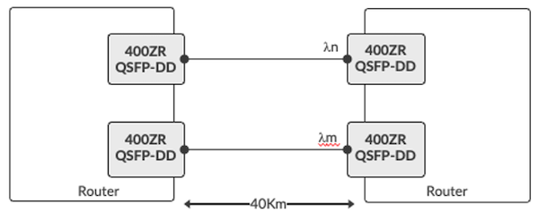

### Multi-span Metro

In this case, 400GE ZR provides solutions with higher performance to address a much wider range using amplifiers for metro/regional packet networking requirements.

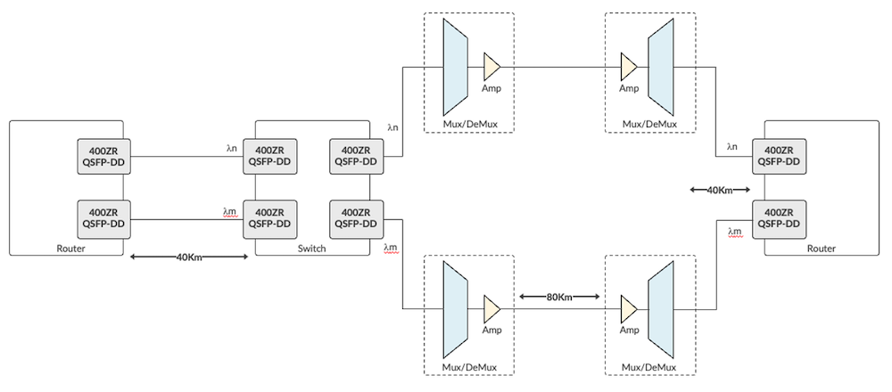

## ACX7100 Series Routers

ACX7100 routers exist in two versions---ACX7100-32C and ACX7100-48L--- and detailed specifications are mentioned in ACX7100 Deepdive ([https://juniper.github.io/techposts/acx7100-deepdive/article](https://juniper.github.io/techposts/acx7100-deepdive/article)), here we will focus on the ACX7100-32C router with 400GE ZR and 100GE ZR4 optics.

ACX7100-32C offers:

- Connectivity for 32x 100GE and 4x 400GE (via QSFP-DD connectors)
- Six fan trays, front to back, with 5+1 redundancy
- Two power supply modules (1200W-1600W), with 1+1 redundancy

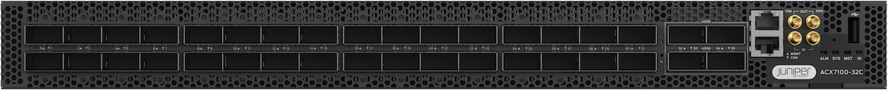

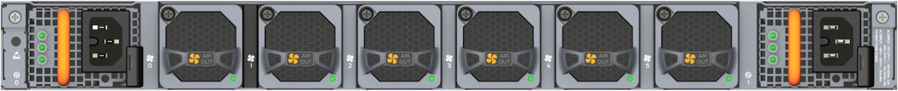

### Juniper's Approach for 400GE ZR/ZR+

Let's double-click on the design consideration and the metrics to highlight the value proposition of the ACX7100-32C router:

- Optics cage and connector layout
- System design to optimize thermals with heat sinks.

The architecture choices of optical cage, connector and its layout have a direct impact on optics' thermal performance. The goal is to exhaust the heat from the module case and ensure the internal components stay within a certain temperature range. It guarantees reliability and optimal performance.

Details on optics design can be found at [http://www.qsfp-dd.com/wp-content/uploads/2021/01/2021-QSFP-DD-MSA-Thermal-Whitepaper-Final.pdf](http://www.qsfp-dd.com/wp-content/uploads/2021/01/2021-QSFP-DD-MSA-Thermal-Whitepaper-Final.pdf)

ACX7100-32C router uses QSFP-DD connector for all 32 QSFP28 ports (backward compatible with regular QSFP28 connectors) to accommodate higher power requirements. The system has an optimized design of optics cage for belly-to-belly configuration as show in the figure 4 below:

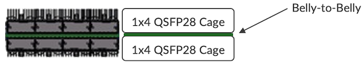

- 1x4 cages are used for the 32x QSFP28 ports
- 1x2 cages (with the smallest heatsinks) are used for the 4x QSFP-DD ports

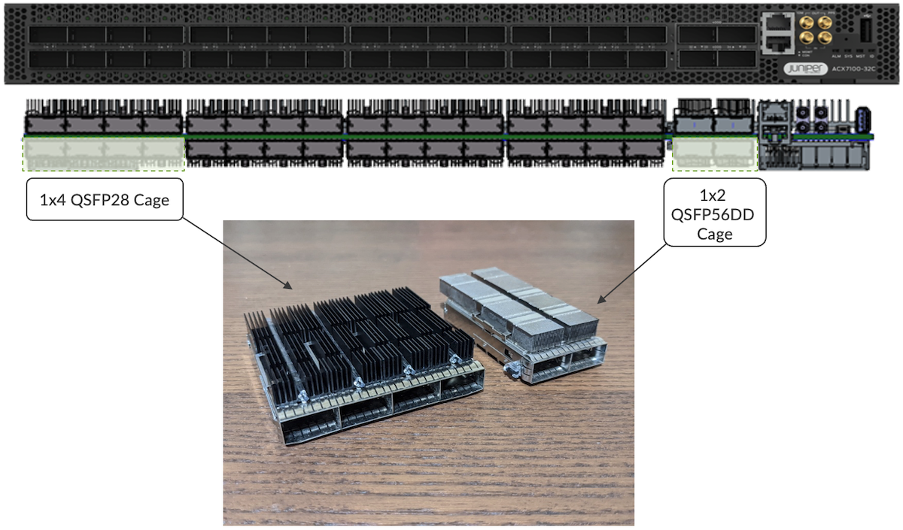

The power dissipation ranges of 400GE client and line (ZR, ZR+) optical modules are 10-14W and 16-20W, respectively.

The router is designed for complete voltage range (High Line and Low Line) and supports front-to-back air flow.

| Type | Voltage | Power | Air Flow |
|:--|:--|:--|:--|
| AC | 103 to 140V (LL)180 to 264V (HL) | 1200W1600W | AFO |
| DC | -40 to 48V (LL)48 to 72V (HL) | 1200W1600W | AFO |

## Thermal & Power Analysis

Completely inhabited ACX7100-32C router with high-power digital coherent optics on all ports, has power rating within 1000 W, at an ambient temperature (25deg C). At higher temperature (55deg C), the power rating increases slightly and is well within 1200 W.

### Topology

The router ACX7100-32C is populated with ZR optics connected to the traffic generator. The topology is built with fully meshed traffic (and not with snake) configuration.

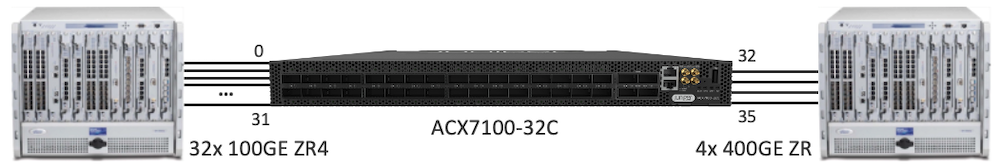

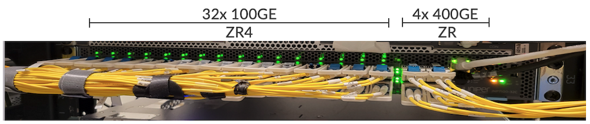

```
regress@rtme-acx7100-32C> 
```

**show chassis hardware detail**

```

Hardware inventory:
Item             Version  Part number  Serial number     Description
Chassis                                YX0221120001      JNP7100-32C [ACX7100-32C]
PSM 0            REV 04   740-085431   1ED7A140225       PSU 1600W AC, Front to Back Airflow
PSM 1            REV 04   740-085431   1ED7A140217       PSU 1600W AC, Front to Back Airflow
Routing Engine 0 REV 09   611-112446   YY0221120021      RE-JNP-7100
  sda   100030 MB  SFSA100GM2AK4TO-    00006018575697000031 Solid State Disk
  sdb   100030 MB  SFSA100GM2AK4TO-    00006018575697000007 Solid State Disk
CB 0             REV 13   650-113148   YX0221120001      Control Board
FPC 0                     BUILTIN      BUILTIN           ACX7100-32C
  PIC 0                   BUILTIN      BUILTIN           MRATE- 32xQSFP-DD + 4xQSFP56-DD
    Xcvr 0       REV 01   740-120240   1W1CQVA7xxxxx     QSFP28-100G-ZR4
    Xcvr 1       REV 01   740-120240   1W1CQVA7xxxxx     QSFP28-100G-ZR4
    Xcvr 2       REV 01   740-120240   1W1CQVA7xxxxx     QSFP28-100G-ZR4
    Xcvr 3       REV 01   740-120240   1W1CQVA7xxxxx     QSFP28-100G-ZR4
    Xcvr 4       REV 01   740-120240   1W1CQVA7xxxxx     QSFP28-100G-ZR4
    Xcvr 5       REV 01   740-120240   1W1CQVA7xxxxx     QSFP28-100G-ZR4
    Xcvr 6       REV 01   740-120240   1W1CQVA7xxxxx     QSFP28-100G-ZR4
    Xcvr 7       REV 01   740-120240   1W1CQVA7xxxxx     QSFP28-100G-ZR4
    Xcvr 8       REV 01   740-120240   1W1CQVA7xxxxx     QSFP28-100G-ZR4
    Xcvr 9       REV 01   740-120240   1W1CQVA7xxxxx     QSFP28-100G-ZR4
    Xcvr 10      REV 01   740-120240   1W1CQVA7xxxxx     QSFP28-100G-ZR4
    Xcvr 11      REV 01   740-120240   1W1CQVA7xxxxx     QSFP28-100G-ZR4
    Xcvr 12      REV 01   740-120240   1W1CQVA7xxxxx     QSFP28-100G-ZR4
    Xcvr 13      REV 01   740-120240   1W1CQVA7xxxxx     QSFP28-100G-ZR4
    Xcvr 14      REV 01   740-120240   1W1CQVA7xxxxx     QSFP28-100G-ZR4
    Xcvr 15      REV 01   740-120240   1W1CQVA7xxxxx     QSFP28-100G-ZR4
    Xcvr 16      REV 01   740-120240   1W1CQVA7xxxxx     QSFP28-100G-ZR4
    Xcvr 17      REV 01   740-120240   1W1CQVA7xxxxx     QSFP28-100G-ZR4
    Xcvr 18      REV 01   740-120240   1W1CQVA7xxxxx     QSFP28-100G-ZR4
    Xcvr 19      REV 01   740-120240   1W1CQVA7xxxxx     QSFP28-100G-ZR4
    Xcvr 20      REV 01   740-120240   1W1CQVA7xxxxx     QSFP28-100G-ZR4
    Xcvr 21      REV 01   740-120240   1W1CQVA7xxxxx     QSFP28-100G-ZR4
    Xcvr 22      REV 01   740-120240   1W1CQVA7xxxxx     QSFP28-100G-ZR4
    Xcvr 23      REV 01   740-120240   1W1CQVA7xxxxx     QSFP28-100G-ZR4
    Xcvr 24      REV 01   740-120240   1W1CQVA7xxxxx     QSFP28-100G-ZR4
    Xcvr 25      REV 01   740-120240   1W1CQVA7xxxxx     QSFP28-100G-ZR4
    Xcvr 26      REV 01   740-120240   1W1CQVA7xxxxx     QSFP28-100G-ZR4
    Xcvr 27      REV 01   740-120240   1W1CQVA7xxxxx     QSFP28-100G-ZR4
    Xcvr 28      REV 01   740-120240   1W1CQVA7xxxxx     QSFP28-100G-ZR4
    Xcvr 29      REV 01   740-120240   1W1CQVA7xxxxx     QSFP28-100G-ZR4
    Xcvr 30      REV 01   740-120240   1W1CQVA7xxxxx     QSFP28-100G-ZR4
    Xcvr 31      REV 01   740-120240   1W1CQVA7xxxxx     QSFP28-100G-ZR4
    Xcvr 32      XXXX     NON-JNPR     L2131D0xxx        QSFP56-DD-400G-ZR
    Xcvr 33      REV 01   740-114884   1T1TZFA6xxxxx     QSFP56-DD-400G-ZR
    Xcvr 34      XXXX     NON-JNPR     L2129D0xxx        QSFP56-DD-400G-ZR
    Xcvr 35      REV 01   740-114884   1T1TZFA6xxxxx     QSFP56-DD-400G-ZR
Fan Tray 0                                               JNP7100 Fan Tray, Front to Back Airflow - AFO
Fan Tray 1                                               JNP7100 Fan Tray, Front to Back Airflow - AFO
Fan Tray 2                                               JNP7100 Fan Tray, Front to Back Airflow - AFO
Fan Tray 3                                               JNP7100 Fan Tray, Front to Back Airflow - AFO
Fan Tray 4                                               JNP7100 Fan Tray, Front to Back Airflow - AFO
Fan Tray 5                                               JNP7100 Fan Tray, Front to Back Airflow - AFO
 
regress@rtme-acx7100-32C> 
```

### KPIs to monitor

Power rating: observes the power consumption (typical and maximum) by ACX7100-32C router under ambient and higher temperature. The higher temperature is mimicked by setting the fan speed to maximum.

Power rating are noted at multiple stages:

- Default router configuration without any optics,
- With ZR (-10 dB) optics on all ports and,
- With line rate traffic including random patterns across all ports in a fully meshed configuration.

Router and optics temperature: without and with traffic.

- Ambient temperature of the router
- Temperature of optics (100GE and 400GE) across (x36) ports

We built Grafana dashboards to monitor the KPIs, using REST APIs.

- One dashboard displays power rating of the router, number of optics plugged in, temperature of the optics and ambient temperature of the router
- Another displays attributes of the optics when device is under test.

Note: To reproduce higher temperature conditions, we set up fan speed to maximum with "request chassis fan speed full-speed tray 0"

```
regress@rtme-acx7100-32C> 
```

**show chassis fan**

```
    
      Item                      Status   % RPM     Measurement
      Fan Tray 0 Fan 1          OK       99%       29600 RPM                
      Fan Tray 0 Fan 2          OK       100%      24800 RPM                
      Fan Tray 1 Fan 1          OK       100%      30000 RPM                
      Fan Tray 1 Fan 2          OK       100%      25000 RPM                
      Fan Tray 2 Fan 1          OK       99%       29600 RPM                
      Fan Tray 2 Fan 2          OK       100%      24800 RPM                
      Fan Tray 3 Fan 1          OK       99%       29600 RPM                
      Fan Tray 3 Fan 2          OK       100%      24800 RPM                
      Fan Tray 4 Fan 1          OK       100%      30000 RPM                
      Fan Tray 4 Fan 2          OK       100%      24800 RPM                
      Fan Tray 5 Fan 1          OK       98%       29400 RPM                
      Fan Tray 5 Fan 2          OK       100%      24800 RPM
```

### Without Optics

Router power consumption at normal and max fan speed:

| Test Conditions | Environment | Power |
|:--|:--|:--|
| Typical Power (without optics) | Normal Fan Speed | 486W |
| Max Power (without optics) | Maximum Fan Speed | 616W |

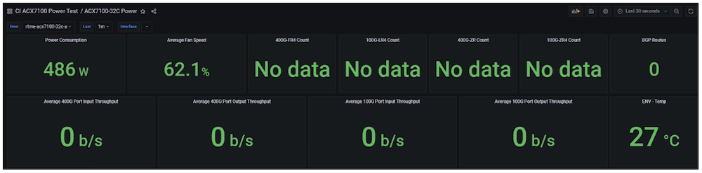

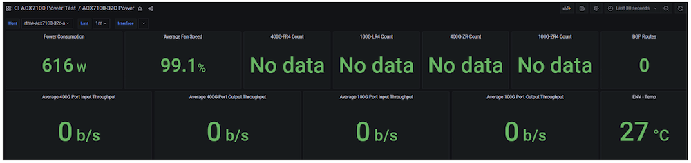

### ZR optics on all (x36) Ports, no Traffic

Router power consumption and temperature at normal and max fan speed:

| Test Conditions | Environment | Power |
|:--|:--|:--|
| Typical Power with4x 400GE ZR + 32x 100GE ZR4optics plugged-in, no traffic | Normal Fan Speed | 706W |
| Maximum Power with4x 400G ZR + 32x 100GE ZR4optics plugged-in, no traffic | Maximum Fan Speed | 832W |

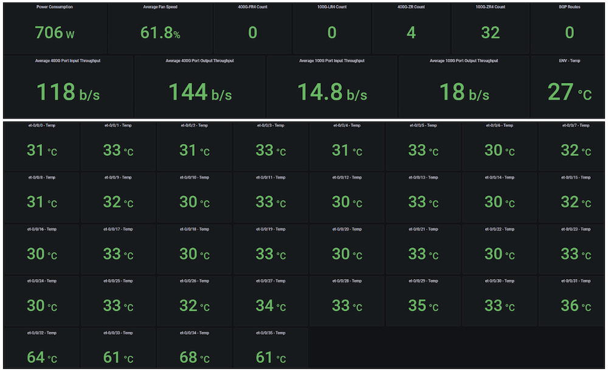

Typical power measured is 706 W by the router at normal fan speed with ZR optics plugged into 4x 400GE and 32x 100GE ports. Temperature of the 100GE optics are in the range of 31-33 degC, while 400GE optics are in the range of 61-68 degC.

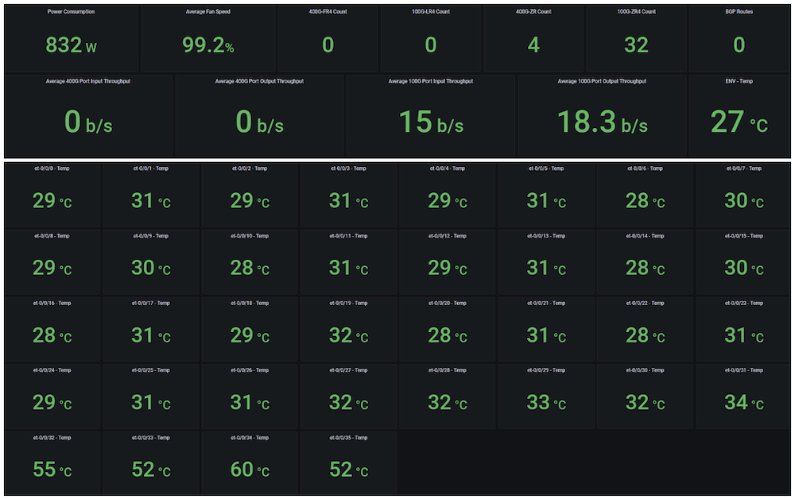

Maximum Power measured is 832 W by the router at maximum fan speed with ZR optics plugged into 4x 400GE and 32x 100GE ports only. Temperature of the 100GE optics are in the range of 28-31 degC, while 400GE optics are in the range of 52-60 degC.

### ZR Optics on all (x36) Ports, Full Meshed Line Rate Traffic

Router power consumption and temperature at normal and max fan speed

Traffic profile (IMIX): the traffic generator is configured with fully meshed traffic pattern and following packet sizes, line rate on all ports.

- 64 bytes
- 78 bytes
- 100 bytes
- 373 bytes
- 570 bytes
- 1300 bytes
- 1518 bytes
- 9000 bytes

| Test Conditions | Environment | Power |
|:--|:--|:--|
| Typical Power with4x 400GE ZR + 32x 100GE ZR4optics plugged-in, with traffic | Normal Fan Speed | 791W |
| Maximum Power with4x 400G ZR + 32x 100GE ZR4optics plugged-in, with traffic | Maximum Fan Speed | 920W |

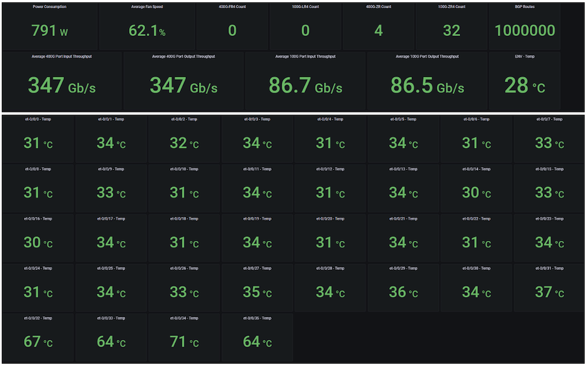

Typical Power measured is 791 W by the router when line rate traffic is sent across 4x 400GE + 32x 100GE ports and fan speed set to normal. Temperature of the 100GE optics is in the range of 31-34 degC, while 400GE optics are in the range of 64-71 degC.

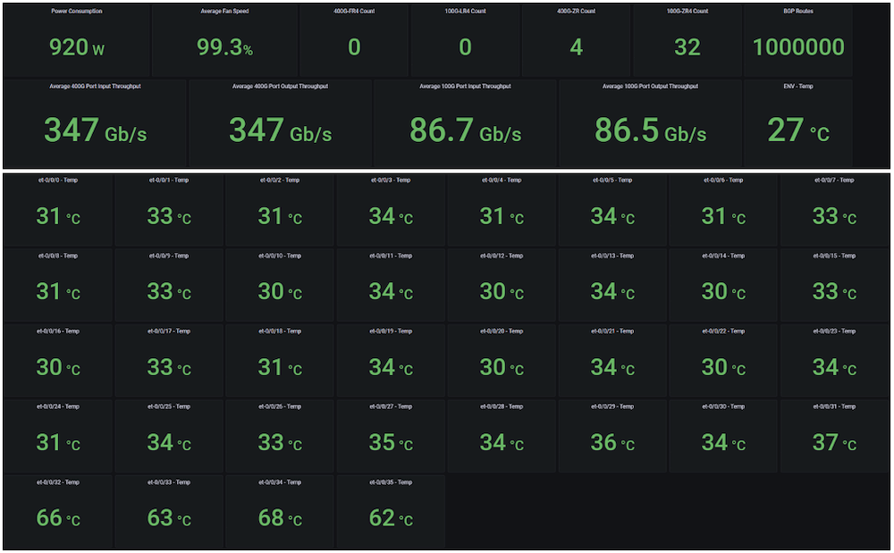

Maximum Power measured is 920 W by the router when line rate traffic is sent across 4x 400GE & 32x 100GE ports and fan speed is set to max. Temperature of the 100GE optics are in the range of 30-37 degC, while 400GE optics are in the range of 62-68 degC.

## Summary View

In the following dashboard, we display multiple optic attributes including:

- Chromatic dispersion: arises from the variation in propagation velocity with wavelength
- Optical Signal to Noise Ratio (OSNR): provides a measure of optical noise interference on optical signals. The OSNR values are most critical at the receiving end of the network since if this ratio reduces, then the probability of the receiver recovering the signal is reduced
- Pre-FEC BER: The 400G ZR Optics first transforms the optical signal into a digital bit stream and then applies a forward error correction (FEC), which automatically corrects failed bits, if any. As long as the pre-FEC is below the threshold level, the system ensures that all bit errors are successfully identified and corrected, and therefore, no packet loss occurs
- Input power: If the input power of the optics goes lower than the desired value, indicates that there could be a problem with the receiver itself, or as in most cases, could be in the fiber (can be a bad fiber, or the connector is dirty and requires cleaning).
- Output power: The highest power the optics can deliver and pumps it out. It's not configurable since it's the output power that is pumped out by the optics. You can distinguish good and bad module based on the output power.

### 100GE Interfaces

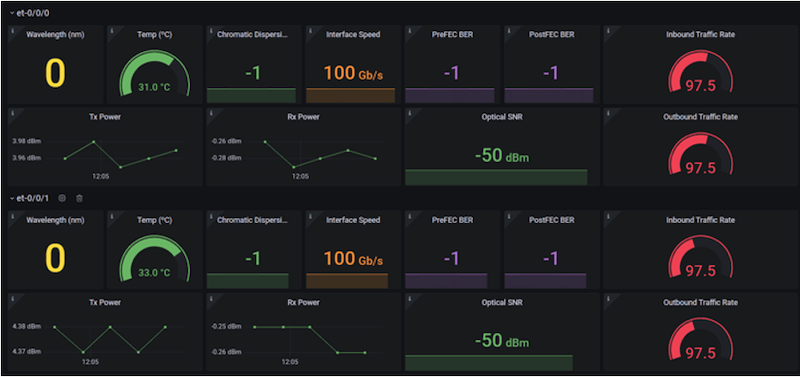

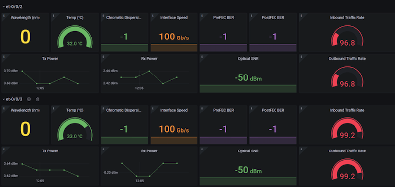

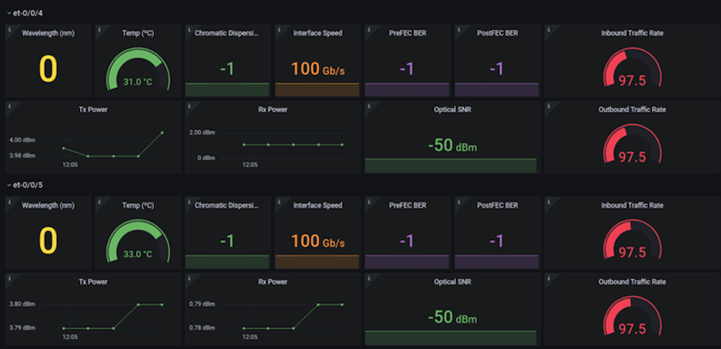

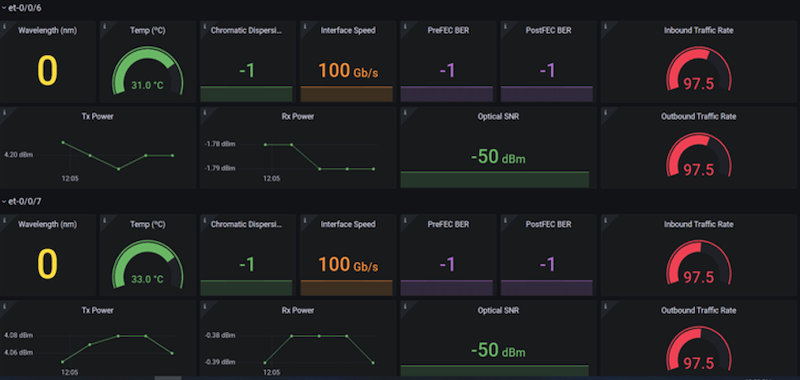

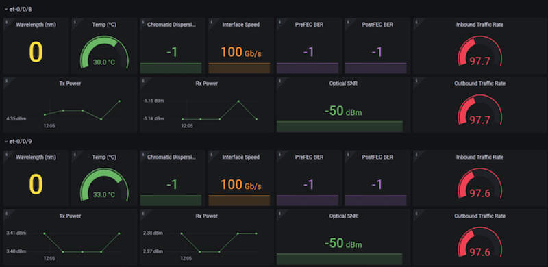

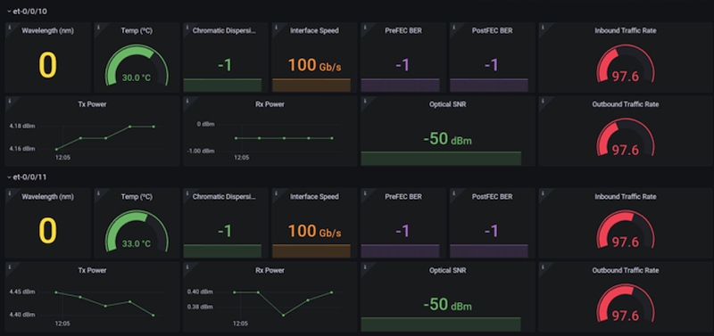

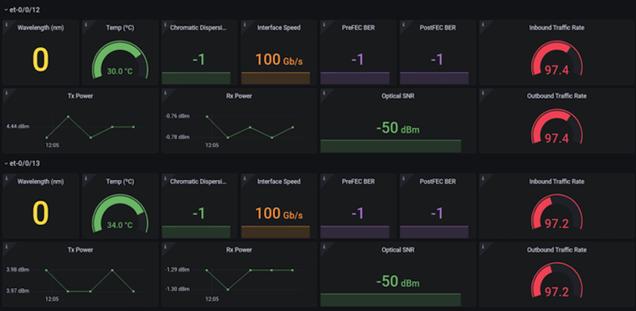

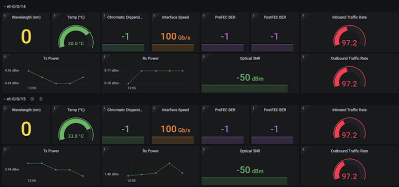

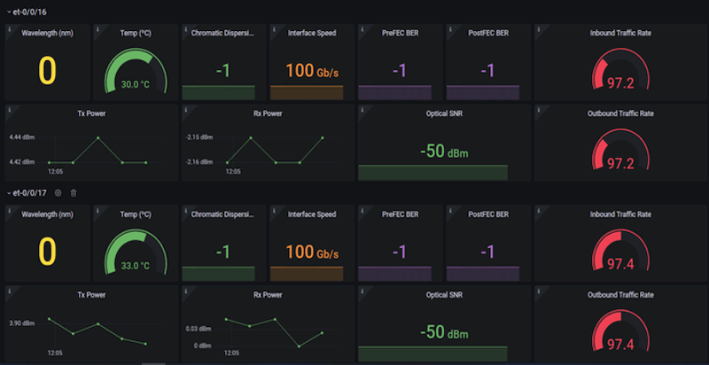

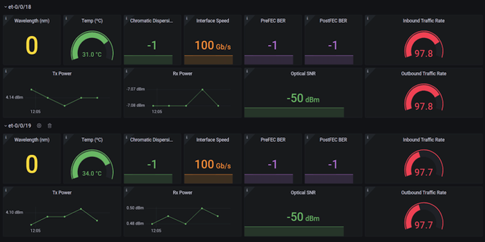

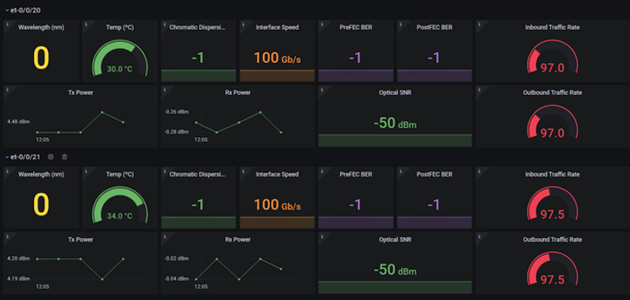

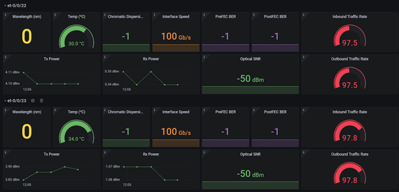

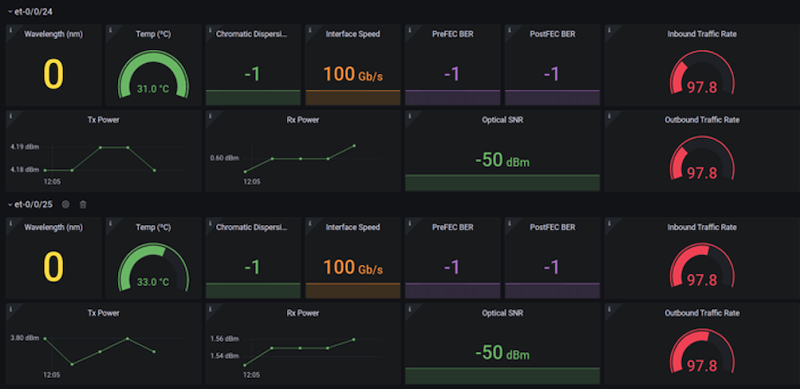

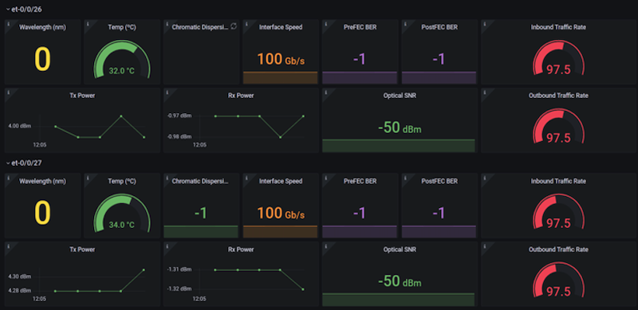

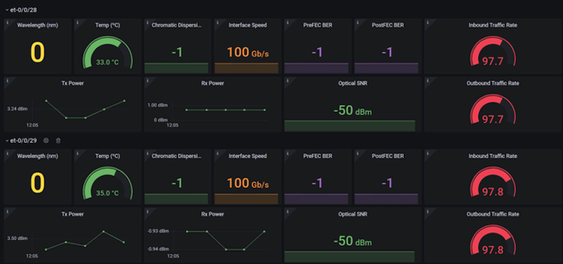

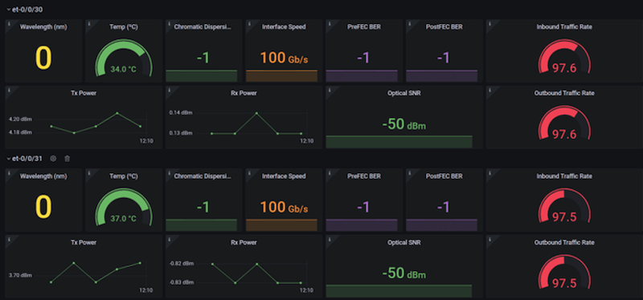

### 400GE Interfaces

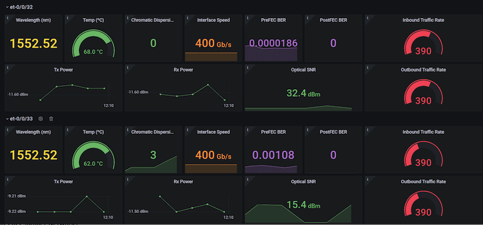

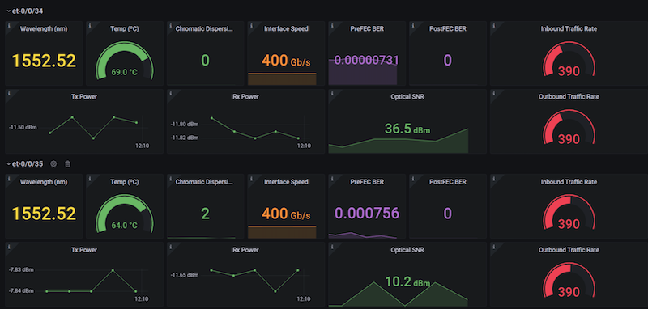

## Telemetry configuration integrated with Paragon Insights

Streaming Telemetry and monitoring of high-power coherent optics is outside the scope of this article and will be taken up as part of another article where Juniper's Paragon Insight monitors the attributes and raises alarm when the values are abnormal or found to be out of bounds. Following attributes are monitored by Paragon Insight:

| Input-power | /components/component/optical-channel/state/input-power |
|:--|:--|
| OSNR | /components/component/optical-channel/state/osnr |
| Pre-FEC-BER | /components/component/optical-channel/state/pre-fec-ber/instant |
| Output-power | /components/component/optical-channel/state/output-power |
| Laser-bias-current | /components/component/optical-channel/state/laser-bias-current |
| Chromatic dispersion | /components/component/optical-channel/state/chromatic-dispersion |
| Second order polarization mode dispersion | /components/component/optical-channel/state/second-order-polarization-mode-dispersion |
| Polarization dependent loss | /components/component/optical-channel/state/polarization-dependent-loss |
| Carrier frequency offset | /components/component/optical-channel/state/carrier-frequency-offset/instant |

## Summary

The key takeaways for ACX7100-32C, regardless of configuration: ACX7100-32C can support 4x 400GE and 32x 100GE ZR4s in all ports with a power budget of <1000W at ambient and higher temperatures. This is achieved by a single row of QSFP-DD connectors with the smallest heatsink for 1RU in belly-to-belly configuration.

## Glossary

- KPI : Key Performance Indicator
- IMIX : Internet Mix
- AFO : Air Flow Out
- AFI : Air Flow In
- LL : Low line input voltage
- HL : High line input voltage
- QSFP-DD : 400GE optics type

## Acknowledgments

I would like to express my gratitude to my mentor Nicolas Fevrier, Sr. Director, PLM, for the detailed reviews of the article. I would also thank the Lab Engineers, TME team (Suneesh Babu, Jose Dimabuyu & Jose Miguel) and Hardware Engineering team (Kapil Jain, Rajeshwar Sable) for the timely support and help.
