# MX301 A Powerful Filtering Gateway

**David Roy - 04/24/2026**

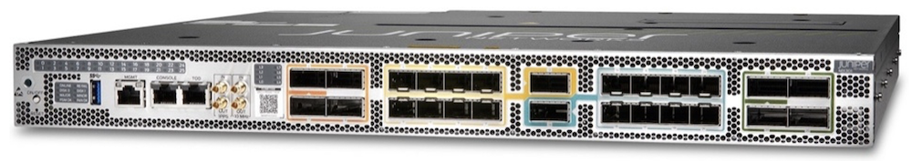

Let's use the Juniper filtering tools in a more comprehensive and realistic use case in which MX301 will serve as a filtering routing gateway to protect peering points, critical cloud platforms, or any network infrastructure that requires large-scale security.

## Introduction

This is the second article on the MX301 platform's filtering topic. [The first article [1]](https://juniper.github.io/techposts/mx301-deepdive/article).

## MX301 as a Filtering Gateway

In this second article, we will reuse the FlowSpec FLT Acceleration feature alongside other Juniper filtering tools in a more comprehensive and realistic use case in which MX301 will serve as a filtering routing gateway to protect peering points, critical cloud platforms, or any network infrastructure that requires large-scale security.

### Network Topology

We use the following typical architecture, illustrated in Figure 2. In this architecture, certain devices sit at the boundary between two zones: a Trust Zone, which hosts critical customer resources, and an Untrust Zone, which is unmanaged from the customer's point of view. These devices should serve as the means of securely interconnecting these two worlds. In the lab, we simulated this role by adding this feature set on MX301:

- 800Gbps allocated for the trust and the untrust zones
- 2 times the BGP IPv4 and IPv6 Full view (we used official tables from [3])
- Rib-Sharding enabled
- IPv4 and IPv6 PIC Edge (Protect core)
- 2K ISIS nodes / ~10K ISIS routes (for the Trust Zone)
- Ingress IPFIX enabled with a 1:4000 sampling rate on all interfaces
- gRPC gNMI Streaming telemetry enabled (using OpenJTS [4] as collector)

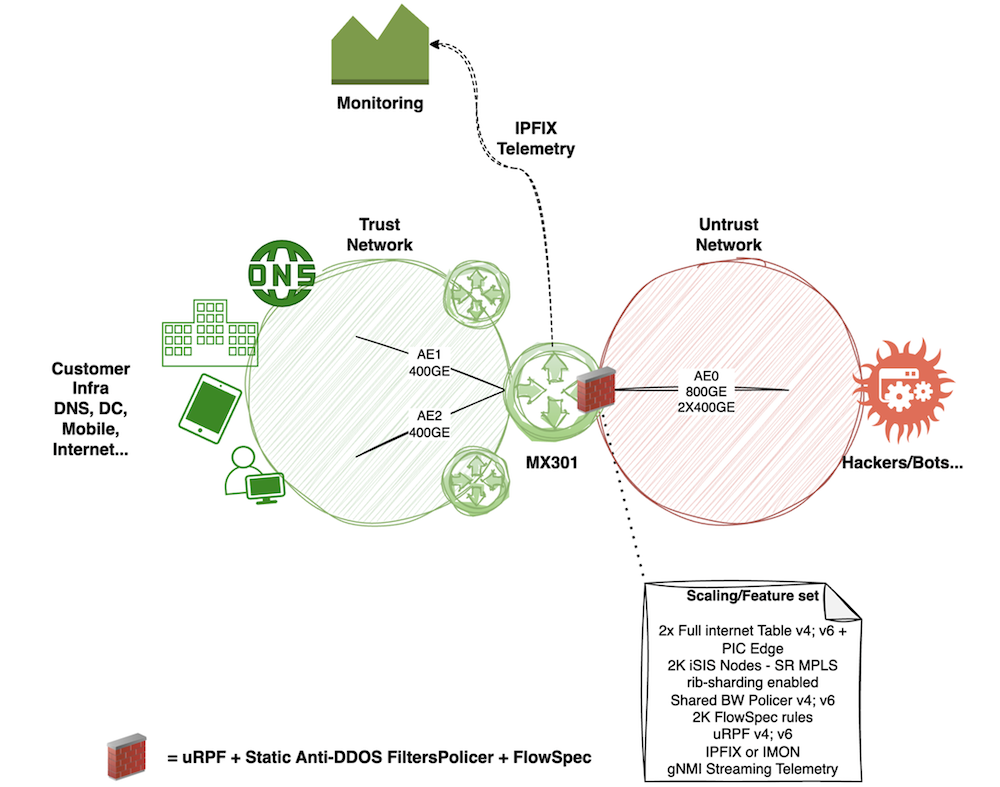

Let's first review the current state and scaling figures on our MX301. We can start with the routing table summary ,Äì as shown, there are approximately 9K IS-IS routes, both the IPv4 and IPv6 BGP "official" Internet tables in the RIB, and 2K BGP FlowSpec entries.

```
lab@rtme-mx301-01> show isis database brief level 2 |match LSPs 
  2022 LSPs

lab@rtme-mx301-01> show route summary 
Autonomous system number: 65000
Router ID: 10.255.152.59

Highwater Mark (All time / Time averaged watermark)
    RIB unique destination routes: 1521714 at 2025-12-15 05:36:54 / 0
    RIB routes                   : 2808095 at 2025-12-15 04:13:58 / 0
    FIB routes                   : 1291504 at 2025-12-15 05:40:12 / 0
    VRF type routing instances   : 0 at 2025-12-15 01:45:02

inet.0: 1050840 destinations, 2092629 routes (1050839 active, 0 holddown, 1 hidden)
              Direct:      9 routes,      8 active
               Local:      4 routes,      4 active
                 BGP: 2083576 routes, 1041788 active
              Static:     20 routes,     20 active
               IS-IS:   9019 routes,   9018 active
                 LDP:      1 routes,      1 active

inet.3: 2025 destinations, 2025 routes (2025 active, 0 holddown, 0 hidden)
                 LDP:   2025 routes,   2025 active

__raass__inet.inet.0: 2 destinations, 2 routes (2 active, 0 holddown, 0 hidden)
                RaaS:      2 routes,      2 active

iso.0: 2 destinations, 2 routes (2 active, 0 holddown, 0 hidden)
              Direct:      2 routes,      2 active

mpls.0: 2056 destinations, 2056 routes (2056 active, 0 holddown, 0 hidden)
                MPLS:      6 routes,      6 active
                 LDP:   2050 routes,   2050 active

inet6.0: 238630 destinations, 477250 routes (238630 active, 0 holddown, 0 hidden)
              Direct:      4 routes,      4 active
               Local:      5 routes,      5 active
                 BGP: 477240 routes, 238620 active
               INET6:      1 routes,      1 active

inet6.3: 2025 destinations, 2025 routes (2025 active, 0 holddown, 0 hidden)
                 LDP:   2025 routes,   2025 active

__raass__inet6.inet6.0: 2 destinations, 2 routes (2 active, 0 holddown, 0 hidden)
                RaaS:      2 routes,      2 active

inetflow.0: 2003 destinations, 2003 routes (2003 active, 0 holddown, 0 hidden)
                Flow:   2003 routes,   2003 active
```

The second command shows us the 2K ISIS nodes:

```
lab@rtme-mx301-01> show isis database level 2 | match LSP 
LSP ID                      Sequence Checksum Lifetime Attributes
  2022 LSPs
```

As configured below, the PIC-Edge feature installs both the nominal and backup paths in the FIB.

```
set routing-options rib inet6.0 protect core
set routing-options protect core
```

In practice, we only consume a single "unlist next-hop" ,Äì not twice the full views. Thanks to the Trio's NextHop hierarchy, this "unilist next-hop" handles the nominal/backup forwarding next-hop indirection and consumes only a few more ASIC memory. Let's verify this using a well-known Internet route:

```
lab@rtme-mx301-01> show route forwarding-table destination 8.8.8.0/24 extensive 
Routing table: default.inet [Index 0] 
Internet:
    
Destination:  8.8.8.0/24
  Route type: user                  
  Route reference: 0                   Route interface-index: 0   
  Multicast RPF nh index: 0             
  P2mpidx: 0              
  Flags: sent to PFE, rt nh decoupled  
  Next-hop type: unilist               Index: 1048579  Reference: 1041789
  Next-hop type: indirect              Index: 1048577  Reference: 2    
                                    Weight: 0x1  << NOMINAL BGP
  Nexthop: 192.168.1.6
  Next-hop type: Push 51450            Index: 876      Reference: 2    
  Label: None              
  Next-hop interface: ae0.0         Weight: 0x1  
  Next-hop type: indirect              Index: 1048578  Reference: 2    
                                    Weight: 0x4000   << BACKUP BGP
  Nexthop: 192.168.1.6
  Next-hop type: Push 51451            Index: 877      Reference: 2    
  Label: None              
  Next-hop interface: ae1.0         Weight: 0x4000
```

As mentioned, we also rely on IPFIX for exporting flow statistics to an external appliance. IPFIX is configured as follows ,Äì we only show the IPv4 config, but the config would be the same for IPv6 and MPLS family.

```
lab@rtme-mx301-01> show configuration forwarding-options 
sampling {
    instance {
        flow-ipfix {
            input {
                rate 4000;
                max-packets-per-second 65535;
            }
            family inet {
                output {
                    flow-server 10.1.1.1 {
                        port 9999;
                        autonomous-system-type peer;
                        no-local-dump;
                        source-address 172.16.255.1;
                        version-ipfix {
                            template {
                                template1;
                            }
                        }
                    }
                    inline-jflow {
                        source-address 172.16.255.1;
                    }
                }
            }
[...]

lab@rtme-mx301-01> show configuration services 
flow-monitoring {
    version-ipfix {
        template template1 {
            flow-active-timeout 10;
            flow-inactive-timeout 10;
            nexthop-learning {
                enable;
            }
            template-refresh-rate {
                packets 100;
                seconds 10;
            }
            option-refresh-rate {
                packets 1000;
                seconds 10;
            }
            ipv4-template;
        } 
[...]
```

With this configuration and scaling, RPD consumes about 5% of the RE memory. The heap memory of the "pseudo-FPC" reaches 41%, while the NextHop ASIC memory partition still has 73% free space:

```
lab@rtme-mx301-01> show task memory                           
Memory                 Size (kB)  Percentage  When
  Currently In Use:      4455064          5%  now
  Maximum Ever Used:     4736364          5%  25/12/15 05:15:02
  Available:            83809688        100%  now

lab@rtme-mx301-01> show chassis fpc    
                     Temp  CPU Utilization (%)   CPU Utilization (%)  Memory    Utilization (%)
Slot State            (C)  Total  Interrupt      1min   5min   15min  DRAM (MB) Heap     Buffer
  0  Online            43      3          0        2      2      5    32768      41          0

lab@rtme-mx301-01> show system resource-monitor fpc slot 0    
FPC Resource Usage Summary

Free Heap Mem Watermark         : 20  %
Free NH Mem Watermark           : 20  %
Free Filter Mem Watermark       : 20  %       

* - Watermark reached

Slot #         % Heap Free        RTT      Average RTT
     0             58

                 PFE #      % ENCAP mem Free      % NH mem Free      % FW mem Free         
                    0                                 73                 99
                    1                                 73                 99 
```

## How to Secure the Network?

In the previous section, we detailed our baseline.  To build this "secure" gateway use case, we will use four main Junos features.

*Note: Of course, there are other ways to secure a network architecture. BGP RTBH is one of the most popular, efficient, and simplest solutions to deploy destination blackholing at scale. However, in this article, we focus on a smarter approach that combines multiple Trio capabilities to mitigate various attack types against a destination while keeping it reachable.*

- Unicast RPF (uRPF): for every packet entering the MX301 from an untrust interface, we will check the source IP address against the RIB (source lookup). uRPF provides only a basic, first-level source validation, which, by itself, is no longer sufficient from a security standpoint. But since Trio can easily support source lookup along with destination, without any performance degradation, why not add this feature to secure our infrastructure a bit more? We have the following three choices ,Äì in our example, we will select the third one, which offers a good compromise.

**uRPF Strict Mode**: BCP38 at the customer,ÄìSP edge. Each incoming packet is validated against the FIB. If the ingress interface does not match the best reverse path, the packet is dropped.

**uRPF Loose Mode**: sRTBH anywhere in the network. The router verifies only the presence of a route in the FIB. If no route exists, the packet is dropped; if a route is present, the packet is accepted. This mode is well-suited for sRTBH and for mitigating specific spoofed traffic at peering edges.

**uRPF Feasible Path Mode**: sRTBH anywhere in the network and BCP38 for multihomed or asymmetric environments. In feasible-path mode, the FIB retains multiple valid routes to a destination IP address. A packet is forwarded if its ingress interface matches any of these feasible paths; otherwise, it is dropped.

- A set of static firewall filter terms and policers designed to mitigate well-known DDoS attack patterns. In practice, DDoS attacks are most often a combination of amplification attacks and dynamic attacks. Amplification attacks exploit vulnerabilities in well-known network services to generate large volumes of DDoS traffic, typically consisting of large UDP packets and fragmented payloads. Common amplification vectors include DNS and NTP service vulnerabilities but not only. The signature of these kinds of attacks is well-known. Why policing and not dropping those attacks instead? The challenge with the Amplification Attacks is that they use standard protocols that are very useful, like DNS. Dropping all the DNS traffic will bring you a lot of trouble, as you may imagine J. So, the idea with these static filters is to dramatically limit the load from these attacks and leave enough bandwidth in the nominal state for forwarding legitimate traffic associated with those network services.

- BGP FlowSpec, together with its new FLT acceleration, is the third security mechanism used to precisely blackhole dynamic attack signatures, which are most often observed alongside amplification attacks (but not always). This approach provides a much more granular, targeted mitigation, allowing us to eliminate the remaining traffic from a complex attack. In this article, we use IPFIX as the flow observability protocol. IPFIX is enabled on all ingress interfaces and exports flow records to an external appliance, which quickly identifies dynamic attack signatures and generates corresponding BGP FlowSpec updates toward our security gateway. The details of this scrubbing solution are beyond the scope of this article.

- Finally, we will leverage the Juniper Streaming Telemetry stack to monitor in real time all "data-plane" counters associated with the three previously described features. This allows monitoring and NOC teams to observe the benefits of each solution under different attack types in real time.

## Putting our MX301 Under Attack

For now, let's assume that our MX301 has no security features enabled, except for BGP FlowSpec and the FLT acceleration described in our previous article [1]. We also assume that 2K FlowSpec routes,Äîof varying complexity,Äîare already installed. Their complexity is not a concern here, as we rely on FLT acceleration.

```
set routing-options rib inet6.0 flow fast-lookup-filter
set routing-options flow fast-lookup-filter
```

But, why this baseline of pre-installed FlowSpec rules? First, to stress a bit more the MX301, but we could also imagine this "customer" uses BGP FlowSpec not only to mitigate Dynamic DDoS attacks but also to blackhole some well-known illegal destinations/contents permanently.

Let's focus our eyes on these interfaces:

- Untrust interface: ae0 made of 2x400GE ports (one port per PFE)
- Trust interface: ae2 made of 1 single 400GE port.

As mentioned earlier, we have nothing fancy configured by default on these interfaces ,Äì just IPFIX to provide flow statistics to an external scrubbing center.

```
lab@rtme-mx301-01> show configuration interfaces ae0 
description TO_INTERNET;
unit 0 {
    family inet {
        filter {
            group 1;
        }
        sampling {
            input;
        }
        address 172.16.254.1/31;
    }
    family inet6 {
        filter {
            group 1;
        }
        sampling {
            input;
        }
        address 2001:cafe:254::1/127;
    }
}

lab@rtme-mx301-01> show configuration interfaces ae2    
description TO_POP_2;
mtu 9200;
unit 0 {
    family inet {
        sampling {
            input;
        }
        address 192.85.1.1/24;
    }
    family inet6 {
        sampling {
            input;
        }
        address 2001::1/64;
    }
    family mpls;
}    
```

However, you may notice that we also configured "filter group 1" on both families of ae0. Why is that? Recall that FlowSpec is enabled by default on all interfaces. Here, we want to apply FS only on untrust interfaces. To achieve this, we assigned the arbitrary group ID "1" to those interfaces and explicitly bound FlowSpec to this group:

```
lab@rtme-mx301-01> show configuration routing-options flow                     
interface-group 1;
fast-lookup-filter;

lab@rtme-mx301-01> show configuration routing-options rib inet6.0 flow    
interface-group 1;
fast-lookup-filter;
```

Based on this initial configuration, let's assume these legitimate flows constitute the traffic baseline. All flows are IPv4, but everything we will describe later in this article is fully applicable to IPv6.

Table: Legitimate baseline traffic.

| Flow | Direction | Throughput bps or rate pps | Traffic pattern | Description |
|:--|:--|:--|:--|:--|
| Customer traffic downstream | AE0 to AE2 | 240Gbps / 30Mpps | IMIX | Typical Internet traffic |
| Customer trafficupstream | AE2 to AE0 | 100Gbps / 12Mpps | IMIX | Typical Internet traffic |
| Legitimate DNS traffic (to recursive DNS) | AE0 to AE0 | 200Mbps / 90Kpps | ~256 Bytes | Simulate "Internet DNS" responses toward the Customer Recursive DNS |

Why do we simulate legitimate DNS server traffic? The goal is to illustrate further the complexity of handling DNS amplification attacks. As is well known, the DNS infrastructure is highly distributed. In our example, we assume a fictitious customer operating both recursive and authoritative DNS servers. To briefly simplify the DNS workflow: the customer's recursive DNS server processes end-user DNS queries. It first checks its local cache and, if no entry is found, it recursively queries the DNS hierarchy (root servers, then authoritative DNS servers). These external DNS servers respond to the customer's recursive DNS queries, typically using source port 53. The customer's authoritative DNS server is responsible for serving records for the customer's own domain names. Let's consider our customer has 2 Recursive DNS VIP:

- 10.0.0.1/32
- 10.0.0.2/32

Also, remind you, we monitor via streaming telemetry the interface throughput that confirms everything is well forwarded:

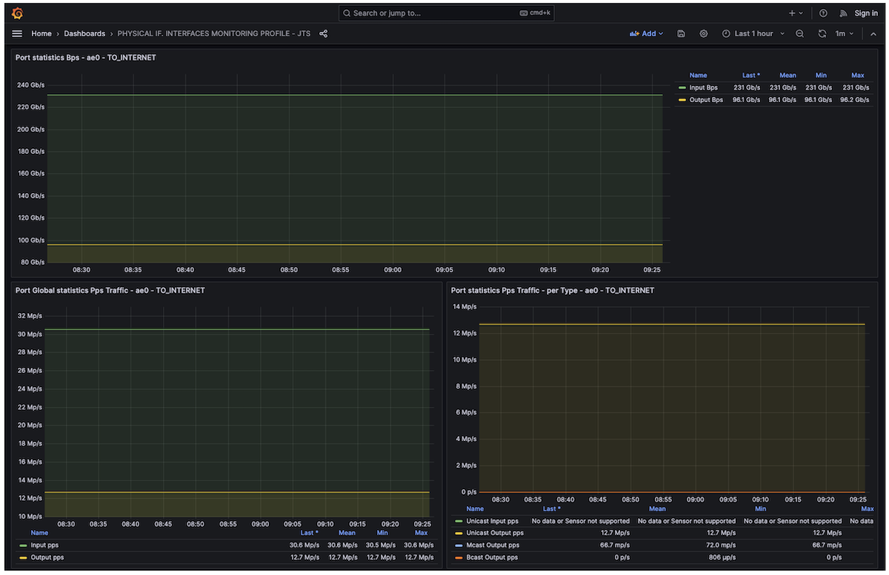

And our tester also monitors transmitted and received traffic ,Äì as seen below, everything is forwarded well:

Table: Baseline traffic statistics collected by the tester

| Type of traffic | Direction | Tx L1 Rate (bps) | Rx L1 Rate (bps) | Tx Rate (fps) | Rx Rate (fps) |
|:--|:--|:--|:--|:--|:--|
| Legitimate Downstream customer traffic | AE0 to AE2 | 240,022,896,663 | 240,022,904,892 | 30,460,810 | 30,460,792 |
| Legitimate DNS Traffic | AE0 to AE2 | 197,913,101 | 197,913,023 | 89,635 | 89,634 |
| Legitimate Upstream customer traffic | AE2 to AE0 | 99,999,999,667 | 100,000,010,902 | 12,690,791 | 12,690,692 |

Now, the idea is to simulate a complex DDoS attack by combining private IP address spoofing, DNS amplification, and dynamic TCP attacks.

Important note of the simulated attack: All these parallel flows will target a single IPv4 destination host located inside the customer's network. In this example, this host represents our critical resource under attack. Let's assume the IP address is 192.168.1.1/32 (in real life, this would be a public IP).

Here is the profile of the DDoS attack received on the ae0 interface:

Table: Flow attacks definition

| Flow | Throughput bps or rate pps | Traffic pattern |
|:--|:--|:--|
| IP spoofing target | 7.3Gbps / 3Mpps | Size 256 Bytes - Random IP Source (IP Spoofed from customer's IP ranges) |
| DNS Amplification | 158Gbps / 13.3Mpps | Size 1500Bytes - UDP port source 53 |
| DNS Amplification | 158Gbps / 13.3Mpps | Size 1500Bytes (except the last frag) - UDP fragments (trailing packets of the DNS attack) |
| Dynamic TCP Attack | 72Gbps / 46Mpps | Random Size 128-256 Bytes ,Äì TCP random IP Source, Random Source Ports, 4 Destination Ports: 1024, 1025, 1026, 5000 |

Let's start our attacks. As you can see below, the physical port et-0/0/0, a member link of the ae2 trust interface, is totally overloaded and experiences massive RED drops. This is expected, since ae0 receives more than 600 Gbps, while ae2 (the interface on which 192.168.1.1/32 is reachable) has a maximum capacity of 400 Gbps.

```
lab@rtme-mx301-01> show interfaces queue et-0/0/0  
Physical interface: et-0/0/0, Enabled, Physical link is Up
  Interface index: 158, SNMP ifIndex: 534
  Description: TO_POP_2
Forwarding classes: 16 supported, 6 in use
Egress queues: 8 supported, 6 in use
Queue: 0, Forwarding classes: BEST-EFFORT
  Queued:
    Packets              :          134671505681             132068620 pps
    Bytes                :        75562459379016          627097108480 bps
  Transmitted:
    Packets              :          109413590220              81493768 pps
    Bytes                :        60570127525651          386967339008 bps
    Tail-dropped packets :                     0                     0 pps
    RL-dropped packets   :                     0                     0 pps
    RL-dropped bytes     :                     0                     0 bps
    RED-dropped packets  :           25257915461              50574852 pps
     Low                 :           25257915461              50574852 pps
     Medium-low          :                     0                     0 pps
     Medium-high         :                     0                     0 pps
     High                :                     0                     0 pps
    RED-dropped bytes    :        14992331853365          240129769472 bps
     Low                 :        14992331853365          240129769472 bps
     Medium-low          :                     0                     0 bps
     Medium-high         :                     0                     0 bps
     High                :                     0                     0 bps
  Queue-depth bytes      : 
    Average              :            1233108992
    Current              :            1233550187
    Peak                 :            1234426636
    Maximum              :            1258291200

lab@rtme-mx301-01> show interfaces ae0 | match rate    
  Input rate     : 606975448960 bps (132067379 pps)
  Output rate    : 96143530352 bps (12691126 pps)

lab@rtme-mx301-01> show interfaces ae2 | match rate    
  Input rate     : 96142644648 bps (12690704 pps)
  Output rate    : 374550573856 bps (81503216 pps)   
```

Thanks to the rich Junos data-plane telemetry sensors, we can confirm and monitor these drops. As shown below, we observe the "peak of traffic" on ae2, Queue 0 being full, and the RED engine working heavily by dropping a large amount of "Internet traffic."

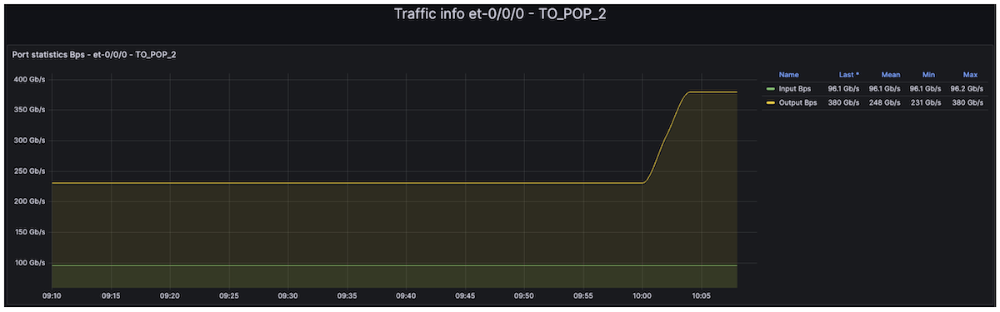

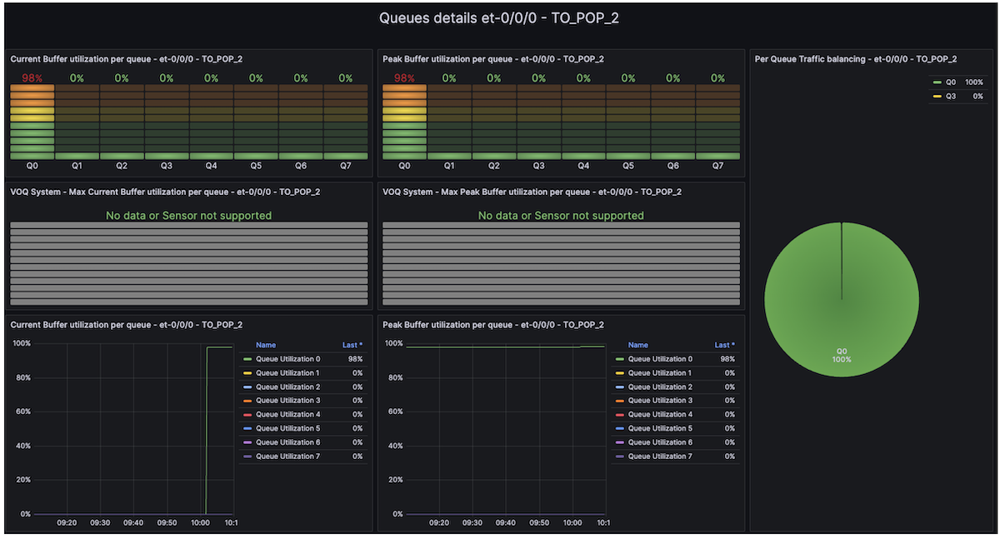

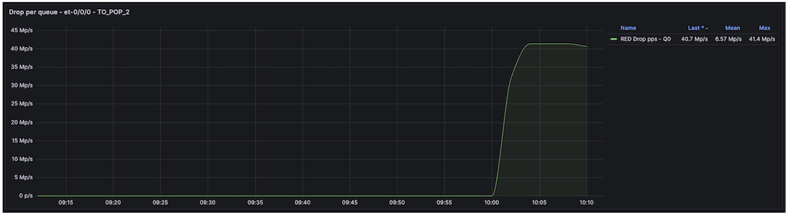

Now, if we look at the tester's statistics, we can confirm that this DDoS attack has a significant impact on our downstream legitimate traffic, including DNS traffic.

Table: Traffic impact measured by the Tester

| Type of traffic | Direction | Tx L1 Rate (bps) | Rx L1 Rate (bps) | Tx Rate (fps) | Rx Rate (fps) |
|:--|:--|:--|:--|:--|:--|
| Legitimate Downstream customer traffic | AE0 to AE2 | 239,904,620,780 | 148,244,312,502 | 30,445,733 | 18,800,049 |
| Legitimate DNS Traffic | AE0 to AE2 | 197,912,101 | 72,002,114 | 89,632 | 32,610 |
| Legitimate Upstream customer traffic | AE2 to AE0 | 100,000,001,318 | 99,999,988,451 | 12,690,787 | 12,690,945 |

## Secure the Customer's Infra

Now, it's time to secure our trust infrastructure. First, we will enable uRPF strict mode with the **feasible-paths** option. As mentioned earlier, nowadays, uRPF does not help much, but why deprive ourselves of this feature if Trio enables it without compromise? It could help our customer to mitigate some IP spoofing attacks. Let's start by enabling the "feasible-paths" uRPF option globally:

```
set routing-options forwarding-table unicast-reverse-path feasible-paths
```

Then, we create a dedicated firewall filter that applies the "discard" "log," and "count" actions for spoofed IP traffic.

```
lab@rtme-mx301-01> show configuration firewall family inet filter uRPFv4 
term 1 {
    then {
        count urpfv4;
        log;
        discard;
    }
}

lab@rtme-mx301-01> show configuration firewall family inet6 filter uRPFv6   
term 1 {
    then {
        count urpfv6;
        log;
        discard;
    }
}
```

Finally, enable IPv4 and IPv6 uRPF feature on Untrust interfaces (i.e. ae0):

```
lab@rtme-mx301-01> show configuration interfaces ae0 
description TO_INTERNET;
unit 0 {
    family inet {
        rpf-check {
            fail-filter uRPFv4;
        }
        filter {
            group 1;
        }
        sampling {
            input;
        }
        address 172.16.254.1/31;
    }
    family inet6 {
        rpf-check {
            fail-filter uRPFv6;
        }
        filter {
            group 1;
        }
        sampling {
            input;
        }
        address 2001:cafe:254::1/127;
    }
}
```

As shown, our legitimate traffic remains affected. The telemetry dashboard confirms that Queue 0 on the ae2 interface is still full.

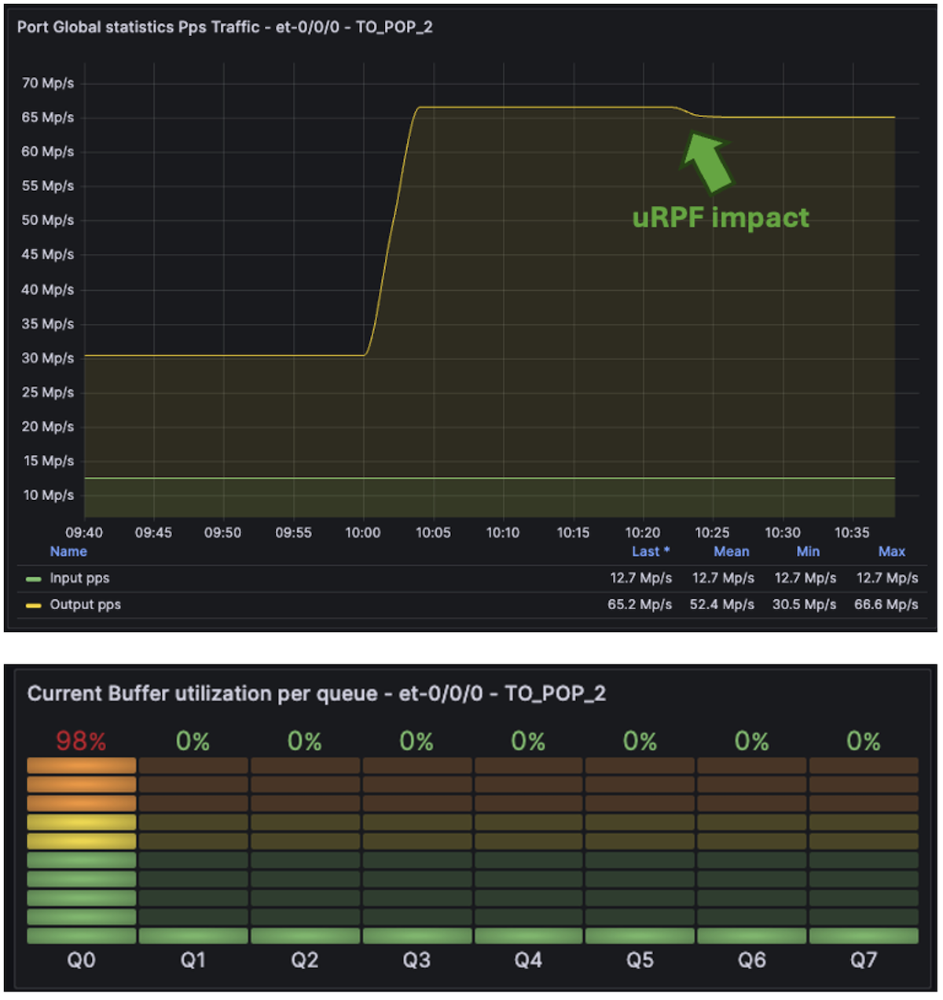

Nevertheless, if we switch to the Firewall Dashboard (using the Junos firewall filter sensor, which exposes all firewall counters and policer information), we can see that the uRPF filter is discarding ~3 Mpps of spoofed attack traffic. But this is not enough, as expected.

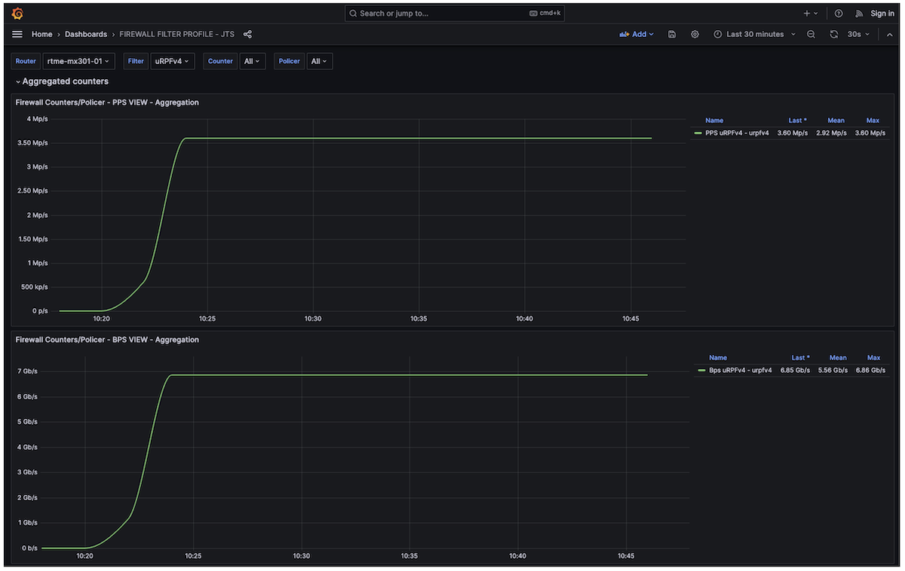

As we discussed earlier, most of today's attacks are a mix of well-known amplification attacks with well-known signatures and dynamic attacks with unpredictable signatures. How can we mitigate well-known amplification attacks? Based on my previous experience within a Service Provider NOC team, I share below a typical (non-exhaustive) list of well-known amplification attacks and their corresponding signatures. Moreover, several public articles also mention some of those attacks, for example [5] or [6]:

Table: Some well-known DDOS Amplification Attacks

| Attack Type | Network Signature |
|:--|:--|
| DNS | UDP traffic sourced from port 53 (DNS amplification) |
| UDP-FRAGMENT | UDP packets that are IP fragments (protocol udp with is-fragment) |
| NTP | UDP traffic sourced from port 123 (NTP amplification/reflection) |
| UPNP | UDP traffic sourced from port 1900 (UPnP SSDP amplification) |
| CHARGEN | UDP traffic sourced from port 19 (CHARGEN amplification) |
| SNMP | UDP traffic sourced from port 161 (SNMP amplification) |
| ONCRPC | UDP traffic sourced from port 111 (ONC RPC / Portmapper amplification) |
| LDAP | UDP traffic sourced from port 389 (LDAP amplification) |
| MEMCACHED | UDP traffic sourced from port 11211 (Memcached amplification) |
| UDP-80 | UDP traffic destined to port 80, excluding source port 53 (non-DNS UDP floods toward HTTP services) |

The DNS attack is among the most challenging. As mentioned earlier, we cannot "blindly" police DNS traffic, especially when customers host their own DNS services. During DNS attacks, we will rely on the pseudo-algorithm below to preserve as much bandwidth as possible for legitimate DNS services while policing traffic likely part of a DNS amplification attack.

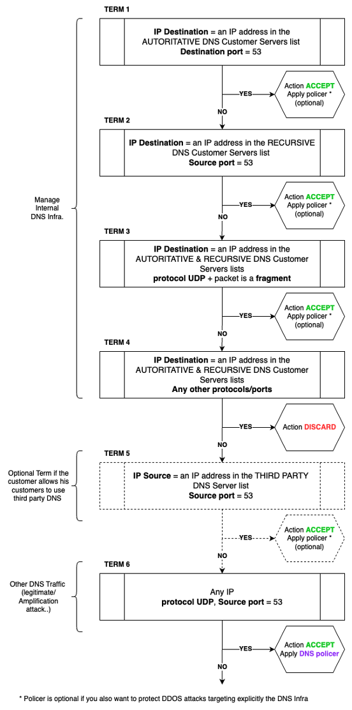

How does it work? First, you need to create prefix-lists (v4 and v6), including IP ranges of the customer DNS infrastructure:

- A prefix-list for the Authoritative DNS servers: we chose DNS-AUTHORITATIVE and DNS-AUTHORITATIVE-V6 as prefix-list names.
- A prefix-list for the Recursive DNS servers: we chose DNS-RECURSIVE and DNS-RECURSIVE-V6 as prefix-list names.

Additionally, if the customer relies on third-party DNS or allows his customers to use well-known public DNS services (such as Google or Cloudflare), you could also create:

- A prefix-list for Third Party DNS servers: we chose the names DNS-THIRD-PARTY and DNS-THIRD-PARTY-V6 as the prefix-list.

Then, the algorithm is working as follows: it applies to both IPv4 and IPv6 DNS:

- Term 1: First, handle DNS traffic (UDP/TCP destination port 53) coming from the Internet/untrust zone and targeting the customer's authoritative DNS server(s) (serving the customer's domain name(s)). We use the "DNS-AUTHORITATIVE" prefix lists to match destination addresses. For this traffic, apply an "Accept" action and an optional dedicated policer (it may also be wise to rate-limit DNS traffic explicitly targeting the DNS servers to mitigate direct DNS server attacks).
- Term 2: Then, handle DNS reply traffic (UDP/TCP source port 53) coming from the Internet/untrust zone and targeting the customer's recursive DNS server(s) (replies to recursive requests initiated by the customer's recursive DNS servers). We use the "DNS-RECURSIVE" prefix lists to match destination addresses. For this traffic, apply an "Accept" action and an optional dedicated policer (again, it may be wise to rate-limit DNS traffic explicitly targeting the DNS servers to mitigate direct DNS server attacks).
- Term 3: Allow UDP fragmented packets targeting both the customer's recursive and authoritative DNS servers. For this traffic, apply an "Accept" action and an optional dedicated policer (it may be wise to also rate-limit DNS traffic explicitly targeting the DNS servers).
- Term 4: Drop all other traffic targeting the customer's recursive and authoritative DNS servers to protect your DNS infrastructure.
- Term 5 (**optional**): Handle replies (UDP/TCP source port 53) from well-known and customer-authorized third-party DNS servers hosted outside the customer network. We use the "DNS-THIRD-PARTY" prefix lists to match source addresses. For this traffic, apply an "Accept" action and an optional dedicated policer (it may be wise to rate-limit DNS traffic generated by well-known third-party DNS servers to mitigate spoofing attacks of public DNS server IPs).
- Term 6: The final term handles all other UDP-based DNS traffic, which represents most amplification attacks. However, it is not advisable to drop everything at this point. The goal of these static filters and policers is to reduce the blast radius of amplification attacks significantly. Therefore, the action is "Accept," but this time associated with a **mandatory** policer that rate-limits DNS amplification attacks.

Below is the IPv4 DDOS mitigation filter configuration. The first six terms relate to the "pseudo-algorithm" described above, and the following terms aim to mitigate the other simpler, well-known amplification attacks previously described in Table 5. You may notice that we also explicitly redirect all traffic to the BEST-EFFORT forwarding class, with an explicit ingress remarking of the DSCP value to 0.

Since this filter is applied on ingress untrust interfaces, we consider the traffic as untrusted. This is purely for illustration purposes and should not be taken as a recommendation.

```
set firewall family inet filter DDOS_MITIG_V4 interface-specific

set firewall family inet filter DDOS_MITIG_V4 term DNS-INFRA-AUT from destination-prefix-list DNS-AUTHORITATIVE
set firewall family inet filter DDOS_MITIG_V4 term DNS-INFRA-AUT from destination-port 53
set firewall family inet filter DDOS_MITIG_V4 term DNS-INFRA-AUT then policer DNS-AUT
set firewall family inet filter DDOS_MITIG_V4 term DNS-INFRA-AUT then count DNS-AUT
set firewall family inet filter DDOS_MITIG_V4 term DNS-INFRA-AUT then loss-priority low
set firewall family inet filter DDOS_MITIG_V4 term DNS-INFRA-AUT then forwarding-class BEST-EFFORT
set firewall family inet filter DDOS_MITIG_V4 term DNS-INFRA-AUT then accept
set firewall family inet filter DDOS_MITIG_V4 term DNS-INFRA-AUT then dscp be

set firewall family inet filter DDOS_MITIG_V4 term DNS-INFRA-REC from destination-prefix-list DNS-RECURSIVE
set firewall family inet filter DDOS_MITIG_V4 term DNS-INFRA-REC from source-port 53
set firewall family inet filter DDOS_MITIG_V4 term DNS-INFRA-REC then policer DNS-REC
set firewall family inet filter DDOS_MITIG_V4 term DNS-INFRA-REC then count DNS-REC
set firewall family inet filter DDOS_MITIG_V4 term DNS-INFRA-REC then loss-priority low
set firewall family inet filter DDOS_MITIG_V4 term DNS-INFRA-REC then forwarding-class BEST-EFFORT
set firewall family inet filter DDOS_MITIG_V4 term DNS-INFRA-REC then accept
set firewall family inet filter DDOS_MITIG_V4 term DNS-INFRA-REC then dscp be<

set firewall family inet filter DDOS_MITIG_V4 term DNS-INFRA-FRAG from destination-prefix-list DNS-AUTHORITATIVE
set firewall family inet filter DDOS_MITIG_V4 term DNS-INFRA-FRAG from destination-prefix-list DNS-RECURSIVE
set firewall family inet filter DDOS_MITIG_V4 term DNS-INFRA-FRAG from is-fragment
set firewall family inet filter DDOS_MITIG_V4 term DNS-INFRA-FRAG from protocol udp
set firewall family inet filter DDOS_MITIG_V4 term DNS-INFRA-FRAG then policer DNS-FRAG
set firewall family inet filter DDOS_MITIG_V4 term DNS-INFRA-FRAG then count DNS-FRAG
set firewall family inet filter DDOS_MITIG_V4 term DNS-INFRA-FRAG then loss-priority low
set firewall family inet filter DDOS_MITIG_V4 term DNS-INFRA-FRAG then forwarding-class BEST-EFFORT
set firewall family inet filter DDOS_MITIG_V4 term DNS-INFRA-FRAG then accept
set firewall family inet filter DDOS_MITIG_V4 term DNS-INFRA-FRAG then dscp be<

set firewall family inet filter DDOS_MITIG_V4 term DNS-INFRA-DROP from destination-prefix-list DNS-AUTHORITATIVE
set firewall family inet filter DDOS_MITIG_V4 term DNS-INFRA-DROP from destination-prefix-list DNS-RECURSIVE
set firewall family inet filter DDOS_MITIG_V4 term DNS-INFRA-DROP then count DNS-DROP
set firewall family inet filter DDOS_MITIG_V4 term DNS-INFRA-DROP then discard<

set firewall family inet filter DDOS_MITIG_V4 term DNS-THIRD-PARTY from source-prefix-list DNS-THIRD-PARTY
set firewall family inet filter DDOS_MITIG_V4 term DNS-THIRD-PARTY from source-port 53
set firewall family inet filter DDOS_MITIG_V4 term DNS-THIRD-PARTY then policer DNS-THIRD
set firewall family inet filter DDOS_MITIG_V4 term DNS-THIRD-PARTY then count DNS-THIRD
set firewall family inet filter DDOS_MITIG_V4 term DNS-THIRD-PARTY then loss-priority low
set firewall family inet filter DDOS_MITIG_V4 term DNS-THIRD-PARTY then forwarding-class BEST-EFFORT
set firewall family inet filter DDOS_MITIG_V4 term DNS-THIRD-PARTY then accept
set firewall family inet filter DDOS_MITIG_V4 term DNS-THIRD-PARTY then dscp be<

set firewall family inet filter DDOS_MITIG_V4 term DNS-UNKNOWN from protocol udp
set firewall family inet filter DDOS_MITIG_V4 term DNS-UNKNOWN from source-port 53
set firewall family inet filter DDOS_MITIG_V4 term DNS-UNKNOWN then policer DNS-UNKNOWN
set firewall family inet filter DDOS_MITIG_V4 term DNS-UNKNOWN then count DNS-UNKNOWN
set firewall family inet filter DDOS_MITIG_V4 term DNS-UNKNOWN then loss-priority low
set firewall family inet filter DDOS_MITIG_V4 term DNS-UNKNOWN then forwarding-class BEST-EFFORT
set firewall family inet filter DDOS_MITIG_V4 term DNS-UNKNOWN then accept
set firewall family inet filter DDOS_MITIG_V4 term DNS-UNKNOWN then dscp be

set firewall family inet filter DDOS_MITIG_V4 term UDP-FRAGMENT from is-fragment
set firewall family inet filter DDOS_MITIG_V4 term UDP-FRAGMENT from protocol udp
set firewall family inet filter DDOS_MITIG_V4 term UDP-FRAGMENT then policer UDP-FRAGMENT
set firewall family inet filter DDOS_MITIG_V4 term UDP-FRAGMENT then count UDP-FRAGMENT
set firewall family inet filter DDOS_MITIG_V4 term UDP-FRAGMENT then loss-priority low
set firewall family inet filter DDOS_MITIG_V4 term UDP-FRAGMENT then forwarding-class BEST-EFFORT
set firewall family inet filter DDOS_MITIG_V4 term UDP-FRAGMENT then accept
set firewall family inet filter DDOS_MITIG_V4 term UDP-FRAGMENT then dscp be

set firewall family inet filter DDOS_MITIG_V4 term NTP from protocol udp
set firewall family inet filter DDOS_MITIG_V4 term NTP from source-port 123
set firewall family inet filter DDOS_MITIG_V4 term NTP then policer NTP
set firewall family inet filter DDOS_MITIG_V4 term NTP then count NTP
set firewall family inet filter DDOS_MITIG_V4 term NTP then loss-priority low
set firewall family inet filter DDOS_MITIG_V4 term NTP then forwarding-class BEST-EFFORT
set firewall family inet filter DDOS_MITIG_V4 term NTP then accept
set firewall family inet filter DDOS_MITIG_V4 term NTP then dscp be

set firewall family inet filter DDOS_MITIG_V4 term UPNP from protocol udp
set firewall family inet filter DDOS_MITIG_V4 term UPNP from source-port 1900
set firewall family inet filter DDOS_MITIG_V4 term UPNP then policer UPNP
set firewall family inet filter DDOS_MITIG_V4 term UPNP then count UPNP
set firewall family inet filter DDOS_MITIG_V4 term UPNP then loss-priority low
set firewall family inet filter DDOS_MITIG_V4 term UPNP then forwarding-class BEST-EFFORT
set firewall family inet filter DDOS_MITIG_V4 term UPNP then accept
set firewall family inet filter DDOS_MITIG_V4 term UPNP then dscp be

set firewall family inet filter DDOS_MITIG_V4 term CHARGEN from protocol udp
set firewall family inet filter DDOS_MITIG_V4 term CHARGEN from source-port 19
set firewall family inet filter DDOS_MITIG_V4 term CHARGEN then policer CHARGEN
set firewall family inet filter DDOS_MITIG_V4 term CHARGEN then count CHARGEN
set firewall family inet filter DDOS_MITIG_V4 term CHARGEN then loss-priority low
set firewall family inet filter DDOS_MITIG_V4 term CHARGEN then forwarding-class BEST-EFFORT
set firewall family inet filter DDOS_MITIG_V4 term CHARGEN then accept
set firewall family inet filter DDOS_MITIG_V4 term CHARGEN then dscp be

set firewall family inet filter DDOS_MITIG_V4 term SNMP from protocol udp
set firewall family inet filter DDOS_MITIG_V4 term SNMP from source-port 161
set firewall family inet filter DDOS_MITIG_V4 term SNMP then policer SNMP
set firewall family inet filter DDOS_MITIG_V4 term SNMP then count SNMP
set firewall family inet filter DDOS_MITIG_V4 term SNMP then loss-priority low
set firewall family inet filter DDOS_MITIG_V4 term SNMP then forwarding-class BEST-EFFORT
set firewall family inet filter DDOS_MITIG_V4 term SNMP then accept
set firewall family inet filter DDOS_MITIG_V4 term SNMP then dscp be

set firewall family inet filter DDOS_MITIG_V4 term ONCRPC from protocol udp
set firewall family inet filter DDOS_MITIG_V4 term ONCRPC from source-port 111
set firewall family inet filter DDOS_MITIG_V4 term ONCRPC then policer ONCRPC
set firewall family inet filter DDOS_MITIG_V4 term ONCRPC then count ONCRPC
set firewall family inet filter DDOS_MITIG_V4 term ONCRPC then loss-priority low
set firewall family inet filter DDOS_MITIG_V4 term ONCRPC then forwarding-class BEST-EFFORT
set firewall family inet filter DDOS_MITIG_V4 term ONCRPC then accept
set firewall family inet filter DDOS_MITIG_V4 term ONCRPC then dscp be

set firewall family inet filter DDOS_MITIG_V4 term LDAP from protocol udp
set firewall family inet filter DDOS_MITIG_V4 term LDAP from source-port 389
set firewall family inet filter DDOS_MITIG_V4 term LDAP then policer LDAP
set firewall family inet filter DDOS_MITIG_V4 term LDAP then count LDAP
set firewall family inet filter DDOS_MITIG_V4 term LDAP then loss-priority low
set firewall family inet filter DDOS_MITIG_V4 term LDAP then forwarding-class BEST-EFFORT
set firewall family inet filter DDOS_MITIG_V4 term LDAP then accept
set firewall family inet filter DDOS_MITIG_V4 term LDAP then dscp be

set firewall family inet filter DDOS_MITIG_V4 term MEMCACHED from protocol udp
set firewall family inet filter DDOS_MITIG_V4 term MEMCACHED from source-port 11211
set firewall family inet filter DDOS_MITIG_V4 term MEMCACHED then policer MEMCACHED
set firewall family inet filter DDOS_MITIG_V4 term MEMCACHED then count MEMCACHED
set firewall family inet filter DDOS_MITIG_V4 term MEMCACHED then loss-priority low
set firewall family inet filter DDOS_MITIG_V4 term MEMCACHED then forwarding-class BEST-EFFORT
set firewall family inet filter DDOS_MITIG_V4 term MEMCACHED then accept
set firewall family inet filter DDOS_MITIG_V4 term MEMCACHED then dscp be

set firewall family inet filter DDOS_MITIG_V4 term UDP-80 from protocol udp
set firewall family inet filter DDOS_MITIG_V4 term UDP-80 from source-port-except 53
set firewall family inet filter DDOS_MITIG_V4 term UDP-80 from destination-port 80
set firewall family inet filter DDOS_MITIG_V4 term UDP-80 then policer UDP-80
set firewall family inet filter DDOS_MITIG_V4 term UDP-80 then count UDP-80
set firewall family inet filter DDOS_MITIG_V4 term UDP-80 then forwarding-class BEST-EFFORT
set firewall family inet filter DDOS_MITIG_V4 term UDP-80 then accept
set firewall family inet filter DDOS_MITIG_V4 term UDP-80 then dscp be

set firewall family inet filter DDOS_MITIG_V4 term ACCEPT-ALL then count CLEAN
set firewall family inet filter DDOS_MITIG_V4 term ACCEPT-ALL then loss-priority low
set firewall family inet filter DDOS_MITIG_V4 term ACCEPT-ALL then forwarding-class BEST-EFFORT
set firewall family inet filter DDOS_MITIG_V4 term ACCEPT-ALL then accept
set firewall family inet filter DDOS_MITIG_V4 term ACCEPT-ALL then dscp be
```

For the IPv6 filter instance, this is roughly the same; we share below one term to highlight the syntax differences:

```
[...]
set firewall family inet6 filter DDOS_MITIG_V6 term NTP from payload-protocol udp
set firewall family inet6 filter DDOS_MITIG_V6 term NTP from source-port 123
set firewall family inet6 filter DDOS_MITIG_V6 term NTP then policer NTP-V6
set firewall family inet6 filter DDOS_MITIG_V6 term NTP then count NTP-V6
set firewall family inet6 filter DDOS_MITIG_V6 term NTP then loss-priority low
set firewall family inet6 filter DDOS_MITIG_V6 term NTP then forwarding-class BEST-EFFORT
set firewall family inet6 filter DDOS_MITIG_V6 term NTP then traffic-class be
set firewall family inet6 filter DDOS_MITIG_V6 term NTP then accept
[...]
```

The prefix-list definition on Junos is relatively well-known and standard. Remember, we mentioned at the beginning of the session that our customer had two recursive DNS servers. Here is how we configured the DNS-RECURSIVE IPv4 prefix-list. All the other prefix-lists followed the same configuration syntax:

```
set policy-options prefix-list DNS-RECURSIVE 10.0.0.1/32
set policy-options prefix-list DNS-RECURSIVE 10.0.0.2/32
```

For each policer associated with each term, it is up to each customer to select the best values based on their infrastructure, traffic levels, traffic forecast, etc. In our example, each policer is configured that way ,Äì 500 Mbps max.

```
set firewall policer UDP-80 shared-bandwidth-policer
set firewall policer UDP-80 if-exceeding bandwidth-limit 500m
set firewall policer UDP-80 if-exceeding burst-size-limit 6250000
set firewall policer UDP-80 then discard
```

Why the "**shared-bandwidth-policer**" knob? At that time, I highly recommend using this when you apply a policer to LAG interfaces. Indeed, a LAG may be composed of several member links spread across multiple PFEs, ASICs, or even line cards. Without this knob, each PFE receives the same policer value. For example, if you have a LAG with three member links, each attached to a different PFE, and you configure a policer at 500 Mbps, each PFE will enforce 500 Mbps, resulting in a total of 1.5 Gbps for the whole LAG; that is a behavior you could expect/want to have. If not, and you'd prefer to enforce the policer value from the LAG perspective, you need this policer option.

The system will automatically compute and update (when links are added, removed, or during flaps) the per-PFE policer value based on the number of PFEs and the number of ports per PFE in the LAG. This results in a derived policer value for each LAG and policer.

In the previous example, with three links across three PFEs, the system will instantiate a policer of approximately 166 Mbps per PFE. If one link goes down, the policer value is automatically updated to 250 Mbps per PFE. Even on the MX301, this is a valuable option, especially in our case, whereas our "Untrust" LAG ae0 has member links on two different PFE (Remember Trio 6 has two embedded PFE/Slices).

Let's apply our static filters on the ae0 ingress port and commit the changes.

```
lab@rtme-mx301-01> show configuration interfaces ae0 
description TO_INTERNET;
unit 0 {
    family inet {
        rpf-check {
            fail-filter uRPFv4;
            mode loose;
        }
        filter {
            input DDOS_MITIG_V4;
            group 1;
        }
        sampling {
            input;
        }
        address 172.16.254.1/31;
    }
    family inet6 {
        rpf-check {
            fail-filter uRPFv6;
            mode loose;
        }
        filter {
            input DDOS_MITIG_V6;
            group 1;
        }
        sampling {
            input;
        }
        address 2001:cafe:254::1/127;
    }
}
```

Now, let's look at the egress interface statistics for ae2. As shown below, the static filters mitigation dropped most of the DNS amplification attack; only 500 Mbps of UDP 53 and 500 Mbps of trailing fragments have survived. But remember, the attack is complex and mixes dynamic flows. This is why we still observed some extra traffic forwarded toward the target of the attack. The AE2 interface is no longer under congestion, but since a subset of the attack is still forwarded, it does not mean there is no service impact. Indeed, we have been considering the attack, with all the different parallel signatures, as targeting a single destination: our 192.168.1.1/32 critical resource. If this resource hosts a critical public web portal or any other critical service, it is important to clean the remaining attack flows.

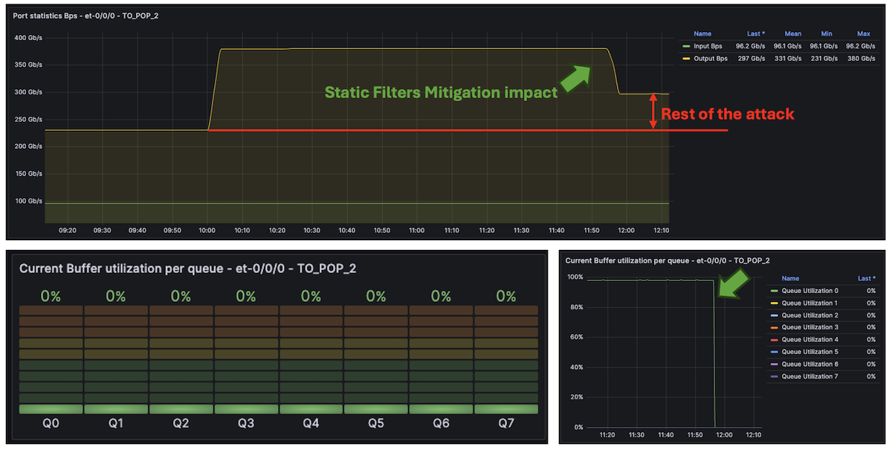

Before doing that, look at the tester results. As expected, that sounds better. The overall legitimate traffic is no longer impacted, and thanks to our DNS protection "pseudo algorithm", even though we heavily police DNS traffic (attacks), our legitimate DNS traffic between Internet DNS servers and our recursive DNS server remains safe.

Table: Legitimate flows status

| Type of traffic | Direction | Tx L1 Rate (bps) | Rx L1 Rate (bps) | Tx Rate (fps) | Rx Rate (fps) |
|:--|:--|:--|:--|:--|:--|
| Legitimate Downstream customer traffic | AE0 to AE2 | 239,904,625,976 | 239,904,551,270 | 30,445,773 | 30,445,853 |
| Legitimate DNS Traffic | AE0 to AE2 | 197,911,212 | 197,911,102 | 197,912,098 | 89,623 |
| Legitimate Upstream customer traffic | AE2 to AE0 | 100,000,000,350 | 100,000,007,927 | 12,690,808 | 12,690,808 |

To clean the remaining attack, we need to rely on an external solution to provide us with dynamic signatures. In our example, the MX301 exports IPFIX flow statistics to an external collector. We assume the external solution provides us with the attack signatures as fast as possible. On MX, the minimum flow-inactive-timeout and flow-active-timeout can be set to 10 seconds. If this is not fast enough, you may rely on the Inline Monitoring solution, which is cacheless.

Note: a solution like Corero, which is fully integrated with the MX portfolio, including the MX301, might be another way to detect and mitigate dynamic signatures, thanks to dynamic flexible match filters pushed into the ephemeral DB.

In our example, as we rely on IPFIX with a cache set to the minimum (10 seconds), the external solution should probably identify these signatures in 15 to 20 seconds:

- **TCP Flood**: 192.168.1.1/32 - Source IP: Random ,Äì Destination Ports: 1024, 1025, 1026, 5000 ,Äì Source Ports: Random
- **UDP DNS**: Destination IP 192.168.1.1/32 - Source IP: Random - Destination Ports: Random ,Äì Source Ports: 53
- **UDP Fragments**: Destination IP 192.168.1.1/32 - Source IP: Random

Once again, we assumed that the external solution would generate three FlowSpec rules covering these signatures and propagate them via BGP to our MX301. If we analyze the inetflow.0 table, we can see these three new rules, added to the existing 2K rules, which should completely clean the remaining attack:

```
lab@rtme-mx301-01> show route table inetflow.0 

inetflow.0: 2003 destinations, 2003 routes (2003 active, 0 holddown, 0 hidden)
+ = Active Route, - = Last Active, * = Both

192.168.1.1,*,proto=6,dstport=1024,=1025,=1026,=5000/term:2            
                   *[Flow/5] 00:01:28
                       Fictitious
192.168.1.1,*,proto=17,srcport=53/term:3            
                   *[Flow/5] 00:01:28
                       Fictitious
192.168.1.1,*,proto=17,frag:02/term:4            
                   *[Flow/5] 00:01:28
                       Fictitious
```

Finally, we could look at the telemetry interface statistics:

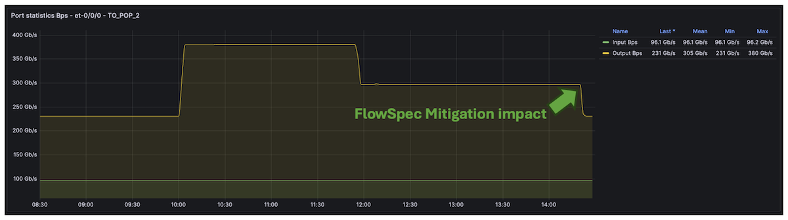

Also, by default on MX, FlowSpec route accounting is enabled, providing per-rule bytes/packets both via CLI and streaming Telemetry:

```
lab@rtme-mx301-01> show firewall filter __flowspec_default_inet__ 

Filter: __flowspec_default_inet__                            
Counters:
Name                                                                            Bytes              Packets [...]
192.168.1.1,*,proto=17,frag:02                                               112800117306             77154663
192.168.1.1,*,proto=17,srcport=53                                            112799588062             77154301
192.168.1.1,*,proto=6,dstport=1024,=1025,=1026,=5000                       14815652138069          85147901488
[...]
```

Note: if you don't need FlowSpec rules accounting, you could disable it by configuring: set routing-options flow no-per-route-accounting
In our case, we kept this feature enabled by default, so we could leverage the telemetry solution to export those statistics:

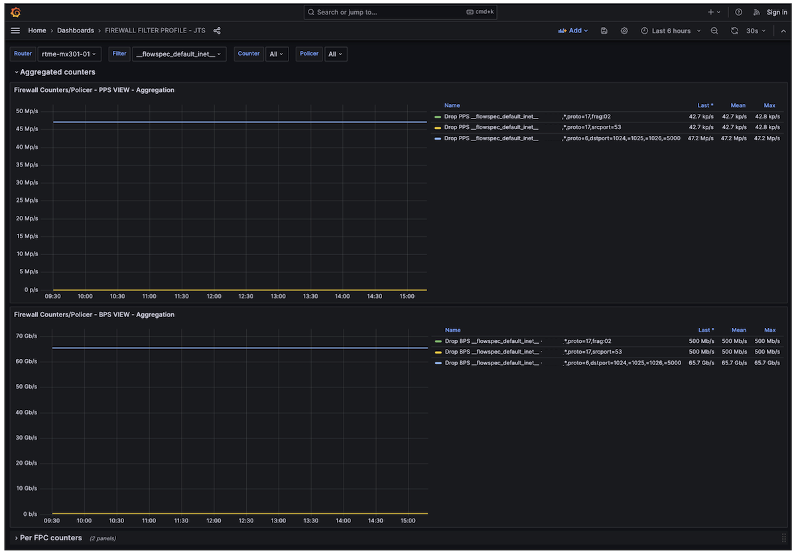

Remember, uRPF and static mitigation filters have no latency. Once the attack starts, these two initial filtering solutions work immediately. The dynamic signature mitigation could take more or less time depending on the flow protocol used (IPFIX, IMON, sFLOW,Ä), the detection mechanism, and the countermeasure approach used (BGP FlowSpec, dynamic filters,Ä).

## The Cherry on Top of This Cake

This last section is not directly related to filtering, but I wanted to wrap up the article with another touch of streaming telemetry and our newest MX301. Thanks to the "power monitoring" sensor, we can check the power consumption of the MX301 device while under attack, with all the discussed features enabled and at the current scaling + 50% of traffic ,Äì as seen below, that's pretty low, less than 250W (or ~0.35W/Gbps as shown on the graph)

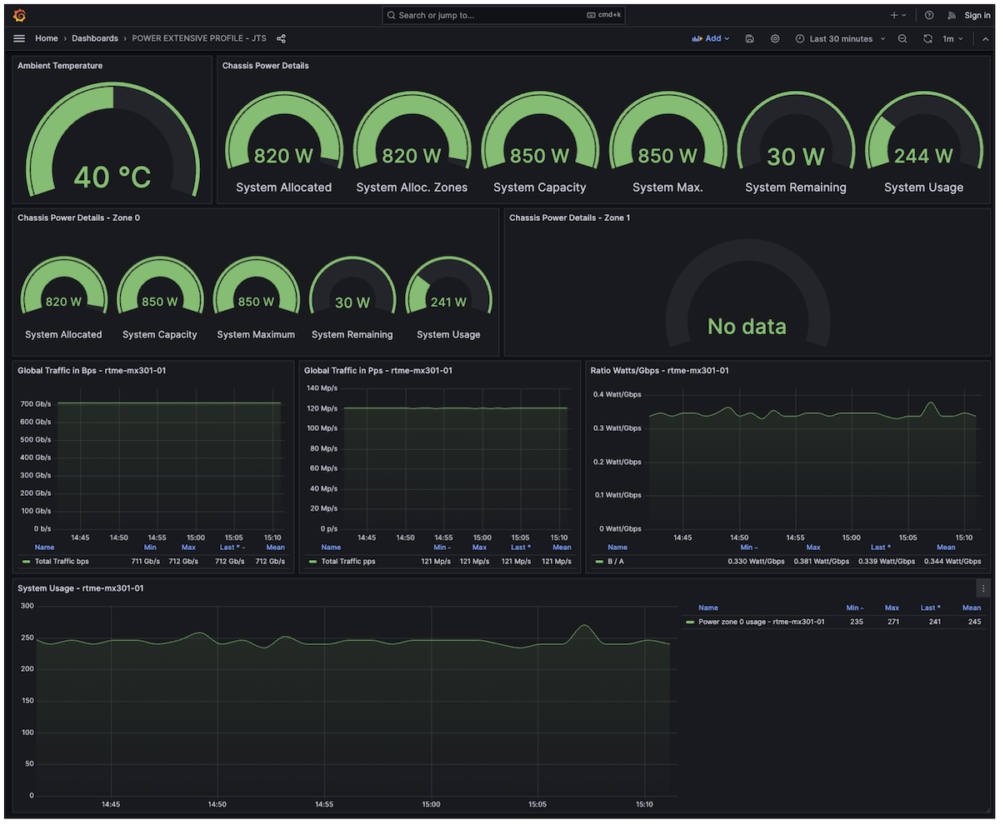

## Conclusion

In this article, we used the newest MX301 platform to illustrate a powerful improvement in Junos/Trio FlowSpec performance. We showed how to leverage this new feature, combined with other components of the Juniper filtering toolkit, to make the MX301 a flexible and robust secure routing gateway. The telemetry stack and rich data-plane sensors also provide real-time observability to NOC and 24/7 teams, enabling monitoring of the benefits of attack countermeasures and/or helping tune static policers over time. All of these features are fully applicable across the entire MX portfolio for both IPv4 and IPv6 traffic.

### Links

- [1] [https://juniper.github.io/techposts/mx301-high-performance-flowspec-without-compromise/article](https://juniper.github.io/techposts/mx301-high-performance-flowspec-without-compromise/article)
- [2] [https://juniper.github.io/techposts/mx301-deepdive/article](https://juniper.github.io/techposts/mx301-deepdive/article)
- [3] [https://bgp.potaroo.net ](https://bgp.potaroo.net)
- [4] [https://github.com/door7302/openjts ](https://github.com/door7302/openjts)
- [5] [https://fastnetmon.com/2025/07/30/understanding-volumetric-amplification-ddos-attacks/](https://fastnetmon.com/2025/07/30/understanding-volumetric-amplification-ddos-attacks/)
- [6] [https://qrator.net/library/learning-center/Ddos/What-Are-Amplification-DDoS-Attacks](https://qrator.net/library/learning-center/Ddos/What-Are-Amplification-DDoS-Attacks)

## Glossary

- AE: Aggregated Ethernet
- ASIC: Application-Specific Integrated Circuit
- BCP38: Best Current Practice 38 (ingress filtering to prevent IP spoofing)
- BGP: Border Gateway Protocol
- DNS: Domain Name System
- DSCP: Differentiated Services Code Point
- DDoS: Distributed Denial of Service
- FIB: Forwarding Information Base
- FLT: Filter (in "FlowSpec FLT Acceleration")
- FPC: Flexible PIC Concentrator
- FS / FlowSpec: BGP Flow Specification
- Gbps: Gigabits per second
- IMIX: Internet Mix (typical Internet traffic mix)
- IPFIX: IP Flow Information Export
- IPv4: Internet Protocol version 4
- IPv6: Internet Protocol version 6
- ISP: Internet Service Provider
- JFlow: Juniper Flow Monitoring (inline-jflow)
- L1: Layer 1 (physical layer)
- L2: Layer 2 (data-link layer)
- L3: Layer 3 (network layer)
- LAG: Link Aggregation Group
- LDP: Label Distribution Protocol
- LSP: Link-State Packet (IS-IS)
- Mbps: Megabits per second
- MPLS: Multiprotocol Label Switching
- MX: Juniper MX Series router
- NOC: Network Operations Center
- NTP: Network Time Protocol
- ONCRPC: Open Network Computing Remote Procedure Call
- PIC Edge: Prefix Independent Convergence Edge
- PFE: Packet Forwarding Engine
- QoS: Quality of Service
- RaaS: Routing as a Service
- RED: Random Early Detection
- RE: Routing Engine
- RIB: Routing Information Base
- RTT: Round-Trip Time
- RTBH: Remote Triggered Black Hole
- sRTBH: Source-based Remote Triggered Black Hole
- sFLOW: Sampled Flow
- SNMP: Simple Network Management Protocol
- SSDP: Simple Service Discovery Protocol
- TCP: Transmission Control Protocol
- UDP: User Datagram Protocol
- uRPF: Unicast Reverse Path Forwarding
- UPnP: Universal Plug and Play
- VIP: Virtual IP
- VRF: Virtual Routing and Forwarding
