# MX301 Deepdive

**David Roy - 11/24/2025**

Let's explore the capabilities of the Juniper Networks MX301 Universal Routing Platform, a 1RU edge router built on Trio 6 silicon that delivers up to 1.6 Tbps full-duplex throughput, supports a broad range of interface speeds from 1GE to 400GE, and integrates features like hardware-accelerated MACsec/IPsec. The article details system architecture, chassis design, port mapping, and targeted use-cases---highlighting how the MX301 extends the MX10K family into more compact deployments for both enterprise and service-provider environments.

## Introduction

The Juniper Networks MX301 Universal Routing Platform is a compact, high-performance 1RU edge router designed for next-generation networks. It's the newest member of the MX family. Delivering up to 1.6 Tbps full-duplex throughput with exceptional density and efficiency, it consumes as little as 0.3 W per Gbps, making it ideal for service providers, cloud operators, MSOs, and enterprises at scale.

Built on Trio 6 silicon, the MX301 supports a wide range of high-density interfaces (1GE to 400GE) for flexible deployment at the WAN edge and AI edge clustering. Integrated hardware acceleration provides uncompromised security with line-rate MACsec on all ports and inline IPsec encryption. At the same time, Junos OS ensures seamless compatibility with existing MX Series platforms and full lifecycle automation. MX301 is also Class C Timing compliant.

The MX301 will launch in Jan-2026 with Junos 25.4R1 with the same feature set as MX304. The recommended release for the MX301 will be 25.4R1-S2.

## Targeted use-cases

The MX301 is designed to address a wide range of deployment scenarios, providing flexibility and high performance in a compact 1RU form factor. Its targeted use cases can be grouped into two main segments:

### Enterprise

The MX301 supports critical enterprise network functions, including:

- Enterprise WAN Edge
- Enterprise Internet Gateway (Peering)
- Enterprise CPE
- Enterprise Backbone (Core)
- Data Center Gateway (DC-GW) and DC Edge

### Service Provider

For service providers, the MX301 is well-suited for a variety of roles, such as:

- Small and Medium Peering Routers
- Distributed BNG (Broadband Network Gateway)
- High-speed Edge
- Internet PE
- Business PE
- Route Reflector

With this broad range of supported use cases, the MX301 delivers the performance, versatility, and reliability required for both enterprise and service provider environments. Let's take a closer look at the MX301.

## Chassis design

The MX301 chassis model is MX301-HW-BASE. It has a 1RU form factor, and its front panel is shown in the figure below.

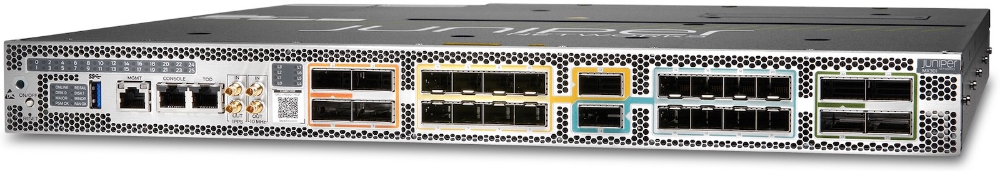

The key chassis specifications are listed in Table 1 below.

Table: MX301 Chassis Specifications*

| Specification | Details |
|:--|:--|
| Dimensions (W x H x D) | 1.75 x 17.3 x 17.7 inches (4.45 x 44 x 45 cm) |
| Maximum weight | 66.1 lbs (30 kg) |
| Rack mounting | 2/4-post rack mounting |
| Power system rating | 2 PSMs, AC, DC, HV-AC/DC (1+1 redundancy) |
| Typical power consumption | <300 W Typical (275W to 300W at 25C, not including optics power) |
| Operating temperatures | 32deg to 115deg F (0deg to 46deg C) at sea level |

The MX301-HW-BASE is a fixed form factor, so only a few components are FRUs, as listed in the following table:

Table: List of MX301's FRUs

| FRU Component | SKU | Installation / Slot | Hot-Swappable |
|:--|:--|:--|:--|
| Fan Tray | JNP-FAN3-1RU-BB | Rear, horizontally mounted | Yes |
| Power Supply | JPSU-850WAC/DC/HW-AFO-BB | Rear PSU slots (0, 1) | Yes |

Let's look at the rear side, depicted in Figure 2:

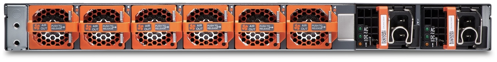

The MX301 is equipped with six fans that provide N+1 redundancy, ensuring airflow from front to back. The cooling system is designed to meet NEBS-3 compliance standards.

For power, the chassis includes two power supply units (PSUs) with 1+1 redundancy. The PSUs are highly power-efficient, typically consuming less than 500W, and support AC, DC, or HV input, depending on deployment requirements.

## The Embedded Routing Engine

The MX301 has a built-in routing engine. The RE connectivity is accessible from the front panel (left side). The following figure zooms in on this specific part:

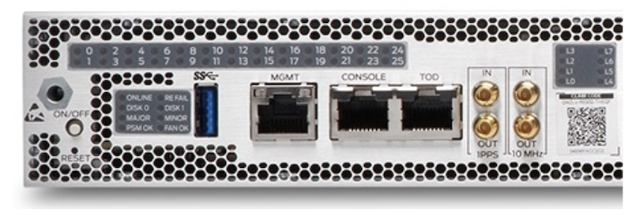

This built-in RE provides the following resources:

- Intel 10-core (20-thread) CPU, 3.0 GHz, with QAT
- TPM 2.0 module for security (Trusted Platform Module 2.0)
- 128 GB DDR4 memory
- 2x internal 200 GB SSDs
- BITS and GPS clock support
- 1 console port / 1 Ethernet management port
- 1 external USB

An important difference between the MX301 and MX304 Routing Engines is the presence of the Intel QuickAssist Technology (QAT) module. QAT is a hardware accelerator integrated into certain Intel chipsets, CPUs, and add-in cards. Instead of running some algorithms in software on the CPU, QAT uses a dedicated hardware engine to perform them faster and more efficiently, freeing CPU resources for other tasks. QAT accelerates operations such as:

- Cryptography: TLS/SSL, IPsec, disk encryption, VPNs, etc.
- Compression/Decompression: zlib/deflate, gzip, and similar formats.

At the time of writing, the plan is to utilize QAT to enhance the Inline IPsec control plane performance significantly.

> ***Note: This feature leveraging QAT is scheduled for release 26.2, but the timeline may change. Please check with your Juniper or HPE representative for the latest updates.***

Another enhancement in the MX301's Routing Engines is the TPM v2 module, which provides stronger security features, improved cryptographic protocols, and secure storage for passwords, encryption keys, and certificates. The main differences between TPM v1 and TPM v2 are summarized in the table below.

Table: Main TPM v1.2 and v2 differences

| Feature | TPM 1.2 | TPM 2.0 |
|:--|:--|:--|
| Hash algorithms | SHA-1 only | SHA-1, SHA-2 family, SHA-3 (opt) |
| Public key crypto | RSA only | RSA + ECC |
| Symmetric crypto | AES-128 only | AES-128/256, SM4, Camellia (opt) |
| PCRs | 24, SHA-1 only | 24+, selectable hash algo |
| Hierarchy model | Single | Multiple (platform, storage, etc.) |
| NV storage | Limited | Flexible, supports counters/data |
| Status | Legacy / deprecated | Current & required going forward |

The software architecture of this platform differs slightly from that of other Routing Engines. This 1RU system includes a built-in FPC that does not have a dedicated CPU. In comparison, the MX304's built-in FPC and all line cards in the MX10K modular chassis, each have their own CPU.

Instead, the MX301 leverages its enhanced RE's CPU to virtualize the line card microcode, called the Universal Line Card (ULC), in the same way it virtualizes the Junos VM.

The resulting software architecture, implemented directly on the routing engine hardware, is illustrated below.

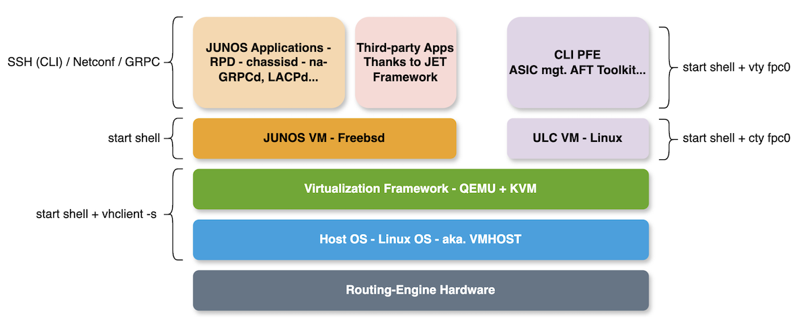

You can verify this dual-VM architecture by connecting to the host operating system and running the "virsh list" command. You should see two virtual machines:

```
bob@mx301> start shell 
bob@mx301:~ # su
bob@mx301:~ # vhclient -s
bob@mx301-node:~# virsh list 
 Id   Name     State
------------------------
 1    vjunos   running
 2    vULC     running
```

As shown, in addition to the standard vJunos VM, there is a second VM named vULC, dedicated to data-plane management. We can use another virsh command to display, for each VM, the resource allocation:

```
bob@mx301> start shell 
bob@mx301:~ # su
bob@mx301:~ # vhclient -s
Last login: Tue Sep 30 12:38:46 2025 from 192.168.1.2
bob@mx301-node:~# virsh dominfo vjunos
Id:             1
Name:           vjunos
UUID:           41f2c1f0-fe92-4f3e-a152-8f69a0f39a0a
OS Type:        hvm
State:          running
CPU(s):         8
CPU time:       694182.3s
Max memory:     83886080 KiB
Used memory:    83886080 KiB
<-- trucated output -->

bob@mx301-node:~# virsh dominfo vULC
Id:             2
Name:           vULC
UUID:           433afdfa-5739-43db-8172-c66f3f8f3252
OS Type:        hvm
State:          running
CPU(s):         6
CPU time:       518780.6s
Max memory:     33554432 KiB
Used memory:    33554432 KiB
<-- trucated output -->
```

As shown, the Junos VM has 8 vCPUs and ~80 GB of RAM, whereas the ULC VM has 6 vCPUs and ~32 GB of RAM. The table below summarizes the routing-engine specifications:

Table: MX301 RE Specification Summary

| Model | MX301-RE |
|:--|:--|
| Cores | 10 |
| vCPU | 20 |
| CPU Clock | 3GHz |
| QAT | Yes |
| TPM | v2.0 |
| DRAM | 128GB |
| Disks | 2x 200GB |
| Junos VM vCPU | 8 |
| Junos VM Mem | ~80 GB |
| ULC VM vCPU | 6 |
| ULC VM Mem | ~32 GB |

## MX301 port connectivity

The MX301 is built around a single Trio 6 ASIC. It offers the same feature set and scaling capabilities as one MX304's LMIC, which is based on the same Trio generation.

Let's verify this:

```
bob@mx301> start shell 
bob@mx301:~ # su
bob@mx301:~ # vty fpc0.0 

LNX-FPC0(vty)# show jspec client    

 ID       Name
<-- trucated output -->      
  1       YTCHIP[0]
```

The Trio 6 ASIC is made of two slices or PFE. Each has a capacity of 800Gbps full duplex. We may confirm the presence of the two 800GE PFEs by issuing the following commands:

```
bob@mx301> show chassis fpc 0 detail 
Slot 0 information:
  State                               Online    
  Total CPU DRAM                 32768 MB
  Total HBM                      8192 MB
  FIPS Capable                        True  
  Start time                          2025-11-12 07:56:38 PST
  Uptime                              6 minutes, 11 seconds
  Max power consumption            500 Watts
  Operating Bandwidth             1600 G
 
PFE Information:
 
  PFE  Power ON/OFF  Bandwidth         SLC
  0    ON            800G                
  1    ON            800G   
```

This single ASIC connects the 26 cages on the front panel:

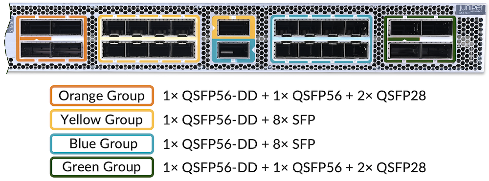

As seen in the above picture, there are four groups of ports, also known as port groups, distinguished by color:

- **Orange Group:** 1x QSFP56-DD + 1x QSFP56 + 2x QSFP28
- **Yellow Group:** 1x QSFP56-DD + 8x SFP
- **Blue Group:** 1x QSFP56-DD + 8x SFP
- **Green Group:** 1x QSFP56-DD + 1x QSFP56 + 2x QSFP28

Each port group has a maximum capacity of 400 Gbps and cannot be oversubscribed. This means that, depending on your port speed configuration, some ports may be automatically disabled.

Note: Once available online, please refer to the MX301 port checker for validating the supported configuration.

This is also important to note that each group operates independently. The table below shows the MX301 port density, per interface speed:

Table: MX301 Port Density

| Interface | Per chassis port density |
|:--|:--|
| 1GE | 32 (breakout) |
| 10GE | 32 (breakout) |
| 25GE | 32 (breakout) |
| 40GE | 6 (Native) |
| 50GE | 32 (breakout) |
| 100GE | 16 (Native) |
| 400GE | 4 (Native) |

Note: For native 1G, the MX301 has no restriction and can support jumbo frames up to 12K bytes on 1GE ports.

## Ports Capability

The following Figure 6 provides the direct mapping between each physical port and its port-group and PFE instance:

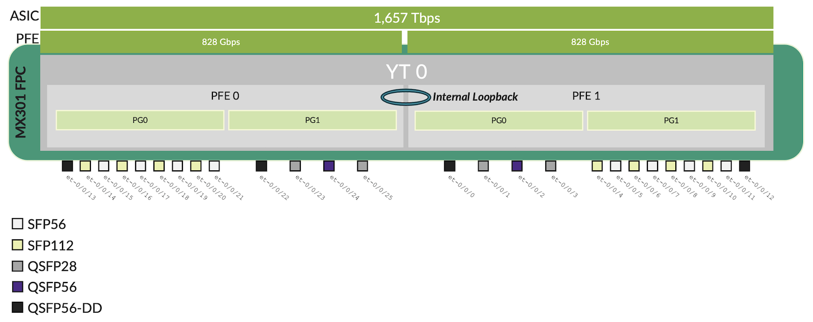

The table below summarizes the PIC port speed capability for the MX301.

Table: MX301 Port Speed/Type Mapping

| PIC | Ports | Port Type | Port Speed |
|:--|:--|:--|:--|
| 0 | 0 | QSFP56-DD | 1x1GE1x10GE1x25GE8x50GE1x100GE2x100GE3x100GE4x100GE1x400GE |
| 0 | 1, 3 | QSFP28 | 1x1GE1x10GE1x25GE4x1GE4x10GE4x25GE1x40GE1x100GE |
| 0 | 2 | QSFP56 | 1x1GE1x10GE1x25GE1x100GE |
| 0 | 4-11 | SFP56 | 1x1GE1x10GE1x25GE1x50GE |
| 0 | 12 | QSFP56-DD | 1x1GE1x10GE1x25GE1x40GE8x50GE1x100GE2x100GE3x100GE4x100GE1x400GE |
| 0 | 13 | QSFP56-DD | 1x1GE1x10GE1x25GE1x40GE8x50GE1x100GE2x100GE3x100GE4x100GE1x400GE |
| 0 | 14-21 | SFP56 | 1x1GE1x1GE1x25GE1x50GE |
| 0 | 22 | QSFP56-DD | 1x1GE1x10GE1x25GE8x50GE1x100GE2x100GE3x100GE4x100GE1x400GE |
| 0 | 23, 25 | QSFP28 | 1x1GE1x10GE1x25GE4x1GE4x10GE4x25GE1x40GE1x100GE |
| 0 | 24 | QSFP56 | 1x1GE1x10GE1x25GE1x100GE |

The CLI below shows similar indications for each port speed and channelization capabilities.

Note: Remember, there is only one PIC (0) since there is a single Trio 6 ASIC.

```
bob@mx301> show chassis pic fpc-slot 0 pic-slot 0 <<< FPC and PIC slot are always 0
FPC slot 0, PIC slot 0 information:
  Type                             MRATE PIC 4x400G/14x100G/8x50G
  State                            Ready     
  PIC version                      0.0

Port speed information:

  Port  PFE  Port-Group      Capable Port Speeds
  0      1       0          1x1GE, 1x10GE, 1x25GE, 8x50GE, 100GE, 2x100GE, 3x100GE, 4x100GE, 400GE
  1      1       0          1x1GE, 1x10GE, 1x25GE, 4x1GE, 4x10GE, 4x25GE, 40GE, 100GE
  2      1       0          1x1GE, 1x10GE, 1x25GE, 100GE
  3      1       0          1x1GE, 1x10GE, 1x25GE, 4x1GE, 4x10GE, 4x25GE, 40GE, 100GE
  4      1       1          1x1GE, 1x10GE, 1x25GE, 1x50GE, 100GE
  5      1       1          1x1GE, 1x10GE, 1x25GE, 1x50GE
  6      1       1          1x1GE, 1x10GE, 1x25GE, 1x50GE, 100GE
  7      1       1          1x1GE, 1x10GE, 1x25GE, 1x50GE
  8      1       1          1x1GE, 1x10GE, 1x25GE, 1x50GE, 100GE
  9      1       1          1x1GE, 1x10GE, 1x25GE, 1x50GE
  10     1       1          1x1GE, 1x10GE, 1x25GE, 1x50GE, 100GE
  11     1       1          1x1GE, 1x10GE, 1x25GE, 1x50GE
  12     1       1          4x1GE, 4x10GE, 4x25GE, 40GE, 8x50GE, 100GE, 2x100GE, 3x100GE, 4x100GE, 400GE
  13     0       0          4x1GE, 4x10GE, 4x25GE, 40GE, 8x50GE, 100GE, 2x100GE, 3x100GE, 4x100GE, 400GE
  14     0       0          1x1GE, 1x10GE, 1x25GE, 1x50GE, 100GE
  15     0       0          1x1GE, 1x10GE, 1x25GE, 1x50GE
  16     0       0          1x1GE, 1x10GE, 1x25GE, 1x50GE, 100GE
  17     0       0          1x1GE, 1x10GE, 1x25GE, 1x50GE
  18     0       0          1x1GE, 1x10GE, 1x25GE, 1x50GE, 100GE
  19     0       0          1x1GE, 1x10GE, 1x25GE, 1x50GE
  20     0       0          1x1GE, 1x10GE, 1x25GE, 1x50GE, 100GE
  21     0       0          1x1GE, 1x10GE, 1x25GE, 1x50GE
  22     0       1          1x1GE, 1x10GE, 1x25GE, 8x50GE, 100GE, 2x100GE, 3x100GE, 4x100GE, 400GE
  23     0       1          1x1GE, 1x10GE, 1x25GE, 4x1GE, 4x10GE, 4x25GE, 40GE, 100GE
  24     0       1          1x1GE, 1x10GE, 1x25GE, 100GE
  25     0       1          1x1GE, 1x10GE, 1x25GE, 4x1GE, 4x10GE, 4x25GE, 40GE, 100GE
```

The default port speed for all ports is 100 Gbps, with interface names beginning with "et-". As on the MX304 LMIC16, you can enable different speeds and/or channelization using the standard set of commands:

- **set chassis fpc 0 pic 0 pic-mode** - configure speed at the chassis level
- **set chassis fpc 0 pic 0 number-of-sub-ports [0-7]** - configure channelization at the chassis level
- **set chassis fpc 0 pic 0 port [port-num] speed** - configure speed at the port level
- **set chassis fpc 0 pic 0 port [port-num] number-of-sub-ports [0-7]** - configure channelization at the port level

> Note: FPC slot and PIC slot are always 0 on the MX301 chassis.

On MX, the port name prefix or suffix depends on the configured speed and whether channelization is enabled. The table below reminds you the naming conventions for different speeds:

Table: MX301 Port Naming Based on Speed

| Speed | Port Name |
|:--|:--|
| 1GE | ge-x/y/z |
| 4x1GE | ge-x/y/z:0-3 |
| 10GE | xe-x/y/z |
| 4x10GE | xe-x/y/z:0-3 |
| 25GE | et-x/y/z |
| 4x25GE | et-x/y/z:0-3 |
| 40GE | et-x/y/z |
| 50GE | et-x/y/z |
| 8x50GE | et-x/y/z:0-7 |
| 100GE | et-x/y/z |
| 2x100GE | et-x/y/z:0-1 |
| 3x100GE | et-x/y/z:0-2 |
| 4x100GE | et-x/y/z:0-3 |
| 400GE | et-x/y/z |

## Example of port configuration

For this section, we refer to this picture where the four port-groups are highlighted and numbered from 1 to 4:

- PG 1 and PG 4 are made of 4 physical ports
- PG 2 and PG 3 are made of 9 physical ports

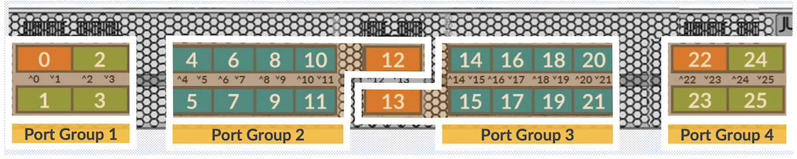

Let's first focus on PG 1 and PG 4. The figure below shows six examples of port combinations. As you can see, depending on the configuration, some ports will be automatically disabled to avoid oversubscription. As mentioned earlier, this mechanism is managed per port group.

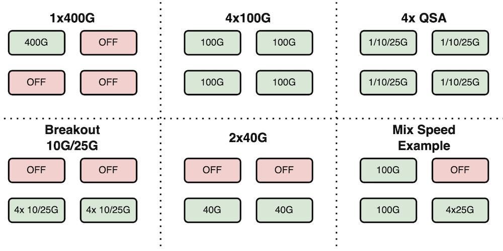

The following figure provides similar examples but this time for port group 2 or 3:

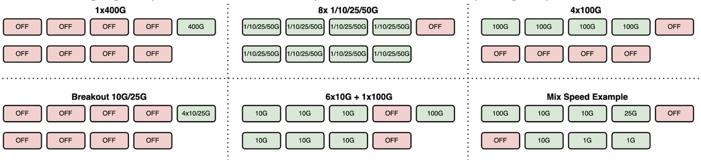

## Maximum Port Density

### 400GE

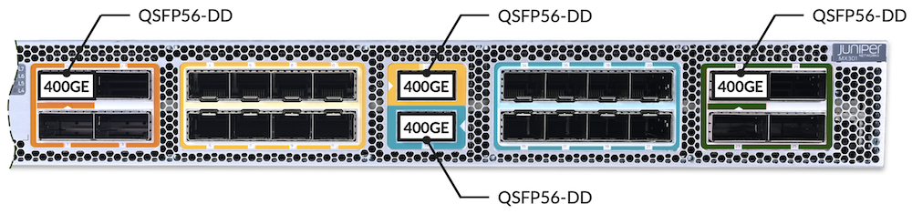

- 4x 400GE QSFP56-DD

### 100GE

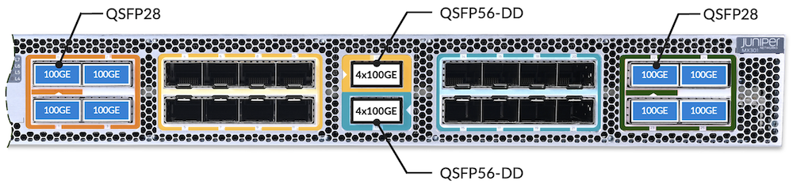

- 16x 100GE
8x QSFP28 (Native) + 2x QSFP56-DD (BreakOut 4x100GE)

### 50GE

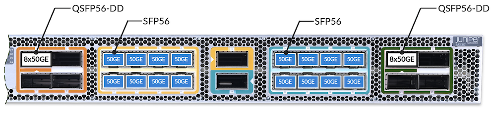

- 32x 50GE
16x SFP56 (Native) + 2x QSFP56-DD (BreakOut 8x50GE)

### 40GE

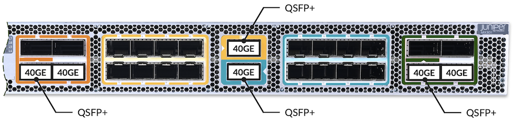

- 6x 40GE QSFP56-DD

### 25GE

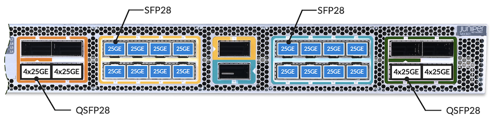

- 32x 25GE
16x SFP28 (Native) + 4x QSFP28 (BreakOut 4x25GE)

### 10GE


- 32x 10GE
16x SFP+ (Native) + 4x QSFP+ (BreakOut 4x10GE)

### 1GE

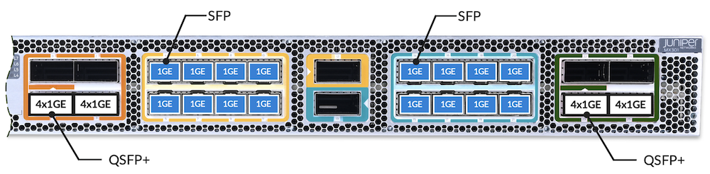

- 32x 1GE
16x SFP (Native) + 4x QSFP+ (BreakOut 4x1GE)

## MX301 Internal Architecture

In this section, we will examine the internal architecture of the MX301, as shown in the figure below.

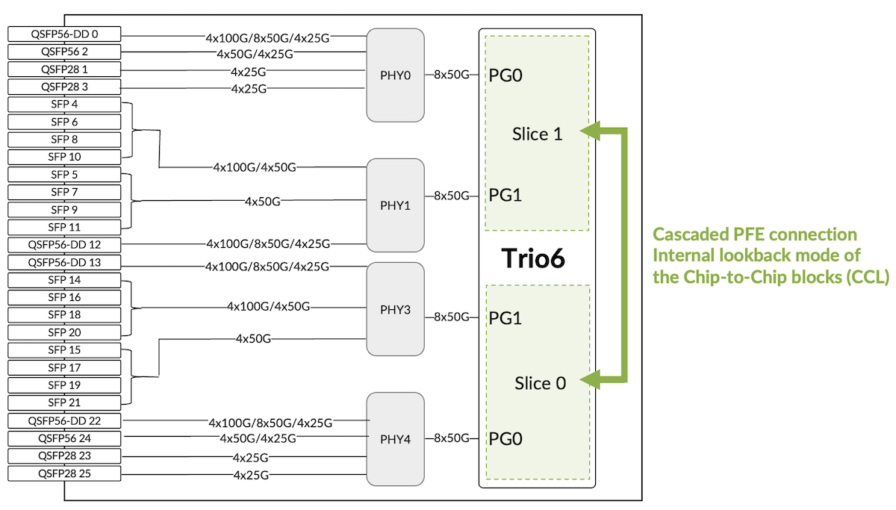

As you can see, there is a single Trio 6 chipset that integrates the two PFEs in one package. The sixth-generation Trio chipset (also known as YT) operates in Run-to-Completion mode. This ASIC features several innovations, including a new filtering acceleration block and an embedded crypto engine for inline IPsec. The MX301 also supports Class C timing and provides line-rate MACsec on all ports. The chassis can handle up to 10 million prefixes in the FIB, H-QoS with up to five levels, and 128K queues

Note: For more information on the Trio 6 ASIC, see Techpost [1]

In Figure 10, there are also PHY components. The PHYs are additional components, part of the data plane, and interconnected to the PFEs.  PHY works closely with SerDes and is responsible for adapting, boosting, or converting signals between the PFE and the network interfaces. A SerDes (Serializer/Deserializer) is a high-speed circuit that converts parallel data into serial data for transmission over a single high-speed lane.

PHYs are generally classified into three types:

- **GearBoxes** (or Forward GearBoxes): adapt the SerDes speed and encoding to connect to higher-speed ports.
- **Reverse GearBoxes** (RGBs): adapt the SerDes speed and encoding to connect to lower-speed links.
- **Retimers**: do not change the SerDes speed or encoding but amplify the signal to extend its reach.

In the MX301, we use PHY as GearBoxes and/or Reverse GearBoxes to offer a wide range of port speeds.

As also shown in Figure 10, the MX301 does not include a separate fabric chip.  This is a Fabric-Less design.

## Conclusion

The MX301 expands the MX10K Series by providing a compact 1RU solution while retaining the power and features of larger models, such as the MX304 or the LC9600 MX10K. It is built on Trio 6 technology, delivering a complete set of routing and switching capabilities.
With a full-duplex throughput of 1.6 Tbps, the MX301 can support a wide range of demanding use cases, including enterprise networks, regional peering routers, Route Reflectors, and aggregation scenarios, as well as BNG.

In summary, the MX301 combines performance, compactness, and versatility, extending the capabilities of the MX10K Series while adapting to diverse deployment requirements.

## Useful links

- [1] [https://juniper.github.io/techposts/trio-6-packet-walkthrough/article](https://juniper.github.io/techposts/trio-6-packet-walkthrough/article)

## Glossary

- ASIC: Application-Specific Integrated Circuit
- BITS: Building Integrated Timing Supply
- BNG: Broadband Network Gateway
- CPE: Customer Premises Equipment
- Class C Timing: ITU-T class timing compliance level
- CLI: Command-Line Interface
- DC: Data Center
- DC-GW: Data Center Gateway
- FIB: Forwarding Information Base
- FPC: Flexible PIC Concentrator (built-in line card module)
- FRU: Field-Replaceable Unit
- GPS: Global Positioning System (timing/clock source)
- H-QoS: Hierarchical Quality of Service
- IPsec: Internet Protocol Security
- LC9600: MX10K line card model reference
- LMIC: Line-Module Integrated Card
- MACsec: Media Access Control Security (layer-2 encryption)
- MX10K: Juniper MX10000 Series
- MX301: Juniper Networks MX301 Universal Routing Platform
- NEBS-3: Network Equipment-Building System Level 3 compliance
- PE: Provider Edge
- PFE: Packet Forwarding Engine
- PHY: Physical Layer device
- PIC: Physical Interface Card
- PSM: Power Supply Module
- PSU: Power Supply Unit
- QAT: Intel QuickAssist Technology (crypto/compression acceleration)
- QSFP: Quad Small Form-factor Pluggable
- RE: Routing Engine
- SerDes: Serializer/Deserializer
- SFP: Small Form-factor Pluggable
- Tbps: Terabits per second
- TLS/SSL: Transport Layer Security / Secure Sockets Layer
- TPM: Trusted Platform Module
- ULC: Universal Line Card (virtualized data-plane microcode VM)
- vCPU: Virtual CPU
- VM: Virtual Machine
- VPN: Virtual Private Network
- WAN: Wide Area Network

## Acknowledgments

Thanks to Nicolas Fevrier and Arun Bhat for the document review.
