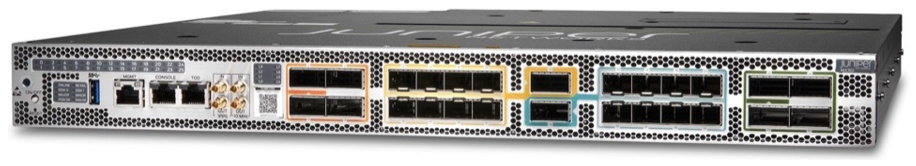
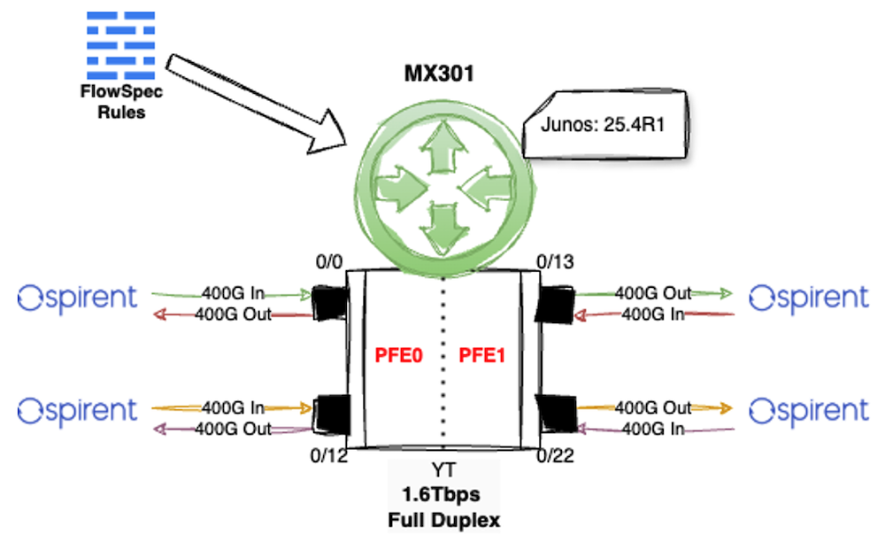

# MX301 High-Performance FlowSpec Without Compromise

**David Roy - 04/24/2026**

Explore how Juniper's MX301 router, using Junos 24.4 and its Trio 6 ASIC's specialized Fast Lookup Table (FLT), accelerates BGP FlowSpec rule processing so that even large and complex FlowSpec filters can be applied without degrading throughput by offloading 5-tuple matches to hardware.

## Introduction

The Juniper Networks MX301 is the newest member of the MX family. We presented this new platform in the previous Techpost [1].



In this article, we will use MX301 platform to highlight a relatively recent MX/Trio feature introduced in Junos 24.4: **FlowSpec Hardware Acceleration**. As you may know, the Trio ASIC leverages its embedded, specialized filtering block, called **FLT**, to accelerate processing of complex, large filters (up to 8K terms). This unique capability has already been covered in several TechPosts:

- [Fast Lookup Tuple: An Innovative Filtering Feature](https://juniper.github.io/techposts/fast-lookup-tuple-an-innovative-filtering-feature/article) [2]
- [Packet Filtering on Juniper Silicon](https://juniper.github.io/techposts/packet-filtering-on-juniper-silicon/article) [3]

> *Note: We use MX301 for illustration purposes; everything covered in this article is fully applicable to any other MX10K platforms, including the MX304 and other classical MX.*

## Accelerate FS rules with FLT

The goal of this short article is to introduce this new MX capability and explain how it dramatically improves throughput for large-scale, complex FlowSpec rules. In a second article that will follow this first one, we will illustrate a typical use case that leverages this feature, along with other Trio filtering tools, to make our MX301 a powerful filtering gateway.

### Network Topology

To illustrate the new feature, we will use a simple testbed that doesn't represent a typical live architecture but will instead allow us to stress the MX301 platform and the new feature.



Remember, the MX301 is built around a single Trio 6 ASIC, also called the "YT" ASIC. This NPU can handle up to 1.6 Tbps of bidirectional traffic. To test the maximum throughput of this chipset, we used the four QSFP56-DD ports, each running at 400 Gbps.

These ports are:

- et-0/0/0
- et-0/0/12
- et-0/0/13
- and et-0/0/22.

As discussed in the [YT deep dive](https://juniper.github.io/techposts/trio-6-packet-walkthrough/article) [4], the Trio 6 internally consists of two slices, also known as PFEs. Each slice/PFE provides 800 Gbps of full-duplex forwarding capacity. On the MX301, ports et-0/0/0 and et-0/0/12 are connected to the first PFE, while et-0/0/13 and et-0/0/22 are connected to the second PFE.

### Standard 2K FlowSpec Rules Test

First, we will provision standard, simple 2,000 BGP FlowSpec rules. What I call "standard and simple" rules are only those with a standard 5-tuple: IP source/destination addresses and ports, plus IP protocol. Each rule will look like this one (using 3-Tuple): a protocol, a random destination host, and a random destination port. Each rule will be unique and non-aggregable.

```
match {
    protocol udp;
    destination-port 40795;
    destination 25.151.12.56/32;
}
then discard;
```

Once provisioned, we should see these 2K rules in the inetflow.0 table:

```
lab@rtme-mx301-01> show route table inetflow.0     

inetflow.0: 2000 destinations, 2000 routes (2000 active, 0 holddown, 0 hidden)
+ = Active Route, - = Last Active, * = Both
```

By default, and prior to release 24.4, a BGP FlowSpec rule is configured as a DMEM filter (see [2] and [3]). This means the Trio ASIC run-to-completion microcode fully handles it. For simple matches, as above, even with 2K FlowSpec rules, which correspond to a filter with 2K terms, we shouldn't see any visible impact on the ASIC throughput. To prove that, as shown in Figure 1, we connected 4x400GE to our Spirent tester. We programmed bidirectional flows between pairs of ports. For this stress test, we used a standard IMIX for Service Provider packet size distributions. Below are the results seen by the tester.

Table: MX301 -- IMIX Throughput results with 2K FS standard rules.

| Port Name | Tx L1 Rate (bps) | Rx L1 Rate (bps) | Total Tx Rate (fps) | Total Rx Rate (fps) | Tx L1 Rate % | Rx L1 Rate % |
|:--|:--|:--|:--|:--|:--|:--|
| Port-1 | 399,200,041,647 | 399,200,020,818 | 50,661,743 | 50,661,673 | 99.8 | 99.8 |
| Port-2 | 399,200,039,759 | 399,200,024,939 | 50,661,656 | 50,661,651 | 99.8 | 99.8 |
| Port-3 | 399,200,040,802 | 399,200,057,869 | 50,661,631 | 50,661,615 | 99.8 | 99.8 |
| Port-4 | 399,200,040,362 | 399,200,049,323 | 50,661,622 | 50,661,643 | 99.8 | 99.8 |

As expected, there is no impact on traffic. In this configuration, the MX301 forwards more than 200 Mpps with 2K rules enabled across all ingress ports (default FS behavior).

### More Complex 2K FlowSpec Rules Test

Real-world attacks are not always simple, and this complexity is reflected in the FlowSpec implementation. You may deal with more exotic match criteria, such as IP flags, TCP flags, packet lengths, or size ranges.

Let's redo the test, but this time by mixing standard rules based on 5-Tuple with more complex FlowSpec rules. So, in addition to the standard 5-tuple fields, we will include a complex match based on packet length, specifically targeting a range of lengths (**worst-case scenario**). We will apply this complex match to 20% of the rules. Thus, we will provision 400 rules similar to this one, along with other rules using more standard match criteria.

```
match {
    protocol udp;
    destination-port 40795;
    packet-length 978-3626;
    destination 25.151.12.56/32;
    source 20.150.0.0/16;
}
then discard;
```

Once again, each rule will be unique, with a random transport protocol, a random source or destination address, and random ports, plus, for 20% of the rules, a random range, corresponding to a range of packet sizes.

If we look at the tester results, with those complex and atypical FlowSpec rules, we could observe an impact on the linerate throughput. Table 2 shows you this impact in detail:

Table: MX301 -- IMIX Throughput results with 2K FS complex rules.

| Port Name | Tx L1 Rate (bps) | Rx L1 Rate (bps) | Total Tx Rate (fps) | Total Rx Rate (fps) | Tx L1 Rate % | Rx L1 Rate % |
|:--|:--|:--|:--|:--|:--|:--|
| Port-1 | 399,200,042,255 | 263,883,203,932 | 50,661,637 | 33,488,862 | 99.8 | 66.103 |
| Port-2 | 399,200,040,542 | 263,899,170,801 | 50,661,590 | 33,490,857 | 99.8 | 66.107 |
| Port-3 | 399,200,041,578 | 265,783,395,682 | 50,661,460 | 33,729,893 | 99.8 | 66.579 |
| Port-4 | 399,200,043,322 | 265,771,420,842 | 50,661,623 | 33,728,482 | 99.8 | 66.576 |

This impact is also visible on interface statistics, as input "resource error":

```
lab@rtme-mx301-01> show interfaces et-0/0/0 extensive | match resource                             
    L2 mismatch timeouts: 0, FIFO errors: 0, Resource errors: 980072068

lab@rtme-mx301-01> show interfaces et-0/0/12 extensive | match resource  
    L2 mismatch timeouts: 0, FIFO errors: 0, Resource errors: 980077831

lab@rtme-mx301-01> show interfaces et-0/0/13 extensive | match resource   
    L2 mismatch timeouts: 0, FIFO errors: 0, Resource errors: 980091442

lab@rtme-mx301-01> show interfaces et-0/0/22 extensive | match resource    
    L2 mismatch timeouts: 0, FIFO errors: 0, Resource errors: 2124863667
```

> Remember: "resource error" means the LUSS (lookup block of the Trio ASIC) is overloaded. In real-world conditions, resource error usually triggers a response similar to back-pressure notifications toward the upstream node(s), thanks to the "Ethernet MAC pauses" mechanism, provided by the flow-control feature, if it's still enabled (by default).

## Use FLT Acceleration

So, to address this traffic impact in complex FlowSpec conditions, why not offload the 5-tuple search to our existing FLT block? Indeed, this acceleration block has been designed to perform 256 searches in parallel, and as presented in [2], it allows us to save ASIC microcode cycles dramatically. By doing this for FlowSpec rules, only the extra matches not supported by FLT will be kept and handled by the ASIC microcode, which could dramatically improve the overall forwarding performance.

This is precisely what we implemented starting from Junos 24.4, thanks to a new FlowSpec knob. This is a non-default feature that needs to be explicitly configured under routing-options flow. Before showing you how to configure this feature and its benefits, here are a few known limitations:

- The FLT acceleration block for FlowSpec rules only handles the 5-tuple match criteria; the ASIC will do additional searches during a second pass.
- The current scaling allows the programming of a maximum of 3,500 FlowSpec rules into the FLT block. Although FLT can handle standard filters with up to 8K terms, we limit it to 3,500 FlowSpec entries. This may change over time and will be notified via the release notes. In case you must install more than 3,500 rules, the system will automatically fall back to the default mode -- meaning installing FlowSpec rules as DMEM entries.

> Note: We usually recommend using FLT for complex standard filters as well. By "complex," we mean filters with 1,000 terms or more. In practice, this also depends on the complexity of each term. A standard 5-tuple match is not considered complex, whereas packet-length matching criteria are.

The activation of this new knob is done globally by applying this line of configuration:

```
set routing-options flow fast-lookup-filter
set routing-options rib inet6.0 flow fast-lookup-filter
```

Let's do it with our existing scaling of 2K complex FlowSpec rules. Once the feature is enabled, you should see the generic filter name "__flowspec_default_inet__" as an "FLT" filter:

```
lab@rtme-mx301-01> show pfe firewall 

Slot 0
Name                                   Index               Token              Current           Config
__default_arp_policer__                17000               2802               DMEM              DMEM
__flowspec_default_inet__              65025               9263282            DMEM              FLT
__auto_policer_template__              65280               1167               DMEM              DMEM
__auto_policer_template_1__            65281               1168               DMEM              DMEM
__auto_policer_template_2__            65282               1169               DMEM              DMEM
```

We can also check the footprint of the FlowSpec rules in the FLT memory partitions. Let's issue the following command. Our 2K rules consume 8 Hardware FLT Filters (each HW FLT filter is a 256-entry filter).

```
lab@rtme-mx301-01> show pfe filter-block fpc 0 

Slot 0
Filters+Segments Used         : 0% (8/3967)
Segmented Filters Used        : 0% (1/128)
Unit 0/1 Prefixes Used        : 1% (2000/196608)
Unit 2/3 Ranges Used          : 4% (1318/32768)
Term Vectors Used             : 0% (101/327680)
Special Term Vectors Used     : 3% (288/8192)
Term Vector Patterns Used     : 0% (65/81920)
HW Segment Memory Used        : 4% (8008/196608)
```

We can now restart our traffic and check the tester results. As seen below, the FLT block helped save so many ASIC cycles, and thus we achieve the same performance as without any FlowSpec rules... Amazing :))

Table: MX301 -- IMIX Throughput results with 2K FS complex rules and FLT acceleration.

| Port Name | Tx L1 Rate (bps) | Rx L1 Rate (bps) | Total Tx Rate (fps) | Total Rx Rate (fps) | Tx L1 Rate % | Rx L1 Rate % |
|:--|:--|:--|:--|:--|:--|:--|
| Port-1 | 399,200,036,493 | 399,199,999,912 | 50,661,647 | 50,661,818 | 99.8 | 99.8 |
| Port-2 | 399,200,041,737 | 399,199,997,903 | 50,661,581 | 50,661,616 | 99.8 | 99.8 |
| Port-3 | 399,200,040,353 | 399,200,013,626 | 50,661,463 | 50,661,583 | 99.8 | 99.8 |
| Port-4 | 399,200,040,036 | 399,200,017,330 | 50,661,626 | 50,661,565 | 99.8 | 99.8 |

In a follow-up article, we will demonstrate this new feature in a more comprehensive and realistic scenario, where the MX301 acts as a filtering routing gateway to protect peering points, critical cloud platforms, and other network infrastructure requiring large-scale security.

## Conclusion

In this article, we demonstrated how the MX301, combined with Junos 24.4, delivers high-performance FlowSpec processing without compromising throughput. By leveraging the new FLT hardware acceleration block, even complex FlowSpec rules - such as those that match on packet-length ranges - can be processed efficiently, freeing up ASIC cycles while maintaining line-rate forwarding.

### External Links

- [1] [https://juniper.github.io/techposts/mx301-deepdive/article](https://juniper.github.io/techposts/mx301-deepdive/article)
- [2] [https://juniper.github.io/techposts/fast-lookup-tuple-an-innovative-filtering-feature/article](https://juniper.github.io/techposts/fast-lookup-tuple-an-innovative-filtering-feature/article)
- [3] [https://juniper.github.io/techposts/packet-filtering-on-juniper-silicon/article](https://juniper.github.io/techposts/packet-filtering-on-juniper-silicon/article)
- [4] [https://juniper.github.io/techposts/trio-6-packet-walkthrough/article](https://juniper.github.io/techposts/trio-6-packet-walkthrough/article)

## Glossary

Here is the acronym-only glossary, without source links:

- ASIC: Application-Specific Integrated Circuit
- BGP: Border Gateway Protocol
- DMEM: Data Memory
- FS: FlowSpec (BGP Flow Specification)
- FLT: Fast Lookup Table (hardware filtering/lookup block in Trio)
- GE: Gigabit Ethernet (e.g., 400GE = 400 Gigabit Ethernet)
- IMIX: Internet Mix (standardized mix of packet sizes for testing)
- L1: Layer 1 (physical layer, used in "Tx/Rx L1 Rate")
- Mpps: Million packets per second
- MX: MX Series router (Juniper carrier-grade router family)
- PFE: Packet Forwarding Engine
- QSFP: Quad Small Form-factor Pluggable (here QSFP56-DD module type)
- RIB: Routing Information Base
- Tbps: Terabits per second
- UDP: User Datagram Protocol
- YT: Internal codename for the Trio 6 ASIC (YT ASIC)
